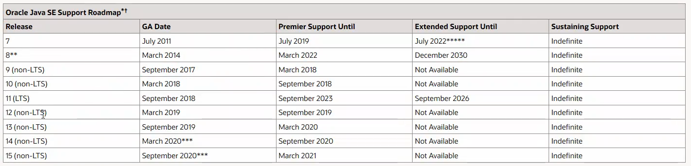
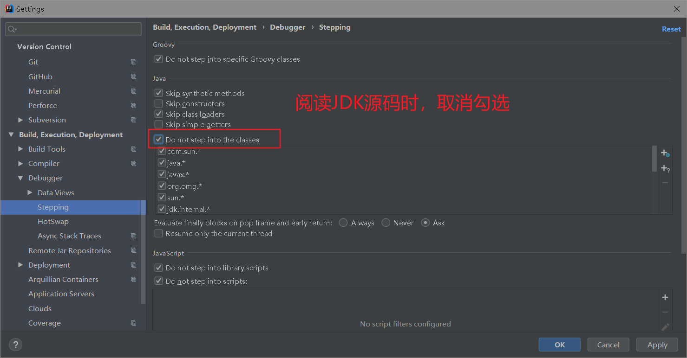

# 为什么

你是否想干这样的事情?

- 学习Java想看看JDK底层实现

- 看底层源码时,想加入说明,帮助理解源码

- 甚至想看看 native方法的实现底层是c/c++实现

  public native byte getByte(long var1)

  public native void putByte (long varl, byte var3)

- 想了解JVM核心文件jvm.dll的底层实现。比如 hotspot和cup、os、 os_ cup和share的代码实现

- 阅读修改JDK源码的环境,并对JDK和Openjdk核心目录做介绍

# 步骤

1. IDEA里创建一个工程JDKSrc

2. 取消勾选如下

   

3.将JDK源码解压到当前工程目录下的文件夹，注意不要放在src目录下，不然会被全部编译，造成卡顿

4. 改变IDEA中设置当前源码的指向路径，工程所在目录
5. Debug就行,可以随便加注释