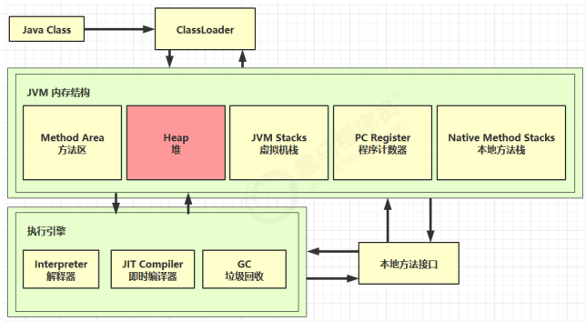
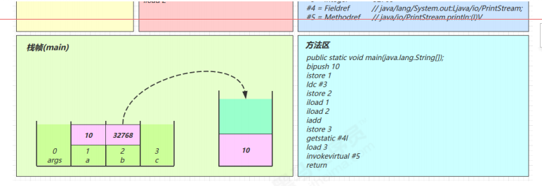
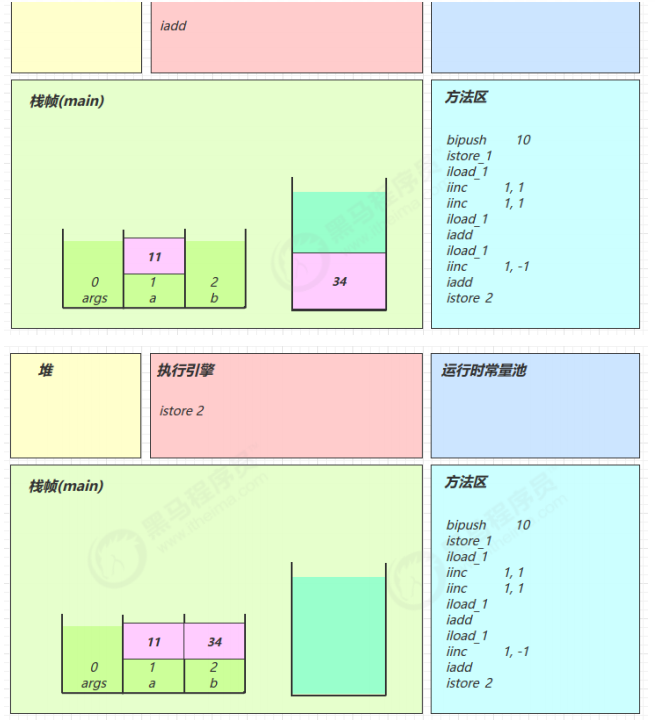
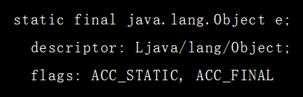
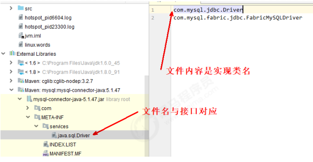

[TOC]


# 第一章 内存结构

## 1. 程序计数器


### 1.1 定义

Program Counter Register 程序计数器（寄存器）

- 作用，是记住下一条jvm指令的执行地址
- 特点
  - 是线程私有的
  - 唯一不会存在内存溢出

### 1.2 作用

```
0: getstatic #20 				// PrintStream out = System.out;
3: astore_1 					// --
4: aload_1 						// out.println(1);
5: iconst_1 					// --
6: invokevirtual #26 			// --
9: aload_1 						// out.println(2);
10: iconst_2 					// --
11: invokevirtual #26 			// --
14: aload_1 					// out.println(3);
15: iconst_3 					// --
16: invokevirtual #26 			// --
19: aload_1 					// out.println(4);
20: iconst_4 					// --
21: invokevirtual #26 			// --
24: aload_1 					// out.println(5);
25: iconst_5 					// --
26: invokevirtual #26 			// --
29: return
```

二进制字节码-->解释器--->机器码--->CPU

前面的数字可以理解为指令对应的地址

0: getstatic #20 	


## 2. 虚拟机栈


### 2.1 定义

Java Virtual Machine Stacks （Java 虚拟机栈）

- 每个线程运行时所需要的内存，就称为虚拟机栈
- 每个栈由多个栈帧（Frame)组成，对应着每次方法调用时所占用的内存

- 每个线程只能有一个**活动栈帧**，对应着当前正在执行的那个方法

IDEA查看栈帧：

最顶部的是活动栈帧


问题辨析

1. 垃圾回收是否涉及栈内存？

   - 不会，也不需要，自动出栈了

2.  栈内存分配越大越好吗？

   官方手册中对于栈内存分配的的规定，默认如下

   

   ​	例如：

   ​    -Xss1m   给虚拟机栈分配1M内存（每个线程的栈分配这么多）

   ​	-Xss1024k

   ​    -Xss1048576

    栈内存分配越大,最大运行的线程数就会减少，一般默认大小就可以了

3. 方法内的局部变量是否线程安全？

   - 如果方法内局部变量没有逃离方法的作用访问，它是线程安全的
   - 如果是局部变量引用了对象，并逃离方法的作用范围，需要考虑线程安全

```java

/**
 * 局部变量的线程安全问题
 */
public class Demo1_17 {
    public static void main(String[] args) {
        StringBuilder sb = new StringBuilder();
        sb.append(4);
        sb.append(5);
        sb.append(6);
        new Thread(()->{
            m2(sb);
        }).start();
    }

    public static void m1() {//线程安全
        StringBuilder sb = new StringBuilder();
        sb.append(1);
        sb.append(2);
        sb.append(3);
        System.out.println(sb.toString());
    }

    public static void m2(StringBuilder sb) {//线程不安全
        sb.append(1);
        sb.append(2);
        sb.append(3);
        System.out.println(sb.toString());
    }

    public static StringBuilder m3() {//线程不安全
        StringBuilder sb = new StringBuilder();
        sb.append(1);
        sb.append(2);
        sb.append(3);
        return sb;
    }
}
```

### 2.2 栈内存溢出

- 栈帧过多导致栈内存溢出(比如递归)
- 栈帧过大导致栈内存溢出

```java

/**
 * 演示栈内存溢出 java.lang.StackOverflowError
 * -Xss256k
 */
public class Demo1_2 {
    private static int count;

    public static void main(String[] args) {
        try {
            method1();
        } catch (Throwable e) {
            e.printStackTrace();
            System.out.println(count);//22796
        }
    }

    private static void method1() {
        count++;
        method1();
    }
}
```

把栈内存设置小一点：


结果：2737

案例二：

对象转化为json

```java
package cn.itcast.jvm.t1.stack;

import com.fasterxml.jackson.annotation.JsonIgnore;
import com.fasterxml.jackson.core.JsonProcessingException;
import com.fasterxml.jackson.databind.ObjectMapper;

import java.util.Arrays;
import java.util.List;

/**
 * json 数据转换
 */
public class Demo1_19 {

    public static void main(String[] args) throws JsonProcessingException {
        Dept d = new Dept();
        d.setName("Market");

        Emp e1 = new Emp();
        e1.setName("zhang");
        e1.setDept(d);

        Emp e2 = new Emp();
        e2.setName("li");
        e2.setDept(d);

        d.setEmps(Arrays.asList(e1, e2));

        // { name: 'Market', emps: [{ name:'zhang', dept:{ name:'', emps: [ {}]} },] }
        ObjectMapper mapper = new ObjectMapper();
        System.out.println(mapper.writeValueAsString(d));
    }
}

class Emp {
    private String name;
    @JsonIgnore
    private Dept dept;

    public String getName() {
        return name;
    }

    public void setName(String name) {
        this.name = name;
    }

    public Dept getDept() {
        return dept;
    }

    public void setDept(Dept dept) {
        this.dept = dept;
    }
}
class Dept {
    private String name;
    private List<Emp> emps;

    public String getName() {
        return name;
    }

    public void setName(String name) {
        this.name = name;
    }

    public List<Emp> getEmps() {
        return emps;
    }

    public void setEmps(List<Emp> emps) {
        this.emps = emps;
    }
}
```

不加@JsonIgnores前栈内存移除异常

加了之后就正常：

```
{"name":"Market","emps":[{"name":"zhang"},{"name":"li"}]}
```

### 2.3 线程运行诊断

#### 案例1：cpu占用过高

```java

//演示 cpu 占用过高
public class Demo1_16 {

    public static void main(String[] args) {
        new Thread(null, () -> {
            System.out.println("1...");
            while(true) {

            }
        }, "thread1").start();


        new Thread(null, () -> {
            System.out.println("2...");
            try {
                Thread.sleep(1000000L);
            } catch (InterruptedException e) {
                e.printStackTrace();
            }
        }, "thread2").start();

        new Thread(null, () -> {
            System.out.println("3...");
            try {
                Thread.sleep(1000000L);
            } catch (InterruptedException e) {
                e.printStackTrace();
            }
        }, "thread3").start();
    }
}

```

定位：

- ​	用top 定位哪个进程对cpu占用过高
- ps H -eo pid,tid,%cpu | grep 进程id （用ps命令进一步定位是哪个线程引起的cpu占用过高）
- jstack 进程id
  - 可以根据线程id 找到有问题的线程，进一步定位到问题代码的源码行号

#### 案例2：程序运行很长时间没有结果

```java
package cn.itcast.jvm.t1.stack;

/**
 * 演示线程死锁
 */
class A{};
class B{};
public class Demo1_3 {
    static A a = new A();
    static B b = new B();


    public static void main(String[] args) throws InterruptedException {
        new Thread(()->{
            synchronized (a) {
                try {
                    Thread.sleep(2000);
                } catch (InterruptedException e) {
                    e.printStackTrace();
                }
                synchronized (b) {
                    System.out.println("我获得了 a 和 b");
                }
            }
        }).start();
        Thread.sleep(1000);
        new Thread(()->{
            synchronized (b) {
                synchronized (a) {
                    System.out.println("我获得了 a 和 b");
                }
            }
        }).start();
    }
}

```

- jsp
  - 获取当前已启动的进程和对应的PID,
- jstack pid


## 3. 本地方法栈

给本地方法native的运行提供内存


## 4. 堆



### 4.1 定义

- Heap 堆
  通过 **new 关键字**，**创建对象都会使用堆内存**
- 特点
  - 它是线程共享的，堆中对象都需要考虑线程安全的问题
  - 有垃圾回收机制 

### 4.2 堆内存溢出

**java.lang.OutOfMemoryError: Java heap space**

```java

/**
 * 演示堆内存溢出 java.lang.OutOfMemoryError: Java heap space
 * -Xmx8m
 */
public class Demo1_5 {

    public static void main(String[] args) {
        int i = 0;
        try {
            List<String> list = new ArrayList<>();
            String a = "hello";
            while (true) {
                list.add(a); // hello, hellohello, hellohellohellohello ...
                a = a + a;  // hellohellohellohello
                i++;
            }
        } catch (Throwable e) {
            e.printStackTrace();
            System.out.println(i);
        }
    }
}

```

修改堆内存

修改之前26次后溢出

-Xmx8m   修改堆内存为8M

只循环了17次

### 4.3 堆内存诊断

1.  jps 工具
   - 查看当前系统中有哪些 java 进程
2.  jmap 工具
   - 查看堆内存（某时刻）占用情况 jmap - heap 进程id
3.  jconsole 工具
   - 图形界面的，多功能的监测工具，可以连续监测

```java
package cn.itcast.jvm.t1.heap;

/**
 * 演示堆内存
 */
public class Demo1_4 {

    public static void main(String[] args) throws InterruptedException {
        System.out.println("1...");
        Thread.sleep(30000);
        byte[] array = new byte[1024 * 1024 * 10]; // 10 Mb
        System.out.println("2...");
        Thread.sleep(20000);
        array = null;
        System.gc();
        System.out.println("3...");
        Thread.sleep(1000000L);
    }
}

```


jconsole查看


案例

- 垃圾回收后，内存占用仍然很高
- jvisualvm工具


点击dump


## 5.方法区


### 5.1 定义

JVM规范：https://docs.oracle.com/javase/specs/jvms/se8/html/jvms-2.html

### 5.2 组成

方法区与Java堆一样，是各个线程共享的内存区域，它用于存储已被虚拟机加载的类信息、常量、静态变量、即时编译器编译后的代码等数据。


### 5.3方法区内存溢出

- 1.8之前会导致永久代内存溢出

```
演示永久代内存溢出 java.lang.OutOfMemoryError: PerGen space
-XX:MaxPermSize=8m
```

- 1.8之后会导致元空间内存溢出

```
演示元空间内存溢出 java.lang.OutOfMemoryError: Metaspace
-XX:MaxMetaspaceSize=8m
```

场景

- spring
- mybatis

### 5.4运行时常量池

- 常量池，就是一张表，虚拟机指令根据这张常量表找到要执行的类名、方法名、参数类型、字面量
  等信息
- 运行时常量池，常量池是 *.class 文件中的，当该类被加载，它的常量池信息就会放入运行时常量
  池，并把里面的符号地址变为真实地址

HelloWorld程序，进入.class所在目录，执行反编译：javap -v HelloWorld.class

红框是main方法里的虚拟机指令

//后面的注释是编译时，自动帮我们加上的，实际上没有


通过#2  #3  #4来去常量池里查找


再通过后面的#21.#22   #23  #24.#25 在这个常量池里继续查找,然后再继续找


### 5.5 StringTable字符串常量池

- 常量池中的字符串仅是符号，第一次用到时才变为对象
- 利用串池的机制，来避免重复创建字符串对象
- 字符串变量拼接的原理是 StringBuilder （1.8）
- 字符串常量拼接的原理是编译期优化
- 可以使用 intern 方法，主动将串池中还没有的字符串对象放入串池
  - 1.8 将这个字符串对象尝试放入串池，如果有则并不会放入，如果没有则放入串池， 会把串
    池中的对象返回
  - 1.6 将这个字符串对象尝试放入串池，如果有则并不会放入，如果没有会把此对象复制一份，
    放入串池， 会把串池中的对象返回

```java
// StringTable [ "a", "b" ,"ab" ]  hashtable 结构，不能扩容
public class Demo1_22 {
    // 常量池中的信息，都会被加载到运行时常量池中， 这时 a b ab 都是常量池中的符号，还没有变为 java 字符串对象
    // ldc #2 会把 a 符号变为 "a" 字符串对象
    // ldc #3 会把 b 符号变为 "b" 字符串对象
    // ldc #4 会把 ab 符号变为 "ab" 字符串对象

    public static void main(String[] args) {
        String s1 = "a"; // 懒惰的
        String s2 = "b";
        String s3 = "ab";
        String s4 = s1 + s2; // new StringBuilder().append("a").append("b").toString()  new String("ab")
        String s5 = "a" + "b";  // javac 在编译期间的优化，结果已经在编译期确定为ab

        System.out.println(s3 == s4);//false
        System.out.println(s3 == s5);//true


    }
}
```


```java
/**
 * 演示字符串字面量也是【延迟】成为对象的
 */
public class TestString {
    public static void main(String[] args) {
        int x = args.length;
        System.out.println(); // 字符串个数 2275

        System.out.print("1");
        System.out.print("2");
        System.out.print("3");
        System.out.print("4");
        System.out.print("5");
        System.out.print("6");
        System.out.print("7");
        System.out.print("8");
        System.out.print("9");
        System.out.print("0");
        System.out.print("1"); // 字符串个数 2285
        System.out.print("2");
        System.out.print("3");
        System.out.print("4");
        System.out.print("5");
        System.out.print("6");
        System.out.print("7");
        System.out.print("8");
        System.out.print("9");
        System.out.print("0");
        System.out.print(x); // 字符串个数
    }
}
```

jdk1.8

```java
package cn.itcast.jvm.t1.stringtable;

public class Demo1_23 {

    //  ["ab", "a", "b"]
    public static void main(String[] args) {

        String x = "ab";
        String s = new String("a") + new String("b");

        // 堆  new String("a")   new String("b") new String("ab")
        String s2 = s.intern(); // 将这个字符串对象尝试放入串池，如果有则并不会放入，如果没有则放入串池， 会把串池中的对象返回

        System.out.println( s2 == x);//true
        System.out.println( s == x );//false
    }

}
```

面试题：

```java
package cn.itcast.jvm.t1.stringtable;

/**
 * 演示字符串相关面试题
 */
public class Demo1_21 {

    public static void main(String[] args) {
        String s1 = "a";
        String s2 = "b";
        String s3 = "a" + "b"; // ab  在串池里
        String s4 = s1 + s2;   // new String("ab")  在堆里
        String s5 = "ab";
        String s6 = s4.intern();

// 问
        System.out.println(s3 == s4); // false
        System.out.println(s3 == s5); // true
        System.out.println(s3 == s6); // true

        String x2 = new String("c") + new String("d"); // new String("cd")
        String x1 = "cd";
        x2.intern();


// 问，如果调换了【最后两行代码】的位置呢，如果是jdk1.6呢
        System.out.println(x1 == x2);//false  true
    }
}
```

### 5.6 StringTable 位置


证明：

```java
/**
 * 演示 StringTable 位置
 * 在jdk8下设置 -Xmx10m -XX:-UseGCOverheadLimit
 * 在jdk6下设置 -XX:MaxPermSize=10m
 */
public class Demo1_6 {

    public static void main(String[] args) throws InterruptedException {
        List<String> list = new ArrayList<String>();
        int i = 0;
        try {
            for (int j = 0; j < 260000; j++) {
                list.add(String.valueOf(j).intern());
                i++;
            }
        } catch (Throwable e) {
            e.printStackTrace();
        } finally {
            System.out.println(i);
        }
    }
}
```

结果：

jdk1.6时，证明StringTable 在jdk1.6时在堆空间的永久代里

```java
java.lang.OutOfMemoryError:PerGem space
```

在jdk1.8时

```
java.lang.OutOfMemoryError:GC overhead limit exceeded
```


-XX:-UseGCOverheadLimit  再运行

```java
java.lang.OutOfMemoryError:java heap space
```


### 5.7 StringTable 垃圾回收

```java
package cn.itcast.jvm.t1.stringtable;

import java.util.ArrayList;
import java.util.List;

/**
 * 演示 StringTable 垃圾回收
 * -Xmx10m -XX:+PrintStringTableStatistics -XX:+PrintGCDetails -verbose:gc
 */
public class Demo1_7 {
    public static void main(String[] args) throws InterruptedException {
        int i = 0;
        try {
            for (int j = 0; j < 100000; j++) { // j=100, j=10000
                String.valueOf(j).intern();
                i++;
            }
        } catch (Throwable e) {
            e.printStackTrace();
        } finally {
            System.out.println(i);
        }

    }
}
```

entries并没有达到10万个，因为之前发生了垃圾回收


### 5.8 StringTable 性能调优

linux.words文件有479830行，每行一个单词

```java
/**
 * 演示串池大小对性能的影响
 * -Xms500m -Xmx500m -XX:+PrintStringTableStatistics -XX:StringTableSize=200000
 */
public class Demo1_24 {
    public static void main(String[] args) throws IOException {
        try (BufferedReader reader = new BufferedReader(new InputStreamReader(new FileInputStream("linux.words"), "utf-8"))) {
            String line = null;
            long start = System.nanoTime();
            while (true) {
                line = reader.readLine();
                if (line == null) {
                    break;
                }
                line.intern();
            }
            System.out.println("cost:" + (System.nanoTime() - start) / 1000000);
        }
    }
}
```

System.nanoTime()  获得系统的时间（纳秒）

- 默认：288毫秒

- jvm参数改为：-Xms500m -Xmx500m -XX:+PrintStringTableStatistics -XX:StringTableSize=200000
  - 200000个桶，粗略估计下来每个桶里有2个字符串对象
  - 190毫秒 ，这个时间最短，这就是调优: -XX:StringTableSize=桶个数
- jvm参数改为：-Xms500m -Xmx500m -XX:+PrintStringTableStatistics -XX:StringTableSize=1009
  - 不能再小了，再小就报错，所以就选1009
  - 5874毫秒

#### **入不入池的比较**

```java
package cn.itcast.jvm.t1.stringtable;

import java.io.BufferedReader;
import java.io.FileInputStream;
import java.io.IOException;
import java.io.InputStreamReader;
import java.util.ArrayList;
import java.util.List;

/**
 * 演示 intern 减少内存占用
 * -XX:StringTableSize=200000 -XX:+PrintStringTableStatistics
 * -Xsx500m -Xmx500m -XX:+PrintStringTableStatistics -XX:StringTableSize=200000
 */
public class Demo1_25 {

    public static void main(String[] args) throws IOException {

        List<String> address = new ArrayList<>();
        System.in.read();
        for (int i = 0; i < 10; i++) {
            try (BufferedReader reader = new BufferedReader(new InputStreamReader(new FileInputStream("linux.words"), "utf-8"))) {
                String line = null;
                long start = System.nanoTime();
                while (true) {
                    line = reader.readLine();
                    if(line == null) {
                        break;
                    }
                    address.add(line.intern());//入池   address.add(line);//不入池
                }
                System.out.println("cost:" +(System.nanoTime()-start)/1000000);
            }
        }
        System.in.read();


    }
}
```

不入池：

cost:72
cost:30
cost:59
cost:1198
cost:60
cost:26
cost:27
cost:1241
cost:32
cost:98


**入池后：**

cost:287
cost:231
cost:284
cost:255
cost:287
cost:225
cost:250
cost:282
cost:260
cost:231


明显：char[]和java.lang.String类型所占字节数降低了很多

## 6.直接内存

### 6.1 定义

Direct Memory

- 常见于**NIO** 操作时，用于数据缓冲区
- 分配回收成本较高，但读写性能高
- **不受 JVM 内存回收管理**

大文件读写效率比较：

```java
package cn.itcast.jvm.t1.direct;

import java.io.FileInputStream;
import java.io.FileOutputStream;
import java.io.IOException;
import java.nio.ByteBuffer;
import java.nio.channels.FileChannel;

/**
 * 演示 ByteBuffer 作用
 */
public class Demo1_9 {
    static final String FROM = "E:\\编程资料\\第三方教学视频\\youtube\\Getting Started with Spring Boot-sbPSjI4tt10.mp4";
    static final String TO = "E:\\a.mp4";
    static final int _1Mb = 1024 * 1024;

    public static void main(String[] args) {
        io(); // io 用时：1535.586957 1766.963399 1359.240226
        directBuffer(); // directBuffer 用时：479.295165 702.291454 562.56592
    }

    private static void directBuffer() {
        long start = System.nanoTime();
        try (FileChannel from = new FileInputStream(FROM).getChannel();
             FileChannel to = new FileOutputStream(TO).getChannel();
        ) {
            ByteBuffer bb = ByteBuffer.allocateDirect(_1Mb);
            while (true) {
                int len = from.read(bb);
                if (len == -1) {
                    break;
                }
                bb.flip();
                to.write(bb);
                bb.clear();
            }
        } catch (IOException e) {
            e.printStackTrace();
        }
        long end = System.nanoTime();
        System.out.println("directBuffer 用时：" + (end - start) / 1000_000.0);
    }

    private static void io() {
        long start = System.nanoTime();
        try (FileInputStream from = new FileInputStream(FROM);
             FileOutputStream to = new FileOutputStream(TO);
        ) {
            byte[] buf = new byte[_1Mb];
            while (true) {
                int len = from.read(buf);
                if (len == -1) {
                    break;
                }
                to.write(buf, 0, len);
            }
        } catch (IOException e) {
            e.printStackTrace();
        }
        long end = System.nanoTime();
        System.out.println("io 用时：" + (end - start) / 1000_000.0);
    }
}
```

io():采用


directBuffer():采用NIO


直接内存不会内存溢出呢？会的

```java
import java.nio.ByteBuffer;
import java.util.ArrayList;
import java.util.List;
/**
 * 演示直接内存溢出
 */
public class Demo1_10 {
    static int _100Mb = 1024 * 1024 * 100;

    public static void main(String[] args) {
        List<ByteBuffer> list = new ArrayList<>();
        int i = 0;
        try {
            while (true) {
                ByteBuffer byteBuffer = ByteBuffer.allocateDirect(_100Mb);
                list.add(byteBuffer);
                i++;
            }
        } finally {
            System.out.println(i);
        }
        // 方法区是jvm规范， jdk6 中对方法区的实现称为永久代
        //                  jdk8 对方法区的实现称为元空间
    }
}
```

```
27
Exception in thread "main" java.lang.OutOfMemoryError: Direct buffer memory
```

### 6.2 分配和回收原理

- 使用了 Unsafe 对象完成直接内存的分配回收，并且回收需要主动调用 freeMemory 方法
- ByteBuffer 的实现类内部，使用了 Cleaner （虚引用）来监测 ByteBuffer 对象，一旦ByteBuffer 对象被垃圾回收，那么就会由 ReferenceHandler 线程通过 Cleaner 的 clean 方法调用 freeMemory 来释放直接内存

```java
package cn.itcast.jvm.t1.direct;

import java.io.IOException;
import java.nio.ByteBuffer;


public class Demo1_26 {
    static int _1Gb = 1024 * 1024 * 1024;

    /*
     * -XX:+DisableExplicitGC 显式的
     */
    public static void main(String[] args) throws IOException {
        ByteBuffer byteBuffer = ByteBuffer.allocateDirect(_1Gb);
        System.out.println("分配完毕...");
        System.in.read();
        System.out.println("开始释放...");
        byteBuffer = null;
        System.gc(); // 显式的垃圾回收，Full GC
        System.in.read();
    }
}
```


释放：


但这里的直接内存释放不是垃圾回收导致的，是Unsafe对象的freeMemory方法：

```java
package cn.itcast.jvm.t1.direct;

import sun.misc.Unsafe;

import java.io.IOException;
import java.lang.reflect.Field;

/**
 * 直接内存分配的底层原理：Unsafe
 */
public class Demo1_27 {
    static int _1Gb = 1024 * 1024 * 1024;

    public static void main(String[] args) throws IOException {
        Unsafe unsafe = getUnsafe();
        // 分配内存
        long base = unsafe.allocateMemory(_1Gb);
        unsafe.setMemory(base, _1Gb, (byte) 0);
        System.in.read();

        // 释放内存
        unsafe.freeMemory(base);
        System.in.read();
    }

    public static Unsafe getUnsafe() {
        try {
            Field f = Unsafe.class.getDeclaredField("theUnsafe");
            f.setAccessible(true);
            Unsafe unsafe = (Unsafe) f.get(null);
            return unsafe;
        } catch (NoSuchFieldException | IllegalAccessException e) {
            throw new RuntimeException(e);
        }
    }
}
```

源码分析：

```java
 ByteBuffer.allocateDirect(_1Gb)
```

点入allocateDirect，查看源码：

```java
public static ByteBuffer allocateDirect(int capacity) {
    return new DirectByteBuffer(capacity);
}
```

点入DirectByteBuffer，查看源码：

```java
DirectByteBuffer(int cap) {                   // package-private

    super(-1, 0, cap, cap);
    boolean pa = VM.isDirectMemoryPageAligned();
    int ps = Bits.pageSize();
    long size = Math.max(1L, (long)cap + (pa ? ps : 0));
    Bits.reserveMemory(size, cap);

    long base = 0;
    try {
        base = unsafe.allocateMemory(size);//unsafe对象分配内存
    } catch (OutOfMemoryError x) {
        Bits.unreserveMemory(size, cap);
        throw x;
    }
    unsafe.setMemory(base, size, (byte) 0);
    if (pa && (base % ps != 0)) {
        // Round up to page boundary
        address = base + ps - (base & (ps - 1));
    } else {
        address = base;
    }
    cleaner = Cleaner.create(this, new Deallocator(base, size, cap));//释放内存
    att = null;


}
```

点入Deallocator,查看源码：


#### **禁用显示回收**

```java
import java.io.IOException;
import java.nio.ByteBuffer;

/**
 * 禁用显式回收对直接内存的影响
 */
public class Demo1_26 {
    static int _1Gb = 1024 * 1024 * 1024;

    /*
     * -XX:+DisableExplicitGC 显式的
     */
    public static void main(String[] args) throws IOException {
        ByteBuffer byteBuffer = ByteBuffer.allocateDirect(_1Gb);
        System.out.println("分配完毕...");
        System.in.read();
        System.out.println("开始释放...");
        byteBuffer = null;
        System.gc(); // 显式的垃圾回收，Full GC
        System.in.read();
    }
}
```

 System.gc()无效了,但是还可以采用unsafe.freeMemory(base)来释放内存

# 第二章 垃圾回收

## 1. 如何判断对象可以回收

### 1.1 引用计数法

存在弊端：不能解决循环引用


### 1.2 可达性分析算法

- Java 虚拟机中的垃圾回收器采用可达性分析来探索所有存活的对象
- 扫描堆中的对象，看是否能够沿着 GC Root对象 为起点的引用链找到该对象，找不到，表示可以回收
- 哪些对象可以作为 GC Root ?
  - Class - 由系统类加载器(system class loader)加载的对象，这些类是不能够被回收的，他们可以以静态字段的方式保存持有其它对象。我们需要注意的一点就是，通过用户自定义的类加载器加载的类，除非相应的Java.lang.Class实例以其它的某种（或多种）方式成为roots，否则它们并不是roots，.
  - Thread - 活着的线程
  - Stack Local - Java方法的local变量或参数
  - JNI Local - JNI方法的local变量或参数（JNI：Java Native Interface）
  - JNI Global - 全局JNI引用
  - Monitor Used - 用于同步的监控对象
  - Held by JVM - 用于JVM特殊目的由GC保留的对象，但实际上这个与JVM的实现是有关的。可能已知的一些类型是：系统类加载器、一些JVM知道的重要的异常类、一些用于处理异常的预分配对象以及一些自定义的类加载器等。然而，JVM并没有为这些对象提供其它的信息，因此需要去确定哪些是属于"JVM持有"的了。

```java
import java.io.IOException;
import java.util.ArrayList;
import java.util.List;

/**
 * 演示GC Roots
 */
public class Demo2_2 {

    public static void main(String[] args) throws InterruptedException, IOException {
        List<Object> list1 = new ArrayList<>();
        list1.add("a");
        list1.add("b");
        System.out.println(1);
        System.in.read();//jmap -dump:format=b,live,file=1.bin (pid)

        list1 = null;
        System.out.println(2);
        System.in.read();//jmap -dump:format=b,live,file=2.bin (pid)
        System.out.println("end...");
    }
```

运行，jps 查看进程pid

jmap -dump:format=b,live,file=1.bin (pid)


### 1.3五种引用


1. 强引用

  - 强引用就是经常使用的引用，其写法如下：StringBuffer buffer = new StringBuffer();

  - 只有所有 GC Roots 对象都不通过【强引用】引用该对象，该对象才能被垃圾回收

2. 软引用（SoftReference）

  - 仅有软引用引用该对象时，在垃圾回收后，**内存仍不足时会再次出发垃圾回收**，回收软引用对象
  - 可以配合引用队列来释放软引用自身

3. 弱引用（WeakReference）

  - 仅有弱引用引用该对象时，在垃圾回收时，**无论内存是否充足，都会回收弱引用对象**
  - 可以配合引用队列来释放弱引用自身

4. 虚引用（PhantomReference）

  - **必须配合引用队列**使用，主要配合 **ByteBuffer** 使用，被引用对象回收时，会将虚引用入队，由 Reference Handler 线程调用虚引用相关方法(Unsafe.freeMemory)释放直接内存

5. 终结器引用（FinalReference）

  - 无需手动编码，但其内部配合**引用队列**使用，在垃圾回收时，**终结器引用入队（被引用对象暂时没有被回收）**，再由 **Finalizer 线程**通过终结器引用找到被引用对象并调用它的 **finalize方法**，**第二次 GC 时才能回收被引用对象**

#### 软引用案例

```java
package cn.itcast.jvm.t2;

import java.io.IOException;
import java.lang.ref.SoftReference;
import java.util.ArrayList;
import java.util.List;

/**
 * 演示软引用
 * -Xmx20m -XX:+PrintGCDetails -verbose:gc
 */
public class Demo2_3 {
    private static final int _4MB = 4 * 1024 * 1024;
    /*public static void main(String[] args) throws IOException {
        List<byte[]> list = new ArrayList<>();
        for (int i = 0; i < 5; i++) {
            list.add(new byte[_4MB]);
        }
        System.in.read();*/ //java.lang.OutOfMemoryError: Java heap space
//        soft();
    }

    public static void soft() {
        // list --> SoftReference --> byte[]

        List<SoftReference<byte[]>> list = new ArrayList<>();
        for (int i = 0; i < 5; i++) {
            SoftReference<byte[]> ref = new SoftReference<>(new byte[_4MB]);
            System.out.println(ref.get());
            list.add(ref);
            System.out.println(list.size());
        }
        System.out.println("循环结束：" + list.size());
        for (SoftReference<byte[]> ref : list) {
            System.out.println(ref.get());
        }
    }
}
```

结果：

```
[B@6d6f6e28
1
[B@135fbaa4
2
[B@45ee12a7
3
[B@330bedb4
4
[B@2503dbd3
5
循环结束：5
null
null
null
null
[B@2503dbd3
```

结果中还有null，即软引用对象自身还存在，占用内存

显示垃圾回收信息


加入引用队列：

```java
package cn.itcast.jvm.t2;

import java.lang.ref.Reference;
import java.lang.ref.ReferenceQueue;
import java.lang.ref.SoftReference;
import java.util.ArrayList;
import java.util.List;

/**
 * 演示软引用, 配合引用队列
 * -Xmx20m
 */
public class Demo2_4 {
    private static final int _4MB = 4 * 1024 * 1024;

    public static void main(String[] args) {
        List<SoftReference<byte[]>> list = new ArrayList<>();

        // 引用队列
        ReferenceQueue<byte[]> queue = new ReferenceQueue<>();

        for (int i = 0; i < 5; i++) {
            // 关联了引用队列， 当软引用所关联的 byte[]被回收时，软引用自己会加入到 queue 中去
            SoftReference<byte[]> ref = new SoftReference<>(new byte[_4MB], queue);
            System.out.println(ref.get());
            list.add(ref);
            System.out.println(list.size());
        }

        // 从队列中获取无用的 软引用对象，并移除
        Reference<? extends byte[]> poll = queue.poll();
        //poll：将首个元素从队列中弹出，如果队列是空的，就返回null
        while( poll != null) {
            list.remove(poll);
            poll = queue.poll();
        }

        System.out.println("===========================");
        for (SoftReference<byte[]> reference : list) {
            System.out.println(reference.get());
        }

    }
}
```

结果：

```
[B@6d6f6e28
1
[B@135fbaa4
2
[B@45ee12a7
3
[B@330bedb4
4
[B@2503dbd3
5
===========================
[B@2503dbd3
```

没有null了，放在队列中的软引用对象自身被移除了list.remove(poll);

#### 弱应用案例

```java
package cn.itcast.jvm.t2;

import java.lang.ref.Reference;
import java.lang.ref.ReferenceQueue;
import java.lang.ref.SoftReference;
import java.lang.ref.WeakReference;
import java.util.ArrayList;
import java.util.List;

/**
 * 演示弱引用
 * -Xmx20m -XX:+PrintGCDetails -verbose:gc
 */
public class Demo2_5 {
    private static final int _4MB = 4 * 1024 * 1024;

    public static void main(String[] args) {
        //  list --> WeakReference --> byte[]
        List<WeakReference<byte[]>> list = new ArrayList<>();
        for (int i = 0; i < 10; i++) {
            WeakReference<byte[]> ref = new WeakReference<>(new byte[_4MB]);
            list.add(ref);
            for (WeakReference<byte[]> w : list) {
                System.out.print(w.get()+" ");
            }
            System.out.println();

        }
        System.out.println("循环结束：" + list.size());
    }
}
```

结果：

```
[B@6d6f6e28 
[B@6d6f6e28 [B@135fbaa4 
[B@6d6f6e28 [B@135fbaa4 [B@45ee12a7 
[B@6d6f6e28 [B@135fbaa4 [B@45ee12a7 [B@330bedb4 
[B@6d6f6e28 [B@135fbaa4 [B@45ee12a7 null [B@2503dbd3 
[B@6d6f6e28 [B@135fbaa4 [B@45ee12a7 null null [B@4b67cf4d 
[B@6d6f6e28 [B@135fbaa4 [B@45ee12a7 null null null [B@7ea987ac 
[B@6d6f6e28 [B@135fbaa4 [B@45ee12a7 null null null null [B@12a3a380 
[B@6d6f6e28 [B@135fbaa4 [B@45ee12a7 null null null null null [B@29453f44 
null null null null null null null null null [B@5cad8086 
循环结束：10
```

显示垃圾回收信息：


弱引用放入队列就不演示了，和软引用的类似

## 2. 垃圾回收算法

### 2.1 标记清除

定义： Mark Sweep

- 速度较快
- 缺点：内存空间不连续，容易产生内存碎片。比如创建一个大的数组对象，虽然有足够的内存空间，但这些每个碎片空间都放不下这个对象，还是会造成内存溢出异常。


清除内存是不是把内存数据清零呢？

不是的，只是把这块内存的起始、结束地址记录下来，放到空闲地址列表里，下次再分配新对象的时候，就到这个空闲地址列表里找，有没有足够的空间容纳这个对象。

### 2.2 标记整理

让所有存活对象向一端移动，然后直接清除端边界以外的内存

定义：Mark Compact

- 没有内存碎片

- 速度慢（整理时涉及到了对象的移动导致效率低，比如要移动后，要改变对象的引用地址啊）


### 2.3 复制

定义：Copy

- 不会有内存碎片
- 需要占用双倍内存空间

同样大小的两块内存，FROM区存活对象复制到TO区域，清除FROM区的内存，交换FROM区和TO区的位置


## 3. 分代垃圾回收

实际JVM中是结合这三种算法进行垃圾回收的

堆内存划分新生代和老年代

- 对象首先分配在伊甸园区域
- 新生代中的伊甸园空间不足时，触发 **minor gc**，伊甸园和 from 存活的对象使用 copy 复制到 to 中，存活的对象**年龄加 1**并且交换 from to
- minor gc 会引发 stop the world（STW），暂停其它用户的线程，等垃圾回收结束，用户线程才恢复运行（因为gc过程中对象的地址会改变，不暂停的话会发生混乱）
- 当对象寿命超过阈值时，会晋升至老年代，最大寿命是15（存放寿命大小是4bit，4个1就是15了），也就是说不一定要到15岁才晋升
- 当老年代空间不足，会先尝试触发 minor gc，如果之后空间仍不足，那么触发 full gc，STW的时间更长


Minor GC：


第二次Minor GC


当寿命超过了阈值，最大寿命是15，还活着，这个对象就晋升到老年代中

当新生代，老年代内存都不足了，触发Full GC:


#### 3.1 相关 VM 参数

堆初始大小 				-Xms
堆最大大小				 -Xmx 或 -XX:MaxHeapSize=size
新生代大小				 -Xmn 或 (-XX:NewSize=size + -XX:MaxNewSize=size )
幸存区比例（动态） -XX:InitialSurvivorRatio=ratio 和 -XX:+UseAdaptiveSizePolicy
幸存区比例				 -XX:SurvivorRatio=ratio
晋升阈值					 -XX:MaxTenuringThreshold=threshold
晋升详情 					-XX:+PrintTenuringDistribution
GC详情					   -XX:+PrintGCDetails -verbose:gc
FullGC 前 MinorGC   -XX:+ScavengeBeforeFullGC


#### 演示内存的分配策略

```java
package cn.itcast.jvm.t2;

import java.util.ArrayList;

/**
 *  演示内存的分配策略
 */
public class Demo2_1 {
    private static final int _512KB = 512 * 1024;
    private static final int _1MB = 1024 * 1024;
    private static final int _6MB = 6 * 1024 * 1024;
    private static final int _7MB = 7 * 1024 * 1024;
    private static final int _8MB = 8 * 1024 * 1024;

    // -Xms20M -Xmx20M -Xmn10M -XX:+UseSerialGC -XX:+PrintGCDetails -verbose:gc -XX:-ScavengeBeforeFullGC
    public static void main(String[] args) throws InterruptedException {
        /*new Thread(() -> {
            ArrayList<byte[]> list = new ArrayList<>();
            list.add(new byte[_8MB]);
            list.add(new byte[_8MB]);
        }).start();

        System.out.println("sleep....");
        Thread.sleep(1000L);*/
    }
}
```

mian方法里内容都注释了，运行结果：

堆内存的情况：


上述main方法中运行：

放入7MB

```java
ArrayList<byte[]> list = new ArrayList<>();
list.add(new byte[_7MB]);
```

结果：


再放入512KB

```java
ArrayList<byte[]> list = new ArrayList<>();
list.add(new byte[_7MB]);
list.add(new byte[_512KB]);
```


再放入512KB，又出发了一次垃圾回收

```java
ArrayList<byte[]> list = new ArrayList<>();
list.add(new byte[_7MB]);
list.add(new byte[_512KB]);
list.add(new byte[_512KB]);
```


**大对象直接晋升到老年代演示**

```java
ArrayList<byte[]> list = new ArrayList<>();
list.add(new byte[_8MB]);
```


放入两个8M对象

```java
ArrayList<byte[]> list = new ArrayList<>();
list.add(new byte[_8MB]);
list.add(new byte[_8MB]);
```


如果是运行在线程里

```java
new Thread(() -> {
            ArrayList<byte[]> list = new ArrayList<>();
            list.add(new byte[_8MB]);
            list.add(new byte[_8MB]);
        }).start();

System.out.println("sleep....");
Thread.sleep(1000L);
```

一个线程内的OOM，不会导致整个Java程序的结束


## 4.垃圾回收器

1.串行

- 单线程
- 堆内存较小，适合个人电脑

2.吞吐量优先 （单次时间不短，总次数较少，因此总回收时间较少）

- 多线程
- 堆内存较大，多核 cpu

- 让单位时间内，STW 的时间最短 0.2 0.2 = 0.4，垃圾回收时间占比最低，这样就称吞吐量高

3.响应时间优先 （单次时间短，总次数可能多）

- 多线程

- 堆内存较大，多核 cpu
- **尽可能让单次 STW 的时间最短** 0.1 0.1 0.1 0.1 0.1 = 0.5

### 4.1 串行

开启串行

```
-XX:+UseSerialGC = Serial + SerialOld
```

Serial串行

Serial  工作在新生代，串行回收，采用复制算法

SerialOld 工作在老年代，串行回收，标记+整理算法


### 4.2 吞吐量优先

```
-XX:+UseParallelGC ~ -XX:+UseParallelOldGC   1.8默认开启这个
```


UseParallelGC  新生代并行回收，采用复制算法

UseParallelOldGC 老年代并行回收，标记+整理算法

GC时，CPU占用率会飙到100%


```
-XX:UseAdaptiveSizePolicy  自适应的调整新生代大小
-XX:GCTimeRatio=ratio
-XX:MaxGCPauseMillis=ms     
-XX:ParallelGCThreads=n   线程数
```


```
-XX:GCTimeRatio=ratio    GC时间占总时间比例 ,不能超过1/(1+ratio)
```

比如默认ratio=99 ，GC时间不能超过总时间的1%，达不到这个目标，会自动调整队的大小，堆调大来达到这个目标，一般1%很难达到，ratio可以取19，即5%

```
-XX:MaxGCPauseMillis=ms   
```

最大暂停时间，默认是200ms，和上面目标冲突，因为堆大了，每次暂停时间就变长了

这两个取折中

### 4.3 响应时间优先  CMS(Concurrent Mark Sweep)收集器

https://www.cnblogs.com/webor2006/p/11055468.html

```
-XX:+UseConcMarkSweepGC ~ -XX:+UseParNewGC ~ SerialOld
-XX:ParallelGCThreads=n ~ -XX:ConcGCThreads=threads
-XX:CMSInitiatingOccupancyFraction=percent 内存占比到多少进行垃圾回收，预留空间给浮动垃圾，默认60%
-XX:+CMSScavengeBeforeRemark 
```


UseConcMarkSweepGC :

concurrent并发   mark标记  Sweep清楚   并发的标记清除垃圾回收器

可以允许用户线程运行

上面那个Paralle并行 ，不允许用户线程运行

复习下并发和并行：

并发：一个处理器运行多个任务（多个线程轮着做）

并行：几个处理器就运行几个任务（多个线程同时走）

### 4.4 G1

https://www.cnblogs.com/GrimMjx/p/12234564.html

定义：Garbage First

2004 论文发布
2009 JDK 6u14 体验
2012 JDK 7u4 官方支持
2017 JDK 9 默认(也就废弃了CMS回收器)

适用场景

- 同时注重吞吐量（Throughput）和低延迟（Low latency），默认的暂停目标是 200 m
- 超大堆内存，会将堆划分为多个大小相等的 Region（每个Region含有新生代老年代）
- 整体上是 标记+整理 算法，两个区域之间是 复制 算法

相关 JVM 参数

```
-XX:+UseG1GC
-XX:G1HeapRegionSize=size
-XX:MaxGCPauseMillis=time
```

#### 1) G1 垃圾回收阶段


#### 2) Young Collection

- 会 STW

  E  代表伊甸园区域


新生代垃圾回收，复制到幸存区：


幸存区内存不够，触发垃圾回收，到老年代


#### 3) Young Collection + CM

C：并发   M：标记

- 在 Young GC 时会进行 GC Root 的**初始标记**
- 老年代占用堆空间比例达到阈值时，进行并发标记（不会 STW），由下面的 JVM 参数决定

```
-XX:InitiatingHeapOccupancyPercent=percent (默认45%)
```


#### 4) Mixed Collection

会对 E、S、O 进行全面垃圾回收

- 最终标记（Remark）会 STW
- 拷贝存活（Evacuation）会 STW

```
-XX:MaxGCPauseMillis=ms
```


#### 5) Full GC

- SerialGC
  - 新生代内存不足发生的垃圾收集 - minor gc
  - 老年代内存不足发生的垃圾收集 - full gc
- ParallelGC
  - 新生代内存不足发生的垃圾收集 - minor gc
  - 老年代内存不足发生的垃圾收集 - full gc
- CMS
  - 新生代内存不足发生的垃圾收集 - minor gc
  - 老年代内存不足
- G1
  - 新生代内存不足发生的垃圾收集 - minor gc
  - 老年代内存不足
    - 老年代内存占45%以上，触发GC，并发标记，混合收集
    - 回收速度高于垃圾产生速度，并发失败了再Full GC

#### 6) Young Collection 跨代引用

老年代中有根对象，新生代垃圾回收，要进行可达性分析

- 新生代回收的跨代引用（老年代引用新生代）问题


- 卡表与 Remembered Set
- 在引用变更时通过 post-write barrier + dirty card queue
- concurrent refinement threads 更新 Remembered Set

粉红是脏卡区域


#### 7) Remark

- pre-write barrier + satb_mark_queue

并发标记时处理阶段

黑色表示处理完成的，会被保留下来

灰色：正在处理中

白色：尚未处理的

上面那个没有箭头的白色，最终被回收


因为标记和用户线程是同时进行的，所以C对象一会是被B引用，一会是没有如何被引用要被回收的，但一会就变成了被A引用，这就不能回收了，要重新标记。

C的引用发生变换，写屏障指令就会被执行，把C加入到一个队列中，


#### 8) JDK 8u20 字符串去重

- 优点：节省大量内存
- 缺点：略微多占用了 cpu 时间，新生代回收时间略微增加

```
-XX:+UseStringDeduplication  默认打开的
```

```java
String s1 = new String("hello"); // char[]{'h','e','l','l','o'}
String s2 = new String("hello"); // char[]{'h','e','l','l','o'}
```

- 将所有新分配的字符串放入一个队列
- 当新生代回收时，G1并发检查是否有字符串重复
- 如果它们值一样，让它们引用同一个 char[]
- 注意，与 String.intern() 不一样
  - String.intern() 关注的是字符串对象
  - 而字符串去重关注的是 char[]
  - 在 JVM 内部，使用了不同的字符串表

#### 9) JDK 8u40 并发标记类卸载

针对自定义类加载器

所有对象都经过并发标记后，就能知道哪些类不再被使用，**当一个类加载器的所有类都不再使用**，则**卸载它所加载的所有类** -XX:+ClassUnloadingWithConcurrentMark 默认启用

#### 10) JDK 8u60 回收巨型对象

- 一个对象大于 region 的一半时，称之为巨型对象

- G1 不会对巨型对象进行拷贝
- 回收时被优先考虑
- G1 会跟踪老年代所有 incoming 引用，这样老年代 incoming 引用为0 的巨型对象就可以在新生代垃圾回收时处理掉


#### 11) JDK 9 并发标记起始时间的调整

- 并发标记必须在堆空间占满前完成，否则退化为 FullGC
- JDK 9 之前需要使用 -XX:InitiatingHeapOccupancyPercent
- JDK 9 可以动态调整
  - -XX:InitiatingHeapOccupancyPercent 用来设置初始值
  - 进行数据采样并动态调整
  - 总会添加一个安全的空档空间

#### 12) JDK 9 更高效的回收

- 250+增强
- 180+bug修复
- https://docs.oracle.com/en/java/javase/12/gctuning

## 5.垃圾回收调优

预备知识

- 掌握 GC 相关的 VM 参数，会基本的空间调整
- 掌握相关工具
- 明白一点：调优跟应用、环境有关，没有放之四海而皆准的法

```
查看虚拟机运行参数
"C:\Program Files\Java\jdk1.8.0_91\bin\java" -XX:+PrintFlagsFinal -version | findstr "GC"
```

"C:\Program Files\Java\jdk1.8.0_181\bin\java" -XX:+PrintFlagsFinal -version | findstr "GC"


### 5.1 调优领域

内存
锁竞争
cpu 占用
io

### 5.2 确定目标

【低延迟】还是【高吞吐量】，选择合适的回收器

CMS，G1，ZGC

ParallelGC

Zing

### 5.3 最快的 GC是不发生GC

- 查看 FullGC 前后的内存占用，考虑下面几个问题
  - 数据是不是太多？
    - resultSet = statement.executeQuery("select * from 大表 limit n")
  - 数据表示是否太臃肿？
    - 对象图
    - 对象大小 16 Integer 24 int 4
  - 是否存在内存泄漏？
    - static Map map =
    - 软
    - 弱
    - 第三方缓存实现Redis

### 5.4 新生代调优

- 新生代的特点
  - 所有的 new 操作的内存分配非常廉价
    - TLAB thread-local allocation buffer
  - 死亡对象的回收代价是零
  - 大部分对象用过即死
  - Minor GC 的时间远远低于 Full GC
- 越大越好吗？

-Xmn 

Sets the initial and maximum size (in bytes) of the heap for the young generation (nursery).GC is performed in this region more often than in other regions. If the size for the young generation is too small, then a lot of minor garbage collections are performed. If the size is too large, then only full garbage collections are performed, which can take a long time to complete.Oracle recommends that you keep the size for the young generation greater than 25% and less than 50% of the overall heap size.四分之一以上二分之一下

- 新生代能容纳所有【并发量 * (请求-响应)】的数据

- 幸存区大到能保留【当前活跃对象+需要晋升对象】

- 晋升阈值配置得当，让长时间存活对象尽快晋升

  ```
  -XX:MaxTenuringThreshold=threshold
  ```

  ```
  -XX:+PrintTenuringDistribution
  ```

  ```
  Desired survivor size 48286924 bytes, new threshold 10 (max 10)
  - age 1: 28992024 bytes, 28992024 total
  - age 2: 1366864 bytes, 30358888 total
  - age 3: 1425912 bytes, 31784800 total
  ...
  ```

  

### 5.5 老年代调优

以 CMS 为例

- CMS 的老年代内存越大越好
- 先尝试不做调优，如果没有 Full GC 那么已经...，否则先尝试调优新生代
- 观察发生 Full GC 时老年代内存占用，将老年代内存预设调大 1/4 ~ 1/3

```
-XX:CMSInitiatingOccupancyFraction=percent 老年代垃圾占用多少就进行回收 75~80%
```

### 5.6 案例

##### 案例1 Full GC 和 Minor GC频繁

##### 案例2 请求高峰期发生 Full GC，单次暂停时间特别长 （CMS）

##### 案例3 老年代充裕情况下，发生 Full GC （CMS jdk1.7）

# 第三章 类加载与字节码技术


## 1.类文件结构

```java
// HelloWorld 示例
public class HelloWorld {
	public static void main(String[] args) {
		System.out.println("hello world");
	}
}
```

执行 javac -parameters -d . HellowWorld.java

编译为 HelloWorld.class 后是这个样子的：

```
[root@localhost ~]# od -t xC HelloWorld.class
0000000 ca fe ba be 00 00 00 34 00 23 0a 00 06 00 15 09
0000020 00 16 00 17 08 00 18 0a 00 19 00 1a 07 00 1b 07
0000040 00 1c 01 00 06 3c 69 6e 69 74 3e 01 00 03 28 29
0000060 56 01 00 04 43 6f 64 65 01 00 0f 4c 69 6e 65 4e
0000100 75 6d 62 65 72 54 61 62 6c 65 01 00 12 4c 6f 63
0000120 61 6c 56 61 72 69 61 62 6c 65 54 61 62 6c 65 01
0000140 00 04 74 68 69 73 01 00 1d 4c 63 6e 2f 69 74 63
0000160 61 73 74 2f 6a 76 6d 2f 74 35 2f 48 65 6c 6c 6f
0000200 57 6f 72 6c 64 3b 01 00 04 6d 61 69 6e 01 00 16
0000220 28 5b 4c 6a 61 76 61 2f 6c 61 6e 67 2f 53 74 72
0000240 69 6e 67 3b 29 56 01 00 04 61 72 67 73 01 00 13
0000260 5b 4c 6a 61 76 61 2f 6c 61 6e 67 2f 53 74 72 69
0000300 6e 67 3b 01 00 10 4d 65 74 68 6f 64 50 61 72 61
0000320 6d 65 74 65 72 73 01 00 0a 53 6f 75 72 63 65 46
0000340 69 6c 65 01 00 0f 48 65 6c 6c 6f 57 6f 72 6c 64
0000360 2e 6a 61 76 61 0c 00 07 00 08 07 00 1d 0c 00 1e
0000400 00 1f 01 00 0b 68 65 6c 6c 6f 20 77 6f 72 6c 64
0000420 07 00 20 0c 00 21 00 22 01 00 1b 63 6e 2f 69 74
0000440 63 61 73 74 2f 6a 76 6d 2f 74 35 2f 48 65 6c 6c
0000460 6f 57 6f 72 6c 64 01 00 10 6a 61 76 61 2f 6c 61
0000500 6e 67 2f 4f 62 6a 65 63 74 01 00 10 6a 61 76 61
0000520 2f 6c 61 6e 67 2f 53 79 73 74 65 6d 01 00 03 6f
0000540 75 74 01 00 15 4c 6a 61 76 61 2f 69 6f 2f 50 72
0000560 69 6e 74 53 74 72 65 61 6d 3b 01 00 13 6a 61 76
0000600 61 2f 69 6f 2f 50 72 69 6e 74 53 74 72 65 61 6d
0000620 01 00 07 70 72 69 6e 74 6c 6e 01 00 15 28 4c 6a
0000640 61 76 61 2f 6c 61 6e 67 2f 53 74 72 69 6e 67 3b
0000660 29 56 00 21 00 05 00 06 00 00 00 00 00 02 00 01
0000700 00 07 00 08 00 01 00 09 00 00 00 2f 00 01 00 01
0000720 00 00 00 05 2a b7 00 01 b1 00 00 00 02 00 0a 00
0000740 00 00 06 00 01 00 00 00 04 00 0b 00 00 00 0c 00
0000760 01 00 00 00 05 00 0c 00 0d 00 00 00 09 00 0e 00
0001000 0f 00 02 00 09 00 00 00 37 00 02 00 01 00 00 00
0001020 09 b2 00 02 12 03 b6 00 04 b1 00 00 00 02 00 0a
0001040 00 00 00 0a 00 02 00 00 00 06 00 08 00 07 00 0b
0001060 00 00 00 0c 00 01 00 00 00 09 00 10 00 11 00 00
0001100 00 12 00 00 00 05 01 00 10 00 00 00 01 00 13 00
0001120 00 00 02 00 14
```

根据 JVM 规范，类文件结构如下

```
ClassFile{
	u4	magic;  //u4代表前4个字节  魔数
	u2 	minor_version;//再接下来2个字节  小版本号
    u2	major_version;//大版本号
    u2 constant_pool_count;//常量池
    cp_info constant_pool[constant_pool_count-1];
    u2 access_flags;   //类修饰 public private...
    u2 this_class;     //类信息  包名。。。
    u2 super_class;		//父类信息
    u2 interfaces_count;  //类中接口信息
    u2 interfaces[interfaces_count];
    u2 fields_count;  //属性信息
    field_info fields[fields_count];
    u2 methods_count;//方法信息
    method_info methods[methods_count];
    u2 attributes_count;  //类的附加属性信息
    attribute_info attributes[attributes_count];
}
```

### 1.1 魔数

开头0~3  这四个字节，表示它是否是【class】类型的文件

0000000 ==ca fe ba be== 00 00 00 34 00 23 0a 00 06 00 15 09

### 1.2 版本

4~7 字节，表示类的版本 00 34（52） 表示是 Java 8

0000000 ca fe ba be ==00 00 00 34== 00 23 0a 00 06 00 15 09

### 1.3 常量池

| Constant Type               | Value |
| --------------------------- | ----- |
| CONSTANT_Class              | 7     |
| CONSTANT_Fieldref           | 9     |
| CONSTANT_Methodref          | 10    |
| CONSTANT_InterfaceMethodref | 11    |
| CONSTANT_String             | 8     |
| CONSTANT_Integer            | 3     |
| CONSTANT_Float              | 4     |
| CONSTANT_Long               | 5     |
| CONSTANT_Double             | 6     |
| CONSTANT_NameAndType        | 12    |
| CONSTANT_Utf8               | 1     |
| CONSTANT_MethodHandle       | 15    |
| CONSTANT_MethodType         | 16    |
| CONSTANT_InvokeDynamic      | 18    |

8~9 字节，表示常量池长度，00 23 （35） 表示常量池有 #1~#34项，注意 #0 项不计入，也没有值

0000000 ca fe ba be 00 00 00 34 ==00 23== 0a 00 06 00 15 09

第#1项 0a 表示一个 Method 信息，00 06 和 00 15（21） 表示它引用了常量池中 #6 和 #21 项来获得这个方法的【所属类】和【方法名】

0000000 ca fe ba be 00 00 00 34 00 23 ==0a 00 06 00 15== 09


### 1.4 访问标识与继承信息

21 表示该 class 是一个类，公共的
0000660 29 56 ==00 21== 00 05 00 06 00 00 00 00 00 02 00 01
05 表示根据常量池中 #5 找到本类全限定名
0000660 29 56 00 21 ==00 05== 00 06 00 00 00 00 00 02 00 01
06 表示根据常量池中 #6 找到父类全限定名
0000660 29 56 00 21 00 05 ==00 06== 00 00 00 00 00 02 00 01
表示接口的数量，本类为 0
0000660 29 56 00 21 00 05 00 06 ==00 00== 00 00 00 02 00 01

| **Flag Name**  | **Value** | **Interpretation**                                           |
| -------------- | --------- | ------------------------------------------------------------ |
| ACC_PUBLIC     | 0x0001    | Declared ==public== ; may be accessed from outside its package. |
| ACC_FINAL      | 0x0010    | Declared ==final== ; no subclasses allowed.                  |
| ACC_SUPER      | 0x0020    | Treat ==superclass methods== specially when invoked by the *invokespecial* instruction. |
| ACC_INTERFACE  | 0x0200    | Is an ==interface==, not a class.                            |
| ACC_ABSTRACT   | 0x0400    | Declared ==abstract== ; must not be instantiated.            |
| ACC_SYNTHETIC  | 0x1000    | Declared ==synthetic==; not present in the source code.      |
| ACC_ANNOTATION | 0x2000    | Declared as an ==annotation== type.                          |
| ACC_ENUM       | 0x4000    | Declared as an ==enum== type.                                |

### 1.5 Field 信息

表示成员变量数量，本类为 0

0000660 29 56 00 21 00 05 00 06 00 00 ==00 00== 00 02 00 01


### 1.6 Method 信息

表示方法数量，本类为 2

0000660 29 56 00 21 00 05 00 06 00 00 00 00 ==00 02== 00 01

一个方法由 访问修饰符，名称，参数描述，方法属性数量，方法属性组成

- 红色代表访问修饰符（本类中是 public）

- 蓝色代表引用了常量池 #07 项作为方法名称
- 绿色代表引用了常量池 #08 项作为方法参数描述
- 黄色代表方法属性数量，本方法是 1
- 红色代表方法属性
  - 00 09 表示引用了常量池 #09 项，发现是【Code】属性
  - 00 00 00 2f 表示此属性的长度是 47
  - 00 01 表示【操作数栈】最大深度
  - 00 01 表示【局部变量表】最大槽（slot）数
  - 2a b7 00 01 b1 是字节码指令
  - 00 00 00 02 表示方法细节属性数量，本例是 2
  - 00 0a 表示引用了常量池 #10 项，发现是【LineNumberTable】属性
    - 00 00 00 06 表示此属性的总长度，本例是 6
    - 00 01 表示【LineNumberTable】长度
    - 00 00 表示【字节码】行号 00 04 表示【java 源码】行号
  - 00 0b 表示引用了常量池 #11 项，发现是【LocalVariableTable】属性
    - 00 00 00 0c 表示此属性的总长度，本例是 12
      00 01 表示【LocalVariableTable】长度
      00 00 表示局部变量生命周期开始，相对于字节码的偏移量
      00 05 表示局部变量覆盖的范围长度
      00 0c 表示局部变量名称，本例引用了常量池 #12 项，是【this】
      00 0d 表示局部变量的类型，本例引用了常量池 #13 项，是
      【Lcn/itcast/jvm/t5/HelloWorld;】
      00 00 表示局部变量占有的槽位（slot）编号，本例是 0


### 1.7 附加属性

00 01 表示附加属性数量
00 13 表示引用了常量池 #19 项，即【SourceFile】
00 00 00 02 表示此属性的长度
00 14 表示引用了常量池 #20 项，即【HelloWorld.java】

0001100 00 12 00 00 00 05 01 00 10 00 00 ==00 01 00 13 00==

0001120 ==00 00 02 00 14==

参考文献https://docs.oracle.com/javase/specs/jvms/se8/html/jvms-4.html

## 2. 字节码指令

当int取值**-1~5**采用iconst指令，取值**-128~127**采用bipush指令，取值**-32768~32767**采用sipush指令，取值**-2147483648~2147483647**采用 ldc 指令。

### 2.1 入门

接着上一节，研究一下两组字节码指令，一个是public cn.itcast.jvm.t5.HelloWorld(); 构造方法的字节码指令

```
2a b7 00 01 b1
```

1. 2a => aload_0 加载 slot 0 的局部变量，即 this，做为下面的 invokespecial 构造方法调用的参数
2. b7 => invokespecial 预备调用构造方法，哪个方法呢？
3. 00 01 引用常量池中 #1 项，即【 Method java/lang/Object."\<init>":()V 】
4. b1 表示返回

另一个是 public static void main(java.lang.String[]); 主方法的字节码指令

```
b2 00 02 12 03 b6 00 04 b1
```

1. b2 => getstatic 用来加载静态变量，哪个静态变量呢？
2. 00 02 引用常量池中 #2 项，即【Field java/lang/System.out:Ljava/io/PrintStream;】
3. 12 => ldc 加载参数，哪个参数呢？
4. 03 引用常量池中 #3 项，即 【String hello world】
5. b6 => invokevirtual 预备调用成员方法，哪个方法呢？
6. 00 04 引用常量池中 #4 项，即【Method java/io/PrintStream.println:(Ljava/lang/String;)V】
7. b1 表示返回

请参考https://docs.oracle.com/javase/specs/jvms/se8/html/jvms-6.html#jvms-6.5

### 2.2 javap 工具

自己分析类文件结构太麻烦了，Oracle 提供了 javap 工具来反编译 class 文件

javap -c HelloWorld.class

 -c： 选项可以查看对代码的反汇编代码

 -v  -verbose             输出附加信息


### 2.3 图解方法执行流程

#### 1）原始 java 代码

```java
package cn.itcast.jvm.t3.bytecode;
/**
* 演示 字节码指令 和 操作数栈、常量池的关系
*/
    public class Demo3_1 {
        public static void main(String[] args) {
            int a = 10;
            int b = Short.MAX_VALUE + 1;
            int c = a + b;
            System.out.println(c);
    	}
}
```

#### 2）编译后的字节码文件

#### 3）常量池载入运行时常量池

运行时常量池在方法区里，只不过比较重要，所以单独列出来


#### 4）方法字节码载入方法区


#### 5）main 线程开始运行，分配栈帧内存

（stack=2，locals=4）


左边4个绿槽是局部变量表locals

右边高一点的蓝色槽是操作数栈

#### 6）执行引擎开始执行字节码

**bipush 10**

- 将一个 byte 压入操作数栈（其长度会补齐 4 个字节），类似的指令还有
- sipush 将一个 short 压入操作数栈（其长度会补齐 4 个字节）
- ldc 将一个 int 压入操作数栈
- ldc2_w 将一个 long 压入操作数栈（分两次压入，因为 long 是 8 个字节）
- 这里小的数字都是和字节码指令存在一起，超过 short 范围的数字存入了常量池


**istore_1**

- 将操作数栈顶数据弹出，存入局部变量表的 slot 1


**ldc #3**

- 从常量池加载 #3 数据到操作数栈
- **注意** Short.MAX_VALUE 是 32767，所以 32768 = Short.MAX_VALUE + 1 实际是在编译期间计算好的

**istore_2**


**iload_1**


**iload_2**



**iadd**


**istore_3**


**getstatic #4**


**iload_3**


**invokevirtual #5**

- 找到常量池 #5 项
- 定位到方法区 java/io/PrintStream.println:(I)V 方法
- 生成新的栈帧（分配 locals、stack等）
- 传递参数，执行新栈帧中的字节码


- 执行完毕，弹出栈帧
- 清除 main 操作数栈内容


**return**

- 完成 main 方法调用，弹出 main 栈帧
- 程序结束

### 2.4 练习 - 分析 i++

目的：从字节码角度分析 a++ 相关题目

源码：

```java
package cn.itcast.jvm.t3.bytecode;
/**
* 从字节码角度分析 a++ 相关题目
*/
    public class Demo3_2 {
        public static void main(String[] args) {
            int a = 10;
            int b = a++ + ++a + a--;
            System.out.println(a);//11
            System.out.println(b);//34
    	}
}
```

分析：

- 注意 iinc 指令是直接在局部变量 slot 上进行运算
- a++ 和 ++a 的区别是先执行 iload 还是 先执行 iinc




### 2.5 条件判断指令


几点说明：
byte，short，char 都会按 int 比较，因为操作数栈都是 **4 字节**
goto 用来进行跳转到指定行号的字节码

```java
public class Demo3_3 {
    public static void main(String[] args) {
        int a = 0;
        if(a == 0) {
        	a = 10;
        } else {
        	a = 20;
        }
    }
}
```


思考
细心的同学应当注意到，以上比较指令中没有 long，float，double 的比较，那么它们要比较怎
么办？

参考 https://docs.oracle.com/javase/specs/jvms/se7/html/jvms-6.html#jvms-6.5.lcmp

### 2.6 循环控制指令

其实循环控制还是前面介绍的那些指令，例如 while 循环：

```java
public class Demo3_4 {
    public static void main(String[] args) {
        int a = 0;
        while (a < 10) {
        	a++;
        }
    }
}
```

字节码是：

```
0: iconst_0
1: istore_1
2: iload_1
3: bipush 10
5: if_icmpge 14
8: iinc 1, 1
11: goto 2
14: return
```

再比如 do while 循环：

```java
public class Demo3_5 {
    public static void main(String[] args) {
        int a = 0;
        do {
        	a++;
        } while (a < 10);
    }
}
```

```
0: iconst_0 
1: istore_1 
2: iinc 1, 1 
5: iload_1 
6: bipush 10 
8: if_icmplt 2 
11: return
```

最后再看看 for 循环

```java
public class Demo3_6 {
    public static void main(String[] args) {
        for (int i = 0; i < 10; i++) {
        }
    }
}
```

字节码是：

```
0: iconst_0
1: istore_1
2: iload_1
3: bipush 10
5: if_icmpge 14
8: iinc 1, 1
11: goto 2
14: return
```

==比较 while 和 for 的字节码，你发现它们是一模一样的，殊途也能同归==

```java
public class Demo3_6_1 {
    public static void main(String[] args) {
        int i = 0;
        int x = 0;
        while (i < 10) {
        	x = x++;//先自增，然后赋值，但是赋值赋的值自增前的值：0
        	i++;
        }
        System.out.println(x); // 结果是 0
    }
}
```

### 2.8 构造方法

#### 1） \<cinit>()V

类的

```java
public class Demo3_8_1 {
    static int i = 10;
    static {
    	i = 20;
    }
    static {
    	i = 30;
    }
}
```

编译器会按从上至下的顺序，收集所有 static 静态代码块和静态成员赋值的代码，合并为一个特殊的方法 \<cinit>()V ：

```
0: bipush 10
2: putstatic #2 // Field i:I
5: bipush 20
7: putstatic #2 // Field i:I
10: bipush 30
12: putstatic #2 // Field i:I
15: return
```

\<cinit>()V 方法会在类加载的初始化阶段被调用

同学们可以自己调整一下 static 变量和静态代码块的位置，观察字节码的改动

#### 2）\<init>()V

```java
public class Demo3_8_2 {
    private String a = "s1";
    {b = 20;}
    private int b = 10;
    {a = "s2";}
    public Demo3_8_2(String a, int b) {
        this.a = a;this.b = b;
    }
    public static void main(String[] args) {
        Demo3_8_2 d = new Demo3_8_2("s3", 30);
        System.out.println(d.a);System.out.println(d.b);
    }
}
```

编译器会按从上至下的顺序，收集所有 {} 代码块和成员变量赋值的代码，**形成新的构造方法**，但**原始构造方法内的代码总是在最后**


### 2.9 方法调用

看一下几种不同的方法调用对应的字节码指令

```java
public class Demo3_9 {
    public Demo3_9() { }
    private void test1() { }
    private final void test2() { }
    public void test3() { }
    public static void test4() { }
    public static void main(String[] args) {
        Demo3_9 d = new Demo3_9();
        d.test1();
        d.test2();
        d.test3();
        d.test4();//对象调用静态方法本质上就是对象调用静态方法，只不过对象调用还会多产生2条虚拟机指令
        Demo3_9.test4();
    }
}
```

字节码：

```
0: new #2 // class cn/itcast/jvm/t3/bytecode/Demo3_9
3: dup
4: invokespecial #3 // Method "<init>":()V
7: astore_1
8: aload_1
9: invokespecial #4 // Method test1:()V
12: aload_1
13: invokespecial #5 // Method test2:()V
16: aload_1
17: invokevirtual #6 // Method test3:()V
20: aload_1
21: pop
22: invokestatic #7 // Method test4:()V
25: invokestatic #7 // Method test4:()V
28: return
```

- new 是创建【对象】，给对象分配堆内存，执行成功会将【对象引用】压入操作数栈
- dup 是赋值操作数栈栈顶的内容，本例即为【对象引用】，为什么需要两份引用呢，一个是要配合 invokespecial 调用该对象的构造方法 "\<init>":()V （会消耗掉栈顶一个引用），另一个要配合 astore_1 赋值给局部变量
- 最终方法（final），私有方法（private），构造方法都是由 invokespecial 指令来调用，属于静态绑定
- 普通成员方法是由 invokevirtual 调用，属于动态绑定，即支持多态
- 成员方法与静态方法调用的另一个区别是，执行方法前是否需要【对象引用】
- 比较有意思的是 d.test4(); 是通过【对象引用】调用一个静态方法，可以看到在调用
  invokestatic 之前执行了 pop 指令，把【对象引用】从操作数栈弹掉了д
- 还有一个执行 invokespecial 的情况是通过 super 调用父类方法

### 2.10 多态的原理

```java
package cn.itcast.jvm.t3.bytecode;
import java.io.IOException;
/**
* 演示多态原理，注意加上下面的 JVM 参数，禁用指针压缩
* -XX:-UseCompressedOops -XX:-UseCompressedClassPointers
*/
public class Demo3_10 {
    public static void test(Animal animal) {
        animal.eat();
        System.out.println(animal.toString());
    }
    public static void main(String[] args) throws IOException {
        test(new Cat());
        test(new Dog());
        System.in.read();
    }
}

abstract class Animal {
    public abstract void eat();
    @Override
    public String toString() {
        return "我是" + this.getClass().getSimpleName();
    }
}

class Dog extends Animal {
    @Override
    public void eat() {
        System.out.println("啃骨头");
    }
}

class Cat extends Animal {
    @Override
    public void eat() {
        System.out.println("吃鱼");
    }
}
```

#### 1）运行代码

停在 System.in.read() 方法上，这时运行 jps 获取进程 id

#### 2）运行 HSDB 工具

进入 JDK 安装目录，执行

```
java -cp ./lib/sa-jdi.jar sun.jvm.hotspot.HSDB
```

进入图形界面 attach 进程 id

打开 Tools -> Find Object By Query

输入 select d from cn.itcast.jvm.t3.bytecode.Dog d 点击 Execute 执行


#### 4）查看对象内存结构

点击超链接可以看到对象的内存结构，此对象没有任何属性，因此只有对象头的 16 字节，前 8 字节是MarkWord，后 8 字节就是对象的 Class 指针
但目前看不到它的实际地址


可以通过 Windows -> Console 进入命令行模式，执行

```
mem 0x00000001299b4978 2
```

mem 有两个参数，参数 1 是对象地址，参数 2 是查看 2 行（即 16 字节）
结果中第二行 0x000000001b7d4028 即为 Class 的内存地址


#### 6）查看类的 vtable

- 方法1：Alt+R 进入 Inspector 工具，输入刚才的 Class 内存地址，看到如下界面


- 方法2：或者 Tools -> Class Browser 输入 Dog 查找，可以得到相同的结果


无论通过哪种方法，都可以找到 Dog Class 的 vtable 长度为 6，意思就是 Dog 类有 6 个虚方法（多态相关的，final，static 不会列入）

那么这 6 个方法都是谁呢？从 Class 的起始地址开始算，偏移 0x1b8 就是 vtable 的起始地址，进行计算得到：

```
0x000000001b7d4028
1b8 +
---------------------
0x000000001b7d41e0
```

通过 Windows -> Console 进入命令行模式，执行

```
mem 0x000000001b7d41e0 6
0x000000001b7d41e0: 0x000000001b3d1b10
0x000000001b7d41e8: 0x000000001b3d15e8
0x000000001b7d41f0: 0x000000001b7d35e8
0x000000001b7d41f8: 0x000000001b3d1540
0x000000001b7d4200: 0x000000001b3d1678
0x000000001b7d4208: 0x000000001b7d3fa8
```

就得到了 6 个虚方法的入口地址

#### 7）验证方法地址

通过 Tools -> Class Browser 查看每个类的方法定义，比较可知

```
Dog - public void eat() @0x000000001b7d3fa8
Animal - public java.lang.String toString() @0x000000001b7d35e8;
Object - protected void finalize() @0x000000001b3d1b10;
Object - public boolean equals(java.lang.Object) @0x000000001b3d15e8;
Object - public native int hashCode() @0x000000001b3d1540;
Object - protected native java.lang.Object clone() @0x000000001b3d1678;
```

对号入座，发现

- eat() 方法是 Dog 类自己的
- fifinalize() ，equals()，hashCode()，clone() 都是继承 Object 类的

#### 8）小结

当执行 invokevirtual 指令时，

1. 先通过栈帧中的对象引用找到对象
2. 分析对象头，找到对象的实际 Class
3. Class 结构中有 vtable，它在类加载的链接阶段就已经根据方法的重写规则生成好了
4. 查表得到方法的具体地址
5. 执行方法的字节码

### 2.11 异常处理

#### try-catch

```java
public class Demo3_11_1 {
    public static void main(String[] args) {
        int i = 0;
        try {
            i = 10;
        } catch (Exception e) {
            i = 20;
        }
    }
}
```

为了抓住重点，下面的字节码省略了不重要的部分

```java
public static void main(java.lang.String[]);
descriptor: ([Ljava/lang/String;)V
      flags: ACC_PUBLIC, ACC_STATIC
      Code:
      stack=1, locals=3, args_size=1
      0: iconst_0
      1: istore_1
      2: bipush 10
      4: istore_1
      5: goto 12
      8: astore_2
      11: istore_1
      12: return
      Exception table:
      from to target type//2到5行，不包括第5行
      2 5 8 Class java/lang/Exception
      LineNumberTable: ...
      LocalVariableTable:
      Start Length Slot Name Signature
      9 3 2 e Ljava/lang/Exception;
      0 13 0 args [Ljava/lang/String;
      2 11 1 i I
      StackMapTable: ...
      MethodParameters: ...
}
```

- 可以看到多出来一个 Exception table 的结构，[from, to) 是前闭后开的检测范围，一旦这个范围内的字节码执行出现异常，则通过 type 匹配异常类型，如果一致，进入 target 所指示行号
- 8 行的字节码指令 astore_2 是将异常对象引用存入局部变量表的 slot 2 位置

#### 多个 single-catch 块的情况

```java
public class Demo3_11_2 {
    public static void main(String[] args) {
        int i = 0;
        try {
            i = 10;
        } catch (ArithmeticException e) {
            i = 30;
        } catch (NullPointerException e) {
            i = 40;
        } catch (Exception e) {
            i = 50;
        }
    }
}
```


```java
public static void main(java.lang.String[]);
    descriptor: ([Ljava/lang/String;)V
    flags: ACC_PUBLIC, ACC_STATIC
    Code:
        stack=1, locals=3, args_size=1
            0: iconst_0
            1: istore_1
            2: bipush 10
            4: istore_1
            5: goto 26
            8: astore_2
            9: bipush 30
            11: istore_1
            12: goto 26
            15: astore_2
            16: bipush 40
            18: istore_1
            19: goto 26
            22: astore_2
            23: bipush 50
            25: istore_1
            26: return
        Exception table:
            from to target type
            2 5 8 Class java/lang/ArithmeticException
            2 5 15 Class java/lang/NullPointerException
            2 5 22 Class java/lang/Exception
        LineNumberTable: ...
        LocalVariableTable:
            Start Length Slot Name Signature
            9 3 2 e Ljava/lang/ArithmeticException;
            16 3 2 e Ljava/lang/NullPointerException;
            23 3 2 e Ljava/lang/Exception;
            0 27 0 args [Ljava/lang/String;
            2 25 1 i I
        StackMapTable: ...
        MethodParameters: ...
```

- 因为异常出现时，只能进入 Exception table 中一个分支，所以局部变量表 slot 2 位置被共用

#### multi-catch 的情况

```java
public class Demo3_11_3 {
    public static void main(String[] args) {
        try {
            Method test = Demo3_11_3.class.getMethod("test");
            test.invoke(null);
        } catch (NoSuchMethodException | IllegalAccessException |
                 InvocationTargetException e) {
            e.printStackTrace();
        }
    }
    public static void test() {
        System.out.println("ok");
    }
}
```


```java
public static void main(java.lang.String[]);
descriptor: ([Ljava/lang/String;)V
flags: ACC_PUBLIC, ACC_STATIC
Code:
stack=3, locals=2, args_size=1
0: ldc #2
2: ldc #3
4: iconst_0
5: anewarray #4
8: invokevirtual #5
11: astore_1
12: aload_1
13: aconst_null
14: iconst_0
15: anewarray #6
18: invokevirtual #7
21: pop
22: goto 30
25: astore_1
26: aload_1
27: invokevirtual #11 // e.printStackTrace:()V
30: return
Exception table:
from to target type
0 22 25 Class java/lang/NoSuchMethodException
0 22 25 Class java/lang/IllegalAccessException
0 22 25 Class java/lang/reflect/InvocationTargetException
LineNumberTable: ...
LocalVariableTable:
Start Length Slot Name Signature
12 10 1 test Ljava/lang/reflect/Method;
26 4 1 e Ljava/lang/ReflectiveOperationException;
0 31 0 args [Ljava/lang/String;
StackMapTable: ...
MethodParameters: ...
```

#### finally

```java
public class Demo3_11_4 {
    public static void main(String[] args) {
        int i = 0;
        try {
            i = 10;
        } catch (Exception e) {
            i = 20;
        } finally {
            i = 30;
        }
    }
}
```


```java
public static void main(java.lang.String[]);
descriptor: ([Ljava/lang/String;)V
flags: ACC_PUBLIC, ACC_STATIC
Code:
stack=1, locals=4, args_size=1
    0: iconst_0
    1: istore_1 // 0 -> i
    2: bipush 10 // try --------------------------------------
    4: istore_1 // 10 -> i 									|
    5: bipush 30 // finally									|
    7: istore_1 // 30 -> i 									|
    8: goto 27 // return -----------------------------------
    11: astore_2 // catch Exceptin -> e ----------------------
    12: bipush 20 // 										|
    14: istore_1 // 20 -> i 								|
    15: bipush 30 // finally 								|
    17: istore_1 // 30 -> i 								|
    18: goto 27 // return -----------------------------------
    21: astore_3 // catch any -> slot 3 ----------------------
    22: bipush 30 // finally 								|
    24: istore_1 // 30 -> i 								|
    25: aload_3 // <- slot 3 								|
    26: athrow // throw ------------------------------------
    27: return
Exception table:
    from to target type
    2 5 11 Class java/lang/Exception
    2 5 21 any // 剩余的异常类型，比如 Error
    11 15 21 any // catch没有匹配到的异常，剩余的异常类型，比如 Error
LineNumberTable: ...
LocalVariableTable:
    Start Length Slot Name Signature
    12 3 2 e Ljava/lang/Exception;
    0 28 0 args [Ljava/lang/String;
    2 26 1 i I
StackMapTable: ...
MethodParameters: ...
```

- 可以看到 finally 中的代码被**复制了 3 份**，分别放入 try 流程，catch 流程以及 catch 剩余的异常类型流程

### 2.12 练习 - finally 面试题

#### finally 出现了 return

先问问自己，下面的题目输出什么？

```java
public class Demo3_12_2 {
    public static void main(String[] args) {
        int result = test();
        System.out.println(result);
    }
    public static int test() {
        try {
            return 10;
        } finally {
            return 20;
        }
    }
}
```

字节码：

```java
public static int test();
    descriptor: ()I
    flags: ACC_PUBLIC, ACC_STATIC
    Code:
    stack=1, locals=2, args_size=0
    0: bipush 10 // <- 10 放入栈顶
    2: istore_0  //10->slot 0（从栈顶移除了）***
    3: bipush 20   //<- 20放入栈顶
	5: ireturn // 返回栈顶 int(20)
	6: astore_1 // catch any -> slot 1
	7: bipush 20 // <- 20 放入栈顶
	9: ireturn // 返回栈顶 int(20)
Exception table:
    from to target type
    0 3 6 any
LineNumberTable: ...
StackMapTable: ...
```

- 由于 fifinally 中的 ireturn 被插入了所有可能的流程，因此返回结果肯定以 fifinally 的为准
- 至于字节码中第 2 行，似乎没啥用，且留个伏笔，看下个例子
- 跟上例中的 finally 相比，发现没有 athrow 了，这告诉我们：如果在 finally 中出现了 return，会
  吞掉异常

```java
public class Demo3_12_1 {
    public static void main(String[] args) {
        int result = test();
        System.out.println(result);
    }
    public static int test() {
        try {
            int i = 1/0;
            return 10;
        } finally {
            return 20;
        }
    }
}
```


#### finally 对返回值影响

同样问问自己，下面的题目输出什么？

```java
public class Demo3_12_2 {
    public static void main(String[] args) {
        int result = test();
        System.out.println(result);
    }
    public static int test() {
        int i = 10;
        try {
            return i;
        } finally {
            i = 20;
        }
    }
}
```


### 2.13 synchronized

```java
public class Demo3_13 {
    public static void main(String[] args) {
        Object lock = new Object();
        synchronized (lock) {
            System.out.println("ok");
        }
    }
}
```

不管是否有异常，最后都会解锁

```java
public static void main(java.lang.String[]);
descriptor: ([Ljava/lang/String;)V
flags: ACC_PUBLIC, ACC_STATIC
Code:
stack=2, locals=4, args_size=1
0: new #2 // new Object
3: dup
4: invokespecial #1 // invokespecial <init>:()V
7: astore_1 // lock引用 -> lock
8: aload_1 // <- lock （synchronized开始）
9: dup
10: astore_2 // lock引用 -> slot 2
11: monitorenter // monitorenter(lock引用)
12: getstatic #3 // <- System.out
15: ldc
17: invokevirtual #5 // invokevirtual println:
(Ljava/lang/String;)V
20: aload_2 // <- slot 2(lock引用)
21: monitorexit // monitorexit(lock引用)
22: goto 30
25: astore_3 // any -> slot 3
26: aload_2 // <- slot 2(lock引用)
27: monitorexit // monitorexit(lock引用)
28: aload_3
29: athrow
30: return
Exception table:
    from to target type
    12 22 25 any
    25 28 25 any
LineNumberTable: ...
LocalVariableTable:
    Start Length Slot Name Signature
    0 31 0 args [Ljava/lang/String;
    8 23 1 lock Ljava/lang/Object;
StackMapTable: ...
MethodParameters: ...
```

注意：方法级别的 synchronized 不会在字节码指令中有所体现

## 3. 编译期处理

所谓的 语法糖 ，其实就是指 java 编译器把 *.java 源码编译为 *.class 字节码的过程中，自动生成
和转换的一些代码，主要是为了减轻程序员的负担，算是 java 编译器给我们的一个额外福利（给糖吃嘛）
注意，以下代码的分析，借助了 javap 工具，idea 的反编译功能，idea 插件 jclasslib 等工具。另外，编译器转换的结果直接就是 class 字节码，只是为了便于阅读，给出了 几乎等价 的 java 源码方式，并不是编译器还会转换出中间的 java 源码，切记。

### 3.1 默认构造器

```java
public class Candy1 {
}
```

编译成class后的代码：

```java
public class Candy1 {
    // 这个无参构造是编译器帮助我们加上的
    public Candy1() {
        super(); // 即调用父类 Object 的无参构造方法，即调用 java/lang/Object."
        <init>":()V
    }
}
```

### 3.2 自动拆装箱

这个特性是 JDK 5 开始加入的， 代码片段1

```java
public class Candy2 {
    public static void main(String[] args) {
        Integer x = 1;
        int y = x;
    }
}
```

这段代码在 JDK 5 之前是无法编译通过的，必须改写为 代码片段2 :

```java
public class Candy2 {
    public static void main(String[] args) {
        Integer x = Integer.valueOf(1);
        int y = x.intValue();
    }
}
```

显然之前版本的代码太麻烦了，在jdk1.5之后译阶段被转换为 代码片段2

### 3.3 泛型集合取值

泛型也是在 JDK 5 开始加入的特性，但 java 在编译泛型代码后会执行 泛型擦除 的动作，即泛型信息在编译为字节码之后就丢失了，实际的类型都当做了 Object 类型来处理：

```java
public class Candy3 {
    public static void main(String[] args) {
        List<Integer> list = new ArrayList<>();
        list.add(10); // 实际调用的是 List.add(Object e)
        Integer x = list.get(0); // 实际调用的是 Object obj = List.get(int index);
    }
}
```

所以在取值时，编译器真正生成的字节码中，还要额外做一个类型转换的操作：

```java
// 需要将 Object 转为 Integer
Integer x = (Integer)list.get(0);
```

如果前面的 x 变量类型修改为 int 基本类型那么最终生成的字节码是：

```java
// 需要将 Object 转为 Integer, 并执行拆箱操作
int x = ((Integer)list.get(0)).intValue();
```

还好这些麻烦事都不用自己做。

擦除的是字节码上的泛型信息，可以看到 LocalVariableTypeTable 仍然保留了方法参数泛型的信息

```java
public cn.itcast.jvm.t3.candy.Candy3();
descriptor: ()V
flags: ACC_PUBLIC
Code:
stack=1, locals=1, args_size=1
0: aload_0
1: invokespecial #1 // Method java/lang/Object."
<init>":()V
4: return
LineNumberTable:
line 6: 0
LocalVariableTable:
Start Length Slot Name Signature
0 5 0 this Lcn/itcast/jvm/t3/candy/Candy3;
public static void main(java.lang.String[]);
descriptor: ([Ljava/lang/String;)V
flags: ACC_PUBLIC, ACC_STATIC
Code:
stack=2, locals=3, args_size=1
0: new #2 // class java/util/ArrayList
              stack=2, locals=3, args_size=1
0: new #2 // class java/util/ArrayList
3: dup
4: invokespecial #3 // Method java/util/ArrayList."
<init>":()V
7: astore_1
8: aload_1
9: bipush 10
11: invokestatic #4 // Method
java/lang/Integer.valueOf:(I)Ljava/lang/Integer;
14: invokeinterface #5, 2 // InterfaceMethod
java/util/List.add:(Ljava/lang/Object;)Z
19: pop
20: aload_1
21: iconst_0
22: invokeinterface #6, 2 // InterfaceMethod
java/util/List.get:(I)Ljava/lang/Object;
27: checkcast #7 // class java/lang/Integer
30: astore_2
31: return
LineNumberTable:
line 8: 0
line 9: 8
line 10: 20
line 11: 31
LocalVariableTable:
Start Length Slot Name Signature
0 32 0 args [Ljava/lang/String;
8 24 1 list Ljava/util/List;
LocalVariableTypeTable:
Start Length Slot Name Signature
8 24 1 list Ljava/util/List<Ljava/lang/Integer;>;
```

使用反射，仍然能够获得这些信息：

```java
public Set<Integer> test(List<String> list, Map<Integer, Object> map) {
}
```

```java
Method test = Candy3.class.getMethod("test", List.class, Map.class);
Type[] types = test.getGenericParameterTypes();
for (Type type : types) {
    if (type instanceof ParameterizedType) {
        ParameterizedType parameterizedType = (ParameterizedType) type;
        System.out.println("原始类型 - " + parameterizedType.getRawType());
        Type[] arguments = parameterizedType.getActualTypeArguments();
        for (int i = 0; i < arguments.length; i++) {
            System.out.printf("泛型参数[%d] - %s\n", i, arguments[i]);
        }
    }
}
```

输出

```
原始类型 - interface java.util.List
泛型参数[0] - class java.lang.String
原始类型 - interface java.util.Map
泛型参数[0] - class java.lang.Integer
泛型参数[1] - class java.lang.Object
```

### 3.4 可变参数

可变参数也是 JDK 5 开始加入的新特性： 例如：

```java
public class Candy4 {
    public static void foo(String... args) {
        String[] array = args; // 直接赋值
        System.out.println(array);
    }
    public static void main(String[] args) {
        foo("hello", "world");
    }
}
```

可变参数 String... args 其实是一个 String[] args ，从代码中的赋值语句中就可以看出来。 同
样 java 编译器会在编译期间将上述代码变换为：

```java
public class Candy4 {
    public static void foo(String[] args) {
        String[] array = args; // 直接赋值
        System.out.println(array);
    }
    public static void main(String[] args) {
        foo(new String[]{"hello", "world"});
    }
}
```

**注意** 如果调用了 foo() 则等价代码为 foo(new String[]{}) ，创建了一个空的数组，而不会
传递 null 进去

### 3.5 foreach 循环

仍是 JDK 5 开始引入的语法糖，数组的循环：

```java
public class Candy5_1 {
    public static void main(String[] args) {
        int[] array = {1, 2, 3, 4, 5}; // 数组赋初值的简化写法也是语法糖哦
        for (int e : array) {
            System.out.println(e);
        }
    }
}
```

被编译器转化为：

```java
public class Candy5_1 {
    public Candy5_1() {
    }
    public static void main(String[] args) {
        int[] array = new int[]{1, 2, 3, 4, 5};
        for(int i = 0; i < array.length; ++i) {
            int e = array[i];
            System.out.println(e);
        }
    }
}
```

而集合的循环：

```java
public class Candy5_2 {
    public static void main(String[] args) {
        List<Integer> list = Arrays.asList(1,2,3,4,5);
        for (Integer i : list) {
            System.out.println(i);
        }
    }
}
```

实际被编译器转换为对迭代器的调用：

```java
public class Candy5_2 {
    public Candy5_2() {
    }
    public static void main(String[] args) {
        List<Integer> list = Arrays.asList(1, 2, 3, 4, 5);
        Iterator iter = list.iterator();
        while(iter.hasNext()) {
            Integer e = (Integer)iter.next();
            System.out.println(e);
        }
    }
}
```

**注意** foreach 循环写法，能够配合数组，以及所有实现了==Iterable 接口==的集合类一起使用，其
中 Iterable 用来获取集合的迭代器（ Iterator ）

### 3.6 switch 字符串

从 JDK 7 开始，switch 可以作用于字符串和枚举类，这个功能其实也是语法糖，例如：

```java
public class Candy6_1 {
    public static void choose(String str) {
        switch (str) {
            case "hello": {
                System.out.println("h");
                break;
            }
            case "world": {
                System.out.println("w");
                break;
            }
        }
    }
}
```

注意 switch 配合 String 和枚举使用时，变量不能为null，原因分析完语法糖转换后的代码应当自
然清楚

会被编译器转换为：

```java
public class Candy6_1 {
    public Candy6_1() {
    }
    public static void choose(String str) {
        byte x = -1;
        switch(str.hashCode()) {
            case 99162322: // hello 的 hashCode
                if (str.equals("hello")) {
                    x = 0;
                }
                break;
            case 113318802: // world 的 hashCode
                if (str.equals("world")) {
                    x = 1;
                }
        }
        switch(x) {
            case 0:
                System.out.println("h");
                break;
            case 1:
                System.out.println("w");
        }
    }
}
```

可以看到，执行了两遍 switch，第一遍是根据字符串的 hashCode 和 equals 将字符串的转换为相应
byte 类型，第二遍才是利用 byte 执行进行比较。


为什么第一遍时必须既比较 hashCode，又利用 equals 比较呢？hashCode 是为了提高效率，减少可能的比较；而 equals 是为了防止 hashCode 冲突，例如 BM 和 C. 这两个字符串的hashCode值都是2123 ，如果有如下代码：

```java
public class Candy6_2 {
    public static void choose(String str) {
        switch (str) {
            case "BM": {
                System.out.println("h");
                break;
            }
            case "C.": {
                System.out.println("w");
                break;
            }
        }
    }
}
```

会被编译器转换为：

```java
public class Candy6_2 {
    public Candy6_2() {
    }
    public static void choose(String str) {
        byte x = -1;
        switch(str.hashCode()) {
            case 2123: // hashCode 值可能相同，需要进一步用 equals 比较
                if (str.equals("C.")) {
                    x = 1;
                } else if (str.equals("BM")) {
                    x = 0;
                }
            default:
                switch(x) {
                    case 0:
                        System.out.println("h");
                        break;
                    case 1:
                        System.out.println("w");
                }
        }
    }
}
```

### **3.7 switch** 枚举

switch 枚举的例子，原始代码：

```java
enum Sex {
    MALE, FEMALE
}
```

```java
public class Candy7 {
    public static void foo(Sex sex) {
        switch (sex) {
            case MALE:
                System.out.println("男"); break;
            case FEMALE:
                System.out.println("女"); break;
        }
    }
}
```

转换后代码：

```java
public class Candy7 {
    /**
* 定义一个合成类（仅 jvm 使用，对我们不可见）
* 用来映射枚举的 ordinal 与数组元素的关系
* 枚举的 ordinal 表示枚举对象的序号，从 0 开始
* 即 MALE 的 ordinal()=0，FEMALE 的 ordinal()=1
*/
    static class $MAP {
        // 数组大小即为枚举元素个数，里面存储case用来对比的数字
        static int[] map = new int[2];
        static {
            map[Sex.MALE.ordinal()] = 1;
            map[Sex.FEMALE.ordinal()] = 2;
        }
    }
    public static void foo(Sex sex) {
        int x = $MAP.map[sex.ordinal()];
        switch (x) {
            case 1:
                System.out.println("男");
                break;
            case 2:
                System.out.println("女");
                break;
        }
    }
}
```

### 3.8 枚举类

```java
enum Sex {
    MALE, FEMALE
}
```

转换后代码：

```java
public final class Sex extends Enum<Sex> {
    public static final Sex MALE;
    public static final Sex FEMALE;
    private static final Sex[] $VALUES;
    static {
        MALE = new Sex("MALE", 0);
        FEMALE = new Sex("FEMALE", 1);
        $VALUES = new Sex[]{MALE, FEMALE};
    }
    /**
* Sole constructor. Programmers cannot invoke this constructor.
* It is for use by code emitted by the compiler in response to
* enum type declarations. 
*
* @param name - The name of this enum constant, which is the identifier
* used to declare it.
* @param ordinal - The ordinal of this enumeration constant (its position
* in the enum declaration, where the initial constant is
assigned
*/
    private Sex(String name, int ordinal) {
        super(name, ordinal);
    }
    public static Sex[] values() {
        return $VALUES.clone();
    }
    public static Sex valueOf(String name) {
        return Enum.valueOf(Sex.class, name);
    }
}
```

### 3.9 try-with-resources

JDK 7 开始新增了对需要关闭的资源处理的特殊语法 try-with-resources`：

```java
try(资源变量 = 创建资源对象){
} catch( ) {
}
```

其中资源对象需要实现 AutoCloseable 接口，例如 InputStream 、 OutputStream 、Connection 、 Statement 、 ResultSet 等接口都实现了 AutoCloseable ，使用 try-with-resources 可以不用写 finally 语句块，编译器会帮助生成关闭资源代码，例如：

```java
public class Candy9 {
    public static void main(String[] args) {
        try(InputStream is = new FileInputStream("d:\\1.txt")) {
            System.out.println(is);
        } catch (IOException e) {
            e.printStackTrace();
        }
    }
}
```

会被转换为：

```java
public class Candy9 {
    public Candy9() {
    }
    public static void main(String[] args) {
        try {
            InputStream is = new FileInputStream("d:\\1.txt");
            Throwable t = null;
            try {
                System.out.println(is);
            } catch (Throwable e1) {
                // t 是我们代码出现的异常
                t = e1;
                throw e1;
            } finally {
                // 判断了资源不为空
                if (is != null) {
                    // 如果我们代码有异常
                    if (t != null) {
                        try {
                            is.close();
                        } catch (Throwable e2) {
                            // 如果 close 出现异常，作为被压制异常添加
                            t.addSuppressed(e2);
                        }
                    } else {
                        // 如果我们代码没有异常，close 出现的异常就是最后 catch 块中的 e
                        is.close();
                    }
                }
            }
        } catch (IOException e) {
            e.printStackTrace();
        }
    }
}
```

为什么要设计一个 addSuppressed(Throwable e) （添加被压制异常）的方法呢？是为了防止异常信息的丢失（想想 try-with-resources 生成的 fianlly 中如果抛出了异常）：

```java
public class Test6 {
    public static void main(String[] args) {
        try (MyResource resource = new MyResource()) {
            int i = 1/0;
        } catch (Exception e) {
            e.printStackTrace();
        }
    }
}
class MyResource implements AutoCloseable {
    public void close() throws Exception {
        throw new Exception("close 异常");
    }
}
```

输出：

```java
java.lang.ArithmeticException: / by zero
at test.Test6.main(Test6.java:7)
Suppressed: java.lang.Exception: close 异常
at test.MyResource.close(Test6.java:18)
at test.Test6.main(Test6.java:6)
```

### 3.10 方法重写时的桥接方法

我们都知道，方法重写时对返回值分两种情况：

- 父子类的返回值完全一致
- 子类返回值可以是父类返回值的子类（比较绕口，见下面的例子）

```java
class A {
    public Number m() {
        return 1;
    }
}
class B extends A {
    @Override
    // 子类 m 方法的返回值是 Integer 是父类 m 方法返回值 Number 的子类
    public Integer m() {
        return 2;
    }
}
```

对于子类，java 编译器会做如下处理：

```java
class B extends A {
    public Integer m() {
        return 2;
    }
    // 此方法才是真正重写了父类 public Number m() 方法
    public synthetic bridge Number m() {
        // 调用 public Integer m()
        return m();
    }
}
```

其中桥接方法比较特殊，仅对 java 虚拟机可见，并且与原来的 public Integer m() 没有命名冲突，可以用下面反射代码来验证：

```java
for (Method m : B.class.getDeclaredMethods()) {
    System.out.println(m);
}
```

会输出：

```java
public java.lang.Integer test.candy.B.m()
public java.lang.Number test.candy.B.m()
```

### 3.11 匿名内部类

源代码：

```java
public class Candy11 {
    public static void main(String[] args) {
        Runnable runnable = new Runnable() {
            @Override
            public void run() {
                System.out.println("ok");
            }
        };
    }
}
```

转换后代码：

```java
// 额外生成的类
final class Candy11$1 implements Runnable {
    Candy11$1() {
    }
    public void run() {
        System.out.println("ok");
    }
}
```

```java
public class Candy11 {
    public static void main(String[] args) {
        Runnable runnable = new Candy11$1();
    }
}
```

引用局部变量的匿名内部类，源代码：

```java
public class Candy11 {
    public static void test(final int x) {
        Runnable runnable = new Runnable() {
            @Override
            public void run() {
                System.out.println("ok:" + x);
            }
        };
    }
}
```

转换后代码：

```java
// 额外生成的类
final class Candy11$1 implements Runnable {
    int val$x;
    Candy11$1(int x) {
        this.val$x = x;
    }
    public void run() {
        System.out.println("ok:" + this.val$x);
    }
}
```

```java
public class Candy11 {
    public static void test(final int x) {
        Runnable runnable = new Candy11$1(x);
    }
}
```

**注意** 这同时解释了为什么匿名内部类引用局部变量时，局部变量必须是 final 的：因为在创建
Candy11$1 对象时，将 x 的值赋值给了 Candy11$1 对象的 val
属 性 ， 所以x 不 应 该 再 发 生 变化了 ， 如 果 变化 ， 那 么 x 属性没有机会再跟着一起变化

## 4. 类加载阶段

### 4.1 加载

- 将类的字节码载入方法区中，内部采用 C++ 的 instanceKlass 描述 java 类，它的重要 fifield 有：
  - _java_mirror 即 java 的类镜像，例如对 String 来说，就是 String.class，作用是把 klass 暴
    露给 java 使用
  - super 即父类
  - _fields 即成员变量
  - methods 即方法
  - _constants 即常量池
  - class_loader 即类加载器
  - _vtable 虚方法表_
  - itable 接口方法表

- 如果这个类还有父类没有加载，先加载父类
- 加载和链接可能是交替运行的

**注意**

- instanceKlass 这样的【元数据】是存储在方法区（1.8 后的元空间内），但 _java_mirror
  是存储在堆中
- 可以通过前面介绍的 HSDB 工具查看

下图绿色块左边的两条线应该上下互换一下，即

先找到instanceKlass地址，再从instanceKlass中的_java_mirror 找到Class对象


Class对象和普通对象都是放在堆空间中，而Class对象中的类信息是放在元空间中

####  OOP-Klass

HotSpot中采用OOP-Klass模型

参考 OOP-Klass模型 https://www.jianshu.com/p/3fecd4286f78

https://www.cnblogs.com/thiaoqueen/p/9314745.html

OOP（Ordinary Object Pointer）指的是普通对象指针，Klass用来描述对象实例的具体类型

1.jvm在加载class时，会创建instanceKlass，表示其元数据，包括常量池、字段、方法等，存放在方法区；instanceKlass是jvm中的数据结构；
2.在new一个对象时，jvm创建instanceOopDesc，来表示这个对象，存放在堆区，其引用，存放在栈区；它用来表示对象的实例信息，看起来像个指针实际上是藏在指针里的对象；instanceOopDesc对应java中的对象实例；
3.HotSpot并不把instanceKlass暴露给Java，而会另外创建对应的instanceOopDesc来表示java.lang.Class对象，并将后者称为前者的“Java镜像”，klass持有指向oop引用(_java_mirror便是该instanceKlass对Class对象的引用)；
4.要注意，new操作返回的instanceOopDesc类型指针指向instanceKlass，而instanceKlass指向了对应的类型的Class实例的instanceOopDesc；有点绕，简单说，就是Person实例——>Person的instanceKlass——>Person的Class。

instanceOopDesc，只包含数据信息，它包含三部分：
1. 对象头，也叫Mark Word，主要存储对象运行时记录信息，如hashcode, GC分代年龄，锁状态标志，线程ID，时间戳等;
2. 元数据指针，即指向方法区的instanceKlass实例 （虚拟机通过这个指针来群定这个对象是哪个类的实例。）
3. 实例数据;
4. 另外，如果是数组对象，还多了一个数组长度


```java
class Model
{
    public static int a = 1;
    public int b;

    public Model(int b) {
        this.b = b;
    }
}

public static void main(String[] args) {
    int c = 10;
    Model modelA = new Model(2);
    Model modelB = new Model(3);
}
```


方法区(元空间)：类信息、类变量（静态变量和常量）、方法
堆：对象、成员变量
栈：局部变量
（1）当程序运行时，首先通过类装载器加载字节码文件，经过解析后装入方法区！在方法区中存了类的各种信息，包括类变量、常量及方法。对于同一个方法的调用，同一个类的不同实例调用的都是存在方法区的同一个方法。类变量的生命周期从程序开始运行时创建，到程序终止运行时结束！
（2）当程序中new一个对象时，这个对象存在堆中，对象的变量存在栈中，指向堆中的引用！对象的成员变量都存在堆中，当对象被回收时，对象的成员变量随之消失！
（3）当方法调用时，JVM会在栈中分配一个栈桢，存储方法的局部变量。当方法调用结束时，局部变量消失！

类变量：属于类的属性信息，与类的实例无关，多个实例共用同一个类变量，存在与方法区中。类变量用static修饰，包括静态变量和常量。静态变量有默认初始值，常量必须声明同时初始化。

成员变量：属于实例的变量，只与实例有关，写在类下面，方法外，非static修饰。成员变量会随着成员的创建而生存，随着成员的回收而销毁。

局部变量：声明在方法中，没有默认初始值，随着方法的调用而创建，存储于栈中，随着方法调用的结束而销毁。

### 4.2链接

#### 验证

验证类是否符合 JVM规范，安全性检查
用 UE 等支持二进制的编辑器修改 HelloWorld.class 的魔数，在控制台运行

```java
E:\git\jvm\out\production\jvm>java cn.itcast.jvm.t5.HelloWorld
Error: A JNI error has occurred, please check your installation and try again
Exception in thread "main" java.lang.ClassFormatError: Incompatible magic value
3405691578 in class file cn/itcast/jvm/t5/HelloWorld
at java.lang.ClassLoader.defineClass1(Native Method)
at java.lang.ClassLoader.defineClass(ClassLoader.java:763)
at
java.security.SecureClassLoader.defineClass(SecureClassLoader.java:142)
at java.net.URLClassLoader.defineClass(URLClassLoader.java:467)
at java.net.URLClassLoader.access$100(URLClassLoader.java:73)
at java.net.URLClassLoader$1.run(URLClassLoader.java:368)
at java.net.URLClassLoader$1.run(URLClassLoader.java:362)
at java.security.AccessController.doPrivileged(Native Method)
at java.net.URLClassLoader.findClass(URLClassLoader.java:361)
at java.lang.ClassLoader.loadClass(ClassLoader.java:424)
at sun.misc.Launcher$AppClassLoader.loadClass(Launcher.java:331)
at java.lang.ClassLoader.loadClass(ClassLoader.java:357)
at sun.launcher.LauncherHelper.checkAndLoadMain(LauncherHelper.java:495)
```

#### 准备

为 static 变量分配空间，设置默认值

- static 变量存储于 _java_mirror末尾，即放在堆空间类对象Class里面    （JDK 7 之前存储于 方法区中的instanceKlass 末尾）
- static 变量分配空间和赋值是两个步骤，分配空间在准备阶段完成，赋值在初始化阶段完成
- 如果 static 变量是 final 的基本类型，以及字符串常量，那么编译阶段值就确定了，赋值在准备阶段完成
- 如果 static 变量是 final 的，但属于引用类型，那么赋值也会在初始化阶段完成

```java
// 演示 final 对静态变量的影响
public class Load8 {

    static int a;
    static int b = 10;
    static final int c = 20;
    static final String d = "hello";
    static final Object e = new Object();
}
```


引用类型没有赋值：




#### 解析

将常量池中的符号引用解析为直接引用

```java
/**
* 解析的含义
*/
public class Load2 {
    public static void main(String[] args) throws ClassNotFoundException,
    IOException {
        ClassLoader classloader = Load2.class.getClassLoader();
        // loadClass 方法不会导致类的解析和初始化,此时类D显示为未解析的类
        Class<?> c = classloader.loadClass("cn.itcast.jvm.t3.load.C");
        // new C();
        System.in.read();
    }
}
class C {
    D d = new D();
}
class D {
}
```

### 4.3 初始化

注意：Class对象在加载对象完成的，不是初始化阶段。

#### \<cinit>()V 方法

初始化即调用\<cinit>()V，虚拟机会保证这个类的『构造方法』的线程安全

##### 发生的时机

概括得说，类初始化是【懒惰的】

- main 方法所在的类，总会被首先初始化
- 首次访问这个类的静态变量或静态方法时
- 子类初始化，如果父类还没初始化，会引发
- 子类访问父类的静态变量，只会触发父类的初始化,子类不会初始化
- Class.forName会导致初始化
- new 会导致初始化

##### 不会导致类初始化的情况

- 访问类的 static final 静态常量（基本类型和字符串）不会触发初始化
- 类对象.class 不会触发初始化（类加载时就完成了）
- 创建该类的数组不会触发初始化
- 类加载器的loadClass方法
- Class.forName的参数2为false时

```java
class A {
    static int a = 0;
    static {
        System.out.println("a init");
    }
}
class B extends A {
    final static double b = 5.0;
    static boolean c = false;
    static {
        System.out.println("b init");
    }
}
```

```java
public class Load3 {
    static {
        System.out.println("main init");
    }
    public static void main(String[] args) throws ClassNotFoundException {
        // 1. 静态常量（基本类型和字符串）不会触发初始化
        System.out.println(B.b);
        // 2. 类对象.class 不会触发初始化
        System.out.println(B.class);
        // 3. 创建该类的数组不会触发初始化
        System.out.println(new B[0]);
        // 4. 不会初始化类 B，但会加载 B、A
        ClassLoader cl = Thread.currentThread().getContextClassLoader();
        cl.loadClass("cn.itcast.jvm.t3.B");
        // 5. 不会初始化类 B，但会加载 B、A
        ClassLoader c2 = Thread.currentThread().getContextClassLoader();
        Class.forName("cn.itcast.jvm.t3.B", false, c2);
        // 1. 首次访问这个类的静态变量或静态方法时
        System.out.println(A.a);
        // 2. 子类初始化，如果父类还没初始化，会引发
        System.out.println(B.c);
        // 3. 子类访问父类静态变量，只触发父类初始化
        System.out.println(B.a);
        // 4. 会初始化类 B，并先初始化类 A
        Class.forName("cn.itcast.jvm.t3.B");
    }
}
```

### 4.4 练习

从字节码分析，使用 a，b，c 这三个常量是否会导致 E 初始化

```java
public class Load4 {
    public static void main(String[] args) {
        System.out.println(E.a);//10 
        System.out.println(E.b);//hello
        System.out.println(E.c);//init E

    }
}

class E {
    public static final int a = 10;
    public static final String b = "hello";
    public static final Integer c = 20;  // Integer.valueOf(20)
    static {
        System.out.println("init E");
    }
}
```

#### 典型应用 - 完成懒惰初始化单例模式

```java
public final class Singleton {
    private Singleton() { }
    // 内部类中保存单例
    private static class LazyHolder {
        static final Singleton INSTANCE = new Singleton();
    }
    // 第一次调用 getInstance 方法，才会导致内部类加载和初始化其静态成员
    public static Singleton getInstance() {
        return LazyHolder.INSTANCE;
    }
}
```

以上的实现特点是：

- 懒惰实例化
- 初始化时的线程安全是有保障的(jvm保证的)

## 5. 类加载器


### 5.1 启动类加载器

用Bootstrap类加载器加载我们写的类

```java
package cn.itcast.jvm.t3.load;
public class F {
    static {
        System.out.println("bootstrap F init");
    }
}
```

执行

```java
package cn.itcast.jvm.t3.load;
public class Load5_1 {
    public static void main(String[] args) throws ClassNotFoundException {
        Class<?> aClass = Class.forName("cn.itcast.jvm.t3.load.F");
        //forName会触发类加载
        System.out.println(aClass.getClassLoader());
    }
}
```

在生成的class目录下执行命令：

```java
java -Xbootclasspath/a:.cn.itcast.jvm.t3.load.Load5_1
```

结果：

```
bootstrap F init
null
```

- -Xbootclasspath 表示设置 bootclasspath
- 其中 /a:. 表示将当前目录追加至 bootclasspath 之后
- 可以用这个办法替换核心类(开发jvm的人会替换底层，普通用户用不到这个)
  - java -Xbootclasspath:\<new bootclasspath>
  - java -Xbootclasspath/a:<追加路径>
  - java -Xbootclasspath/p:<追加路径>

### 5.2 扩展类加载器

```java
package cn.itcast.jvm.t3.load;
public class G {
    static {
        System.out.println("classpath G init");
    }
}
```

执行

```java
public class Load5_2 {
    public static void main(String[] args) throws ClassNotFoundException {
        Class<?> aClass = Class.forName("cn.itcast.jvm.t3.load.G");
        System.out.println(aClass.getClassLoader());
    }
}
```

输出

```java
classpath G init
sun.misc.Launcher$AppClassLoader@18b4aac2
```

写一个同名的类

```java
package cn.itcast.jvm.t3.load;
public class G {
    static {
        System.out.println("ext G init");
    }
}
```

打个 jar 包

```
E:\git\jvm\out\production\jvm>jar -cvf my.jar cn/itcast/jvm/t3/load/G.class
已添加清单
正在添加: cn/itcast/jvm/t3/load/G.class(输入 = 481) (输出 = 322)(压缩了 33%)
```

将 jar 包拷贝到 JAVA_HOME/jre/lib/ext
重新执行 Load5_2
输出

````
ext G init
sun.misc.Launcher$ExtClassLoader@29453f44
````


### 5.3 双亲委派模式

所谓的双亲委派，就是指**调用类加载器的 loadClass 方法时**，查找类的规则

“双亲委派”是指子类加载器如果没有加载过该目标类，就先委托父类加载器加载该目标类，只有在父类加载器找不到字节码文件的情况下才从自己的类路径中查找并装载目标类。

“双亲委派”机制加载Class的具体过程是：

1. 源ClassLoader先判断该Class是否已加载，如果已加载，则返回Class对象；如果没有则委托给父类加载器。
2. 父类加载器判断是否加载过该Class，如果已加载，则返回Class对象；如果没有则委托给祖父类加载器。
3. 依此类推，直到始祖类加载器（Bootstrap ClassLoader）。
4. 始祖类加载器判断是否加载过该Class，如果已加载，则返回Class对象；如果没有则尝试从其对应的类路径下寻找class字节码文件并载入。如果载入成功，则返回Class对象；如果载入失败，则委托给始祖类加载器的子类加载器。
5. 始祖类加载器的子类加载器尝试从其对应的类路径下寻找class字节码文件并载入。如果载入成功，则返回Class对象；如果载入失败，则委托给始祖类加载器的孙类加载器。
   依此类推，直到源ClassLoader。
6. 源ClassLoader尝试从其对应的类路径下寻找class字节码文件并载入。如果载入成功，则返回Class对象；如果载入失败，源ClassLoader不会再委托其子类加载器，而是抛出异常。

**注意**

这里的双亲，翻译为上级似乎更为合适，因为它们没有继承关系

源码

```java
protected Class<?> loadClass(String name, boolean resolve)
    throws ClassNotFoundException {
    synchronized (getClassLoadingLock(name)) {
        // 1. 检查该类是否已经加载
        Class<?> c = findLoadedClass(name);
        if (c == null) {
            long t0 = System.nanoTime();
            try {
                if (parent != null) {
                    // 2. 有上级的话，委派上级 loadClass
                    c = parent.loadClass(name, false);
                } else {
                    // 3. 如果没有上级了（ExtClassLoader），则委派
                    BootstrapClassLoader
                        c = findBootstrapClassOrNull(name);
                }
            } catch (ClassNotFoundException e) {
            }
            if (c == null) {
                long t1 = System.nanoTime();
                // 4. 每一层找不到，调用 findClass 方法（每个类加载器自己扩展）来加载
                c = findClass(name);
                // 5. 记录耗时
                sun.misc.PerfCounter.getParentDelegationTime().addTime(t1 - t0);
                sun.misc.PerfCounter.getFindClassTime().addElapsedTimeFrom(t1);
                sun.misc.PerfCounter.getFindClasses().increment();
            }
        }
        if (resolve) {
            resolveClass(c);
        }
        return c;
    }
}
```

例如：

```java
public class Load5_3 {
    public static void main(String[] args) throws ClassNotFoundException {
        Class<?> aClass = Load5_3.class.getClassLoader()
            .loadClass("cn.itcast.jvm.t3.load.H");
        System.out.println(aClass.getClassLoader());
    }
}
```

执行流程为：

1. sun.misc.Launcher$AppClassLoader //1 处， 开始查看已加载的类，结果没有

2. sun.misc.Launcher$AppClassLoader // 2 处，委派上级

   sun.misc.Launcher$ExtClassLoader.loadClass()

3. sun.misc.Launcher$ExtClassLoader // 1 处，查看已加载的类，结果没有
4. sun.misc.Launcher$ExtClassLoader // 3 处，没有上级了，则委派
5.  BootstrapClassLoader 是在 JAVA_HOME/jre/lib 下找 H 这个类，显然没有

6.  sun.misc.Launcher$ExtClassLoader // 4 处，调用自己的 findClass 方法，是在
   JAVA_HOME/jre/lib/ext 下找 H 这个类，显然没有，回到sun.misc.Launcher$AppClassLoader
   的 // 2 处

7. 继续执行到 sun.misc.Launcher$AppClassLoader // 4 处，调用它自己的 findClass 方法，在
   classpath 下查找，找到了

#### 全盘负责机制

“全盘负责”是指当一个ClassLoader装载一个类时，除非显示地使用另一个ClassLoader，则该类所依赖及引用的类也由这个CladdLoader载入。

例如，系统类加载器AppClassLoader加载入口类（含有main方法的类）时，会把main方法所依赖的类及引用的类也载入，依此类推。“全盘负责”机制也可称为当前类加载器负责机制。显然，入口类所依赖的类及引用的类的当前类加载器就是入口类的类加载器。

再例如，ClassA中有个变量 ClassB,那么加载ClassA的类加载器会去加载ClassB，如果找不到ClassB，则异常（实际中为了不报异常，就用到下面说的打破双亲委派机制）。

以上步骤只是调用了ClassLoader.loadClass(name)方法，并没有真正定义类。真正加载class字节码文件生成Class对象由“双亲委派”机制完成。

### 5.4 线程上下文类加载器

jvm推荐我们使用双亲委托机制，主要是保证了相同的类不会被重复加载。但是，在jdk1.2之后，提出了线程上下文类加载器的概念，目的是为了**打破双亲委托机制**，因为在某些场景下（例如：JNDI，JDBC....）等等SPI(服务发现接口)场景中，使用双亲委托机制无法实现，那么为什么无法实现呢？

**使用JDBC的例子，分析为什么双亲委托机制不能实现要求**

原生的JDBC的使用，获取数据库连接使用的是 Connection conn = DriverManager.getConnection(xx,xx,xx);很明显，Connection是jdk提供的接口，具体的实现是我们的厂商例如mysql 实现，加入到项目中，那么设想一下，DriverManager.getConnection(xx,xx,xx)；该方法肯定是使用的mysql的jar包，返回了mysql实现的Connection对象，那么加载DriverManager类是由启动类加载器（Bootstrap）加载，根据上面的全盘负责委托机制来说，启动类加载器会去加载MySql的jar包，很明显，找不到。所以使用双亲委托机制来说，无法实现该SPI场景的需求。

线程上下文类加载器的作用

双亲委托机制：子加载器对应的命名空间包含了父加载器，所以可以实现子容器访问父容器
线程上下文类加载器：使用该类加载器，可以实现 父容器访问子容器场景，主要设置好上下文类加载器即可。

获取当前线程的上下文类加载器：Thread.currentThread().getContextClassLoader();

设置当前线程的上下文类加载器：Thread.currentThread().setContextClassLoader(ClassLoader cl);

我们在使用 JDBC 时，都需要加载 Driver 驱动，不知道你注意到没有，不写

```java
Class.forName("com.mysql.jdbc.Driver")
```

也是可以让 com.mysql.jdbc.Driver 正确加载的，你知道是怎么做的吗？

让我们追踪一下源码：

```java
public class DriverManager {
    // 注册驱动的集合
    private final static CopyOnWriteArrayList<DriverInfo> registeredDrivers
        = new CopyOnWriteArrayList<>();
    // 初始化驱动
    static {
        loadInitialDrivers();
        println("JDBC DriverManager initialized");
    }
}
```

先不看别的，看看 DriverManager 的类加载器：

```java
System.out.println(DriverManager.class.getClassLoader());
```

打印 null，表示它的类加载器是 Bootstrap ClassLoader，会到 JAVA_HOME/jre/lib 下搜索类，但
JAVA_HOME/jre/lib 下显然没有 mysql-connector-java-5.1.47.jar 包，这样问题来了，在
DriverManager 的静态代码块中，怎么能正确加载 com.mysql.jdbc.Driver 呢？

继续看 loadInitialDrivers() 方法：

```java
private static void loadInitialDrivers() {
    String drivers;
    try {
        drivers = AccessController.doPrivileged(new PrivilegedAction<String>
                                                () {
                                                    public String run() {
                                                        return System.getProperty("jdbc.drivers");
                                                    }
                                                });
    } catch (Exception ex) {
        drivers = null;
    }
    AccessController.doPrivileged(new PrivilegedAction<Void>() {
        public Void run() {
            ServiceLoader<Driver> loadedDrivers =
                ServiceLoader.load(Driver.class);
            Iterator<Driver> driversIterator = loadedDrivers.iterator();
            try{
                while(driversIterator.hasNext()) {
                    driversIterator.next();
                }
            } catch(Throwable t) {
                // Do nothing
            }
            return null;
        }
    });
    println("DriverManager.initialize: jdbc.drivers = " + drivers);
    // 2）使用 jdbc.drivers 定义的驱动名加载驱动
    if (drivers == null || drivers.equals("")) {
        return;
    }
    String[] driversList = drivers.split(":");
    println("number of Drivers:" + driversList.length);
    for (String aDriver : driversList) {
        try {
            println("DriverManager.Initialize: loading " + aDriver);
            // 这里的 ClassLoader.getSystemClassLoader() 就是应用程序类加载器
            Class.forName(aDriver, true,
                          ClassLoader.getSystemClassLoader());
        } catch (Exception ex) {
            println("DriverManager.Initialize: load failed: " + ex);
        }
    }
}
```

先看 2）发现它最后是使用 Class.forName 完成类的加载和初始化，关联的是应用程序类加载器，因此可以顺利完成类加载

再看 1）它就是大名鼎鼎的 Service Provider Interface （SPI）

约定如下，在 jar 包的 META-INF/services 包下，以接口全限定名名为文件，文件内容是实现类名称



这样就可以使用

```java
ServiceLoader<接口类型> allImpls = ServiceLoader.load(接口类型.class);
Iterator<接口类型> iter = allImpls.iterator();
while(iter.hasNext()) {
    iter.next();
}
```

来得到实现类，体现的是【面向接口编程+解耦】的思想，在下面一些框架中都运用了此思想：

JDBC
Servlet 初始化器
Spring 容器
Dubbo（对 SPI 进行了扩展）

接着看 ServiceLoader.load 方法：

```java
public static <S> ServiceLoader<S> load(Class<S> service) {
    // 获取线程上下文类加载器
    ClassLoader cl = Thread.currentThread().getContextClassLoader();
    return ServiceLoader.load(service, cl);
}
```

线程上下文类加载器是当前线程使用的类加载器，默认就是应用程序类加载器，它内部又是由
Class.forName 调用了线程上下文类加载器完成类加载，具体代码在 ServiceLoader 的内部类
LazyIterator 中：

```java
private S nextService() {
    if (!hasNextService())
        throw new NoSuchElementException();
    String cn = nextName;
    nextName = null;
    Class<?> c = null;
    try {
        c = Class.forName(cn, false, loader);
    } catch (ClassNotFoundException x) {
        fail(service,
             "Provider " + cn + " not found");
    }
    if (!service.isAssignableFrom(c)) {
        fail(service,
             "Provider " + cn + " not a subtype");
    }
    try {
        S p = service.cast(c.newInstance());
        providers.put(cn, p);
        return p;
    } catch (Throwable x) {
        fail(service,
             "Provider " + cn + " could not be instantiated",
             x);
    }
    throw new Error(); // This cannot happen
}
```

### 5.5 自定义类加载器

问问自己，什么时候需要自定义类加载器

1）想加载非 classpath 随意路径中的类文件
2）都是通过接口来使用实现，希望解耦时，常用在框架设计
3）这些类希望予以隔离，不同应用的同名类都可以加载，不冲突，常见于 tomcat 容器

步骤：

1. 继承 ClassLoader 父类
2. 要遵从双亲委派机制，重写 findClass 方法
注意不是重写 loadClass 方法，否则不会走双亲委派机制
3. 读取类文件的字节码
4. 调用父类的 defineClass 方法来加载类
5. 使用者调用该类加载器的 loadClass 方法

示例：准备好两个类文件放入 E:\myclasspath，它实现了 java.util.Map 接口，可以先反编译看一下：


```java
package cn.itcast.jvm.t3.load;

import java.io.ByteArrayOutputStream;
import java.io.IOException;
import java.nio.file.Files;
import java.nio.file.Paths;

public class Load7 {
    public static void main(String[] args) throws Exception {
        MyClassLoader classLoader = new MyClassLoader();
        Class<?> c1 = classLoader.loadClass("MapImpl1");
        Class<?> c2 = classLoader.loadClass("MapImpl1");
        System.out.println(c1 == c2);//true

        MyClassLoader classLoader2 = new MyClassLoader();
        Class<?> c3 = classLoader2.loadClass("MapImpl1");
        System.out.println(c1 == c3);//false

        c1.newInstance();//类的静态代码块被执行
    }
}

class MyClassLoader extends ClassLoader {

    @Override // name 就是类名称
    protected Class<?> findClass(String name) throws ClassNotFoundException {
        String path = "e:\\myclasspath\\" + name + ".class";

        try {
            ByteArrayOutputStream os = new ByteArrayOutputStream();
            Files.copy(Paths.get(path), os);

            // 得到字节数组
            byte[] bytes = os.toByteArray();

            // byte[] -> *.class
            return defineClass(name, bytes, 0, bytes.length);

        } catch (IOException e) {
            e.printStackTrace();
            throw new ClassNotFoundException("类文件未找到", e);
        }
    }
}

```

## 6. 运行期优化

### 6.1 即时编译

#### 分层编译

（TieredCompilation）

先来个例子

```java
public class JIT1 {
    public static void main(String[] args) {
        for (int i = 0; i < 200; i++) {
            long start = System.nanoTime();
            for (int j = 0; j < 1000; j++) {
                new Object();
            }
            long end = System.nanoTime();
            System.out.printf("%d\t%d\n",i,(end - start));
        }
    }
}
```

结果：

....

时间呈现出缩短的趋势，从6位数到3为位数

原因是什么呢？

JVM 将执行状态分成了 5 个层次：

- 0 层，解释执行（Interpreter）
- 1 层，使用 C1 即时编译器编译执行（不带 profiling）
- 2 层，使用 C1 即时编译器编译执行（带基本的 profiling）
- 3 层，使用 C1 即时编译器编译执行（带完全的 profiling）
- 4 层，使用 C2 即时编译器编译执行

profiling 是指在运行过程中收集一些程序执行状态的数据，例如【方法的调用次数】，【循环的
回边次数】等

即时编译器（JIT）与解释器的区别

- 解释器是将字节码解释为机器码，下次即使遇到相同的字节码，仍会执行重复的解释
- JIT 是将一些字节码编译为机器码，并存入 Code Cache，下次遇到相同的代码，直接执行，无需再编译
- 解释器是将字节码解释为针对所有平台都通用的机器码
- JIT 会根据平台类型，生成平台特定的机器码

对于占据大部分的不常用的代码，我们无需耗费时间将其编译成机器码，而是采取解释执行的方式运行；另一方面，对于仅占据小部分的热点代码，我们则可以将其编译成机器码，以达到理想的运行速度。 执行效率上简单比较一下 Interpreter < C1 < C2，总的目标是发现热点代码（hotspot名称的由来），优化之

刚才的一种优化手段称之为【**逃逸分析**】，发现新建的对象是否逃逸。可以使用 -XX:-
DoEscapeAnalysis 关闭逃逸分析，再运行刚才的示例观察结果

参考资料：https://docs.oracle.com/en/java/javase/12/vm/java-hotspot-virtual-machine

performance-enhancements.html#GUID-D2E3DC58-D18B-4A6C-8167-4A1DFB4888E4

#### 方法内联

（Inlining）

```java
private static int square(final int i) {
    return i * i;
}
```

```java
System.out.println(square(9));
```

如果发现 square 是热点方法，并且长度不太长时，会进行内联，所谓的内联就是把方法内代码拷贝、粘贴到调用者的位置：

```java
System.out.println(9 * 9);
```

还能够进行常量折叠（constant folding）的优化

```java
System.out.println(81);
```

实验：

```java
public class JIT2 {
    // -XX:+UnlockDiagnosticVMOptions -XX:+PrintInlining （解锁隐藏参数）打印inlining 信息
    // -XX:CompileCommand=dontinline,*JIT2.square 禁止某个方法 inlining
    // -XX:+PrintCompilation 打印编译信息
        public static void main(String[] args) {
        int x = 0;
        for (int i = 0; i < 500; i++) {
            long start = System.nanoTime();
            for (int j = 0; j < 1000; j++) {
                x = square(9);
            }
            long end = System.nanoTime();
            System.out.printf("%d\t%d\t%d\n",i,x,(end - start));
        }
    }
    private static int square(final int i) {
        return i * i;
    }
}
```

刚开始是5位数，然后3位数，再然后时间为0了

#### 字段优化

JMH 基准测试请参考：http://openjdk.java.net/projects/code-tools/jmh/

创建 maven 工程，添加依赖如下

```xml
<dependency>
    <groupId>org.openjdk.jmh</groupId>
    <artifactId>jmh-core</artifactId>
    <version>${jmh.version}</version>
</dependency>
<dependency>
    <groupId>org.openjdk.jmh</groupId>
    <artifactId>jmh-generator-annprocess</artifactId>
    <version>${jmh.version}</version>
    <scope>provided</scope>
</dependency>
```

编写基准测试代码：

```java
package test;

import org.openjdk.jmh.annotations.*;
import org.openjdk.jmh.runner.Runner;
import org.openjdk.jmh.runner.RunnerException;
import org.openjdk.jmh.runner.options.Options;
import org.openjdk.jmh.runner.options.OptionsBuilder;

import java.util.Random;
import java.util.concurrent.ThreadLocalRandom;

@Warmup(iterations = 2, time = 1)//2轮热身
@Measurement(iterations = 5, time = 1)//进行5轮测试
@State(Scope.Benchmark)
public class Benchmark1 {

    int[] elements = randomInts(1_000);

    private static int[] randomInts(int size) {
        Random random = ThreadLocalRandom.current();
        int[] values = new int[size];
        for (int i = 0; i < size; i++) {
            values[i] = random.nextInt();
        }
        return values;
    }

    @Benchmark
    public void test1() {
        for (int i = 0; i < elements.length; i++) {
            doSum(elements[i]);
        }
    }

    @Benchmark
    public void test2() {
        int[] local = this.elements;
        for (int i = 0; i < local.length; i++) {
            doSum(local[i]);
        }
    }

    @Benchmark
    public void test3() {
        for (int element : elements) {
            doSum(element);
        }
    }

    static int sum = 0;

    @CompilerControl(CompilerControl.Mode.DONT_INLINE)//不允许方法内联
    static void doSum(int x) {
        sum += x;
    }


    public static void main(String[] args) throws RunnerException {
        Options opt = new OptionsBuilder()
                .include(Benchmark1.class.getSimpleName())
                .forks(1)
                .build();

        new Runner(opt).run();
    }
}

```

首先启用 doSum 的方法内联，测试结果如下（每秒吞吐量，分数越高的更好）：

````
Benchmark Mode Samples Score Score error Units
t.Benchmark1.test1 thrpt 5 2420286.539 390747.467 ops/s
t.Benchmark1.test2 thrpt 5 2544313.594 91304.136 ops/s
t.Benchmark1.test3 thrpt 5 2469176.697 450570.647 ops/s
````

接下来禁用 doSum 方法内联

```java
@CompilerControl(CompilerControl.Mode.DONT_INLINE)
static void doSum(int x) {
    sum += x;
}
```

测试结果如下：

```
Benchmark Mode Samples Score Score error Units
t.Benchmark1.test1 thrpt 5 296141.478 63649.220 ops/s
t.Benchmark1.test2 thrpt 5 371262.351 83890.984 ops/s
t.Benchmark1.test3 thrpt 5 368960.847 60163.391 ops/s
```

分析：
在刚才的示例中，doSum 方法是否内联会影响 elements 成员变量读取的优化：
如果 doSum 方法内联了，刚才的 test1 方法会被优化成下面的样子（伪代码）：

```java
@Benchmark
public void test1() {
    // elements.length 首次读取会缓存起来 -> int[] local
    for (int i = 0; i < elements.length; i++) { // 后续 999 次 求长度 <- local
        sum += elements[i]; // 1000 次取下标 i 的元素 <- local
    }
}
```

可以节省 1999 次 Field 读取操作
但如果 doSum 方法没有内联，则不会进行上面的优化

练习：在内联情况下将 elements 添加 volatile 修饰符，观察测试结果

```
Benchmark              Mode  Samples        Score  Score error  Units
t.Benchmark1.test1    thrpt        5   462006.121    63699.346  ops/s
t.Benchmark1.test2    thrpt        5  3376690.532    61557.705  ops/s
t.Benchmark1.test3    thrpt        5  3334779.653    80665.115  ops/s
```

### 6.2 反射优化

```java
package cn.itcast.jvm.t3.reflect;

import java.io.IOException;
import java.lang.reflect.InvocationTargetException;
import java.lang.reflect.Method;

public class Reflect1 {

    public static void foo() {
        System.out.println("foo...");
    }

    public static void main(String[] args) throws NoSuchMethodException, InvocationTargetException, IllegalAccessException, IOException {
        Method foo = Reflect1.class.getMethod("foo");
        for (int i = 0; i <= 16; i++) {
            System.out.printf("%d\t", i);
            foo.invoke(null);
        }
        System.in.read();
    }
}
```

foo.invoke 前面 0 ~ 15 次调用使用的是 MethodAccessor 的 NativeMethodAccessorImpl 实现

```java
package sun.reflect;
import java.lang.reflect.InvocationTargetException;
import java.lang.reflect.Method;
import sun.reflect.misc.ReflectUtil;
class NativeMethodAccessorImpl extends MethodAccessorImpl {
    private final Method method;
    private DelegatingMethodAccessorImpl parent;
    private int numInvocations;
    NativeMethodAccessorImpl(Method method) {
        this.method = method;
    }
    public Object invoke(Object target, Object[] args)
        throws IllegalArgumentException, InvocationTargetException {
        // inflationThreshold 膨胀阈值，默认 15
        if (++this.numInvocations > ReflectionFactory.inflationThreshold()
            && !ReflectUtil.isVMAnonymousClass(this.method.getDeclaringClass()))
        {
            // 使用 ASM 动态生成的新实现代替本地实现，速度较本地实现快 20 倍左右
            MethodAccessorImpl generatedMethodAccessor =
                (MethodAccessorImpl)
                (new MethodAccessorGenerator())
                .generateMethod(
                this.method.getDeclaringClass(),
                this.method.getName(),
                this.method.getParameterTypes(),
                this.method.getReturnType(),
                this.method.getExceptionTypes(),
                this.method.getModifiers()
            );
            this.parent.setDelegate(generatedMethodAccessor);
        }
        // 调用本地实现
        return invoke0(this.method, target, args);
    }
    void setParent(DelegatingMethodAccessorImpl parent) {
        this.parent = parent;
    }
    private static native Object invoke0(Method method, Object target, Object[]
                                         args);
}
```

当调用到第 16 次（从0开始算）时，会采用运行时生成的类代替掉最初的实现，可以通过 debug 得到
类名为 sun.reflect.GeneratedMethodAccessor1
可以使用阿里的 arthas 工具：

在cmd里：

```
java -jar arthas-boot.jar
[INFO] arthas-boot version: 3.1.1
[INFO] Found existing java process, please choose one and hit RETURN.
* [1]: 13065 cn.itcast.jvm.t3.reflect.Reflect1
```

选择 1 回车表示分析该进程

```java
java -jar arthas-boot.jar
[INFO] arthas-boot version: 3.1.1
[INFO] Found existing java process, please choose one and hit RETURN.
* [1]: 13065 cn.itcast.jvm.t3.reflect.Reflect1
1
[INFO] arthas home: /root/.arthas/lib/3.1.1/arthas
[INFO] Try to attach process 13065
[INFO] Attach process 13065 success.
[INFO] arthas-client connect 127.0.0.1 3658
,---. ,------. ,--------.,--. ,--. ,---. ,---.
/ O \ | .--. ''--. .--'| '--' | / O \ ' .-'
| .-. || '--'.' | | | .--. || .-. |`. `-.
| | | || |\ \ | | | | | || | | |.-' |
`--' `--'`--' '--' `--' `--' `--'`--' `--'`-----'
wiki https://alibaba.github.io/arthas
tutorials https://alibaba.github.io/arthas/arthas-tutorials
version 3.1.1
pid 13065
time 2019-06-10 12:23:54
```

再输入【jad + 类名】来进行反编译

```java
$ jad sun.reflect.GeneratedMethodAccessor1
    ClassLoader:
+-sun.reflect.DelegatingClassLoader@15db9742
    +-sun.misc.Launcher$AppClassLoader@4e0e2f2a
    +-sun.misc.Launcher$ExtClassLoader@2fdb006e
    Location:
/*
* Decompiled with CFR 0_132.
*
* Could not load the following classes:
* cn.itcast.jvm.t3.reflect.Reflect1
*/
package sun.reflect;
import cn.itcast.jvm.t3.reflect.Reflect1;
import java.lang.reflect.InvocationTargetException;
import sun.reflect.MethodAccessorImpl;
public class GeneratedMethodAccessor1
    extends MethodAccessorImpl {
    /*
* Loose catch block
* Enabled aggressive block sorting
* Enabled unnecessary exception pruning
* Enabled aggressive exception aggregation
* Lifted jumps to return sites
*/
    public Object invoke(Object object, Object[] arrobject) throws
        InvocationTargetException {
        // 比较奇葩的做法，如果有参数，那么抛非法参数异常
        block4 : {
            if (arrobject == null || arrobject.length == 0) break block4;
            throw new IllegalArgumentException();
        }
        try {
            // 可以看到，已经是直接调用了ҶҶҶ
            Reflect1.foo();
            // 因为没有返回值
            return null;
        }
        catch (Throwable throwable) {
            throw new InvocationTargetException(throwable);
        }
        catch (ClassCastException | NullPointerException runtimeException) {
            throw new IllegalArgumentException(Object.super.toString());
        }
    }
}
Affect(row-cnt:1) cost in 1540 ms.
```

注意
通过查看 ReflectionFactory 源码可知

- sun.reflect.noInflation 可以用来禁用膨胀（直接生成 GeneratedMethodAccessor1，但首
  次生成比较耗时，如果仅反射调用一次，不划算）
- sun.reflect.inflationThreshold 可以修改膨胀阈值

# 第四章 内存模型

## 1. java 内存模型

很多人将【java 内存结构】与【java 内存模型】傻傻分不清，【java 内存模型】是 Java Memory
Model（JMM）的意思。

关于它的权威解释，请参考 https://download.oracle.com/otn-pub/jcp/memory_model-1.0-pfd-spec-oth-JSpec/memory_model-1_0-pfd-spec.pdf?AuthParam=1562811549_4d4994cbd5b59d964cd2907ea22ca08b

简单的说，JMM 定义了一套在**多线程**读写共享数据时（成员变量、数组）时，对数据的**可见性、有序性、和原子性**的规则和保障。

### 1.1 原子性

原子性在学习线程时讲过，下面来个例子简单回顾一下：
问题提出，两个线程对初始值为 0 的静态变量一个做自增，一个做自减，各做 5000 次，结果是 0 吗？

### 1.2 问题分析

以上的结果可能是正数、负数、零。为什么呢？因为 Java 中对静态变量的自增，自减并不是原子操
作。

例如对于 i++ 而言（i 为静态变量），实际会产生如下的 JVM 字节码指令：

```
getstatic i // 获取静态变量i的值
iconst_1 	// 准备常量1
iadd 		// 加法
putstatic i // 将修改后的值存入静态变量i
```

而对应 i-- 也是类似：

```
getstatic i // 获取静态变量i的值
iconst_1 // 准备常量1
isub // 减法
putstatic i // 将修改后的值存入静态变量i
```

而Java的内存模型如下，完成静态变量的自增，自减需要在主内存和线程内存中进行数据交换


如果是**单线程**以上 8 行代码是顺序执行（不会交错）没有问题：

```
// 假设i的初始值为0
getstatic i 	// 线程1-获取静态变量i的值 线程内i=0
iconst_1 		// 线程1-准备常量1
iadd 			// 线程1-自增 线程内i=1
putstatic i 	// 线程1-将修改后的值存入静态变量i 静态变量i=1
getstatic i 	// 线程1-获取静态变量i的值 线程内i=1
iconst_1 		// 线程1-准备常量1
isub 			// 线程1-自减 线程内i=0
putstatic i 	// 线程1-将修改后的值存入静态变量i 静态变量i=0
```

但多线程下这 8 行代码可能交错运行（为什么会交错？思考一下）： 出现负数的情况：

```
// 假设i的初始值为0
getstatic i 	// 线程1-获取静态变量i的值 线程内i=0
getstatic i 	// 线程2-获取静态变量i的值 线程内i=0
iconst_1 		// 线程1-准备常量1
iadd 			// 线程1-自增 线程内i=1
putstatic i 	// 线程1-将修改后的值存入静态变量i 静态变量i=1
iconst_1 		// 线程2-准备常量1
isub 			// 线程2-自减 线程内i=-1
putstatic i 	// 线程2-将修改后的值存入静态变量i 静态变量i=-1
```

出现正数的情况：

```
// 假设i的初始值为0
getstatic i 	// 线程1-获取静态变量i的值 线程内i=0
getstatic i 	// 线程2-获取静态变量i的值 线程内i=0
iconst_1 		// 线程1-准备常量1
iadd 			// 线程1-自增 线程内i=1
iconst_1 		// 线程2-准备常量1
isub 			// 线程2-自减 线程内i=-1
putstatic i 	// 线程2-将修改后的值存入静态变量i 静态变量i=-1
putstatic i 	// 线程1-将修改后的值存入静态变量i 静态变量i=1
```

### 1.3 解决方法

synchronized(同步关键字)

语法：

```java
synchronized( 对象 ) {
    要作为原子操作代码
}
```

用 synchronized 解决并发问题：

```java
package cn.itcast.jvm.t4.avo;

public class Demo4_1 {
    static int i = 0;
    static Object obj = new Object();
    public static void main(String[] args) throws InterruptedException {
        Thread t1 = new Thread(() -> {
            synchronized (obj) {
                for (int j = 0; j < 50000; j++) {
                    i++;
                }
            }
        });

        Thread t2 = new Thread(() -> {
            synchronized (obj) {
                for (int j = 0; j < 50000; j++) {
                    i--;
                }
            }
        });
        t1.start();
        t2.start();

        t1.join();
        t2.join();
        System.out.println(i);
    }
}

```

如何理解呢：你可以把 obj 想象成一个房间，线程 t1，t2 想象成两个人。

当线程 t1 执行到 synchronized(obj) 时就好比 t1 进入了这个房间，并反手锁住了门，在门内执行
count++ 代码。

这时候如果 t2 也运行到了 synchronized(obj) 时，它发现门被锁住了，只能在门外等待。

当 t1 执行完 synchronized{} 块内的代码，这时候才会解开门上的锁，从 obj 房间出来。t2 线程这时才可以进入 obj 房间，反锁住门，执行它的 count-- 代码。


**注意**：上例中 t1 和 t2 线程必须用 synchronized 锁住同一个 obj 对象，如果 t1 锁住的是 m1 对
象，t2 锁住的是 m2 对象，就好比两个人分别进入了两个不同的房间，没法起到同步的效果。

## 2. 可见性

### 2.1 退不出的循环

先来看一个现象，main 线程对 run 变量的修改对于 t 线程不可见，导致了 t 线程无法停止：

```java
static boolean run = true;
public static void main(String[] args) throws InterruptedException {
    Thread t = new Thread(()->{
        while(run){
            //System.out.println(1);
        }
    });
    t.start();
    Thread.sleep(1000);
    run = false; // 线程t不会如预想的停下来
}
```

为什么呢？分析一下：

1. 初始状态， t 线程刚开始从主内存读取了 run 的值到工作内存。


2. 因为 t 线程要频繁从主内存中读取 run 的值，JIT 编译器会将 run 的值缓存至自己工作内存中的高速缓存中，减少对主存中 run 的访问，提高效率


3. 1 秒之后，main 线程修改了 run 的值，并同步至主存，而 t 是从自己工作内存中的高速缓存中读取这个变量的值，结果永远是旧值


### 2.2 解决方法

**volatile（易变关键字）**

它可以用来修饰成员变量和静态成员变量，他可以避免线程从自己的工作缓存中查找变量的值，必须到主存中获取它的值，线程操作 volatile 变量都是直接操作主存

### 2.3 可见性

前面例子体现的实际就是可见性，它保证的是在多个线程之间，一个线程对 volatile 变量的修改对另一个线程可见， **不能保证原子性**，仅用在一个写线程，多个读线程的情况： 上例从字节码理解是这样的：

```
getstatic run // 线程 t 获取 run true
getstatic run // 线程 t 获取 run true
getstatic run // 线程 t 获取 run true
getstatic run // 线程 t 获取 run true
putstatic run // 线程 main 修改 run 为 false， 仅此一次
getstatic run // 线程 t 获取 run false
```

主线程对run值修改了，去通知t线程去获取修改后的值

比较一下之前我们将线程安全时举的例子：两个线程一个 i++ 一个 i-- ，只能保证看到最新值，不能解决指令交错

```
// 假设i的初始值为0
getstatic i 	// 线程1-获取静态变量i的值 线程内i=0
getstatic i 	// 线程2-获取静态变量i的值 线程内i=0
iconst_1 		// 线程1-准备常量1
iadd 			// 线程1-自增 线程内i=1
putstatic i 	// 线程1-将修改后的值存入静态变量i 静态变量i=1
iconst_1 		// 线程2-准备常量1
isub 			// 线程2-自减 线程内i=-1
putstatic i 	// 线程2-将修改后的值存入静态变量i 静态变量i=-1
```

注意 synchronized 语句块既可以保证代码块的**原子性**，也同时保证代码块内变量的**可见性**。但
缺点是**synchronized是属于重量级**操作，性能相对更低

如果在前面示例的死循环中加入 System.out.println() 会发现即使不加 volatile 修饰符，线程 t 也
能正确看到对 run 变量的修改了，想一想为什么？

prinln源码：

```java
public void println(int x) {
        synchronized (this) {
            print(x);
            newLine();
        }
    }
```

含有synchronized,防止当前线程去缓存中读取，保证了可见性

## 3. 有序性

### 3.1 诡异的结果

```java
int num = 0;
boolean ready = false;
// 线程1 执行此方法
public void actor1(I_Result r) {
    if(ready) {
        r.r1 = num + num;
    } else {
        r.r1 = 1;
    }
}
// 线程2 执行此方法
public void actor2(I_Result r) {
    num = 2;
    ready = true;
}
```

I_Result 是一个对象，有一个属性 r1 用来保存结果，问，可能的结果有几种？
有同学这么分析
情况1：线程1 先执行，这时 ready = false，所以进入 else 分支结果为 1
情况2：线程2 先执行 num = 2，但没来得及执行 ready = true，线程1 执行，还是进入 else 分支，结果为1
情况3：线程2 执行到 ready = true，线程1 执行，这回进入 if 分支，结果为 4（因为 num 已经执行过了）

但我告诉你，结果还有可能是 0 ,信不信吧

这种情况下是：线程2 执行 ready = true，切换到线程1，进入 if 分支，相加为 0，再切回线程2 执行num = 2
相信很多人已经晕了

这种现象叫做**指令重排**，是 JIT 编译器在运行时的一些优化，这个现象需要通过大量测试才能复现：
借助 java 并发压测工具 jcstress https://wiki.openjdk.java.net/display/CodeTools/jcstress

```
mvn archetype:generate -DinteractiveMode=false -
DarchetypeGroupId=org.openjdk.jcstress -DarchetypeArtifactId=jcstress-java-test-archetype -DgroupId=org.sample -DartifactId=test -Dversion=1.0
```

创建 maven 项目，提供如下测试类

```java
@JCStressTest
@Outcome(id = {"1", "4"}, expect = Expect.ACCEPTABLE, desc = "ok")
@Outcome(id = "0", expect = Expect.ACCEPTABLE_INTERESTING, desc = "!!!!")
@State
public class ConcurrencyTest {
    int num = 0;
    boolean ready = false;
    @Actor
    public void actor1(I_Result r) {
        if(ready) {
            r.r1 = num + num;
        } else {
            r.r1 = 1;
        }
    }
    @Actor
    public void actor2(I_Result r) {
        num = 2;
        ready = true;
    }
}
```

执行

```
mvn clean install
java -jar target/jcstress.jar
```

会输出我们感兴趣的结果，摘录其中一次结果：


可以看到，出现结果为 0 的情况有 2009 次，虽然次数相对很少，但毕竟是出现了。

### 3.2 解决方法

volatile 修饰的变量，可以禁用指令重排

```java
@JCStressTest
@Outcome(id = {"1", "4"}, expect = Expect.ACCEPTABLE, desc = "ok")
@Outcome(id = "0", expect = Expect.ACCEPTABLE_INTERESTING, desc = "!!!!")
@State
public class ConcurrencyTest {
    int num = 0;
    volatile boolean ready = false;
    @Actor
    public void actor1(I_Result r) {
        if(ready) {
            r.r1 = num + num;
        } else {
            r.r1 = 1;
        }
    }
    @Actor
    public void actor2(I_Result r) {
        num = 2;
        ready = true;
    }
}
```

结果为：

````
*** INTERESTING tests
Some interesting behaviors observed. This is for the plain curiosity.
0 matching test results.
````

### 3.3 有序性理解

JVM 会在不影响正确性的前提下，可以调整语句的执行顺序，思考下面一段代码

```java
static int i;
static int j;
// 在某个线程内执行如下赋值操作
i = ...; // 较为耗时的操作
j = ...;
```

可以看到，至于是先执行 i 还是 先执行 j ，对最终的结果不会产生影响。所以，上面代码真正执行时，既可以是

```java
i = ...; // 较为耗时的操作
j = ...;
```

也可以是

```java
j = ...;
i = ...; // 较为耗时的操作
```

这种特性称之为『指令重排』，多线程下『指令重排』会影响正确性，例如著名的 double-checked
locking 模式实现单例（双重检查锁）

```java
public final class Singleton {
    private Singleton() { }
    private static Singleton INSTANCE = null;
    public static Singleton getInstance() {
        // 实例没创建，才会进入内部的 synchronized代码块
        if (INSTANCE == null) {//这层if是判断要不要加锁
            synchronized (Singleton.class) {//第一次创建时才会被加锁
                // 也许有其它线程已经创建实例，所以再判断一次
                if (INSTANCE == null) {
                    INSTANCE = new Singleton();
                }
            }
        }
        return INSTANCE;
    }
}
```

过程解释：

第1个线程：判断了实例为空

第2个线程：判断了实例为空

第1个线程锁住了，此时第2个线程被挡在外面，第1个线程创建出了实例

第2个线程进来了，判断实例不为空，就不创建了（如果没有第二次if判断，第2个线程又会创建一个实例，这样就不叫作单例模式了）

以上的实现特点是：

懒惰实例化
首次使用 getInstance() 才使用 synchronized 加锁，后续使用时无需加锁（因为后续使用时，实例已经创建好了，第一个if判断出了实例不为空，就不会走下面的加锁了）

但在多线程环境下，上面的代码还是有问题的， INSTANCE = new Singleton() 对应的字节码为：

````
0: new #2 			// class cn/itcast/jvm/t4/Singleton
3: dup
4: invokespecial #3 // Method "<init>":()V
7: putstatic #4 	// Field INSTANCE:Lcn/itcast/jvm/t4/Singleton;
````


其中 4 7 两步的顺序不是固定的，也许 jvm 会优化为：先将引用地址赋值给 INSTANCE 变量后，再执行构造方法，如果两个线程 t1，t2 按如下时间序列执行：

```
时间1 t1 线程执行到 INSTANCE = new Singleton();
时间2 t1 线程分配空间，为Singleton对象生成了引用地址（0 处）
时间3 t1 线程将引用地址赋值给 INSTANCE，这时 INSTANCE != null（7 处）
时间4 t2 线程进入getInstance() 方法，发现 INSTANCE != null（synchronized块外），直接返回 INSTANCE
时间5 t1 线程执行Singleton的构造方法（4 处）
```

这时 t1 还未完全将构造方法执行完毕，如果在构造方法中要执行很多初始化操作，那么 t2 拿到的是将是一个未初始化完毕的单例
对 INSTANCE 使用 **volatile** 修饰即可，可以**禁用指令重排**，但要注意在 JDK 5 以上的版本的 volatile 才会真正有效

### 3.4 happens-before

happens-before 规定了哪些写操作对其它线程的读操作可见，它是可见性与有序性的一套规则总结，抛开以下 happens-before 规则，JMM 并不能保证一个线程对共享变量的写，对于其它线程对该共享变量的读可见

- 线程解锁 m 之前对变量的写，对于接下来对 m 加锁的其它线程对该变量的读可见

```java
static int x;
static Object m = new Object();
new Thread(()->{
    synchronized(m) {
        x = 10;
    }
},"t1").start();
new Thread(()->{
    synchronized(m) {
        System.out.println(x);
    }
},"t2").start();
```

- 线程对 volatile 变量的写，对接下来其它线程对该变量的读可见

```java
volatile static int x;
new Thread(()->{
    x = 10;
},"t1").start();

new Thread(()->{
    System.out.println(x);
},"t2").start();
```

- 线程 start 前对变量的写，对该线程开始后对该变量的读可见

```java
static int x;
x = 10;
new Thread(()->{
    System.out.println(x);
},"t2").start();
```

- 线程结束前对变量的写，对其它线程得知它结束后的读可见（比如其它线程调用 t1.isAlive() 或
  t1.join()等待它结束）

```java
static int x;
Thread t1 = new Thread(()->{
    x = 10;
},"t1");
t1.start();
t1.join();
System.out.println(x);
```

- 线程 t1 打断 t2（interrupt）前对变量的写，对于其他线程得知 t2 被打断后对变量的读可见（通过t2.interrupted 或 t2.isInterrupted）

```java
static int x;
public static void main(String[] args) {
    Thread t2 = new Thread(()->{
        while(true) {
            if(Thread.currentThread().isInterrupted()) {
                System.out.println(x);
                break;
            }
        }
    },"t2");
    t2.start();
    new Thread(()->{
        try {
            Thread.sleep(1000);
        } catch (InterruptedException e) {
            e.printStackTrace();
        }
        x = 10;
        t2.interrupt();
    },"t1").start();
    while(!t2.isInterrupted()) {
        Thread.yield();
    }
    System.out.println(x);
}
```

- 对变量默认值（0，false，null）的写，对其它线程对该变量的读可见
- 具有传递性，如果 x hb-> y 并且 y hb-> z 那么有 x hb-> z

变量都是指成员变量或静态成员变量

参考:oracle官方文档

## 4. CAS 与 原子类

CAS 即 Compare and Swap ，它体现的一种**乐观锁**的思想，比如多个线程要对一个共享的整型变量执行 +1 操作：

```java
// 需要不断尝试
while(true) {
    int 旧值 = 共享变量 ; // 比如拿到了当前值 0
    int 结果 = 旧值 + 1; // 在旧值 0 的基础上增加 1 ，正确结果是 1
    /*
这时候如果别的线程把共享变量改成了 5，本线程的正确结果 1 就作废了，这时候
compareAndSwap 返回 false，重新尝试，直到：
compareAndSwap 返回 true，表示我本线程做修改的同时，别的线程没有干扰
*/
    if( compareAndSwap ( 旧值, 结果 )) {
        // 成功，退出循环
    }
}
```

获取共享变量时，为了保证该变量的可见性，需要使用 volatile 修饰。结合 CAS 和 volatile 可以实现无锁并发，适用于竞争不激烈、多核 CPU 的场景下。

- 因为没有使用 synchronized，所以线程不会陷入阻塞，这是效率提升的因素之一
- 但如果竞争激烈，可以想到重试必然频繁发生，反而效率会受影响

**CAS 底层**依赖于一个 Unsafe 类来直接调用操作系统底层的 CAS 指令，下面是直接使用 Unsafe 对象进行线程安全保护的一个例子

```java
import sun.misc.Unsafe;
import java.lang.reflect.Field;
public class TestCAS {
    public static void main(String[] args) throws InterruptedException {
        DataContainer dc = new DataContainer();
        int count = 5;
        Thread t1 = new Thread(() -> {
            for (int i = 0; i < count; i++) {
                dc.increase();
            }
        });
        t1.start();
        t1.join();
        System.out.println(dc.getData());
    }
}
class DataContainer {
    private volatile int data;
    static final Unsafe unsafe;
    static final long DATA_OFFSET;
    static {
        try {
            // Unsafe 对象不能直接调用，只能通过反射获得
            Field theUnsafe = Unsafe.class.getDeclaredField("theUnsafe");
            theUnsafe.setAccessible(true);
            unsafe = (Unsafe) theUnsafe.get(null);
        } catch (NoSuchFieldException | IllegalAccessException e) {
            throw new Error(e);
        }
        try {
            // data 属性在 DataContainer 对象中的偏移量，用于 Unsafe 直接访问该属性
            DATA_OFFSET =
                unsafe.objectFieldOffset(DataContainer.class.getDeclaredField("data"));
        } catch (NoSuchFieldException e) {
            throw new Error(e);
        }
    }
    public void increase() {
        int oldValue;
        while(true) {
            // 获取共享变量旧值，可以在这一行加入断点，修改 data 调试来加深理解
            oldValue = data;
            // cas 尝试修改 data 为 旧值 + 1，如果期间旧值被别的线程改了，返回 false
            if (unsafe.compareAndSwapInt(this, DATA_OFFSET, oldValue, oldValue +
                                         1)) {
                return;
            }
        }
    }
    public void decrease() {
        int oldValue;
        while(true) {
            oldValue = data;
            if (unsafe.compareAndSwapInt(this, DATA_OFFSET, oldValue, oldValue -
                                         1)) {
                return;
            }
        }
    }
    public int getData() {
        return data;
    }
}
```

### 4.2 乐观锁与悲观锁

- CAS 是基于乐观锁的思想：最乐观的估计，不怕别的线程来修改共享变量，就算改了也没关系，我吃亏点再重试呗。
- synchronized 是基于悲观锁的思想：最悲观的估计，得防着其它线程来修改共享变量，我上了锁你们都别想改，我改完了解开锁，你们才有机会。

### 4.3 原子操作类

juc（java.util.concurrent）中提供了原子操作类，可以提供线程安全的操作，例如：AtomicInteger、AtomicBoolean等，它们底层就是采用 CAS 技术 + volatile 来实现的

可以使用 AtomicInteger 改写之前的例子：

```java
// 创建原子整数对象
private static AtomicInteger i = new AtomicInteger(0);
public static void main(String[] args) throws InterruptedException {
    Thread t1 = new Thread(() -> {
        for (int j = 0; j < 5000; j++) {
            i.getAndIncrement(); // 获取并且自增 i++
            // i.incrementAndGet(); // 自增并且获取 ++i
        }
    });

    Thread t2 = new Thread(() -> {
        for (int j = 0; j < 5000; j++) {
            i.getAndDecrement(); // 获取并且自减 i--
        }
    });
    t1.start();
    t2.start();
    t1.join();
    t2.join();
    System.out.println(i);
}
```

## 5. synchronized 优化

Java HotSpot 虚拟机中，每个对象都有**对象头**（包括 **class 指针**和 **Mark Word**）。Mark Word 平时存储这个对象的 哈希码 、 分代年龄 ，当加锁时，这些信息就根据情况被替换为 **标记位 、 线程锁记录指针 、 重量级锁指针 、 线程ID** 等内容

### 5.1 轻量级锁

如果一个对象虽然有多线程访问，但多线程访问的时间是错开的（也就是没有竞争），那么可以使用轻量级锁来优化。这就好比：
学生（线程 A）用课本占座，上了半节课，出门了（CPU时间到），回来一看，发现课本没变，说明没有竞争，继续上他的课。 如果这期间有其它学生（线程 B）来了，会告知（线程A）有并发访问，线程A 随即升级为重量级锁，进入重量级锁的流程。
而重量级锁就不是那么用课本占座那么简单了，可以想象线程 A 走之前，把座位用一个铁栅栏围起来假设有两个方法同步块，利用同一个对象加锁

```java
static Object obj = new Object();
public static void method1() {
    synchronized( obj ) {
        // 同步块 A
        method2();
    }
}
public static void method2() {
    synchronized( obj ) {
        // 同步块 B
    }
}
```

每个线程都的栈帧都会包含一个锁记录的结构，内部可以存储锁定对象的 Mark Word

| 线程1                                       | 对象Mark Word                | 线程2                                       |
| ------------------------------------------- | ---------------------------- | ------------------------------------------- |
| 访问同步块 A，把 Mark 复制到线程 1 的锁记录 | 01（无锁）                   | -                                           |
| CAS 修改 Mark 为线程 1 锁记录地址           | 01（无锁）                   | -                                           |
| 成功（加锁）                                | 00（轻量锁）线程1 锁记录地址 | -                                           |
| 执行同步块 A                                | 00（轻量锁）线程1 锁记录地址 | -                                           |
| 访问同步块 B，把 Mark 复制到线程 1 的锁记录 | 00（轻量锁）线程1 锁记录地址 | -                                           |
| CAS 修改 Mark 为线程 1 锁记录地址           | 00（轻量锁）线程1 锁记录地址 | -                                           |
| 失败（发现是自己的锁）                      | 00（轻量锁）线程1 锁记录地址 | -                                           |
| 锁重入                                      | 00（轻量锁）线程1 锁记录地址 | -                                           |
| 执行同步块 B                                | 00（轻量锁）线程1 锁记录地址 | -                                           |
| 同步块 B 执行完毕                           | 00（轻量锁）线程1 锁记录地址 | -                                           |
| 同步块 A 执行完毕                           | 00（轻量锁）线程1 锁记录地址 | -                                           |
| 成功（解锁）                                | 01（无锁）                   |                                             |
| -                                           | 01（无锁）                   | 访问同步块 A，把 Mark 复制到线程 2 的锁记录 |
| -                                           | 01（无锁）                   | CAS 修改 Mark 为线程 2 锁记录               |
| -                                           | 00（轻量锁）线程 2           | 成功（加锁）                                |
| -                                           | ...                          | ...                                         |

### 5.2 锁膨胀

如果在尝试加轻量级锁的过程中，CAS 操作无法成功，这时一种情况就是有其它线程为此对象加上了轻量级锁（有竞争），这时需要进行锁膨胀，将轻量级锁变为重量级锁。

```java
static Object obj = new Object();
public static void method1() {
    synchronized( obj ) {
        // 同步块
    }
}
```


### 5.3 重量锁

重量级锁竞争的时候，还可以使用自旋来进行优化，如果当前线程自旋成功（即这时候持锁线程已经退出了同步块，释放了锁），这时当前线程就可以避免阻塞。自旋时，CPU没有停。
在 Java 6 之后自旋锁是自适应的，比如对象刚刚的一次自旋操作成功过，那么认为这次自旋成功的可能性会高，就多自旋几次；反之，就少自旋甚至不自旋，总之，比较智能。

- **自旋会占用 CPU 时间，单核 CPU 自旋就是浪费，多核 CPU 自旋才能发挥优势**。
- 好比等红灯时汽车是不是熄火，不熄火相当于自旋（等待时间短了划算），熄火了相当于阻塞（等待时间长了划算）
- Java 7 之后不能控制是否开启自旋功能

自旋重试成功的情况


自旋重试失败的情况


### 5.4 偏向锁

轻量级锁在没有竞争时（就自己这个线程），每次重入仍然需要执行 CAS 操作。Java 6 中引入了偏向锁来做进一步优化：只有第一次使用 CAS 将线程 ID 设置到对象的 Mark Word 头，之后发现这个线程 ID是自己的就表示没有竞争，不用重新 CAS.

- 撤销偏向需要将持锁线程升级为轻量级锁，这个过程中所有线程需要暂停（STW）
- 访问对象的 hashCode 也会撤销偏向锁
- 如果对象虽然被多个线程访问，但没有竞争，这时偏向了线程 T1 的对象仍有机会重新偏向 T2，重偏向会重置对象的 Thread ID
- 撤销偏向和重偏向都是批量进行的，以类为单位
- 如果撤销偏向到达某个阈值，整个类的所有对象都会变为不可偏向的
- 可以主动使用 -XX:-UseBiasedLocking 禁用偏向锁

可以参考这篇论文：https://www.oracle.com/technetwork/java/biasedlocking-oopsla2006-wp-
149958.pdf

假设有两个方法同步块，利用同一个对象加锁

```java
static Object obj = new Object();
public static void method1() {
    synchronized( obj ) {
        // 同步块 A
        method2();
    }
}
public static void method2() {
    synchronized( obj ) {
        // 同步块 B
    }
}
```


### 5.5 其它优化

#### 1. 减少上锁时间

同步代码块中尽量短

#### 2. 减少锁的粒度

将一个锁拆分为多个锁提高并发度，例如：

- ConcurrentHashMap
- LongAdder 分为 base 和 cells 两部分。没有并发争用的时候或者是 cells 数组正在初始化的时
  候，会使用 CAS 来累加值到 base，有并发争用，会初始化 cells 数组，数组有多少个 cell，就允许有多少线程并行修改，最后将数组中每个 cell 累加，再加上 base 就是最终的值
- LinkedBlockingQueue 入队和出队使用不同的锁，相对于LinkedBlockingArray只有一个锁效率要高

#### 3. 锁粗化

多次循环进入同步块不如同步块内多次循环 另外 JVM 可能会做如下优化，把多次 append 的加锁操作粗化为一次（因为都是对同一个对象加锁，没必要重入多次）

```java
new StringBuffer().append("a").append("b").append("c");
```

#### 4. 锁消除

JVM 会进行代码的逃逸分析(对象没有被外界用到就是不会逃逸)，例如某个加锁对象是方法内局部变量，不会被其它线程所访问到，这时候就会被即时编译器忽略掉所有同步操作。

#### 5. 读写分离

CopyOnWriteArrayList ConyOnWriteSet

参考：

https://wiki.openjdk.java.net/display/HotSpot/Synchronization
http://luojinping.com/2015/07/09/java锁优化/
https://www.infoq.cn/article/java-se-16-synchronized
https://www.jianshu.com/p/9932047a89be
https://www.cnblogs.com/sheeva/p/6366782.html
https://stackoverflow.com/questions/46312817/does-java-ever-rebias-an-individual-lock