# 开启GC日志

通过阅读GC日志，我们可以了解]ava虚拟机内存分配与回收策略。

内存分配与垃圾回收的参数列表

- -XX:+PrintGC输出GC日志。类似:- verbose:gc
- -XX:+PrintGCDetails输出GC的详细日志

- -XX:+PrintGCTimeStamps输出GC的时间戳(以基准时间的形式)
- -XX:+PrintGCDateStamps输出GC的时间戳(以日期的形式，如2013-0504T21:53:59，234+0800)
- -XX:+PrintHeapAtGC在进行GC的前后打印出堆的信息
- -Xlogc:../logs/gc.log日志文件的输出路径

那么，如何在JVM运行时开启GC日志呢？可以通过jinfo命令：

```cmd
Usage:
    jinfo [option] <pid>
        (to connect to running process)
    jinfo [option] <executable <core>
        (to connect to a core file)
    jinfo [option] [server_id@]<remote server IP or hostname>
        (to connect to remote debug server)

where <option> is one of:
    -flag <name>         to print the value of the named VM flag
    -flag [+|-]<name>    to enable or disable the named VM flag
    -flag <name>=<value> to set the named VM flag to the given value
    -flags               to print VM flags
    -sysprops            to print Java system properties
    <no option>          to print both of the above
    -h | -help           to print this help message
```

参数说明

- pid 对应jvm的进程id
- executable core 产生core dump文件
- [server-id@]remote server IP or hostname 远程的ip或者hostname，server-id标记服务的唯一性id

option

- no option 输出全部的参数和系统属性
- -flag name 输出对应名称的参数
- -flag [+|-]name 开启或者关闭对应名称的参数
- -flag name=value 设定对应名称的参数
- -flags 输出全部的参数
- -sysprops 输出系统属性

比如

```
jinfo -flag +PrintGCDetails 12278(pid)
jinfo -flag +PrintGC 12278(pid)
```

如果又想关闭呢？

```
jinfo -flag -PrintGCDetails 12278(pid)
jinfo -flag +PrintGC 12278(pid)
```

# GC日志分析

示例代码：堆内存分配60M -Xms60m -Xmx60m 

```java
public static void main(String[] args) {
    ArrayList<byte[]> list = new ArrayList<>();
    for (int i = 0; i < 500; i++) {
        byte[] arr = new byte[1024 * 100];//100KB
        list.add(arr);
    }
}
```

## 粗略日志

打开GC日志

```
-verbose:gc
```

这个只会显示总的GC堆的变换，如下：

```
[GC (Allocation Failure)  15353K->14062K(58880K), 0.0044709 secs]
[GC (Allocation Failure)  29416K->29172K(58880K), 0.0051732 secs]
[Full GC (Ergonomics)  29172K->29043K(58880K), 0.0085097 secs]
[Full GC (Ergonomics)  44352K->43946K(58880K), 0.0054192 secs]
```

参数解析：

GC、Full GC：GC的类型，GC只在新生代上进行，Full GC包括永久代、新生代、老年代

Allocation Failure：GC发生的原因，分配失败，指的是Eden区分配内存失败，即Eden区空间不足

15353K->14062K：堆在GC前的大小和GC后的大小


## 较为详细日志

-XX:+PrintGCDetails

```
[GC (Allocation Failure) [PSYoungGen: 15353K->2528K(17920K)] 15353K->14078K(58880K), 0.0102210 secs] [Times: user=0.01 sys=0.03, real=0.01 secs] 
[GC (Allocation Failure) [PSYoungGen: 17882K->2548K(17920K)] 29432K->29212K(58880K), 0.0072972 secs] [Times: user=0.02 sys=0.02, real=0.01 secs] 
[Full GC (Ergonomics) [PSYoungGen: 2548K->0K(17920K)] [ParOldGen: 26664K->29034K(40960K)] 29212K->29034K(58880K), [Metaspace: 3215K->3215K(1056768K)], 0.0201915 secs] [Times: user=0.02 sys=0.00, real=0.02 secs] 
[Full GC (Ergonomics) [PSYoungGen: 15310K->3000K(17920K)] [ParOldGen: 29034K->40818K(40960K)] 44345K->43818K(58880K), [Metaspace: 3254K->3254K(1056768K)], 0.0196051 secs] [Times: user=0.03 sys=0.00, real=0.02 secs] 
Heap
 PSYoungGen      total 17920K, used 10117K [0x00000000fec00000, 0x0000000100000000, 0x0000000100000000)
  eden space 15360K, 65% used [0x00000000fec00000,0x00000000ff5e1710,0x00000000ffb00000)
  from space 2560K, 0% used [0x00000000ffd80000,0x00000000ffd80000,0x0000000100000000)
  to   space 2560K, 0% used [0x00000000ffb00000,0x00000000ffb00000,0x00000000ffd80000)
 ParOldGen       total 40960K, used 40818K [0x00000000fc400000, 0x00000000fec00000, 0x00000000fec00000)
  object space 40960K, 99% used [0x00000000fc400000,0x00000000febdc8e8,0x00000000fec00000)
 Metaspace       used 3279K, capacity 4496K, committed 4864K, reserved 1056768K
  class space    used 354K, capacity 388K, committed 512K, reserved 1048576K
```

参数解析：

GC、Full GC同样是GC的类型

Allocation Failure：GC的原因：Eden区内存不足，分配失败

PSYoungGen：使用了Parallel Scavenge并行垃圾收集器的新生代GC前后大小的变化

PSYoungGen：使用了Parallel Old并行垃圾收集器的老年代GC前后大小的变化

Metaspace：元空间GC前后大小变化

## 打印GC发生的时间

-XX:+PrintGCDetails -XX:+PrintGCTimeStamps -XX:+PrintGCDateStamps

先看看-XX:+PrintGCTimeStamps 的效果：

```
0.192: [GC (Allocation Failure) [PSYoungGen: 15260K->2508K(17920K)] 15260K->13718K(58880K), 0.0064786 secs] [Times: user=0.01 sys=0.08, real=0.01 secs] 
0.200: [GC (Allocation Failure) [PSYoungGen: 17805K->2536K(17920K)] 29015K->28864K(58880K), 0.0089584 secs] [Times: user=0.00 sys=0.00, real=0.01 secs] 
0.209: [Full GC (Ergonomics) [PSYoungGen: 2536K->0K(17920K)] [ParOldGen: 26328K->28743K(40960K)] 28864K->28743K(58880K), [Metaspace: 3301K->3301K(1056768K)], 0.0101809 secs] [Times: user=0.06 sys=0.00, real=0.01 secs] 
0.222: [Full GC (Ergonomics) [PSYoungGen: 15307K->3000K(17920K)] [ParOldGen: 28743K->40645K(40960K)] 44051K->43646K(58880K), [Metaspace: 3301K->3301K(1056768K)], 0.0085507 secs] [Times: user=0.03 sys=0.05, real=0.01 secs] 
Heap
 PSYoungGen      total 17920K, used 10251K [0x00000000fec00000, 0x0000000100000000, 0x0000000100000000)
  eden space 15360K, 66% used [0x00000000fec00000,0x00000000ff602fd0,0x00000000ffb00000)
  from space 2560K, 0% used [0x00000000ffd80000,0x00000000ffd80000,0x0000000100000000)
  to   space 2560K, 0% used [0x00000000ffb00000,0x00000000ffb00000,0x00000000ffd80000)
 ParOldGen       total 40960K, used 40645K [0x00000000fc400000, 0x00000000fec00000, 0x00000000fec00000)
  object space 40960K, 99% used [0x00000000fc400000,0x00000000febb1688,0x00000000fec00000)
 Metaspace       used 3308K, capacity 4496K, committed 4864K, reserved 1056768K
  class space    used 359K, capacity 388K, committed 512K, reserved 1048576K
```

0.192 表示自虚拟机启动后以来经过的时间，秒数


 -XX:+PrintGCTimeStamps -XX:+PrintGCDateStamps的效果：

```
2022-06-04T14:16:28.212+0800: 0.245: [GC (Allocation Failure) [PSYoungGen: 17845K->2552K(17920K)] 29039K->28856K(58880K), 0.0072517 secs] [Times: user=0.00 sys=0.00, real=0.01 secs] 
2022-06-04T14:16:28.220+0800: 0.252: [Full GC (Ergonomics) [PSYoungGen: 2552K->0K(17920K)] [ParOldGen: 26304K->28743K(40960K)] 28856K->28743K(58880K), [Metaspace: 3301K->3301K(1056768K)], 0.0118122 secs] [Times: user=0.00 sys=0.01, real=0.01 secs] 
2022-06-04T14:16:28.233+0800: 0.266: [Full GC (Ergonomics) [PSYoungGen: 15307K->3000K(17920K)] [ParOldGen: 28743K->40645K(40960K)] 44051K->43646K(58880K), [Metaspace: 3301K->3301K(1056768K)], 0.0095499 secs] [Times: user=0.02 sys=0.08, real=0.01 secs] 
Heap
 PSYoungGen      total 17920K, used 10251K [0x00000000fec00000, 0x0000000100000000, 0x0000000100000000)
  eden space 15360K, 66% used [0x00000000fec00000,0x00000000ff602fd0,0x00000000ffb00000)
  from space 2560K, 0% used [0x00000000ffd80000,0x00000000ffd80000,0x0000000100000000)
  to   space 2560K, 0% used [0x00000000ffb00000,0x00000000ffb00000,0x00000000ffd80000)
 ParOldGen       total 40960K, used 40645K [0x00000000fc400000, 0x00000000fec00000, 0x00000000fec00000)
  object space 40960K, 99% used [0x00000000fc400000,0x00000000febb1688,0x00000000fec00000)
 Metaspace       used 3308K, capacity 4496K, committed 4864K, reserved 1056768K
  class space    used 359K, capacity 388K, committed 512K, reserved 1048576K
```

## 补充说明

- "GC"和"Full GC"说明了这次垃圾收集的停顿类型，如果有”Full"则说明GC发生了"stop The World 

- 使用 Serial收集器在新生代的名字是 Default New Generation,因此显示的是"DefNew
- 使用 ParNewl收集器在新生代的名字会变成"PardNew",意思是" Parallel New Generation"
- 使用 Parallel Scavenge收集器在新生代的名字是"PSYounggen"老年代的收集和新生代道理一样，名字也是收集器决定的
- 使用G1收集器的话,会显示为" garbage- first heap

- Allocation Failure：表明本次引起GC的原因是因为在年轻代中没有足够的空间能够存储新的数据了。
- [PSYoungGen: 5986K->696K(8704K)] 5986K->704K(9216K)
  - 中括号内:GC回收前年轻代大小,回收后大小,(年轻代总大小)
  - 中括号外:GC回收前年轻代和老年代大小,回收后大小,(年轻代和老年代总大小)
- user代表用户态回收耗时，sys内核态回收耗时，real实际耗时。由于多核的原因，时间能会超过real时间(因为把多个核的时间加到一起作为user或sys的时间)

## Heap(堆)

**PSYoungGen**（Parallel Scavenge收集器新生代） total 17920K, used 10251K [0x00000000fec00000, 0x0000000100000000, 0x0000000100000000)

**eden space**（堆中的Eden区默认占比是9） 15360K, 66% used [0x00000000fec00000,0x00000000ff602fd0,0x00000000ffb00000)

**from space**(堆中的Survivor，这里是From Survivor区，默认占比是1) 2560K, 0% used [0x00000000ffd80000,0x00000000ffd80000,0x0000000100000000)

**to  space** （堆中的Survivor，这里是to  space，默认占比是1）2560K, 0% used [0x00000000ffb00000,0x00000000ffb00000,0x00000000ffd80000)

**ParOldGen**（老年代总大小和使用大小）  total 40960K, used 40645K [0x00000000fc400000, 0x00000000fec00000, 0x00000000fec00000)

**object space**(已使用的百分比) 40960K, 99% used 

**PSPerGen**（永久代总大小和使用大小）


**Minor GC日志**

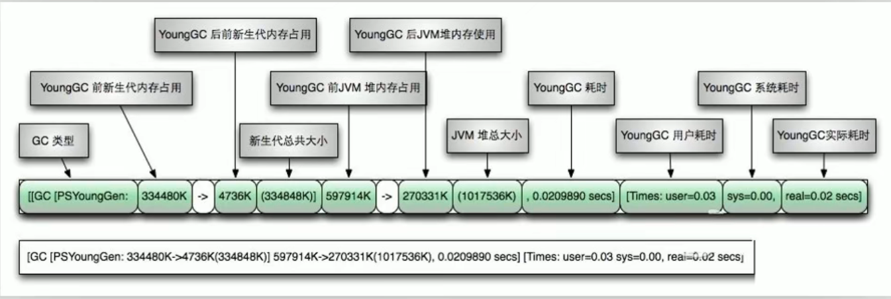


**Full GC日志**

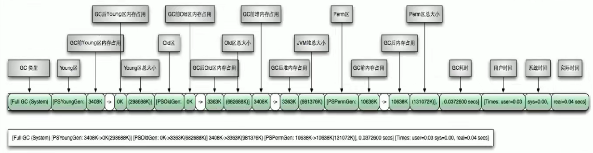


## 举例分析

新生代10M，初始和最大的堆为20M

```
在jdk7 和 jdk8中分别执行
-verbose:gc -Xms20M -Xmx20M -Xmn10M -XX:+PrintGCDetails -XX:SurvivorRatio=8 -XX:+UseSerialGC
```

```java
public class GCLogTest1 {
    private static final int _1MB = 1024 * 1024;

    public static void testAllocation() {
        byte[] allocation1, allocation2, allocation3, allocation4;
        allocation1 = new byte[2 * _1MB];
        allocation2 = new byte[2 * _1MB];
        allocation3 = new byte[2 * _1MB];
        allocation4 = new byte[4 * _1MB];
    }

    public static void main(String[] agrs) {
        testAllocation();
    }
}
```
JDK8的执行结果：

```
[GC (Allocation Failure) [DefNew: 8170K->641K(9216K), 0.0318440 secs] 8170K->6785K(19456K), 0.0318937 secs] [Times: user=0.00 sys=0.00, real=0.03 secs] 
Heap
 def new generation   total 9216K, used 4820K [0x00000000fec00000, 0x00000000ff600000, 0x00000000ff600000)
  eden space 8192K,  51% used [0x00000000fec00000, 0x00000000ff014930, 0x00000000ff400000)
  from space 1024K,  62% used [0x00000000ff500000, 0x00000000ff5a07a8, 0x00000000ff600000)
  to   space 1024K,   0% used [0x00000000ff400000, 0x00000000ff400000, 0x00000000ff500000)
 tenured generation   total 10240K, used 6144K [0x00000000ff600000, 0x0000000100000000, 0x0000000100000000)
   the space 10240K,  60% used [0x00000000ff600000, 0x00000000ffc00030, 0x00000000ffc00200, 0x0000000100000000)
 Metaspace       used 3304K, capacity 4496K, committed 4864K, reserved 1056768K
  class space    used 359K, capacity 388K, committed 512K, reserved 1048576K
```

9216K并不等于10M，为啥呢？

eden区的8192K+from或to区中的一个1024K就等于9216K

另外的1024是不可用的，因为from区和to区是不断复制互换的，总有一个不可用。因此虽然新生代分配了10M，但9216K是可用的。

JDK7的行为：

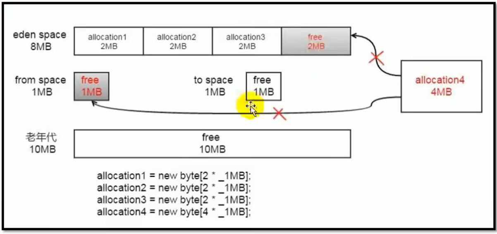

JDK8中

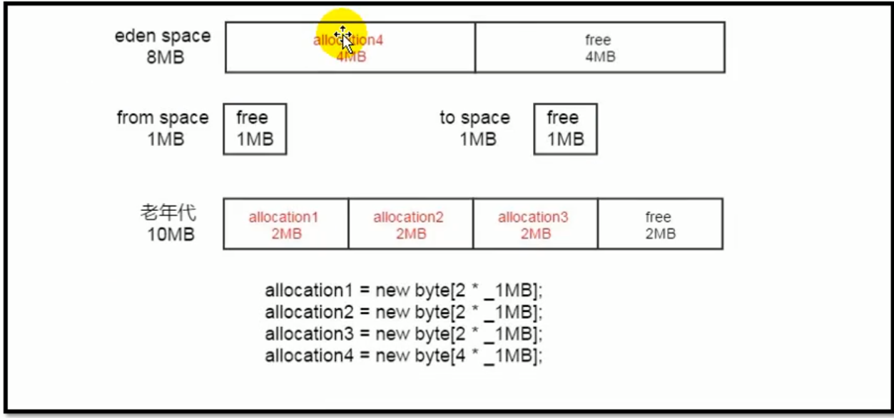

# 日志分析工具

## 先把GC日志保存到文件

把GC日志保存到文件，加上如下参数：

```
-Xloggc:/path/to/gc.log
```

常用的日志分析工具有: GCviewer、 GCeasy、 GCHisto、 GCLogViewer、Hpjmeter、 garbagecat等

## GCviewer

GCviewer ：下载：https://sourceforge.net/projects/gcviewer/，项目：https://github.com/chewiebug/GCViewer

界面有点丑

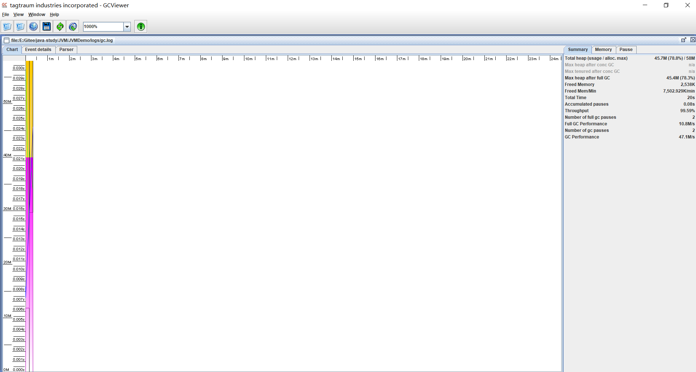

## GCeasy

**GCeasy**是个在线网站，直接上传log就能在线分析 https://gceasy.io/

能够显示非常详细的统计图

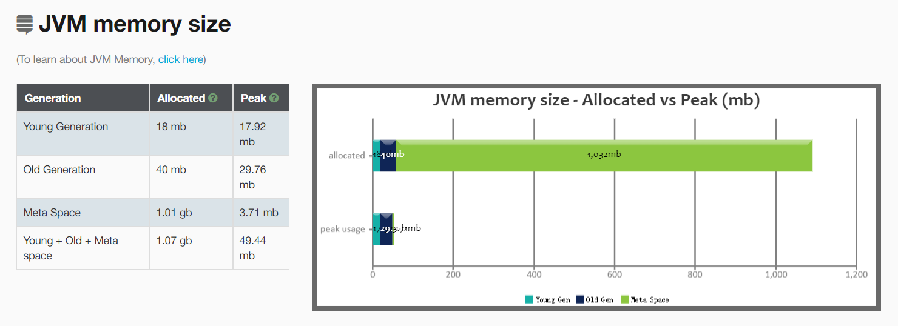

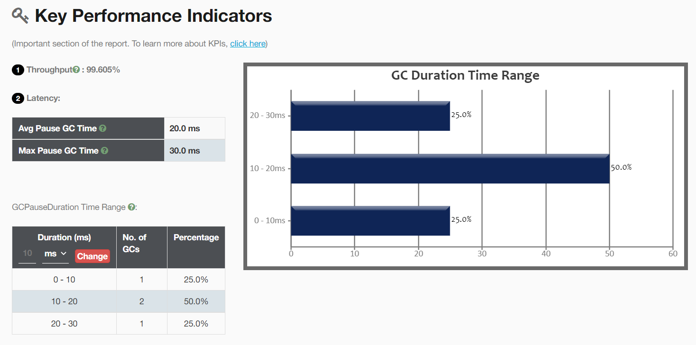

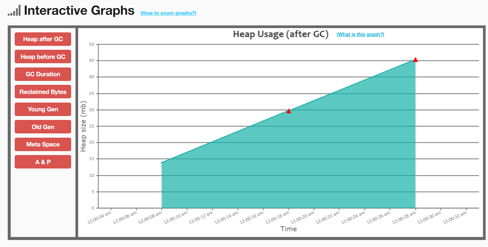

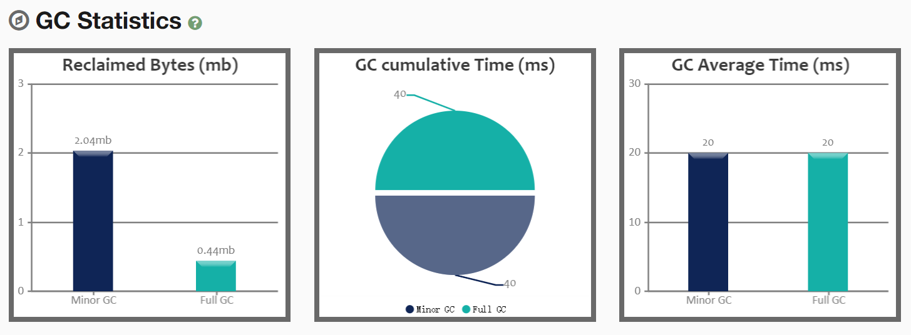

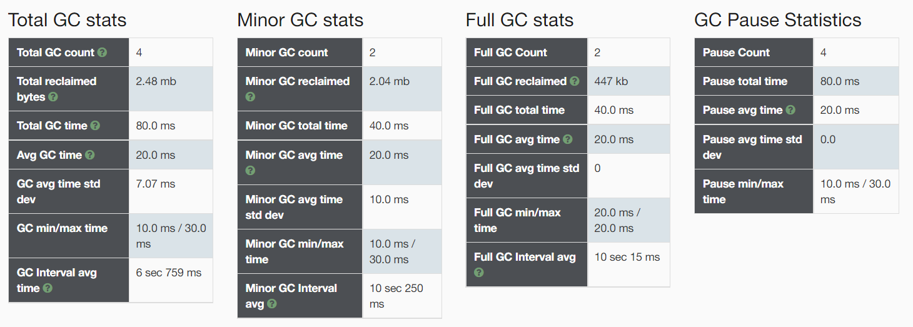

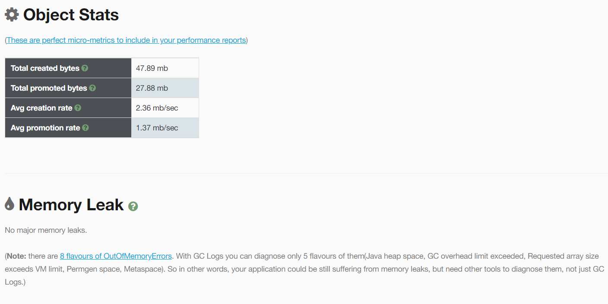

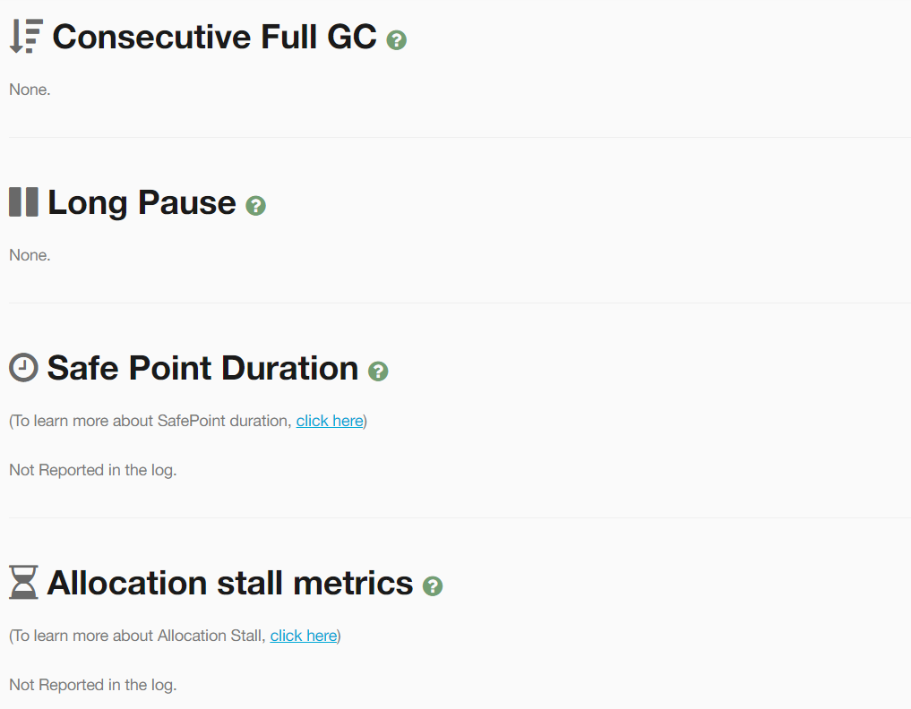

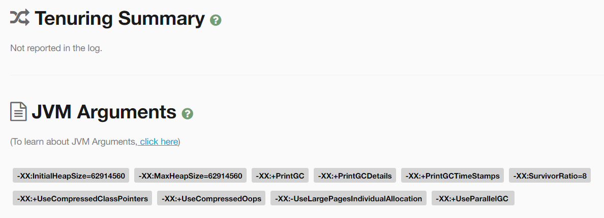

## 其他

gchisto

https://github.com/jewes/gchisto

弃坑，年久失修


GCLogViewer

https://github.com/mxc/GCLogViewer

http://gclogviewer.javaperformancetuning.co.za/

弃坑，年久失修


garbagecat

https://github.com/mgm3746/garbagecat


