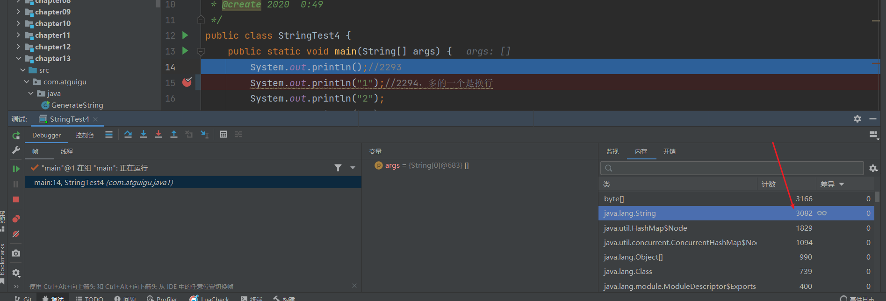
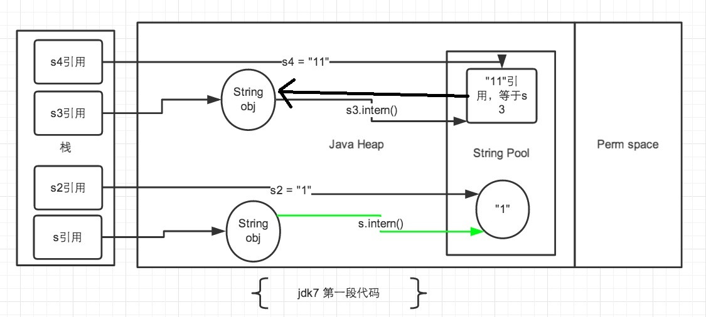

# String的基本特性

- String：字符串使用对""引起来表示。String对象实例化的方式：
  - String s1 = "atguigu"; //字面量的定义方式
  - String s2 = new String("hello");

- **String声明为final的，不可被继承**

- String实现了 Serializable接口：表示字符串是支持序列化的。

- String实现了 Comparable接口：表示String可以比较大小

- String在jdk8及以前内部定义了final char[] value用于存储字符串数据。

- **jdk9时改为byte[]**

## String存储结构变更

http://openjdk.java.net/jeps/254

**Motivation**

The current implementation of the `String` class stores characters in a `char` array, using two bytes (sixteen bits) for each character. Data gathered from many different applications indicates that strings are a major component of heap usage and, moreover, that most `String` objects contain only Latin-1 characters. Such characters require only one byte of storage, hence half of the space in the internal `char` arrays of such `String` objects is going unused.

**Description**

We propose to change the internal representation of the `String` class from a UTF-16 `char` array to a `byte` array plus an encoding-flag field. The new `String` class will store characters encoded either as ISO-8859-1/Latin-1 (one byte per character), or as UTF-16 (two bytes per character), based upon the contents of the string. The encoding flag will indicate which encoding is used.

String-related classes such as `AbstractStringBuilder`, `StringBuilder`, and `StringBuffer` will be updated to use the same representation, as will the HotSpot VM's intrinsic string operations.

This is purely an implementation change, with no changes to existing public interfaces. There are no plans to add any new public APIs or other interfaces.

The prototyping work done to date confirms the expected reduction in memory footprint, substantial reductions of GC activity, and minor performance regressions in some corner cases.

For further detail, see:

- [State of String Density Performance](http://cr.openjdk.java.net/~shade/density/state-of-string-density-v1.txt)
- [String Density Impact on SPECjbb2005 on SPARC](http://cr.openjdk.java.net/~huntch/string-density/reports/String-Density-SPARC-jbb2005-Report.pdf)

结论: String再也不用char来存储啦，改成了byte加上编码标记，节约了一些空间。

```java
public final class String
    implements java.io.Serializable, Comparable<String>, CharSequence {
    @Stable
    private final byte[] value;
}
```

那 String Buffer和 String Builder是否仍无动于衷呢? 也是跟着一起改！

String-related classes such as AbstractStringBuilder, StringBuilder and StringBuffer will be updated to use the same representation as will the Hotspot VMS intrinsic(固有的、内置的) string operations.

## String的基本特性

String：代表不可变的字符序列。简称：不可变性。

- 当对字符串重新赋值时，需要重写指定内存区域赋值，不能使用原有的 value进行赋值。

- 当对现有的字符串进行连接操作时，也需要重新指定内存区域赋值，不能使用原有的value进行赋值。
- 当调用 String的 replace()方法修改指定字符或字符串时，也需要重新指定内存区域赋值，不能使用原有的 value进行赋值

通过字面量的方式(区别于new)给一个字符串赋值，此时的字符串值声明在字符串常量池中。

### 例子

```java
    @Test
    public void test1() {
        String s1 = "abc";//字面量定义的方式，"abc"存储在字符串常量池中
        String s2 = "abc";
        s1 = "hello";

        System.out.println(s1 == s2);//判断地址：true  --> false

        System.out.println(s1);//
        System.out.println(s2);//abc

    }

    @Test
    public void test2() {
        String s1 = "abc";
        String s2 = "abc";
        s2 += "def";
        System.out.println(s2);//abcdef
        System.out.println(s1);//abc
    }

    @Test
    public void test3() {
        String s1 = "abc";
        String s2 = s1.replace('a', 'm');
        System.out.println(s1);//abc
        System.out.println(s2);//mbc
    }
```

### 练习题

```java
public class StringExer {
    String str = new String("good");
    char[] ch = {'t', 'e', 's', 't'};

    public void change(String str, char ch[]) {
        str = "test ok";
        ch[0] = 'b';
    }

    public static void main(String[] args) {
        StringExer ex = new StringExer();
        ex.change(ex.str, ex.ch);
        System.out.println(ex.str);//good
        System.out.println(ex.ch);//best
    }

}
```

**字符串常量池中是不会存储相同容的字符串的。**

**String的 String Pool是一个固定大小的 HashTable**，默认值大小长度是1009。如果放进 string Pool的 String非常多,就会造成Hash冲突严重，从而导致链表会很长，而链表长了后直接会造成的影响就是当调用String.intern()时性能会大幅下降。

**使用-XX:StringTableSize 可设置 StringTable的长度。**

在jdk6中 StringTable是固定的，就是1009的长度，所以如果常量池中的字符串过多就会导致效率下降很快。 StringTableSize设置没有要求。

jdk7中, Stringtable的长度默认值是60013, StringTableSize设置没有要求。

Jdk8开始, 设置 Stringtable的长度的话, 1009是可设置的最小值。

Jdk11，StringTableSize默认是65536

以下命令可查看JVM中StringTable的大小

```cmd
jinfo -flag StringTableSize 进程号
```

StringTableSize过小对性能的影响：

```java
BufferedReader br = null;
try {
  br = new BufferedReader(new FileReader("words.txt"));
  long start = System.currentTimeMillis();
  String data;
  while((data = br.readLine()) != null){
    data.intern(); //如果字符串常量池中没有对应data的字符串的话，则在常量池中生成
  }

  long end = System.currentTimeMillis();

  System.out.println("花费的时间为：" + (end - start));//1009:143ms  100009:47ms
} catch (IOException e) {
  e.printStackTrace();
} finally {
  if(br != null){
    try {
      br.close();
    } catch (IOException e) {
      e.printStackTrace();
    }

  }
}
```

# String的内存分配

在Java语言中有8种基本数据类型和一种比较特殊的类型 String。这些类型为了使它们在运行过程中速度更快、更节省内存，都提供了一种常量池的概念。常量池就类似一个Java系统级别提供的缓存。8种基本数据类型的常量池都是系统协调的, string类型的常量池比较特殊。它的主要使用方法有两种。

- 直接使用双引号声明出来的 String对象会直接存储在常量池中。比如: String info="atguigu.com";

- 如果不是用双引号声明的 String对象，可以使用 string提供的intern()方法。这个后面重点谈。

Java6及以前,字符串常量池存放在永久代。

Java7中 Oracle的工程师对字符串池的逻辑做了很大的改变，即将字符串常量池的位置调整到Java堆内。

- 所有的字符串都保存在堆(Heap)中,和其他普通对象一样,这样可以让你在进行调优应用时仅需要调整堆大小就可以了。

- 字符串常量池概念原本使用得比较多,但是这个改动使得我们有足够的理由让我们重新考虑在Java7中使用 String intern()

Java8 元空间,字符串常量在堆。


```java
public class StringTest4 {
    public static void main(String[] args) {
        System.out.println();//2293
        System.out.println("1");//2294，多的一个是换行
        System.out.println("2");
        System.out.println("3");
        System.out.println("4");
        System.out.println("5");
        System.out.println("6");
        System.out.println("7");
        System.out.println("8");
        System.out.println("9");
        System.out.println("10");//2303
        //如下的字符串"1" 到 "10"不会再次加载
        System.out.println("1");//2304
        System.out.println("2");//2304
        System.out.println("3");
        System.out.println("4");
        System.out.println("5");
        System.out.println("6");
        System.out.println("7");
        System.out.println("8");
        System.out.println("9");
        System.out.println("10");//2304
    }
}
```

IDEA的debug可以显示String对象的数量



Java语言规范里要求完全相同的字符串字面量，应该包含同样的 Unicode字符序列(包含同一份码点序列的常量),并且必须是指向同一个 String类实例


```java
class Memory {
    public static void main(String[] args) {//line 1
        int i = 1;//line 2
        Object obj = new Object();//line 3
        Memory mem = new Memory();//line 4
        mem.foo(obj);//line 5
    }//line 9

    private void foo(Object param) {//line 6
        String str = param.toString();//line 7
        System.out.println(str);
    }//line 8
}
```

代码对应的内存结构


# String基本操作

1.常量与常量的拼接结果在常量池,原理是编译期优化

2.常量池中不会存在相同内容的常量，但堆空间中的String对象中的字符串值是可以相同的。

3.只要其中有一个是变量,结果就在堆中。变量拼接的原理是 stringbuilder

4.如果拼接的结果调用 intern()方法,则主动将常量池中还没有的字符串对象放入池中,并返回此对象地址。

```java
    String s1 = "a" + "b" + "c";//编译期优化：等同于"abc"
    String s2 = "abc"; //"abc"一定是放在字符串常量池中，将此地址赋给s2
    /*
     * 最终.java编译成.class,再执行.class
     * String s1 = "abc";
     * String s2 = "abc"
     */
    System.out.println(s1 == s2); //true，s1,s2对象一样
    System.out.println(s1.equals(s2)); //true
```

这样：如果不是编译期间确定的

```java
        Scanner scanner = new Scanner(System.in);
        String in = scanner.next();//输入c
        String s1 = "a" + "b" + in;
        String s2 = "abc"; //"abc"一定是放在字符串常量池中，将此地址赋给s2

        System.out.println(s1 == s2); //false，s1，s2的对象不一样，但都指向字符串常量池中的abc
        System.out.println(s1.equals(s2)); //true
```


```java
String s1 = "javaEE";
String s2 = "hadoop";

String s3 = "javaEEhadoop";
String s4 = "javaEE" + "hadoop";//编译期优化
//如果拼接符号的前后出现了变量，则相当于在堆空间中new String()，具体的内容为拼接的结果：javaEEhadoop
String s5 = s1 + "hadoop";
String s6 = "javaEE" + s2;
String s7 = s1 + s2;

System.out.println(s3 == s4);//true
System.out.println(s3 == s5);//false
System.out.println(s3 == s6);//false
System.out.println(s3 == s7);//false
System.out.println(s5 == s6);//false
System.out.println(s5 == s7);//false
System.out.println(s6 == s7);//false
//intern():判断字符串常量池中是否存在javaEEhadoop值，如果存在，则返回常量池中javaEEhadoop的地址；
//如果字符串常量池中不存在javaEEhadoop，则在常量池中加载一份javaEEhadoop，并返回次对象的地址。
String s8 = s6.intern();
System.out.println(s3 == s8);//true
```

## 字符串拼接和 StringBuilder append

```java
@Test
public void test3(){
    String s1 = "a";
    String s2 = "b";
    String s3 = "ab";
    /*
    如下的s1 + s2 的执行细节：(变量s是我临时定义的）
    ① StringBuilder s = new StringBuilder();
    ② s.append("a")
    ③ s.append("b")
    ④ s.toString()  --> 约等于 new String("ab")

    补充：在jdk5.0之后使用的是StringBuilder,在jdk5.0之前使用的是StringBuffer
     */
    String s4 = s1 + s2;//
    System.out.println(s3 == s4);//false
}
```


```java
/*
1. 字符串拼接操作不一定使用的是StringBuilder!
   如果拼接符号左右两边都是字符串常量或常量引用，则仍然使用编译期优化，即非StringBuilder的方式。
2. 针对于final修饰类、方法、基本数据类型、引用数据类型的量的结构时，能使用上final的时候建议使用上。
 */
@Test
public void test4(){
    final String s1 = "a";
    final String s2 = "b";
    String s3 = "ab";
    String s4 = s1 + s2;
    System.out.println(s3 == s4);//true
}
```

## 字符串拼接和append效率对比

体会执行效率：通过StringBuilder的append()的方式添加字符串的效率要远高于使用String的字符串拼接方式！
详情：① StringBuilder的append()的方式：自始至终中只创建过一个StringBuilder的对象
      使用String的字符串拼接方式：创建过多个StringBuilder和String的对象
     ② 使用String的字符串拼接方式：内存中由于创建了较多的StringBuilder和String的对象，内存占用更大；如果进行GC，需要花费额外的时间。


```java
    @Test
    public void test6(){

        long start = System.currentTimeMillis();

//        method1(100000);//4014
        method2(100000);//7

        long end = System.currentTimeMillis();

        System.out.println("花费的时间为：" + (end - start));
    }

    public void method1(int highLevel){
        String src = "";
        for(int i = 0;i < highLevel;i++){
            src = src + "a";//每次循环都会创建一个StringBuilder、String
        }
//        System.out.println(src);

    }

    public void method2(int highLevel){
        //只需要创建一个StringBuilder
        StringBuilder src = new StringBuilder();
        for (int i = 0; i < highLevel; i++) {
            src.append("a");
        }
//        System.out.println(src);
    }
```

改进的空间：在实际开发中，如果基本确定要前前后后添加的字符串长度不高于某个限定值highLevel的情况下,建议使用构造器实例化：
           StringBuilder s = new StringBuilder(highLevel);//new char[highLevel]

# intern()

如果不是用双引号声明的 string对象，可以使用 string提供的 intern方法: intern方法会从字符串常量池中查询当前字符串是否存在，若不存在就会将当前字符串放入常量池中。

比如：

```java
String myinfo= new String("I love atguigu").intern();
```

也就是说，如果在任意字符串上调用 string.intern方法，那么其返回结果所指向的那个类实例，必须和直接以常量形式出现的字符串实例完全相同。因此，下列表达式的值必定是true:

```java
("a"+"b"+"c").intern()=="abc"
```

通俗点讲， Interned string就是确保字符串在内存里只有一份拷贝,这样可以节约内存空间，加快字符串操作任务的执行速度。注意，这个值会被存放在**字符串内部池( String Intern Pool)**。


```
如何保证变量s指向的是字符串常量池中的数据呢？
有两种方式：
方式一： String s = "shkstart";//字面量定义的方式
方式二： 调用intern()
        String s = new String("shkstart").intern();
        String s = new StringBuilder("shkstart").toString().intern();
```

## 创建了几个对象？

new String("ab")会创建几个对象？

new String("a") +new String("b")  呢？

```java
/**
 * 题目：
 * new String("ab")会创建几个对象？看字节码，就知道是两个。
 *     一个对象是：new关键字在堆空间创建的
 *     另一个对象是：字符串常量池中的对象"ab"。 字节码指令：ldc
 *
 *
 * 思考：
 * new String("a") + new String("b")呢？
 *  对象1：new StringBuilder()
 *  对象2： new String("a")
 *  对象3： 常量池中的"a"
 *  对象4： new String("b")
 *  对象5： 常量池中的"b"
 *
 *  深入剖析： StringBuilder的toString():
 *      对象6 ：new String("ab")
 *       强调一下，toString()的调用，在字符串常量池中，没有生成"ab"
 *
 * @author shkstart  shkstart@126.com
 * @create 2020  20:38
 */
public class StringNewTest {
    public static void main(String[] args) {
//        String str = new String("ab");

        String str = new String("a") + new String("b");
    }
}
```

对应的字节码：

```java
 0 new #2 <java/lang/StringBuilder>
 3 dup
 4 invokespecial #3 <java/lang/StringBuilder.<init> : ()V>
 7 new #4 <java/lang/String>
10 dup
11 ldc #5 <a>
13 invokespecial #6 <java/lang/String.<init> : (Ljava/lang/String;)V>
16 invokevirtual #7 <java/lang/StringBuilder.append : (Ljava/lang/String;)Ljava/lang/StringBuilder;>
19 new #4 <java/lang/String>
22 dup
23 ldc #8 <b>
25 invokespecial #6 <java/lang/String.<init> : (Ljava/lang/String;)V>
28 invokevirtual #7 <java/lang/StringBuilder.append : (Ljava/lang/String;)Ljava/lang/StringBuilder;>
31 invokevirtual #9 <java/lang/StringBuilder.toString : ()Ljava/lang/String;>
34 astore_1
35 return
```

## 堆空间的字符串常量池还可以存引用,来指向堆空间的String对象

```java
/**
 * 如何保证变量s指向的是字符串常量池中的数据呢？
 * 有两种方式：
 * 方式一： String s = "shkstart";//字面量定义的方式
 * 方式二： 调用intern()
 *         String s = new String("shkstart").intern();
 *         String s = new StringBuilder("shkstart").toString().intern();
 *
 * @author shkstart  shkstart@126.com
 * @create 2020  18:49
 */
public class StringIntern {
    public static void main(String[] args) {

        String s = new String("1");//s-->堆空间中的String对象-->常量池中的"1"
        s.intern();//调用此方法之前，字符串常量池中已经存在了"1"
        String s2 = "1";//s2-->常量池中的"1"
        System.out.println(s == s2);//jdk6：false   jdk7/8：false


        String s3 = new String("1") + new String("1");//s3变量记录的地址为：new String("11")
        //执行完上一行代码以后，字符串常量池中，是否存在"11"呢？答案：不存在！！
        s3.intern();//在字符串常量池中生成"11"。如何理解：jdk6:创建了一个新的对象"11",也就有新的地址。
                                            //         jdk7:此时常量中并没有创建"11",而是创建一个指向堆空间中new String("11")的地址
        String s4 = "11";//s4变量记录的地址：使用的是上一行代码代码执行时，在常量池中生成的"11"的地址
        System.out.println(s3 == s4);//jdk6：false  jdk7/8：true
    }


}
```

注:System.identityHashCode()可以查看对象的内存地址（相当于）

```
System.identityHashCode(Object x);
```




https://tech.meituan.com/2014/03/06/in-depth-understanding-string-intern.html

也就是说，jdk7开始intern()方法，在往**字符串常量池**中存放数据时，**可以直接存储堆中的引用**


如果是这样：

```java
public static void main(String[] args) {
    String s = new String("1");
    String s2 = "1";
    s.intern();
    System.out.println(s == s2);

    String s3 = new String("1") + new String("1");
    String s4 = "11";//执行这句后，常量池中已经有"11"了，再调用 s3.intern();也无用
    s3.intern();
    System.out.println(s3 == s4);
}
```


**String#intern 方法时，如果存在堆中的对象，字符串常量池会直接保存对象的引用，而不会重新创建对象。**


## 练习

练习1

```java
public static void main(String[] args) {
    //StringIntern.java中练习的拓展：
    String s3 = new String("1") + new String("1");//new String("11")
    //执行完上一行代码以后，字符串常量池中，是否存在"11"呢？答案：不存在！！
    String s4 = "11";//在字符串常量池中生成对象"11"
    String s5 = s3.intern();
    System.out.println(s3 == s4);//false
    System.out.println(s5 == s4);//true
}
```

练习2

```kava
public static void main(String[] args) {
    String x = "ab";
    String s = new String("a") + new String("b");//new String("ab")
    //在上一行代码执行完以后，字符串常量池中并没有"ab"

    String s2 = s.intern();//jdk6中：在串池中创建一个字符串"ab"
                           //jdk8中：串池中没有创建字符串"ab",而是创建一个引用，指向new String("ab")，将此引用返回

    System.out.println(s2 == "ab");//jdk6:true  jdk8:true
    System.out.println(s == "ab");//jdk6:false  jdk8:true
}
```

练习3

```java
    public static void main(String[] args) {
        String s1 = new String("ab");//执行完以后，会在字符串常量池中会生成"ab"
//        String s1 = new String("a") + new String("b");////执行完以后，不会在字符串常量池中会生成"ab"
        s1.intern();
        String s2 = "ab";
        System.out.println(s1 == s2);
    }
```

## 小结

jdk1.6中，将这个字符串对象尝试放入串池。

- 如果串池中有，则并不会放入。返回已有的串池中的对象的地址

- 如果没有，会把此对象复制一份，放入串池，并返回串池中的对象地址

Jdk1.7起，将这个字符串对象尝试放入串池。

- 如果串池中有，则并不会放入。返回已有的串池中的对象的地址
- **如果没有，则会把对象的引用地址复制一份，放入串池，并返回串池中的引用地址**

## 效率测试：空间角度

```java
/**
 * 使用intern()测试执行效率：空间使用上
 *
 * 结论：对于程序中大量存在存在的字符串，尤其其中存在很多重复字符串时，使用intern()可以节省内存空间。
 *
 *
 * @author shkstart  shkstart@126.com
 * @create 2020  21:17
 */
public class StringIntern2 {
    static final int MAX_COUNT = 1000 * 10000;
    static final String[] arr = new String[MAX_COUNT];

    public static void main(String[] args) {
        Integer[] data = new Integer[]{1,2,3,4,5,6,7,8,9,10};

        long start = System.currentTimeMillis();
        for (int i = 0; i < MAX_COUNT; i++) {
//            arr[i] = new String(String.valueOf(data[i % data.length]));//1166ms,10012640个String对象
            arr[i] = new String(String.valueOf(data[i % data.length])).intern();//2175ms,2083个String对象

        }
        long end = System.currentTimeMillis();
        System.out.println("花费的时间为：" + (end - start));

        try {
            Thread.sleep(1000000);
        } catch (InterruptedException e) {
            e.printStackTrace();
        }
        System.gc();
    }
}
```

不适用intern():


使用intern()：


## SpringTable垃圾回收测试

```java
/**
 * String的垃圾回收:
 * -Xms15m -Xmx15m -XX:+PrintStringTableStatistics -XX:+PrintGCDetails
 *
 * @author shkstart  shkstart@126.com
 * @create 2020  21:27
 */
public class StringGCTest {
    public static void main(String[] args) {
        for (int j = 0; j < 100000; j++) {
            String.valueOf(j).intern();
        }
    }
}
```


```
[GC (Allocation Failure) [PSYoungGen: 4096K->488K(4608K)] 4096K->672K(15872K), 0.0021885 secs] [Times: user=0.02 sys=0.00, real=0.00 secs] 
Heap
 PSYoungGen      total 4608K, used 3583K [0x00000000ffb00000, 0x0000000100000000, 0x0000000100000000)
  eden space 4096K, 75% used [0x00000000ffb00000,0x00000000ffe05c28,0x00000000fff00000)
  from space 512K, 95% used [0x00000000fff00000,0x00000000fff7a020,0x00000000fff80000)
  to   space 512K, 0% used [0x00000000fff80000,0x00000000fff80000,0x0000000100000000)
 ParOldGen       total 11264K, used 184K [0x00000000ff000000, 0x00000000ffb00000, 0x00000000ffb00000)
  object space 11264K, 1% used [0x00000000ff000000,0x00000000ff02e000,0x00000000ffb00000)
 Metaspace       used 3220K, capacity 4496K, committed 4864K, reserved 1056768K
  class space    used 353K, capacity 388K, committed 512K, reserved 1048576K
SymbolTable statistics:
Number of buckets       :     20011 =    160088 bytes, avg   8.000
Number of entries       :     13379 =    321096 bytes, avg  24.000
Number of literals      :     13379 =    572392 bytes, avg  42.783
Total footprint         :           =   1053576 bytes
Average bucket size     :     0.669
Variance of bucket size :     0.671
Std. dev. of bucket size:     0.819
Maximum bucket size     :         6
StringTable statistics:
Number of buckets       :     60013 =    480104 bytes, avg   8.000
Number of entries       :     55084 =   1322016 bytes, avg  24.000
Number of literals      :     55084 =   3144192 bytes, avg  57.080
Total footprint         :           =   4946312 bytes
Average bucket size     :     0.918
Variance of bucket size :     0.724
Std. dev. of bucket size:     0.851
Maximum bucket size     :         5

```

## G1中的String去重操作

背景:对许多Java应用(有大的也有小的)做的测试得出以下结果：

- 堆存活数据集合里面 String对象占了25%

- 堆存活数据集合里面重复的 String对象有13.5%
- String对象的平均长度是45

许多大规模的Java应用的瓶颈在于内存，测试表明，在这些类型的应用里面，Java堆中存活的数据集合差不多25%是 String对象。更进一步这里面差不多一半 String对象是重复的，重复的意思是说：String1.equals(string2)=true。堆上存在重复的 String 对象必然是一种内存的浪费。
这个项目将在G1垃圾收集器中实现自动持续对重复的 String对象进行去重，这样就能避免浪费内存

实现：

- 当垃圾收集器工作的时候，会访问堆上存活的对象。对每一个访问的对象都会检查是否是候选的要去重的 String对象。
- 如果是，把这个对象的一个引用插入到队列中等待后续的处理。一个去重的线程在后台运行，处理这个队列。处理队列的一个元素意味着从队列删除这个元素，然后尝试去重它引用的 string对象。
- 使用一个 hashtable来记录所有的被 String对象使用的不重复的char数组。当去重的时候，会查这个 hashtable，来看堆上是否已经存在一个一模一样的char数组。
- 如果存在，string对象会被调整引用那个数组，释放对原来的数组的引用，最终会被垃圾收集器回收掉。
- 如果查找失败，char数组会被插入到 hashtable,这样以后的时候就可以共享这个数组了

命令行选项

- UseStringDeduplication(bool)：开启 string去重，默认是不开启的，需要手动开启。
- PrintStringDeduplicationStatistics(bool)：打印详细的去重统计信息
- StringDeduplicationageThreshold(uintx)：达到这个年龄的 String对象被认为是去重的候选对象

1

