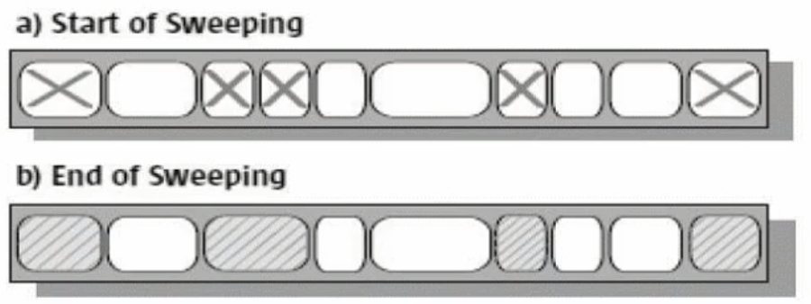

# GC分类和性能指标

垃圾收集器没有在规范中进行过多的规定，可以由不同的厂商、不同版本的JVM来实现。

由于JDK的版本处于高速迭代过程中，因此Java发展至今已经衍生了众多的GC版本。

从不同角度分析垃圾收集器，可以将GC分为不同的类型。

## GC分类

按**线程数**分，可以分为**串行垃圾回收器和并行垃圾回收器**。


串行回收的是在同一时间段内只允许有一个CPU用于执行垃圾回收操作，此时工作线程被暂停，直至垃圾收集工作结束。

在诸如单CPU处理器或者较小的应用内存等硬件平台不是特别优越的场合，串行回收器的性能表现可以超过并行回收器和并发回收器。所以，**串行回收默认被应用在客户端的Client模式下的JVM中**。

在并发能力比较强的CPU上，并行回收器产生的停顿时间要短于串行回收器。

和串行回收相反，并行收集可以运用多个CPU同时执行垃圾回收，因此提升了应用的吞吐量，不过并行回收仍然与串行回收一样，采用独占式，使用了“Stop-the-world”机制。


**按照工作模式分**，可以分为**并发式**垃圾回收器和**独占式**垃圾回收器。

并发式垃圾回收器与应用程序线程交替工作，以尽可能减少应用程序的停顿时间。

独占式垃圾回收器( Stop the wor1d)一旦运行，就停止应用程序中的所有用户线程，直到垃圾回收过程完全结束。


**按碎片处理方式分**，可分为**压缩式**垃圾回收器和**非压缩式**垃圾回收器。

- 压缩式垃圾回收器会在回收完成后，对存活对象进行压缩整理，消除回收后的碎片。再分配对象空间使用：指针碰撞。
- 非压缩式的垃圾回收器不进行这步操作。再分配对象空间使用：空闲列表。

**按工作的内存区间分**，又可分为**年轻代垃圾回收器和老年代垃圾回收器**。

## 性能指标

- 吞吐量：**运行用户代码的时间占总运行时间的比例**     (总运行时间:程序的运行时间+内存回收的时间)
- 垃圾收集开销：吞吐量的补数，垃圾收集所用时间与总运行时间的比例。
- **暂停时间：执行垃圾收集时，程序的工作线程被暂停的时间**。
- 收集频率：相对于应用程序的执行，收集操作发生的频率。
- **内存占用：Java堆区所占的内存大小**。
- 快速：一个对象从诞生到被回收所经历的时间。

这三者共同构成一个“不可能三角”。三者总体的表现会随着技术进步而越来越好。一款优秀的收集器通常最多同时满足其中的两项。

这三项里，暂停时间的重要性日益凸显。因为随着硬件发展，内存占用多些越来越能容忍，硬件性能的提升也有助于降低收集器运行时对应用程序的影响，即提高了吞吐量。而内存的扩大，对延迟反而带来负面效果

简单来说，主要抓住两点：**吞吐量、暂停时间**

### 吞吐量throughput

吞吐量就是CPU用于运行用户代码的时间与CPU总消耗时间的比值，即吞吐量=运行用户代码时间/(运行用户代码时间+垃圾收集时间)。

比如:虚拟机总共运行了188分钟，其中垃圾收集花掉1分钟，那吞吐量就是99%。

这种情况下，应用程序能容忍较高的暂停时间，因此，高吞吐量的应用程序有更长的时间基准，快速响应是不必考虑的吞吐量优先，意味着在单位时间内，STW的时间最短：8.2+8.2=8.4


### 暂停时间 pause time

“暂停时间”是指一个时间段内应用程序线程暂停，让GC线程执行的状。

例如，GC期间100毫秒的暂停时间意味着在这100毫秒期间内没有应用程序线程是活动的。

暂停时间优先，意味着尽可能让单次STW的时间最短:0.1+0.1+0.1+0.1+0.1=0.5


高吞吐量较好因为这会让应用程序的最终用户感觉只有应用程序线程在做“生产性”工作。直觉上，吞吐量越高程序运行越快。

低暂停时间(低延迟)较好因为从最终用户的角度来看不管是GC还是其他原因导致一个应用被挂起始终是不好的。这取决于应用程序的类型，有时候甚至短暂的200毫秒暂停都可能打断终端用户体验。因此，具有低的较大暂停时间是非常重要的，特别是对于一个**交互式应用程序**。

不幸的是”高吞吐量”和”低暂停时间”是一对相互竞争的目标(矛盾)。  
因为如果选择以吞吐量优先，那么必然需要降低内存回收的执行频率，但是这样会导致GC需要更长的暂停时间来执行内存回收。  

相反的，如果选择以低延迟优先为原则，那么为了降低每次执行内存回收时的暂停时间，也**只能频繁地执行内存回收**，但这又引起了年轻代内存的缩减和导致程序吞吐量的下降。

在设计(或使用)GC算法时，我们必须确定我们的目标:一个GC算法只可能针对两个目标之一(即只专注于较大吞吐量或最小暂停时间)，或尝试找到一个二者的折衷。

现在标准:**在最大吞吐量优先的情况下，降低停顿时间**。

# 垃圾回收期发展史

有了虚拟机，就一定需要收集垃圾的机制，这就是 Garbage Collection，对应的产品我们称为 Garbage Collector。

- 1999年随JDK1.3.1一起来的是串行方式的 SerialGC，它是第一款GC。 ParNew垃圾收集器是 Serial收集器的多线程版本。
- 2002年2月26日，ParallelGC和 Concurrent Mark Sweep GC跟随JDK1.4.2起发布。
- ParallelGC在JDK6之后成为 Hotspot默认GC。
- 2012年，在JDK1.7u4版本中，G1可用。
- 2017年，**JDK9中G1变成默认的垃圾收集器，以替代CMS**。
- 2018年3月，JDK10中G1垃圾回收器的并行完整垃圾回收，实现并行性来改善最坏情况下的延迟。
- 2018年9月，**JDK11发布。引入Epsilon垃圾回收器**，又被称为"No-Op(无操作)回收器。同时，引入**ZGC**：可伸缩的低延迟垃圾回收器( Experimental)。
- 2019年3月，JDK12发布。增强G1，**自动返回未用堆内存给操作系统**。同时，引入Shenandoah GC（OpenJDK）：低停顿时间的GC( Experimental)。
- 2019年9月，JDK13发布。增强ZGC，**自动返回未用堆内存给操作系统**。
- 2020年3月，JDK14发布。删除CMS垃圾回收器，废弃ParallelScavenge + SerialOld的GC组合。扩展ZGC在 macos和 Windows上的应用。
- 2020年9月，JDK15发布。ZGC转正，Shenandoah GC转正。
- 2021年3月，JDK16发布。引入 Elastic Metaspace，改进元空间内存的释放和分配。ZGC新增的并发线程堆栈处理：可以保证java线程可以在GC safepoints的同时可以并发执行。
- 2021年9月，JDK17发布。Parallel GC 默认启用自适应并行引用处里。
- 2022年3月，JDK18发布。GC上没有太大变化，只是弃用 Finalization 功能。

# 7款经典的GC

7款经典的GC：

串行回收器：Serial、 Serial old

并行回收器：ParNew、Parallel Scavenge、Parallel old

并发回收器：CMS、G1


7款经典垃圾收集器与垃圾分代之间的关系


新生代收集器： Serial、 ParNew、Parallel Scavenge

老年代收集器：Serial old、Parallel old、CMS

整堆收集器：G1

垃圾收集器的组合关系。


1.两个收集器间有连线，表明它们可以搭配使用Serial/ Serial old、 Serial/CMs、 ParNew/ Serial old、 ParNew/CMS、Parallel Scavenge/Serial old、 Parallel Scavenge/Parallel old、G1;

2.其中 Serial old作为CMS出现" Concurrent Mode failure"失败的后备预案。

3.(红色虚线)由于维护和兼容性测试的成本，在]DK8时将 Serial+CMS、ParNew+ Serial old这两个组合声明为废弃(JEP173)，并在JDK9中完全取消了这些组合的支持(JEP214)，即：移除。

4.(绿色虚线)DK14中：弃用Parallel Scavenge和 Serial old GC组合(JEP366)

5.(青色虚线)JDK14中：删除CMS垃圾回收器(JEP363)


为什么要有很多收集器，一个不够吗？因为Java的使用场景很多，移动端，服务器等。所以就需要针对不同的场景，提供不同的垃圾收集器，提高垃圾收集的性能。

虽然我们会对各个收集器进行比较，但并非为了挑选一个最好的收集器出来。没有一种放之四海皆准、任何场景下都适用的完美收集器存在，更加没有万能的收集器。所以我**们选择的只是对具体应用最合适的收集器**。


**查看默认的垃圾收集器**

- -XX:+PrintCommandLineFlags：查看命令行相关参数(包含使用的垃圾收集器)

- 使用命令行指令: jinfo -flag 相关垃圾回收器参数 进程ID

JDK8默认是：-XX+UseParallelGC，即 Parallel Scavenge GC 和 Parallel Old GC组合

```cmd
jinfo -flag UseParallelGC 924
-XX:+UseParallelGC #启用了Parallel Scavenge GC 新生代
 
jinfo -flag UseParallelOldGC 924
-XX:+UseParallelOldGC #启用了Parallel Old GC 老年代

jinfo -flag UseG1GC 924
-XX:-UseG1GC #没有启动GC
```

# Serial回收器：串行回收


Serial收集器是最基本、历史最悠久的垃圾收集器了。JDK1.3之前回收新生代唯一的选择。

Serial收集器作为 Hotspot中 Client模式下的默认新生代垃圾收集器。

Serial收集器采用**复制算法、串行回收和“Stop-the- World"机制**的方式执行内存回收。

除了年轻代之外，Serial收集器还提供用于执行**老年代**垃圾收集的Serial Old收集器。Serial Old收集器同样也采用了**串行回收和"Stop the World"机制**，只不过内存回收算法使用的是**标记-压缩**算法。

- Serial Old是运行在 Client模式下默认的老年代的垃圾回收器。

- Serial Old在 Server模式下主要有两个用途:
  - ①与新生代的Parallel Scavenge配合使用 
  - ②作为老年代CMS收集器的后备垃圾收集方案

这个收集器是一个单线程的收集器，但它的“单线程”的意义并不仅仅说明它**只会使用一个CPU或一条收集线程**去完成垃圾收集工作，更重要的是在它进行垃圾收集时，**必须暂停其他所有的工作线程**，直到它收集结束(Stop The world)。



优势：**简单而高效(**与其他收集器的单线程比)，对于限定单个CPU的环境来说， Serial收集器由于没有线程交互的开销，专心做垃圾收集自然可以获得最高的单线程收集效率。**运行在 Client模式下的虚拟机是个不错的选择**。

在用户的桌面应用场景中，可用内存一般不大(几十MB至一两百MB)，可以在较短时间内完成垃圾收集(几十ms至一百多ms)，只要不频繁发生使用串行回收器是可以接受的。在 HotSpot，虚拟机中，使用**-XX:UseSerialGC** 参数可以指定年轻代和老年代都使用串行收集器。**等价于新生代用 Serial GC，且老年代用 Serial Old GC**。


总结：

这种垃圾收集器大家了解，现在已经不用串行的了。而且在限定单核cpu才可以用。现在都不是单核的了。

对于交互较强的应用而言，这种垃圾收集器是不能接受的。一般在Javaweb应用程序中是不会采用串行垃圾收集器的。


# ParNew回收器：并行回收


如果说 Serial GC是年轻代中的单线程垃圾收集器，那么 ParNew收集器则是 Serial 收集器的多线程版本。

- Par是Parallel的缩写，New:只能处理的是新生代

ParNew收集器除了采用**并行回收**的方式执行内存回收外，两款垃圾收集器之间几乎没有任何区别。 ParNew收集器在年轻代中同样也是采用**复制算法**、"Stop-the-orld"机制。  
ParNew是很多JVM运行在 Server模式下新生代的默认垃圾收集器。



对于新生代，回收次数频繁，使用并行方式高效。

对于老年代，回收次数少，使用串行方式节省资源。(CPU并行需要切换线程，串行可以省去切换线程的资源)

由于 Pardew收集器是基于并行回收，那么是否可以断定ParNew收集器的回收效率在任何场景下都会比 Serial收集器更高效?

- ParNew收集器运行在多CPU的环境下，由于可以充分利用多CPU、多核心等物理硬件资源优势，可以更快速地完成垃圾收集，提升程序的吞吐量。
- 但是在单个CPU的环境下， ParNew收集器不比 Serial收集器更高效。虽然 Serial收集器是基于串行回收，但是由于CPU不需要频繁地做任务切换，因此可以有效避免多线程交互过程中产生的一些额外开销

因为除 Serial外，目前只有 ParNew GC能与CMS收集器配合工作

在程序中，开发人员可以通过选项"-XX:+UseParNewGC"手动指定使用ParNew 收集器执行内存回收任务。它表示年轻代使用并行收集器，不影响老年代。

-XX:+UseParNewThreads限制线程数量，默认开启和CPU数据相同的线程数。

# Parallel回收器：吞吐量优先


## Parallel Scavenge

HotSpot的年轻代中除了拥有 ParNew收集器是基于并行回收的以外，Parallel Scavenge收集器同样也采用了复制算法、并行回收和〃stop the world"机制那么Parallel收集器的出现是否多此一举?

- 和 ParNew收集器不同，Parallel  Scavenge收集器的目标则是达到一个**可控制的吞吐量**( Throughput)，它也被称为吞吐量优先的垃圾收集器。
- 自适应调节策略也是Parallel Scavenge与 ParNew一个重要区别。

高吞吐量则可以高效率地利用CPU时间，尽快完成程序的运算任务，主要**适合在后台运算而不需要太多交互的任务**。因此，常见在服务器环境中使用。**例如，那些执行批量处理、订单处理、工资支付、科学计算的应用程序**。

Parallel收集器在JDK1.6时提供了用于执行老年代垃圾收集的Parallel Old收集器，用来代替老年代的 Serial Old收集器。Parallel Old收集器采用了**标记-压缩算法**，但同样也是基于**并行回收**和Stop-The-World"机制。



在程序吞吐量优先的应用场景中，Parallel收集器和Parallel Old收集器的组合，在 Server模式下的内存回收性能很不错。**在Java8中，默认是此垃圾收集器。**

## 参数配置

- **-XX:+UseParallelGC** 手动指定年轻代使用Parallel并行收集器执行内存回收任务。
- **-XX:+UseParallelOldGC** 手动指定老年代都是使用并行回收收集器。
  - 分别适用于新生代和老年代。默认jdk8是开启的。
  - 上面两个参数，默认开启一个，另一个也会被开启。**(互相激活)**
- **-XX:+UseParallelGCThreads** 设置年轻代并行收集器的线程数。一般地，最好与CPU数量相等，以避免过多的线程数影响垃圾收集性能。
  - 在默认情况下，当CPU数量小于8个，ParallelGCThreads的值等于CPU数量。
  - 当CPU数量大于8个，ParallelGCThreads的值等于 3+ [5 * CPU_Count ]/ 8

- **-XX:MaxGCPaulseMillis** 设置垃圾收集器最大停顿时间(即STW的时间)。单位是毫秒。
  - 为了尽可能地把停顿时间控制在 MaxGCPaulseMillis以内，收集器在工作时会调整Java堆大小或者其他一些参数。
  - 对于用户来讲，停顿时间越短体验越好。但是在服务器端，我们注重高并发，整体的吞吐量。所以服务器端适合Parallel，进行控制
  - **该参数使用需谨慎。**
- **-XX:GCTimeRatio** 垃圾收集时间占总时间的比例(= 1/(N+1) )。用于衡量吞吐量的大小。
  - 取值范围(0，100)。默认值99，也就是垃圾回收时间不超过1%。
  - 与前一个-XX:MaxGCPaulseMillis参数有一定矛盾性。暂停时间越长， Radio参数就容易超过设定的比例。
- -XX:+UseAdaptiveSizePolicy设置 Parallel Scavenge 收集器具有**自适应调节策略**
  - 在这种模式下，年轻代的大小、Eden和 Survivor的比例、晋升老年代的对象年龄等参数会被自动调整，已达到在堆大小、吞吐量和停顿时间之间的平衡点。
  - 在手动调优比较困难的场合，可以直接使用这种自适应的方式，仅指定虚拟机的最大堆、目标的吞吐量( GCTimeRatio)和停顿时间( MaxGCPaulseMillis)，让虚拟机自己完成调优工作。

# CMS回收器：低延迟

Concurrent-Mark-Sweep


在JDK1.5时期，HotSpot推出了一款在**强交互应用**中几乎可认为有划时代意义的垃圾收集器：CMs( Concurrent-Mark-Sweep)收集器，**这款收集器是 HotSpot虚拟机中第一款真正意义上的并发收集器，它第一次实现了让垃圾收集线程与用户线程同时工作**。

CMS收集器的关注点是尽可能缩短垃圾收集时用户线程的停顿时间。停顿时间越短(低延迟)就越适合与用户交互的程序，良好的响应速度能提升用户体验。

目前很大一部分的Java应用集中在互联网站或者B/S系统的服务端上，这类应用尤其重视服务的响应速度，希望系统**停顿时间最短**，以给用户带来较好的体验。CMS收集器就非常符合这类应用的需求。

CMS的垃圾收集算法采用**标记-清除**算法，并且也"Stop-the-world"

不幸的是，CMS作为老年代的收集器，却无法与JDK1.4.0中已经存在的新生代收集器Parallel Scavenge配合工作，所以在JDK1.5中使用CMS来收集老年代的时候，新生代只能选择ParNew或者 Serial收集器中的一个。

在G1出现之前，CMS使用还是非常广泛的。一直到今天，仍然有很多系统使用 CMS GC。


## 过程

CMS整个过程比之前的收集器要复杂，整个过程分为4个主要阶段，即初始标记阶段、并发标记阶段、重新标记阶段和并发清除阶段。

- **初始标记**( Initial-Mark)阶段：在这个阶段中，程序中所有的工作线程都将会因为“Stop-the-Wor1d”机制而出现短暂的暂停，这个阶段的主要任务**仅仅只是标记出GC Roots能直接关联到的对象**。一旦标记完成之后就会恢复之前被暂停的所有应用线程。由于直接关联对象比较小，所以这里的**速度非常快**。
- **并发标记**( Concurrent-Mark)阶段：从 GC Roots的**直接关联对象开始遍历整个对象图的过程**，这个过程耗时较长但是不需要停顿用户线程，可以与垃圾收集线程一起并发运行。

- **重新标记**( Remark)阶段：由于在并发标记阶段中，程序的工作线程会和垃圾收集线程同时运行或者交叉运行，因此为了**修正并发标记期间，因用户程序继续运作而导致标记产生变动的那一部分对象的标记记录**，这个阶段的停顿时间通常会比初始标记阶段稍长一些，但也远比并发标记阶段的时间短。
- **并发清除**( Concurrent- Sweep)阶段：此阶段**清理删除掉标记阶段判断的已经死亡的对象，释放内存空间**。由于不需要移动存活对象，所以这个阶段也是可以与用户线程同时并发的。

尽管CMS收集器采用的是并发回收(非独占式)，但是在其**初始化标记和再次标记这两个阶段中仍然需要执行“stop-the-World”机制**暂停程序中的工作线程，不过暂停时间并不会太长，因此可以说明目前所有的垃圾收集器都做不到完全不需要“stop-the-World”，只是尽可能地缩短暂停时间。

**由于最耗费时间的并发标记与并发清除阶段都不需要暂停工作，所以整体的回收是低停顿的。**

另外，由于在垃圾收集阶段用户线程没有中断，所以在**CMS回收过程中，还应该确保应用程序用户线程有足够的内存可用**。因此，CMS收集器不能像其他收集器那样等到老年代几乎完全被填满了再进行收集，而是**当堆内存使用率达到某一阈值时，便开始进行回收**，以确保应用程序在CMS工作过程中依然有足够的空间支持应用程序运行。要是CMS运行期间预留的内存无法满足程序需要，就会出现一次“ **Concurrent Mode Failure**”失败，这时虚拟机将启动后备预案：临时启用 Serial Old收集器来重新进行老年代的垃圾收集，这样停顿时间就很长了。

CMS收集器的垃圾收集算法采用的是**标记-清除算法**，这意味着每次执行完内存回收后，由于被执行内存回收的无用对象所占用的内存空间极有可能是不连续的一些内存块，不可避免地将会产生一些**内存碎片**。那么CMS在为新对象分配内存空间时，将无法使用指针碰撞( Bump the Pointer)技术，而只能够选择空闲列表( Free List)执行内存分配。



## 优缺点

优点：

- 并发收集
- 低延迟

CMS的弊端

1)**会产生内存碎片**，导致并发清除后，用户线程可用的空间不足。在无法分配大对象的情况下，不得不提前触发Full GC。

2)**CMS收集器对CPU资源非常敏感**。在并发阶段，它虽然不会导致用户停顿，但是会因为占用了一部分线程而导致应用程序变慢，总吞吐量会降低。

3)**CMS收集器无法处理浮动垃圾**。可能出现“ Concurrent Mode Fai1ure"失败而导致另一次Full GC的产生。在并发标记阶段由于程序的工作线程和垃圾收集线程是同时运行或者交叉运行的，那么**在并发标记阶段如果产生新的垃圾对象，CMS将无法对这些垃圾对象进行标记，最终会导致这些新产生的垃圾对象没有被及时回收**，从而只能在下一次执行GC时释放这些之前未被回收的内存空间。

有人会觉得既然 Mark Sweep会造成内存碎片，那么为什么不把算法换成Mark Compact呢?

答案其实很简答，因为当并发清除的时候，用 Compact整理内存的话，原来的用户线程使用的内存还怎么用呢?要保证用户线程能继续执行，前提的它运行的资源不受影响嘛。 Mark Compact更适合“ Stop the World”这种场景下使用

## 参数设置

- **-XX:+UseConcMarkSweepGC**手动指定使用CMS收集器执行内存回收任务。
  - 开启该参数后会自动将-XX:+UseParNewGC打开。即: ParNew( Young区用) +CMS(Old区用)+ Serial old的组合。
- **-XX:CMSInitiatingOccupanyFraction**设置堆内存使用率的阈值，一旦达到该阈值，便开始进行回收。
  - JDK5及以前版本的默认值为68，即当老年代的空间使用率达到68%时，会执行次CMS回收。**JDK6及以上版本默认值为92号%**
  - 如果内存增长缓慢，则可以设置一个稍大的值，大的阈值可以有效降低CMS的触发频率，减少老年代回收的次数可以较为明显地改善应用程序性能。反之，如果应用程序內存使用率增长很快，则应该降低这个阈值，以避免频繁触发老年代串行收集器。因此**通过该选项便可以有效降低Full GC的执行次数**。

- **-XX:+UseCMSCompactAtFullCollection** 用于指定在执行完Full GC后对内存空间进行压缩整理，以此避免内存碎片的产生。不过由于内存压缩整理过程无法并发执行，所带来的问题就是停顿时间变得更长了
- **-XX:CMSFullGCsBeforeCompaction** 设置在执行多少次Full GC后对内存空间进行压缩整理。
- -XX:ParalolelCMSThreads 设置CMS的线程数量。
  - CMS默认启动的线程数是(ParallelGCThreads+3)/4，ParallelGCThreads是年轻代并行收集器的线程数。当CPU资源比较紧张时，受到CMS收集器线程的影响，应用程序的性能在垃圾回收阶段可能会非常糟糕。

## 小结

HotSpot有这么多的垃圾回收器，那么如果有人问， Serial GC、Parallel GC、 Concurrent Mark Sweep GC这三个GC有什么不同呢?请记住以下口令：  

- 如果你想要最小化地使用内存和并行开销，请选 Serial CG；  

- 如果你想要最大化应用程序的吞吐量，请选Parallel GC；

- 如果你想要最小化GC的中断或停顿时间，请选 CMS GC。

## JDK后续版本中CMS的变化

JDK9新特性：CMS被标记为 Deprecate了(JEP291)

- 如果对JDK9及以上版本的 HotSpot虚拟机使用参数-XX:+UseConcMarkSweepGC来开启CMS收集器的话，用户会收到一个警告信息，提示CMS未来将会被废弃。·

JDK14新特性：删除CMS垃圾回收器(JEP363)

- 移除了CMS垃圾收集器，如果在JDK14中使用-XX:+UseConcMarkSweepGC的话，JVM不会报错，只是给出一个Warning信息，但是不会exit。JVM会自动回退以默认GC方式启动JVM。

  Openjdk 64-bit Server VM warning: Ignoring option Use Concmarksweepgc;support was removed in 14.0and the VM will continue execution using the default collector


# G1回收器：区域化分代式


1

