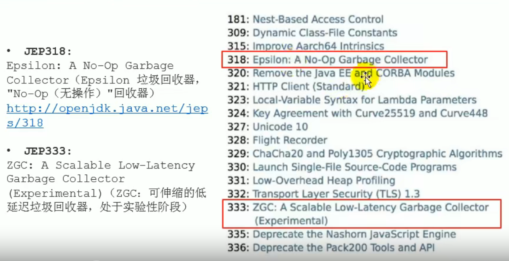
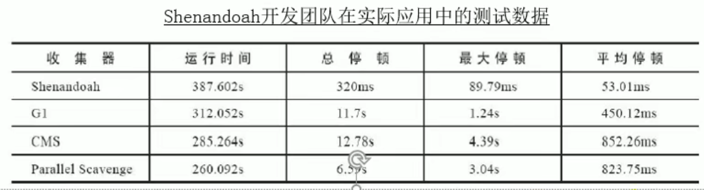
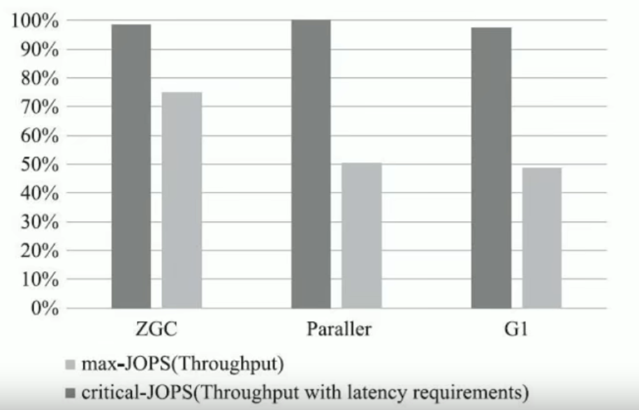
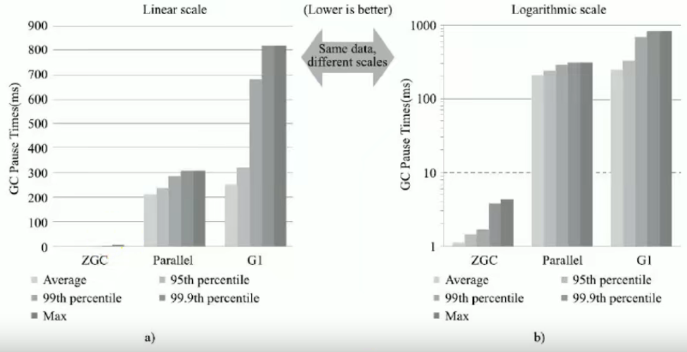
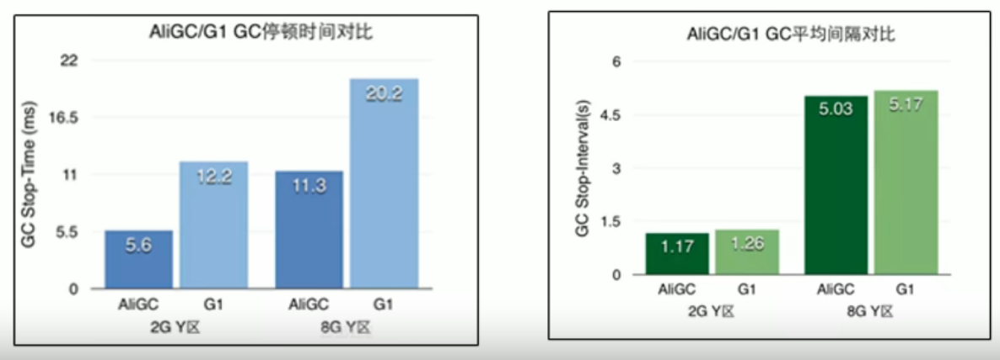

GC仍然处于飞速发展之中，目前的默认选项G1GC在不断的进行改进，很多我们原来认为的缺点，例如串行的Full GC、 Card Table扫描的低效等，都已经被大幅改进，例如，JDK10以后，Full GC已经是并行运行，在很多场景下，其表现还略优于Parallel GC的并行Full GC实现。

即使是 Serial GC，虽然比较古老，但是简单的设计和实现未必就是过时的，它本身的开销，不管是GC相关数据结构的开销，还是线程的开销，都是非常小的，所以随着云计算的兴起**，在 Serverless等新的应用场景下， Serial GC找到了新的舞台**。

比较不幸的是 CMS GC，因为其算法的理论缺陷等原因，虽然现在还有非常大的用户群体，但在JDK9中已经被标记为废弃，并在JDK14版本中移除。

JDK11新特性

Epsilon回收器，无操作是啥意思？它只做内存分配，不做垃圾的回收，**适合运行完以后就退出程序的场景**

ZGC是接下来的重点，但在这之前，先看看另一个垃圾回收器：OpenJDK 12的Shenandoah GC

# Shenandoah GC

Open JDK 12的Shenandoah GC：低停顿时间的GC(实验性)

Shenandoah，无疑是**众多GC中最孤独的一个**。是**第一款不由 Oracle公司团队领导开发的 Hotspot垃圾收集器**。不可避免的**受到官方的排挤**。比如号称 Openjdk和OracleJDK没有区别的oracle司仍拒绝在oracle JDK12中支持 Shenandoah。

Shenandoah垃圾回收器最初由 Redhat进行的一项垃圾收集器研究项目 PauselessGC的实现，旨在针对JVM上的内存回收实现**低停顿**的需求。在2014年贡献给openjdk。

Red hat研发 Shenandoah团队对外宣称， Shenandoah垃圾回收器的**暂停时间与堆大小无关**，**这意味着无论将堆设置为288MB还是288GB，99.9%的目标都可以把垃圾收集的停顿时间限制在十毫秒以内**。不过实际使用性能将取决于实际工作堆的大小和工作负载。

这是 Redhat在2016年发表的论文数据，测试内容是使用ES(ElasticSearch)对200GB的维基面科数据进行索引。从结果看:

- **停顿时间**比其他几款收集器确实有了**质的飞跃**，但也未实现最大停顿时间控制在十毫秒以内的目标
- 而**吞吐量方面出现了明显的下降，总运行时间是所有测试收集器里最长的**

总结

- Shenandoah GC的弱项：高运行负担下的吞吐量下降。
- Shenandoah GC的强项：低延迟时间

Shenandoah gc的工作过程大致分为九个阶段，这里就不再赘述，网上找资料自己去看

# 令人震惊的、革命性的ZGC

官网垃圾回收器文档：https://docs.oracle.com/en/java/javase/12/gctuning/

ZGC与 Shenandoah目标高度相似，**在尽可能对吞吐量影响不大的前提下实现在任意堆内存大小下都可以把垃圾收集的停顿时间限制在十毫秒以内的低延迟**。

《深入理解Java虚拟机》一书中这样定义ZGC：ZGC收集器是一款基于Region内存布局的，(暂时)不设分代的，使用了读屏障、染色指针和内存多重映射等技术来实现**可并发的标记-压缩算法**的，以**低延迟为首要目标的**一款垃圾收集器。

GC的工作过程可以分为4个阶段：**并发标记一并发预备重分配一并发重分配并发重映射**等。

ZGC几乎在所有地方并发执行的，除了初始标记的是STW的。所以停顿时间几乎就耗费在初始标记上，这部分的实际时间是非常少的。

测试数据

吞吐量

虽说吞吐量是GC的弱项了，但相比之前的GC，是一点也不弱

停顿时间

在ZGC的强项停顿时间测试上，它毫不留情的将 Parallel、G1拉开了两个数量级的差距。无论平均停顿、95%停顿、99%停顿、99.9%停顿，还是最大停顿时间，ZGC都能毫不费劲控制在10毫秒以内。

虽然ZGC还在试验状态，没有完成所有特性，但此时性能已经相当亮眼，用“令人震惊、革命性”来形容，不为过未来将在**服务端、大内存、低延迟**应用的首选垃圾收集器

推荐书籍：《新一代垃圾回收器 ZGC设计与实现》

JEP364：ZGC应用在 macos上

JEP365：ZGC应用在windows上

JDK14之前，ZGC仅 Linux才支持。尽管许多使用ZGC的用户都使用类 Linux的环境，但在 Windows和 macos上，人们也需要zZGC进行开发部署和测试。许多桌面应用也可以从ZGC中受益。因此，ZGC特性被移植到了 Windows和 macos上。现在mac或 Windows上也能使用ZGC了，示例如下:

-XX:+UnlockExperimentalVMoptions  -XX:+UseZGC

# 其他垃圾回收器：AliGC

A1iGC是阿里巴巴JVM团队基于G1算法，面向大堆( LargeHeap)应用场景。指定场景下的对比:

当然,其他厂商也提供了各种独具一格的GC实现,例如比较有名的低延迟GC，zing (https://www.infoq.com/articles/azul_gc_in_detail)，有趣可以参考提供的链接