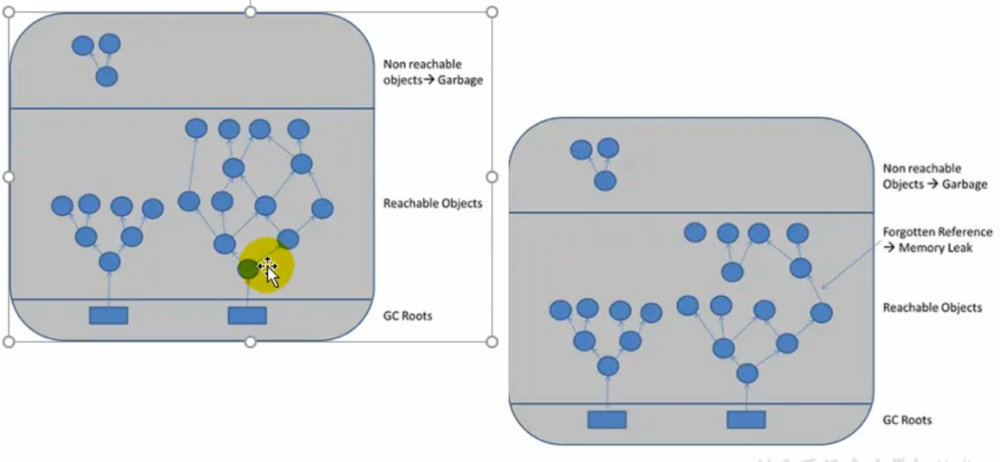
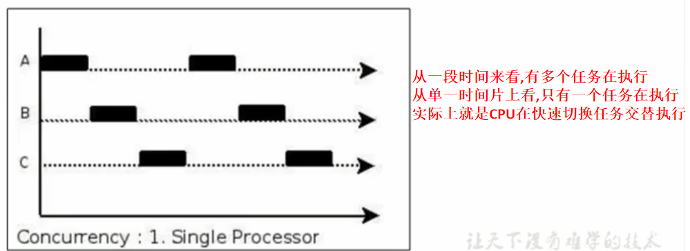
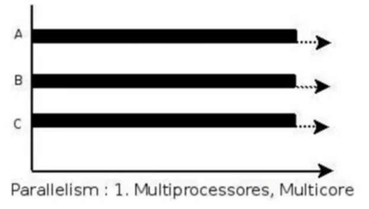
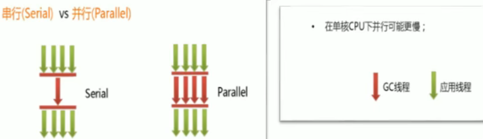
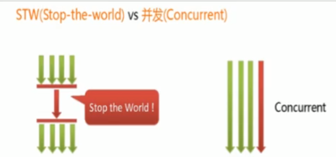

# System.gc()的理解

在默认情况下，通过 System.gc()或者 Runtime. getRuntime().gc()的调用，会显式触发FullGC，同时对老年代和新生代进行回收，尝试释放被丢弃对象占用的内存。  
然而 System.gc()调用附带一个免责声明，无法保证对垃圾收集器的调用。  
JVM实现者可以通过 System.gc()调用来决定JVM的GC行为。而一般情况下，垃圾回收应该是自动进行的，无须手动触发，否则就太过于麻烦了。在些特殊情况下，如我们正在编写一个性能基准，我们可以在运行之间调用System.gc()。

案例一：

```java
public class SystemGCTest {
    public static void main(String[] args) {
        new SystemGCTest();
        System.gc();//提醒jvm的垃圾回收器执行gc,但是不确定是否马上执行gc
        //与Runtime.getRuntime().gc();的作用一样。

        System.runFinalization();//强制调用失去引用的对象的finalize()方法
    }

    @Override
    protected void finalize() throws Throwable {
        super.finalize();
        System.out.println("SystemGCTest 重写了finalize()");
    }
}
```

案例二：

```java
//-XX:+PrintGCDetails
public class LocalVarGC {
    public void localvarGC1() {
        byte[] buffer = new byte[10 * 1024 * 1024];//10MB
        System.gc();//没有回收buffer
    }

    public void localvarGC2() {
        byte[] buffer = new byte[10 * 1024 * 1024];
        buffer = null;
        System.gc();//回收了buffer
    }

    public void localvarGC3() {
        {
            byte[] buffer = new byte[10 * 1024 * 1024];
        }
        System.gc();//没有回收buffer，局部变量表的槽还在引用着buffer
    }

    public void localvarGC4() {
        {
            byte[] buffer = new byte[10 * 1024 * 1024];
        }
        int value = 10;//局部变量表的槽复用，所以这里回收了
        System.gc();
    }

    public void localvarGC5() {
        localvarGC1();//这里面的执行 System.gc()时，buffer没有被回收
        System.gc();//这里执行  System.gc() 时，buffer被回收
    }

    public static void main(String[] args) {
        LocalVarGC local = new LocalVarGC();
        local.localvarGC5();
    }
}
```

# 内存溢出与内存泄漏

## 内存溢出

内存溢岀相对于内存泄漏来说，尽管更容易被理解，但是同样的，内存溢出也是引发程序崩溃的罪魁祸首之一。  
由于GC一直在发展，所有一般情况下，除非应用程序占用的内存增长速度非常快，造成垃圾回收已经跟不上内存消耗的速度，否则不太容易出现OOM的情况。  
大多数情况下，GC会进行各种年龄段的垃圾回收，实在不行了就放大招,来一次独占式的Full GC操作，这时候会回收大量的内存，供应用程序继续使用。  
javadoc中对 OutOfMemoryOrror的解释是，**没有空闲内存，并且垃圾收集器也无法提供更多内存**。

首先说没有空闲内存的情况：说明Java虚拟机的堆内存不够。原因有二：

**(1)Java虚拟机的堆内存设置不够。**  
比如：可能存在内存泄漏问题；也很有可能就是堆的大小不合理，比如我们要处理比较可观的数据量，但是没有显式指定JVM堆大小或者指定数值偏小。我们可以通过参数-Xms、-Xmx来调整。

**(2)代码中刨建了大量大对象，并且长时间不能被垃圾收集器收集(存在被引用)。**  
对于老版本的 Oracle JDK，因为永久代的大小是有限的，并且对永久代垃圾回收(如，常量池回收、卸载不再需要的类型)非常不积极，所以当我们不断添加新类型的时候，永久代出现 OutOfMemoryError也非常多见，尤其是在运行时存在大量动态类型生成的场合；类似 intern字符串缓存占用太多空间，也会导致OOM问题。对应的异常信息，会标记出来和永久代相关：“java.lang.OutOfMemoryError: PermGen space"。  
随着元数据区的引入，方法区内存已经不再那么窘迫，所以相应的OOM有所改观，出现OOM，异常信息则变成了：“java.lang.OutOfMemoryError: Metaspace"。直接内存不足，也会导致OOM。

这里面隐含着一层意思是，在抛出 OutOfMemoryError之前，通常垃圾收集器会被触发，尽其所能去清理出空间。  
例如：在引用机制分析中，涉及到W会去尝试回收软引用指向的对象等在 Java.nio.BIts.reserveMemory()方法中，我们能清楚的看到, System.gc(会被调用,以清理空间

当然，也不是在任何情况下垃圾收集器都会被触发的比如，我们去分配一个超大对象，类似一个超大数组超过堆的最大值，JVM可以判断出垃圾收集并不能解决这个问题，所以直接抛出 OutOfMemoryError。

## 内存泄漏

Memory Leak

也称作“存储渗漏”。**严格来说，只有对象不会再被程序用到了，但是GC又不能回收他们的情况，才叫内存泄漏**。    

但实际情况很多时候一些不太好的实践(或疏忽)会导致对象的生命周期变得很长甚至导致OOM，也可以叫做**宽泛意义上的“内存泄漏”**。  
尽管内存泄漏并不会立刻引起程序崩溃，但是一旦发生内存泄漏，程序中的可用内存就会被逐步蚕食，直至耗尽所有内存，最终出现 OutOfMemory异常，导致程序崩溃。  
注意，这里的存储空间并不是指物理内存，而是指虚拟内存大小，这个虚拟内存大小取决于磁盘交换区设定的大小。



举例：

1、单例模式  
单例的生命周期和应用程序是一样长的，所以**单例程序中，如果持有对外部对象的引用的话，那么这个外部对象是不能被回收的，则会导致内存泄漏的产生**。

2、一些提供 close的资源未关闭导致内存泄漏  
数据库连接( dataSource.getConnection())，网络连接( socket)和io连接必须手动close，否则是不能被回收的。

# Stop The World

Stop The World，简称STW，指的是GC事件发生过程中，会产生应用程序的停顿。停顿产生时整个应用程序线程都会被暂停，没有任何响应，有点像卡死的感觉，这个停顿称为STW。  
可达性分析算法中枚举根节点( GC Roots)会导致所有Java执行线程停顿√。

- 分析工作必须在一个能确保一致性的快照中进行。  
- 一致性指整个分析期间整个执行系统看起来像被冻结在某个时间点上
- 如果出现分析过程中对象引用关系还在不断变化，则分析结果的准确性无法保证

被STW中断的应用程序线程会在完成GC之后恢复，频繁中断会让用户感觉像是网速不快造成电影卡带一样，所以我们需要减少STW的发生。

STW事件和采用哪款GC无关，所有的GC都有这个事件。

哪怕是G1也不能完全避免stop-the- world情况发生，只能说垃圾回收器越来越优秀，回收效率越来越高，尽可能地缩短了暂停时间。

STW是JVM在后台自动发起和自动完成的。在用户不可见的情况下，把用户正常的工作线程全部停掉。

开发中不要用 System.gc(); 会导致stop-the- world的发生。

# 垃圾回收的并行与并发

## 并发与并行

**并发**

在操作系统中，是指一个时间段中有几个程序都处于已启动运行到运行完毕之间，且这几个程序都是在同一个处理器上运行。  
并发不是真正意义上的“同时进行”，只是cPU把一个时间段划分成几个时间片段(时间区间)，然后在这几个时间区间之间来回切换，由于CPU处理的速度非常快，只要时间间隔处理得当，即可让用户感觉是多个应用程序同时在进行。



**并行**

当系统有一个以上CPU时，当一个CPU执行一个进程时，另一个CPU可以执行另一个进程，两个进程互不抢占CPU资源,可以同时进行，我们称之为并行(Parallel)。  
其实决定并行的因素不是CPU的数量，而是CPU的核心数量，比如一个CPU多个核也可以并行。  
适合科学计算，后台处理等弱交互场景。




并发，指的是多个事情，在同一时间段内同时发生了。  
并行，指的是多个事情,在同一时间点上同时发生了。  

并发的多个任务之间是互相抢占资源的。  
并行的多个任务之间是不互相抢占资源的。  

只有在多CPU或者一个CPU多核的情况中，才会发生并行。  
否则，看似同时发生的事情，其实都是并发执行的。

## 垃圾回收的并行与并发

并发和并行，在谈论垃圾收集器的上下文语境中，它们可以解释如下: 

**并行(Parallel)**：指**多条垃圾收集线程并行工作**，但此时用户线程仍处于等待状态。

- 如 ParNew、Paralle Scavenge、Parallel old

**串行( Serial)**

- 相较于并行的概念，**单线程执行**。

- 如果内存不够，则程序暂停，启动JVM垃圾回收器进行垃圾回收。回收完，再启动。




并发和并行，在谈论垃圾收集器的上下文语境中，它们可以解释如下：

**并发 (Concurrent)**：指**用户线程与垃圾收集线程同时执行**(但不一定是并行的，可能会交替执行)，垃圾回收线程在执行时不会停顿用户程序的运行。

- 用户程序在继续运行，而垃圾收集程序线程运行于另一个CPU上；
- 如:CMS、G1




# 安全点与安全区域

**安全点**

程序执行时并非在所有地方都能停顿下来开始GC，只有在特定的位置才能停顿下来开始GC，这些位置称为“安全点( Safepoint)。

Safe Point的选择很重要，**如果太少可能导致GC等待的时间太长，如果太频繁可能导致运行时的性能问题**。大部分指令的执行时间都非常短暂通常会根据“**是否具有让程序长时间执行的特征**”为标准。比如：选择些执行时间较长的指令作为 Safe Point，如**方法调用、循环跳转和异常跳转**等

如何在GC发生时，检査所有线程都跑到最近的安全点停顿下来呢?  

- **抢先式中断**：(目前没有虚拟机采用了)

  首先中断所有线程。如果还有线程不在安全点，就恢复线程，让线程跑到安全点。

- **主动式中断**：

  设置一个中断标志，各个线程运行到 Safe point的时候主动轮询这个标志，如果中断标志为真，则将自己进行中断挂起。


**安全区域**

Safepoint机制保证了程序执行时，在不太长的时间内就会遇到可进入GC的 Safepoint。但是，程序“不执行”的时候呢?例如线程处于Sleep状态或 Blocked状态，这时候线程无法响应JVM的中断请求，“走”到安全点去中断挂起，JWM也不太可能等待线程被唤醒。对于这种情况，就需要安全区域( Safe Region)来解决.

**安全区域是指在一段代码片段中，对象的引用关系不会发生变化，在这个区域中的任何位置开始GC都是安全的。**我们也可以把 Safe Region看做是被扩展了的 Safepoint.

实际执行时：

1、当线程运行到 Safe Region的代码时，首先标识已经进入了 Safe Region，如果这段时间内发生GC，JVM会忽略标识为 Safe Region状态的线程；

2、当线程即将离开 Safe Region时，会检查]W是否已经完成GC，如果完成了，则继续运行，否则线程必须等待直到收到可以安全离开 Safe Region的信号为止。


# 引用

强、软、弱、虚、

除了强引用，其他的引用应用举例：缓存的实现。

## 强引用
