# 栈、堆、方法区的交互关系



从线程共享与否的角度来看




# 方法区的理解

## 官方描述

官网文档：https://docs.oracle.com/javase/specs/jvms/se8/html/jvms-2.html#jvms-2.5.4

The Java Virtual Machine has a *method area* that is shared among all Java Virtual Machine threads. The method area is analogous to the storage area for compiled code of a conventional language or analogous to the "text" segment in an operating system process. It stores per-class structures such as the run-time constant pool, field and method data, and the code for methods and constructors, including the special methods ([§2.9](https://docs.oracle.com/javase/specs/jvms/se8/html/jvms-2.html#jvms-2.9)) used in class and instance initialization and interface initialization.

The method area is created on virtual machine start-up. Although the method area is logically part of the heap, simple implementations may choose not to either garbage collect or compact it. This specification does not mandate the location of the method area or the policies used to manage compiled code. The method area may be of a fixed size or may be expanded as required by the computation and may be contracted if a larger method area becomes unnecessary. The memory for the method area does not need to be contiguous.

A Java Virtual Machine implementation may provide the programmer or the user control over the initial size of the method area, as well as, in the case of a varying-size method area, control over the maximum and minimum method area size.


《Java虚拟机规范》中明确说明:尽管所有的方法区在逻辑上是属于堆的一部分，但些简单的实现可能不会选择去进行圾收集或者进行压缩。”但对于 Hotspotuvmi而言，方法区还有一个别名叫做**Non-Heap(非堆)**，目的就是要和堆分开。

所以，**方法区看作是一块独立于Java堆的内存空间。**

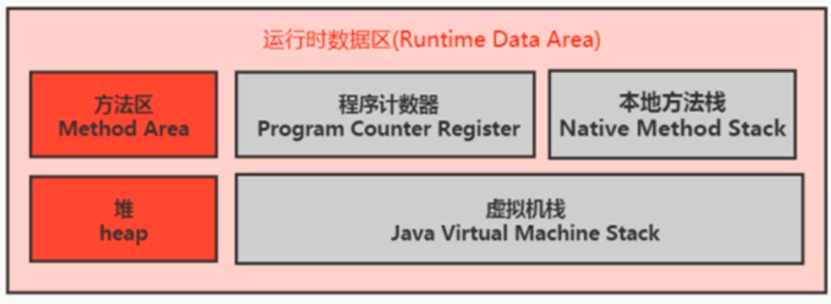

## **方法区的基本理解**

方法区( Method Area)与Java堆一样,是各个线程共享的内存区域。

方法区在J启动的时候被创建,并且它的实际的物理内存空间中和Java堆区一样都可以是不连续的。

方法区的大小,跟堆空间一样,可以选择固定大小或者可扩展。

方法区的大小决定了系统可以保存多少个类,如果系统定义了太多的类,导致方法区溢出,虚拟机同样会抛出内存溢出错误:java.lang.OutOfMemoryError:**Permgen space** 或者java.lang.OutOfMemoryError: **Metaspace**

**加载大量的第三方的jar包; Tomcat部署的工程过多(30-50个)大量动态的生成反射类可能会导致方法区OOM**

关闭JVM就会释放这个区域的内存。

## Hotspot中方法区的演进

在jdk7及以前,习惯上把方法区,称为永久代。jdk8开始,使用元空间取代了永久代。

本质上,方法区和永久代并不等价。仅是对 hotspot而言的。《Java虚拟机规范》对如何实现方法区，不做统一要求。例如: BEA JRockit/IBM J9中不存在永久代的概念。现在来看，当年使用永久代，不是好的idea。导致Java程序更容易OOM(超过xx: MaxPermSize上限)

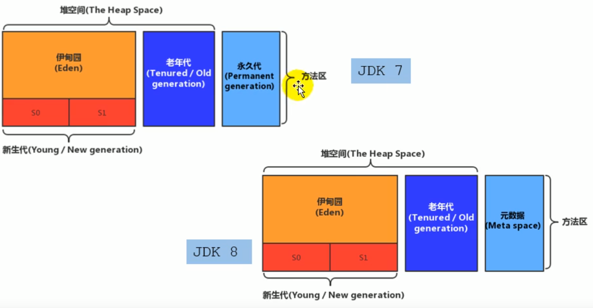


而到了JDK8，终于完全废弃了永久代的概念，改用与 Jrockit、J9一样在本地内存中实现的元空间( Metaspace)来代替。

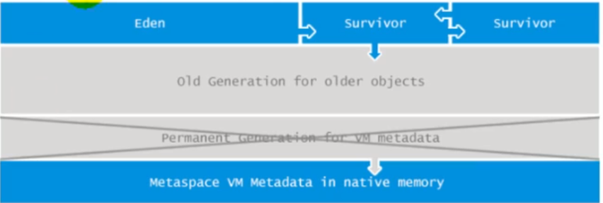


元空间的本质和永久代类似，都是对JVM规范中方法区的实现。不过元空间与永久代最大的区别在于：**元空间不在虚拟机设置的内存中，而是使用本地内存**。**永久代、元空间二者并不只是名字变了，内部结构也调整了。**根据《Java虚拟机规范》的规定，如果方法区无法满足新的内存分配需求时，将抛出OOM异常。

# 设置方法区大小与OOM

```
测试设置方法区大小参数的默认值
jdk7及以前：
-XX:PermSize=100m -XX:MaxPermSize=100m
jdk8及以后：
-XX:MetaspaceSize=100m  -XX:MaxMetaspaceSize=100m
```

方法区的大小不必是固定的,jvm可以根据应用的需要动态调整。

## jdk7及以前

通过-XX:PermSize来设置永久代**初始**分配空间。默认值是20.75M

-XX:MaxPermSize来设定永久代**最大**可分配空间。32位机器默认是64M,64位机器模式是82M

当JVM加载的类信息容量超过了这个值，会报异常 OutOfMemoryError: PermGen space


## jdk8及以后

元数据区大小可以使用参数-XX:MetaspaceSize和-XX:MaxMetaspaceSize指定替代上述原有的两个参数。

默认值依赖于平台。 windows下，-XX:MetaspaceSize是21M，-XX:MaxMetaspaceSize的值是-1,即没有限制。

开发中，顶多设置以下-XX:MetaspaceSize，不会去设置-XX:MaxMetaspaceSize。

与永久代不同，如果不指定大小，默认情况下，虚拟机会耗尽所有的可用系统内存。如果元数据区发生溢出,虚拟机一样会抛出异常 OutOfMemoryError:Metaspace 。

比如-XX: Metaspacesize=100m

-XX: MetaspaceSize:设置初始的元空间大小。对于一个64位的服务器端JVM来说其默认的-XX: MetaspaceSize值为21MB。这就是初始的**高水位线**，一旦触及这个水位线,Full GC将会被触发并卸载没用的类(即这些类对应的类加载器不再存活)然后这个高水位线将会重置。新的高水位线的值取决于GC后释放了多少元空间。如果释放的空间不足，那么在不超过 MaxMetaspaceSize时，适当提高该值。如果释放空间过多，则适当降低该值。

如果初始化的高水位线设置过低，上述高水位线调整情况会发生很多次。通过垃圾回收器的日志可以观察到Full GC多次调用。为了避免频繁地GC，**建议将-XX:MetaspaceSize设置为一个相对较高的值。**

## 代码举例

借助ASM(CGLib的底层框架)不断的生成类，使得方法区出现内存溢出异常。

```java

/**
 * jdk6/7中：
 * -XX:PermSize=10m -XX:MaxPermSize=10m
 *
 * jdk8中：
 * -XX:MetaspaceSize=10m -XX:MaxMetaspaceSize=10m
 *
 * @author shkstart  shkstart@126.com
 * @create 2020  22:24
 */
public class OOMTest extends ClassLoader {
    public static void main(String[] args) {
        int j = 0;
        try {
            OOMTest test = new OOMTest();
            for (int i = 0; i < 10000; i++) {
                //创建ClassWriter对象，用于生成类的二进制字节码
                ClassWriter classWriter = new ClassWriter(0);
                //指明版本号，修饰符，类名，包名，父类，接口
                classWriter.visit(Opcodes.V1_8, Opcodes.ACC_PUBLIC, "Class" + i, null, "java/lang/Object", null);
                //返回byte[]
                byte[] code = classWriter.toByteArray();
                //类的加载
                test.defineClass("Class" + i, code, 0, code.length);//Class对象
                j++;
            }
        } finally {
            System.out.println(j);
        }
    }
}

```

默认情况下，运行结果：10000

加上JVM参数，限制方法区大小：

```
-XX:MetaspaceSize=10m -XX:MaxMetaspaceSize=10m
```

运行结果：

```
3331
Exception in thread "main" java.lang.OutOfMemoryError: Compressed class space
	at java.lang.ClassLoader.defineClass1(Native Method)
	at java.lang.ClassLoader.defineClass(ClassLoader.java:756)
	at java.lang.ClassLoader.defineClass(ClassLoader.java:635)
	at com.atguigu.java.OOMTest.main(OOMTest.java:29)

```

**为啥不是：OutOfMemoryError: Metasapce**


## 如何解决这些OOM

1、要解决OOM异常或 heap space的异常，一般的手段是首先通过内存映像分析工具(如Eclipse Memory Analyzer)对dump出来的堆转储快照进行分析，重点是确认内存中的对象是否是必要的，也就是要先分清楚到底是出现了内存泄漏( Memory Leak)还是内存溢出( Memory Overflow)

2、如果是内存泄漏,可进一步通过工具查看泄漏对象到 GC Roots的引用链。于是就能找到泄漏对象是通过怎样的路径与 GC Roots相关联并导致垃圾收集器无法自动回收它们的。掌握了泄漏对象的类型信息，以及 GC Roots引用链的信息，就可以比较准确地定位出泄漏代码的位置。

3、如果不存在内存泄漏，换句话说就是内存中的对象确实都还必须存活着，那就应当检查虚拟机的堆参数(-Xmx与-Xms)，与机器物理内存对比看是否还可以调大，从代码上检查是否存在某些对象生命周期过长、持有状态时间过长的情况，尝试减少程序运行期的内存消耗。

# 方法区的内部结构



《深入理解Java虚拟机》书中对方法区( Method Area)存储内容描述如下：它用于存储已被虚拟机加载的类型信息、常量、静态变量、即时编译器编译后的代码缓存等。


## 类型信息

对每个加载的类型(类class、接口 interface、枚举enum、注解 annotation),JVM必须在方法区中存储以下类型信息:

①这个类型的完整有效名称(全名=包名.类名)

②这个类型直接父类的完整有效名(对于 interface或是java.lang.Object，都没有父类)

③这个类型的修饰符(public, abstract,final的某个子集)

④这个类型直接接口的一个有序列表

### 域(Field)信息

JVM必须在方法区中保存类型的所有域的相关信息以及域的声明顺序。

域的相关信息包括: 域名称、域类型、域修饰符( public, private,protected, static,final, volatile, transient的某个子集)

### 方法(Method)信息

JVM必须保存所有方法的以下信息,同域信息一样包括声明顺序:

- 方法名称
- 方法的返回类型(或void)
- 方法参数的数量和类型(按顺序)
- 方法的修饰符( public, private, protected, statio,fina1,synchronized, native, abstract的一个子集)
- 方法的字节码( bytecodes)、操作数栈、局部变量表及大小( abstract和native方法除外)
- 异常表( abstract和 native方法除外)
  - 每个异常处理的开始位置、结束位置、代码处理在程序计数器中的偏移地址被捕获的异常类的常量池索引

### 例子

```java
package com.atguigu.java;

import java.io.Serializable;

/**
 * 测试方法区的内部构成
 * @author shkstart  shkstart@126.com
 * @create 2020  23:39
 */
public class MethodInnerStrucTest extends Object implements Comparable<String>,Serializable {
    //属性
    public int num = 10;
    private static String str = "测试方法的内部结构";
    //构造器
    //方法
    public void test1(){
        int count = 20;
        System.out.println("count = " + count);
    }
    public static int test2(int cal){
        int result = 0;
        try {
            int value = 30;
            result = value / cal;
        } catch (Exception e) {
            e.printStackTrace();
        }
        return result;
    }

    @Override
    public int compareTo(String o) {
        return 0;
    }
}

```

查看字节码

```cmd
 javap -v -p MethodAreaDemo.class > MethodAreaDemo.txt  
```


### non-final 的类变量

- 静态变量和类关联在一起，随着类的加载而加载，它们成为类数据在逻辑上的一部分

- 类变量被类的所有实例共享，即使没有类实例时你也可以访问它

```java
/**
 * non-final的类变量
 * @author shkstart  shkstart@126.com
 * @create 2020  20:37
 */
public class MethodAreaTest {
    public static void main(String[] args) {
        Order order = null;
        order.hello();//不会报空指针
        System.out.println(order.count);
    }
}

class Order {
    public static int count = 1;
    public static final int number = 2;


    public static void hello() {
        System.out.println("hello!");
    }
}
```

### 全局常量static final

被声明为 final的类变量的处理方法则不同,每个全局常量在**编译的时候就会被分配了**


```java
class Order {
    public static int count = 1;
    public static final int number = 2;


    public static void hello() {
        System.out.println("hello!");
    }
}
```

javap -v -p Order.class>test.txt

字节码文件反编译：

```
  public static int count;
    descriptor: I
    flags: ACC_PUBLIC, ACC_STATIC

  public static final int number;
    descriptor: I
    flags: ACC_PUBLIC, ACC_STATIC, ACC_FINAL
    ConstantValue: int 2
```


## 运行时常量池

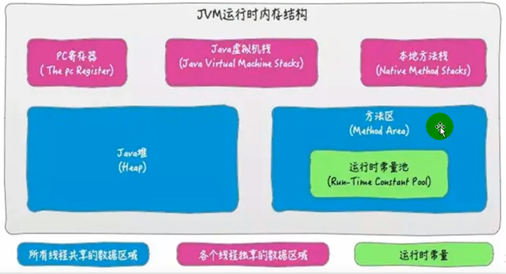


方法区,内部包含了运行时常量池。字节码文件，内部包含了常量池。要弄清楚方法区,需要理解清楚 ClassFile，因为加载类的信息都在方法区要弄清楚方法区的运行时常量池，需要理解清楚 ClassFile中的常量池。

官网文档：https://docs.oracle.com/javase/specs/jvms/se8/html/jvms-4.html

字节码文件结构：

```
ClassFile {
    u4             magic;
    u2             minor_version;
    u2             major_version;
    u2             constant_pool_count;
    cp_info        constant_pool[constant_pool_count-1];
    u2             access_flags;
    u2             this_class;
    u2             super_class;
    u2             interfaces_count;
    u2             interfaces[interfaces_count];
    u2             fields_count;
    field_info     fields[fields_count];
    u2             methods_count;
    method_info    methods[methods_count];
    u2             attributes_count;
    attribute_info attributes[attributes_count];
}
```


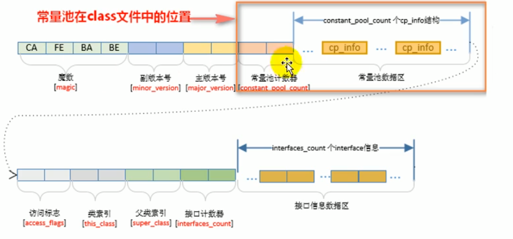


一个有效的字节码文件中除了包含类的版本信息、字段、方法以及接口等描述信息外，还包含一项信息那就是常量池表( Constant pool Table)，包括各种字面量和对类型、域和方法的符号引用。

### 为什么需要常量池?

一个java源文件中的类、接口，编译后产生一个字节码文件。而Java中的字节码需要数据支持，通常这种数据会很大以至于不能直接存到字节码里，换另一种方式，可以存到常量池，这个字节码包含了指向常量池的引用。在动态链接的时候会用到运行时常量池，之前有介绍。比如:如下的代码:

```java
public class SimpleClass {
  public void sayHello() {
    System.out.println("hello");
  }
}
```

对应的字节码文件，虽然只有194字节，但是里面却使用了 String、 System、Printstream及Object等结构。这里代码量其实已经很小了。如果代码多，引用到的结构会更多!这里就需要常量池了!


### 常量池中有什么？

几种在常量池内存储的数据类型包括：

- 数量值
- 字符串值
- 类引用
- 字段引用
- 方法引用

例如下面这段代码：

```java
public class MethodAreaTest2 {
    public static void main(String[] args) {
        Object obj = new Object();
    }
}
```

将会被编译成如下字节码：

```java
o:  new #2  //class java/lang/Object
1:  dup
2：  invokespecial  #3 //Method java/lang/Object "<init>"() V
```

小结:

常量池，可以看做是一张表，虚拟杋指令根据这张常量表找到要执行的类名、方法名、参数类型、字面量等类型。

### 运行时常量池

运行时常量池( Runtime Constant pool)是方法区的一部分。

常量池表( Constant pool table)是Class文件的一部分，**用于存放编译期生成的各种字面量与符号引用，这部分内容将在类加载后存放到方法区的运行时常量池中。**

运行时常量池，在加载类和接口到虚拟机后，就会创建对应的运行时常量池。

**JVM为每个已加载的类型(类或接口)都维护一个常量池**。池中的数据项像数组项一样,是通过**索引访问**的。

运行时常量池中包含多种不同的常量,包括编译期就已经明确的数值字面量,也包括到运行期解析后才能够获得的方法或者字段引用。此时不再是常量池中的符号地址了,这里换为真实地址。

- 运行时常量池,相对于Class文件常量池的另一重要特征是:**具备动态性**。
  -  String intern()

运行时常量池类似于传统编程语言中的符号表( symbol table)，但是它所包含的数据却比符号表要更加丰富一些。

当创建类或接口的运行时常量池时，如果构造运行时常量池所需的内存空间超过了方法区所能提供的最大值，则JVM会抛 OutOfMemoryError异常。

# 方法区使用举例

```java
public class MethodAreaDemo {
    public static void main(String[] args) {
        int x = 500;
        int y = 100;
        int a = x / y;
        int b = 50;
        System.out.println(a + b);
    }
}
```

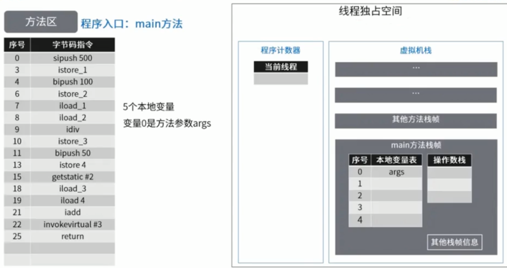

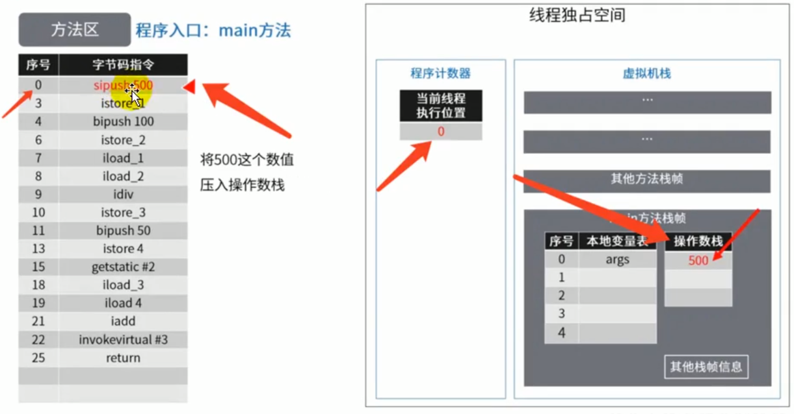


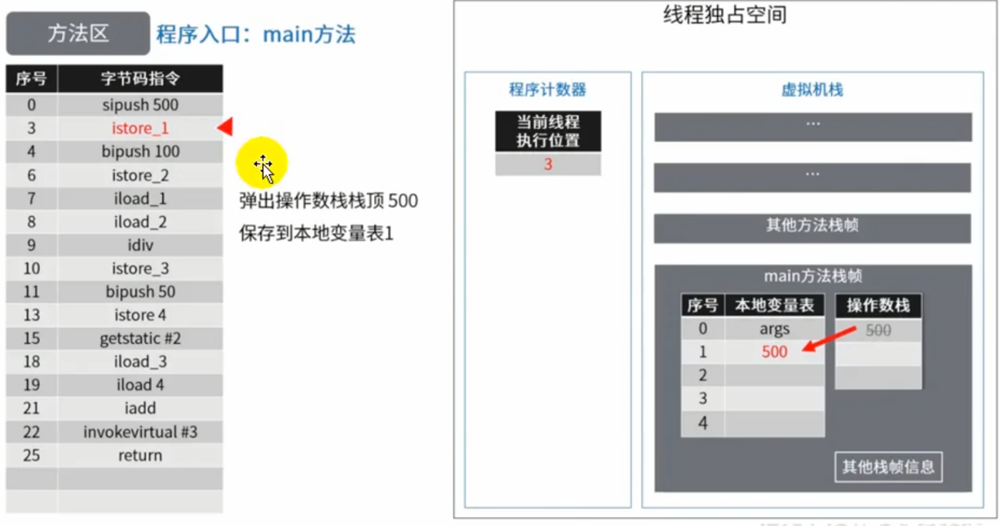


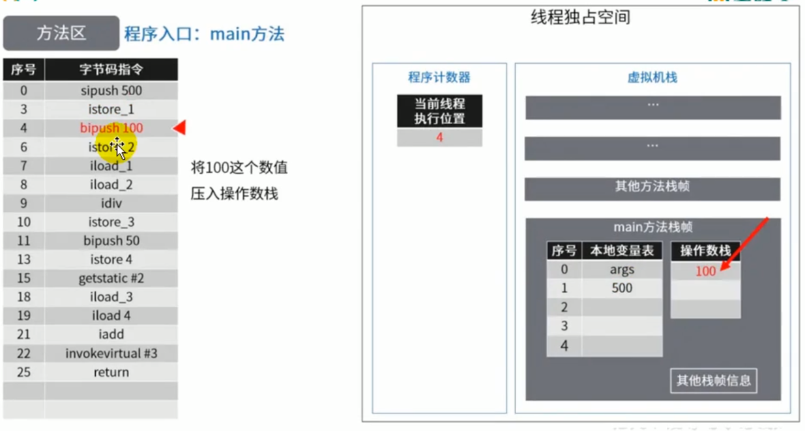


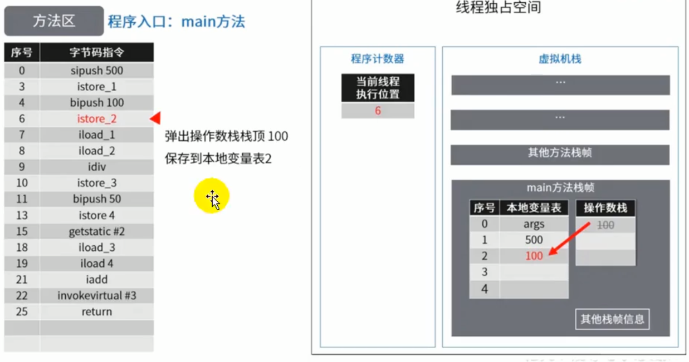


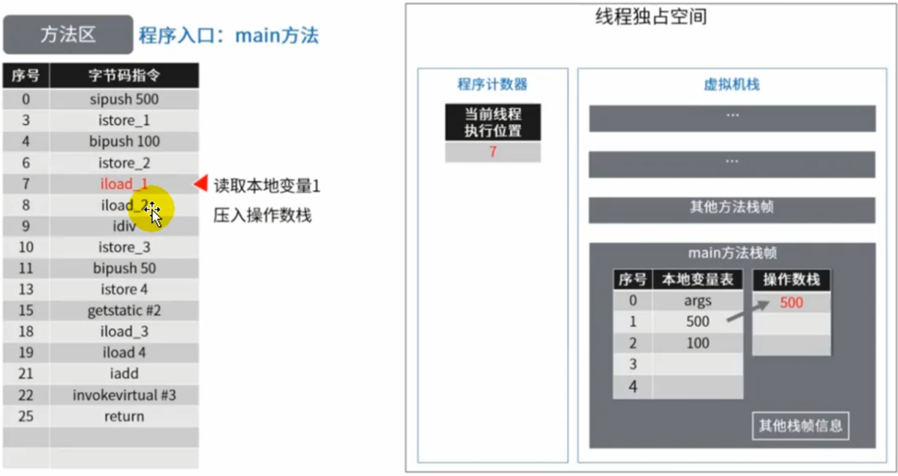


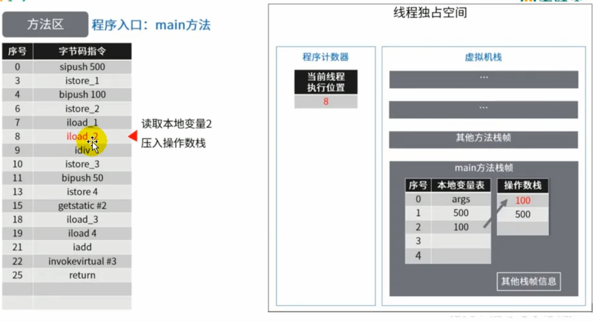


# 方法区的演进

## 方法区的演进jdk6,7,8

1.首先明确:只有 Hotspotオ有永久代BEA] Rockit、IBM]9等来说，是不存在永久代的概念的。原则上如何实现方法区属于虚拟机实现细节，不受《]ava虚拟机规范》管束，并不要求统一。

2.Hotspot中方法区的变化:

| JDK1.6以及之前 | 有永久代(permanent generation)，静态变量存放在永久代上。     |
| -------------- | ------------------------------------------------------------ |
| jdk1.7         | 有永久代，但已经逐步“去永久代”，字符串常量池、静态变量被移除，保存在堆中。 |
| jdk1.8及之后   | 无永久代，类型信息、字段、方法、常量保存在本地内存的元空间，但字符串常量池、静态变量仍保存在堆。 |






## 永久代为什么要被元空间替换？

http://openjdk.java.net/jeps/122

**Motivation**

This is part of the JRockit and Hotspot convergence effort. JRockit customers do not need to configure the permanent generation (since JRockit does not have a permanent generation) and are accustomed to not configuring the permanent generation.

随着Java8的到来，Hotspot VM中再也见不到永久代了。但是这并不意味着类的元数据信息也消失了。这些数据被移到了一个与堆不相连的本地内存区域，这个区域叫做元空间( Metaspace)。

由于类的元数据分配在本地内存中，元空间的最大可分配空间就是系统可用内存空间。

这项改动是很有必要的，原因有：

1)为永久代设置空间大小是很难确定的。在某些场景下，如果动态加载类过多，容易产生Perm区的OOM。比如某个实际Web工程中，因为功能点比较多，在运行过程中，要不断动态加载很多类，经常出现致命错误。Exception in thread 'dubbo client x. x connector' java.lang.OutOfMemory Error: PermGen。

而元空间和永久代之间最大的区别在于：元空间并不在虚拟机中，而是使用本地内存。因此，默认情况下，元空间的大小仅受本地内存限制。

2)对永久代进行调优是很困难的。

## String Table为什么要调整?

jdk7中将 String Table放到了堆空间中。因为永久代的回收效率很低，在full gc的时候才会触发。而full gc是老年代的空间不足、永久代不足时才会触发。这就导致 String table回收效率不高。而我们开发中会有大量的字符串被创建，回收效率低，导致永久代内存不足。放到堆里，能及时回收内存。

interned Strings 字符串字面量

## 静态变量放在哪里？

静态引用对应的对象实体始终都存在堆空间

```java
/**
 * 结论：
 * 静态引用对应的对象实体始终都存在堆空间
 *
 * jdk7：
 * -Xms200m -Xmx200m -XX:PermSize=300m -XX:MaxPermSize=300m -XX:+PrintGCDetails
 * jdk 8：
 * -Xms200m -Xmx200m -XX:MetaspaceSize=300m -XX:MaxMetaspaceSize=300m -XX:+PrintGCDetails
 * @author shkstart  shkstart@126.com
 * @create 2020  21:20
 */
public class StaticFieldTest {
    private static byte[] arr = new byte[1024 * 1024 * 100];//100MB

    public static void main(String[] args) {
        System.out.println(StaticFieldTest.arr);
    }
}
```

jdk8:

```
[B@4554617c
Heap
 PSYoungGen      total 59904K, used 5171K [0x00000000fbd80000, 0x0000000100000000, 0x0000000100000000)
  eden space 51712K, 10% used [0x00000000fbd80000,0x00000000fc28cef0,0x00000000ff000000)
  from space 8192K, 0% used [0x00000000ff800000,0x00000000ff800000,0x0000000100000000)
  to   space 8192K, 0% used [0x00000000ff000000,0x00000000ff000000,0x00000000ff800000)
 ParOldGen       total 136704K, used 102400K(这是100M的字节数组) [0x00000000f3800000, 0x00000000fbd80000, 0x00000000fbd80000)
  object space 136704K, 74% used [0x00000000f3800000,0x00000000f9c00010,0x00000000fbd80000)
 Metaspace       used 3306K, capacity 4496K, committed 4864K, reserved 1056768K
  class space    used 359K, capacity 388K, committed 512K, reserved 1048576K
```

## 对象和名字放哪的

JDK9之后自带的工具：jhsdb可以查看变量的内存地址。

```java
/**
 * 《深入理解Java虚拟机》中的案例：
 * staticObj、instanceObj、localObj存放在哪里？
 * @author shkstart  shkstart@126.com
 * @create 2020  11:39
 */
public class StaticObjTest {
    static class Test {
        static ObjectHolder staticObj = new ObjectHolder();
        ObjectHolder instanceObj = new ObjectHolder();

        void foo() {
            ObjectHolder localObj = new ObjectHolder();
            System.out.println("done");
        }
    }

    private static class ObjectHolder {
    }

    public static void main(String[] args) {
        Test test = new StaticObjTest.Test();
        test.foo();
    }
}
```

工具的使用过程不说了，直接说结论:

staticObj随着Test的类型信息存放在方法区, instanceObj随着Test的对象实例存放在Java堆，localObject则是存放在foo()方法栈帧的局部变量表中。

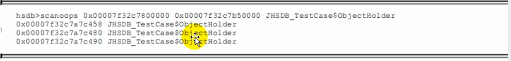

**测试发现：三个对象的数据在内存中的地址都落在Eden区范围内，所以结论：只要是对象实例必然会在java堆中分配。**

接着，找到了一个引用该 staticObj对象的地方，是在一个java.lang.Class的实例里，并且给出了这个实例的地址，通过 Inspector查看该对象实例，可以清楚看到这确实是一个java.langClass类型的对象安例，里面有一个名为 staticObj的实例字段。

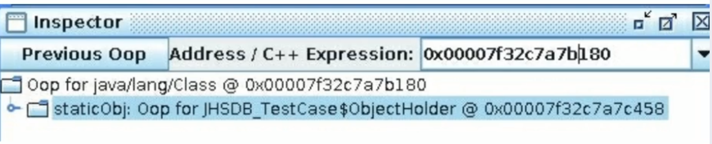

从《Java虛拟机规范》所定义的概念模型来看，所有class相关的信息都应该存放在方法区之中，但方法区该如何实现，《Java虚拟机规范》并未做出规定，这就成了一件允许不同虚拟机自己灵活把握的事情。**JDK7及其以后版本的 Hotspot虚拟杋选择把静态变量与类型在Java语言一端的映射 Class对象存放在一起，存储于Java堆之中，从我们的实验中也明确验证了这一点。**

# 方法区的垃圾回收

有些人认为方法区如 Hotspot虚拟机中的元空间或者永久代)是没有垃圾收集行为的，其实不然。《Java虚拟机规范》对方法区的约束是非常宽松的，提到过可以不要求虚拟机在方法区中实现垃圾收集。事实上也确实有未实现或未能完整实现方法区类型卸载的收集器存在(如**JDK11时期的ZGC收集器就不支持类卸载**)。

一般来说**这个区域的回收效果比较难令人满意，尤其是类型的卸载，条件相当苛刻**。但是这部分区域的回收**有时又确实是必要**的。以前Sun公司的Bug列表中，曾出现过的若干个严重的Bug就是由于低版本的 Hotspot虚拟机对此区域未完全回收而导致内存泄漏。方法区的垃圾收集主要回收两部分内容：常量池中废弃的常量和不再使用的类型。

先来说说**方法区内常量池之中主要存放的两大类常量：字面量和符号引用**。字面量比较接近Java语言层次的常量概念，如文本字符串、被声明为final的常量值等。而符号引用则属于编译原理方面的概念，包括下面三类常量:

- 1、类和接口的全限定名
- 2、字段的名称和描述符
- 3、方法的名称和描述符

Hotspot虚拟机对常量池的回收策略是很明确的,只要常量池中的常量没有被任何地方引用,就可以被回收。

回收废弃常量与回收Java堆中的对象非常类似。


判定一个常量是否“废弃”还是相对简单，而要判定一个类型是否属于“不再被使用的类”的条件就比较苛刻了。需要同时满足下面三个条件：

- 该类所有的实例都已经被回收，也就是]ava堆中不存在该类及其任何派生子类的实例。

- 加载该类的类加载器已经被回收，这个条件除非是经过精心设计的可替换类加载器的场景,如OSGi、JSP的重加载等,否则通常是很难达成的。

- 该类对应的java.lang.Class对象没有在任何地方被引用，无法在任何地方通过反射访问该类的方法。

Java虚拟机被允许对满足上述三个条件的无用类进行回收，这里说的仅仅是“被允许”，而并不是和对象一样，没有引用了就必然会回收。关于是否要对类型进行回收，Hotspot虚拟机提供了-Xnoclassgc参数进行控制，还可以使用-verbose:c]ass以及-X:+TraceClass-Loading、-XX:+TraceClassUnloading查看类加载和卸载信息

在大量使用反射、动态代理、 CGLib等字节码框架，动态生成JSP以及OSGi这类频繁自定义类加载器的场景中，通常都需要Java虚拟机具备类型卸载的能力，以保证不会对方法区造成过大的内存压力。

# 运行时数据区小结


# 常见面试题

百度三面：说一下]VM内存模型吧，有哪些区?分别干什么的?

蚂蚁金服：Java8的内存分代改进JVM内存分哪几个区，每个区的作用是什么？
一面：JVM内存分布/内存结构？栈和堆的区别？堆的结构？为什么两个 survivor区？
二面：Eden和 Survior的比例分配。

小米：JVM内存分区，为什么要有新生代和老年代

字节跳动
二面：Java的内存分区
二面：讲讲JVM运行时数据库区
什么时候对象会进入老年代?

京东JVM的内存结构，Eden和 Survivor比例。JVM内存为什么要分成新生代，老年代，持久代。新生代中为什么要分为Eden和 Survivor。

天猫：JVM内存模型以及分区，需要详细到每个区放什么。JVM的内存模型，Java8做了什么修改

拼多多JVM内存分哪几个区，每个区的作用是什么?

美团:Java内存分配，jvm的永久代中会发生垃圾回收吗? jvm内存分区，为什么要有新生代和老年代?

1
