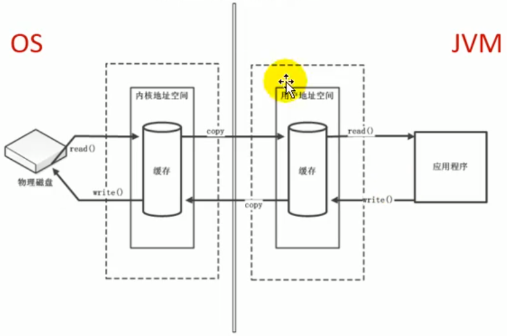
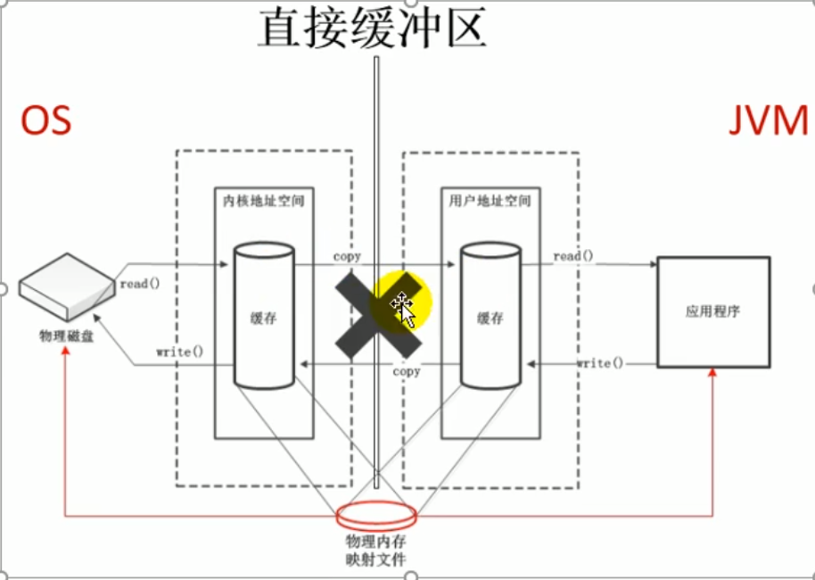
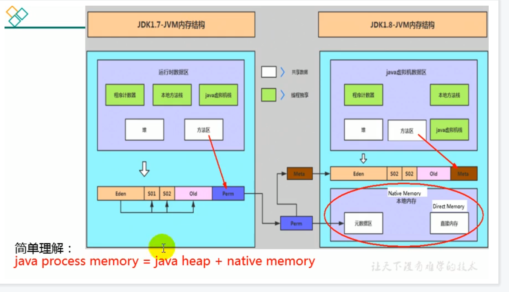

# 直接内存direct Memory

## 直接内存概述

不是虚拟机运行时数据区的一部分，也不是《Java虚拟机规范》中定义的内存区域。

直接内存是在Java堆外的、直接向系统申请的内存区间。

来源于NIO,通过存在堆中的 DirectByteBuffer操作 Native内存。

通常，访问直接内存的速度会优于Java堆。即读写性能高。

- 因此出于性能考虑,读写频繁的场合可能会考虑使用直接内存；

- Java的NIo库允许Java程序使用直接内存,用于数据缓冲区

直接内存和元空间都是采用的本地内存。

```java
/**
 *  IO                  NIO (New IO / Non-Blocking IO)
 *  byte[] / char[]     Buffer
 *  Stream              Channel
 *
 * 查看直接内存的占用与释放
 * @author shkstart  shkstart@126.com
 * @create 2020  0:22
 */
public class BufferTest {
    private static final int BUFFER = 1024 * 1024 * 1024;//1GB

    public static void main(String[] args){
        //直接分配本地内存空间
        ByteBuffer byteBuffer = ByteBuffer.allocateDirect(BUFFER);
        System.out.println("直接内存分配完毕，请求指示！");

        Scanner scanner = new Scanner(System.in);
        scanner.next();

        System.out.println("直接内存开始释放！");
        byteBuffer = null;
        System.gc();
        scanner.next();
    }
}
```

查看任务管理器中，这个进程的内存占用的变化情况。

### 非直接缓冲区

读写文件，需要与磁盘交互，需要由用户态切换到内核态。在内核态时，需要内存如右图的操作。使用IO，见右图。这里需要两份内存存储重复数据，效率低。




### 直接缓冲区

使用NIO时，如右图操作系统划出的直接缓存区可以被java代码直接访问，只有一份。NIO适合对大文件的读写操作。




案例：

使用NIO和BIO对一部１.５GB的电影进行拷贝，发现NIO比BIO快一点，但没有快很多，原因是BIO的底层已经使用NIO优化过了，所以差距不明显。

## 直接内存OOM

也可能导致 OutOfMemoryError异常

由于直接内存在Java堆外，因此它的大小不会直接受限于-Xmx指定的最大堆大小，但是系统内存是有限的，Java堆和直接内存的总和依然受限于操作系统能给出的最大内存。

缺点

- **分配回收成本较高**
- 不受JVM内存回收管理

直接内存大小可以通过 MaxDirectMemorySize设置

**如果不指定,默认与堆的最大值-Xmx参数值一致**

```java
/**
 * 本地内存的OOM:  OutOfMemoryError: Direct buffer memory
 *
 * @author shkstart  shkstart@126.com
 * @create 2020  0:09
 */
public class BufferTest2 {
    private static final int BUFFER = 1024 * 1024 * 20;//20MB

    public static void main(String[] args) {
        ArrayList<ByteBuffer> list = new ArrayList<>();

        int count = 0;
        try {
            while(true){
                ByteBuffer byteBuffer = ByteBuffer.allocateDirect(BUFFER);
                list.add(byteBuffer);
                count++;
                try {
                    Thread.sleep(100);
                } catch (InterruptedException e) {
                    e.printStackTrace();
                }
            }
        } finally {
            System.out.println(count);
        }


    }
}
```

使用visualVM JProfiler等工具监控不到直接内存的情况，可以在任务管理器里查看。


```java
/**
 * -Xmx20m -XX:MaxDirectMemorySize=10m
 * @author shkstart  shkstart@126.com
 * @create 2020  0:36
 */
public class MaxDirectMemorySizeTest {
    private static final long _1MB = 1024 * 1024;

    public static void main(String[] args) throws IllegalAccessException {
        Field unsafeField = Unsafe.class.getDeclaredFields()[0];
        unsafeField.setAccessible(true);
        Unsafe unsafe = (Unsafe)unsafeField.get(null);
        while(true){
            unsafe.allocateMemory(_1MB);
        }

    }
}
```

```
Exception in thread "main" java.lang.OutOfMemoryError
	at sun.misc.Unsafe.allocateMemory(Native Method)
	at com.atguigu.java.MaxDirectMemorySizeTest.main(MaxDirectMemorySizeTest.java:20)

```



1