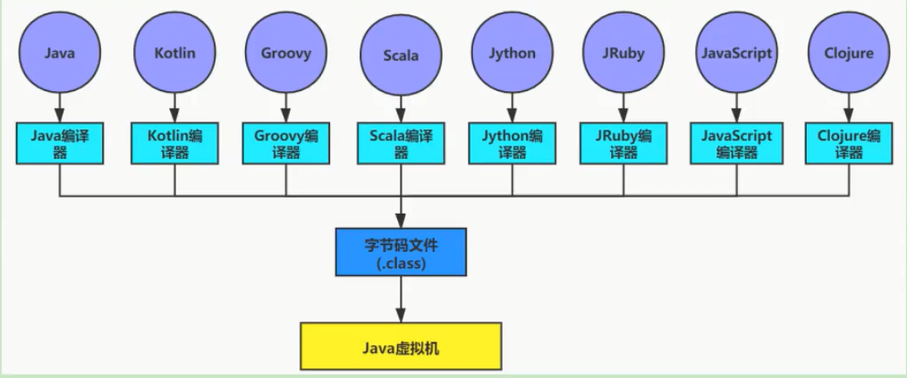
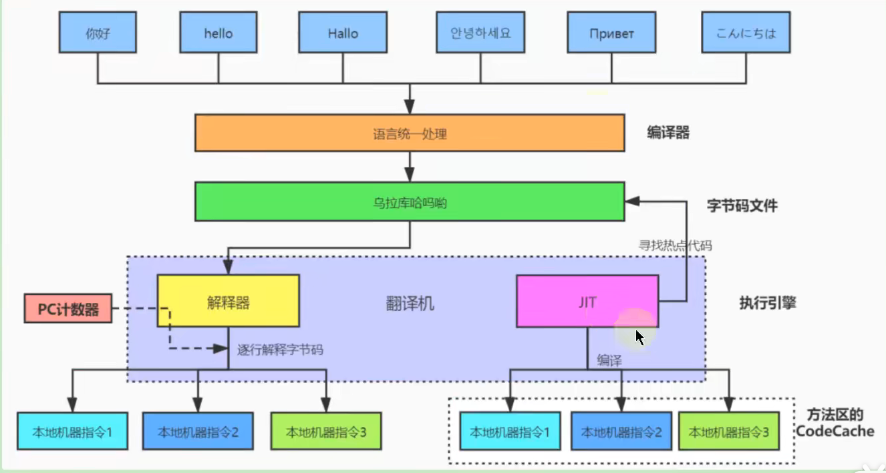

# 概述

## 字节码文件的跨平台性

1.Java语言：跨平台的语言

- 当Java源代码成功编译成字节码后，如果想在不同的平台上面运行，则无须再次编译

- 这个优势不再那么吸引人了。 Python、PHP、Perl、Ruby、Lisp等有强大的解释器
- **跨平台似乎已经快成为一门语言必选的特性**

2.**Java虚拟机：跨语言的平台**

Java虚拟机不和包括Java在内的任何语言绑定，它只与“ Class文件”这种特定的二进制文件格式所关联。无论使用何种语言进行软件开发，只要能将源文件编译为正确的 Class文件，那么这种语言就可以在Java虚拟机上执行。可以说，统一而强大的Class文件结构，就是]ava虚拟机的基石、桥梁



https://docs.oracle.com/javase/specs/index.html

所有的JWM全部遵守]ava虚拟机规范，也就是说所有的JVM环境都是一样的，这样一来字节码文件可以在各种JVM上运行

3.想要让一个]ava程序正确地运行在JVM中，java源码就必须要被编译为符合JVM规范的字节码。

- **前端编译器**的主要任务就是负责将符合Java语法规范的java代码转换为符合JVM规范的字节码文件

- Javac，是一种能够将]ava源码编译为字节码的前端编译器
- javac编译器在将java源码编译为一个有效的字节码文件过程中经历了4个步骤，分别是**词法解析、语法解析、语义解析以及生成字节码**。

oracle的JDK软件包括两部分内容:

- 一部分是将]ava源代码编译成java虚拟机的指令集的编译器
- 另一部分是用于实现java虚拟机的运行时环境

## 了解java前端编译器



前端编译器vs后端编译器

Java源代码的编译结果是字节码，那么肯定需要有一种编译器能够将Jaνa源码编译为字节码，承担这个重要责任的就是配置在path环境变量中的 **Javac编译器**。 Javac是一种能够将]ava源码编译为字节码的**前端编译器**

HotSpot VM并没有强制要求前端编译器只能使用 Javac来编译字节码，其实只要编译结果符合JVM规范都可以被JVM所识别即可在Java的前端编译器领域，除了 Javac之外，还有一种被大家经常用到的前端编译器，那就是内置在 Eclipse中的**ECJ(Eclipse Compiler for Java)编译器**。和 Javac的全量式编译不同，ECJ是一种增量式编译器。·

- 在Eclipse 中，当开发人员编写完代码后，使用“ctrl+S”快捷键时，ECJ编译器所釆取的编译方案是把未编译部分的源码逐行进行编译，而非每次都全量编译。因此EC的编译效率会比 Javac更加迅速和高效，当然编译质量和 Javac相比大致还是一样的。
- ECJ不仅是Eclipse默认内置前端编译器，在 Tomcat中同样也是使用ECJ编译器来编译jsp文件。由于ECJ编译器是采用GPLv2的开源协议进行源代码公开，所以，大家可以登录 eclipse官网下载ECJ编译器的源码进行二次开发。·默认情况下，DEA使用 Javac编译器。(还可以自己设置为 AspectJ编译器ECJ)

前端编译器并不会直接涉及编译优化等方面的技术，而是将这些具体优化细节移交给Hotsρot的JIT编译器负责。

复习:AOT(静态提前编译器， Ahead Of Time Compiler)

## 通过字节码看代码执行细节

例子一：

```java
Integer x = 5;
int y = 5;
System.out.println(x==y);
```

```
 0 iconst_5
 1 invokestatic #2 <java/lang/Integer.valueOf : (I)Ljava/lang/Integer;>
 4 astore_1
 5 iconst_5
 6 istore_2
 7 getstatic #3 <java/lang/System.out : Ljava/io/PrintStream;>
10 aload_1
11 invokevirtual #4 <java/lang/Integer.intValue : ()I>
14 iload_2
15 if_icmpne 22 (+7)
18 iconst_1
19 goto 23 (+4)
22 iconst_0
23 invokevirtual #5 <java/io/PrintStream.println : (Z)V>
26 return

```

例子二：

```java
/**
 * 成员变量(非静态)的赋值过程：1.默认初始化 2.显式初始化/代码块中初始化 3.构造器初始化 4.对象.属性 或 对象.方法
 */
class Father {
    int x = 10;

    public Father() {
        this.print();
        x = 20;
    }

    public void print() {
        System.out.println("Father.x = " + x);
    }
}

class Son extends Father {
    int x = 30;
    public Son() {
        this.print();
        x = 40;
    }
    public void print() {
        System.out.println("Son.x = " + x);
    }
}

public class SonTest {
    public static void main(String[] args) {
        Father f = new Son();
        System.out.println(f.x);
    }
}
```

结果：

```
Son.x = 0
Son.x = 30
20
```

注意属性不存在多态的说法，方法才有多态

Son类的构造方法对应的字节码

```java
 0 aload_0 //this
 1 invokespecial #1 <com/potato/Father.<init> : ()V>
 4 aload_0
 5 bipush 30
 7 putfield #2 <com/potato/Son.x : I>
10 aload_0
11 invokevirtual #3 <com/potato/Son.print : ()V>
14 aload_0
15 bipush 40
17 putfield #2 <com/potato/Son.x : I>
20 return
```

## 什么是字节码指令(byte code)

Java虚拟机的指令由**一个字节长度**的、代表着某种特定操作含义的**操作码( opcode)**以及跟随其后的零至多个代表此操作所需参数的**操作数( operand)**所构成。虚拟机中许多指令并不包含操作数，只有一个操作码比如

```java
aload_0
astore_3
return
```

如何查看字节码文件？

- 使用javap命令：jdk自带的反解析工具

- notepad++插件Hex-Editor，或者Binary Viewer
- IDEA：jclasslib 插件，jclasslib还有独立的客户端：jclasslib bytecode viewer


## class文件本质和内部数据结构

https://docs.oracle.com/javase/specs/jvms/se8/html/jvms-4.html

任何一个Class文件都对应着唯一一个类或接口的定义信息，但反过来说，Class文件实际上它并不一定以磁盘文件的形式存在。class文件是一组以8位字节为基础单位的**二进制流**。

Class的结构不像XML等描述语言，由于它没有任何分隔符号。所以在其中的数据项，无论是字节顺序还是数量，都是被严格限定的.哪个字节代表什么含义，长度是多少，先后顺序如何，都不允许改变。

class文件格式釆用一种类似于C语言结构体的方式进行数据存储，这种结构中只有两种数据类型：**无符号数和表**

**无符号数**属于基本的数据类型，以**u1、u2、u4、u8**来分别代表1个字节、2个字节、4个字节和8个字节的无符号数无符号数可以用来描述**数字、索引引用、数量值或者按照UTF-8编码构成字符串值**

**表**是由多个无符号数或者其他表作为数据项构成的复合数据类型，所有表都习惯性地以“**_info**”结尾。表用于描述有层次关系的复合结构的数据，**整个Class文件本质上就是一张表**。由于表没有固定长度，所以通常会在其前面加上个数说明。

# Class文件结构概述

Class文件的结构并不是一成不变的，随着Java虚拟机的不断发展，总是不可避兔地会对class文件结构做出一些调整，但是其基本结构和框架是非常稳定的，class文件的总体结构如下

- 魔数
- Class文件版本
- 常量池
- 访问标志
- 类索引，父类索引，接口索引集合
- 字段表集合
- 方法表集合
- 属性表集合

```
ClassFile {
    u4             magic;
    u2             minor_version;
    u2             major_version;
    u2             constant_pool_count;
    cp_info        constant_pool[constant_pool_count-1];
    u2             access_flags;
    u2             this_class;
    u2             super_class;
    u2             interfaces_count;
    u2             interfaces[interfaces_count];
    u2             fields_count;
    field_info     fields[fields_count];
    u2             methods_count;
    method_info    methods[methods_count];
    u2             attributes_count;
    attribute_info attributes[attributes_count];
}
```


| 类型           | 名称                | 说明                    | 长度（字节） | 数量                  |
| -------------- | ------------------- | ----------------------- | :----------: | --------------------- |
| u4             | magic               | 魔数，识别Class文件格式 |      4       | 1                     |
| u2             | minor_version       | 副版本号(小版本)        |      2       | 1                     |
| u2             | major_version       | 主版本号（大版本）      |      2       | 1                     |
| u2             | constant_pool_count | 常量池计数器            |      2       | 2                     |
| cp_info        | constant_pool       | 常量池表                |      n       | constant_pool_count-1 |
| u2             | access_flags        | 访问标识                |      2       | 1                     |
| u2             | this_class          | 类索引                  |      2       | 1                     |
| u2             | super_class         | 父类索引                |      2       | 1                     |
| u2             | interfaces_count    | 接口计数器              |      2       | 1                     |
| u2             | interfaces          | 接口索引集合            |      2       | interfaces_count      |
| u2             | fields_count        | 字段计数器              |      2       | 1                     |
| field_info     | fields              | 字段表                  |      n       | fields_count          |
| u2             | methods_count       | 方法计数器              |      2       | 1                     |
| method_info    | methods             | 方法表                  |      n       | methods_count         |
| u2             | attributes_count    | 属性计数器              |      2       | 1                     |
| attribute_info | attributes          | 属性表                  |      n       | attributes_count      |


# 魔数和版本号

**魔数**  magic number

每个Class文件开头的4个字节的无符号整数称为魔数( Magic Number)它的唯一作用是确定这个文件是否为一个能被虚拟机接受的有效合法的Class文件。即:魔数是Class文件的标识符。魔数值固定为 0XCAFEBABE。不会改变。

如果一个Class文件不以 0XCAFEBABE-开头，虚拟机在进行文件校验的时候就会直接抛出以下错误

Error: A JNI error has occurred， please check your installation and try againException in thread main" Java.lang. ClassFormatError: Incompatible magic value 1885430635 in classfile Stringtest

使用魔数而不是扩展名来进行识别主要是基于安全方面的考虑，因为文件扩展名可以随意地改动

**版本号**

紧接着魔数的4个字节存储的是Class文件的版本号。同样也是4个字节。第5个和第6所代表的含义就是编译的副版本号 minor_ version，而第7个和第8个字节就是编译的主版本号 major version

它们共同构成了Class文件的格式版本号。譬如某个Class文件的主版本号为M，副版本号为m，那么这个Class文件的格式版本号就确定为M.m。版本号和]ava编译器的对应关系如下表：


| 主版本（十进制） | 副版本（十进制） | 编译器版本 |
| ---------------- | ---------------- | ---------- |
| 45               | 3                | 1.1        |
| 46               | 0                | 1.2        |
| 47               | 0                | 1.3        |
| 48               | 0                | 1.4        |
| 49               | 0                | 1.5        |
| 50               | 0                | 1.6        |
| 51               | 0                | 1.7        |
| 52               | 0                | 1.8        |
| 53               | 0                | 1.9        |
| 54               | 0                | 1.10       |
| 55               | 0                | 1.11       |
|                  |                  |            |

- Java的版本号是从45开始的，JDK1.1之后的每个]DK大版本发布主版本号向上加1。
- 不同版本的Java编译器编译的 Class文件对应的版本是不一样的。目前，高版本的]ava虚拟机可以执行由低版本编译器生成的Class文件，但是低版本的Java虚拟机不能执行由高版本编译器生成的Class文件。否则JVM会抛出java.lang.UnsupportedXlassVersionError异常。
- 在实际应用中，由于开发环境和生产环境的不同，可能会导致该问题的发生。因此，需要我们在开发时，特别注意开发编译的JDK版本和生产环境中的]DK版本是否一致。
- 虚拟机]DK版本为1.k(k>=2)时，对应的Class文件格式版本号的范围为45.0-44+k.0(含两端)

# 常量池

常量池是Class文件中内容最为丰富的区域之一，常量池对于class文件中的字段和方法解析也有着至关重要的作用。

随着Java虚拟机的不断发展，常量池的内容也日渐丰富。可以说，常量池是整个Class文件的基石。

```
cp_info{
    u1 tag;
    u1 info[];
}
```

在版本号之后，紧跟着的是常量池的数量，以及若干个常量池表项常量池中常量的数量是不固定的，所以在常量池的入口需要放置一项u2类型的无符号数，代表常量池容量计数值(constant_pool count)。与Java中语言习惯不一样的是，这个容量计数是从1而不是0开始的。

| 类型           | 名称                | 数量                  |
| -------------- | ------------------- | --------------------- |
| u2（无符号数） | constant_pool_count | 1                     |
| cp_info（表）  | constant_pool       | constant_pool_count-1 |

由上表可见，Class文件使用了一个前置的容量计数器( constant_pool_count)加若干个连续的数据项( constant_pool)的形式来描述常量池内容。我们把这一系列连续常量池数据称为常量池集合。

常量池表项中，用于存放编译时期生成的各种**字面量**和**符号引用**，这部分内容将在类加载后进入方法区的**运行时常量池**中存放。

## 常量池计数器

由于常量池的数量不固定，时长时短，所以需要放置两个字节来表示常量池容量计数值

常量池容量计数值(u2类型)：从1开始，表示常量池中有多少项常量。即 constant_pool_count=1表示常量池中有0个常量项。

通常我们写代码时都是从0开始的，但是这里的常量池却是从1开始，因为亡把第0项常量空岀来了。这是为了满足后面某些指向常量池的索引值的数据在特定情况下需要表达“不引用仼何一个常量池项目”的含乂，这种情况可用索引值0来表示。

## 常量池表

constant_pool是一种表结构，以1~ constant_pool_count-1为索引。表明了后面有多少个常量项。

常量池**主要**存放两大类常量：**字面量( Literal)和符号引用( Symbolic References)**

它包含了 class文件结构及其子结构中引用的所有字符串常量、类或接口名、字段名和其他常量。常量池中的每一项都具备相同的特征。

第1个字节作为类型标记，用于确定该项的格式，这个字节成为tag byte（标记字节、标签字节）

| 类型                             | 标志(或标识) | 描述                   |
| -------------------------------- | ------------ | ---------------------- |
| CONSTANT_utf8_info               | 1            | UTF-8编码的字符串      |
| CONSTANT_Integer_info            | 3            | 整形字面量             |
| CONSTANT_Float_info              | 4            | 浮点型字面量           |
| CONSTANT_Long_info               | 5            | 长整形字面量           |
| CONSTANT_Double_info             | 6            | 双精度浮点型字面量     |
| CONSTANT_Class_info              | 7            | 类或接口的符号引用     |
| CONSTANT_String_info             | 8            | 字符串类型字面量       |
| CONSTANT_Fieldref_info           | 9            | 字段的符号引用         |
| CONSTANT_Methodref_info          | 10           | 类中方法的符号引用     |
| CONSTANT_InterfaceMethodref_info | 11           | 接口中方法的符号引用   |
| CONSTANT_NameAndType_info        | 12           | 字段或方法的符号引用   |
| CONSTANT_MethodHandle_info       | 15           | 表示方法句柄           |
| CONSTANT_MethodType_info         | 16           | 标志方法类型           |
| CONSTANT_InvokeDynamic_info      | 18           | 表示一个动态方法调用点 |


### 字面量和符号引用

在对这些常量解读前，我们需要搞清楚几个概念常量池主要存放两大类常量：字面量( Literal)和符号引用( Symbolic References)。如下表：

| 常量     | 具体的常量          |
| -------- | ------------------- |
| 字面量   | 文本字符串          |
|          | 声明为final的常量值 |
| 符号引用 | 类和接口的全限定名  |
|          | 字段的名称和描述符  |
|          | 方法的名称和描述符  |

**全限定名**

全类名：com.potato.test.Demo

全限定名：com/potato/test/Demo 

仅仅是把包名的 ”.“ 替换成 ”/“，为了使来连续的多个全限定名之间不产生混淆，在使用时最后一般会加入一个”;“表示全限定名结束。

**简单名称**

简单名称是指没有类型和参数修饰的方法或字段名称，上面例子中的类的add()方法和num字段的简单名称分别是add和num。

**描述符**

**描述符的作用是用来描述字段的数据类型、方法的参数列表(包括数量、类型以及顺序)和返回值。**

根据描述符规则，基本数据类型(byte、char、 double、foat、int、long、 short、 boolean)以及代表无返回值的void类型都用一个大写字符来表示，而对象类型则用字符L加对象的全限定名来表示，详见下表：

数据类型：基本数据类型、引用数据类型

| 标志符 | 含义                                                    |
| ------ | ------------------------------------------------------- |
| B      | byte                                                    |
| C      | char                                                    |
| D      | double                                                  |
| F      | float                                                   |
| I      | int                                                     |
| J      | Long                                                    |
| S      | short                                                   |
| Z      | boolean                                                 |
| V      | void                                                    |
| L      | 对象类型：比如：Ljava/lang/Object;                      |
| [      | 数组类型，代表一维数组。比如：double[][][]\[][] is [[[D |

用描述符来描述方法时，按照先参数列表，后返回值的顺序描述，参数列表按照参数的严格顺序放在一组小括号“()”之内。如方法java.lang.String.tostring()的描述符为() Ljava/lang/String;，方法 int abc(int[] x，int y)的描述符为([II) I。

**补充说明**：

虚拟机在加载 Class文件时才会进行动态链接，也就是说， Class文件中不会保存各个方法和字段的最终内存布局信息，因此，这些宇段和方法的符号引用不经过转换是无法直接被虚拟机使用的。**当虚拟机运行时，需要从常量池中获得对应的符号引用，再在类加载过程中的解析阶段将其替换为直接引用，并翻译到具体的内存地址中**

这里说明下符号引用和直接引用的区别与关联：

- 符号引用：符号引用以**一组符号**来描述所引用的目标，符号可以是任何形式的字面量，只要使用时能无歧义地定位到目标即可。**符号引用与虚拟机实现的内存布局无关**，引用的目标并不一定已经加载到了内存中。
- 直接引用：**直接引用可以是直接指向目标的指针、相对偏移量或是一个能间接定位到目标的句柄。直接引用是与虚拟机实现的内存布局相关的**，同一个符号引用在不同司虚拟机实例上翻译出来的直接引用一般不会相同。如果有了直接引用，那说明引用的目标必定已经存在于内存之中了

