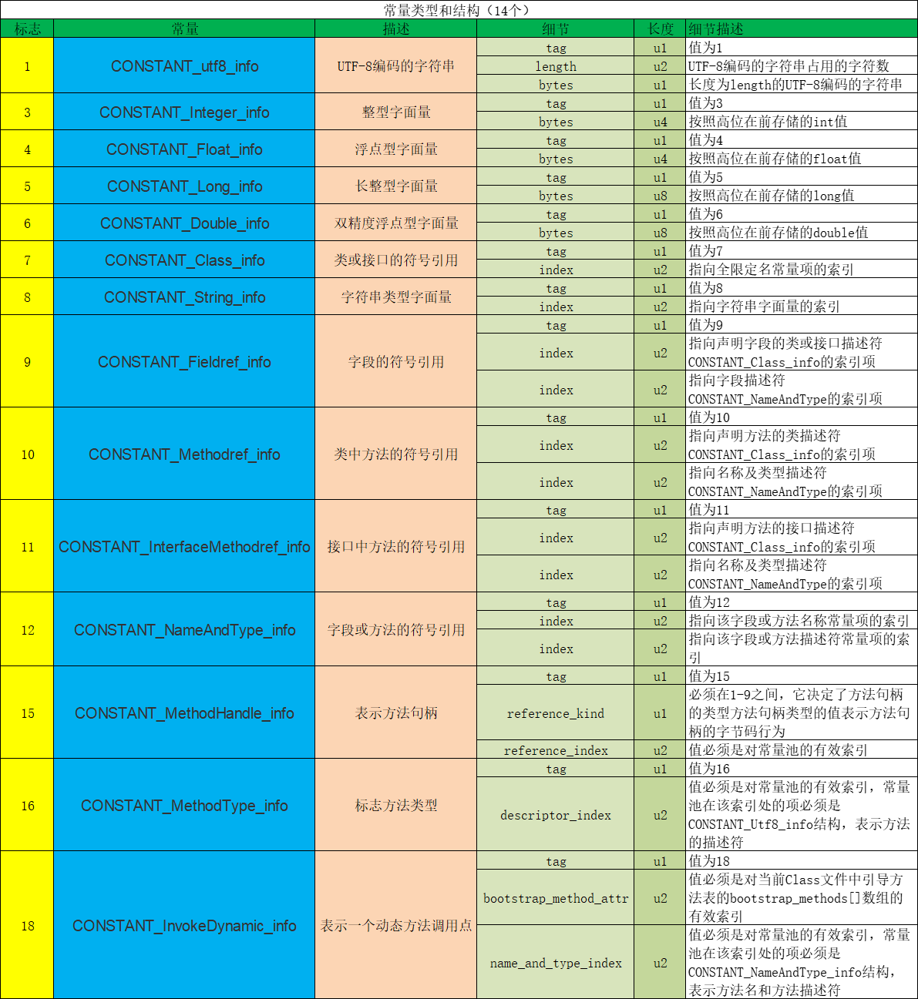
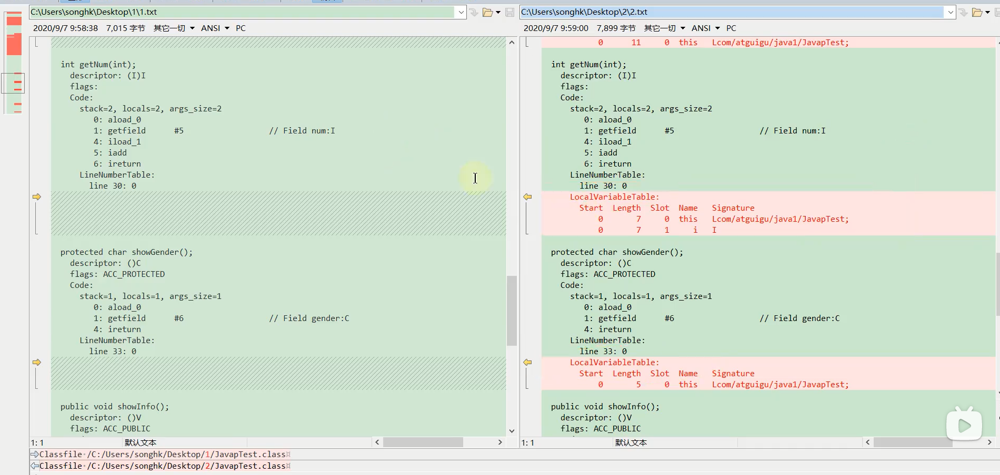

# 概述

## 字节码文件的跨平台性

1.Java语言：跨平台的语言

- 当Java源代码成功编译成字节码后，如果想在不同的平台上面运行，则无须再次编译

- 这个优势不再那么吸引人了。 Python、PHP、Perl、Ruby、Lisp等有强大的解释器
- **跨平台似乎已经快成为一门语言必选的特性**

2.**Java虚拟机：跨语言的平台**

Java虚拟机不和包括Java在内的任何语言绑定，它只与“ Class文件”这种特定的二进制文件格式所关联。无论使用何种语言进行软件开发，只要能将源文件编译为正确的 Class文件，那么这种语言就可以在Java虚拟机上执行。可以说，统一而强大的Class文件结构，就是Java虚拟机的基石、桥梁


https://docs.oracle.com/javase/specs/index.html

所有的JWM全部遵守]ava虚拟机规范，也就是说所有的JVM环境都是一样的，这样一来字节码文件可以在各种JVM上运行

3.想要让一个]ava程序正确地运行在JVM中，java源码就必须要被编译为符合JVM规范的字节码。

- **前端编译器**的主要任务就是负责将符合Java语法规范的java代码转换为符合JVM规范的字节码文件

- Javac，是一种能够将]ava源码编译为字节码的前端编译器
- javac编译器在将java源码编译为一个有效的字节码文件过程中经历了4个步骤，分别是**词法解析、语法解析、语义解析以及生成字节码**。

oracle的JDK软件包括两部分内容:

- 一部分是将]ava源代码编译成java虚拟机的指令集的编译器
- 另一部分是用于实现java虚拟机的运行时环境

## 了解java前端编译器


前端编译器vs后端编译器

Java源代码的编译结果是字节码，那么肯定需要有一种编译器能够将Jaνa源码编译为字节码，承担这个重要责任的就是配置在path环境变量中的 **Javac编译器**。 Javac是一种能够将]ava源码编译为字节码的**前端编译器**

HotSpot VM并没有强制要求前端编译器只能使用 Javac来编译字节码，其实只要编译结果符合JVM规范都可以被JVM所识别即可在Java的前端编译器领域，除了 Javac之外，还有一种被大家经常用到的前端编译器，那就是内置在 Eclipse中的**ECJ(Eclipse Compiler for Java)编译器**。和 Javac的全量式编译不同，ECJ是一种增量式编译器。·

- 在Eclipse 中，当开发人员编写完代码后，使用“ctrl+S”快捷键时，ECJ编译器所釆取的编译方案是把未编译部分的源码逐行进行编译，而非每次都全量编译。因此EC的编译效率会比 Javac更加迅速和高效，当然编译质量和 Javac相比大致还是一样的。
- ECJ不仅是Eclipse默认内置前端编译器，在 Tomcat中同样也是使用ECJ编译器来编译jsp文件。由于ECJ编译器是采用GPLv2的开源协议进行源代码公开，所以，大家可以登录 eclipse官网下载ECJ编译器的源码进行二次开发。·默认情况下，DEA使用 Javac编译器。(还可以自己设置为 AspectJ编译器ECJ)

前端编译器并不会直接涉及编译优化等方面的技术，而是将这些具体优化细节移交给Hotsρot的JIT编译器负责。

复习:AOT(静态提前编译器， Ahead Of Time Compiler)

## 通过字节码看代码执行细节

例子一：

```java
Integer x = 5;
int y = 5;
System.out.println(x==y);
```

```
 0 iconst_5
 1 invokestatic #2 <java/lang/Integer.valueOf : (I)Ljava/lang/Integer;>
 4 astore_1
 5 iconst_5
 6 istore_2
 7 getstatic #3 <java/lang/System.out : Ljava/io/PrintStream;>
10 aload_1
11 invokevirtual #4 <java/lang/Integer.intValue : ()I>
14 iload_2
15 if_icmpne 22 (+7)
18 iconst_1
19 goto 23 (+4)
22 iconst_0
23 invokevirtual #5 <java/io/PrintStream.println : (Z)V>
26 return

```

例子二：

```java
/**
 * 成员变量(非静态)的赋值过程：1.默认初始化 2.显式初始化/代码块中初始化 3.构造器初始化 4.对象.属性 或 对象.方法
 */
class Father {
    int x = 10;

    public Father() {
        this.print();
        x = 20;
    }

    public void print() {
        System.out.println("Father.x = " + x);
    }
}

class Son extends Father {
    int x = 30;
    public Son() {
        this.print();
        x = 40;
    }
    public void print() {
        System.out.println("Son.x = " + x);
    }
}

public class SonTest {
    public static void main(String[] args) {
        Father f = new Son();
        System.out.println(f.x);
    }
}
```

结果：

```
Son.x = 0
Son.x = 30
20
```

注意属性不存在多态的说法，方法才有多态

Son类的构造方法对应的字节码

```java
 0 aload_0 //this
 1 invokespecial #1 <com/potato/Father.<init> : ()V>
 4 aload_0
 5 bipush 30
 7 putfield #2 <com/potato/Son.x : I>
10 aload_0
11 invokevirtual #3 <com/potato/Son.print : ()V>
14 aload_0
15 bipush 40
17 putfield #2 <com/potato/Son.x : I>
20 return
```

## 什么是字节码指令(byte code)

Java虚拟机的指令由**一个字节长度**的、代表着某种特定操作含义的**操作码( opcode)**以及跟随其后的零至多个代表此操作所需参数的**操作数( operand)**所构成。虚拟机中许多指令并不包含操作数，只有一个操作码比如

```java
aload_0
astore_3
return
```

如何查看字节码文件？

- 使用javap命令：jdk自带的反解析工具

- notepad++插件Hex-Editor，或者Binary Viewer
- IDEA：jclasslib 插件，jclasslib还有独立的客户端：jclasslib bytecode viewer


## class文件本质和内部数据结构

https://docs.oracle.com/javase/specs/jvms/se8/html/jvms-4.html

任何一个Class文件都对应着唯一一个类或接口的定义信息，但反过来说，Class文件实际上它并不一定以磁盘文件的形式存在。class文件是一组以8位字节为基础单位的**二进制流**。

Class的结构不像XML等描述语言，由于它没有任何分隔符号。所以在其中的数据项，无论是字节顺序还是数量，都是被严格限定的.哪个字节代表什么含义，长度是多少，先后顺序如何，都不允许改变。

class文件格式釆用一种类似于C语言结构体的方式进行数据存储，这种结构中只有两种数据类型：**无符号数和表**

**无符号数**属于基本的数据类型，以**u1、u2、u4、u8**来分别代表1个字节、2个字节、4个字节和8个字节的无符号数无符号数可以用来描述**数字、索引引用、数量值或者按照UTF-8编码构成字符串值**

**表**是由多个无符号数或者其他表作为数据项构成的复合数据类型，所有表都习惯性地以“**_info**”结尾。表用于描述有层次关系的复合结构的数据，**整个Class文件本质上就是一张表**。由于表没有固定长度，所以通常会在其前面加上个数说明。

# Class文件结构概述

Class文件的结构并不是一成不变的，随着Java虚拟机的不断发展，总是不可避兔地会对class文件结构做出一些调整，但是其基本结构和框架是非常稳定的，class文件的总体结构如下

- 魔数
- Class文件版本
- 常量池
- 访问标志
- 类索引，父类索引，接口索引集合
- 字段表集合
- 方法表集合
- 属性表集合

```
ClassFile {
    u4             magic;
    u2             minor_version;
    u2             major_version;
    u2             constant_pool_count;
    cp_info        constant_pool[constant_pool_count-1];
    u2             access_flags;
    u2             this_class;
    u2             super_class;
    u2             interfaces_count;
    u2             interfaces[interfaces_count];
    u2             fields_count;
    field_info     fields[fields_count];
    u2             methods_count;
    method_info    methods[methods_count];
    u2             attributes_count;
    attribute_info attributes[attributes_count];
}
```


| 类型           | 名称                | 说明                    | 长度（字节） | 数量                  |
| -------------- | ------------------- | ----------------------- | :----------: | --------------------- |
| u4             | magic               | 魔数，识别Class文件格式 |      4       | 1                     |
| u2             | minor_version       | 副版本号(小版本)        |      2       | 1                     |
| u2             | major_version       | 主版本号（大版本）      |      2       | 1                     |
| u2             | constant_pool_count | 常量池计数器            |      2       | 2                     |
| cp_info        | constant_pool       | 常量池表                |      n       | constant_pool_count-1 |
| u2             | access_flags        | 访问标识                |      2       | 1                     |
| u2             | this_class          | 类索引                  |      2       | 1                     |
| u2             | super_class         | 父类索引                |      2       | 1                     |
| u2             | interfaces_count    | 接口计数器              |      2       | 1                     |
| u2             | interfaces          | 接口索引集合            |      2       | interfaces_count      |
| u2             | fields_count        | 字段计数器              |      2       | 1                     |
| field_info     | fields              | 字段表                  |      n       | fields_count          |
| u2             | methods_count       | 方法计数器              |      2       | 1                     |
| method_info    | methods             | 方法表                  |      n       | methods_count         |
| u2             | attributes_count    | 属性计数器              |      2       | 1                     |
| attribute_info | attributes          | 属性表                  |      n       | attributes_count      |


# 魔数和版本号

**魔数**  magic number

每个Class文件开头的4个字节的无符号整数称为魔数( Magic Number)它的唯一作用是确定这个文件是否为一个能被虚拟机接受的有效合法的Class文件。即:魔数是Class文件的标识符。魔数值固定为 0XCAFEBABE。不会改变。

如果一个Class文件不以 0XCAFEBABE-开头，虚拟机在进行文件校验的时候就会直接抛出以下错误

Error: A JNI error has occurred， please check your installation and try againException in thread main" Java.lang. ClassFormatError: Incompatible magic value 1885430635 in classfile Stringtest

使用魔数而不是扩展名来进行识别主要是基于安全方面的考虑，因为文件扩展名可以随意地改动

**版本号**

紧接着魔数的4个字节存储的是Class文件的版本号。同样也是4个字节。第5个和第6所代表的含义就是编译的副版本号 minor_ version，而第7个和第8个字节就是编译的主版本号 major version

它们共同构成了Class文件的格式版本号。譬如某个Class文件的主版本号为M，副版本号为m，那么这个Class文件的格式版本号就确定为M.m。版本号和]ava编译器的对应关系如下表：


| 主版本（十进制） | 副版本（十进制） | 编译器版本 |
| ---------------- | ---------------- | ---------- |
| 45               | 3                | 1.1        |
| 46               | 0                | 1.2        |
| 47               | 0                | 1.3        |
| 48               | 0                | 1.4        |
| 49               | 0                | 1.5        |
| 50               | 0                | 1.6        |
| 51               | 0                | 1.7        |
| 52               | 0                | 1.8        |
| 53               | 0                | 1.9        |
| 54               | 0                | 1.10       |
| 55               | 0                | 1.11       |
|                  |                  |            |

- Java的版本号是从45开始的，JDK1.1之后的每个]DK大版本发布主版本号向上加1。
- 不同版本的Java编译器编译的 Class文件对应的版本是不一样的。目前，高版本的]ava虚拟机可以执行由低版本编译器生成的Class文件，但是低版本的Java虚拟机不能执行由高版本编译器生成的Class文件。否则JVM会抛出java.lang.UnsupportedXlassVersionError异常。
- 在实际应用中，由于开发环境和生产环境的不同，可能会导致该问题的发生。因此，需要我们在开发时，特别注意开发编译的JDK版本和生产环境中的]DK版本是否一致。
- 虚拟机]DK版本为1.k(k>=2)时，对应的Class文件格式版本号的范围为45.0-44+k.0(含两端)

# 常量池

常量池是Class文件中内容最为丰富的区域之一，常量池对于class文件中的字段和方法解析也有着至关重要的作用。

随着Java虚拟机的不断发展，常量池的内容也日渐丰富。可以说，常量池是整个Class文件的基石。

```
cp_info{
    u1 tag;
    u1 info[];
}
```

在版本号之后，紧跟着的是常量池的数量，以及若干个常量池表项常量池中常量的数量是不固定的，所以在常量池的入口需要放置一项u2类型的无符号数，代表常量池容量计数值(constant_pool count)。与Java中语言习惯不一样的是，这个容量计数是从1而不是0开始的。

| 类型           | 名称                | 数量                  |
| -------------- | ------------------- | --------------------- |
| u2（无符号数） | constant_pool_count | 1                     |
| cp_info（表）  | constant_pool       | constant_pool_count-1 |

由上表可见，Class文件使用了一个前置的容量计数器( constant_pool_count)加若干个连续的数据项( constant_pool)的形式来描述常量池内容。我们把这一系列连续常量池数据称为常量池集合。

常量池表项中，用于存放编译时期生成的各种**字面量**和**符号引用**，这部分内容将在类加载后进入方法区的**运行时常量池**中存放。

## 常量池计数器

由于常量池的数量不固定，时长时短，所以需要放置两个字节来表示常量池容量计数值

常量池容量计数值(u2类型)：从1开始，表示常量池中有多少项常量。即 constant_pool_count=1表示常量池中有0个常量项。

通常我们写代码时都是从0开始的，但是这里的常量池却是从1开始，因为亡把第0项常量空岀来了。这是为了满足后面某些指向常量池的索引值的数据在特定情况下需要表达“不引用仼何一个常量池项目”的含乂，这种情况可用索引值0来表示。

## 常量池表

constant_pool是一种表结构，以1~ constant_pool_count-1为索引。表明了后面有多少个常量项。

常量池**主要**存放两大类常量：**字面量( Literal)和符号引用( Symbolic References)**

它包含了 class文件结构及其子结构中引用的所有字符串常量、类或接口名、字段名和其他常量。常量池中的每一项都具备相同的特征。

第1个字节作为类型标记，用于确定该项的格式，这个字节成为tag byte（标记字节、标签字节）

| 类型                             | 标志(或标识) | 描述                   |
| -------------------------------- | ------------ | ---------------------- |
| CONSTANT_utf8_info               | 1            | UTF-8编码的字符串      |
| CONSTANT_Integer_info            | 3            | 整形字面量             |
| CONSTANT_Float_info              | 4            | 浮点型字面量           |
| CONSTANT_Long_info               | 5            | 长整形字面量           |
| CONSTANT_Double_info             | 6            | 双精度浮点型字面量     |
| CONSTANT_Class_info              | 7            | 类或接口的符号引用     |
| CONSTANT_String_info             | 8            | 字符串类型字面量       |
| CONSTANT_Fieldref_info           | 9            | 字段的符号引用         |
| CONSTANT_Methodref_info          | 10           | 类中方法的符号引用     |
| CONSTANT_InterfaceMethodref_info | 11           | 接口中方法的符号引用   |
| CONSTANT_NameAndType_info        | 12           | 字段或方法的符号引用   |
| CONSTANT_MethodHandle_info       | 15           | 表示方法句柄           |
| CONSTANT_MethodType_info         | 16           | 标志方法类型           |
| CONSTANT_InvokeDynamic_info      | 18           | 表示一个动态方法调用点 |


### 字面量和符号引用

在对这些常量解读前，我们需要搞清楚几个概念常量池主要存放两大类常量：字面量( Literal)和符号引用( Symbolic References)。如下表：

| 常量     | 具体的常量          |
| -------- | ------------------- |
| 字面量   | 文本字符串          |
|          | 声明为final的常量值 |
| 符号引用 | 类和接口的全限定名  |
|          | 字段的名称和描述符  |
|          | 方法的名称和描述符  |

**全限定名**

全类名：com.potato.test.Demo

全限定名：com/potato/test/Demo 

仅仅是把包名的 ”.“ 替换成 ”/“，为了使来连续的多个全限定名之间不产生混淆，在使用时最后一般会加入一个”;“表示全限定名结束。

**简单名称**

简单名称是指没有类型和参数修饰的方法或字段名称，上面例子中的类的add()方法和num字段的简单名称分别是add和num。

**描述符**

**描述符的作用是用来描述字段的数据类型、方法的参数列表(包括数量、类型以及顺序)和返回值。**

根据描述符规则，基本数据类型(byte、char、 double、foat、int、long、 short、 boolean)以及代表无返回值的void类型都用一个大写字符来表示，而对象类型则用字符L加对象的全限定名来表示，详见下表：

数据类型：基本数据类型、引用数据类型

| 标志符 | 含义                                                    |
| ------ | ------------------------------------------------------- |
| B      | byte                                                    |
| C      | char                                                    |
| D      | double                                                  |
| F      | float                                                   |
| I      | int                                                     |
| J      | Long                                                    |
| S      | short                                                   |
| Z      | boolean                                                 |
| V      | void                                                    |
| L      | 对象类型：比如：Ljava/lang/Object;                      |
| [      | 数组类型，代表一维数组。比如：double[][][]\[][] is [[[D |

用描述符来描述方法时，按照先参数列表，后返回值的顺序描述，参数列表按照参数的严格顺序放在一组小括号“()”之内。如方法java.lang.String.tostring()的描述符为() Ljava/lang/String;，方法 int abc(int[] x，int y)的描述符为([II) I。

**补充说明**：

虚拟机在加载 Class文件时才会进行动态链接，也就是说， Class文件中不会保存各个方法和字段的最终内存布局信息，因此，这些宇段和方法的符号引用不经过转换是无法直接被虚拟机使用的。**当虚拟机运行时，需要从常量池中获得对应的符号引用，再在类加载过程中的解析阶段将其替换为直接引用，并翻译到具体的内存地址中**

这里说明下符号引用和直接引用的区别与关联：

- 符号引用：符号引用以**一组符号**来描述所引用的目标，符号可以是任何形式的字面量，只要使用时能无歧义地定位到目标即可。**符号引用与虚拟机实现的内存布局无关**，引用的目标并不一定已经加载到了内存中。
- 直接引用：**直接引用可以是直接指向目标的指针、相对偏移量或是一个能间接定位到目标的句柄。直接引用是与虚拟机实现的内存布局相关的**，同一个符号引用在不同司虚拟机实例上翻译出来的直接引用一般不会相同。如果有了直接引用，那说明引用的目标必定已经存在于内存之中了

### 常量类型和结构



## 小结

总结1

- 这14种表(或者常量项结构)的共同点是：表开始的第一位是一个u1类型的标志位(tag)，代表当前这个常量项使用的是哪种表结构，即哪种常量类型。
- 在常量池列表中， CONSTANT_Utf8_info。常量项是一种使用改进过的UTF-8编码格式来存储诸如文字字符串、类或者接口的全限定名、字段或者方法的简单名称以及描述符等常量字符串信息。
- 这14种常量项结构还有一个特点是，其中13个常量项占用的字节固定，只有 CONSTANT_Utf8_info占用字节不固定，其大小由length决定。为什么呢?**因为从常量池存放的内容可知，其存放的是字面量和符号引用，最终这些内容都会是一个字符串，这些字符串的大小是在编写程序时才确定**，比如你定义一个类，类名可以取长取短，所以在没编译前，大小不固定编译后，通过utf-8编码，就可以知道其长度。

总结2 

常量池：可以理解为Class文件之中的资源仓库，它是 Class文件结构中与其他项目关联最多的数据类型(后面的很多数据类型都会指向此处)，也是占用Class文件空间最大的数据项目之一

常量池中为什么要包含这些内容

Java代码在进行 Javac编译的时候，并不像C和C++那样有“连接”这一步骤，而是在虚拟机加载 Class文件的时候进行动态链接。也就是说，**在Class文件中不会保存各个方法、字段的最终内存布局信息，因此这些字段、方法的符号引用不经过运行期转换的话无法得到真正的内存入口地址，也就无法直接被虚拟机使用**。当虚拟机运行时，需要从常量池获得对应的符号引用，再在类创建时或运行时解析、翻译到具体的内存地址之中。关于类的创建和动态链接的内容，在虚拟机类加载过程时再进行详细讲解。

# Class的访问标识

access_flag 访问标志、访问标记

在常量池后，紧跟着访问标记。该标记使用两个字节表示，用于识别一些类或者接口层次的访问信息，包括:这个Class是**类**还是**接口**；是否定义为public类型；是否定义为 abstract类型；如果是类的话，是否被声明为final等。各种访问标记如下所示:

| 标志名称       | 标志值 | 含义                                                         |
| -------------- | ------ | ------------------------------------------------------------ |
| ACC_PUBLIC     | 0x0001 | 标识为public                                                 |
| ACC_FINAL      | 0x0010 | 标识被声明为final，只有类可用设置                            |
| ACC_SUPER      | 0x0020 | 标志允许使用invokespecial字节码指令的新语义，JDK1.0.2之后编译出来的类的这个标志默认为真。（使用增强的方法调用父类方法） |
| ACC_INTERFACE  | 0x0200 | 标志这个是一个接口                                           |
| ACC_ABSTRACT   | 0x0400 | 是否为abstract类型，对于接口或抽象类来说，此标志值为真，其他类型为假 |
| ACC_SYNTHETIC  | 0x1000 | 标志此类并非由用户代码产生（即，由编译器产生的类，没有源码对应） |
| ACC_ANNOTATION | 0x2000 | 标志这是一个注解                                             |
| ACC_ENUM       | 0x4000 | 标志这是一个枚举                                             |

- 类的访问权限通常为ACC开头的常量。
- 每一种类型的表示都是通过设置访问标记的32位中的特定位来实现的。比如，若是public final的类，则该标记为ACC_PUBLIC | ACC_FINAL。
- 使用ACC_SUPER可以让类更准确地定位到父类的方法 super.method()，现代编译器都会设置并且使用这个标记

**补充说明**：

- 带有ACC_INTERFACE标志的class文件表示的是接口而不是类，反之则表示的是类而不是接口

  - 如果一个class文件被设置了 ACC_INTERFACE标志，那么同时也得设置 ACC_ABSTRACT标志。同时它不能再设置 ACC_FINAL、ACC_SUPER或 ACC_ENUM标志

  - 如果没有设置 ACC_INTERFAC标志，那么这个class文件可以具有上表中除 ACC_ANNOTATION外的其他所有标志。当然， ACC_FINAL和ACC_ABSTRACT这类互斥的标志除外。这两个标志不得同时设置。

- ACC_SUPER标志用于确定类或接口里面的invokespecial指令使用的是哪一种执行语义。**针对Java虚拟机指令集的编泽器都应当设置这个标志**。对于java se8及后续版本来说，无论class文件中这个标志的实际值是什么，也不管class文件的版本号是多少，Java虚拟机都为每个class文件均设置了ACC_SUPER标志。
  - ACC_SUPER标志是为了向后兼容由旧]ava编译器所编译的代码而设计的。目前的 ACC_SUPER标志在由JDK1.0.2之前的编译器所生成的 access_flags中是没有确定含义的，如果设置了该标志，那么 Oracle的Java虚拟机实现会将其忽略。

- ACC_SYNTHETIC标志意味着该类或接口是由编译器生成的，而不是由源代码生成的。
- 注解类型必须设置 ACC_ANNOTATION标志。如果设置了 ACC_ANNOTATION标志，那么也必须设置 ACC INTERFACE标志。
- ACC_ENUM标志表明该类或其父类为枚举类型。
- 表中没有使用的 access_flags标志是为未来扩充而预留的，这些预留的标志在编译器中应该设置为0，Java虚拟机实现也应该忽略它们。

# 类索引、父类索引、接口索引集合

在访问标记后，会指定该类的类别、父类类别以及实现的接口，格式如下：

| 长度 | 含义                        |
| ---- | --------------------------- |
| u2   | this_class                  |
| u2   | super_class                 |
| u2   | interface_count             |
| u2   | interfaces[interface_count] |

这三项数据来确定这个类的继承关系

- 类索引用于确定这个类的全限定名
- 父类索引用于确定这个类的父类的全限定名。由于Java语言不允许多重继承，所以父类索引只有一个，除了java.lang.Object之外，所有的Java类都有父类，因此除了java.lang.Object外，所有Java类的父类索引都不为0
- 接口索引集合就用来描述这个类实现了哪些接口，这些被实现的接口将按 implements语句(如果这个类本身是接口，则应当是 extends语句)后的接口顺序从左到右排列在接口索引集合中。

**this_class(类索引)**

2字节无符号整数，指向常量池的索引。它提供了类的全限定名，如com/atguigu/java1/Demo。this_class的值必须是对常量池表中某项的一个有效索引值。常量池在这个索引处的成员必须为 CONSTANT_Class_info类型结构体，该结构体表示这个class文件所定义的类或接口

**super_class(父类索引)**

- 2字节无符号整数，指向常量池的索引。它提供了当前类的父类的全限定名。如果我们没有继承任何类，其默认继承的是java/lang/Object类。同时，出于Java不支持多继承，所以其父类只有一个。·\
- sper_class指向的父类不能是fina1

**interfaces**

- 指向常量池索引集合，它堤供了一个符号引用到所有已实现的接口
- 由于一个类可以实现多个接口，因此需要以数组形式保存多个接口的索引，表示接口的每个索引也是一个指向常量池的CONSTANT_Class(当然这里就必须是接口，而不是类)

**interfaces_count(接口计数器)**interfaces_count项的值表示当前类或接口的直接超接口数量。

**interfaces[\](接口索引集合)**

interfaces[]中每个成员的值必须是对常量池表中某项的有效索引值，它的长度为 interfaces_count。每个成员interfaces[i]必须为 CONSTANT_Class_info结构，其中0<=i< interfaces_ count。在 interfaces[]中，各成员所表示的接口顺序和对应的源代码中给定的接口顺序(从左至右)一样，即 interfaces[0]对应的是源代码中最左边的接口

# 字段表集合

**fields**

用于描述接口或类中声明的变量。字段(field)包括**类级变量以及实例级变量**，但是不包括方法内部、代码块内部声明的局部变量。

字段叫什么名字、字段被定义为什么数据类型，这些都是无法固定的，只能引用常量池中的常量来描述

它指向常量池索引集合，它描述了每个字段的完整信息。比如**字段的标识符、访问修饰符(public、 private或protected)、是类变量还是实例变量( static修饰符)、是否是常量(final修饰符)**等。

**注意事项：**

- 字段表集合中不会列出从父类或者实现的接口中继承而来的字段，但有可能列出原本Java代码之中不存在的字段。譬如在内部类中为了保持对外部类的访问性，会自动添加指向外部类实例的字段。
- 在**Java语言中字段是无法重载**的，两个字段的数据类型、修饰符不管是否相同，都必须使用不一样的名称，但是对于**字节码**来讲，如果**两个字段的描述符不一致，那字段重名就是合法的**。


## fileds_count字段计数器

fileds_count的值表示当前class文件fields表的成员个数，使用两个字节表示。

fileds表中每个成员都是一个 field_info结构，用于表示该类或接口所声明的所有类字段或者实例字段，不包括方法内部声明的变量，也不包括从父类或父接口继承的那些字段。


## fileds[] 字段表

fields表中的每个成员都必须是一个 fields_info结构的数据项，用于表示当前类或接口中某个字段的完整描述个字段的信息包括如下这些信息。这些信息中，**各个修饰符都是布尔值，要么有，要么没有**

- 作用域(public、 private、 protected修饰符)
- 是实例变量还是类变量( static修饰符)
- 可变性(final)
- 并发可见性(volatile修饰符，是否强制从主内存读写）
- 可否序列化(transient修饰符)
- 字段数据类型(基本数据类型、对象、数组)
- 字段名称

字段表结构，字段表作为一个表，同样有他自己的结构：

| 类型           | 名称             | 含义       | 数量             |
| -------------- | ---------------- | ---------- | ---------------- |
| u2             | access_flags     | 访问标志   | 1                |
| u2             | name_index       | 字段名索引 | 1                |
| u2             | descriptor_index | 描述符索引 | 1                |
| u2             | attributes_count | 属性计数器 | 1                |
| attribute_info | attributes       | 属性集合   | attributes_count |

### 字段表访问标识

我们知道，一个字段可以被各种关键字去修饰，比如:作用域修饰符(pub1ic、 private、 protected)、 static修饰符、final修饰符、 volatile修饰符等等。因此，其可像类的访问标志那样，使用一些标志来标记字段。宇段的访问标志有如下这些：

| 标志名称      | 标志值 | 含义                       |
| ------------- | ------ | -------------------------- |
| ACC_PUBLIC    | 0x0001 | 字段是否为public           |
| ACC_PRIVATE   | 0x0002 | 字段是否为private          |
| ACC_PROTECTED | 0x0004 | 字段是否为protected        |
| ACC_STATIC    | 0x0008 | 字段是否为static           |
| ACC_FINAL     | 0x0010 | 字段是否为final            |
| ACC_VOLATILE  | 0x0040 | 字段是否为volatile         |
| ACC_TRANSTENT | 0x0080 | 字段是否为transient        |
| ACC_SYNCHETIC | 0x1000 | 字段是否为由编译器自动产生 |
| ACC_ENUM      | 0x4000 | 字段是否为enum             |

### 字段名索引

根据字段名索引的值，查询常量池中的指定索引项即可

### 描述符索引

描述符的作用是用来描述字段的数据类型、方法的参数列表(包括数量、类型以及顺序)和返回值。根据描述符规则，基本数据类型(byte，char， double， float，int，long， short， boolean)及代表无返回值的void类型都用一个大写字符来表示，而对象则用字符L加对象的全限定名来表示，如下所示:

| 标志符      | 类型      | 含义                                                    |      |
| ----------- | --------- | ------------------------------------------------------- | ---- |
| B           | byte      | 有符号字节型数                                          |      |
| C           | char      | Unicode字符，UTF-16编码                                 |      |
| D           | double    | 双精度浮点数                                            |      |
| F           | float     | 单精度浮点数                                            |      |
| I           | int       | 整型数                                                  |      |
| J           | long      | 长整数                                                  |      |
| S           | short     | 有符号短整数                                            |      |
| Z           | boolean   | 布尔值 true/false                                       |      |
| L ClassName | reference | 对象类型：比如：Ljava/lang/Object;                      |      |
| [           | reference | 数组类型，代表一维数组。比如：double[][][]\[][] is [[[D | 1    |

### 属性表集合

一个字段还可能拥有一些属性，用于存储更多的额外信息。比如初始化值、一些注解信息等。属性个数存放在attribute_count中，属性具体内容存放在 attributes数组中。

以常量属性为例，结构为：

```
ConstantValue_attributeu{
    u2 attribute_name_index;
    u4 attribute_length;
    u2 constantvalue_index;
}
```

说明，对于常量属性而言，attribute_length的值恒为2

# 方法表集合

methods：指向常量池索引集合、它完整描述了每个方法的签名

在字节码文件中，**每一个method_info项都对应着一个类或者接口中的方法信息**。比如方法的访问修饰符(pub1ic、private或 protected)，方法的返回值类型以及方法的参数信息等。

如果这个方法不是抽象的或者不是 native的，那么字节码中会体现出来。

一方面， methods表只描述当前类或接口中声明的方法，不包括从父类或父接口继承的方法。另一方面， methods表有可能会岀现由编译器自动添加的方法，最典型的便是编译器产生的方法信息(比如:类(接口)初始化方法\<clinit>()和实例初始化方法\<init>())。

**使用注意事项**

在Java语言中，要重载(Overload)一个方法，除了要与原方法具有相同的简单名称之外，还要求必须拥有一个与原方法不同的特征签名，特征签名就是一个方法中各个参数在常量池中的字段符号引用的集合，也就是因为返回值不会包含在特征签名之中因此Java语言里无法仅仅依靠返回值的不同来对一个已有方法进行重载。但在Class文件格式中，**特征签名的范围更大一些**，只要描述符不是完全一致的两个方法就可以共存。也就是说，**如果两个方法有相同的名称和特征签名，但返回值不同，那么也是可以合法共存于同一个class文件中**。

也就是说，**尽管Java语法规范并不允许在一个类或者接口中声明多个方法签名相同的方法，但是和Java语法规范相反，字节码文件中却恰恰允许存放多个方法签名相同的方法，唯一的条件就是这些方法之间的返回值不能相同**。


## methdos_count方法计数器

methdos_count 的值表示当前 class文件 methods表的成员个数。

使用两个字节来表示methods表中每个成员都是一个 method_info结构。

## methods[]方法表

methods表每个成员都必须是一个 method_info结构，用于表示当前类或接口中某个方法的完整描述。如果某个method_info结构的 access_flags项既没有设置 ACC_NATIVE标志也没有设置ACC_ABSTRACT标志，那么该结构中也应包含实现这个方法所用的 Java 虚拟机指令

method_info结构可以表示类和接口中定义的所有方法，包括实例方法、类方法、实例初始化方法和类或接口初始化方法

方法表的结构实际跟字段表是一样的，方法表结构如下：

| 类型           | 名称             | 含义       | 数量             |
| -------------- | ---------------- | ---------- | ---------------- |
| u2             | access_flags     | 访问标志   | 1                |
| u2             | name_index       | 方法名索引 | 1                |
| u2             | descriptor_index | 描述符索引 | 1                |
| u2             | attributes_count | 属性计数器 | 1                |
| attribute_info | attributes       | 属性集合   | attributes_count |

### 方法表访问标志

跟字段表一样，方法表也有访问标志，而且他们的标志有部分相同，部分则不同，方法表的具体访问标志如下：

| Flag Name          | Value  | Interpretation                                               |
| ------------------ | ------ | ------------------------------------------------------------ |
| `ACC_PUBLIC`       | 0x0001 | Declared `public`; may be accessed from outside its package. |
| `ACC_PRIVATE`      | 0x0002 | Declared `private`; accessible only within the defining class. |
| `ACC_PROTECTED`    | 0x0004 | Declared `protected`; may be accessed within subclasses.     |
| `ACC_STATIC`       | 0x0008 | Declared `static`.                                           |
| `ACC_FINAL`        | 0x0010 | Declared `final`; must not be overridden                     |
| `ACC_SYNCHRONIZED` | 0x0020 | Declared `synchronized`; invocation is wrapped by a monitor use. |
| `ACC_BRIDGE`       | 0x0040 | A bridge method， generated by the compiler.                 |
| `ACC_VARARGS`      | 0x0080 | Declared with variable number of arguments.                  |
| `ACC_NATIVE`       | 0x0100 | Declared `native`; implemented in a language other than Java. |
| `ACC_ABSTRACT`     | 0x0400 | Declared `abstract`; no implementation is provided.          |
| `ACC_STRICT`       | 0x0800 | Declared `strictfp`; floating-point mode is FP-strict.       |
| `ACC_SYNTHETIC`    | 0x1000 | Declared synthetic; not present in the source code.          |

# 属性表集合

字段有属性、方法也有属性、在class文件最后面还有一段属性

**属性表集合( attributes)**

方法表集合之后的属性表集合，**指的是 class文件所携带的辅助信息**，比如该 class文件的源文件的名称。以及任何带有RetentionPolicy.CLASS或者 RetentionPo]icy.RUNTIME的注解。这类信息通常被用于Java虚拟机的验证和运行，以及Java程序的调试，一般无须深入了解。

此外，字段表、方法表都可以有自己的属性表。用于描述某些场景专有的信息。

属性表集合的限制没有那么严格，不再要求各个属性表具有严格的顺序，并且只要不与己有的属性名重复，任何人实现的编译器都可以向属性表中写入自己定义的属性信息，但**Java虚拟机运行时会忽略掉它不认识的属性**。

## attributes_count属性计数器

attributes_count的值表示当前class文件属性表的成员个数。属性表中每一项都是一个attributes_info结构。

## attributes[]属性表

属性表的每个项的值必须是 attribute_info结构。属性表的结构比较灵活，各种不同的属性只要满足以下结构即可。

### 属性的通用格式

| 类型 | 名称                 | 数量             | 含义       |
| ---- | -------------------- | ---------------- | ---------- |
| u2   | arrtibute_name_index | 1                | 属性名索引 |
| u4   | arrtibute_length     | 1                | 属性长度   |
| u1   | info                 | arrtibute_length | 属性表     |

即只需说明属性的名称以及占用位数的长度即可，属性表具体的结构可以去自定义。

### 属性类型

属性表实际上可以有很多类型，上面看到的**code属性只是其中一种**，Java8里面定义了23种属性。下面这些是虚拟机中预定义的属性。

| 属性名称                             | 使用位置           | 含义                                                         |
| ------------------------------------ | ------------------ | ------------------------------------------------------------ |
| Code                                 | 方法表             | Java代码编译成的字节码指令                                   |
| ConstantValue                        | 字段表             | final关键字定义的常量池                                      |
| Deprecated                           | 类、方法、字段表   | 被声明为deprecated的方法和字段                               |
| Exceptions                           | 方法表             | 方法抛出的异常                                               |
| EnclosingMethod                      | 类文件             | 仅当一个类为局部类或匿名类时才能拥有这个属性，这个属性用于标识这个类所在的外围方法 |
| InnerClass                           | 类文件             | 内部类列表                                                   |
| LineNumberTable                      | Code属性           | Java源码的行号与字节码指令的对应关系                         |
| LocalVariableTable                   | Code属性           | 方法的局部变量描述                                           |
| StackMapTable                        | Code设徐           | JDK1.6新增的属性，供新的类型检查器检查和处理目标方法的局部变量和操作数有所需要的类是否匹配 |
| Signature                            | 类、方法表、字段表 | 用于支持泛型情况下的方法签名                                 |
| SourceFile                           | 类文件             | 记录源文件名称                                               |
| SourceDebugExtension                 | 类文件             | 用于存储额外的调试信息                                       |
| Synthetic                            | 类、方法表、字段表 | 标志方法或字段为编译器自动生成的                             |
| LocalVariableTypeTable               | 类                 | 使用特征签名代替描述符，是为了引入泛型语法之后能描述泛型参数化了类型而添加 |
| RuntimeVisibleAnnotations            | 类、方法表、字段表 | 为动态注解提供支持                                           |
| RuntimeInvisibleAnnotations          | 类、方法表、字段表 | 指明哪些注解是运行时不可见的                                 |
| RuntimeVisibleParameterAnnotations   | 方法表             | 作用与RuntimeVisibleAnnotations类似，只不过作用对象为方法参数 |
| RuntimeInvisibleParameterAnnotations | 方法表             | 作用与RuntimeInvisibleAnnotations类似，只不过作用对象为方法参数 |
| AnnotationDefault                    | 方法表             | 用于记录注解元素的默认值                                     |
| BootstrapMethods                     | 类文件             | 用于保存invokedynamic指令引用的引导方式限定符                |
|                                      |                    |                                                              |
|                                      |                    |                                                              |
|                                      |                    |                                                              |

### 部分属性详解

#### ConstantValue属性

ConstantValue属性表示一个常量字段的值吗，，位于field_info结构的属性表中。

```
ConstantValue_attribute {
    u2 attribute_name_index;
    u4 attribute_length;
    u2 constantvalue_index;//字段值在常量池中的所有，常量池在改索引处的项给出的该属性表示的常量值。（例如，值是long型的，在常量池中便是CONSTANT_Long）
}
```

#### Deorecated属性

Deorecated属性是在JDK１.１为了支持注释中的关键词＠deorecated而引入的。

```
Deprecated_attribute {
    u2 attribute_name_index;
    u4 attribute_length;
}
```

#### Code属性

Code属性就是存放方法体里的代码。但是，并非所有方法表都有Code属性，接口或抽象方法就没有。

```
Code_attribute {
    u2 attribute_name_index;
    u4 attribute_length;
    u2 max_stack;
    u2 max_locals;
    u4 code_length;
    u1 code[code_length];
    u2 exception_table_length;
    {   u2 start_pc;
        u2 end_pc;
        u2 handler_pc;
        u2 catch_type;
    } exception_table[exception_table_length];
    u2 attributes_count;
    attribute_info attributes[attributes_count];
}
```

| 类型            | 名称                   | 数量             | 含义                     |
| --------------- | ---------------------- | ---------------- | ------------------------ |
| u2              | attribute_name_index   | 1                | 属性名索引               |
| u4              | attribute_length       | 1                | 属性长度                 |
| u2              | max_stack              | 1                | 操作数栈深度的最大值     |
| u2              | max_locals             | 1                | 局部变量表所需的存续空间 |
| u4              | code_length            | 1                | 字节码指令的长度         |
| u1              | code                   | code_length      | 存储字节码指令           |
| u2              | exception_table_length | 1                | 异常表长度               |
| exception_info  | exception_table        | exception_length | 异常表                   |
| u2              | attributes_count       | 1                | 属性集合计数器           |
| attributes_info | attributes             | attributes_count | 属性集合                 |

可以看到：code属性表的前两项跟属性表是一致的，即code属性表遵循属性表的结构，后面那些则是他自定义的结构。

#### InnerClass属性

为了方便说明特别定义一个表示类或接口的Class格式为C。如果C的常量池中包含某个 CONSTANT_Class_info成员，且这个成员所表示的类或接口不属于任何一个包，那么C的ClassFile结构的属性表中就必须含有对应的 InnerClasses属性。 InnerClasses属性是在JDK1.1中为了支持内部类和内部接口而引入的，位于 ClassFile结构的属性表。

#### LineNumerTable属性

LineNumberTable属性是可选变长属性，位于Code结构的属性表。

**LineNumerTable属性是用来描述 Java源码行号与字节码行号之间的对应关系**。这个属性可以用来在调试的时候定位代码执行的行数

start_pc，即字节码行号;1 ine number，即Java源代码行号。

在code属性的属性表中，LineNumerTable属性可以按照任意顺序出现，此外，多个 LineNumerTable属性可以共同表示以个行号在源文件中表示的内容，即 LineNumerTable属性不需要与源文件的行一一对应

```
LineNumberTable_attribute {
    u2 attribute_name_index;
    u4 attribute_length;
    u2 line_number_table_length;
    {   u2 start_pc;
        u2 line_number;	
    } line_number_table[line_number_table_length];
}
```

#### LocalVariableTable属性

LocalVariableTable是可选变长属性，位于code属性的属性表中。**它被调试器用于确定方法在执行过程中局部变量的信息**.在Code属性的属性表中， Localvariabletable属性可以按照任意顺序出现。Code属性中的每个局部变量最多只能有以个LocalVariableTable属性。·

-  start_pc+ length表示这个变量在字节码中的生命周期起始和结束的偏移位置(this生命周期从头到结尾10)
- index就是这个变量在局部变量表中的槽位(槽位可复用)
- name就是变量名称·
- Descriptor表示局部变量类型描述

localvariabletable属性表结构：

```
LocalVariableTable_attribute {
    u2 attribute_name_index;
    u4 attribute_length;
    u2 local_variable_table_length;
    {   u2 start_pc;
        u2 length;
        u2 name_index;
        u2 descriptor_index;
        u2 index;
    } local_variable_table[local_variable_table_length];
}
```

#### Signature属性

Signature属性是可选的定长属性，位于 Classfile， field_info或 method_info结构的属性表中。在Java语言中，任何类、接口、初始化方法或成员的泛型签名如果包含了类型变量(Type Variables)或参数化类型( Parameterized Types)，则 Signature属性会为它记录泛型签名信息

#### SourceFile属性

| 类型 | 名称                 | 数量 | 含义                                |
| ---- | -------------------- | ---- | ----------------------------------- |
| u2   | attribute_name_index | 1    | 属性名索引                          |
| u4   | attribute_length     | 1    | 属性长度（在SourceFile中，始终是2） |
| u2   | sourcefile_index     | 1    | 源码文件索引                        |

可以看到，其总长度是固定的8个字节。

#### 其他属性

Java虚拟机中预定义的属性有20多个，这里就不一一介绍了，通过上面几个属性的介绍，只要领会其精髓，其他属性的解读也是易如反掌。

# javap命令解析class文件

jdk自带的反解析工具。它的作用就是根据 class字节码文件，反解析出当前类对应的code区(字节码指令)局部变量表、异常表和代码行偏移量映射表、常量池等信息通过局部变量表，我们可以査看局部变量的作用域范围、所在槽位等信息，甚至可以看到槽位复用等信息

## javac -g操作

解析字节码文件得到的信息中，有些信息、(**如局部变量表、指令和代码行偏移量映射表、常量池中方法的参数名称等等**)需要在使用 Javac编译成 class文件时，指定参数才能输出。

比如，你直接 Javac xx.java，就不会在生成对应的局部变量表等信息，如果你使用 **javac-g xx.java**就可以生成所有相关信息了。如果你使用的 eclipse或IDEA，则默认情况下， eclipse、IDEA在编译时会帮你生成局部变量表、指令和代码行偏移量映射表等信息的。



左边是没有使用-g，右边是使用了-g。

## javap用法

```
javap -help
用法: javap <options> <classes>
其中， 可能的选项包括:
  -help  --help  -?        输出此用法消息
  -version                 版本信息
  -v  -verbose             输出附加信息
  -l                       输出行号和本地变量表
  -public                  仅显示公共类和成员
  -protected               显示受保护的/公共类和成员
  -package                 显示程序包/受保护的/公共类
                           和成员 (默认)
  -p  -private             显示所有类和成员
  -c                       对代码进行反汇编
  -s                       输出内部类型签名
  -sysinfo                 显示正在处理的类的
                           系统信息 (路径， 大小， 日期， MD5 散列)
  -constants               显示最终常量
  -classpath <path>        指定查找用户类文件的位置
  -cp <path>               指定查找用户类文件的位置
  -bootclasspath <path>    覆盖引导类文件的位置
```

分组：

```
 -help  --help  -?        输出此用法消息
 -version                 版本信息，其实就是当前javap所在jdk版本信息，不是class在哪个jdk生成的
```

```
  -public                  仅显示公共类和成员
  -protected               显示受保护的/公共类和成员
  -p  -private             显示所有类和成员
  -package                 显示程序包/受保护的/公共类
                           和成员 (默认)
  -sysinfo                 显示正在处理的类的
                           系统信息 (路径， 大小， 日期， MD5 散列)
  -constants               显示最终常量                        
```

```
  -s                       输出内部类型签名
  -l                       输出行号和本地变量表
  -c                       对代码进行反汇编
  -v  -verbose             输出附加信息，包括行号、局部变量表、反汇编等详细信息
```

```
  -classpath <path>        指定查找用户类文件的位置
  -cp <path>               指定查找用户类文件的位置
  -bootclasspath <path>    覆盖引导类文件的位置
```

一般常用的是-v -l -c三个选项。

Javap -l会输出行号和本地变量表信息。

Javap -c会对当前 class字节码进行反编译生成汇编代码。

Javap -v classxx除了包含-c内容外，还会输出行号、局部变量表信息、常量池等信息

**总结**

1、通过 Javap命令可以查看一个java类反汇编得到的class文件版本号、常量池、访问标识、变量表、指令代码行号表等等信息。不显示类索引、父类索引、接口索引集合、\<clinit>()、\<init>()等结构

2、通过对前面例子代码反汇编文件的简单分析，可以发现，一个方法的执行通常会涉及下面几块内存的操作

(1)java栈中:局部变量表、操作数栈。

(2)java堆。通过对象的地址引用去操作。

(3)常量池。

(4)其他如帧数据区、方法区的剩余部分等情况，测试中没有显示出来，这里说明一下。