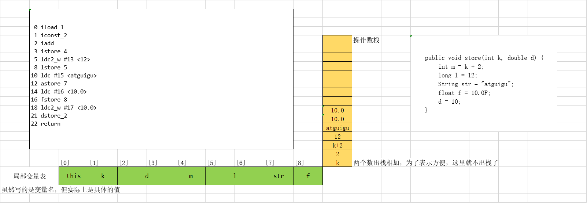
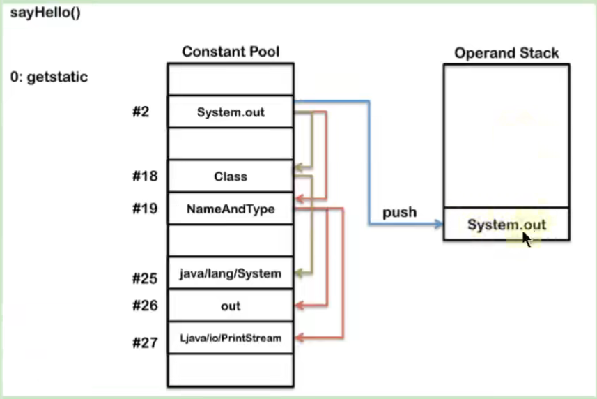

# 概述

Java字节码对于虚拟机，就像汇编语言对于计算机，属于基本执行指令

Java虚拟机的指令由**一个字节长度**的、代表着某种特定操作含义的数字(称为**操作码，Opcode**)以及跟随其后的零至多个代表此操作所需参数(称为**操作数， Operands**)而构成。由于Java虚拟机采用面向操作数栈而不是寄存器的结构，所以大多数的指令都不包含操作数，只有一个操作码。

由于限制了Java虚拟机操作码的长度为一个字节(即0~255)，这意味着指令集的操作码总数不可能超过256条.

官方文档:https://docs.oracle.com/javase/specs/jvms/se8/html/jvms-6.html

熟悉虚拟机的指令对于动态字节码生成、反编译Class文件、 Class文件修补都有着非常重要的价值。因此，阅读字节码作为了解Java虚拟机的基础技能，需要熟练掌握常见指令。

## 执行模型

如果不考虑异常处理的话，那么Java虚拟机的解释器可以使用下面这个伪代码当做最基本的执行模型来理解：

```c
do{
    自动计算PC寄存器的值加1;
    根据PC寄存器的指示位置，从字节码流中取出操作码;
    if(字节码存在操作数) 从字节码流中取出操作数;
    执行操作码所定义的操作;
}while(字节码长度 > 0);
```

## 指令与数据类型关系

在Java虚拟机的指令集中，大多数的指令都包含了其操作所对应的数据类型信息。例如，iload指令用于从局部变量表中加载int型的数据到操作数栈中，而fload指令加载的则是float类型的数据。

对于大部分与数据类型相关的字节码指令，它们的操作码助记符中都有特殊的字符来表明专门为哪种数据类型服务

- i代表对int类型的数据操作，
- l代表long
- s代表 short
- b代表byte
- c代表char
- f代表float
- d代表double

也有一些指令的助记符中**没有明确地指明操作类型的字母**，如 arraylength指令，它没有代表数据类型的特殊字符，但操作数永远只能是一个数组类型的对象。

还有另外一些指令，如无条件跳转指令goto则是与**数据类型无关的**。

大部分的指令都没有支持整数类型byte、char和 short，甚至没有任何指令支持 boolean类型。编译器会在编译期或运行期将**byte和short**类型的数据**带符号扩展(sign- Extend)为相应的int类型**数据，将 **boolean和char**类型数据**零位扩展(Zero- Extend)为相应的int类型数据**。与之类似，在处理 boolean、byte、 short和char类型的数组时，也会转换为使用对应的int类型的字节码指令来处理。因此，大多数对于 boolean、byte、 short和char类型数据的操作。

## 指令分类

由于完全介绍和学习这些指令需要花费大量时间。为了让大家能够更快地熟悉和了解这些基本指令，这里将JVM中的字节码指令集按用途大致分成9类。

- 加载与存储指令
- 算术指令
- 类型转换指令
- 对象的创建与访问指令
- 方法调用与返回指令
- 操作数栈管理指令
- 比较控制指令
- 异常处理指令
- 同步控制指令

(说在前面)在做值相关操作时：

- 一个指令，可以从局部变量表、常量池、堆中对象、方法调用、系统调用中等取得数据，这些数据(可能是值可能是对象的引用)被压入操作数栈。
- 一个指令，也可以从操作数栈中取出一到多个值(pop多次)，完成赋值、加减乘除、方法传参、系统调用等等操作。

# 加载与存储指令

使用频率最高的指令

**作用**：加载和存储指令用于**将数据从栈帧的局部变量表和操作数栈之间来回传递**。

**常用指令**

1、【局部变量压栈指令】将一个局部变量加载到操作数栈：xload、xload_\<n>，其中x为i、l、f、d、a、n为0到3。

2、【常量入栈指令】将一个常量加载到操作数栈：bipush、sipush、ldc、ldc_w、ldc2_w、aconst_null、iconst_m1、iconst\_\<i>、lconst\_\<l>、fconst\_\<f>、dconst\_\<d>

3、【出栈装入局部变量表指令】将一个数值从操作数栈存储到局部变量表：xstore、xstore\<n>，其中x为i、l、f、d、a、n为0到3；xastore，其中x为i、l、f、d、a、b、c、s

4、扩充局部变量表的访问索引的指令：wide

上面所列举的指令助记符中，有一部分是以尖括号结尾的(例如iload\<n>)。这些指令助记符实际上代表了一组指令(例如ioad\<n>代表了 iload0、iload1、 iload2和 iload3这几个指令)。这几组指令都是某个带有一个操作数的通用指令(例如 iload)的特殊形式，**对于这若干组特殊指令来说，它们表面上没有操作数，不需要进行取操作数的动作，但操作数都隐含在指令中。**

比如：

- iload_0：将局部变量表中索引为0位置上的数据压入操作数栈中。

- iload 0：将局部变量表中索引为0位置上的数据压入操作数栈中。

除此之外，它们的语义与原生的通用指令完全一致(例如iload_0的语义与操作数为0时的 iload指令语义完全一致)。在尖括号之间的字母指定了指令隐含操作数的数据类型，\<n>代表非负的整数，\<i>代表是int类型数据，\<l>代表long类型，\<f>代表float类型，\<d>代表 double类型。

操作byte、char、short和boolean类型数据时，经常用int类型的指令来表示。

## 复习：再谈操作数栈与局部变量表

**操作数栈Operand Stacks**

我们知道，Java字节码是Java虚拟机所使用的指令集。因此，它与Java虚拟机基于栈的计算模型是密不可分的。在解释执行过程中，每当为Java方法分配栈桢时，Java虚拟机往往需要开辟一块额外的空间作为**操作数栈，来存放计算的操作数以及返回结果**。

具体来说便是：**执行每一条指令之前，Java虚拟机要求该指令的操作数已被压入操作数栈中。在执行指令时，java虚拟机会将该指令所需的操作数弹出，并且将指令的结果重新压入栈中。**


以加法指令iadd为例。假设在执行该指令前，栈顶的两个元素分别为int值1和int值2，那么iadd指令将弹出这两个int，并将求得的和int值3压入栈中。


由于iadd指令只消耗栈顶的两个元素，因此，对于离栈顶距离为2的元素，即图中的问号，iadd指令并不关心它是否存在，更加不会对其进行修改。

**局部变量表 Local Variables**

Java方法栈桢的另外一个重要组成部分则是局部变量区，**字节码程序可以将计算的结果缓存在局部变量区之中**。实际上，Java虚拟机将局部变量区**当成一个数组**，依次存放this指针(仅非静态方法)，所传入的参数，以及字节码中的局部变量。

和操作数栈一样，long类型以及double类型的值将占据两个单元，其余类型仅占据一个单元。


在栈帧中，与性能调优关系最为密切的部分就是局部变量表。局部变量表中的变量也是重要的垃圾回收根节点，只要被局部变量表中直接或间接引用的对象都不会被回收。

在方法执行时，虚拟机使用局部变量表完成方法的传递。

## 局部变量压栈指令

局部变量压栈指令将给定的局部变量表中的数据压入操作数栈。

这类指令大体可以分为：

- xload_\<n>(x为i、1、f、d、a，n为0到3)
- xload(x为i、1、f、d、a)

说明：在这里，x的取值表示数据类型。指令xload_n表示将第n个局部变量压入操作数栈，比如iload1、fload_0、aload_0等指令。其中aload_n表示将一个对象引用压栈。

指令xload通过指定参数的形式，把局部变量压入操作数栈，当使用这个命令时，表示局部变量的数量可能超过了4个，比如指令iload、fload等。

```java
public void load(int num， Object obj， long count， boolean flag， short[] arr) {
    System.out.println(num);
    System.out.println(obj);
    System.out.println(count);
    System.out.println(flag);
    System.out.println(arr);
}
```


## 常量入栈指令

常量入栈指令的功能是将常数压入操作数根据数据类型和入栈内容的不同，又可以分为 const系列、push系列和ldc指令

**指令 const系列**：用于对特定的常量入栈，入栈的常量隐含在指令本身里。指令有: icons\_\<i>(i从-1到5)、lconst\_\<l>(l从0到1)、 fconst\_\<f>(f从0到2)、 dconst\_\<d>(d从0到1)、 const_null。

比如：

- iconst_m1  将-1压入操作数栈
- iconst_x(x为0到5)  将x压入栈
- 1_const0、 lconst_1 分别将长整数0和1压入栈
- fconst_0、 fconst_1、 fconst_2  分别将浮点数0、1、2压入栈
- dconst_0和 dconst_1分别将 double型0和1压入栈；
- const_null 将null压入操作数栈；

从指令的命名上不难找出规律，指令助记符的第一个字符总是喜欢表示数据类型，i表示整数，l表示长整数，f表示浮点数，d表示双精度浮点，习惯上用a表示对象引用。如果指令隐含操作的参数，会以下划线形式给出。

**指令push系列**：主要包括 bipush和 sipush。它们的区别在于接收数据类型的不同， bipush接收8位整数作为参数，sipush接收16位整数，它们都将参数压入栈

**指令ldc系列**：如果以上指令都不能满足需求，那么可以使用**万能的ldc指令**，它可以接收一个8位的参数，该参数**常量池中**的int、float或者 String的**索引**，将指定的内容压入堆栈

类似的还有**ldc_w**，它接收两个8位参数，能支持的索引范围大于ldc。

如果要压入的元素是long或者 double类型的，则使用**ldc2_w**指令，使用方式都是类似的。

| 类型                            | 常数指令 | 范围                          |
| ------------------------------- | -------- | ----------------------------- |
| int(boolean，byte，char，short) | iconst   | [-1，5]                       |
|                                 | bipush   | [-128，127]                   |
|                                 | sipush   | [-32768，32767]               |
|                                 | ldc      | any int value                 |
| long                            | lconst   | 0，1                          |
|                                 | ldc      | any long value                |
| float                           | fconst   | 0，1，2                       |
|                                 | ldc      | any float value               |
| double                          | dconst   | 0，1                          |
|                                 | ldc      | any double value              |
| reference                       | aconst   | null                          |
|                                 | ldc      | String literal，Class literal |


```java
public void pushConstLdc() {
    int i = -1;
    int a = 5;
    int b = 6;
    int c = 127;
    int d = 128;
    int e = 32767;
    int f = 32768;
}
```

```java
 0 iconst_m1
 1 istore_1
 2 iconst_5
 3 istore_2
 4 bipush 6
 6 istore_3
 7 bipush 127
 9 istore 4
11 sipush 128
14 istore 5
16 sipush 32767
19 istore 6
21 ldc #7 <32768>
23 istore 7
25 return
```


```java
public void constLdc() {
    long a1 = 1;
    long a2 = 2;
    float b1 = 2;
    float b2 = 3;
    double c1 = 1;
    double c2 = 2;
    Date d = null;
}
```

```java
 0 lconst_1
 1 lstore_1
 2 ldc2_w #8 <2>
 5 lstore_3
 6 fconst_2
 7 fstore 5
 9 ldc #10 <3.0>
11 fstore 6
13 dconst_1
14 dstore 7
16 ldc2_w #11 <2.0>
19 dstore 9
21 aconst_null
22 astore 11
24 return
```

## 出栈装入局部变量表指令

出栈装入局部变量表指令用**将操作数栈中栈顶元素弹出后，装入局部变量表的指定位置，用于给局部变量赋值**。

这类指令主要以 store的形式存在，比如 xstore(x为i、l、f、d、a)、 xstore_n(x为i、l、f、d、a，n为0至3)。

- 其中，指令 istore_n将从操作数栈中弹出一个整数，并把它赋值给**局部变量索引n位置**
- 指令 xstore由于没有隐含参数信息，故需要提供一个byte类型的参数类指定目标局部变量表的位置

说明：**一般说来，类似像 store这样的命令需要带一个参数，用来指明将弹出的元素放在局部变量表的第几个位置**。但是，为了尽可能压缩指令大小，使用专门的 istore_1指令表示将弹出的元素放置在局部变量表第1个位置。类似的还有istore_0、 istore_2、 istore_3，它们分别表示从操作数栈顶弹出一个元素，存放在局部变量表第0、2、3个位置。

由于局部变量表前几个位置总是非常常用，因此**这种做法虽然増加了指令数量，但是可以大大压缩生成的字节码的体积**。如果局部变量表很大，需要存储的槽位大于3，那么可以使用主 istore指令，外加一个参数，用来表示需要存放的槽位位置。

例子一：



例子二：槽位复用的情况

```java
public void foo(long l， float f) {
    {
        int i = 0;
    }
    {
        String s = "Hello，World";
    }
}
```

操作数栈最大深度：1

局部变量表最大槽数：5（this、l、f、i和s复用）

```java
0 iconst_0
1 istore 4
3 ldc #19 <Hello，World>
5 astore 4
7 return
```

# 算术指令

## 介绍

算术指令用于对两个操作数栈上的值进行某种特定运算，并把结果**重新压入操作数栈**。

大体上算术指令可以分为两种：对**整型数据**进行运算的指令与对**浮点类型数据**进行运算的指令。

**byte、short、char、boolean类型说明**

在每一大类中，都有针对Java虚拟机具体数据类型的专用算术指令。但没有直接支持byte、 short、char和 boolean类型的算术指令，对于这些数据的运算，都使用int类型的指令来处理。此外，在处理 boolean、byte、 short和char类型的数组时，也会转换为使用对应的int类型的字节码指令来处理。

| 实际类型      | 运算类型      | 分类 |
| ------------- | ------------- | ---- |
| boolean       | int           | 一   |
| byte          | int           | 一   |
| char          | int           | 一   |
| short         | int           | 一   |
| int           | int           | 一   |
| float         | float         | 一   |
| reference     | reference     | 一   |
| returnAddress | returnAddress | 一   |
| long          | long          | 二   |
| double        | double        | 二   |

**运算时溢出**

数据运算可能会导致溢出，例如两个很大的正整数相加，结果可能是一个负数。其实]ava虚拟机规范并无明确规定过整型数据溢出的具体结果，仅规定了在处理整型数据时，只有除法指令以及求余指令中当出现除数为0时会导致虚拟机抛岀异常ArithmeticException。

**运算模式**

- 向最接近数舍入模式：JVM 要求在进行浮点数计算时，所有的运算结果都必须舍入到适当的精度，非精确结果必须舍入为可被表示的最接近的精确值，如果有两种可表示的形式与该值一样接近，将优先选择最低有效位为零的;·

- 向零舍入模式：将浮点数转换为整数时，采用该模式，该模式将在目标数值类型中选择一个最接近但是不大于原值的数字作为最精确的舍入结果

**NaN值使用**

当一个操作产生溢出时，将会使用有符号的无穷大表示，如果某个操作结果没有明确的数学定义的话，将会使用NaN值来表示。而且所有使用NaN值作为操作数的算术操作，结果都会返回NaN;

```java
@Test
public void method1() {
    int i = 10;
    double j = i / 0.0;
    System.out.println(j);//Infinity

    double d1 = 0.0;
    double d2 = d1 / 0.0;
    System.out.println(d2);//NaN: not a number
}
```


## 所有算术指令

加法指令：iadd、ladd、fadd、dadd

减法指令：isub、lsub、fsub、dsub

乘法指令：imul、lmul、fmul、dmul

除法指令：idiv、lidv、fdiv、ddiv

求余指令：irem、lrem、frem、drem    //remainder余数

取反指令：ineg、lneg、fneg、dneg   //negation取反

自增指令：iinc

位运算指令，又可分为：

- 位移指令：ishl、ishr、iushr、lshl、lshr、lushr
- 按位或指令：ior、lor
- 按位与指令：iand、land
- 按位异或指令：ixor、lxor

比较指令dcmpg、dcmpl、fcmpg、fcmpl、lcmp

## 例子

例子：

```java
public void method2() {
    float i = 10;
    float j = -i;
    i = -j;
}
```

```JAVA
0 ldc #4 <10.0>
2 fstore_1
3 fload_1
4 fneg
5 fstore_2
6 fload_2
7 fneg
8 fstore_1
9 return
```

例子2：

```java
public void method3() {
    int i = 100;
    i = i + 10;
}
```

```java
0 bipush 100
2 istore_1
3 iload_1
4 bipush 10
6 iadd
7 istore_1
8 return

```


```java
public void method3() {
    int i = 100;
    i += 10;
}
```

```java
0 bipush 100
2 istore_1
3 iinc 1 by 10
6 return
```

可以看出，自增操作是直接操作局部变量表

例子3

```java
public int method4() {
    int a = 80;
    int b = 7;
    int c = 10;
    return (a + b) * c;
}
```

```java
 0 bipush 80
 2 istore_1
 3 bipush 7
 5 istore_2
 6 bipush 10
 8 istore_3
 9 iload_1
10 iload_2
11 iadd
12 iload_3
13 imul
14 ireturn

```

例子4

```java
public int method5(int i， int j) {
    return ((i + j - 1) & ~(j - 1));
}
```

```java
 0 iload_1
 1 iload_2
 2 iadd
 3 iconst_1
 4 isub
 5 iload_2
 6 iconst_1
 7 isub
 8 iconst_m1
 9 ixor
10 iand
11 ireturn

```

## ++运算符

先看看i++

```java
public void method6() {
    int i = 10;
    i++;
}
```

```java
0 bipush 10
2 istore_1
3 iinc 1 by 1
6 return
```


再看看++i

```java
public void method6() {
    int i = 10;
    ++i;
}
```

```java
0 bipush 10
2 istore_1
3 iinc 1 by 1
6 return
```

也就是说，不涉及其他运算，单纯的i++和++i，字节码指令是一模一样的


```java
    public void method7() {
        int i = 10;
        int a = i++;

        int j = 20;
        int b = ++j;
    }
```

```java
 0 bipush 10
 2 istore_1
 3 iload_1
 4 iinc 1 by 1
 7 istore_2
 8 bipush 20
10 istore_3
11 iinc 3 by 1
14 iload_3
15 istore 4
17 return

```

有等号赋值时，int a =  i++是先赋值再加加，int b = ++j 是先加加再赋值


```java
public void method8() {
    int i = 10;
    i = i++;
    System.out.println(i);
}
```

```java
 0 bipush 10
 2 istore_1
 3 iload_1
 4 iinc 1 by 1 //局部变量表的第1个格子里自增1
 7 istore_1 //操作数栈，出栈(10)，存入局部变量表的第1个格子里
 8 getstatic #2 <java/lang/System.out : Ljava/io/PrintStream;>
11 iload_1
12 invokevirtual #5 <java/io/PrintStream.println : (I)V>
15 return

```

局部变量表，下标为1的格子，自增1，此时操作数栈里的还是10，出栈入局部变量表，之前的11就被覆盖成了10

## 比较指令的说明

- 比较指令的作用是比较栈顶两个元素的大小，并将比较结果入栈。

- 比较指令有: dcmpg，dcmpl、 fcmpg、fcmpl、lcmp，与前面讲解的指令类似，首字符d表示double类型，f表示float，l表示long。
- 对于double和float类型的数字，由于NaN的存在，各有两个版本的比较指令。以float为例，有 fcmpg和fcmpl两个指令，它们的区别在于在数字比较时，若遇到NaN值，处理结果不同。
- 指令dcmpl和 dampg也是类似的，根据其命名可以推测其含义，在此不再赘述。
- 指令lcmp针对long型整数，由于long型整数没有NaN值，故无需准备两套指令

举例

指令**fcmpg和fcmpl**都从栈中弹岀两个操作数，并将它们做比较，设栈顶的元素为v2，栈顶顺位第2位的元素为v1，若V1=V2，则压入0;若v1>v2则压入1;若v1<v2则压入-1。

两个指令的不同之处在于，如果遇到NaN值， **fcmp会压入1，而fcmpl会压入-1**。

# 类型转换指令

1、类型转换指令说明

①类型转换指可以将两种不同的数值类型进行相互转换

②这些转换操作一般用于实现用户代码中的**显式类型转换操作**，或者用来处理**字节码指令集中数据类型相关指令**无法与数据类型一一对应的问题

## 宽化类型转换

宽化类型转换(Widening Numric Conversions)

**转换规则：**

Java虚拟机直接支持以下数值的宽化类型转换( Widening Numric Conversion，小范围类型向大范围类型的安全转换)。也就是说，**并不需要指令执行**，包括：

- 从int类型到long、float或者double类型。对应的指令为：i2l、i2f、i2d
- 从long类型到float、double类型。对应的指令为：l2f、l2d
- 从float类型到 double类型。对应的指令为：f2d

简化为：int-->long-->float --> double

```java
public void upCast1() {
    int i = 10;
    long l = i;
    float f = i;
    double d = i;

    float f1 = l;
    double d1 = l;
    double d2 = f1;
}
```

```java
 0 bipush 10
 2 istore_1
 3 iload_1
 4 i2l
 5 lstore_2
 6 iload_1
 7 i2f
 8 fstore 4
10 iload_1
11 i2d
12 dstore 5
14 lload_2
15 l2f
16 fstore 7
18 lload_2
19 l2d
20 dstore 8
22 fload 7
24 f2d
25 dstore 10
27 return

```


**精度损失问题**

宽化类型转换是不会因为超过目标类型最大值而丢失信息的，例如，从int转换到1ong，或者从int转换到double，都不会丢失任何信息，转换前后的值是精确相等的。

从int、long类型数值转换到float，或者long类型数值转换到 double时，将可能发生精度丢失——**可能丢失几个最低有效位上的值**，转换后的浮点数值是根据IEEE754最接近舍入模式所得到的正确整数值。

尽管宽化类型转换实际上是可能发生精度丢失的，但是这种转换永远不会导致Java虚拟机抛出运行时异常。

```java
//举例：精度损失问题
@Test
void upCast2() {
    int i = 123123123;
    float f = i;
    System.out.println(f);//123123120

    //long l = 123123123123L;
    long l = 123123123123123L;
    double d = l;
    System.out.println(d);//123123123123120
}
```

**补充说明**

**从byte，char和 short类型到int类型的宽化类型转换实际上是不存在的**。对于byte类型转为int，虚拟机并没质性的转化处理，只是简单地通过操作数栈交换了两个数据。而将byte转为long时，使用的是i2l，可以看到在内部byte在这里已经等同于int类型处理，类似的还有 short类型，这种处理方式有两个特点：

一方面可以减少实际的数据类型，如果为 short和byte都准备一套指令，那么指令的数量就会大增，而**虚拟机目前的设计上，只愿意使用一个字节表示指令，因此指令总数不能超过256个，为了节省指令资源，将 short和byte当做int处理也在情理之中**。另一方面，由于局部变量表中的槽位固定为32位，无论是byte或者 short存入局部变量表，都会占用32位空间。从这个角度说，也没有必要特意区分这几种数据类型。

```java
//byte short等，看作int
void upCast3(byte b) {
    int i = b;
    long l = b;
    double d = b;
}
```

```java
0 iload_1
1 istore_2
2 iload_1
3 i2l
4 lstore_3
5 iload_1
6 i2d
7 dstore 5
9 return
```


```java
void upCast4(short b) {
    int i = b;
    long l = b;
    double d = b;
}
```

```java
0 iload_1
1 istore_2
2 iload_1
3 i2l
4 lstore_3
5 iload_1
6 i2d
7 dstore 5
9 return

```

## 窄化类型转换

窄化类型转换 (Narrowing Numric Conversions)

### 转换规则

Java虚拟机也直接支持以下窄化类型转换：

- 从int类型至byte、 short或者char类型。对应的指令有:i2b、i2c、i2s
- 从long类型到int类型。对应的指令有：l2i
- 从float类型到int或者long类型。对应的指令有：f2i、f21
- 从double类型到int、long或者float类型。对应的指令有:d2i、d2l、d2f2

```java
//窄化类型转换
void downCast1() {
    int i = 10;
    byte b = (byte) i;
    short s = (short) i;
    char c = (char) i;

    long l = 10L;
    int i1 = (int) l;
    byte b1 = (byte) l;//字节码分两步骤：先long转int，再int转byte
}
```

```java
 0 bipush 10
 2 istore_1
 3 iload_1
 4 i2b
 5 istore_2
 6 iload_1
 7 i2s
 8 istore_3
 9 iload_1
10 i2c
11 istore 4
13 ldc2_w #8 <10>
16 lstore 5
18 lload 5
20 l2i
21 istore 7
23 lload 5
25 l2i // byte b1 = (byte) l;
26 i2b // byte b1 = (byte) l;
27 istore 8
29 return

```

例子2：

```java
void downCast2() {
    float f = 10;
    long l = (long) f;
    int i = (int) f;
    byte b = (byte) f;//也是分两步

    double d = 10;
    byte b1 = (byte) d;//也是分两步
}
```

```java
 0 bipush 10
 2 istore_1
 3 iload_1
 4 i2b
 5 istore_2
 6 iload_1
 7 i2s
 8 istore_3
 9 iload_1
10 i2c
11 istore 4
13 ldc2_w #8 <10>
16 lstore 5
18 lload 5
20 l2i
21 istore 7
23 lload 5
25 l2i
26 i2b
27 istore 8
29 return
```

例子3

```java
void downCast3() {
    short s = 10;
    byte b = (byte) s;//i2b
}
```

### 精度损失问题

窄化类型转换可能会导致转换结果具备不同的正负号、不同的数量级，因此，转换过程很可能会导致数值丢失精度。

尽管数据类型窄化转换可能会发生上限溢岀、下限溢岀和精度丢失等情况，但是Java虚拟杋规范中明确规定数值类型的窄化转换指令永远不可能导致虚拟机抛出运行时异常


```java
//窄化类型转换的精度损失
@Test
void downCast4() {
    int i = 128;
    byte b = (byte) i;
    System.out.println(b);//-128
}
```


### 补充说明

当将一个浮点值窄化转换为整数类型T(T限于int或long类型之一)的时候，将遵循以下转换规则：

- 如果浮点值是NaN，那转换结果就是int或long类型的0。
- 如果浮点值不是无穷大的话，浮点值使用IEEE754的向零舍入模式取整，获得整数值v，如果v在目标类型T(int或long)的表示范围之内，那转换结果就是v。否则，将根据v的符号，转换为T所能表示的最大或者最小正数

当将一个 double类型窄化转换为float类型时，将遵循以下转换规则，通过向最接近数舍入模式舍入一个可以使用float类型表示的数字。最后结果根据下面这3条规则判断:

- 如果转换结果的绝对值太小而无法使用float来表示，将返回float类型的正负零。
- 如果转换结果的绝对值太大而无法使用float来表示，将返回float类型的正负无穷大
- 对于double类型的NaN值将按规定转换为float类型的NaN值。

```java
//NaN
@Test
void downCast5() {
    double d1 = Double.NaN;
    int i = (int) d1;
    System.out.println(i);//0

    double d2 = Double.NaN;
    long l = (long) d2;
    int j = (int) d2;
    System.out.println(l);//0
    System.out.println(j);//0
}

//无穷大
@Test
void downCast6() {
    double d1 = Double.POSITIVE_INFINITY;
    long l = (long) d1;
    int j = (int) d1;
    float k = (float) d1;
    System.out.println(l);//9223372036854775807 long max
    System.out.println(j);//2147483647 int max
    System.out.println(k);//Infinity
}
```

# 对象的创建与访问指令

Java是面向对象的程序设计语言，虚拟机平台从字节码层面就对面向对象做了深层次的支持。有一系列指令专门用于对象操作，可进一步细分为创建指令、字段访问指令、数组操作指令、类型检查指令。

## 创建指令

虽然类实例和数组都是对象，但Java虚拟机对类实例和数组的创建与操作使用了不同的字节码指令

**1.创建类实例的指令**

创建类实例的指令：new

- 它接收一个操作数，为指向常量池的索引，表示要创建的类型，执行完成后，将对象的引用压入栈。

**2.创建数组的指令**

创建数组的指令: newarray、 anewarray、multianewarray。

- newarray:创建基本类型数组·
- anewarray:创建引用类型数组
- multianewarray创建多维数组

上述创建指令可以用于创建对象或者数组，由于对象和数组在java中的广泛使用，这些指令的使用频率也非常高。

指令+数组类型：

| Array Type  | *atype* |
| ----------- | ------- |
| `T_BOOLEAN` | 4       |
| `T_CHAR`    | 5       |
| `T_FLOAT`   | 6       |
| `T_DOUBLE`  | 7       |
| `T_BYTE`    | 8       |
| `T_SHORT`   | 9       |
| `T_INT`     | 10      |
| `T_LONG`    | 11      |


```java
public void newInstance() {
    Object object = new Object();
    File file = new File("a.txt");
}
```

```java
 0 new #2 <java/lang/Object>
 3 dup //对象的引用再复制一份，放到虚拟机栈里，为了下面的调用需要消耗一个
 4 invokespecial #1 <java/lang/Object.<init> : ()V>
 7 astore_1
 8 new #3 <java/io/File>
11 dup
12 ldc #4 <a.txt>
14 invokespecial #5 <java/io/File.<init> : (Ljava/lang/String;)V>
17 astore_2
18 return
```


```java
public void newArray() {
    int[] ints = new int[10];
    Object[] objects = new Object[10];
    int[][] mints = new int[10][10];
    String[][] strArray = new String[10][];
}
```

```java
 0 bipush 10
 2 newarray 10 (int)
 4 astore_1
 5 bipush 10
 7 anewarray #2 <java/lang/Object>
10 astore_2
11 bipush 10
13 bipush 10
15 multianewarray #6 <[[I> dim 2
19 astore_3
20 bipush 10
22 anewarray #7 <[Ljava/lang/String;> //new String[10][]，第二维还没开辟
25 astore 4
27 return

```

## 字段访问指令

对象创建后，就可以通过对象访问指令获取对象实例或数组实例中的字段或者数组元素。·

- 访问类字段( static字段，或者称为类变量)的指令: getstatic、 putstatic
- 访问类实例字段(非 static字段，或者称为实例变量)的指令: getfield、 putfield

举例：

以 getstatic指令为例，它含有一个操作数，为指向常量池的Fieldref索引，它的作用就是获取 Fieldref指定的对象或者值，并将其压入操作数栈。

```java
public void sayHello() {
    System.out.println("hello");
}
```

```java
0 getstatic #8 <java/lang/System.out : Ljava/io/PrintStream;>
3 ldc #9 <hello>
5 invokevirtual #10 <java/io/PrintStream.println : (Ljava/lang/String;)V>
8 return
```




例子2：

```java
class Order {
    public int id;
    public static String name;
}
public void setOrderId() {
    Order order = new Order();
    order.id = 1001;
    System.out.println(order.id);

    Order.name = "ORDER";
    System.out.println(Order.name);
}
```

```java
 0 new #11 <com/potato/ch02/Order>
 3 dup
 4 invokespecial #12 <com/potato/ch02/Order.<init> : ()V>
 7 astore_1
 8 aload_1
 9 sipush 1001
12 putfield #13 <com/potato/ch02/Order.id : I>
15 getstatic #8 <java/lang/System.out : Ljava/io/PrintStream;>
18 aload_1
19 getfield #13 <com/potato/ch02/Order.id : I>
22 invokevirtual #14 <java/io/PrintStream.println : (I)V>
25 ldc #15 <ORDER>
27 putstatic #16 <com/potato/ch02/Order.name : Ljava/lang/String;>
30 getstatic #8 <java/lang/System.out : Ljava/io/PrintStream;>
33 getstatic #16 <com/potato/ch02/Order.name : Ljava/lang/String;>
36 invokevirtual #10 <java/io/PrintStream.println : (Ljava/lang/String;)V>
39 return
```

## 数组操作指令

数组操作指令主要有: pastore和xaload指令。数组元素在堆里面。

具体为:

- 把一个数组元素加载到操作数栈的指令: balad、 caload、 salad、ia]oad、1 aload、 faload、salad、aa1oad
- 将一个操作数栈的值存储到数组元素中的指令: pastore、 castore、 sastre、 iastore、1 astore、fastore、iastore、 aastore

即:

| 数组类型      | 加载指令 | 存储指令 |
| ------------- | -------- | -------- |
| byte(boolean) | baload   | bastore  |
| char          | caload   | castore  |
| short         | saload   | sastore  |
| int           | iaload   | iastore  |
| long          | laload   | lastore  |
| float         | faload   | fastore  |
| double        | daload   | dastore  |
| reference     | aaload   | aastore  |

取数组长度的指令: arraylength

- 该指令弹出栈顶的数组元素，获取数组的长度，将长度压入栈。

说明

- 指令xaload表示将数组的元素压栈，比如saload、caload分别表示压入 short数组和char数组。指令xaload在执行时，要求操作数中栈顶元素为数组索引i，栈顶顺位第2个元素为数组引用a，该指令会弹岀栈顶这两个元素，并将a[i]重新压入堆栈。

- pastore则专门针对数组操作，以 iastore为例，它用于给一个int数组的给定索引赋值。在 iastore执行前操作数栈顶需要以此准备3个元素：**值、索引、数组引用**， **iastore会弹岀这3个值**，并将值赋给数组中指定的位置。

```java
public void setArray() {
    int[] ints = new int[10];
    ints[3] = 20;
    System.out.println(ints[1]);
}
```

```java
 0 bipush 10
 2 newarray 10 (int)
 4 astore_1
 5 aload_1
 6 iconst_3
 7 bipush 20
 9 iastore
10 getstatic #8 <java/lang/System.out : Ljava/io/PrintStream;>
13 aload_1
14 iconst_1
15 iaload
16 invokevirtual #14 <java/io/PrintStream.println : (I)V>
19 return

```


```java
public void arrayLength() {
    double[] arr = new double[10];
    System.out.println(arr.length);
}
```

```java
 0 bipush 10
 2 newarray 7 (double)
 4 astore_1
 5 getstatic #8 <java/lang/System.out : Ljava/io/PrintStream;>
 8 aload_1
 9 arraylength
10 invokevirtual #14 <java/io/PrintStream.println : (I)V>
13 return
```

## 类型检查指令

检查类实例或数组类型的指令: instanceof、 checkcast

- 指令 checkcastl用于检查类型强制转换是否可以进行。如果可以进行，那么 checkcast指令不会改变操作数栈否则它会抛出ClassCastexcEption异常
- 指令 instanceof用来判断给定对象是否是基一个类的实例，它会将判断结里压入作数

```java
public String checkCast(Object obj) {
    if (obj instanceof String) {
        return (String) obj;
    } else {
        return null;
    }
}
```

```java
 0 aload_1
 1 instanceof #17 <java/lang/String>
 4 ifeq 12 (+8)
 7 aload_1
 8 checkcast #17 <java/lang/String>
11 areturn
12 aconst_null
13 areturn
```

# 方法调用与返回指令


1


1

