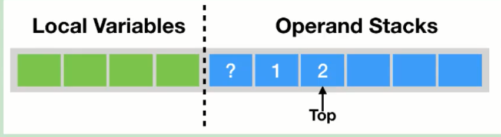
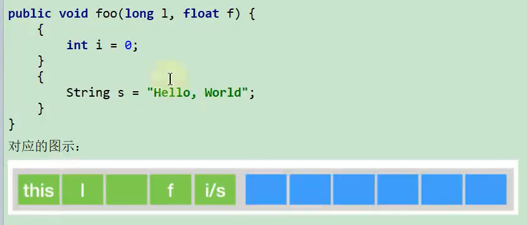
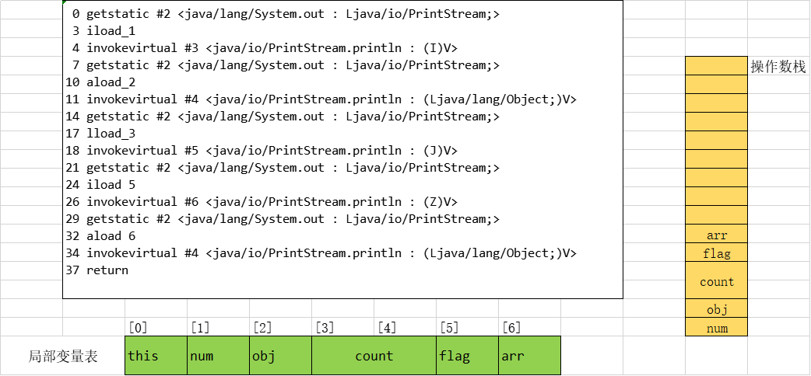

# 概述

Java字节码对于虚拟机，就像汇编语言对于计算机，属于基本执行指令

Java虚拟机的指令由**一个字节长度**的、代表着某种特定操作含义的数字(称为**操作码，Opcode**)以及跟随其后的零至多个代表此操作所需参数(称为**操作数， Operands**)而构成。由于Java虚拟机采用面向操作数栈而不是寄存器的结构，所以大多数的指令都不包含操作数，只有一个操作码。

由于限制了Java虚拟机操作码的长度为一个字节(即0~255)，这意味着指令集的操作码总数不可能超过256条.

官方文档:https://docs.oracle.com/javase/specs/jvms/se8/html/jvms-6.html

熟悉虚拟机的指令对于动态字节码生成、反编译Class文件、 Class文件修补都有着非常重要的价值。因此，阅读字节码作为了解Java虚拟机的基础技能，需要熟练掌握常见指令。

## 执行模型

如果不考虑异常处理的话，那么Java虚拟机的解释器可以使用下面这个伪代码当做最基本的执行模型来理解：

```c
do{
    自动计算PC寄存器的值加1;
    根据PC寄存器的指示位置，从字节码流中取出操作码;
    if(字节码存在操作数) 从字节码流中取出操作数;
    执行操作码所定义的操作;
}while(字节码长度 > 0);
```

## 指令与数据类型关系

在Java虚拟机的指令集中，大多数的指令都包含了其操作所对应的数据类型信息。例如，iload指令用于从局部变量表中加载int型的数据到操作数栈中，而fload指令加载的则是float类型的数据。

对于大部分与数据类型相关的字节码指令，它们的操作码助记符中都有特殊的字符来表明专门为哪种数据类型服务

- i代表对int类型的数据操作，
- l代表long
- s代表 short
- b代表byte
- c代表char
- f代表float
- d代表double

也有一些指令的助记符中**没有明确地指明操作类型的字母**，如 arraylength指令，它没有代表数据类型的特殊字符，但操作数永远只能是一个数组类型的对象。

还有另外一些指令，如无条件跳转指令goto则是与**数据类型无关的**。

大部分的指令都没有支持整数类型byte、char和 short，甚至没有任何指令支持 boolean类型。编译器会在编译期或运行期将**byte和short**类型的数据**带符号扩展(sign- Extend)为相应的int类型**数据，将 **boolean和char**类型数据**零位扩展(Zero- Extend)为相应的int类型数据**。与之类似，在处理 boolean、byte、 short和char类型的数组时，也会转换为使用对应的int类型的字节码指令来处理。因此，大多数对于 boolean、byte、 short和char类型数据的操作。

## 指令分类

由于完全介绍和学习这些指令需要花费大量时间。为了让大家能够更快地熟悉和了解这些基本指令，这里将JVM中的字节码指令集按用途大致分成9类。

- 加载与存储指令
- 算术指令
- 类型转换指令
- 对象的创建与访问指令
- 方法调用与返回指令
- 操作数栈管理指令
- 比较控制指令
- 异常处理指令
- 同步控制指令

(说在前面)在做值相关操作时：

- 一个指令，可以从局部变量表、常量池、堆中对象、方法调用、系统调用中等取得数据，这些数据(可能是值可能是对象的引用)被压入操作数栈。
- 一个指令，也可以从操作数栈中取出一到多个值(pop多次)，完成赋值、加减乘除、方法传参、系统调用等等操作。

# 加载与存储指令

使用频率最高的指令

**作用**：加载和存储指令用于**将数据从栈帧的局部变量表和操作数栈之间来回传递**。

**常用指令**

1、【局部变量压栈指令】将一个局部变量加载到操作数栈：xload、xload_\<n>，其中x为i、l、f、d、a、n为0到3。

2、【常量入栈指令】将一个常量加载到操作数栈：bipush、sipush、ldc、ldc_w、ldc2_w、aconst_null、iconst_m1、iconst\_\<i>、lconst\_\<l>、fconst\_\<f>、dconst\_\<d>

3、【出栈装入局部变量表指令】将一个数值从操作数栈存储到局部变量表：xstore、xstore\<n>，其中x为i、l、f、d、a、n为0到3；xastore，其中x为i、l、f、d、a、b、c、s

4、扩充局部变量表的访问索引的指令：wide

上面所列举的指令助记符中，有一部分是以尖括号结尾的(例如iload\<n>)。这些指令助记符实际上代表了一组指令(例如ioad\<n>代表了 iload0、iload1、 iload2和 iload3这几个指令)。这几组指令都是某个带有一个操作数的通用指令(例如 iload)的特殊形式，**对于这若干组特殊指令来说，它们表面上没有操作数，不需要进行取操作数的动作，但操作数都隐含在指令中。**

比如：

- iload_0：将局部变量表中索引为0位置上的数据压入操作数栈中。

- iload 0：将局部变量表中索引为0位置上的数据压入操作数栈中。

除此之外，它们的语义与原生的通用指令完全一致(例如iload_0的语义与操作数为0时的 iload指令语义完全一致)。在尖括号之间的字母指定了指令隐含操作数的数据类型，\<n>代表非负的整数，\<i>代表是int类型数据，\<l>代表long类型，\<f>代表float类型，\<d>代表 double类型。

操作byte、char、short和boolean类型数据时，经常用int类型的指令来表示。

## 复习：再谈操作数栈与局部变量表

**操作数栈Operand Stacks**

我们知道，Java字节码是Java虚拟机所使用的指令集。因此，它与Java虚拟机基于栈的计算模型是密不可分的。在解释执行过程中，每当为Java方法分配栈桢时，Java虚拟机往往需要开辟一块额外的空间作为**操作数栈，来存放计算的操作数以及返回结果**。

具体来说便是：**执行每一条指令之前，Java虚拟机要求该指令的操作数已被压入操作数栈中。在执行指令时，java虚拟机会将该指令所需的操作数弹出，并且将指令的结果重新压入栈中。**



以加法指令iadd为例。假设在执行该指令前，栈顶的两个元素分别为int值1和int值2，那么iadd指令将弹出这两个int，并将求得的和int值3压入栈中。


由于iadd指令只消耗栈顶的两个元素，因此，对于离栈顶距离为2的元素，即图中的问号，iadd指令并不关心它是否存在，更加不会对其进行修改。

**局部变量表 Local Variables**

Java方法栈桢的另外一个重要组成部分则是局部变量区，**字节码程序可以将计算的结果缓存在局部变量区之中**。实际上，Java虚拟机将局部变量区**当成一个数组**，依次存放this指针(仅非静态方法)，所传入的参数，以及字节码中的局部变量。

和操作数栈一样，long类型以及double类型的值将占据两个单元，其余类型仅占据一个单元。



在栈帧中，与性能调优关系最为密切的部分就是局部变量表。局部变量表中的变量也是重要的垃圾回收根节点，只要被局部变量表中直接或间接引用的对象都不会被回收。

在方法执行时，虚拟机使用局部变量表完成方法的传递。

## 局部变量压栈指令

局部变量压栈指令将给定的局部变量表中的数据压入操作数栈。

这类指令大体可以分为：

- xload_\<n>(x为i、1、f、d、a，n为0到3)
- xload(x为i、1、f、d、a)

说明：在这里，x的取值表示数据类型。指令xload_n表示将第n个局部变量压入操作数栈，比如iload1、fload_0、aload_0等指令。其中aload_n表示将一个对象引用压栈。

指令xload通过指定参数的形式，把局部变量压入操作数栈，当使用这个命令时，表示局部变量的数量可能超过了4个，比如指令iload、fload等。

```java
public void load(int num， Object obj， long count， boolean flag， short[] arr) {
    System.out.println(num);
    System.out.println(obj);
    System.out.println(count);
    System.out.println(flag);
    System.out.println(arr);
}
```



## 常量入栈指令

常量入栈指令的功能是将常数压入操作数根据数据类型和入栈内容的不同，又可以分为 const系列、push系列和ldc指令

**指令 const系列**：用于对特定的常量入栈，入栈的常量隐含在指令本身里。指令有: icons\_\<i>(i从-1到5)、lconst\_\<l>(l从0到1)、 fconst\_\<f>(f从0到2)、 dconst\_\<d>(d从0到1)、 const_null。

比如：

- iconst_m1  将-1压入操作数栈
- iconst_x(x为0到5)  将x压入栈
- 1_const0、 lconst_1 分别将长整数0和1压入栈
- fconst_0、 fconst_1、 fconst_2  分别将浮点数0、1、2压入栈
- dconst_0和 dconst_1分别将 double型0和1压入栈；
- const_null 将null压入操作数栈；

从指令的命名上不难找出规律，指令助记符的第一个字符总是喜欢表示数据类型，i表示整数，l表示长整数，f表示浮点数，d表示双精度浮点，习惯上用a表示对象引用。如果指令隐含操作的参数，会以下划线形式给出。

**指令push系列**：主要包括 bipush和 sipush。它们的区别在于接收数据类型的不同， bipush接收8位整数作为参数，sipush接收16位整数，它们都将参数压入栈

**指令ldc系列**：如果以上指令都不能满足需求，那么可以使用**万能的ldc指令**，它可以接收一个8位的参数，该参数**常量池中**的int、float或者 String的**索引**，将指定的内容压入堆栈

类似的还有**ldc_w**，它接收两个8位参数，能支持的索引范围大于ldc。

如果要压入的元素是long或者 double类型的，则使用**ldc2_w**指令，使用方式都是类似的。

| 类型                            | 常数指令 | 范围                          |
| ------------------------------- | -------- | ----------------------------- |
| int(boolean，byte，char，short) | iconst   | [-1，5]                       |
|                                 | bipush   | [-128，127]                   |
|                                 | sipush   | [-32768，32767]               |
|                                 | ldc      | any int value                 |
| long                            | lconst   | 0，1                          |
|                                 | ldc      | any long value                |
| float                           | fconst   | 0，1，2                       |
|                                 | ldc      | any float value               |
| double                          | dconst   | 0，1                          |
|                                 | ldc      | any double value              |
| reference                       | aconst   | null                          |
|                                 | ldc      | String literal，Class literal |


```java
public void pushConstLdc() {
    int i = -1;
    int a = 5;
    int b = 6;
    int c = 127;
    int d = 128;
    int e = 32767;
    int f = 32768;
}
```

```java
 0 iconst_m1
 1 istore_1
 2 iconst_5
 3 istore_2
 4 bipush 6
 6 istore_3
 7 bipush 127
 9 istore 4
11 sipush 128
14 istore 5
16 sipush 32767
19 istore 6
21 ldc #7 <32768>
23 istore 7
25 return
```


```java
public void constLdc() {
    long a1 = 1;
    long a2 = 2;
    float b1 = 2;
    float b2 = 3;
    double c1 = 1;
    double c2 = 2;
    Date d = null;
}
```

```java
 0 lconst_1
 1 lstore_1
 2 ldc2_w #8 <2>
 5 lstore_3
 6 fconst_2
 7 fstore 5
 9 ldc #10 <3.0>
11 fstore 6
13 dconst_1
14 dstore 7
16 ldc2_w #11 <2.0>
19 dstore 9
21 aconst_null
22 astore 11
24 return
```

## 出栈入栈局部变量表指令


1