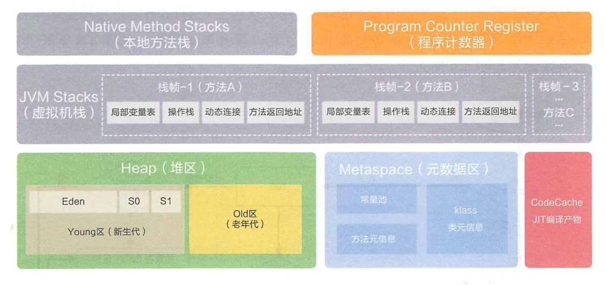
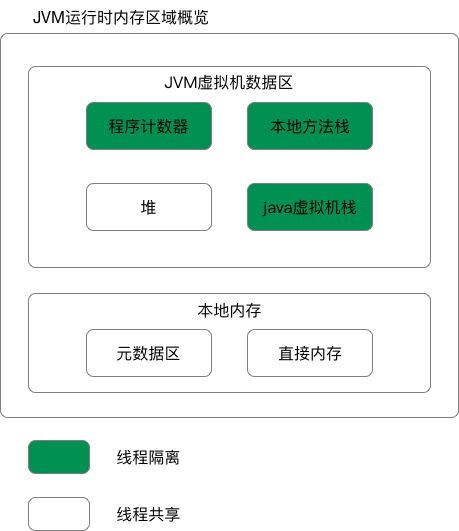
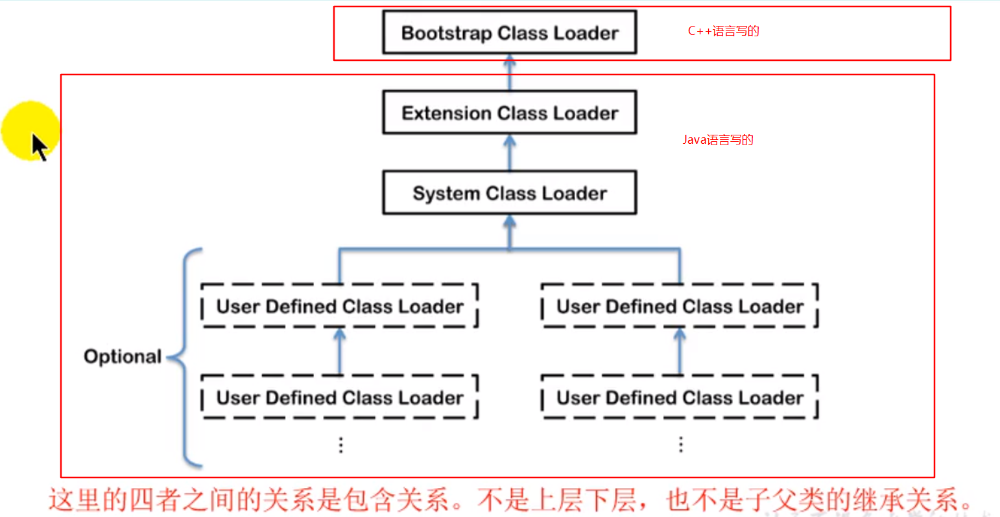

# 0、总体结构图

## 0.1JDK1.8之前


## 0.2JDK1.8开始

元数据区(元空间)取代了永久代。元空间的本质和永久代类似，都是对JVM规范中方法区的实现。不过元空间与永久代之间最大的区别在于：元数据空间并不在虚拟机中，而是使用本地内存.(注意，虚拟机数据区域也是放在内存里的)







### 0.2.1程序计数器

Program Counter Register

它是一块较小的内存空间，可以看做是**指向当前线程所执行的字节码的行号指示器**。在虚拟机的概念模型里（仅是概念模型，各种虚拟机可能会通过一些更高效的方式去实现），字节码解释器工作时就是通过改变这个计数器的值来选取下一条需要执行的字节码指令，分支、循环、跳转、异常处理、线程回复等基础功能都需要依赖计数器来完成（）。

> 为什么程序计数器为线程私有呢？

 由于java虚拟机的多线程是通过线程轮流切换并分配处理器执行时间的方式来实现的，在任何一个确定的时刻，一个处理器（对于多核处理器来说是一个内核）都只会执行一条线程中的指令，因此，为了线程切换后能恢复到正常的执行位置，每条线程都需要一个独立的程序计数器，各线程之间计数器互不影响，独立存储，为线程私有的内存。

> 程序计数器值的问题

 如果线程正在执行的是一个java方法，这个计数器记录的是正在执行的虚拟机字节码指令的地址；如果正在执行的是Native方法，这个计数器的值则为空（Undefined）。此内存区域是唯一一个在java虚拟机规范中没有规定任何OutOfMemoryError情况的区域

### 0.2.2虚拟机栈

java虚拟机栈与程序计数器一样，也是线程私有的，他的生命周期和线程保持一致。他是存储当前线程运行方法时所需要的数据、指令、返回地址。在每个方法执行时，虚拟机栈都会创建一个栈帧（Stack Frame），用于存储：**局部变量表**、**操作数栈**、**动态链接**、**方法出口**等信息。如下图：


**局部变量表**

​		存放了编译器可知的各种**基本数据类型**（boolean、byte、char、short、int、float、long、double）、**对象引用(**reference类型，它不等同与对象本身，可能是一个指向对象其实地址的引用指针，也可能是指向一个代表对象的句柄或其他与此对象相关的位置) 和returnAddress类型（指向了一条字节码指令的地址）

 局部变量表的存储空间是32位，刚好可以放一个int类型，所以长度为64为的long和double类型的数据会占用2个局部变量空间（Slot），局部变量表的大小在编译期就已经确定了

在java虚拟机规范中，对java虚拟机栈规定了两种异常状况：如果线程请求的栈深度大于虚拟机所允许的深度，将会抛出StackOverflowError异常；如果虚拟机栈可以动态扩展（当前大部分虚拟机都可以动态扩展，只不过ava虚拟机规范中也允许固定长度的虚拟机栈），**扩展时无法申请到足够的内存**，就会抛出OutOfMemoryError异常

### 0.2.3本地方法栈

Native Method Stack

- java虚拟机栈为虚拟机执行java方法（也就是字节码）服务
- 本地方法栈为虚拟机使用到的Native方法服务

### 0.2.4堆（Heap）

在 Java 中，堆被划分成两个不同的区域：新生代 ( Young )、老年代 ( Old )。新生代 ( Young ) 又被划分为三个区域：Eden、From Survivor、To Survivor，这样划分的目的是为了使 JVM 能够更好的管理堆内存中的对象，包括内存的分配以及回收。java堆是java虚拟机管理的内存中最大的一块，**java堆是被所有线程共享的一块内存区域**，堆的唯一目的就是存放实例对象，几乎所有的对象实例都在这里分配内存。
 java堆可以处于物理上不连续的内存空间中，只要逻辑上是连续的即可，就像我们磁盘空间一样。（不过在实现中既可以大小固定，也可以是可扩展，通过-Xmx 和-Xms控制），**如果在堆中没有内存完成实例分配，并且堆也无法再扩展时**，将会抛出OutOfMemoryError异常

## 0.3JDK体系


# 一、类加载器与类加载过程


## 1.1类的加载过程


指的是将类的.class文件中的二进制数据读入到内存中，将其放在运行时数据区的方法区内，然后在堆区创建这个类的java.lang.Class对象，用来封装 类在方法区中的对象。类的加载的最终产品是位于堆区中的Class对象。 Class对象封装了类在方法区内的数据结构，并且向Java程序员提供了访问方法区内的数据结构的接口。

- 加载（Loading）--->
- 链接（Linking)
  - --->验证（verification)--->准备（preparation）--->解析（Resolution)--->
- 初始化（Initialization）

### 1.1.2加载Load

1. 通过一个类的全限定名获取此类的二进制字节流
2. 将这个字节流所代表的静态存储结构转化为方法去的运行时数据结构
3. 在内存中生存一个代表这个类的java.lang.Class对象，作为方法区这个类的各种数据的访问入口

补充：加载.class文件的方式

- 从本地系统中直接加载
- 通过网络获取，如：Web Applet
- 从zip，jar等归档文件中加载.class文件
- 从专有数据库中提取.class文件
- 将Java源文件动态编译为.class文件（服务器）
- 
- 命令行启动应用时候由JVM初始化加载
- 通过Class.forName()方法动态加载
- 通过ClassLoader.loadClass()方法动态加载

### 1.1.2链接

#### 1.验证Verify

- 目的在于确保Class文件的字节流中包含信息符合当前虚拟机要求，保证被加载类的正确性，不会危害虚拟机自身呢干族青年。
- 主要包括四种验证，文件格式验证，元数据验证，字节码验证，符号引用验证。


CA FE BA BE   咖啡宝贝

**文件格式验证**：保证输入的字节流能被正确的解析并存储在方法区

- 是否以魔数0xCAFFEBABE开头
- 主次版本号是否在虚拟机1处理范围内
- 常量池中的常量是否有不被支持的常量类型
- 指向常量的各种索引值是否有指向不存在的常量

**元数据验证**：对类的元数据验证，确保符合Java语言规范

- 这个类是否有父类
- 这个类的父类是否继承不被允许的类(final修饰的类)
- 如果这个类不是抽象类，是否实现了接口要求实现的方法
- 类中的字段，方法是否与父类矛盾（例如出现不符合规则的方法重载）

**字节码验证**:通过数据流和控制流，确定程序语义是合法的，符合逻辑的

- 保证任何时刻操作数栈的数据类型与指令代码序列能配合工作
- 保证跳转指令不会跳转到方法体以外的字节码指令
- 保证方法体中类型转换有效，如避免出现将父类对象赋值到子类数据类型上

**符号引用验证** 

- 符号引用中通过字符串描述的全限定名是否能找到对应的类
- 在指定类中是否存在符合方法的字段描述符号
- 符号引用的类，字段，方法的访问性是否可以被当前类访问

验证阶段是非常重要的，但不是必须的，它对程序运行期没有影响，如果所引用的类经过反复验证，那么可以考虑采用-Xverifynone参数来关闭大部分的类验证措施，以缩短虚拟机类加载的时间。

#### 2.准备Prepare

- 为类变量（静态变量、静态代码块）分配内存并且设置该类的初始值，即零值(0,0.0,false,null,\u0000)。

  类变量：为该类的所有对象共享，任何一个该类的对象去访问它时，取到的都是相同的值，同样任何一个该类的对象去修改它时，修改的也是同一个变量。

- **这里不包含用final修饰的static**，因为final在编译的时候就会分配了，**准备阶段会显式初始化**。

- 这里不会为实例变量分配初始化，类变量会分配在方法区中，而实例变量是会随着对象一起分配到Java堆中。

#### 3.解析Resolve

- 将常量池内的符号引用转化为直接引用的内容
- 事实上，解析操作往往会伴随着JVM在执行初始化之后再执行
- 符号引用矩时用一组符号来描述所引用的目标，符号引用的字面量形式明确定义在《java虚拟机规范》的class文件格式中。直接引用就是直接指向目标的指针，相对偏移量或一个间接得到目标的语句
- 解析动作主要针对类或接口、字段、类方法、接口方法、方法类型等。对应常量池中的CONSTANT_Class_info、CONSTANT_Fieldref_info、CONSTANT_Methodref_info等。

## 1.1.3初始化

对类的静态变量、静态代码块初始化操作

- **初始化阶段就是执行类构造器方法\<clint>()的过程**（jvm中的构造器方法），这样理解，类（Class）也是对象，这个对象的构造器方法就是\<clint>()
- 此方法不需要定义，是javac编译器自动收集类中的所有类变量的赋值动作和静态代码块中的语句合并而来
- 构造器方法中指令按语句在源文件中**出现的顺序**执行
- \<clinit>（）不同于类的构造器。（关联：构造器是虚拟机视角下的\<init>（））
- 若该类具有父类，JVM会在子类的\<clinit>（）执行前，父类的\<clinit>（）已经执行完毕。
- 虚拟机必须保证一个类的\<clinit>（）在多线程下被同步加锁，因为一个类只需因被加载一次就可以了

类初始化时机：只有当对类的主动使用的时候才会导致类的初始化，类的主动使用包括以下六种：

– 创建类的实例，也就是new的方式

– 访问某个类或接口的静态变量，或者对该静态变量赋值

– 调用类的静态方法

– 反射（如Class.forName(“com.shengsiyuan.Test”)）

– 初始化某个类的子类，则其父类也会被初始化

– Java虚拟机启动时被标明为启动类的类（Java Test），直接使用java.exe命令来运行某个主类

### 例子

来看一个例子：

```java
package com.atguigu.java;

/**
 * @author shkstart
 * @create 2020 下午 6:01
 */
public class ClassInitTest {
   private static int num = 1;

   static{
       num = 2;
       number = 20;
       System.out.println(num);
       //System.out.println(number);//报错：非法的前向引用。
   }

   private static int number = 10;  //linking之prepare: number = 0 --> initial: 20 --> 10

    public static void main(String[] args) {
        System.out.println(ClassInitTest.num);//2
        System.out.println(ClassInitTest.number);//10
    }
}
```

反编译，查看字节码中的\<clinit>

```cmd
 0 iconst_1
 1 putstatic #3 <com/atguigu/java/ClassInitTest.num : I>
 4 iconst_2
 5 putstatic #3 <com/atguigu/java/ClassInitTest.num : I>
 8 bipush 20
10 putstatic #5 <com/atguigu/java/ClassInitTest.number : I>
13 getstatic #2 <java/lang/System.out : Ljava/io/PrintStream;>
16 getstatic #3 <com/atguigu/java/ClassInitTest.num : I>
19 invokevirtual #4 <java/io/PrintStream.println : (I)V>
22 bipush 10
24 putstatic #5 <com/atguigu/java/ClassInitTest.number : I>
27 return

```

可以看出，在初始化是，字节码指令按照代码出现的顺序来执行的。

当类中没有需要类变量和静态代码块时，也就没有\<clinit>()方法了

```java
public class ClinitTest {
    //任何一个类声明以后，内部至少存在一个类的构造器
    private int a = 1;
//    private static int c = 3;
    public static void main(String[] args) {
        int b = 2;
    }

    public ClinitTest(){
        a = 10;
        int d = 20;
    }

}
//反编译后，并貌没有<clinit>()
```


先加载父类的<init>再加载子类的<init>

```java
public class ClinitTest1 {
    static class Father{
        public static int A = 1;
        static{
            A = 2;
        }
    }

    static class Son extends Father{
        public static int B = A;
    }

    public static void main(String[] args) {
        //加载Father类，其次加载Son类。
        System.out.println(Son.B);//2
    }
}

```


多线程时，类只会被加载一次，<clinit>被加载了同步锁

```java
package com.atguigu.java;

/**
 * @author shkstart
 * @create 2020 上午 11:23
 */
public class DeadThreadTest {
    public static void main(String[] args) {
        Runnable r = () -> {
            System.out.println(Thread.currentThread().getName() + "开始");
            DeadThread dead = new DeadThread();
            System.out.println(Thread.currentThread().getName() + "结束");
        };

        Thread t1 = new Thread(r,"线程1");
        Thread t2 = new Thread(r,"线程2");

        t1.start();
        t2.start();
    }
}

class DeadThread{
    static{
        if(true){
            System.out.println(Thread.currentThread().getName() + "初始化当前类");
            while(true){

            }
        }
    }
}
```


## 1.2类加载器

### 1.2.1两种类型的类加载器

- 引导类加载器（Bootstrap ClassLoader)和自定义类加载器（User-Defined ClassLoader)

自定义类加载器并不是由程序员自定义的一类类加载器，JVM规范中规定，将**所有派生于抽象类ClassLoader的类加载器划分为自定义类加载器**



以下是另一种分类方式

### 1.2.2虚拟机自带的加载器

**引导类加载器**（或称为启动类加载器，Bootstrap ClassLoder)

- 这个类加载器是使用C/C++语言实现的，嵌套在JVM内部
- 它用来加载Java的核心库（JAVA_HOME/jre/lib/rt.jar、resources.jar或sun.boot.class.path路径下的内容），用于提供JVM自身需要的类
- 并不继承自java.lang.ClassLoader,没有父加载器
- **加载** 扩展类和应用程序**类加载器**，并指定为他们的父类加载器。（套娃？）
- 出于安全考虑，Bootstrap启动类加载器只加载包名为java、javax、sun等开头的类

**扩展类加载器（Extension ClassLoader)**

- Java语法编写，由sun.misc.Launcher$ExtClassLoader实现。
- 本身也是类，因此扩展类加载器需要引导类加载器进行加载
- 派生于ClassLoader类
- 父类加载器为启动器类加载器（引导类加载器）
- 从java.ext.dirs系统属性所指定的目录中加载类库，或从JDK的安装目录的jre/lib/ext子目录（扩展目录）下加载类库。**如果用户创建的JAR放在此目录下，也会自动由扩展类加载器加载。**

**系统类加载器**（或称应用程序加载器，AppClassLoader)

- Java语言编写，由sun.misc.Launcher$AppClassLoader实现。
- 派生于ClassLoader类
- 父类加载器为扩展类加载器
- 它负责加载环境变量**classpath**或系统属性java.class.path指定路径下的类库
- 该类加载是程序中默认的类加载器，一般来说，Java应用的类都是由它来完成加载
- 通过ClassLoader#getSystemClassLoader()方法可以获取到该类加载器

### 1.2.3用户自定义类加载器

在Java日常应用程序开发中，类的加载几乎是由上述3种类加载器互相配合执行的，在必要时，我们还可以自定义类加载器，来制定类的加载方式

为什么要自定义类加载器

- 隔离加载类
- 修改类加载方式
- 扩展加载源
- 防止源码泄露

用户自定义类加载器实现步骤：

1.开发人员可以通过抽象类java.lang.ClassLoader类的方式，实现自己的类加载器，以满足一些特殊的需求

2.在JDK1.2之前，在自定义类加载器时，总会基础ClassLoad类并重写loadClass()方法，从而实现自定义的类加载类，

但是在JDK1.2之后已不再建议用户去覆盖loadClass()方法，而是建议把自定义的类加载逻辑写在findClass()方法中（重写findClass方法）

3.在编写自定义类加载器时，如果没有太过于复杂的需求，可以直接继承URLClassLoader类（这是ClassLoader类的子类），这样就可以避免自己去编写findClass()方法以及其获取字节码流的方式，是自定义加载器编写更加简洁

```java
package com.atguigu.java1;

import java.io.FileNotFoundException;

/**
 * 自定义用户类加载器
 * @author shkstart
 * @create 2019 下午 12:21
 */
public class CustomClassLoader extends ClassLoader {
    @Override
    protected Class<?> findClass(String name) throws ClassNotFoundException {

        try {
            byte[] result = getClassFromCustomPath(name);
            if(result == null){
                throw new FileNotFoundException();
            }else{
                return defineClass(name,result,0,result.length);
            }
        } catch (FileNotFoundException e) {
            e.printStackTrace();
        }

        throw new ClassNotFoundException(name);
    }
    private byte[] getClassFromCustomPath(String name){
        //从自定义路径中加载指定类:细节略
        //如果指定路径的字节码文件进行了加密，则需要在此方法中进行解密操作。
        return null;
    }

    public static void main(String[] args) {
        CustomClassLoader customClassLoader = new CustomClassLoader();
        try {
            Class<?> clazz = Class.forName("One",true,customClassLoader);
            Object obj = clazz.newInstance();
            System.out.println(obj.getClass().getClassLoader());
        } catch (Exception e) {
            e.printStackTrace();
        }
    }
}

```


### 1.2.4几种类加载器使用体会

```java
package com.atguigu.java1;
public class ClassLoaderTest {
    public static void main(String[] args) {
        //获取系统类加载器
        ClassLoader systemClassLoader = ClassLoader.getSystemClassLoader();
        System.out.println(systemClassLoader);//sun.misc.Launcher$AppClassLoader@18b4aac2
        //获取其上层：扩展类加载器
        ClassLoader extClassLoader = systemClassLoader.getParent();
        System.out.println(extClassLoader);//sun.misc.Launcher$ExtClassLoader@1540e19d
        //获取其上层：获取不到引导类加载器
        ClassLoader bootstrapClassLoader = extClassLoader.getParent();
        System.out.println(bootstrapClassLoader);//null
        //对于用户自定义类来说：默认使用系统类加载器进行加载
        ClassLoader classLoader = ClassLoaderTest.class.getClassLoader();
        System.out.println(classLoader);//sun.misc.Launcher$AppClassLoader@18b4aac2
        //String类使用引导类加载器进行加载的。---> Java的核心类库都是使用引导类加载器进行加载的。
        ClassLoader classLoader1 = String.class.getClassLoader();
        System.out.println(classLoader1);//null
    }
}

```

```java
import sun.security.ec.CurveDB;
import java.net.URL;
import java.security.Provider;

public class ClassLoaderTest1 {
    public static void main(String[] args) {
        System.out.println("**********启动类加载器**************");
        //获取BootstrapClassLoader能够加载的api的路径
        URL[] urLs = sun.misc.Launcher.getBootstrapClassPath().getURLs();
        for (URL element : urLs) {
            System.out.println(element.toExternalForm());
        }
        //从上面的路径中随意选择一个类,来看看他的类加载器是什么:引导类加载器
        ClassLoader classLoader = Provider.class.getClassLoader();
        System.out.println(classLoader);

        System.out.println("***********扩展类加载器*************");
        String extDirs = System.getProperty("java.ext.dirs");
        for (String path : extDirs.split(";")) {
            System.out.println(path);
        }

        //从上面的路径中随意选择一个类,来看看他的类加载器是什么:扩展类加载器
        ClassLoader classLoader1 = CurveDB.class.getClassLoader();
        System.out.println(classLoader1);//sun.misc.Launcher$ExtClassLoader@1540e19d

    }
}
```

### 1.2.5ClassLoader类

是一个抽象类，其后所有的类加载器都继承自ClassLoader（不包括启动类加载器）

| 方法名称                                       | 描述                                                         |
| ---------------------------------------------- | ------------------------------------------------------------ |
| getParent()                                    | 返回该类加载器的超类加载器                                   |
| loadClass(String name)                         | 加载名为name的类，返回结果为java.lang.Class类的实例          |
| findClass(String name)                         | 加载名为name的类，返回结果为java.lang.Class类的实例          |
| findLoadedClass(String name)                   | 加载名为name的已经被加载过的类，返回结果为java.lang.Class类的实例 |
| defineClass(String,byte[] b,int off , int len) | 把字节数组b的内容转换为一个java类，返回结果为java.lang.Class类的实例 |
| resolve(Class<?> c)                            | 连接指定的一个Java类                                         |


获取ClassLoader途径

方式一：获取当前的ClassLoader
clazz.getClassLoader()

方式二：获取当前线程上下文的ClassLoader
Thread.currentThread().getContextClassLoader()

方式三：获取系统的ClassLoader
ClassLoader.getSystemClassLoader()

方式四：获取调用者的ClassLoader
DriverManager.getCallerClassLoader()

```java
package com.atguigu.java1;

/**
 * @author shkstart
 * @create 2020 上午 10:59
 */
public class ClassLoaderTest2 {
    public static void main(String[] args) {
        try {
            //1.getClassLoader()
            ClassLoader classLoader = Class.forName("java.lang.String").getClassLoader();
            System.out.println(classLoader);//null
            //2.getContextClassLoader()
            ClassLoader classLoader1 = Thread.currentThread().getContextClassLoader();
            System.out.println(classLoader1);//sun.misc.Launcher$AppClassLoader@18b4aac2

            //3.getParent()
            ClassLoader classLoader2 = ClassLoader.getSystemClassLoader().getParent();
            System.out.println(classLoader2);//sun.misc.Launcher$ExtClassLoader@4554617c

        } catch (ClassNotFoundException e) {
            e.printStackTrace();
        }
    }
}
```

## 1.3双亲委派机制

Java虚拟机对class文件采用的是**按需加载**的方式,也就是说当需要使用该类时才会将它的class文件加载到内存生成class对象。而且加载某个类的class文件时,Java虚拟机采用的是**双亲委模式**,即把请求交由父类处理,它是一种任务委派模式。

### 工作原理


1）如果一个类加载器收到了类加载请求，它并不会自己先去加载，而是把这个请求委托给父类的加载器去执；

2)如果父类加载器还存在其父类加载器，则进一步向上委托,依次递归，请求最终将到达顶层的启动类加载器(引导类加载器)；

3)如果父类加载器可以完成类加载任务，就成功返回,倘若父类加载器无法完成此加载任务，子加载器才会尝试自己去加载，这就是双亲委派模式。


### 举例

三方库JDBC加载举例


### 沙箱安全机制

避免类的重复加载

保护程序的安全，防止核心API被随意篡改

- 自定义类：java.lang.String
- 自定义类：java.lang.SkStart 

 java.lang.SecurityException: Prohibited package name：java.lang

自定义 String类,但是在加载自定义 String类的时候会率先使用引导类加载器加载,而引导类加载器在加载的过程中会先加载dk自带的文件(rt,ar包中ava\ang\ String,c1ass),报错信息说没有main方法,就是因为加载的是xt,ar包中的 String类。这样可以保证对ava核心源代码的保护,这就是**沙箱安全机制**。

我们自己写一个 java.lang.String会怎么样呢

```java
package java.lang;

/**
 * @author shkstart
 * @create 2020 上午 11:40
 */
public class String {
    //
    static{
        System.out.println("我是自定义的String类的静态代码块");
    }
    //错误: 在类 java.lang.String 中找不到 main 方法。
  	//沙箱安全机制
    //引导类加载器加载了JDK中的String类后，后续没有加载我们自己写的String类
    //因为JDK中的String中没有main方法，所以报错
    public static void main(String[] args) {
        System.out.println("hello,String");
    }
}

```


```java
package com.atguigu.java1;

/**
 * @author shkstart
 * @create 2020 上午 11:39
 */
public class StringTest {

  public static void main(String[] args) {
    //即便这里指定了，也不会使用我们自己写的java.lang.String
    java.lang.String str = new java.lang.String();
    System.out.println("hello,atguigu.com");

    StringTest test = new StringTest();
    System.out.println(test.getClass().getClassLoader());
  }
}
```


## 1.4其它

在Jw中表示两个class对象是否为同一个类存在两个必要条件:

- 类的完整类名必须一致,包括包名。
- 加载这个类的classloader(指Classloader实例对象)必须相同

**换句话说,在JVM中,即使这两个类对象(class对象)来源同一个class文件,被同一个虚拟机所加载,但只要加载它们的Classloader实例对象不同,那么这两个类对象也是不相等的**


**对类加载器的引用**

JVM必须知道一个类是由启动加载器加载的还是由用户类加载器加载的。如果一个类是由用户类加载器加载的，那么JVM会将这个类加载器的一个引用作为类型信息的一部分保存在方法区中。**当解析一个类到另一个类的引用的时候，JVM需要保证这两个类的类加载器是相同的。**


**类的主动使用和被动使用**

Java程序对类的使用方式分为:主动使用和被动使用。

主动使用,又分为七种情况:

- 创建类的实例；

- 访问某个类或接口的静态变量,或者对该静态变量赋值
- 调用类的静态方法反射(比如:Class.forName("com. atguigu.Test")
- 初始化一个类的子类
- Java虚拟机启动时被标明为启动类的类;
- JDK7开始提供的动态语言支持：java.lang.invoke.Methodhandle实例的解析结果REF_getStatic、REF putStatic、REF _invokeStatic句柄对应的类没有初始化,则初始化

除了以上七种情况,其他使用Java类的方式都被看作是对**类的被动使用,都不会导致类的初始化**。


1


