# 堆的核心概述

一个JVM实例只存在一个堆内存,堆也是Java内存管理的核心区域。Java堆区在JWM启动的时候即被创建,其空间大小也就确定了。是JVM管理的最大一块内存空间。

堆内存的大小是可以调节的。

《Java虚拟机规范》规定，堆可以处于**物理上不连续**的内存空间中，但在逻辑上它应该被视为连续的。

所有的线程共享Java堆，在这里还可以划分**线程私有的缓冲区( ThreadLocal Allocation Buffer, TLAB)**


《Java虛拟机规范》中对Java堆的描述是：所有的对象实例以及数组都应当在运行时分配在堆上。( The heap is the run- time data area fromwhich memory for all class instances and arrays is allocated我要说的是：“**几乎**”所有的对象实例都在这里分配内存。一从实际使用角度看的。

数组和对象可能永远不会存储在栈上，因为栈帧中保存引用，这个引用指向对象或者数组在堆中的位置。

**在方法结束后，堆中的对象不会马上被移除，仅仅在垃圾收集的时候才会被移除。**

堆，是GC( Garbage Collection，垃圾收集器)执行垃圾回收的重点区域。


```java
public class SimpleHeap {
    private int id;//属性、成员变量

    public SimpleHeap(int id) {
        this.id = id;
    }

    public void show() {
        System.out.println("My ID is " + id);
    }
    public static void main(String[] args) {
        SimpleHeap sl = new SimpleHeap(1);
        SimpleHeap s2 = new SimpleHeap(2);

        int[] arr = new int[10];

        Object[] arr1 = new Object[10];
    }
}
```


## 内存细分

**现代垃圾收集器大部分都基于分代收集理论设计，堆空间细分为:**

Java7及之前堆内存**逻辑上**分为三部分：**新生区+养老区+永久区**

- Young Generation Space新生区   Young/New
  - 又被划分为Eden区和 Survivor区

- Tenure generation space  养老区  old/Tenure
- Permanent Space  永久区  Perm

Java8及之后堆内存**逻辑上**分为三部分: **新生区+养老区+元空间**

- Young Generation Space新生区  Young/New
  - 又被划分为Eden区和 Survivor区
- Tenure generation space  养老区  Old/Tenure
- Meta Space元空间  Meta

等价名词：

新生区<==>新生代<==>年轻代

养老区<==>老年区<==>老年代

永久区<==>永久代


还是上一小节的SimpleHeap的例子，加上JVM参数：-Xms20m -Xmx20m -XX:+PrintGCDetails

JDK8:

```
Heap
 PSYoungGen      total 6144K, used 1855K [0x00000000ff980000, 0x0000000100000000, 0x0000000100000000)
  eden space 5632K, 32% used [0x00000000ff980000,0x00000000ffb4fe48,0x00000000fff00000)
  from space 512K, 0% used [0x00000000fff80000,0x00000000fff80000,0x0000000100000000)
  to   space 512K, 0% used [0x00000000fff00000,0x00000000fff00000,0x00000000fff80000)
 ParOldGen       total 13824K, used 0K [0x00000000fec00000, 0x00000000ff980000, 0x00000000ff980000)
  object space 13824K, 0% used [0x00000000fec00000,0x00000000fec00000,0x00000000ff980000)
 Metaspace       used 3133K, capacity 4496K, committed 4864K, reserved 1056768K
  class space    used 341K, capacity 388K, committed 512K, reserved 1048576K

```


JDK7:

```
Heap
 PSYoungGen      total 6144K, used 1855K [0x00000000ff980000, 0x0000000100000000, 0x0000000100000000)
  eden space 5632K, 32% used [0x00000000ff980000,0x00000000ffb4fe48,0x00000000fff00000)
  from space 512K, 0% used [0x00000000fff80000,0x00000000fff80000,0x0000000100000000)
  to   space 512K, 0% used [0x00000000fff00000,0x00000000fff00000,0x00000000fff80000)
 ParOldGen       total 13824K, used 0K [0x00000000fec00000, 0x00000000ff980000, 0x00000000ff980000)
  object space 13824K, 0% used [0x00000000fec00000,0x00000000fec00000,0x00000000ff980000)
 PSPermGen       used 3133K, capacity 4496K, committed 4864K, reserved 1056768K
  object space    used 341K, capacity 388K, committed 512K, reserved 1048576K

```

## 设置堆空间大小和OOM

Java堆区用于存储Java对象实例，那么堆的大小在JWM启动时就已经设定好了，大家可以通过选项”-Xmx"和”-xms"来进行设置

- “-Xms"用于表示堆区的起始内存，等价于-XX: InitialHeapSize
- “-Xmx"则用于表示堆区的最大内存，等价于-XX: MaxHeapSize

一旦堆区中的内存大小超过“-Xmx所指定的最大内存时，将会抛出OutOfMemoryError异常。

**通常会将-Xms和-Xmx两个参数配置相同的值，其目的是为了能够在java垃圾回收机制清理完堆区后不需要重新分隔计算堆区的大小，从而提高性能。**

**默认**情况下，

- **初始内存大小：物理电脑内存大小/64**

- **最大内存大小：物理电脑内存大小/4**

### 例子

-Xms600m -Xmx600m

```java
public class HeapSpaceInitial {
    public static void main(String[] args) {

        //返回Java虚拟机中的堆内存总量
        long initialMemory = Runtime.getRuntime().totalMemory() / 1024 / 1024;
        //返回Java虚拟机试图使用的最大堆内存量
        long maxMemory = Runtime.getRuntime().maxMemory() / 1024 / 1024;

        System.out.println("-Xms : " + initialMemory + "M");
        System.out.println("-Xmx : " + maxMemory + "M");
        try {
            Thread.sleep(1000000);
        } catch (InterruptedException e) {
            e.printStackTrace();
        }
    }
}
```
结果：

```
-Xms : 575M
-Xmx : 575M
```

咦，为啥不是600M呢？

使用jdk自带的命令行来查看：

```cmd
C:\Users\20522>jps #查看java进程ID
10224 Jps
11472 Main
10356
13940 HeapSpaceInitial
9732 Launcher

C:\Users\20522>jstat -gc 13940
 S0C    S1C    S0U    S1U      EC       EU        OC         OU       MC     MU    CCSC   CCSU   YGC     YGCT    FGC    FGCT     GCT
25600.0 25600.0  0.0    0.0   153600.0 12288.1   409600.0     0.0     4480.0 778.0  384.0   76.6       0    0.000   0      0.000    0.000
```

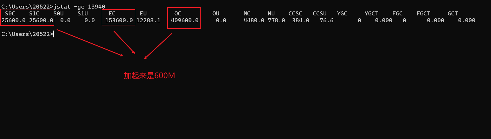

程序中的575M是怎么来的呢？

25600+153600+496900 = 575M，因为S0和S1始终有一个区是空的

或者加上JVM参数  -XX:+PrintGCDetails 也能查看

### OOM举例

```java
/**
 * -Xms600m -Xmx600m
 * @author shkstart  shkstart@126.com
 * @create 2020  21:12
 */
public class OOMTest {
    public static void main(String[] args) {
        ArrayList<Picture> list = new ArrayList<>();
        while(true){
            try {
                Thread.sleep(20);
            } catch (InterruptedException e) {
                e.printStackTrace();
            }
            list.add(new Picture(new Random().nextInt(1024 * 1024)));
        }
    }
}

class Picture{
    private byte[] pixels;

    public Picture(int length) {
        this.pixels = new byte[length];
    }
}
```

```
Exception in thread "main" java.lang.OutOfMemoryError: Java heap space
	at com.atguigu.java.Picture.<init>(OOMTest.java:29)
	at com.atguigu.java.OOMTest.main(OOMTest.java:20)
```


# 年轻代与老年代

## 介绍

存储在JVM中的Java对象可以被划分为两类:

- 一类是生命周期较短的瞬时对象，这类对象的创建和消亡都非常迅速
- 另外一类对象的生命周期却非常长,在某些极端的情况下还能够与JM的生命周期保持一致。

Java堆区进一步细分的话，可以划分为年轻代( Younggen)和老年代( olden)其中年轻代又可以划分为Eden空间、 Survivor0空间和 Survivorl空间(有时也叫做from区、to区)。


下面这参数开发中一般不会调:


配置新生代与老年代在堆结构的占比。

- **默认-XX:NewRatio=2,表示新生代占1,老年代占2,新生代占整个堆的1/3**

- 可以修改-XX:NewRatio=4,表示新生代占1,老年代占4,新生代占整个堆的1/5


```cmd
jinfo -flag NewRatio 进程号 #查看java进程新生代的设置
-XX:NewRatio=2
```

在 HotSspot中，Eden空间和另外两个 Survivor空间缺省所占的比例是8:1:1，当然开发人员可以通过选项“-XX: SurvivorRatio。”调整这个空间比例。比如: -XX:SurvivorRatio=8

**几乎所有的**Java对象都是在Eden区被new出来的绝大部分的Java对象的销毁都在新生代进行了。

- IBM公司的专门研究表明，新生代中80%的对象都是“朝生夕死”的。

可以使用选项"-Xmn"设置新生代最大内存大小，这个参数一般使用默认值就可以了。

## 例子

```java
/**
 * -Xms600m -Xmx600m
 *
 * -XX:NewRatio ： 设置新生代与老年代的比例。默认值是2.
 * -XX:SurvivorRatio ：设置新生代中Eden区与Survivor区的比例。默认值是8
 * -XX:-UseAdaptiveSizePolicy ：关闭自适应的内存分配策略  （暂时用不到）
 * -Xmn:设置新生代的空间的大小。 （一般不设置）
 *
 * @author shkstart  shkstart@126.com
 * @create 2020  17:23
 */
public class EdenSurvivorTest {
    public static void main(String[] args) {
        System.out.println("我只是来打个酱油~");
        try {
            Thread.sleep(1000000);
        } catch (InterruptedException e) {
            e.printStackTrace();
        }
    }
}
```

```
-Xms600m -Xmx600m
```

```cmd
jps
11472 Main
3024 Jps
10356
10024 Launcher
8412 EdenSurvivorTest

jstat -gc 8412
 S0C    S1C    S0U    S1U      EC       EU        OC         OU       MC     MU    CCSC   CCSU   YGC     YGCT    FGC    FGCT     GCT
25600.0 25600.0  0.0    0.0   153600.0 36864.5   409600.0     0.0     4480.0 778.0  384.0   76.6       0    0.000   0      0.000    0.000
```

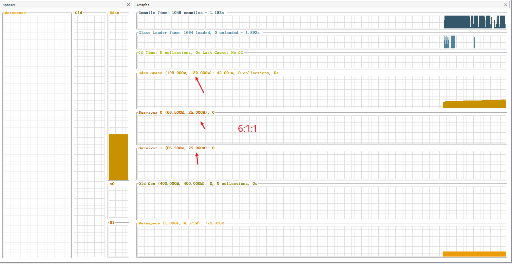

Eden:S0:S1并不是8:1:1而是6:1:1为啥呢

因为，**存在自适应机制**，-XX:-UseAdaptiveSizePolicy ：关闭自适应的内存分配策略  （暂时用不到）

想要达到8:1:1可以这样：-XX:SurviorRatio=8

## 图解对象分配一般过程

为新对象分配内存是一件非常严谨和复杂的任务，JVM的设计者们不仅需要考虑内存如何分配、在哪里分配等问题，并且由于内存分配算法与内存回收算法密切相关，所以还需要考虑GC执行完内存回收后是否会在内存空间中生内存碎片。

1.new的对象先放伊甸园区。此区有大小限制。

2.当伊甸园的空间填满时,程序又需要创建对象,JM的垃圾回收器将对伊甸园区进行垃圾回收( Minor gc),将伊甸园区中的不再被其他对象所引用的对象进行销毁。再加载新的对象放到伊甸园区

3.然后将伊甸园中的剩余对象移动到幸存者0区。

4.如果再次触发垃圾回收,此时上次幸存下来的放到幸存者0区的,如果没有回收,就会放到幸存者1区。

5.如果再次经历垃圾回收,此时会重新放回幸存者0区,接着再去幸存者1区。

6.啥时候能去养老区呢?可以设置次数。默认是15次。**可以设置参数:-XX: MaxTenuringThreshold=\<N>进行设置。**

7在养老区,相对悠闲。当养老区内存不足时,再次触发GC: Major GC,进行养老区的内存清理

8.若养老区执行了 Major GC之后发现依然无法进行对象的保存,就会产生OOM异常

java.lang.OutOfMemoryError: Java heap space


注意点：

每次年轻代回收时，存活对象放到S0、S1这两个区的其中一个空的区，谁空，谁的名字就变成S1

当Eden区满时，触发Young GC，会将Eden区和幸存区一起回收

幸存区满了，不会触发Young GC，会有一些特殊的规则（直接到老年代，即便年龄没到15）


总结

**针对幸存者s0，s1区的总结：复制之后有交换，谁空谁是to**

**关于垃圾回收：频繁在新生区收集，很少在养老区收集，几乎不在永久区/元空间收集。**

## 图解对象分配特殊过程



```java
/**
 * -Xms600m -Xmx600m
 * @author shkstart  shkstart@126.com
 * @create 2020  17:51
 */
public class HeapInstanceTest {
    byte[] buffer = new byte[new Random().nextInt(1024 * 200)];

    public static void main(String[] args) {
        ArrayList<HeapInstanceTest> list = new ArrayList<HeapInstanceTest>();
        while (true) {
            list.add(new HeapInstanceTest());
            try {
                Thread.sleep(10);
            } catch (InterruptedException e) {
                e.printStackTrace();
            }
        }
    }
}
```

使用visualVM 中的visual GC功能，观察GC过程

## 常用调优工具

JDK命令行

Eclipse: Memory Analyzer Tool

Jconsole

Visualvm

Profiler

Java Flight Recorder

Gc viewer

GC Easy

# Minor GC、Major GC与Full GC

JVM在进行GC时，并非每次都对上面三个内存(新生代、老年代;方法区)区域一起回收的，大部分时候回收的都是指新生代。

针对 Hotspot VM的实现,它里面的GC按照回收区域又分为两大种类型：一种是部分收集( Partial GC)，一种是整堆收集(Full GC)

- 部分收集：不是完整收集整个Java堆的垃圾收集。其中又分为:
  - 新生代收集( Minor GC/ Young GC)：只是新生代（Eden SO S1）的垃圾收集
  - 老年代收集( Major GC/Old GC)：只是老年代的垃圾收集。
    - 目前，只有 CMS GC会有单独收集老年代的行为。
    - **ˇ注意，很多时候 Major GC会和Full GC混淆使用，需要具体分辨是老年代回收还是整堆回收。**
  - 混合收集( Mixed GC)：收集整个新生代以及部分老年代的垃圾收集。
    - 目前,只有G1GC会有这种行为
- 整堆收集(Full GC)：收集整个java堆和方法区的垃圾收集。


## 年轻代GC( Minor GC)触发机制

- **当年轻代空间不足时,就会触发 Minor GC,这里的年轻代满指的是Eden代满, Survivor满不会引发GC。(每次 Minor GC会清理年轻代的内存。)**

- 因为Java对象大多都具备朝生夕灭的特性,所以 Minor GC非常频繁,一般回收速度也比较快。这一定义既清晰又易于理解。


- Minor GC会引发STW,暂停其它用户的线程,等垃圾回收结束,用户线程才恢复运行。


## 老年代GC( Major Gc/Fu11GC)触发机制

- 指发生在老年代的GC，对象从老年代消失时，我们说“Major GC”或“Full GC发生了。

- 出现了 Major GC经常会伴随至少一次的 Minor GC(但非绝对的,在Parallel Scavenge收集器的收集策略里就有直接进行 Major GC的策略选择过程)。

​	也就是在老年代空间不足时,会先尝试触发 Minor GC。

- 如果之后空间还不足,则触发 Major GC

- Maior GC的速度一般会比 Minor GC慢10倍以上，STW的时间更长。
- 如果 Major GC后，内存还不足，就报OOM了。
- Major GC的速度一般会比 Minor GC慢10倍以上。

## Full Gc触发机制(后面细讲)

触发Full GC执行的情况有如下五种

(1)调用 System. gc()时,系统建议执行Full GC,但是不必然执行

(2)老年代空间不足

(3)方法区空间不足

(4)通过 Minor GC后进入老年代的平均大小大于老年代的可用内存

(5)由Eden区、 survivor spacee( From Space)区向 survivor spacel(To Space)区复制时,对象大小大于 To Space可用内存,则把该对象转存到老年代，且老年代的可用内存小于该对象大小

**说明:full gc是开发或调优中尽量要避免的。这样暂时时间会短一些。**

## 例子

-Xms9m -Xmx9m -XX:+PrintGCDetails

```java

/**
 * 测试MinorGC 、 MajorGC、FullGC
 * -Xms9m -Xmx9m -XX:+PrintGCDetails
 * @author shkstart  shkstart@126.com
 * @create 2020  14:19
 */
public class GCTest {
    public static void main(String[] args) {
        int i = 0;
        try {
            List<String> list = new ArrayList<>();
            String a = "atguigu.com";
            while (true) {
                list.add(a);
                a = a + a;
                i++;
            }

        } catch (Throwable t) {
            t.printStackTrace();
            System.out.println("遍历次数为：" + i);
        }
    }
}

```

结果：

```
[GC (Allocation Failure) [PSYoungGen: 2009K->490K(2560K)] 2009K->790K(9728K), 0.0027123 secs] [Times: user=0.00 sys=0.00, real=0.00 secs] 
[GC (Allocation Failure) [PSYoungGen: 2418K->500K(2560K)] 2718K->2136K(9728K), 0.0013005 secs] [Times: user=0.00 sys=0.00, real=0.00 secs] 
[GC (Allocation Failure) [PSYoungGen: 1946K->490K(2560K)] 3582K->2838K(9728K), 0.0014976 secs] [Times: user=0.00 sys=0.00, real=0.00 secs] 
[Full GC (Ergonomics) [PSYoungGen: 1232K->0K(2560K)] [ParOldGen: 6572K->4865K(7168K)] 7804K->4865K(9728K), [Metaspace: 3299K->3299K(1056768K)], 0.0081162 secs] [Times: user=0.02 sys=0.00, real=0.01 secs] 
[GC (Allocation Failure) [PSYoungGen: 0K->0K(2560K)] 4865K->4865K(9728K), 0.0005633 secs] [Times: user=0.00 sys=0.00, real=0.00 secs] 
[Full GC (Allocation Failure) [PSYoungGen: 0K->0K(2560K)] [ParOldGen: 4865K->4847K(7168K)] 4865K->4847K(9728K), [Metaspace: 3299K->3299K(1056768K)], 0.0085657 secs] [Times: user=0.06 sys=0.00, real=0.01 secs] 
java.lang.OutOfMemoryError: Java heap space
	at java.util.Arrays.copyOf(Arrays.java:3332)
	at java.lang.AbstractStringBuilder.ensureCapacityInternal(AbstractStringBuilder.java:124)
	at java.lang.AbstractStringBuilder.append(AbstractStringBuilder.java:448)
	at java.lang.StringBuilder.append(StringBuilder.java:136)
	at com.atguigu.java1.GCTest.main(GCTest.java:20)
遍历次数为：16
Heap
 PSYoungGen      total 2560K, used 80K [0x00000000ffd00000, 0x0000000100000000, 0x0000000100000000)
  eden space 2048K, 3% used [0x00000000ffd00000,0x00000000ffd14058,0x00000000fff00000)
  from space 512K, 0% used [0x00000000fff80000,0x00000000fff80000,0x0000000100000000)
  to   space 512K, 0% used [0x00000000fff00000,0x00000000fff00000,0x00000000fff80000)
 ParOldGen       total 7168K, used 4847K [0x00000000ff600000, 0x00000000ffd00000, 0x00000000ffd00000)
  object space 7168K, 67% used [0x00000000ff600000,0x00000000ffabbf60,0x00000000ffd00000)
 Metaspace       used 3332K, capacity 4496K, committed 4864K, reserved 1056768K
  class space    used 362K, capacity 388K, committed 512K, reserved 1048576K

进程已结束,退出代码0
```

# 堆空间分代思想

为什么需要把Java堆分代?不分代就不能正常工作了吗?

经研究,不同对象的生命周期不同。70%-99%的对象是临时对象。

新生代:有Eden、两块大小相同的 Survivor(又称为from/to,s0/s1)构成,to总为空。

老年代:存放新生代中经历多次GC仍然存活的对象。Survivor区


其实不分代完全可以，分代的唯一理由就是**优化GC性能**。如果没有分代，那所有的对象都在一块，就如同把一个学校的人都关在一个教室。GC的时候要找到哪些对象没用，这样就会对堆的所有区域进行扫描。而很多对象都是朝生夕死的，如果分代的话，把新创建的对象放到某一地方，当GC的时候先把这块存储“朝生夕死”对象的区域进行回收，这样就会腾出很大的空间出来。


# 内存分配策略

如果对象在Eden出生并经过第一次 Minor GC后仍然存活,并且能被 Survivor容纳的话,将被移动到 Survivor空间中,并将对象年龄设为1。对象在Survivor区中每熬过一次 Minor GC,年龄就增加1岁,当它的年龄增加到一定程度(默认为15岁,其实每个JVM、每个GC都有所不同)时,就会被晋升到老年代

对象晋升老年代的年龄阈值,可以通过选项-XX: MaxTenuringThreshold来设置

## 对象提升（Promotion）规则

针对不同年龄段的对象分配原则如下所示:

- 优先分配到Eden

- 大对象直接分配到老年代
  - 尽量避免程序中出现过多的大对象

- 长期存活的对象分配到老年代

- 动态对象年龄判断
  - **如果 Survivor区中相同年龄的所有对象大小的总和大于 Survivor空间的一半，年龄大于或等于该年龄的对象可以直接进入老年代，无须等到MaxTenuringThreshold中要求的年龄。**

- 空间分配担保-XX:HandlePromotionFailure

```java
/** 测试：大对象直接进入老年代
 * -Xms60m -Xmx60m -XX:NewRatio=2 -XX:SurvivorRatio=8 -XX:+PrintGCDetails
 * @author shkstart  shkstart@126.com
 * @create 2020  21:48
 */
public class YoungOldAreaTest {
    public static void main(String[] args) {
        byte[] buffer = new byte[1024 * 1024 * 20];//20m

    }
}
```

```
Heap
 PSYoungGen      total 18432K, used 2681K [0x00000000fec00000, 0x0000000100000000, 0x0000000100000000)
  eden space 16384K, 16% used [0x00000000fec00000,0x00000000fee9e438,0x00000000ffc00000)
  from space 2048K, 0% used [0x00000000ffe00000,0x00000000ffe00000,0x0000000100000000)
  to   space 2048K, 0% used [0x00000000ffc00000,0x00000000ffc00000,0x00000000ffe00000)
 ParOldGen       total 40960K, used 20480K [0x00000000fc400000, 0x00000000fec00000, 0x00000000fec00000)
  object space 40960K, 50% used [0x00000000fc400000,0x00000000fd800010,0x00000000fec00000)
 Metaspace       used 3304K, capacity 4496K, committed 4864K, reserved 1056768K
  class space    used 359K, capacity 388K, committed 512K, reserved 1048576K
```


# 为对象分配内存：TLAB

为什么有TLAB( Thread Local Allocation Buffer)?

- 堆区是线程共享区域，任何线程都可以访问到堆区中的共享数据
- 由于对象实例的创建在JVM中非常频繁，因此在并发环境下从堆区中划分内存空间是线程不安全的
- 为避免多个线程操作同一地址，需要使用加锁等机制，进而影响分配速度。

什么是TLAB？

从**内存模型**而不是垃圾收集的角度，对**Eden区域**继续进行划分，JVM为**每个线程分配了一个私有缓存区域**，它包含在Eden空间内。

多线程同时分配内存时，使用TLAB可以避免一系列的非线程安全问题，同时还能够提升内存分配的吞吐量，因此我们可以将这种内存分配方式称之为**快速分配策略**。

据我所知所有 openjdk衍生出来的JVM都提供了TLAB的设计。

每个线程都有一份TLAB，线程先用TLAB的内存，用完了再从Eden中的其它地方获取。


TLAB的再说明：

- 尽管不是所有的对象实例都能够在TLAB中成功分配内存，但**JVM确实是将TLAB作为内存分配的首选**。·

- 在程序中，开发人员可以通过选项“-XX:UseTLAB”设置是否开启TLAB空间。

- 默认情况下,TLAB空间的内存非常小，**仅占有整个Eden空间的1%**，当然我们可以通过选项“-XX: TLABWasteTargetPercent”设置TLAB空间所占用Eden空间的百分比大小。

- 一旦对象在LAB空间分配内存失败时,JVM就会尝试着通过**使用加锁机制**确保数据操作的原子性,从而直接在Eden空间中分配内存。

```java
/**
 * 测试-XX:UseTLAB参数是否开启的情况:默认情况是开启的
 *
 * @author shkstart  shkstart@126.com
 * @create 2020  16:16
 */
public class TLABArgsTest {
    public static void main(String[] args) {
        System.out.println("我只是来打个酱油~");
        try {
            Thread.sleep(1000000);
        } catch (InterruptedException e) {
            e.printStackTrace();
        }
    }
}
```

```cmd
C:\Users\20522>jps
14320
15300 TLABArgsTest
7540 Program
11960 Jps
14568 Launcher

C:\Users\20522>jinfo -flag UseTLAB 15300
-XX:+UseTLAB  #默认开启
```



# 小结堆空间参数设置

具体查看某个参数的指令： jps：查看当前运行中的进程

```
jinfo -flag SurvivorRatio 进程id
```

官网说明：https://docs.oracle.com/javase/8/docs/technotes/tools/unix/java.html

-XX:+ PrintFlagsInitial：査看所有的参数的默认初始值

Xx:+PrintFlagsFinal：査看所有的参数的最终值(可能会存在修改,不再是初始值)

-Xms：初始堆空间内存(默认为物理内存的1/64)

-Xmx：最大堆空间内存(默认为物理内存的1/4)

-Xmn：设置新生代的大小。(初始值及最大值）

-XX:Newratio：配置新生代与老年代在堆结构的占比

-XX:SurvivorRatlo：设置新生代中Eden和S0/S1空间的比例

-XX:MaxTenuringThreshold：设置新生代垃圾的最大年龄

-XX:+PrintGCDetails：输出详细的GC处理日志

- 打印gc简要信息:①-XX:+PrintGC ②-verbose:gc

-XX:HandlePromotionFailure：是否设置空间分配担保

## 空间分配担保

在发生 Minor GC之前，虚拟机会**检查老年代最大可用的连续空间是否大于新生代所有对象的总空间。**

- 如果大于，则此次 Minor GC是安全的
- 如果小于，则虚拟机会查看-XX:HandlePromotionFailure设置值是否允许担保失败。
  - 如果 -XX:HandlePromotionFailure=true，**那么会继续检查老年代最大可用连续空间是否大于历次晋升到老年代的对象的平均大小**。
    - 如果大于，则尝试进行一次 Minor GC，但这次 Minor GC依然是有风险的;
    - 如果小于，则改为进行一次Full GC。
  - 如果 -XX:HandlePromotionFailure=false，则改为进行一次Full GC。
- 在JDK6 Update24（记为JDK7就行）之后， -XX:HandlePromotionFailure参数不会再影响到虚拟机的空间分配担保策略，观察 OpendJDK中的源码变化，虽然源码中还定义了HandlePromotionFailure参数，但是在代码中已经不会再使用它。JDK6 Update24之后的规则变为**只要老年代的连续空间大于新生代对象总大小或者历次晋升的平均大小就会进行 Minor GC，否则将进行Full GC**。

# 堆是分配对象存储的唯一选择吗？

## 逃逸分析

在《深入理解Java虚拟机》中关于Java堆内存有这样一段描述:

随着JIT编译期的发展与**逃逸分析技术**逐渐成熟，**栈上分配、标量替换优化技术**将会导致一些微妙的变化，所有的对象都分配到堆上也渐渐变得不那么“绝对”了。

在Java虚拟机中，对象是在Java堆中分配内存的，这是一个普遍的常识。但是，有种特殊情况，那就是**如果经过逃逸分析( Escape Analysis)后发现，一个对象并没有逃逸出方法的话，那么就可能被优化成栈上分配。**这样就无需在堆上分配内存，也无须进行垃圾回收了。这也是最常见的堆外存储技术。

此外，前面提到的基于 Openjdk深度定制的TaoBaoVM，其中创新的GCIH(GC invisible heap)技术实现off-heap，将生命周期较长的Java对象从heap中移至heap外，并且GC不能管理GCIH内部的Java对象，以此达到降低Gc的回收频率和提升GC的回收效率的目的。


如何将堆上的对象分配到栈，需要使用逃逸分析手段。

这是一种可以有效减少Java程序中同步负载和内存堆分配压力的跨函数全局数据流分析算法。

通过逃逸分析， Java Hotspot编译器能够分析出一个新的对象的引用的使用范围从而决定是否要将这个对象分配到堆上。

逃逸分析的基本行为就是分析对象动态作用域：

- 当一个对象在方法中被定义后，对象只在方法内部使用，则认为没有发生逃逸。
- 当一个对象在方法中被定义后，它被外部方法所引用，则认为发生逃逸。例如作为调用参数传递到其他地方中。

比如：

1. ```java
   public void myMethod(){
     V v = new V();
     //use v
     //...
     v = null;
   }
   ```

没有发生逃逸的对象，则可以分配到栈上，随着方法执行的结束，栈空间就被移除。

```java
public static StringBuffer createStringBuffer(String s1, String s2){
  StringBuffer sb = new StringBuffer();
  sb.append(s1);
  sb.append(s2);
  return sb;
}
```

上述代码如果想要 StringBuffer sb 不逃出方法，可以这样写：

```java
public static String createStringBuffer(String s1, String s2){
  StringBuffer sb = new StringBuffer();
  sb.append(s1);
  sb.append(s2);
  return sb.toString();
}
```


```java
/**
 * 逃逸分析
 *
 *  如何快速的判断是否发生了逃逸分析，大家就看new的对象实体是否有可能在方法外被调用。
 * @author shkstart
 * @create 2020 下午 4:00
 */
public class EscapeAnalysis {

    public EscapeAnalysis obj;

    /*
    方法返回EscapeAnalysis对象，发生逃逸
     */
    public EscapeAnalysis getInstance(){
        return obj == null? new EscapeAnalysis() : obj;
    }
    /*
    为成员属性赋值，发生逃逸
     */
    public void setObj(){
        this.obj = new EscapeAnalysis();
    }
    //思考：如果当前的obj引用声明为static的？仍然会发生逃逸。

    /*
    对象的作用域仅在当前方法中有效，没有发生逃逸
     */
    public void useEscapeAnalysis(){
        EscapeAnalysis e = new EscapeAnalysis();
    }
    /*
    引用成员变量的值，发生逃逸
     */
    public void useEscapeAnalysis1(){
        EscapeAnalysis e = getInstance();
        //getInstance().xxx()同样会发生逃逸
    }
}
```

注意：逃逸分析关心的是对象实体是否逃逸，而不是对象的引用。

参数设置:在JDK6u23版本之后, Hotspot中默认就已经开启了逃逸分析。

- 如果使用的是较早的版本，开发人员则可以通过选项“-XX:+DoEscapeAnalysis"显式开启逃逸分析

- 通过选项“-XX:+ PrintEscapeAnalysis"查看逃逸分析的筛选结果。

**结论：开发中能使用局部变量的，就不要使用在方法外定义。**

使用逃逸分析，编译器可以对代码做如下优化：

一、**栈上分配**。将堆分配转化为栈分配。如果一个对象在子程序中被分配，要使指向该对象的指针永远不会逃逸，对象可能是栈分配的候选，而不是堆分配。

二、**同步省略**。如果一个对象被发现只能从一个线程被访问到，那么对于这个对象的操作可以不考虑同步。

三、**分离对象或标量替换**。有的对象可能不需要作为一个连续的内存结构存在也可以被访问到，那么对象的部分(或全部)可以不存储在内存，而是存储在CPU寄存器中。

## 栈上分配

**栈上分配**。将堆分配转化为栈分配。如果一个对象在子程序中被分配，要使指向该对象的指针永远不会逃逸，对象可能是栈分配的候选，而不是堆分配。


JIT编译器在编译期间根据逃逸分析的结果，发现如果一个对象并没有逃逸出方法的话，就可能被优化成栈上分配。分配完成后，继续在调用栈内执行，最后线程结束，栈空间被回收，局部变量对象也被回收。这样就无须进行垃圾回收了。

常见的栈上分配的场景：在逃逸分析中，已经说明了。分别是给成员变量赋值、方法返回值、实例引用传递。

```java
/**
 * 栈上分配测试
 * -Xmx1G -Xms1G -XX:-DoEscapeAnalysis -XX:+PrintGCDetails
 * @author shkstart  shkstart@126.com
 * @create 2020  10:31
 */
public class StackAllocation {
    public static void main(String[] args) {
        long start = System.currentTimeMillis();

        for (int i = 0; i < 10000000; i++) {
            alloc();
        }
        // 查看执行时间
        long end = System.currentTimeMillis();
        System.out.println("花费的时间为： " + (end - start) + " ms");
        // 为了方便查看堆内存中对象个数，线程sleep
        try {
            Thread.sleep(1000000);
        } catch (InterruptedException e1) {
            e1.printStackTrace();
        }
    }

    private static void alloc() {
        User user = new User();//未发生逃逸
    }

    static class User {

    }
}
```

关闭逃逸分析：花费的时间为： 122 ms


开启逃逸分析：花费的时间为： 7 ms


设置堆内存小一些，发现开启逃逸分析时，没有发生GC。

## 同步省略

**同步省略**。如果一个对象被发现只能从一个线程被访问到，那么对于这个对象的操作可以不考虑同步。

线程同步的代价是相当高的，同步的后果是降低并发性和性能。

在动态编译同步块的时候，JIT编译器可以借助逃逸分析来**判断同步块所使用的锁对象是否只能够被一个线程访问而没有被发布到其他线程**。如果没有，那么JIT编译器在编译这个同步块的时候就会取消对这部分代码的同步。这样就能大大提高并发性和性能。这个取消同步的过程就叫同步省略，也叫**锁消除**。

如：

```java
public void f(){
  Object holllis = new Object();
  synchronized(holllis){
    System.out.prinlt(holllis);
  }
}
```

代码中对holllis这个对象进行加锁，但是holllis对象的生命周期只在f()方法中，并不会被其他线程所访问到，所以在JIT编译阶段就会被优化掉。优化成:

```java
public void f(){
  Object holllis = new Object();
  System.out.prinlt(holllis);
}
```

注意的是，字节码文件中，仍然有加锁的指令。

```java
 0 new #2 <java/lang/Object>
 3 dup
 4 invokespecial #1 <java/lang/Object.<init> : ()V>
 7 astore_1
 8 aload_1
 9 dup
10 astore_2
11 monitorenter
12 getstatic #3 <java/lang/System.out : Ljava/io/PrintStream;>
15 aload_1
16 invokevirtual #4 <java/io/PrintStream.println : (Ljava/lang/Object;)V>
19 aload_2
20 monitorexit
21 goto 29 (+8)
24 astore_3
25 aload_2
26 monitorexit
27 aload_3
28 athrow
29 return
```

## 标量替换

**分离对象或标量替换**。有的对象可能不需要作为一个连续的内存结构存在也可以被访问到，那么对象的部分(或全部)可以不存储在内存，而是存储在CPU寄存器中。

标量( Scalar)是指一个无法再分解成更小的数据的数据。Java中的原始数据类型就是标量。

相对的，那些还可以分解的数据叫做聚合量( Aggregate),Java中的对象就是聚合量，因为他可以分解成其他聚合量和标量。

在JIT阶段，如果经过逃逸分析，发现一个对象不会被外界访问的话，那么经过JIT优化，就会把这个对象拆解成若干个其中包含的若干个成员变量来代替。这个过程就是**标量替换**。

标量替换参数设置：
参数-XX:+EliminateAllocations：开启了标量替换(默认打开)，允许将对象打散分配在栈上


```java
public static void main(String[] args){
  alloc();
}
private static void alloc(){
  Point point = new Point(1,2);
  System.out.prinlt("point.x="+point.x+"point.y="+point.y);
}
class Point{
  private int x;
  private int y;
}
```

以上代码，经过标量替换后，就会变成：

```java
private static void alloc(){
  int x = 1;
  int y = 2;
  System.out.prinlt("point.x="+x+"point.y="+y);
}
```

可以看到，Point这个聚合量经过逃逸分析后，发现他并没有逃逸，就被替换成两个聚合量了。那么标量替换有什么好处呢?就是可以大大减少堆内存的占用。因为旦不需要创建对象了，那么就不再需要分配堆内存了。标量替换为栈上分配提供了很好的基础。


```java
/**
 * 标量替换测试
 *  -Xmx100m -Xms100m -XX:+DoEscapeAnalysis -XX:+PrintGC -XX:-EliminateAllocations
 * @author shkstart  shkstart@126.com
 * @create 2020  12:01
 */
public class ScalarReplace {
    public static class User {
        public int id;
        public String name;
    }

    public static void alloc() {
        User u = new User();//未发生逃逸
        u.id = 5;
        u.name = "www.atguigu.com";
    }

    public static void main(String[] args) {
        long start = System.currentTimeMillis();
        for (int i = 0; i < 10000000; i++) {
            alloc();
        }
        long end = System.currentTimeMillis();
        System.out.println("花费的时间为： " + (end - start) + " ms");
    }
}
```

不开启逃逸分析和标量替换：

```
[GC (Allocation Failure)  25600K->816K(98304K), 0.0010760 secs]
[GC (Allocation Failure)  26416K->784K(98304K), 0.0009584 secs]
[GC (Allocation Failure)  26384K->800K(98304K), 0.0009059 secs]
[GC (Allocation Failure)  26400K->704K(98304K), 0.0009815 secs]
[GC (Allocation Failure)  26304K->848K(98304K), 0.0007845 secs]
[GC (Allocation Failure)  26448K->768K(101376K), 0.0008413 secs]
[GC (Allocation Failure)  32512K->688K(101376K), 0.0007119 secs]
[GC (Allocation Failure)  32432K->688K(100352K), 0.0004032 secs]
花费的时间为： 82 ms
```


默认开启逃逸分析和标量替换：花费的时间为： 5ms

上述代码在主函数中进行了1亿次alloc。调用进行对象创建,由于User对象实例需要占据约16字节的空间，因此累计分配空间达到将近1.5GB。如果堆空间小于这个值，就必然会发生GC。使用如下参数运行上述代码:

```
-server -Xmx100m -Xms100m -XX:+DoEscapeAnalysis -XX:+PrintGC -XX:-EliminateAllocations
```

这里使用参数如下:·

- 参数 -server：启动 Server模式，因为在 Server模式下，才可以启用逃逸分析。64位电脑上，默认就是Server模式
- 参数-XX:+DoEscapeAnalysis：启用逃逸分析
- 参数-Xmx100m：指定了堆空间最大为10MB
- 参数-XX:+Prints：将打印GC日志。
- 参数-XX:+EliminateAllocations：开启了标量替换(默认打开)，允许将对象打散分配在栈上，比如对象拥有id和name两个字段，那么这两个字段将会被视为两个独立的局部变量进行分配

## 逃逸分析并不成熟

关于逃逸分析的论文在1999年就已经发表了，但直到JDK1.6才有实现，而且这项技术到如今也并不是十分成熟的。

其根本原因就是**无法保证逃逸分析的性能消耗一定能高于他的消耗。虽然经过逃逸分析可以做标量替换、栈上分配、和锁消除。但是逃逸分析自身也是需要进行一系列复杂的分析的，这其实也是一个相对耗时的过程。**

一个极端的例子，就是经过逃逸分析之后，发现没有一个对象是不逃逸的。那这个逃逸分析的过程就白白浪费掉了。

虽然这项技术并不十分成熟，但是它也**是即时编译器优化技术中一个十分重要的手段**。

注意到有一些观点，认为通过逃逸分析，JVM会在栈上分配那些不会逃逸的对象，这在理论上是可行的，但是取决于JW设计者的选择。据我所知,Oracle Hotspot JVM中并未这么做,这一点在逃逸分析相关的文档里已经说明,**所以可以明确所有的对象实例都是创建在堆上。**可以这么理解，虽然默认开启了逃逸分析，只是为了实现标量替换，对象仍然是在堆上创建的。

目前很多书籍还是基于JDK7以前的版本，JDK已经发生了很大变化，intern字符串的缓存和静态变量曾经都被分配在永久代上，而永久代已经被元数据区取代。但是，intern字符串缓存和静态变量并不是被转移到元数据区，而是直接在堆上分配，所以这一点同样符合前面一点的结论：**对象实例都是分配在堆上**。

# 本章小结

年轻代是对象的诞生、成长、消亡的区域,一个对象在这里产生、应用,最后被垃圾回收器收集、结束生命。

老年代放置长生命周期的对象,通常都是从 Survivor区域筛选拷贝过来的Java对象。当然,也有特殊情况,我们知道普通的对象会被分配在TLAB上:如果对象较大,JVM会试图直接分配在Eden其他位置上;如果对象太大,完全无法在新生代找到足够长的连续空闲空间,JM就会直接分配到老年代。当GC只发生在年轻代中,回收年轻代对象的行为被称为 Minor GC。

当GC发生在老年代时则被称为 Major GC或者Full GC。一般的, Minor GC的发生频率要比 Major GC高很多,即老年代中垃圾回收发生的频率将大大低于年轻代。

