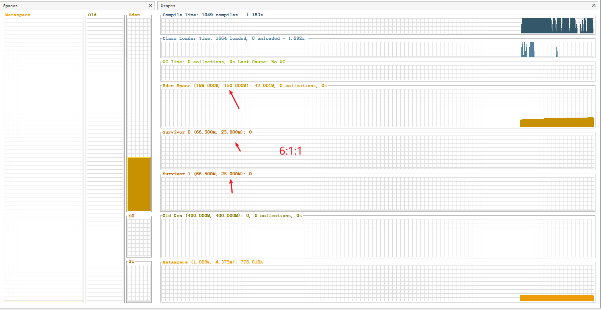

# 堆的核心概述

一个JVM实例只存在一个堆内存,堆也是Java内存管理的核心区域。Java堆区在JWM启动的时候即被创建,其空间大小也就确定了。是JVM管理的最大一块内存空间。

堆内存的大小是可以调节的。

《Java虚拟机规范》规定，堆可以处于**物理上不连续**的内存空间中，但在逻辑上它应该被视为连续的。

所有的线程共享Java堆，在这里还可以划分**线程私有的缓冲区( ThreadLocal Allocation Buffer, TLAB)**


《Java虛拟机规范》中对Java堆的描述是：所有的对象实例以及数组都应当在运行时分配在堆上。( The heap is the run- time data area fromwhich memory for all class instances and arrays is allocated我要说的是：“**几乎**”所有的对象实例都在这里分配内存。一从实际使用角度看的。

数组和对象可能永远不会存储在栈上，因为栈帧中保存引用，这个引用指向对象或者数组在堆中的位置。

**在方法结束后，堆中的对象不会马上被移除，仅仅在垃圾收集的时候才会被移除。**

堆，是GC( Garbage Collection，垃圾收集器)执行垃圾回收的重点区域。


```java
public class SimpleHeap {
    private int id;//属性、成员变量

    public SimpleHeap(int id) {
        this.id = id;
    }

    public void show() {
        System.out.println("My ID is " + id);
    }
    public static void main(String[] args) {
        SimpleHeap sl = new SimpleHeap(1);
        SimpleHeap s2 = new SimpleHeap(2);

        int[] arr = new int[10];

        Object[] arr1 = new Object[10];
    }
}
```



## 内存细分

**现代垃圾收集器大部分都基于分代收集理论设计，堆空间细分为:**

Java7及之前堆内存**逻辑上**分为三部分：**新生区+养老区+永久区**

- Young Generation Space新生区   Young/New
  - 又被划分为Eden区和 Survivor区

- Tenure generation space  养老区  old/Tenure
- Permanent Space  永久区  Perm

Java8及之后堆内存**逻辑上**分为三部分: **新生区+养老区+元空间**

- Young Generation Space新生区  Young/New
  - 又被划分为Eden区和 Survivor区
- Tenure generation space  养老区  Old/Tenure
- Meta Space元空间  Meta

等价名词：

新生区<==>新生代<==>年轻代

养老区<==>老年区<==>老年代

永久区<==>永久代


还是上一小节的SimpleHeap的例子，加上JVM参数：-Xms20m -Xmx20m -XX:+PrintGCDetails

JDK8:

```
Heap
 PSYoungGen      total 6144K, used 1855K [0x00000000ff980000, 0x0000000100000000, 0x0000000100000000)
  eden space 5632K, 32% used [0x00000000ff980000,0x00000000ffb4fe48,0x00000000fff00000)
  from space 512K, 0% used [0x00000000fff80000,0x00000000fff80000,0x0000000100000000)
  to   space 512K, 0% used [0x00000000fff00000,0x00000000fff00000,0x00000000fff80000)
 ParOldGen       total 13824K, used 0K [0x00000000fec00000, 0x00000000ff980000, 0x00000000ff980000)
  object space 13824K, 0% used [0x00000000fec00000,0x00000000fec00000,0x00000000ff980000)
 Metaspace       used 3133K, capacity 4496K, committed 4864K, reserved 1056768K
  class space    used 341K, capacity 388K, committed 512K, reserved 1048576K

```


JDK7:

```
Heap
 PSYoungGen      total 6144K, used 1855K [0x00000000ff980000, 0x0000000100000000, 0x0000000100000000)
  eden space 5632K, 32% used [0x00000000ff980000,0x00000000ffb4fe48,0x00000000fff00000)
  from space 512K, 0% used [0x00000000fff80000,0x00000000fff80000,0x0000000100000000)
  to   space 512K, 0% used [0x00000000fff00000,0x00000000fff00000,0x00000000fff80000)
 ParOldGen       total 13824K, used 0K [0x00000000fec00000, 0x00000000ff980000, 0x00000000ff980000)
  object space 13824K, 0% used [0x00000000fec00000,0x00000000fec00000,0x00000000ff980000)
 PSPermGen       used 3133K, capacity 4496K, committed 4864K, reserved 1056768K
  object space    used 341K, capacity 388K, committed 512K, reserved 1048576K

```

## 设置堆空间大小和OOM

Java堆区用于存储Java对象实例，那么堆的大小在JWM启动时就已经设定好了，大家可以通过选项”-Xmx"和”-xms"来进行设置

- “-Xms"用于表示堆区的起始内存，等价于-XX: InitialHeapSize
- “-Xmx"则用于表示堆区的最大内存，等价于-XX: MaxHeapSize

一旦堆区中的内存大小超过“-Xmx所指定的最大内存时，将会抛出OutOfMemoryError异常。

**通常会将-Xms和-Xmx两个参数配置相同的值，其目的是为了能够在java垃圾回收机制清理完堆区后不需要重新分隔计算堆区的大小，从而提高性能。**

**默认**情况下，

- **初始内存大小：物理电脑内存大小/64**

- **最大内存大小：物理电脑内存大小/4**

### 例子

-Xms600m -Xmx600m

```java
public class HeapSpaceInitial {
    public static void main(String[] args) {

        //返回Java虚拟机中的堆内存总量
        long initialMemory = Runtime.getRuntime().totalMemory() / 1024 / 1024;
        //返回Java虚拟机试图使用的最大堆内存量
        long maxMemory = Runtime.getRuntime().maxMemory() / 1024 / 1024;

        System.out.println("-Xms : " + initialMemory + "M");
        System.out.println("-Xmx : " + maxMemory + "M");
        try {
            Thread.sleep(1000000);
        } catch (InterruptedException e) {
            e.printStackTrace();
        }
    }
}
```
结果：

```
-Xms : 575M
-Xmx : 575M
```

咦，为啥不是600M呢？

使用jdk自带的命令行来查看：

```cmd
C:\Users\20522>jps #查看java进程ID
10224 Jps
11472 Main
10356
13940 HeapSpaceInitial
9732 Launcher

C:\Users\20522>jstat -gc 13940
 S0C    S1C    S0U    S1U      EC       EU        OC         OU       MC     MU    CCSC   CCSU   YGC     YGCT    FGC    FGCT     GCT
25600.0 25600.0  0.0    0.0   153600.0 12288.1   409600.0     0.0     4480.0 778.0  384.0   76.6       0    0.000   0      0.000    0.000
```


程序中的575M是怎么来的呢？

25600+153600+496900 = 575M，因为S0和S1始终有一个区是空的

或者加上JVM参数  -XX:+PrintGCDetails 也能查看

### OOM举例

```java
/**
 * -Xms600m -Xmx600m
 * @author shkstart  shkstart@126.com
 * @create 2020  21:12
 */
public class OOMTest {
    public static void main(String[] args) {
        ArrayList<Picture> list = new ArrayList<>();
        while(true){
            try {
                Thread.sleep(20);
            } catch (InterruptedException e) {
                e.printStackTrace();
            }
            list.add(new Picture(new Random().nextInt(1024 * 1024)));
        }
    }
}

class Picture{
    private byte[] pixels;

    public Picture(int length) {
        this.pixels = new byte[length];
    }
}
```

```
Exception in thread "main" java.lang.OutOfMemoryError: Java heap space
	at com.atguigu.java.Picture.<init>(OOMTest.java:29)
	at com.atguigu.java.OOMTest.main(OOMTest.java:20)
```


# 年轻代与老年代

## 介绍

存储在JVM中的Java对象可以被划分为两类:

- 一类是生命周期较短的瞬时对象，这类对象的创建和消亡都非常迅速
- 另外一类对象的生命周期却非常长,在某些极端的情况下还能够与JM的生命周期保持一致。

Java堆区进一步细分的话，可以划分为年轻代( Younggen)和老年代( olden)其中年轻代又可以划分为Eden空间、 Survivor0空间和 Survivorl空间(有时也叫做from区、to区)。



下面这参数开发中一般不会调:



配置新生代与老年代在堆结构的占比。

- **默认-XX:NewRatio=2,表示新生代占1,老年代占2,新生代占整个堆的1/3**

- 可以修改-XX:NewRatio=4,表示新生代占1,老年代占4,新生代占整个堆的1/5


```cmd
jinfo -flag NewRatio 进程号 #查看java进程新生代的设置
-XX:NewRatio=2
```

在 HotSspot中，Eden空间和另外两个 Survivor空间缺省所占的比例是8:1:1，当然开发人员可以通过选项“-XX: SurvivorRatio。”调整这个空间比例。比如: -XX:SurvivorRatio=8

**几乎所有的**Java对象都是在Eden区被new出来的绝大部分的Java对象的销毁都在新生代进行了。

- IBM公司的专门研究表明，新生代中80%的对象都是“朝生夕死”的。

可以使用选项"-Xmn"设置新生代最大内存大小，这个参数一般使用默认值就可以了。

## 例子

```java
/**
 * -Xms600m -Xmx600m
 *
 * -XX:NewRatio ： 设置新生代与老年代的比例。默认值是2.
 * -XX:SurvivorRatio ：设置新生代中Eden区与Survivor区的比例。默认值是8
 * -XX:-UseAdaptiveSizePolicy ：关闭自适应的内存分配策略  （暂时用不到）
 * -Xmn:设置新生代的空间的大小。 （一般不设置）
 *
 * @author shkstart  shkstart@126.com
 * @create 2020  17:23
 */
public class EdenSurvivorTest {
    public static void main(String[] args) {
        System.out.println("我只是来打个酱油~");
        try {
            Thread.sleep(1000000);
        } catch (InterruptedException e) {
            e.printStackTrace();
        }
    }
}
```

```
-Xms600m -Xmx600m
```

```cmd
jps
11472 Main
3024 Jps
10356
10024 Launcher
8412 EdenSurvivorTest

jstat -gc 8412
 S0C    S1C    S0U    S1U      EC       EU        OC         OU       MC     MU    CCSC   CCSU   YGC     YGCT    FGC    FGCT     GCT
25600.0 25600.0  0.0    0.0   153600.0 36864.5   409600.0     0.0     4480.0 778.0  384.0   76.6       0    0.000   0      0.000    0.000
```



Eden:S0:S1并不是8:1:1而是6:1:1为啥呢

因为，**存在自适应机制**，-XX:-UseAdaptiveSizePolicy ：关闭自适应的内存分配策略  （暂时用不到）

想要达到8:1:1可以这样：-XX:SurviorRatio=8

## 图解对象分配一般过程

为新对象分配内存是一件非常严谨和复杂的任务，JVM的设计者们不仅需要考虑内存如何分配、在哪里分配等问题，并且由于内存分配算法与内存回收算法密切相关，所以还需要考虑GC执行完内存回收后是否会在内存空间中生内存碎片。

1.new的对象先放伊甸园区。此区有大小限制。

2.当伊甸园的空间填满时,程序又需要创建对象,JM的垃圾回收器将对伊甸园区进行垃圾回收( Minor gc),将伊甸园区中的不再被其他对象所引用的对象进行销毁。再加载新的对象放到伊甸园区

3.然后将伊甸园中的剩余对象移动到幸存者0区。

4.如果再次触发垃圾回收,此时上次幸存下来的放到幸存者0区的,如果没有回收,就会放到幸存者1区。

5.如果再次经历垃圾回收,此时会重新放回幸存者0区,接着再去幸存者1区。

6.啥时候能去养老区呢?可以设置次数。默认是15次。**可以设置参数:-XX: MaxTenuringThreshold=\<N>进行设置。**

7在养老区,相对悠闲。当养老区内存不足时,再次触发GC: Major GC,进行养老区的内存清理

8.若养老区执行了 Major GC之后发现依然无法进行对象的保存,就会产生OOM异常

java.lang.OutOfMemoryError: Java heap space



注意点：

每次年轻代回收时，存活对象放到S0、S1这两个区的其中一个空的区，谁空，谁的名字就变成S1

当Eden区满时，触发Young GC，会将Eden区和幸存区一起回收

幸存区满了，不会触发Young GC，会有一些特殊的规则（直接到老年代，即便年龄没到15）


总结

**针对幸存者s0，s1区的总结：复制之后有交换，谁空谁是to**

**关于垃圾回收：频繁在新生区收集，很少在养老区收集，几乎不在永久区/元空间收集。**

## 图解对象分配特殊过程




```java
/**
 * -Xms600m -Xmx600m
 * @author shkstart  shkstart@126.com
 * @create 2020  17:51
 */
public class HeapInstanceTest {
    byte[] buffer = new byte[new Random().nextInt(1024 * 200)];

    public static void main(String[] args) {
        ArrayList<HeapInstanceTest> list = new ArrayList<HeapInstanceTest>();
        while (true) {
            list.add(new HeapInstanceTest());
            try {
                Thread.sleep(10);
            } catch (InterruptedException e) {
                e.printStackTrace();
            }
        }
    }
}
```

使用visualVM 中的visual GC功能，观察GC过程

## 常用调优工具

JDK命令行

Eclipse: Memory Analyzer Tool

Jconsole

Visualvm

Profiler

Java Flight Recorder

Gc viewer

GC Easy

# Minor GC、Major GC与Full GC

JVM在进行GC时，并非每次都对上面三个内存(新生代、老年代;方法区)区域一起回收的，大部分时候回收的都是指新生代。

针对 Hotspot VM的实现,它里面的GC按照回收区域又分为两大种类型：一种是部分收集( Partial GC)，一种是整堆收集(Full GC)

- 部分收集：不是完整收集整个Java堆的垃圾收集。其中又分为:
  - 新生代收集( Minor GC/ Young GC)：只是新生代（Eden SO S1）的垃圾收集
  - 老年代收集( Major GC/Old GC)：只是老年代的垃圾收集。
    - 目前，只有 CMS GC会有单独收集老年代的行为。
    - **ˇ注意，很多时候 Major GC会和Full GC混淆使用，需要具体分辨是老年代回收还是整堆回收。**
  - 混合收集( Mixed GC)：收集整个新生代以及部分老年代的垃圾收集。
    - 目前,只有G1GC会有这种行为
- 整堆收集(Full GC)：收集整个java堆和方法区的垃圾收集。


年轻代GC( Minor GC)触发机制：

**当年轻代空间不足时,就会触发 Minor GC,这里的年轻代满指的是Eden代满, Survivor满不会引发GC。(每次 Minor GC会清理年轻代的内存。)**

因为Java对象大多都具备朝生夕灭的特性,所以 Minor GC非常频繁,一般回收速度也比较快。这一定义既清晰又易于理解。

Minor GC会引发STW,暂停其它用户的线程,等垃圾回收结束,用户线程才恢复运行。

PPT234

1