# 虚拟机栈基本内容

## 介绍

由于跨平台性的设计，Java的指令都是根据栈来设计的。不同平台CPU架构不同，所以不能设计为基于寄存器的。

优点是跨平台，指令集小，编译器容易实现，缺点是性能下降，实现同样的功能需要更多的指令。

有不少Java开发人员一提到Java内存结构,就会非常粗粒度地将JM中的内存区理解为仅有Java堆(heap)和Java栈( stack)?为什么?

**栈是运行时的单位,而堆是存储的单位。**

即：
栈解决程序的运行问题，即程序如何执行，或者说如何处理数据。
堆解决的是数据存储的问题，即数据怎么放、放在哪儿。


Java虚拟机栈是什么?

Java虚拟机栈( Java virtual Machine stack),早期也叫Java栈。
**每个线程**在创建时都会创建一个虚拟机栈,其内部保存一个个的栈帧( Stack frame),对应着一次次的Java方法调用。

是线程私有的

生命周期生命周期和线程一致。

**作用**：主管Java程序的运行,它保存方法的局部变量、部分结果，并参与方法的调用和返回。

局部变量：8种基本数据类型、对象的引用地址

**举例**


**栈的特点**

栈是一种快速有效的分配存储方式,访问速度仅次于程序计数器。

JVM直接对Java栈的操作只有两个：

- 每个方法执行，伴随着进栈(入栈、压栈)
- 执行结束后的出栈工作

对于栈来说不存在垃圾回收问题，但存在OOM


## 栈中可能出现的异常

Java虚拟机规范允许**Java栈的大小是动态的或者是固定不变的**。

如果采用固定大小的Java虚拟机栈,那每一个线程的Java虚拟机栈容量可以在线程创建的时候独立选定。如果线程请求分配的栈容量超过Java虚拟机栈允许的最大容量,Java虚拟机将会抛出一个**StackoverFlowError**异常。

如果Java虚拟机栈可以动态扩展,并且在尝试扩展的时候无法申请到足够的内存,或者在创建新的线程时没有足够的内存去创建对应的虚拟机栈,那Java虚拟机将会抛出一个 **OutOfMemoryError**异常。


## 设置栈内存大小

我们可以使用参数-Xss选项来设置线程的最大栈空间,栈的大小直接决定了函数调用的最大可达深度。

```java
/**
 * 演示栈中的异常:StackOverflowError
 * @author shkstart
 * @create 2020 下午 9:08
 *
 *  默认情况下：count : 11420
 *  设置栈的大小： -Xss256k : count : 2465
 */
public class StackErrorTest {
    private static int count = 1;
    public static void main(String[] args) {
        System.out.println(count);
        count++;
        main(args);
    }
}
```


# 栈的结构

## 栈中存储什么？

每个线程都有自己的栈，栈中的数据都是以**栈帧(** Stack Frame)的格式存在。
在这个线程上正在执行的每个方法都各自对应一个栈帧( Stack Frame)。
栈帧是一个内存区块,是一个数据集,维系着方法执行过程中的各种数据信息。

JVM直接对Java栈的操作只有两个,就是对栈帧的压栈和出栈,遵循“先进后出”/“后进先出”原则。

在一条活动线程中,一个时间点上,只会有一个活动的栈帧。即只有当前正在执行的方法的栈帧(栈顶栈帧)是有效的,这个栈帧被称为**当前栈帧**( Current frame),与当前栈帧相对应的方法就是**当前方法**( CurrentMethod),定义这个方法的类就是**当前类**( Current class)。

执行引擎运行的所有字节码指令只针对当前栈帧进行操作。如果在该方法中调用了其他方法,对应的新的栈帧会被创建出来,放在栈的顶端,成为新的当前帧。



## 栈的运行原理

不同线程中所包含的栈帧是不允许存在相互引用的，即不可能在一个栈帧之中引用另外一个线程的栈帧。

如果当前方法调用了其他方法,方法返回之际，当前栈帧会传回此方法的执行结果给前一个栈帧，接着，虚拟机会丢弃当前栈帧，使得前一个栈帧重新成为当前栈帧。

Java方法有两种返回函数的方式，**一种是正常的函数返回,使用 return指令;另外一种是抛出异常**。**不管使用哪种方式,都会导致栈帧被弹出。**

## 栈帧的内部结构

每个栈帧中存储着:

- **局部变量表**(Local Variables)

- **操作数栈**( Operand Stack) (或表达式栈)
- 动态链接( Dynamic Linking) (或指向运行时常量池的方法引用)
- 方法返回地址( Return Address) (或方法正常退出或者异常退出的定义
- 一些附加信息


线程和栈帧：


# 局部变量表Local Variable Table

## 概念

Local Variable Table

- 局部变量表也被称之为局部变量数组或地变量表

- **定义为一个数字数组，主要用于存储方法参数和定义在方法体内的局部变量**，这些数据类型包括各类基本数据类型、对象引用( reference)，以及returnAddress类型。
- 由于局部变量表是建立在线程的栈上，是线程的私有数据，因此不存在数据安全问题
- **局部变量表所需的容量大小是在编译期确定下来的**，并保存在方法的code属性的 maximum local variables数据项中。在方法运行期间是不会改变局部变量表的大小的。

**方法嵌套调用的次数由栈的大小决定**。一般来说,**栈越大,方法嵌套调用次数越多**。对一个函数而言,它的参数和局部变量越多,使得局部变量表膨胀,它的栈帧就越大,以满足方法调用所需传递的信息增大的需求。进而函数调用就会占用更多的栈空间,导致其嵌套调用次数就会减少。

**局部变量表中的变量只在当前方法调用中有效。**在方法执行时,虚拟机通过使用局部变量表完成参数值到参数变量列表的传递过程。**当方法调用结束后,随着方法栈帧的销毁,局部变量表也会随之销毁。**

### 例子

举个例子，现有一个main函数：

```java
public static void main(String[] args) {
  LocalVariablesTest test = new LocalVariablesTest();
  int num = 10;
  test.test1();
}
```

编译后，使用jclasslib插件或使用javap -v xxx.class命令查看字节码指令：

```java
 stack=2, locals=3, args_size=1
 
0 new #1 <com/atguigu/java1/LocalVariablesTest>
 3 dup
 4 invokespecial #2 <com/atguigu/java1/LocalVariablesTest.<init> : ()V>
 7 astore_1
 8 bipush 10
10 istore_2
11 aload_1
12 invokevirtual #3 <com/atguigu/java1/LocalVariablesTest.test1 : ()V>
15 return
  
LineNumberTable:
    Java源代码行号:字节码指令行号(PC寄存器需要)
    line 13: 0
    line 14: 8
    line 15: 11
    line 16: 15

LocalVariableTable:
        Start：字节码指令的行号
        Length: 配合Start，描述这个局部变量的作用域范围（作用了字节码指令中多少行）
        Slot：
        Start  Length  Slot  Name   Signature
            0      16     0  args   [Ljava/lang/String;
            8       8     1  test   Lcom/atguigu/java1/LocalVariablesTest;
           11       5     2   num   I
```

注意：此时（在class文件里的LocalVariableTable），局部变量表里，还没有任何数据，数据要等到该方法被执行时才有数据，可以查看字节码指令中有store指令，就是往局部变量表中填数据。


再来个例子：

```java
public static void testStatic(){
  LocalVariablesTest test = new LocalVariablesTest();
  Date date = new Date();
  int count = 10;
  System.out.println(count);
  //因为this变量不存在于当前方法的局部变量表中！！
  //        System.out.println(this.count);
}
```

```
stack=2, locals=3, args_size=0
         0: new           #1                  // class com/atguigu/java1/LocalVariablesTest
         3: dup
         4: invokespecial #2                  // Method "<init>":()V
         7: astore_0
         8: new           #4                  // class java/util/Date
        11: dup
        12: invokespecial #5                  // Method java/util/Date."<init>":()V
        15: astore_1
        16: bipush        10
        18: istore_2
        19: getstatic     #6                  // Field java/lang/System.out:Ljava/io/PrintStream;
        22: iload_2
        23: invokevirtual #7                  // Method java/io/PrintStream.println:(I)V
        26: return
      LineNumberTable:
        line 20: 0
        line 21: 8
        line 22: 16
        line 23: 19
        line 26: 26
      LocalVariableTable:
        Start  Length  Slot  Name   Signature
            8      19     0  test   Lcom/atguigu/java1/LocalVariablesTest;
           16      11     1  date   Ljava/util/Date;
           19       8     2 count   I

```

## slot变量槽

局部变量表里的单元

参数值的存放总是在局部变量数组的 index0开始,到数组长度-1的索引结束

局部变量表,最基本的存储单元是**slot(变量槽)**

局部变量表中存放编译期可知的各种基本数据类型(8种),引用类型( reference), returnAddress类型的变量。

在局部变量表里,**32位以内的类型只占用一个slot(包括returnaddress类型),64位的类型(long和double)占用两个slot**。byte、 short、char在存储前被转换为int, boolean也被转换为int,0表示false,非0表示true。long和 double则占据两个slot。

JVM会为局部变量表中的每一个slot都分配一个访问索引,通过这个素引即可成功访问到局部变量表中指定的局部变量值。

当一个实例方法被调用的时候,它的方法参数和方法体内部定义的局部变量，将会**按照顺序被复制**到局部变量表中的每一个slot上

**如果需要访问局部变量表中一个64bit的局部变量值时,只需要使用前一个索引即可。**(比如:访问long或 double类型变量)

如果当前帧是由构造方法或者实例方法创建的那么**该对象引用this将会存放在 index为0的slot处**,其余的参数按照参数表顺序继续排列

### 例子

```java
//构造函数
public LocalVariablesTest(){
  this.count = 1;
}
```


```
 局部变量表
        Start  Length  Slot  Name   Signature
            0      15     0  this   Lcom/atguigu/java1/LocalVariablesTest;
```


```java
//实例方法
public void test1() {
  Date date = new Date();
  String name1 = "atguigu.com";
  test2(date, name1);
  System.out.println(date + name1);
}
```

```
局部变量表
        Start  Length  Slot  Name   Signature
            0      43     0  this   Lcom/atguigu/java1/LocalVariablesTest;
            8      35     1  date   Ljava/util/Date;
           11      32     2 name1   Ljava/lang/String;

```


```java
public String test2(Date dateP, String name2) {
  dateP = null;
  name2 = "songhongkang";
  double weight = 130.5;//占据两个slot
  char gender = '男';
  return dateP + name2;
}
```

```
局部变量表
        Start  Length  Slot  Name   Signature
            0      33     0  this   Lcom/atguigu/java1/LocalVariablesTest;
            0      33     1 dateP   Ljava/util/Date;
            0      33     2 name2   Ljava/lang/String;
            9      24     3 weight   D //double类型，占据两个slot
           14      19     5 gender   C
```


```java
public void test3() {
    this.count++;
}
```
```
局部变量表
        Start  Length  Slot  Name   Signature
            0      11     0  this   Lcom/atguigu/java1/LocalVariablesTest;
```

### slot的重复利用

**栈帧中的局部变量表中的槽位是可以重用的，**如果一个局部变量过了其作用域，那么在其作用域之后申明的新的局部变量就很有可能会复用过期局部变量的槽位，从而**达到节省资源的目的**。

```java
public void test4() {
  int a = 0;
  {
    int b = 0;
    b = a + 1;
  }
  //变量c使用之前已经销毁的变量b占据的slot的位置
  int c = a + 1;
}
```

这个方法的局部变量的solt数量是3，而不是4。局部变量b在大括号内，且没有出来，大括号执行完就把b销毁了，然后局部变量c就占据了原先变量b的位置，位置序号是2。

slot是个数组，数组开辟后，长度固定了。

jclasslib显示的局部变量表信息为：

| Nr.  | 起始PC | 长度 | 序号 | 名字 | 描述符                          |
| ---- | ------ | ---- | ---- | ---- | ------------------------------- |
| 0    | 4      | 4    | 2    | b    | I                               |
| 1    | 0      | 13   | 0    | this | Lcom/atguigu/java1/LocalVriable |
| 2    | 2      | 11   | 1    | a    | I                               |
| 3    | 12     | 1    | 2    | c    | I                               |

## 静态变量和局部变量的对比

变量的分类：

**按照数据类型分**：

① 基本数据类型  ② 引用数据类型


**按照在类中声明的位置分**：

①成员变量：在使用前，都经历过默认初始化赋值

- 类变量： **linking的prepare**阶段：**给类变量默认赋值**  ---> **initial**阶段：**给类变量显式赋值即静态代码块赋值**
- 实例变量：随着对象的创建，会在堆空间中分配实例变量空间，并进行默认赋值

② 局部变量：**在使用前，必须要进行显式赋值的！否则，编译不通过。**

```java
public void test5Temp(){
    int num;
    //System.out.println(num);//错误信息：变量num未进行初始化
}
```


参数表分配完毕之后,再根据方法体内定义的变量的顺序和作用域分配。

我们知道类变量表有两次初始化的机会,第一次是在“**准备阶段**”,执行系统初始化,对类变量设置零值,另一次则是在“初始化”阶段,赋予程序员在代码中定义的初始值。

和类变量初始化不同的是,局部变量表不存在系统初始化的过程,这意味着定义了局部变量则必须人为的初始化,否则无法使用。

## 补充说明

在栈帧中,与性能调优关系最为密切的部分就是前面提到的局部变量表。在方法执行时,拟机使用局部变量表完成方法的传递。

**局部变量表中的变量也是重要的垃圾回收根节点，只要被局部变量表中直接或间接引用的对象都不会被回收。**

# 操作数栈Operand Stack

## 理论说明

栈可以使用数组或链表来实现，而操作数栈正是使用的数组。

每一个独立的栈帧中除了包含局部变量表以外，还包含一个后进先出(Last-In- First-out)的操作数栈,也可以称之为表达式栈( Expression Stack)。

**操作数栈,在方法执行过程中,根据字节码指令,往栈中写入数据或提取数据,即入栈(push)/出栈(pop)**

- 某些字节码指令将值压入操作数栈，其余的字节码指令将操作数取出栈。使用它们后再把结果压入栈。
- 比如：执行复制、交换、求和等操作


操作数栈，**主要用于保存计算过程的中间结果,同时作为计算过程中变量临时的存储空间。**

操作数栈就是JVM执行引擎的一个工作区，当一个方法刚开始执行的时候，一个新的栈帧也会随之被创建出来，**这个方法的操作数栈是空的（数组的长度确定了，也就是栈的深度）。**

每一个操作数栈都会拥有一个明确的栈深度用于存储数值，其所需的最大深度在编译期就定义好了，保存在方法的Code属性中，为max_stack的值

栈中的任何一个元素都是可以任意的Java数据类型。

- 32bit的类型占用一个栈单位深度

- 64bit的类型占用两个栈单位深度

虽然用数组实现的，但操作数栈**并非采用访问索引的方式来进行数据访问**的，而是只能通过标准的入栈(push)和出栈(pop)操作来完成一次数据访问。

**如果被调用的方法带有返回值的话，其返回值将会被压入当前栈帧的操作数栈中，**并更新PC寄存器中下一条需要执行的字节码指令。

操作数栈中元素的数据类型必须与字节码指令的序列严格匹配，这由编译器在编译器期间进行验证，同时在类加载过程中的类检验阶段的数据流分析阶段要再次验证。

另外,我们说**Java虚拟机的解释引擎是基于栈的执行引擎，其中的栈指的就是操作数栈。**

## 代码追踪

### 两个数相加


```java
public void testAddOperation() {
  //byte、short、char、boolean：都以int型来保存
  byte i = 15;
  int j = 8;
  int k = i + j;
}
```

对应的字节码指令：

```java
 0 bipush 15  //整型15入栈（操作数栈）
 2 istore_1 
 3 bipush 8
 5 istore_2
 6 iload_1
 7 iload_2
 8 iadd
 9 istore_3
10 return
```

指令说明

bipush 将单字节的常量值(-128~127)推送至操作数栈顶

istore_1将操作数栈顶int类型数值存入局部变量表的第2个槽中

iload_1 将局部变量表中第2个槽中的int类型的数推送到操作数栈顶

iadd 将操作数栈顶两个int类型的数相加，并将结果压入栈顶


### 调用实例方法

```java
public int getSum(){
  int m = 10;
  int n = 20;
  int k = m + n;
  return k;
}

public void testGetSum(){
  int i = getSum();
  int j = 10;
}
```

getSum()的字节码指令：

```java
 0 bipush 10
 2 istore_1
 3 bipush 20
 5 istore_2
 6 iload_1
 7 iload_2
 8 iadd
 9 istore_3
10 iload_3
11 ireturn

```

testGetSum()的字节码指令：

```java
//将局部变量表中的第1个引用类型的变量（这里是this）推送至操作数栈顶,因为下面要调用this.getSum()方法
0 aload_0
//调用实例方法 getSum()
1 invokevirtual #2 <com/atguigu/java1/OperandStackTest.getSum : ()I>
4 istore_1
5 bipush 10
7 istore_2
8 return

```

### i++和++i

程序员面试过程中， 常见的i++和++i 的区别，放到字节码篇章时再介绍。这里先大致有个认识

```java

public void add1(){
    //第1类问题：i++和++i的区别
    int i1 = 10;
    i1++;

    int i2 = 10;
    ++i2;
}

```

```java
 0 bipush 10
 2 istore_1
 3 iinc 1 by 1 //格式：iinc index const
 6 bipush 10
 8 istore_2
 9 iinc 2 by 1
12 return

```

在这个例子中，从字节码指令的角度看，没有区别，都是 iinc index const


```java
public void add2() {
  //第2类问题：
  int i3 = 10;
  int i4 = i3++;

  int i5 = 10;
  int i6 = ++i5;
}
```

```java
 0 bipush 10
 2 istore_1
 3 iload_1
 4 iinc 1 by 1
 7 istore_2
 8 bipush 10
10 istore_3
11 iinc 3 by 1
14 iload_3
15 istore 4
17 return

```


```java
public void add3() {
    //第3类问题：
    int i7 = 10;
    i7 = i7++;

    int i8 = 10;
    i8 = ++i8;
}
```

```java
 0 bipush 10
 2 istore_1
 3 iload_1
 4 iinc 1 by 1
 7 istore_1
 8 bipush 10
10 istore_2
11 iinc 2 by 1
14 iload_2
15 istore_2
16 return

```


```java
public void add4() {
    //第4类问题：
    int i9 = 10;
    int i10 = i9++ + ++i9;
}
```

```java
 0 bipush 10
 2 istore_1
 3 iload_1
 4 iinc 1 by 1
 7 iinc 1 by 1
10 iload_1
11 iadd
12 istore_2
13 return

```

## 栈顶缓存技术

Top of Stack Cashing

**零地址指令**：字节码指令不像汇编指令那样需要指令+地址，因为用的是栈，所以字节码指令不需要地址，优点是指令集要小一些，缺点是指令多。

前面提过，基于栈式架构的虚拟机所使用的零地址指令更加紧凑，但完成一项操作的时候必然需要使用更多的入栈和出栈指令，这同时也就意味着将需要**更多的指令分派( instruction dispatch)次数和内存读/写次数**。

由于操作数是存储在内存中的，因此频繁地执行内存读/写操作必然会影响执行速度。为了解决这个问题，Hotspot JVM的设计者们提出了栈顶缓存(ToS，Top-of- Stack Cashing)技术，**将栈顶元素-全部缓存在物理CPU的寄存器中，以此降低对内存的读/写次数，提升执行引擎的执行效率。**

寄存器：指令更少，执行速度快

# 动态链接Dynamic Linking


1
