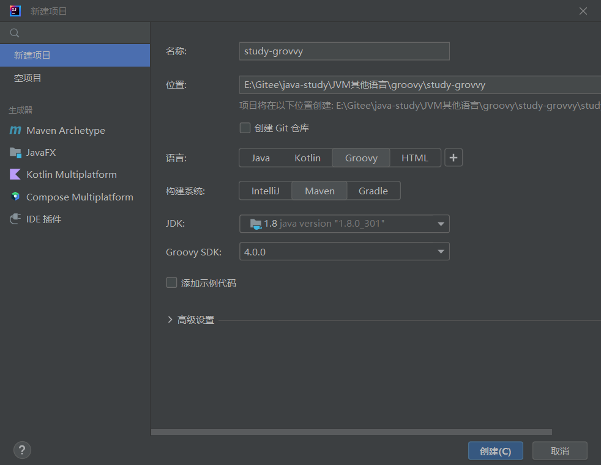
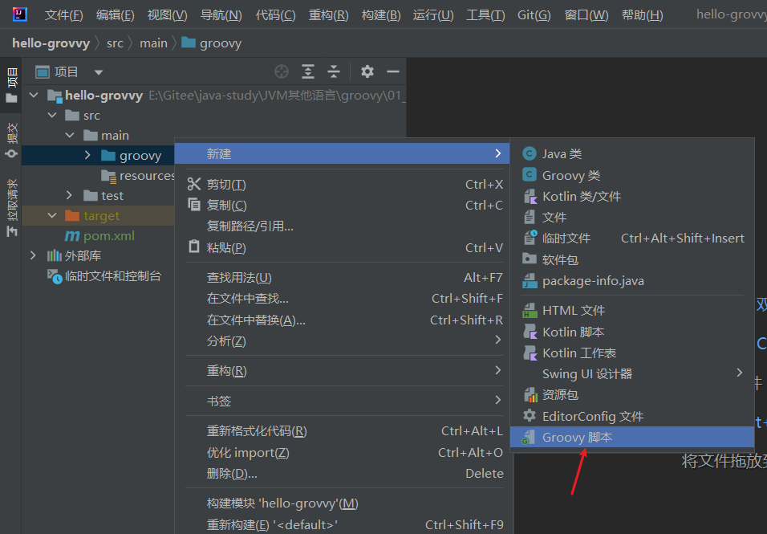

# 

# 语言特点

Groovy是一种基于Java平台的面向对象语言。 于2007年1月2日发布1.0版本，最新版是5.x，协议是Apache License 2.0，在gradle中被主要使用。Groovy具有如下特点：

- 同时支持静态和动态类型。
- 支持运算符重载。
- 本地语法列表和关联数组。
- 对正则表达式的本地支持。
- 各种标记语言，如XML和HTML原生支持。
- Groovy对于Java开发人员来说很简单，因为Java和Groovy的语法非常相似。
- 可以使用现成的Java库。
- Groovy扩展了java.lang.Object。

# 安装

方式一：

官网：https://groovy.apache.org/ 下载安装即可

当前稳定版本：4.x，当前最新版：5.x


方式二：

IDEA自带groovy环境，直接新建一个groovy项目即可：



默认会在pom.xml中添加如下依赖：

```xml
<dependency>
    <groupId>org.apache.groovy</groupId>
    <artifactId>groovy-all</artifactId>
    <version>4.0.0</version>
    <type>pom</type>
</dependency>
```

以及如下maven插件

```xml
<plugin>
    <groupId>org.codehaus.gmavenplus</groupId>
    <artifactId>gmavenplus-plugin</artifactId>
    <version>1.13.1</version>
    <executions>
        <execution>
            <goals>
                <goal>execute</goal>
            </goals>
        </execution>
    </executions>
    <dependencies>
        <dependency>
            <groupId>org.apache.groovy</groupId>
            <artifactId>groovy</artifactId>
            <version>4.0.0</version>
            <scope>runtime</scope>
        </dependency>
    </dependencies>
    <configuration>
        <scripts>
            <script>src/main/groovy/Main.groovy</script>
        </scripts>
    </configuration>
</plugin>
```


# groovy与Java区别

groovy默认导入如下的包，不需要再import了：

- java.io。
- java.lang.*
- java.math.BigDecimal
- java.math.BigInteger
- java.net.
- java.util.*
- groovy.lang.*
- groovy.util.*

# Hello world

新建groovy脚本：Hello



```groovy
println "Hello World"

```

运行输出：Hello World

groovy中函数调用的写法很灵活，打印Hello World以下写法都可以：

```groovy
println "Hello World"
println("Hello World")
```


