# 简介

**Swing，AWT**，SWT、JavaFX

AWT是Java gui的第一代，最原始的

Swing用的比较多

SWT:eclipse使用的界面库

JavaFX：自JDK8开始引入的

# AWT

## 介绍

AWT是爸爸

Abstract Windows Tool 抽象的窗口工具

窗口、按钮、文本框

java.awt包

组件Component

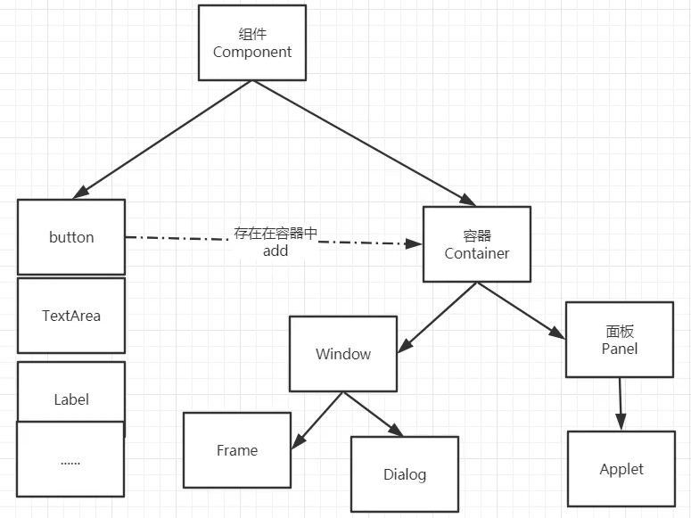

## 组件和容器

### Frame窗口

```java
import java.awt.*;

//GUI的第一个界面
public class TestFrame {
    public static void main(String[] args) {
        Frame frame = new Frame("我的第一个Java图形界面窗口");
        //设置可见性
        frame.setVisible(true);
        //设置窗口大小
        frame.setSize(400,400);
        //设置背景颜色
        Color color = new Color(60, 63, 65);//IDEA的颜色
        frame.setBackground(color);
        //弹出的初始位置
        frame.setLocation(200,200);//0，0坐标原点在左上角,x轴向下，y轴向右

        //设置大小固定
        frame.setResizable(false);//默认是true，可以改变大小的
    }
}

```

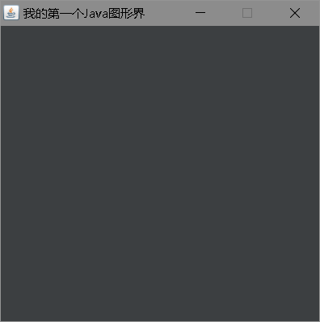

问题：窗口关闭不掉，只能停止Java程序运行

运行多个窗口

```java
package com.potato.lesson01;

import java.awt.*;

//GUI的第一个界面
public class TestFrame2 {
    public static void main(String[] args) {
        //展示多个窗口
        MyFrame myFrame = new MyFrame(100, 100, 200, 200, Color.blue);
        MyFrame myFrame2 = new MyFrame(300, 100, 200, 200, Color.yellow);
        MyFrame myFrame3 = new MyFrame(100, 300, 200, 200, Color.red);
        MyFrame myFrame4 = new MyFrame(300, 300, 200, 200, Color.magenta);
    }
}
class MyFrame extends Frame{
    static int id =0;//可能存在多个窗口，需要一个计数器
    public MyFrame(int x,int y,int w,int h,Color color){
        super("MyFrame"+(++id));
        setBackground(color);
        setBounds(x,y,w,h);//设置初始坐标位置和窗口宽高
        setVisible(true);
    }
}

```


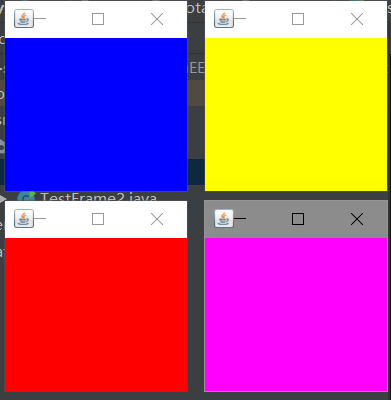

### 面板Panel

解决了关闭事件

```java
package com.potato.lesson01;

import java.awt.*;
import java.awt.event.WindowAdapter;
import java.awt.event.WindowEvent;

//面板 可以看成是一个空间，不能单独存在
public class TestPanel {
    public static void main(String[] args) {
        Frame frame = new Frame();
        //布局的概念
        Panel panel = new Panel();

        //设置布局
        frame.setLayout(null);
        frame.setBounds(300,300,500,500);
        frame.setBackground(new Color(0x1E951D));

        //panel坐标 相对frame
        panel.setBounds(50,50,400,400);
        panel.setBackground(new Color(0xA8192F));
        frame.add(panel);
        frame.setVisible(true);

        //监听事件，监听窗口关闭事件，System.exit(0)
        //适配器模式
        frame.addWindowListener(new WindowAdapter() {
            //窗口点击关闭的时候需要做的事情
            @Override
            public void windowClosing(WindowEvent e) {
                //结束程序
                System.exit(0);//0是正常退出
            }
        });
    }
}

```


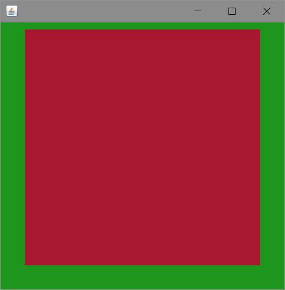

### 布局管理器

- 流式布局

  ```java
  package com.potato.lesson01;
  
  import java.awt.*;
  
  public class TestFlowLayout {
      public static void main(String[] args) {
          Frame frame = new Frame();
          //组件-按钮
          Button button = new Button("button1");
          Button button2 = new Button("button2");
          Button button3 = new Button("button3");
          //设置流式布局
          //frame.setLayout(new FlowLayout());//默认是中间
          frame.setLayout(new FlowLayout(FlowLayout.LEFT));//靠左
          frame.setSize(200,200);
          frame.add(button);
          frame.add(button2);
          frame.add(button3);
          frame.setVisible(true);
      }
  }
  
  ```

  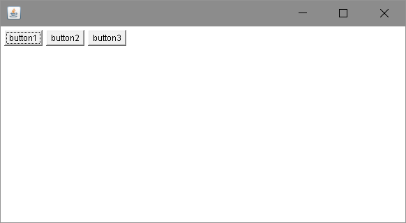

- 东西南北中

  ```java
  package com.potato.lesson01;
  
  import java.awt.*;
  
  public class TestBorderLayout {
      public static void main(String[] args) {
          Frame frame = new Frame("TestBorderLayout");
          Button east = new Button("East");
          Button west = new Button("West");
          Button south = new Button("South");
          Button north = new Button("North");
          Button center = new Button("Center");
  
          frame.add(east,BorderLayout.EAST);
          frame.add(west,BorderLayout.WEST);
          frame.add(south,BorderLayout.SOUTH);
          frame.add(north,BorderLayout.NORTH);
          frame.add(center,BorderLayout.CENTER);
          frame.setSize(200,200);
          frame.setVisible(true);
      }
  }
  
  ```

  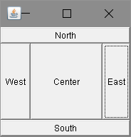

- 表格布局Grid

  ```java
  package com.potato.lesson01;
  
  import javax.swing.*;
  import java.awt.*;
  
  public class TestGridLayout {
      public static void main(String[] args) {
          Frame frame = new Frame("TestBorderLayout");
          Button btn1 = new Button("btn1");
          Button btn2 = new Button("btn2");
          Button btn3 = new Button("btn3");
          Button btn4 = new Button("btn4");
          Button btn5 = new Button("btn5");
          Button btn6 = new Button("btn6");
          frame.setLayout(new GridLayout(3,2));
          frame.add(btn1);
          frame.add(btn2);
          frame.add(btn3);
          frame.add(btn4);
          frame.add(btn5);
          frame.add(btn6);
          frame.pack();//自动布局
          frame.setVisible(true);
  
      }
  }
  
  ```

  

  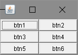

#### 练习

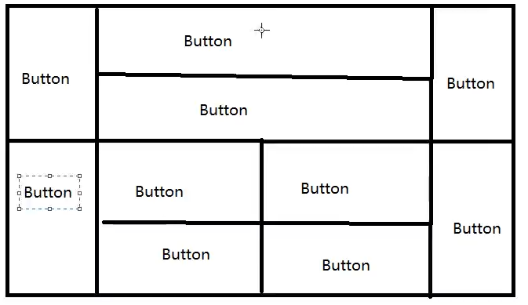

```java
package com.potato.lesson01;

import java.awt.*;

public class ExDemo {
    public static void main(String[] args) {
        //总Frame
        Frame frame = new Frame();
        frame.setLayout(new GridLayout(2, 1));
        frame.setVisible(true);
        frame.setSize(400, 300);
        frame.setLocation(300, 300);
        frame.setBackground(Color.BLACK);
        //4个面板
        Panel p1 = new Panel(new BorderLayout());
        Panel p2 = new Panel(new GridLayout(2, 1));
        Panel p3 = new Panel(new BorderLayout());
        Panel p4 = new Panel(new GridLayout(2, 2));
        //上面
        p1.add(new Button("east-1"), BorderLayout.EAST);
        p1.add(new Button("west-1"), BorderLayout.WEST);
        p2.add(new Button("p2-1"));
        p2.add(new Button("p2-2"));
        p1.add(p2, BorderLayout.CENTER);

        //下面
        p3.add(new Button("east-2"), BorderLayout.EAST);
        p3.add(new Button("west-2"), BorderLayout.WEST);
        //中间4个
        for (int i = 0; i < 4; i++) {
            p4.add(new Button("for-" + i));
        }
        p3.add(p4, BorderLayout.CENTER);
        frame.add(p1);
        frame.add(p3);


    }
}
```


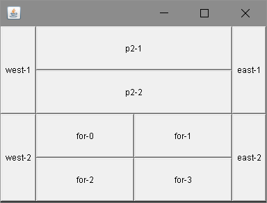

总结：

1. Frame是一个顶级窗口
2. Panel无法单独显示，必须添加到某个容器中
3. 布局管理器  流式  东西南北中 表格

### 事件监听

当某个事情发生时，干什么事情

鼠标监听，键盘监听等

多个按钮共享一个事件

```java
package com.potato.lesson02;

import java.awt.*;
import java.awt.event.ActionEvent;
import java.awt.event.ActionListener;

public class TestAction2 {
    public static void main(String[] args) {
        //两个按钮实现同一个监听
        //开始  停止
        Frame frame = new Frame("开始 停止");
        Button button = new Button("start");
        Button button2 = new Button("stop");

        //可以显示的定义触发会返回的命令，如果不显示定义则会走默认的值
        //可以多个按钮只写一个监听类
        button2.setActionCommand("button-stop");
        MyMonitor myMonitor = new MyMonitor();
        button.addActionListener(myMonitor);
        button2.addActionListener(myMonitor);

        frame.add(button,BorderLayout.NORTH);
        frame.add(button2,BorderLayout.SOUTH);

        frame.pack();
        frame.setVisible(true);
    }
}
class MyMonitor implements ActionListener{

    @Override
    public void actionPerformed(ActionEvent e) {
        //e.getActionCommand()获取按钮的信息
        System.out.println("按钮被点击了：msg="+e.getActionCommand());

    }
}
```


```
按钮被点击了：msg=start
按钮被点击了：msg=button-stop
```

### 输入框TextField事件监听

```java
package com.potato.lesson02;

import java.awt.*;
import java.awt.event.ActionEvent;
import java.awt.event.ActionListener;

public class TestText01 {
    public static void main(String[] args) {
        //启动
        new MyFrame();
    }
}
class MyFrame extends Frame{
    public MyFrame(){
        TextField textField = new TextField();
        add(textField);

        //监听这个文本框输入的文字
        MyActionListener2 myActionListener2 = new MyActionListener2();
        //按下回车就会触发这个输入框的事件
        textField.addActionListener(myActionListener2);
        //设置替换编码
        textField.setEchoChar('*');//输入密码时的星星
        setVisible(true);
        pack();

    }
}

class MyActionListener2 implements ActionListener {

    @Override
    public void actionPerformed(ActionEvent e) {
        TextField field = (TextField) e.getSource();//获得一些资源，返回的一个对象
        System.out.println(field.getText());//获得输入框的文本
        field.setText("");
    }
}

```

### 简易计算器，组合+内部类复习

```java
package com.potato.lesson02;

import java.awt.*;
import java.awt.event.ActionEvent;
import java.awt.event.ActionListener;

public class TestCalc {
    public static void main(String[] args) {
        new Calculator();
    }
}
//计算器类
class Calculator extends Frame{
    public Calculator(){
        //3个文本框
        TextField num1 = new TextField(10);//字符数
        TextField num2 = new TextField(10);//字符数
        TextField num3 = new TextField(20);//字符数

        //1个按钮
        Button button = new Button("=");
        button.addActionListener(new MyCalculatorListener(num1,num2,num3));

        //1个标签
        Label label = new Label("+");
        //布局
        setLayout(new FlowLayout());
        add(num1);
        add(label);
        add(num2);
        add(button);
        add(num3);
        pack();
        setVisible(true);
    }
}
//监听器类
class MyCalculatorListener implements ActionListener{
    //获取3个变量
    private TextField num1,num2,num3;
    MyCalculatorListener(TextField num1,TextField num2,TextField num3){
        this.num1=num1;
        this.num2=num2;
        this.num3=num3;
    }

    @Override
    public void actionPerformed(ActionEvent e) {
        //获得加和被加数
        int n1 = Integer.parseInt(num1.getText());
        int n2 = Integer.parseInt(num2.getText());

        //运算后，放到第三个框
        num3.setText(""+(n1+n2));

        //清楚前两个框
        num1.setText("");
        num2.setText("");
    }
}
```


优化：组合

```java
package com.potato.lesson02;

import java.awt.*;
import java.awt.event.ActionEvent;
import java.awt.event.ActionListener;

public class TestCalc {
    public static void main(String[] args) {
        new Calculator().loadFrame();
    }
}
//计算器类
class Calculator extends Frame{
    TextField num1,num2,num3;
    public void loadFrame(){
        //3个文本框
        num1 = new TextField(10);//字符数
        num2 = new TextField(10);//字符数
        num3 = new TextField(20);//字符数
        //1个按钮
        Button button = new Button("=");
        button.addActionListener(new MyCalculatorListener(this));
        //1个标签
        Label label = new Label("+");

        //布局
        setLayout(new FlowLayout());
        add(num1);
        add(label);
        add(num2);
        add(button);
        add(num3);
        pack();
        setVisible(true);
    }
}
//监听器类
class MyCalculatorListener implements ActionListener{
    //获取计算器这个对象,在一个类中组合另外一个类
    Calculator calculator = null;
    MyCalculatorListener(Calculator calculator){
        this.calculator =calculator;
    }

    @Override
    public void actionPerformed(ActionEvent e) {
        //获得加和被加数
        //运算后，放到第三个框
        //清楚前两个框
        int n1 = Integer.parseInt(calculator.num1.getText());
        int n2 = Integer.parseInt(calculator.num2.getText());
        calculator.num3.setText(""+(n1+n2));
        calculator.num1.setText("");
        calculator.num2.setText("");

    }
}
```

再优化：内部类  更好的包装

```java
package com.potato.lesson02;

import java.awt.*;
import java.awt.event.ActionEvent;
import java.awt.event.ActionListener;

public class TestCalc {
    public static void main(String[] args) {
        new Calculator().loadFrame();
    }
}
//计算器类
class Calculator extends Frame{

    TextField num1,num2,num3;
    
    public void loadFrame(){
        //3个文本框
        num1 = new TextField(10);//字符数
        num2 = new TextField(10);//字符数
        num3 = new TextField(20);//字符数
        //1个按钮
        Button button = new Button("=");
        button.addActionListener(new MyCalculatorListener());
        //1个标签
        Label label = new Label("+");

        //布局
        setLayout(new FlowLayout());
        add(num1);
        add(label);
        add(num2);
        add(button);
        add(num3);
        pack();
        setVisible(true);
    }
    //监听器类
    //内部类最大好处，就是畅通无阻访问外部类
    private class MyCalculatorListener implements ActionListener{
        @Override
        public void actionPerformed(ActionEvent e) {
            //获得加和被加数
            //运算后，放到第三个框
            //清楚前两个框
            int n1 = Integer.parseInt(num1.getText());
            int n2 = Integer.parseInt(num2.getText());
            num3.setText(""+(n1+n2));
            num1.setText("");
            num2.setText("");

        }
    }
}

```

### 画笔

```java
package com.potato.lesson03;

import java.awt.*;

public class TestPaint {
    public static void main(String[] args) {
        new MyPaint().loadFrame();
    }
}
class MyPaint extends Frame{
    public void loadFrame(){
        setVisible(true);
        setBounds(200,200,600,400);
    }
    //画笔
    @Override
    public void paint(Graphics g){
        //画笔，需要有颜色，画笔可以画画，
        g.setColor(Color.red);
        //g.drawOval(100,100,100,100);
        g.fillOval(100,100,100,100);//实心的圆
        g.setColor(Color.green);
        g.fillRect(150,200,200,200);
        //养成习惯，画笔用完，将它还原到最初的颜色，默认黑色
    }
}

```

### 鼠标监听

目的，想要实现鼠标画画

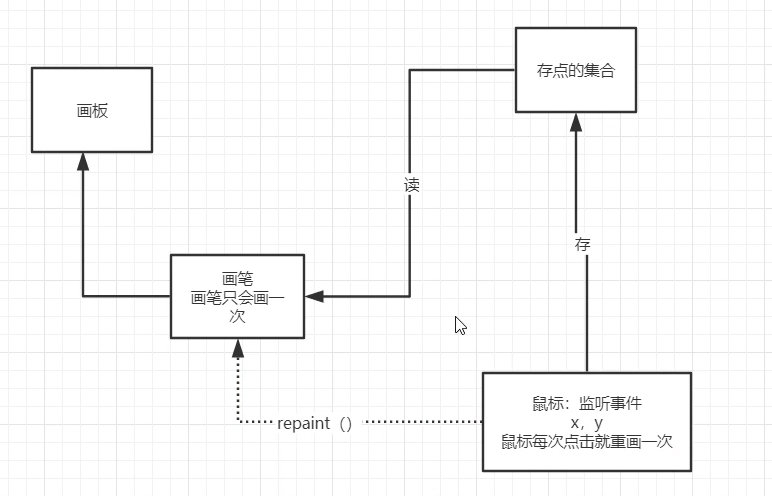

```java
package com.potato.lesson03;

import java.awt.*;
import java.awt.event.MouseAdapter;
import java.awt.event.MouseEvent;
import java.awt.event.MouseListener;
import java.util.ArrayList;
import java.util.Iterator;

//测试鼠标监听事件
public class TestMouseListener {
    public static void main(String[] args) {
        new MyFrame("画图");
    }
}
class MyFrame extends Frame{
    ArrayList points;
    //画笔，需要监听鼠标当前的位置，需要集合来存储这个点

    public MyFrame(String title){
        super(title);
        setBounds(200,200,400,300);
        //存鼠标点击的点
        points=  new ArrayList<>();
        setVisible(true);

        //鼠标监听器，针对这个窗口
        this.addMouseListener(new MyMouseListener());

    }

    @Override
    public void paint(Graphics g){
        //画画，监听鼠标的事件
        Iterator iterator = points.iterator();
        while (iterator.hasNext()){
            Point point = (Point) iterator.next();
            g.setColor(Color.BLUE);
            g.fillOval(point.x,point.y,10, 10);
        }
    }

    //添加一个点到界面上面
    public void addPaint(Point point){
        points.add(point);

    }

    //适配器模式，就不用实现原来那个接口中的每一个方法了
    private class MyMouseListener extends MouseAdapter{
        //鼠标按压，弹起，按住不放

        @Override
        public void mousePressed(MouseEvent e) {
            MyFrame myFrame= (MyFrame) e.getSource();
            //这里点击的时候，就会在界面上产生一个点
            //这个点就是鼠标的点
            myFrame.addPaint(new Point(e.getX(),e.getY()));
            //每次点击都要重新画一遍
            myFrame.repaint();//刷新
        }
    }
}

```


### 窗口监听

```java
package com.potato.lesson03;

import java.awt.*;
import java.awt.event.WindowAdapter;
import java.awt.event.WindowEvent;

public class TestWindow {
    public static void main(String[] args) {
        new WindowFrame();
    }
}
class WindowFrame extends Frame{
    public WindowFrame(){
        setVisible(true);
        setBackground(Color.BLUE);
        setBounds(100,100,200,200);
        this.addWindowListener(
                //匿名内部类
                new WindowAdapter() {
                    @Override
                    public void windowOpened(WindowEvent e) {
                        System.out.println("打开窗口");//获取不到
                    }

                    @Override
                    public void windowClosing(WindowEvent e) {
                        System.out.println("关闭窗口");
                        System.exit(0);
                    }

                    @Override
                    public void windowClosed(WindowEvent e) {
                        System.out.println("已经关闭窗口");//获取不到
                    }

                    @Override
                    public void windowActivated(WindowEvent e) {
                        WindowFrame source = (WindowFrame) e.getSource();
                        source.setTitle("被激活了");
                        System.out.println("窗口被激活");
                    }
                }
        );
    }
}

```


### 键盘监听

```java
package com.potato.lesson03;

import java.awt.*;
import java.awt.event.KeyAdapter;
import java.awt.event.KeyEvent;

public class TestKeyListener {
    public static void main(String[] args) {
        new KeyFrame();
    }
}
class KeyFrame extends Frame{
    public KeyFrame(){
        setBounds(1,2,300,400);
        setVisible(true);
        this.addKeyListener(new KeyAdapter() {
            //键盘按下
            @Override
            public void keyPressed(KeyEvent e) {
                //键盘按下的键是哪个,获取当前键盘的码
                int keyCode = e.getKeyCode();//不需要去记忆这个值，直接使用静态属性就行了 VK_XXX
                System.out.println(keyCode);
                if(keyCode==KeyEvent.VK_UP) {
                    System.out.println("你按下了上键");

                }
                //根据按下不同的操作，产生不同的结果
            }
        });
    }
}

```

# Swing

## 窗口、面板

标签居中

```java
package com.potato.lesson04;

import javax.swing.*;
import java.awt.*;

public class JFrameDemo2 {
    public static void main(String[] args) {
        new MyJframe2().init();
    }
}
class MyJframe2 extends  JFrame{
    public void init(){
        this.setVisible(true);
        this.setBounds(10,10,200,300);
        JLabel label = new JLabel("欢迎");
        this.add(label);
        label.setHorizontalAlignment(SwingConstants.CENTER);//设置水平对齐
        //获得一个容器
        Container container = this.getContentPane();
        container.setBackground(Color.BLUE);
    }
}
```

## 弹窗

JDialog 默认就有关闭事件

```java
package com.potato.lesson04;

import javax.swing.*;
import java.awt.*;
import java.awt.event.ActionEvent;
import java.awt.event.ActionListener;

//主窗口
public class DialogDemo extends JFrame {
    public DialogDemo(){
        this.setVisible(true);
        this.setSize(700,500);
        this.setDefaultCloseOperation(WindowConstants.EXIT_ON_CLOSE);

        //JFrame 放东西，容器
        Container container = this.getContentPane();
        //绝对布局
        container.setLayout(null);
        //按钮
        JButton button = new JButton("点击弹出一个对话框");//
        button.setBounds(30,30,200,50);
        //点击这个按钮的时候，弹窗
        button.addActionListener(new ActionListener() {//监听器
            @Override
            public void actionPerformed(ActionEvent e) {
                //弹窗
                new MyDialogDemo();
            }
        });
        container.add(button);


    }
    public static void main(String[] args) {
        new DialogDemo();
    }

}
//弹窗的窗口
class MyDialogDemo extends JDialog{
    MyDialogDemo(){
        this.setVisible(true);
        this.setBounds(100,100,500,500);
        Container container = this.getContentPane();
        container.setLayout(null);
        container.add(new Label("学Java"));
    }
}
```

## 标签

label

```java
new JLabel("xxx");
```

图标

```java
package com.potato.lesson04;

import javax.swing.*;
import java.awt.*;
import java.net.URL;

public class ImageIconDemo extends JFrame {
    ImageIconDemo(){
        //获取图片的地址
        URL url = ImageIconDemo.class.getResource("dog.png");
        JLabel label = new JLabel("ImageIcon");

        ImageIcon imageIcon = new ImageIcon(url);
        label.setIcon(imageIcon);
        label.setHorizontalAlignment(SwingConstants.CENTER);
        Container container = getContentPane();
        container.add(label);
        setVisible(true);
        setBounds(100,100,400,400);
        setDefaultCloseOperation(WindowConstants.EXIT_ON_CLOSE);
    }

    public static void main(String[] args) {
        new ImageIconDemo();
    }
}

```


## 面板

panel

```java
package com.potato.lesson05;

import javax.swing.*;
import java.awt.*;

public class JPanelDemo extends JFrame {
    JPanelDemo(){
        Container container = this.getContentPane();
        container.setLayout(new GridLayout(2,1,10,10));//后面2个参数的意思，间距
        JPanel panel = new JPanel(new GridLayout(1,3));//1行3列
        panel.add(new JButton("1"));
        panel.add(new JButton("1"));
        panel.add(new JButton("1"));

        container.add(panel);
        this.setVisible(true);
        this.setSize(500,500);
        this.setDefaultCloseOperation(WindowConstants.EXIT_ON_CLOSE);
    }

    public static void main(String[] args) {
        new JPanelDemo();
    }

}

```

JScroll

```java
package com.potato.lesson05;

import javax.swing.*;
import java.awt.*;

public class JScrollDemo extends JFrame {
    JScrollDemo(){
        Container container = this.getContentPane();
        //文本域
        JTextArea textArea = new JTextArea(20, 50);//行和列
        textArea.setText("欢迎学习");
        //Scroll面板
        JScrollPane scrollPane = new JScrollPane(textArea);
        container.add(scrollPane);

        this.setVisible(true);
        this.setBounds(100,100,300,350);
        this.setDefaultCloseOperation(WindowConstants.EXIT_ON_CLOSE);
    }

    public static void main(String[] args) {
        new JScrollDemo();
    }
}

```


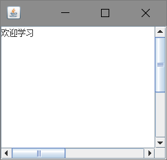

## 按钮

图片按钮

```java
package com.potato.lesson05;

import javax.swing.*;
import java.awt.*;
import java.net.URL;

public class JButtonDemo01 extends JFrame {
    JButtonDemo01(){
        Container container = this.getContentPane();
        //将一个图片变为图标
        URL resource = JButtonDemo01.class.getResource("dog.png");
        Icon icon = new ImageIcon(resource);
        //图标放在按钮上
        JButton button = new JButton();
        button.setIcon(icon);
        button.setToolTipText("图片按钮");

        //
        container.add(button);
        setVisible(true);
        setBounds(0,0,500,300);
        setDefaultCloseOperation(WindowConstants.EXIT_ON_CLOSE);
    }
    public static void main(String[] args) {
        new JButtonDemo01();
    }
}

```


- 单选按钮

  ```java
  package com.potato.lesson05;
  
  import javax.swing.*;
  import java.awt.*;
  import java.net.URL;
  
  public class JButtonDemo02 extends JFrame {
      JButtonDemo02(){
          Container container = this.getContentPane();
          //将一个图片变为图标
          URL resource = JButtonDemo02.class.getResource("dog.png");
          Icon icon = new ImageIcon(resource);
  
          //单选框
          JRadioButton jRadioButton1 = new JRadioButton("JRadioButton1");
          JRadioButton jRadioButton2 = new JRadioButton("JRadioButton2");
          JRadioButton jRadioButton3 = new JRadioButton("JRadioButton3");
  
          //由于单选框只能选择一个，分组，一个组中只能选一个
          //没有分组，就能多选
          ButtonGroup group = new ButtonGroup();
          group.add(jRadioButton1);
          group.add(jRadioButton2);
          group.add(jRadioButton3);
  
          container.add(jRadioButton1,BorderLayout.CENTER);
          container.add(jRadioButton2,BorderLayout.NORTH);
          container.add(jRadioButton3,BorderLayout.SOUTH);
  
          //
          setVisible(true);
          setBounds(0,0,500,300);
          setDefaultCloseOperation(WindowConstants.EXIT_ON_CLOSE);
      }
      public static void main(String[] args) {
          new JButtonDemo02();
      }
  }
  
  ```

  

- 复选按钮

  ```java
  package com.potato.lesson05;
  
  import javax.swing.*;
  import java.awt.*;
  import java.net.URL;
  
  public class JButtonDemo03 extends JFrame {
      JButtonDemo03(){
          Container container = this.getContentPane();
          //将一个图片变为图标
          URL resource = JButtonDemo03.class.getResource("dog.png");
          Icon icon = new ImageIcon(resource);
  
          //多选框
          JCheckBox checkBox1 = new JCheckBox("checkBox1");
          JCheckBox checkBox2 = new JCheckBox("checkBox1");
  
          container.add(checkBox1,BorderLayout.NORTH);
          container.add(checkBox2,BorderLayout.SOUTH);
  
          //
          setVisible(true);
          setBounds(0,0,500,300);
          setDefaultCloseOperation(WindowConstants.EXIT_ON_CLOSE);
      }
      public static void main(String[] args) {
          new JButtonDemo03();
      }
  }
  
  ```

  

## 列表

- 下拉框

  ```java
  package com.potato.lesson06;
  
  import javax.swing.*;
  import java.awt.*;
  
  public class TestComboboxDemo01 extends JFrame {
      TestComboboxDemo01(){
          Container container = this.getContentPane();
  
          JComboBox status = new JComboBox();
          status.addItem(null);
          status.addItem("正在上映");
          status.addItem("已下架");
          status.addItem("即将上映");
  
          container.add(status);
  
          this.setVisible(true);
          this.setSize(500,350);
          setDefaultCloseOperation(WindowConstants.EXIT_ON_CLOSE);
      }
      public static void main(String[] args) {
         new TestComboboxDemo01();
      }
  }
  
  ```

  

- 列表框

  ```java
  package com.potato.lesson06;
  
  import javax.swing.*;
  import java.awt.*;
  
  public class TestComboboxDemo02 extends JFrame {
      TestComboboxDemo02(){
          Container container = this.getContentPane();
  
          //生成列表的内容
          String[] contents={"1","2","3"};
          //列表中需要放入内容
          JList jList = new JList(contents);
          container.add(jList);
  
  
          this.setVisible(true);
          this.setSize(500,350);
          setDefaultCloseOperation(WindowConstants.EXIT_ON_CLOSE);
      }
      public static void main(String[] args) {
         new TestComboboxDemo02();
      }
  }
  
  ```

  

## 文本框

- 文本框

  ```java
  package com.potato.lesson06;
  
  import javax.swing.*;
  import java.awt.*;
  
  public class TestTextDemo01 extends JFrame {
      TestTextDemo01(){
          Container container = this.getContentPane();
          container.setLayout(null);
  
          JTextField textField = new JTextField("hello");
          JTextField textField2 = new JTextField("world",20);
          container.add(textField,BorderLayout.NORTH);
          container.add(textField2,BorderLayout.SOUTH);
  
          this.setVisible(true);
          this.setSize(500,350);
          setDefaultCloseOperation(WindowConstants.EXIT_ON_CLOSE);
      }
      public static void main(String[] args) {
         new TestTextDemo01();
      }
  }
  
  ```

  

- 密码框

  ```java
  package com.potato.lesson06;
  
  import javax.swing.*;
  import java.awt.*;
  
  public class TestTextDemo02 extends JFrame {
      TestTextDemo02(){
          Container container = this.getContentPane();
          container.setLayout(null);
  
          JPasswordField passwordField = new JPasswordField();
          passwordField.setEchoChar('*');
          
          container.add(passwordField);
  
          this.setVisible(true);
          this.setSize(500,350);
          setDefaultCloseOperation(WindowConstants.EXIT_ON_CLOSE);
      }
      public static void main(String[] args) {
         new TestTextDemo02();
      }
  }
  
  ```

  

- 文本域

```java
package com.potato.lesson05;

import javax.swing.*;
import java.awt.*;

public class JScrollDemo extends JFrame {
    JScrollDemo(){
        Container container = this.getContentPane();
        //文本域
        JTextArea textArea = new JTextArea(20, 50);//行和列
        textArea.setText("欢迎学习");
        //Scroll面板
        JScrollPane scrollPane = new JScrollPane(textArea);
        container.add(scrollPane);

        this.setVisible(true);
        this.setBounds(100,100,300,350);
        this.setDefaultCloseOperation(WindowConstants.EXIT_ON_CLOSE);
    }

    public static void main(String[] args) {
        new JScrollDemo();
    }
}

```

## 贪吃蛇

帧，时间片足够小就是动画，1秒30帧 60帧等

键盘监听 

定时器

### 界面

```java
package com.potato.snake;

import javax.swing.*;

/**
 * 主启动类
 */
public class StartGame {
    public static void main(String[] args) {
        JFrame jFrame = new JFrame();

        jFrame.setBounds(10, 10, 900, 720);
        jFrame.setResizable(false);
        jFrame.setDefaultCloseOperation(WindowConstants.EXIT_ON_CLOSE);

        //游戏界面都应该在游戏面板上
        GamePanel gamePanel = new GamePanel();
        jFrame.add(gamePanel);

        jFrame.setVisible(true);
    }
}

```


### 数据

```java
package com.potato.snake;

import javax.swing.*;
import java.net.URL;

//数据
public class Data {
    //绝对路径：/  相当于当前项目
    //相对路径； head.png
    public static URL headURL = Data.class.getResource("static/header.png");//游戏顶部图片
    public static ImageIcon header = new ImageIcon(headURL);

    public static URL upURL = Data.class.getResource("static/up.png");//四个方向的头
    public static URL downURL = Data.class.getResource("static/down.png");
    public static URL leftURL = Data.class.getResource("static/left.png");
    public static URL rightURL = Data.class.getResource("static/right.png");
    public static ImageIcon up = new ImageIcon(upURL);
    public static ImageIcon down = new ImageIcon(downURL);
    public static ImageIcon left = new ImageIcon(leftURL);
    public static ImageIcon right = new ImageIcon(rightURL);


    public static URL bodyURL = Data.class.getResource("static/body.png");//身体
    public static ImageIcon body = new ImageIcon(bodyURL);
    public static URL foodUrl = Data.class.getResource("static/food.png");//事物
    public static ImageIcon food = new ImageIcon(foodUrl);


}

```

### 逻辑

```java
package com.potato.snake;

import javax.swing.*;
import java.awt.*;
import java.awt.event.ActionEvent;
import java.awt.event.ActionListener;
import java.awt.event.KeyEvent;
import java.awt.event.KeyListener;
import java.util.Random;

//游戏的面板
public class GamePanel extends JPanel implements KeyListener , ActionListener {
    //定义蛇的数据结构
    int length;//蛇的长度,最长是816屏幕就放不下了
    int[] snakeX = new int[600];//蛇的x坐标  25*25
    int[] snakeY = new int[500];//蛇的y坐标  25*25
    String fx;

    //食物坐标
    int foodx;
    int foody;
    Random random = new Random();
    int score;//分数

    //游戏当前的状态  开始 停止
    boolean isStart = false;//默认不开始
    boolean isFail = false;//游戏失败状态

    Timer timer = new Timer(100, this); //100毫秒执行一次

    public GamePanel(){
        init();
        //获得焦点和键盘事件
        this.setFocusable(true);//获得焦点事件
        this.addKeyListener(this);//键盘监听事件
        timer.start();//一开始定时器启动
    }

    //初始化方法
    public void init(){
        length = 3;
        snakeX[0] = 100;snakeY[0] = 100;//脑袋的坐标
        snakeX[1] = 75;snakeY[1] = 100;//第一个身体的坐标
        snakeX[2] = 50;snakeY[2] = 100;//第二个身体的坐标
        fx = "R";//初始方向向右

        //把食物随机放在界面上
        foodx = 25+25*random.nextInt(34);
        foody = 75+25*random.nextInt(24);
        score=0;
    }

    //绘制面板,游戏中的所有东西都用这个画笔来画
    @Override
    protected void paintComponent(Graphics g){
        super.paintComponent(g);//清屏
        //绘制静态的面板
        this.setBackground(Color.WHITE);
        Data.header.paintIcon(this,g,25,11);//头部广告栏画上去
        g.fillRect(25,75,850, 600);//默认的游戏界面

        //画积分
        g.setColor(Color.white);
        g.setFont(new Font("微软雅黑",Font.BOLD,18));//设置字体
        g.drawString("长度:"+length,750,35);
        g.drawString("分数:"+score,750,50);
        //画食物
        Data.food.paintIcon(this,g,foodx,foody);

        //把小蛇画上去
        switch (fx) {
            case "R":
                Data.right.paintIcon(this, g, snakeX[0], snakeY[0]);//蛇头初始化向右，需要通过方向来判断

                break;
            case "L":
                Data.left.paintIcon(this, g, snakeX[0], snakeY[0]);//蛇头初始化向右，需要通过方向来判断

                break;
            case "U":
                Data.up.paintIcon(this, g, snakeX[0], snakeY[0]);//蛇头初始化向右，需要通过方向来判断

                break;
            case "D":
                Data.down.paintIcon(this, g, snakeX[0], snakeY[0]);//蛇头初始化向右，需要通过方向来判断

                break;
        }
        for (int i = 1; i < length; i++) {
            Data.body.paintIcon(this,g,snakeX[i],snakeY[i]);
        }


        //游戏状态
        if(!isStart){
            g.setColor(Color.white);
            g.setFont(new Font("微软雅黑",Font.BOLD,40));//设置字体
            g.drawString("按下空格开始游戏",300,300);
        }
        if (isFail){
            g.setColor(Color.RED);
            g.setFont(new Font("微软雅黑",Font.BOLD,40));//设置字体
            g.drawString("失败，按下空格重新开始游戏",300,300);
        }
    }


    //键盘监听事件
    @Override
    public void keyPressed(KeyEvent e) {
        int keyCode = e.getKeyCode();//获得键盘按键是哪个
        if(keyCode==KeyEvent.VK_SPACE){//按下空格
           if (isFail){
               //重新开始
               isFail = false;
               init();
           }else {
               isStart = !isStart;
           }
           repaint();
        }
        //小蛇移动
        if(keyCode==KeyEvent.VK_UP ){
            fx = "U";

        }else if(keyCode==KeyEvent.VK_DOWN){
            fx = "D";
        }else if(keyCode==KeyEvent.VK_LEFT){
            fx = "L";
        }else if(keyCode==KeyEvent.VK_RIGHT){
            fx = "R";
        }
    }
    @Override
    public void keyTyped(KeyEvent e) {}
    @Override
    public void keyReleased(KeyEvent e) {}

    //事件监听
    @Override
    public void actionPerformed(ActionEvent e) {
        if(isStart && !isFail){
            //吃食物
            if(snakeX[0]==foodx&&snakeY[0]==foody){
                length++;//长度加1
                score += 10;//分数+10
                //后面自动画身体
                //再次随机食物
                foodx = 25+25*random.nextInt(34);
                foody = 75+25*random.nextInt(24);
            }
            //右移
            for (int i = length-1; i >0; i--) {//后一节移动到前一节位置
                snakeX[i] = snakeX[i-1];
                snakeY[i] = snakeY[i-1];
            }
            //走向
            if (fx.equals("R")){
                snakeX[0] +=25;
                if(snakeX[0]>850){snakeX[0]=25;}
            }else if (fx.equals("L")){
                snakeX[0] -=25;
                if(snakeX[0]<25){snakeX[0]=850;}
            } else if (fx.equals("U")){
                snakeY[0] -=25;
                if(snakeY[0]<75){snakeY[0]=650;}
            }else if (fx.equals("D")){
                snakeY[0] +=25;
                if(snakeY[0]>650){snakeY[0]=75;}
            }
            //失败判断，到自己
            for (int i = 1; i < length; i++) {
                if (snakeX[0]==snakeX[i] && snakeY[0]==snakeY[i]){
                    isFail=true;
                }
            }
            repaint();
        }
        timer.start();//定时器开始
    }
}


```


# JavaFX

## 开始学习JavaFX

官方文档

IDEA自带JavaFX插件，新建JavaFX项目

### HelloWorld

```java
import javafx.application.Application;
import javafx.event.ActionEvent;
import javafx.event.EventHandler;
import javafx.scene.Scene;
import javafx.scene.control.Button;
import javafx.scene.layout.StackPane;
import javafx.stage.Stage;
 
public class HelloWorld extends Application {
 
   @Override
   public void start(Stage primaryStage) {
       Button btn = new Button();
       btn.setText("Say 'Hello World'");
       btn.setOnAction(new EventHandler<ActionEvent>() {
           @Override
           public void handle(ActionEvent event) {
              System.out.println("Hello World!");
           }
       });
 
       StackPane root = new StackPane();
       root.getChildren().add(btn);
       Scene scene = new Scene(root, 300, 250);
 
       primaryStage.setTitle("Hello World!");
       primaryStage.setScene(scene);
       primaryStage.show();
   }
 
   public static void main(String[] args) {
       launch(args);
   }
}
```

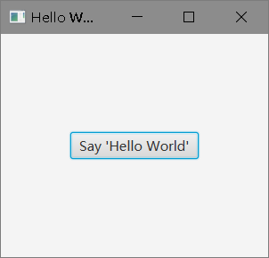


- **Application**：应用程序  ， 抽象类，子类需实现start方法

- **Stage**：窗口（舞台），  继承关系：EventTarget接口<---Window<--Stage

- **Scene**：场景 ， （实现了EventTarget接口）

- **Node**：节点，  根节点，子节点   继承关系：Node<----Parent<---Region<---Pane<--StackPane

### JavaFX Scene Builder

到Java官网下载安装

不是很好用......

### 理解JavaFX架构

在JavaFX公开的API之下JavaFX代码运行引擎。它由几大部分组成：一个JavaFX 高性能图形引擎，名为Prism；一个简洁高效的窗体系统，名为Glass；一个媒体引擎；一个web引擎。尽管这些组件并没有公开对外暴露，但是下面的描述将有助于你理解一个JavaFX应用是如何运行的。

● 场景图(Scene Graph)

● JavaFX功能的公共API(Java Public APIs for JavaFX Features)

● 图形系统(Graphics System)

● Glass窗体工具包(Glass Windowing Toolkit)

● 多媒体和图像(Media and Images)

● Web组件(Web Component)

● CSS

● UI控件(UI Controls)

● 布局(Layout)

● 2-D和3-D转换(2-D and 3-D Transformations)

● 视觉特效(Visual Effects)

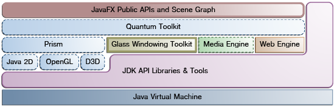

**场景图**

它是构建JavaFX应用的入口。它是一个层级结构的节点树，表示了所有用户界面的视觉元素。它可以处理输入，并且可以被渲染。

在场景图中的一个元素被称为一个节点(Node)。每个节点都有一个ID、样式类和包围盒(bounding volume)。除了根节点之外，在场景图中的所有节点都有一个父节点、0个或多个子节点。节点还可以有如下特性：

● 效果(Effects)，例如模糊和阴影

● 不透明度(Opacity)

● 变换(Transforms)

● 事件处理器(Event handlers，例如鼠标、键盘和输入法)

● 应用相关的状态(Application-specific state)

与Swing和AWT不同，JavaFX场景图还包括图元，例如矩形、文本，还有控件、布局容器、图像、多媒体。

对于大多数用户来说，场景图简化了UI设计，尤其是对富客户端应用来说。对场景图中使用动画可以很容易地通过javafx.animation API和声明式方法(例如XML文档)来实现。

javafx.scene API允许创建和定义各种内容，例如：

● 节点(Nodes)：包括各种形状(2D或3D)、图像、多媒体、内嵌的Web浏览器、文本、UI控件、图表、组和容器

● 状态(State)：变换(节点的定位和定向)、视觉效果、以及内容的其它视觉状态。

● 效果(Effects)：可以改变场景图节点的外观的简单对象。例如模糊、阴影、图像调整。

### JavaFX中表单设计

本教程介绍屏幕布局(Layout)的基本信息，指导你如何添加控件到Layout面板( Pane)中，如何创建输入事件。

```java
package lesson01;

import javafx.application.Application;
import javafx.event.ActionEvent;
import javafx.event.EventHandler;
import static javafx.geometry.HPos.RIGHT;
import javafx.geometry.Insets;
import javafx.geometry.Pos;
import javafx.scene.Scene;
import javafx.scene.control.Button;
import javafx.scene.control.Label;
import javafx.scene.control.PasswordField;
import javafx.scene.control.TextField;
import javafx.scene.layout.GridPane;
import javafx.scene.layout.HBox;
import javafx.scene.paint.Color;
import javafx.scene.text.Font;
import javafx.scene.text.FontWeight;
import javafx.scene.text.Text;
import javafx.stage.Stage;


public class Login extends Application {

    @Override
    public void start(Stage primaryStage) {
        primaryStage.setTitle("JavaFX Welcome");//窗口标题
        GridPane grid = new GridPane();//GridPane布局，GridPane-->Pan-->Region-->Parent-->Node
        grid.setAlignment(Pos.CENTER);//居中显示
        grid.setHgap(10);//gap属性是设置行列之间的间隔
        grid.setVgap(10);
        grid.setPadding(new Insets(25, 25, 25, 25));//padding设置面板边缘周围的间距，Insets指定了上下左右的间距，25像素

        Text scenetitle = new Text("Welcome");//场景标题
        scenetitle.setFont(Font.font("Tahoma", FontWeight.NORMAL, 20));
        grid.add(scenetitle, 0, 0, 2, 1);//场景标题位置,第0列第0行，跨越了2列1行

        Label userName = new Label("User Name:");//创建标签，放到第0列，第1行
        grid.add(userName, 0, 1);

        TextField userTextField = new TextField();//创建文本输入框，放到第1列，第1行
        grid.add(userTextField, 1, 1);

        Label pw = new Label("Password:");
        grid.add(pw, 0, 2);//创建标签，放到第0列，第2行

        PasswordField pwBox = new PasswordField();
        grid.add(pwBox, 1, 2);//密码输入框，第1列，第2行

        Button btn = new Button("Sign in");
        HBox hbBtn = new HBox(10);//子节点的水平间距10 HBOX-->Pane
        hbBtn.setAlignment(Pos.BOTTOM_RIGHT);//位置在右下角
        hbBtn.getChildren().add(btn);//将按钮添加到子节点
        grid.add(hbBtn, 1, 4);//按钮子节点位置在第1列第4行

        final Text actiontarget = new Text();//文本（本例中，点击按钮后显示在下面）
        grid.add(actiontarget, 0, 6);//位置，第0列第6行
        GridPane.setColumnSpan(actiontarget, 2);//文本控件占据了2列
        GridPane.setHalignment(actiontarget, RIGHT);
        actiontarget.setId("actiontarget");

        btn.setOnAction(new EventHandler<ActionEvent>() {//按钮注册事件

            @Override
            public void handle(ActionEvent e) {
                actiontarget.setFill(Color.FIREBRICK);//设置字体颜色
                actiontarget.setText("Sign in button pressed");//设置文字内容
            }
        });

        Scene scene = new Scene(grid, 300, 275);//窗口大小,不包含标题栏
        primaryStage.setScene(scene);
        primaryStage.show();
    }

    public static void main(String[] args) {
        launch(args);
    }


}
```


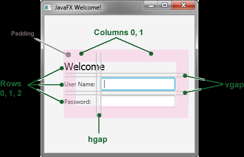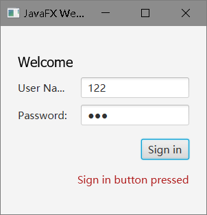

使用Scence Builder打开fxml文件查看第几列第几行

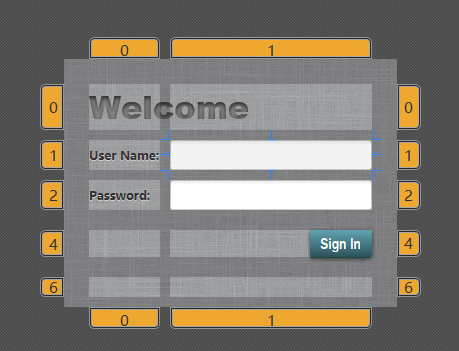

### 使用JavaFX CSS美化表单

https://docs.oracle.com/javase/8/javafx/api/javafx/scene/doc-files/cssref.html

```java
package lesson01;

import javafx.application.Application;
import javafx.event.ActionEvent;
import javafx.event.EventHandler;
import static javafx.geometry.HPos.RIGHT;
import javafx.geometry.Insets;
import javafx.geometry.Pos;
import javafx.scene.Scene;
import javafx.scene.control.Button;
import javafx.scene.control.Label;
import javafx.scene.control.PasswordField;
import javafx.scene.control.TextField;
import javafx.scene.layout.GridPane;
import javafx.scene.layout.HBox;
import javafx.scene.text.Text;
import javafx.stage.Stage;

public class LoginCSS extends Application {

    @Override
    public void start(Stage primaryStage) {
        primaryStage.setTitle("JavaFX Welcome");
        GridPane grid = new GridPane();
        grid.setAlignment(Pos.CENTER);
        grid.setHgap(10);
        grid.setVgap(10);
        grid.setPadding(new Insets(25, 25, 25, 25));

        Text scenetitle = new Text("Welcome");
        scenetitle.setId("welcome-text");
        grid.add(scenetitle, 0, 0, 2, 1);

        Label userName = new Label("User Name:");
        grid.add(userName, 0, 1);

        TextField userTextField = new TextField();
        grid.add(userTextField, 1, 1);

        Label pw = new Label("Password:");
        grid.add(pw, 0, 2);

        PasswordField pwBox = new PasswordField();
        grid.add(pwBox, 1, 2);

        Button btn = new Button("Sign in");
        HBox hbBtn = new HBox(10);
        hbBtn.setAlignment(Pos.BOTTOM_RIGHT);
        hbBtn.getChildren().add(btn);
        grid.add(hbBtn, 1, 4);

        final Text actiontarget = new Text();
        grid.add(actiontarget, 0, 6);
        grid.setColumnSpan(actiontarget, 2);
        grid.setHalignment(actiontarget, RIGHT);
        actiontarget.setId("actiontarget");

        btn.setOnAction(new EventHandler<ActionEvent>() {

            @Override
            public void handle(ActionEvent e) {
                actiontarget.setText("Sign in button pressed");
            }
        });


        Scene scene = new Scene(grid, 300, 275);
        primaryStage.setScene(scene);
        scene.getStylesheets().add(Login.class.getResource("Login.css").toExternalForm());//在/src/lesson01 目录下找css文件
        primaryStage.show();
    }
    
       public static void main(String[] args) {
        launch(args);
    }

}
```


```css

root { 
    display: block;
}

.root {/*.标签名  标签选择器*/
     -fx-background-image: url("background.jpg"); 
}

.label {
    -fx-font-size: 12px; /*-fx-属性*/
    -fx-font-weight: bold;
    -fx-text-fill: #333333;
    -fx-effect: dropshadow( gaussian , rgba(255,255,255,0.5) , 0,0,0,1 );
}

#welcome-text {  /*#id  id选择器*/
   -fx-font-size: 32px;
   -fx-font-family: "Arial Black";
   -fx-fill: #818181;
   -fx-effect: innershadow( three-pass-box , rgba(0,0,0,0.7) , 6, 0.0 , 0 , 2 );
}

#actiontarget {
  -fx-fill: FIREBRICK;
  -fx-font-weight: bold;
  -fx-effect: dropshadow( gaussian , rgba(255,255,255,0.5) , 0,0,0,1 );  
}

.button {
    -fx-text-fill: white;
    -fx-font-family: "Arial Narrow";
    -fx-font-weight: bold;
    -fx-background-color: linear-gradient(#61a2b1, #2A5058);
    -fx-effect: dropshadow( three-pass-box , rgba(0,0,0,0.6) , 5, 0.0 , 0 , 1 );
}

.button:hover {
    -fx-background-color: linear-gradient(#2A5058, #61a2b1);
}
```

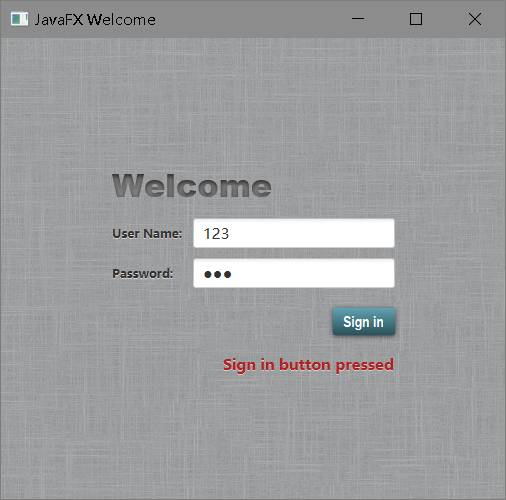

### 使用FXML进行用户界面设计

本教程展示了使用JavaFX FXML的好处，它基于XML语言并提供了将用户界面与程序逻辑代码分离的架构。

如果你是从头开始学习的本文档，那么你已经了解如何使用JavaFX来创建一个登录应用程序。在这一节，你将使用FXML来创建同样的登录用户界面，将程序的界面设计与业务逻辑分离，这样使得代码更便于维护。你在本教程中将要创建的登录用户界面如图

MVC???

```java
package lesson01.fxml;


import javafx.application.Application;
import javafx.fxml.FXMLLoader;
import javafx.scene.Parent;
import javafx.scene.Scene;
import javafx.stage.Stage;

public class FXMLExample extends Application {
    
    @Override
    public void start(Stage stage) throws Exception {
        Parent root = FXMLLoader.load(getClass().getResource("fxml_example.fxml"));//在当前目录加载fxml文件
        
        stage.setTitle("FXML Welcome");
        stage.setScene(new Scene(root, 300, 275));
        stage.show();
    }
    
    public static void main(String[] args) {
        Application.launch(FXMLExample.class, args);
    }
}

```

控制器

```java
package com.potato.javafx.fxml;

import javafx.event.ActionEvent;
import javafx.fxml.FXML;
import javafx.scene.text.Text;

public class FXMLExampleController {
    @FXML
    private Text actiontarget;
    @FXML 
    protected void handleSubmitButtonAction(ActionEvent event) {
        actiontarget.setText("Sign in button pressed");
    }
}
```

fxml_example.fxml

```html
<!-- 导入包 -->
<?import java.net.*?>
<?import javafx.geometry.*?>
<?import javafx.scene.control.*?>
<?import javafx.scene.layout.*?>
<?import javafx.scene.text.*?>

<!-- 指定controller路径 -->
<GridPane fx:controller="lesson01.fxml.FXMLExampleController" 
    xmlns:fx="http://javafx.com/fxml" alignment="center" hgap="10" vgap="10" 
    styleClass="root">
  <padding><Insets top="25" right="25" bottom="10" left="25" /></padding>
  
  <Text id="welcome-text" text="Welcome" 
      GridPane.columnIndex="0" GridPane.rowIndex="0" 
      GridPane.columnSpan="2"/>
  
  <Label text="User Name:" 
      GridPane.columnIndex="0" GridPane.rowIndex="1" />
  
  <TextField 
      GridPane.columnIndex="1" GridPane.rowIndex="1" />
  
  <Label text="Password:" 
      GridPane.columnIndex="0" GridPane.rowIndex="2" />
  
  <PasswordField fx:id="passwordField" 
      GridPane.columnIndex="1" GridPane.rowIndex="2" />
  
  <HBox spacing="10" alignment="bottom_right" 
      GridPane.columnIndex="1" GridPane.rowIndex="4">
      <Button text="Sign In" 
       onAction="#handleSubmitButtonAction" />
  </HBox>
  
  <Text fx:id="actiontarget" 
      GridPane.columnIndex="0" GridPane.columnSpan="2" GridPane.halignment="RIGHT" GridPane.rowIndex="6" />
  
  <stylesheets><!-- 指定css样式 -->
    <URL value="@Login.css" />
  </stylesheets>
  
</GridPane>

```

fxml里还可以指定JavaScript

```html
<fx:script>
    function handleSubmitButtonAction() {
    actiontarget.setText("Calling the JavaScript");
    }
</fx:script>
```

或者这样

```html
<fx:script source="fxml_example.js"/>
```


### JavaFX中的动画与视觉效果

```java
package com.potato.javafx.ColorfulCircles;

import javafx.animation.KeyFrame;
import javafx.animation.KeyValue;
import javafx.animation.Timeline;
import javafx.application.Application;
import javafx.scene.Group;
import javafx.scene.Node;
import javafx.scene.Scene;
import javafx.scene.effect.BlendMode;
import javafx.scene.effect.BoxBlur;
import javafx.scene.paint.Color;
import javafx.scene.paint.CycleMethod;
import javafx.scene.paint.LinearGradient;
import javafx.scene.paint.Stop;
import javafx.scene.shape.Circle;
import javafx.scene.shape.Rectangle;
import javafx.scene.shape.StrokeType;
import javafx.stage.Stage;
import javafx.util.Duration;
import static java.lang.Math.random;

public class ColorfulCircles extends Application {

    public static void main(String[] args) {
        launch(args);
    }

    @Override
    public void start(Stage primaryStage) {
        Group root = new Group();
        Scene scene = new Scene(root, 800, 600, Color.BLACK);
        primaryStage.setScene(scene);
        Group circles = new Group();
        for (int i = 0; i < 30; i++) {
            Circle circle = new Circle(150, Color.web("white", 0.05));
            circle.setStrokeType(StrokeType.OUTSIDE);
            circle.setStroke(Color.web("white", 0.16));
            circle.setStrokeWidth(4);
            circles.getChildren().add(circle);
        }
        Rectangle colors = new Rectangle(scene.getWidth(), scene.getHeight(),
                new LinearGradient(0f, 1f, 1f, 0f, true, CycleMethod.NO_CYCLE,
                        new Stop(0, Color.web("#f8bd55")),
                        new Stop(0.14, Color.web("#c0fe56")),
                        new Stop(0.28, Color.web("#5dfbc1")),
                        new Stop(0.43, Color.web("#64c2f8")),
                        new Stop(0.57, Color.web("#be4af7")),
                        new Stop(0.71, Color.web("#ed5fc2")),
                        new Stop(0.85, Color.web("#ef504c")),
                        new Stop(1, Color.web("#f2660f"))));
        colors.widthProperty().bind(scene.widthProperty());
        colors.heightProperty().bind(scene.heightProperty());
        Group blendModeGroup =
                new Group(new Group(new Rectangle(scene.getWidth(), scene.getHeight(),
                Color.BLACK), circles), colors);
        colors.setBlendMode(BlendMode.OVERLAY);
        root.getChildren().add(blendModeGroup);
        circles.setEffect(new BoxBlur(10, 10, 3));
        Timeline timeline = new Timeline();
        for (Node circle : circles.getChildren()) {
            timeline.getKeyFrames().addAll(
                    new KeyFrame(Duration.ZERO, // set start position at 0
                    new KeyValue(circle.translateXProperty(), random() * 800),
                    new KeyValue(circle.translateYProperty(), random() * 600)),
                    new KeyFrame(new Duration(40000), // set end position at 40s
                    new KeyValue(circle.translateXProperty(), random() * 800),
                    new KeyValue(circle.translateYProperty(), random() * 600)));
        }
        // play 40s of animation
        timeline.play();

        primaryStage.show();
    }
}

```

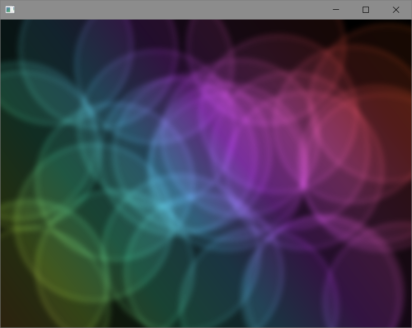


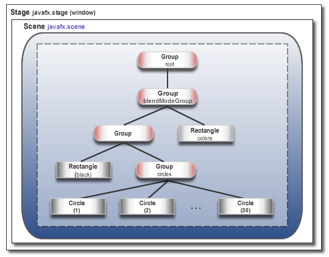

## 使用JavaFX图形

### 开始学习JavaFX 3D图形处理

#### 概览

使用3D几何学、镜头和光照来创建、显示和操控3D空间中的对象。

## JavaFX中的布局

### 内置的布局面板（LayoutPane）

介绍JavaFX SDK中布局容器相关类，我们称之为**面板(Pane)**。使用布局面板来简化JavaFX应用程序中的用户界面的管理。

我们可以通过为每个界面元素设置位置和大小属性来进行手动布局。然而，更简单的选择是使用布局面板。JavaFX SDK中提供了一系列的布局面板来简化设置和管理一些经典布局，比如**行(Row)、列(Column)、堆栈(Stack)、磁贴(Tile)**等等。当窗口被改变大小时，布局面板可以根据其包含的各个界面元素的属性来**自动重设位置和大小**。

面板类Pane：

- BorderPane
- HBox
- VBox

#### 边框面板(BorderPane)

BorderPane布局面板被划分为5个区域来放置界面元素：上、下、左、右、中。每个区域的大小是没有限制的。在你使用BorderPane时，如果不需要某个区域，你只要不为该区域设置内容，该区域则不会被分配显示空间，自然也就不会显示。

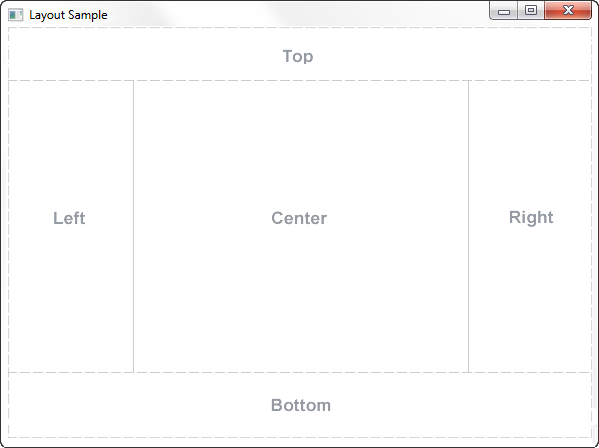

BorderPane常用于定义一个非常经典的布局效果：上方是菜单栏和工具栏，下方是状态栏，左边是导航面板，右边是附加信息面板，中间是核心工作区域。

当BorderPane所在窗口的大小比各区域内容所需空间大时，多出的空间默认会设置给中间区域。当窗口大小比各区域所需空间小时，各个区域就会重叠。重叠的顺序取决于各个区域设置的顺序。例如，如果各个区域设置的顺序是左、下、右，则当窗口变小时，下方区域会覆盖左边区域，而右边区域会覆盖下方区域。如果区域设置顺序是左、右、下，当窗口变小时，下方区域则会在覆盖到左边和右边区域之上。

#### 创建BorderPan

```java
BorderPane border = new BorderPane();
HBox hbox = addHBox();//下面有写
border.setTop(hbox);
```

这个示例中没有使用BorderPane的下方区域。如果你想在下方区域中添加一些内容，请使用下面的代码，并使用你选择的控件替换其node参数：

```java
border.setBottom(node);
```

#### 水平盒子(HBox)

HBox布局面板为将多个节点排列在一行中提供了一个简单的方法


设置内边距(Padding)属性可以用于管理节点到HBox边缘的距离。设置间距(Spacing)属性可以用于管理节点之间的距离。设置样式(Style)属性可以改变背景颜色。

创建一个HBox来实现了一个带有两个按钮的工具栏(ToolBar)。

```java
public class BorderPaneTest extends Application {
    @Override
    public void start(Stage stage) {

        BorderPane border = new BorderPane();
        HBox hbox = addHBox();
        border.setTop(hbox);
        Scene scene = new Scene(border);
        stage.setScene(scene);
        stage.setTitle("Layout Sample");
        stage.show();
    }
    private HBox addHBox() {

        HBox hbox = new HBox();
        hbox.setPadding(new Insets(15, 12, 15, 12));//节点到边缘的距离
        hbox.setSpacing(10);   // 节点之间的间距
        hbox.setStyle("-fx-background-color: #336699;");//背景色

        Button buttonCurrent = new Button("Current");//按钮
        buttonCurrent.setPrefSize(100, 20);

        Button buttonProjected = new Button("Projected");//按钮
        buttonProjected.setPrefSize(100, 20);

        hbox.getChildren().addAll(buttonCurrent, buttonProjected);//按钮添加到HBox面板

        return hbox;
    }

    public static void main(String[] args) {
        launch(BorderPaneTest.class, args);
    }
}

```

用setTop()方法将HBox添加到BorderPane的上方区域中

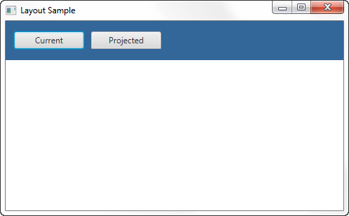

#### 垂直盒子(VBox)

设置内边距(Padding)属性可以管理节点到VBox边缘的距离。设置间距(Spacing)属性可以管理节点之间的距离。设置外边距(Margin)属性可以为单个控件周围增加额外的空间。

```java
public class BorderPaneTest extends Application {
    @Override
    public void start(Stage stage) {

        BorderPane border = new BorderPane();//上下左中右布局
        HBox hbox = addHBox();
        border.setTop(hbox);//水平盒子放上面
        border.setLeft(addVBox());//垂直盒子放左边

        Scene scene = new Scene(border);
        stage.setScene(scene);
        stage.setTitle("Layout Sample");
        stage.show();
    }
    private HBox addHBox() {...}

    private VBox addVBox() {

        VBox vbox = new VBox();
        vbox.setPadding(new Insets(10)); // 上下左右的内边距都为10
        vbox.setSpacing(8);//节点距离

        Text title = new Text("Data");
        title.setFont(Font.font("Arial", FontWeight.BOLD, 14));
        vbox.getChildren().add(title);

        Hyperlink[] options = new Hyperlink[]{//超链接
            new Hyperlink("Sales"),
            new Hyperlink("Marketing"),
            new Hyperlink("Distribution"),
            new Hyperlink("Costs")};

        for (int i=0; i<4; i++) {
            // 为每个节点设置外边距
            VBox.setMargin(options[i], new Insets(0, 0, 0, 8));
            vbox.getChildren().add(options[i]);
        }

        return vbox;
    }

    public static void main(String[] args) {
        launch(BorderPaneTest.class, args);
    }
```

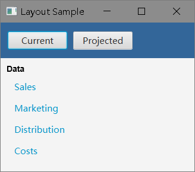

#### 堆栈面板(StackPane)

StackPane布局面板将所有的节点放在一个堆栈中进行布局管理，后添加进去的节点会显示在前一个添加进去的节点之上。这个布局为将文本(Text)覆盖到一个图形(Shape)或者图像(Image)之上，或者将普通图形相互覆盖来创建更复杂的图形，提供了一个简单的方案。图显示了一个帮助按钮，它是通过在一个具有渐变背景的矩形上堆叠一个问号标志来实现的。


```java
public class BorderPaneTest extends Application {
    @Override
    public void start(Stage stage) {

        BorderPane border = new BorderPane();//上下左中右布局
        HBox hbox = addHBox();
        border.setTop(hbox);//水平盒子放上面
        border.setLeft(addVBox());//垂直盒子放左边
        addStackPane(hbox); //添加一个堆栈面板到上方区域的HBox中

        Scene scene = new Scene(border);
        stage.setScene(scene);
        stage.setTitle("Layout Sample");
        stage.show();
    }
    private HBox addHBox() {...}

    private VBox addVBox() {...}

    private void addStackPane(HBox hb) {
        StackPane stack = new StackPane();//堆栈面板
        Rectangle helpIcon = new Rectangle(30.0, 25.0);//矩形
        //设置矩形的渐变
        helpIcon.setFill(new LinearGradient(0,0,0,1, true, CycleMethod.NO_CYCLE,
                new Stop(0, Color.web("#4977A3")),
                new Stop(0.5, Color.web("#B0C6DA")),
                new Stop(1,Color.web("#9CB6CF"))));
        helpIcon.setStroke(Color.web("#D0E6FA"));
        helpIcon.setArcHeight(3.5);
        helpIcon.setArcWidth(3.5);

        Text helpText = new Text("?");//文本
        helpText.setFont(Font.font("Verdana", FontWeight.BOLD, 18));
        helpText.setFill(Color.WHITE);
        helpText.setStroke(Color.web("#7080A0"));

        stack.getChildren().addAll(helpIcon, helpText);//矩形和文本控件加入到堆栈面板上
        stack.setAlignment(Pos.CENTER_RIGHT);//右对齐节点

        StackPane.setMargin(helpText, new Insets(0, 10, 0, 0));////设置问号居中显示

        hb.getChildren().add(stack);//堆栈面板放到HBox中
        //将HBox水平多余的所有空间都给堆栈面板，这样前面设置的右对齐就能保证问号按钮在最右边
        HBox.setHgrow(stack, Priority.ALWAYS);
    }

    public static void main(String[] args) {
        launch(BorderPaneTest.class, args);
    }
}

```

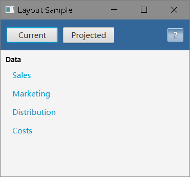

#### 网格面板(GridPane)

GridPane布局面板使你可以创建灵活的基于行和列的网格来放置节点。节点可以被放置到任意一个单元格中，也可以根据需要设置一个节点跨越多个单元格(行或者列)。GridPane对于创建表单或者其他以行和列来组织的界面来说是非常有用的。图显示了一个网格面板，它包含了一个图标、标题、子标题、文本和一个饼状图。在图中，属性gridLinesVisible被用来设置显示网格线，它能展示出行、列以及行列之间的间隙。这个属性在进行GridPane的可视化调试时非常有用。


设置间隙属性(Gap)用来管理行和列之间的距离。设置内边距属性(Padding)用来管理节点元素和GridPane边缘之间的距离。设置垂直(Vertical)和水平(Horizontal)对齐属性(Alignment)能够控制单元格中的各个控件的对齐方式。

```java
public class BorderPaneTest extends Application {
    @Override
    public void start(Stage stage) {

        BorderPane border = new BorderPane();//上下左中右布局
        HBox hbox = addHBox();
        border.setTop(hbox);//水平盒子放上面
        border.setLeft(addVBox());//垂直盒子放左边
        addStackPane(hbox); //添加一个堆栈面板到上方区域的HBox中
        border.setCenter(addGridPane());//添加网格面板到中心区域中

        Scene scene = new Scene(border);
        stage.setScene(scene);
        stage.setTitle("Layout Sample");
        stage.show();
    }
    private HBox addHBox() {...}

    private VBox addVBox() {...}

    private void addStackPane(HBox hb) {...}

    private GridPane addGridPane() {

        GridPane grid = new GridPane();
        grid.setHgap(10);
        grid.setVgap(10);
        grid.setPadding(new Insets(0, 10, 0, 10));

        // 将category节点放在第1行,第2列
        Text category = new Text("Sales:");
        category.setFont(Font.font("Arial", FontWeight.BOLD, 20));
        grid.add(category, 1, 0);

        // 将chartTitle节点放在第1行,第3列
        Text chartTitle = new Text("Current Year");
        chartTitle.setFont(Font.font("Arial", FontWeight.BOLD, 20));
        grid.add(chartTitle, 2, 0);

        // 将chartSubtitle节点放在第2行,占第2和第3列
        Text chartSubtitle = new Text("Goods and Services");
        grid.add(chartSubtitle, 1, 1, 2, 1);

        // 将House图标放在第1列，占第1和第2行
        ImageView imageHouse = new ImageView(
                new Image(getClass().getResourceAsStream("graphics/house.png")));
        grid.add(imageHouse, 0, 0, 1, 2);

        // 将左边的标签goodsPercent放在第3行，第1列，靠下对齐
        Text goodsPercent = new Text("Goods\n80%");
        GridPane.setValignment(goodsPercent, VPos.BOTTOM);
        grid.add(goodsPercent, 0, 2);

        // 将饼图放在第3行，占第2和第3列
        ImageView imageChart = new ImageView(
                new Image(BorderPaneTest.class.getResourceAsStream("graphics/piechart.png")));
        grid.add(imageChart, 1, 2, 2, 1);

        // 将右边的标签servicesPercent放在第3行，第4列，靠上对齐
        Text servicesPercent = new Text("Services\n20%");
        GridPane.setValignment(servicesPercent, VPos.TOP);
        grid.add(servicesPercent, 3, 2);

        return grid;
    }

    public static void main(String[] args) {
        launch(BorderPaneTest.class, args);
    }
}
```


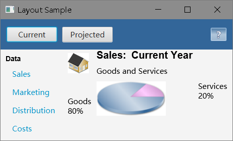

当窗口大小变化时，网格面板中的节点将会根据其自身的布局设置自动适应大小变化。

注：如果出现反射的**空指针异常**，点击菜单栏的 ***Build - Rebuild Project*** 去重构项目

#### 流面板(FlowPane)

FlowPane布局面板中包含的节点会连续地平铺放置，并且会在边界处自动换行(或者列)。这些节点可以在垂直方向(按列)或水平方向(按行)上平铺。垂直的FlowPane会在高度边界处自动换列，水平的FlowPane会在宽度边界处自动换行。图1-10显示了一个使用了数字编号图标的水平FlowPane样例。相比之下如果在垂直FlowPane中，第一列会包含标号为1到4的节点，而第二列会包含编号为5到8的节点。

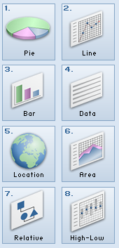

设置间隙属性(Gap)用于管理行和列之间的距离。设置内边距属性(Padding)用于管理节点元素和FlowPane边缘之间的距离。例1-6创建了如图所示的带有一系列的页面图标的水平FlowPane。

```java
public class BorderPaneTest extends Application {
    @Override
    public void start(Stage stage) {

        BorderPane border = new BorderPane();//上下左中右布局
        HBox hbox = addHBox();
        border.setTop(hbox);//水平盒子放上面
        border.setLeft(addVBox());//垂直盒子放左边
        addStackPane(hbox); //添加一个堆栈面板到上方区域的HBox中
        border.setCenter(addGridPane());//添加网格面板到中心区域中
        border.setRight(addFlowPane());//添加流面板到右面

        Scene scene = new Scene(border);
        stage.setScene(scene);
        stage.setTitle("Layout Sample");
        stage.show();
    }
    private HBox addHBox() {...}

    private VBox addVBox() {...}

    private void addStackPane(HBox hb) {...}

    private GridPane addGridPane() {...}
    //流面板
    private FlowPane addFlowPane() {

        FlowPane flow = new FlowPane();
        flow.setPadding(new Insets(5, 0, 5, 0));//内边距，上5，右0，下5，左0
        flow.setVgap(4);//节点的水平间距
        flow.setHgap(4);//节点的垂直间距
        flow.setPrefWrapLength(170); // 预设FlowPane的宽度，使其能够显示两列
        flow.setStyle("-fx-background-color: DAE6F3;");//背景颜色样式

        ImageView[] pages = new ImageView[8];
        for (int i=0; i<8; i++) {
            pages[i] = new ImageView(
                    new Image(getClass().getResourceAsStream(
                            "graphics/chart_"+(i+1)+".png")));//当前目录下的graphics目录下的10个图片
            flow.getChildren().add(pages[i]);
        }

        return flow;
    }

    public static void main(String[] args) {
        launch(BorderPaneTest.class, args);
    }
}
```

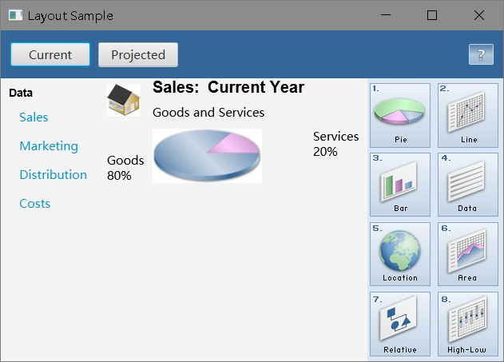

#### 磁贴面板(TilePane)

TilePane布局面板和FlowPane很相似。TilePane将其包含的节点都放在一个网格中，其中每格或者每块磁贴的大小都是一样的。节点可以按水平方向(行)进行排列，或者以垂直方向(列)进行排列。水平排列时会在TilePane的宽度边界处对Tile进行自动换行，垂直排列时会在TilePane的高度边界处对Tile进行自动换列。使用prefColumns和prefRows属性可以设定TilePane的首选大小。

设置间隙属性(Gap)用来管理行和列之间间距。设置内边距属性(Padding)用来设管理节点元素和TilePane边缘之间的距离。

水平排列的TilePane

```java
//磁贴面板
    private TilePane addTilePane() {

        TilePane tile = new TilePane();
        tile.setPadding(new Insets(5, 0, 5, 0));
        tile.setVgap(4);
        tile.setHgap(4);
        tile.setPrefColumns(2);
        tile.setStyle("-fx-background-color: DAE6F3;");

        ImageView[] pages = new ImageView[8];
        for (int i=0; i<8; i++) {
            pages[i] = new ImageView(
                    new Image(LayoutSample.class.getResourceAsStream(
                            "graphics/chart_"+(i+1)+".png")));
            tile.getChildren().add(pages[i]);
        }

        return tile;
    }
```

效果同上述流面板

#### 锚面板(AnchorPane)

AnchorPane布局面板可以让你将节点锚定到面板的顶部、底部、左边、右边或者中间位置。当窗体的大小变化时，节点会保持与其锚点之间的相对位置。一个节点可以锚定到一个或者多个位置，并且多个节点可以被锚定到同一个位置。图显示了一个带有GridPane的AnchorPane，这个GridPane是在前面的”网格面板(GridPane)”章节中创建的，它被锚定到了顶部，同时将一个包含两个按钮的HBox锚定到了右下方。

```java
package com.potato.javafx.pane;

import javafx.application.Application;
import javafx.geometry.Insets;
import javafx.geometry.Pos;
import javafx.geometry.VPos;
import javafx.scene.Scene;
import javafx.scene.control.Button;
import javafx.scene.control.Hyperlink;
import javafx.scene.image.Image;
import javafx.scene.image.ImageView;
import javafx.scene.layout.*;
import javafx.scene.paint.Color;
import javafx.scene.paint.CycleMethod;
import javafx.scene.paint.LinearGradient;
import javafx.scene.paint.Stop;
import javafx.scene.shape.Rectangle;
import javafx.scene.text.Font;
import javafx.scene.text.FontWeight;
import javafx.scene.text.Text;
import javafx.stage.Stage;

public class BorderPaneTest extends Application {
    @Override
    public void start(Stage stage) {

        BorderPane border = new BorderPane();//上下左中右布局
        HBox hbox = addHBox();
        border.setTop(hbox);//水平盒子放上面
        border.setLeft(addVBox());//垂直盒子放左边
        addStackPane(hbox); //添加一个堆栈面板到上方区域的HBox中
        border.setCenter(addGridPane());//添加网格面板到中心区域中
        border.setRight(addFlowPane());//添加流面板到右面
//        border.setRight(addTilePane());//添加流面板到右面
        border.setCenter(addAnchorPane(addGridPane()));

        Scene scene = new Scene(border);
        stage.setScene(scene);
        stage.setTitle("Layout Sample");
        stage.show();
    }
    private HBox addHBox() {...}//水平盒子

    private VBox addVBox() {..}//垂直盒子

    private void addStackPane(HBox hb) {...}//堆栈盒子

    private GridPane addGridPane() {...}//网格面板
    
    private FlowPane addFlowPane() {...}  //流面板

    private TilePane addTilePane() {...}//磁贴面板

    //锚面板
    private AnchorPane addAnchorPane(GridPane grid) {

        AnchorPane anchorpane = new AnchorPane();

        Button buttonSave = new Button("Save");
        Button buttonCancel = new Button("Cancel");

        HBox hb = new HBox();
        hb.setPadding(new Insets(0, 10, 10, 10));
        hb.setSpacing(10);
        hb.getChildren().addAll(buttonSave, buttonCancel);//添加2个按钮

        anchorpane.getChildren().addAll(grid,hb);
        // 锚面板放在下 右 上部
        AnchorPane.setBottomAnchor(hb, 8.0);
        AnchorPane.setRightAnchor(hb, 5.0);
        AnchorPane.setTopAnchor(grid, 10.0);

        return anchorpane;
    }

    public static void main(String[] args) {
        launch(BorderPaneTest.class, args);
    }
}

```


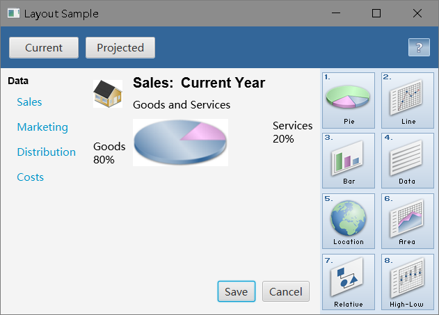

### 调整节点大小和对齐的技巧

使用JavaFX内置布局面板的一个主要好处在于节点的大小和对齐方式是由布局面板来控制的。当布局面板的大小变化时，节点也会根据其预设大小的范围来调整大小。请注意并不是所有的节点都可以改变大小。UI控件(Control)和布局面板(Layout Pane)是可以调整大小的。但是形状(Shape)、文本(Text)以及组(Group)是不可以调整大小的，它们在布局中被认为是刚性对象(Rigid Objects)。

如果你希望对UI中的控件大小有更多的控制，你可以直接设置它们的预设大小(Preferred Size)范围。然后布局面板就会根据你的设置来计算和决定控件的大小。如果希望管理控件的位置，你可以使用布局面板的对齐属性(Alignment)属性。

#### 调整节点大小

布局需要通过调用prefWidth(height)和prefHeight(width)方法来得到节点的预设大小 (Preferred Size)。在默认情况下，UI控件会根据其所包含的内容来自动计算预设大小属性的默认值。例如，按钮(Button)被计算出来的大小取决于标签文本的长度和字体大小，再加上按钮图标的大小。一般来说，计算出来的大小刚好能让控件及其标签完全显示可见。

UI控件根据其典型用途还提供了默认的最小和最大值。例如，Button的默认最大值就是其预设大小，因为一般来说你不会想让按钮任意变大。然而ScrollPane的最大值却是不受限制的，因为一般来说你会希望它们能够变大并充满所有的可用空间。

你可以使用节点的默认大小，或者通过设置大小值来提供你所需要的外观。左图显示了在一个BorderPane中的几个Button和一个ListView的**默认大小**，右图是**经过调整的大小**

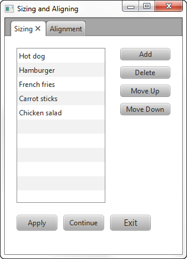

以下是几个调整大小的技巧

##### 设置多个按钮(Button)大小一致

先确定每个按钮的高度和宽度，然后将它们同时设置给预设大小和最大大小，但这很麻烦。另一个更简单的办法就是让布局面板来控制。选用何种布局面板取决于你想实现的效果。

##### 使用垂直盒子(VBox)

右边区域使用了一个VBox，其中包含的几个按钮都是使用默认计算的大小(Computed Size)。这些按钮已经有了相同的高度，因此我们现在仅仅需要设置其宽度一致。

利用了它的一个默认行为——VBox的宽度与其包含的所有组件的最大预设宽度一致。为了让所有的按钮能够自动保持和VBox一样的宽度，我们将每个按钮的最大宽度(MaxWidth)设置为常量**Double.MAX_VALUE**，**这个设置可以使控件宽度不受限制地增长**。另一种做法就是将各个按钮的最大宽度设置为一个指定的常量，例如80.0。

设置一列按钮宽度大小一致

```java
BorderPane border = new BorderPane();
border.setPadding(new Insets(20, 0, 20, 20));

Button btnAdd = new Button("Add");
Button btnDelete = new Button("Delete");
Button btnMoveUp = new Button("Move Up");
Button btnMoveDown = new Button("Move Down");

btnAdd.setMaxWidth(Double.MAX_VALUE);
btnDelete.setMaxWidth(Double.MAX_VALUE);
btnMoveUp.setMaxWidth(Double.MAX_VALUE);
btnMoveDown.setMaxWidth(Double.MAX_VALUE);

VBox vbButtons = new VBox();
vbButtons.setSpacing(10);
vbButtons.setPadding(new Insets(0, 20, 10, 20));
vbButtons.getChildren().addAll(btnAdd, btnDelete, btnMoveUp, btnMoveDown);
```

使用了一个BorderPane进行布局。其中有一列按钮被放到了BorderPane的右边区域中来将它们的宽度限制为最宽按钮的预设宽度。如果你将VBox面板放到BorderPane的中间区域，而中间区域将会扩张填充所有可用空间，那么VBox及其包含的按钮也都将随之扩张。

##### 使用磁贴面板(TilePane)


```java
Button btnApply = new Button("Apply");
Button btnContinue = new Button("Continue");
Button btnExit = new Button("Exit");
btnExit.setStyle("-fx-font-size: 15pt;");

btnApply.setMaxSize(Double.MAX_VALUE, Double.MAX_VALUE);
btnContinue.setMaxSize(Double.MAX_VALUE, Double.MAX_VALUE);
btnExit.setMaxSize(Double.MAX_VALUE, Double.MAX_VALUE);

TilePane tileButtons = new TilePane(Orientation.HORIZONTAL);
tileButtons.setPadding(new Insets(20, 10, 20, 0));
tileButtons.setHgap(10.0);
tileButtons.setVgap(8.0);
tileButtons.getChildren().addAll(btnApply, btnContinue, btnExit);
```

当窗口大小变化时，Tile的大小不会跟着变化，因此其中的按钮大小也不会变化。注意一旦窗口被缩小了，在TilePane中的按钮会改变位置，但并不会随之缩小。

#### 对齐内容

## 处理事件

在JavaFX应用程序中，事件通知一些事情发生了。当用户点击一个按钮、按下一个键、移动鼠标、或者执行其他的操作，都会有事件会被派生出来。在应用程序中注册事件过滤器和事件处理器可以接收到事件并提供响应。本教程介绍事件是如何执行的以及提供一些处理事件的样例

### 处理事件

将学习有关事件类型、事件目标、事件捕获、事件冒泡(Event Bubbling)以及事件处理系统的底层架构。

**事件属性**

- 事件类型(Event type)

  发生事件的类型

- 源(Source)

  事件的来源，表示该事件在事件派发链中的位置。

- 目标(Target)

  事件通过派发链传递时，“源”会随之发生改变。发生动作的节点，在事件派发链的末尾。“目标”不会改变，但是如果某个事件过滤器在事件捕获阶段消费了该事件，“目标”将不会收到该事件。

事件子类提供了一些额外的信息，这些信息与事件的类型有关。例如，MouseEvent类包含哪个按钮被点击、按钮被点击的次数以及鼠标的位置等信息。

**事件类型**

事件类型(Event Type)是EventType类的实例。事件类型对单个事件类的多种事件进行了细化归类。例如，**KeyEvent类**包含如下事件类型：

● KEY_PRESSED

● KEY_RELEASED

● KEY_TYPED

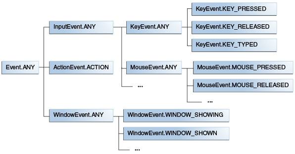

