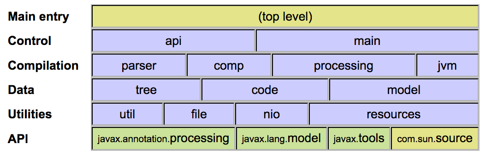
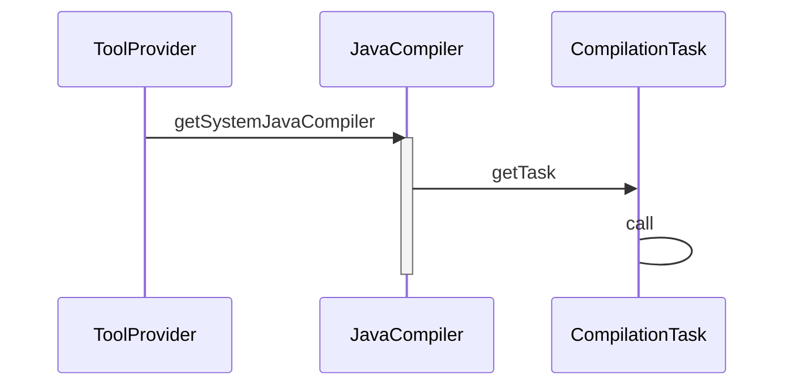

# Java编译器API

来源：

https://nullwy.me/2017/04/javac-api/

https://blog.csdn.net/u010398771/article/details/90474813

## javac命令行

```java
package com.potato;

public class Hello {
    public static void main(String[] args) {
        System.out.println("hello world");
    }
}
```

```shell
javac com/potato/Hello.java -d target/classes
```

## javac 相关 API

除了使用命令行工具编译 Java 代码，JDK 6 增加了规范 JSR-199 和 JSR-296，开始还提供相关的 API。Java 编译器的实现代码和 API 的整体结构如图所示：



绿色标注的包是官方 API（Official API），即 JSR-199 和 JSR-296，黄色标注的包为（Supported API），紫色标注的包代码全部在 `com.sun.tools.javac.*` 包下，为内部 API（Internal API）和编译器的实现类。完整的包说明如下：

- [javax.annotation.processing](http://docs.oracle.com/javase/8/docs/api/javax/annotation/processing/package-summary.html) - 注解处理 ([JSR-296](https://www.jcp.org/en/jsr/detail?id=269))
- javax.lang.model-注解处理和编译器 Tree API 使用的语言模型 (JSR-296)
  - [javax.lang.model.element](http://docs.oracle.com/javase/8/docs/api/javax/lang/model/element/package-summary.html) - 语言元素
  - [javax.lang.model.type](http://docs.oracle.com/javase/8/docs/api/javax/lang/model/type/package-summary.html) - 类型
  - [javax.lang.model.util](http://docs.oracle.com/javase/8/docs/api/javax/lang/model/util/package-summary.html) - 语言模型工具
- [javax.tools](http://docs.oracle.com/javase/8/docs/api/javax/tools/package-summary.html) - Java 编译器 API ([JSR-199](https://jcp.org/en/jsr/detail?id=199))
- [com.sun.source.*](http://docs.oracle.com/javase/8/docs/jdk/api/javac/tree/index.html) - 编译器 Tree API，提供 javac 工具使用的抽象语法树 AST 的**只读访问**
- [com.sun.tools.javac.*](https://static.javadoc.io/org.kohsuke.sorcerer/sorcerer-javac/0.11/com/sun/tools/javac/package-summary.html) - 内部 API 和编译器的实现类

全部源码都位于 [langtools](https://github.com/dmlloyd/openjdk/tree/jdk8u/jdk8u/langtools) 下，在 JDK 中的 `tools.jar` 可以找到。`com.sun.tools.javac.*` 包下全部代码中都有Sun标注的警告：

> This is NOT part of any supported API. If you write code that depends on this, you do so at your own risk. This code and its internal interfaces are subject to change or deletion without notice.

## JavaCompiler示例

首先，看下 JSR-199 引入的 Java 编译器 API。在没有引入 JSR-199 前，只能使用 javac 源码提供内部 API，上文提到的使用命令 javac 编译 Hello.java 的等价写法如下：

```java
import com.sun.tools.javac.main.Main;

import javax.tools.ToolProvider;

/**
 *  javac 等价的写法
 */
public class JavacMain {
    public static void main(String[] args) {
        Main compiler = new Main("javac");
        compiler.compile(new String[]{"src/main/java/com/potato/Hello.java", "-d", "target"});
    }
}
```

```java
package com.potato;

import javax.tools.JavaCompiler;
import javax.tools.ToolProvider;
import java.io.BufferedReader;
import java.io.File;
import java.io.IOException;
import java.io.InputStreamReader;
 
public class CompileMain {
 
    public static void main(String[] args) throws IOException {
        JavaCompiler compiler = ToolProvider.getSystemJavaCompiler();
        int result = compiler.run(null, null, null, "src/main/java/com/potato/Hello.java");
        System.out.println(result == 0 ? "编译成功" : "编译失败");
    }
}
```


JSR-199 的等价写法：

```java
import javax.tools.*;
import java.io.File;
import java.io.IOException;
import java.net.URISyntaxException;
import java.util.Arrays;

/**
 * JSR-199 的等价写法
 */
public class Jsr199Main {
    public static void main(String[] args) throws URISyntaxException, IOException {
        JavaCompiler compiler = ToolProvider.getSystemJavaCompiler();
        DiagnosticCollector<JavaFileObject> diagnostics = new DiagnosticCollector<>();

        StandardJavaFileManager fileManager = compiler.getStandardFileManager(diagnostics, null, null);

        File file = new File("src/main/java/com/potato/Hello.java");
        Iterable<? extends JavaFileObject> compilationUnits = fileManager.getJavaFileObjectsFromFiles(Arrays.asList(file));

        compiler.getTask(null, fileManager, diagnostics, Arrays.asList("-d", "target"), null, compilationUnits).call();

        for (Diagnostic<? extends JavaFileObject> diagnostic : diagnostics.getDiagnostics()) {
            System.out.format("Error on line %d in %s\n%s\n",
                    diagnostic.getLineNumber(), diagnostic.getSource().toUri(), diagnostic.getMessage(null));
        }

        fileManager.close();
    }
}
```

## 过程解释

JDK 6 的编译器 API 的另外一个强大之处在于，它可以编译的源文件的形式并**不局限于文本文件**。`JavaCompiler` 类依靠文件管理服务可以编译多种形式的源文件。比如直接由内存中的字符串构造的文件，或者是从数据库中取出的文件。这种服务是由 **JavaFileManager 类**提供的。

在Java SE6中最佳的方法是使用StandardJavaFileManager类。这个类**能非常好地控制输入、输出，并且能通过DiagnosticListener得到诊断信息**，而DiagnosticCollector类就是listener的实现。新的 JDK 定义了 javax.tools.FileObject和 javax.tools.JavaFileObject 接口。任何类，只要实现了这个接口，就可以被 JavaFileManager 识别。



使用`StandardJavaFileManager`步骤：

1. 建立一个`DiagnosticCollector`实例，编译器的诊断信息
2. 通过`JavaCompiler.getStandardFileManager()`方法得到一个`StandardFileManager`对象。
3. 使用`StandardFileManager`获取需要编译的源代码。从文件或者字符流中获取源代码。
4. `JavaCompiler.getTask()`生成编译任务抽象。
5. 通过`CompilationTask.call()`方法编译源代码。
6. 关闭`StandardFileManager`。



在使用这种方法调用Java编译时最复杂的方法就是getTask，下面让我们讨论一下getTask方法。这个方法有如下所示的6个参数。

### JavaCompiler.getTask()方法

```java
CompilationTask getTask(Writer out,
                        JavaFileManager fileManager,
                        DiagnosticListener<? super JavaFileObject> diagnosticListener,
                        Iterable<String> options,
                        Iterable<String> classes,
                        Iterable<? extends JavaFileObject> compilationUnits);
```

这些参数大多数都可为`null`。他们的含义所下。

- `out`: 用于输出错误的流，默认是`System.err`。
- `fileManager`:标准的文件管理。
- `diagnosticListener`: 编译器的默认行为。
- `options`: 编译器的选项
- `classes`：参与编译的class。
- `compilationUnits`: 待编译的Java文件，不能为`null`。

### CompilationTask 

CompilationTask 提供了 setProcessors(Iterable<? extends Processor>processors)方法，用户可以制定处理 annotation 的处理器。

在使用完getTask前，需要通过StandardJavaFileManager.getJavaFileObjectsFromFiles()或StandardJavaFileManager.getJavaFileObjectsFromStrings方法得到待编译的compilationUnits对象。也可以通过继承/实现SimpleJavaObject获取带编译的对象。

调用这两个方法的方式如下：

```java
Iterable<? extends JavaFileObject> getJavaFileObjectsFromFiles(Iterable<? extends File> files)
Iterable<? extends JavaFileObject> getJavaFileObjectsFromStrings(Iterable<String> names)
 
String[] filenames = …;
Iterable<? extends JavaFileObject> compilationUnits =
fileManager.getJavaFileObjectsFromFiles(Arrays.asList(filenames));
 
JavaCompiler.CompilationTask task = compiler.getTask(null, fileManager,
diagnostics, options, null, compilationUnits);
```

最后需要关闭fileManager.close();

例如：

```java
package win.hgfdodo.dynamic;
 
import javax.tools.JavaCompiler;
import javax.tools.JavaFileObject;
import javax.tools.StandardJavaFileManager;
import javax.tools.ToolProvider;
import java.util.Arrays;
 
public class JavaFileManagerMain {
    public static void main(String[] args) {
        String fullQuanlifiedFileName = "win.hgfdodo.dynamic.".replaceAll("\\.", java.io.File.separator) + "Calculator.java";
        JavaCompiler compiler = ToolProvider.getSystemJavaCompiler();
        StandardJavaFileManager fileManager =
                compiler.getStandardFileManager(null, null, null);
 
        Iterable<? extends JavaFileObject> files =
                fileManager.getJavaFileObjectsFromStrings(
                        Arrays.asList(fullQuanlifiedFileName));
        JavaCompiler.CompilationTask task = compiler.getTask(
                null, fileManager, null, null, null, files);
 
        Boolean result = task.call();
        if (result == true) {
            System.out.println("Succeeded");
        }
    }
}
```

```java
 
package win.hgfdodo.dynamic;
 
public class Calculator {
    public int multiply(int multiplicand, int multiplier) {
        return multiplicand * multiplier;
    }
}
```

### JavaFileObject获取java源程序

开发者希望生成 `Calculator` 的一个测试类，而不是手工编写。使用 compiler API，可以将内存中的一段字符串，编译成一个 CLASS 文件。

定制 JavaFileObject 对象：

```java
package win.hgfdodo.dynamic;
 
import javax.tools.SimpleJavaFileObject;
import java.io.IOException;
import java.net.URI;
import java.net.URISyntaxException;
 
public class StringObject extends SimpleJavaFileObject {
    private String content = null;
 
    protected StringObject(String className, String contents) throws URISyntaxException {
        super(new URI(className), Kind.SOURCE);
        this.content = contents;
    }
 
    @Override
    public CharSequence getCharContent(boolean ignoreEncodingErrors) throws IOException {
        return content;
    }
}
```

SimpleJavaFileObject 是 JavaFileObject 的子类，它提供了默认的实现。继承 SimpleJavaObject 之后，只需要实现 getCharContent 方法。

接下来，在内存中构造 Calculator 的测试类 CalculatorTest，并将代表该类的字符串放置到 StringObject 中，传递给 JavaCompiler.getTask 方法。

具体如下：

```java
package win.hgfdodo.dynamic;
 
import javax.tools.JavaCompiler;
import javax.tools.JavaFileObject;
import javax.tools.StandardJavaFileManager;
import javax.tools.ToolProvider;
import java.net.URISyntaxException;
import java.util.Arrays;
 
public class StringClassCompilerMain {
    public static void main(String[] args) {
        JavaCompiler javaCompiler = ToolProvider.getSystemJavaCompiler();
        StandardJavaFileManager standardJavaFileManager = javaCompiler.getStandardFileManager(null, null, null);
        JavaFileObject testFile = generateTest();
        Iterable<? extends JavaFileObject> classes = Arrays.asList(testFile);
        JavaCompiler.CompilationTask task = javaCompiler.getTask(null, standardJavaFileManager, null, null, null, classes);
        if(task.call()){
            System.out.println("success");
        }else{
            System.out.println("failure!");
        }
 
    }
 
    private static JavaFileObject generateTest() {
        String contents = new String(
                "package win.hgfdodo.dynamic;" +
                        "class CalculatorTest {\n" +
                        "  public void testMultiply() {\n" +
                        "    Calculator c = new Calculator();\n" +
                        "    System.out.println(c.multiply(2, 4));\n" +
                        "  }\n" +
                        "  public static void main(String[] args) {\n" +
                        "    CalculatorTest ct = new CalculatorTest();\n" +
                        "    ct.testMultiply();\n" +
                        "  }\n" +
                        "}\n");
        StringObject so = null;
        try {
            so = new StringObject("win.hgfdodo.dynamic.CalculatorTest", contents);
        } catch (URISyntaxException e) {
            e.printStackTrace();
        }
 
        return so;
 
    }
}
```

### 采集编译器的诊断信息

收集编译过程中的诊断信息是JDK6新增的内容。诊断信息，通常指错误、警告或是编译过程中的详尽输出。

JDK 6 通过 `Listener` 机制，获取这些信息。如果要注册一个 `DiagnosticListener`，必须使用 `CompilationTask` 来进行编译，因为 `Tool.run` 方法没有办法注册 `Listener`。

步骤:

1. 构造一个 `Listener`；
2. 传递给 `JavaFileManager` 的构造函数；
3. 编译完成后，获取`Diagnostic`列表；
4. 输出诊断信息。

例子：

```java
package win.hgfdodo.dynamic;
 
import javax.tools.*;
import java.net.URISyntaxException;
import java.util.Arrays;
import java.util.List;
import java.util.Locale;
 
public class StringClassCompilerMain {
    public static void main(String[] args) {
        JavaCompiler javaCompiler = ToolProvider.getSystemJavaCompiler();
        DiagnosticCollector<JavaFileObject> collector = new DiagnosticCollector<>();
        StandardJavaFileManager standardJavaFileManager = javaCompiler.getStandardFileManager(null, null, null);
        JavaFileObject testFile = generateTest();
        Iterable<? extends JavaFileObject> classes = Arrays.asList(testFile);
        JavaCompiler.CompilationTask task = javaCompiler.getTask(null, standardJavaFileManager, collector, null, null, classes);
        if(task.call()){
            System.out.println("success");
        }else{
            System.out.println("failure!");
        }
 
        List<Diagnostic<? extends JavaFileObject>> diagnostics = collector.getDiagnostics();
        for (Diagnostic<? extends JavaFileObject> diagnostic: diagnostics){
            System.out.println("line:"+ diagnostic.getLineNumber());
            System.out.println("msg:"+ diagnostic.getMessage(Locale.ENGLISH));
            System.out.println("source:"+ diagnostic.getSource());
 
        }
    }
 
    private static JavaFileObject generateTest() {
        String contents = new String(
                "package win.hgfdodo.dynamic;" +
                        "class CalculatorTest {\n" +
                        "  public void testMultiply() {\n" +
                        "    Calculator c = new Calculator()\n" +
                        "    System.out.println(c.multiply(2, 4));\n" +
                        "  }\n" +
                        "  public static void main(String[] args) {\n" +
                        "    CalculatorTest ct = new CalculatorTest();\n" +
                        "    ct.testMultiply();\n" +
                        "  }\n" +
                        "}\n");
        StringObject so = null;
        try {
            so = new StringObject("win.hgfdodo.dynamic.CalculatorTest", contents);
        } catch (URISyntaxException e) {
            e.printStackTrace();
        }
 
        return so;
 
    }
}
```

`generateTest`方法在构造`Calculator`时，将行尾`;`去掉，造成java 源文件错误，在编译时，会输出：

```
line:3
msg:需要';'
source:win.hgfdodo.dynamic.StringObject[win.hgfdodo.dynamic.CalculatorTest]
```


1