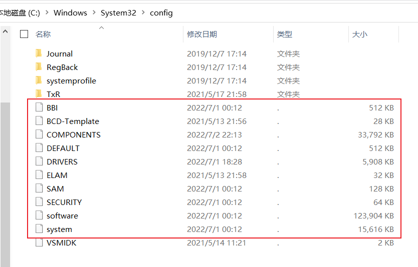

# 基本概念

对于windows系统来说，需要很多配置，以文本文件形式的配置文件不方便管理且容易误操作，把这些配置存到数据库里不久行了嘛，然后，微软给这个数据库起了个名字，叫做：注册表。


注册表的结构与文件目录结构很相似

有目录、子目录、还有文件，文件有文件名、文件内容、文件类型

注册表文件存储的位置：



这些个数据库文件，都是来存储软硬件配置的，需要用注册表编辑器（regedit）才能打开。

# 添加右键菜单

将鼠标右键菜单分文下三种情况：

- 右键空白区域（分为桌面空白区域和其他文件夹下空白区域）

- 右键文件夹

- 右键文件（分为所有文件和某类型文件两种）

## 注册表位置

不同情形下的注册表位置如下

| 情形             | 用户     | 注册表位置                                                   |
| ---------------- | -------- | ------------------------------------------------------------ |
| 右键桌面空白区域 | --       | HKEY_CLASSES_ROOT\DesktopBackground\Shell                    |
| 右键一般空白区域 | 管理员   | HKEY_CLASSES_ROOT\Directory\Background\shell                 |
| 右键一般空白区域 | 普通用户 | HKEY_CURRENT_USER\Software\Classes\directory\Background\shell |
| 右键文件夹       | 管理员   | HKEY_CLASSES_ROOT\Directory\shell                            |
| 右键文件夹       | 普通用户 | HKEY_CLASSES_ROOT\Directory\shell                            |
| 右键文件         | 管理员   | HKEY_CLASSES_ROOT\\*\shell                                   |
| 右键文件         | 普通用户 | HKEY_CURRENT_USER\Software\Classes\\*\shell                  |

### 1.空白处右键菜单

```css
HKEY_CLASSES_ROOT\Directory\background\shell
HKEY_CLASSES_ROOT\Directory\background\shellex\ContextMenuHandlers
HKEY_CLASSES_ROOT\Folder\background\shell
HKEY_CLASSES_ROOT\Folder\background\shellex\ContextMenuHandlers
```

### 2.文件夹右键菜单

```mipsasm
HKEY_CLASSES_ROOT\Directory\shell
HKEY_CLASSES_ROOT\Directory\shellex\ContextMenuHandlers
HKEY_CLASSES_ROOT\Folder\shell
HKEY_CLASSES_ROOT\Folder\shellex\ContextMenuHandlers
```

### 3.文件右键菜单

```css
[具体文件格式后缀]为*时，所有格式文件都有该右键菜单
HKEY_CLASSES_ROOT\[具体文件格式后缀]\shellex\ContextMenuHandlers
```

### shell和shellex区别

```mipsasm
shell文件夹中定义的菜单，在右键上直接显示
shellex文件夹中定义的菜单，在右键上显示为多级菜单
```

### Directory和Folder区别

```php
Directory文件夹内定义的菜单，在所有文件夹（除了我的电脑右键）右键中显示
Folder文件夹内定义的菜单，在所有文件夹（包括我的电脑右键）右键中显示
```

## 右键文件

- 在：计算机\HKEY_CLASSES_ROOT\*\shell\ 下新建目录，随便起个名字，比如IDEA
- 再新建一个子目录，名字就不能随便起了，得叫command
- 将注册表值改为需要打开的exe路径


这样，右键文件时，就能显示了，而且能打开IDEA


添加%1参数可以用IDEA打开此文件

C:\Program Files\JetBrains\ideaIC-2022.1.2.win\bin\idea64.exe %1

还可以添加图标


效果


## 定义二级菜单

[在电脑右键菜单中创建二级折叠菜单的方法-太平洋电脑网 (pconline.com.cn)](https://pcedu.pconline.com.cn/1190/11909155.html)

