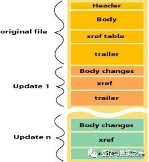
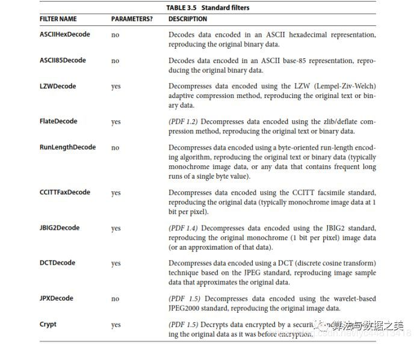
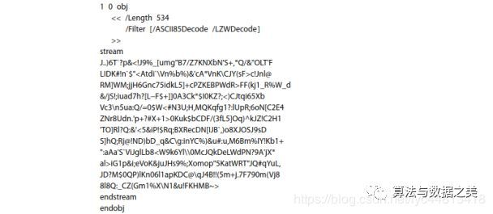
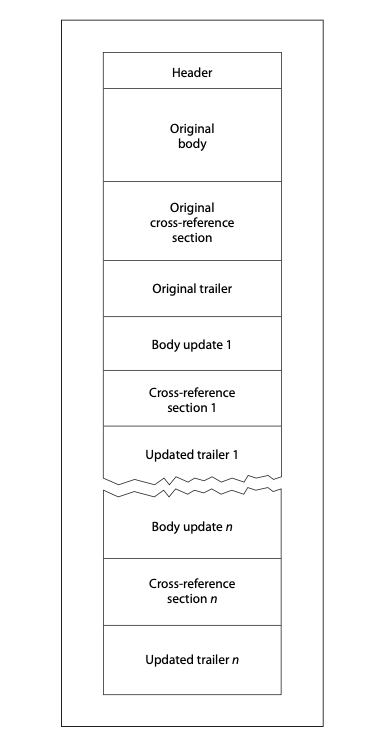
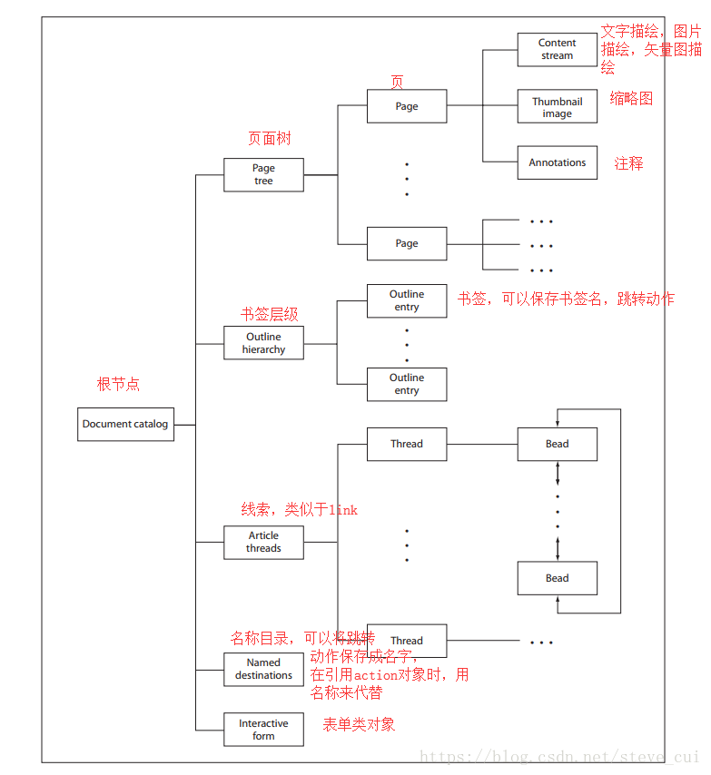

参考来源：

https://blog.csdn.net/lzfly/article/details/81043337

https://cloud.tencent.com/developer/article/1575759

https://www.cnblogs.com/Primzahl/p/14735567.html

# PDF简介

PDF是Portable Document Format 的缩写，可翻译为“便携文档格式”，由Adobe System Incorporated 公司在1992年发明。

**PDF文件是一种编程形式的文档格式**，它所有显示的内容，都是通过相应的**操作符**进行绘制的。

PDF基本显示单元包括：文字，图片，矢量图，图片

PDF扩展单元包括：水印，电子署名，注释，表单，多媒体，3D

PDF动作单元：书签，超链接（拥有动作的单元有很多个，包括电子署名，多媒体等等）


根据PDF官方指南，理解PDF格式可以从四个方面下手

- **Objects（对象）**
- **File structure（物理文件结构）**
- **Document structure（逻辑文件结构）**
- **Content streams（内容流）**

## Hello World

```
%PDF−1.4
1 0 obj
<< /Type /Catalog
/Outlines 2 0 R
/Pages 3 0 R
>>
endobj
2 0 obj
<< /Type /Outlines
/Count 0
>>
endobj
3 0 obj
<< /Type /Pages
/Kids [4 0 R]
/Count 1
>>
endobj
4 0 obj
<< /Type /Page
/Parent 3 0 R
/MediaBox [0 0 612 792]
/Contents 5 0 R
/Resources << /ProcSet 6 0 R
/Font << /F1 7 0 R >>
>>
>>
endobj
5 0 obj
<< /Length 73 >>
stream
BT
/F1 24 Tf
100 100 Td
(Hello World) Tj
ET
endstream
endobj
6 0 obj
[/PDF /Text]
endobj
7 0 obj
<< /Type /Font
/Subtype /Type1
/Name /F1
/BaseFont /Helvetica
/Encoding /MacRomanEncoding
>>
endobj
xref
0 8
0000000000 65535 f
0000000009 00000 n
0000000074 00000 n
0000000120 00000 n
0000000179 00000 n
0000000364 00000 n
0000000466 00000 n
0000000496 00000 n
trailer
<< /Size 8
/Root 1 0 R
>>
startxref
625
%%EOF
```

保存为pdf格式，打开后，显示 Hello World

## 物理文件结构

PDF文件主要由四部分组成：

- 文件头(Header)：一般就是表示该pdf文件遵循的pdf文件版本，例如1.3， 1.7等
- 文件体(Body)：实际存储文件内容的部分，这是构成PDF比重最大的内容。 按obj 对象进行存储， 每个obj对象有一个编号， 但是不一定是顺序存储的。
- 交叉引用表(Xref table)：记录每个obj在整个文件中的位置， 通过偏移量进行定位。 一个文件可以有多个交叉表
- 文件尾(Trailer)：相对于文件头来说，文件尾存储了最关键的文件meta信息，1. 交叉引用表在整个文件重的偏移位置 2. 文档的根对象的编号 3. 文档中具备的对象的个数

结构如图。修改过的PDF结构会有部分变化。

未经修改 :


经修改 :



**解析过程**

首先解析文件尾，得到交叉应用表和根对象编号。然后通过交叉引用表以及根对象编号，逐层解析文档， 构建文档数。注意根目录中一半都存在/PAGES对象， 这个代表了页面的根节点。

接下来的章节，将详细介绍PDF文件中这四大**物理结构**

# 文件头

文件头是PDF文件的第一行，格式如下：

```
%PDF-1.7
```

这是个固定格式，表示这个PDF文件遵循的PDF规范版本，解析PDF的时候尽量支持高版本的规范，以保证支持大多数工具生成的PDF文件。1.7版本支持1.0-1.7之间的所有版本。

文件头每行都以%开头

# 对象集合(文件体)

这是一个PDF文件最重要的部分，文件中用到的所有对象，包括文本、图象、音乐、视频、字体、超连接、加密信息、文档结构信息等等，都在这里定义。格式如下:

```
2 0 obj
        ...
end obj
```

一个对象的定义包含4个部分：前面的2是**对象序号**，其用来唯一标记一个对象；0是**生成号**，按照PDF规范，如果一个PDF文件被修改，那这个数字是累加的，它和对象序号一起标记是原始对象还是修改后的对象，但是**实际开发中，很少有用这种方式修改PDF的，都是重新编排对象号**；obj和endobj是对象的定义范围，可以抽象的理解为这就是一个左括号和右括号；省略号部分是PDF规定的任意合法对象。


可以通过**R关键字**来引用任何一个对象，比如要引用上面的对象，可以使用2 0 R，需要主意的是，R关键字不仅可以引用一个已经定义的对象，**还可以引用一个并不存在的对象**，而且效果就和引用了一个**空对象**一样。

## 对象类型

对象主要有下面几种：

8种基本类型对象。布尔对象、数字对象、字符串对象、名称对象、数组对象、字典对象、流对象、空对象。

还有一种叫做 间接对象 ，类似于编程语言里的引用对象（引用数据类型）

### 布尔

**布尔对象 Boolean Objects**：用关键字true或false表示

### 数字

**数字对象 Numeric Objects**：两种类型的数字对象：整型和实数

- 整数(integer)对象表示数学上的整数，书写为一个或多个十进制数，可选择在前面添加一个符号，示例：123，4123，+19，-98，0
- 实数(real)对象表示数学上的实数，书写为一个或多个带有可选的正负号，以及一个前导，结尾或嵌入的句点（小数点）的十进制数，示例：34.5，-3.63，+123.6，4.，-.002，0.0。

### 字符串(()或<>包着)

**字符串对象 String Objects**：包含0个或多个字节。由一系列0-255之间的字节组成，一个string总长度不能超过65535.string有以下方式：

- 文本串 Literal Strings：**以（）为分隔符**，包含在（）中的一系列文字字符。例如：(This is a (string))
- **转义字符**：\ddd 表示ASCII字符集之外可打印的字符，文字串(\0053)表示这个串包含2个字符，\005(Control-E)和数字3. 然而(\053)和(\53)表示串只包含一个字符\053，即加号(+).
- **十六进制串** Hexadecimal Strings：**以< >为分隔符**，包含在<>中的十六进制数据。如果串的位数是奇数，以0补齐。例如：<901FA3>该串由3个字节构成分别是90，1F，和A3。但是<901FA>是由3个字节构成的分别是90，1F和A0。

转义符的定义如下：

| 转义字符 | 含义                   |
| :------- | :--------------------- |
| /n       | 换行                   |
| /r       | 回车                   |
| /t       | 水平制表符             |
| /b       | 退格                   |
| /f       | 换页（Form feed (FF)） |
| /(       | 左括号                 |
| /)       | 右括号                 |
| //       | 反斜杠                 |
| /ddd     | 八进制形式的字符       |

### 名称(/开头)

名称对象 Name Objects：类似于编程语言里的标识符，名称对象是不可分割且唯一的

- 名称是以斜线(/)打头。斜线不是名称的一部分。**名称中斜线和第一个字符之间不允许有空格**。名称可以包含任意的常规字符，但**不包含分隔符和空格符**。名称是有**区分大小写**的：/A和/a是两个不同的名称。以下例子是有效的文字名称：/Name1 /$$ /@pattern /. notdef

- 从PDF1.2开始，除了ascii的0，别的都可以用一个**#加两个十六进制**的数字表示。相当于转义字符？例如：

  ```
  /Adobe#20Green 表示Adobe Green，
  /name 表示name
  /name#20is 表示name is
  /name#200 表示name 0
  ```

- 名称的最大长度为127字符。字符数的计算是根据名称实际表示的字符。例如，**/A#20B是4个字符（/，A，空格，B），而不是6个字符**。

### 数组

数组对象 Array Objects：

- 数组对象是一个排列有序的一维对象集合。PDF数组可以是不同性质的，数组的元素可以由数（number），串，字典或其他对象，**还可以包含其他数组**。
- 数组书写格式如下：（包含在[ 和 ] 之间）  [ 549 3.14 false ( Ralph ) /SomeName ]
- PDF 只支持一维数组。多维的数组可以用数组嵌套的方式来构建。

### 字典(<</key value ...>>)

字典对象 Dictionary Objects：

- 字典对象是一个包含多个对象的关联表，称为字典条目。每个条目的第一个元素称为关键字(key)，第二个元素称为值(value)。**关键字必须是一个名称对象(name object)**。**值可以是任何对象**，包括其他字典。一个字典的条目的值如果是**null等同于该项缺省**。缺省的value还可以不写，比如 <</Filter>>

- 字典书写格式如下：（包含在<< 和 >>中，关键字-值是配对出现的）

  ```
  << /Type /Example 
  /Subtype /DictionaryExample 
  /Version 0.01 >>
  ```

- 字典对象是构建PDF文件数据块的主要部分。它们通常用于集合和绑定复杂对象的属性，例如字体（font）或文档的页面，其中的每个条目指定一个属性的名称和值。根据规定，Type条目指定这个字典所描述的对象类型。在某些情况下，Subtype条目（或缩写为S）用于进一步确定子类型。

### 流(字典+stream ... endstream)

流对象 Stream Objects：

- 流对象类似串对象，是一系列字节构成。但是PDF应用程序可以逐步读取一个流，而一个串必须全部一次性读取。而且，流不限制长度，而串是有长度限制的。正因为如此，可能包含大量数据的对象，如**图像**，**页面描述**，都用流来表示。

- 流的前面总是先有一个字典，字典的目的是用来描述这个流的。然后，后面紧随的是0个或多个字节构成，头尾用关键字Stream和endstream标识

  ```
  <<字典>>
  stream 
  … Zero or more bytes … 
  endstream
  ```

- 所有的流都必须是**间接引用对象**，**流前面的字典必须是直接对象**。流字典后紧跟着必须有一个行末标识符，与strem关键字分隔开，这个行末标识符可以是一个回车符和是行末填充符，或是一个行末填充符，但不是单独一个回车符。构成流的序列字节，位于关键字stream和endstream之间；**流字典中精确指定了流的字节数**。

- 每个流字典都有一个**Length条目**，比如<<... /Length 137311>>，说明PDF文件中使用的流数据的字节数。（如果流使用了filter（过滤器），Length是已编码数据的字节数。）另外，为了数据的自身限制，大多数filters（过滤器）的定义，使用明确的数据结束标识（EOD，end-of-data）界定数据的区域。最后，流用于表示许多对象，并且长度可以从属性中推断出来的。所有这些制约因素必须一致。

- 例如，一个图像有10行和10列，一个颜色成分组成，每个颜色成分有8位，那么图像数据就需要200字节来表示。如果流使用filter（过滤器），必须有足够的编码字节数来表示这200字节。如果Length太小，或EOD数据结束符出现的太早，或者解码数据没有200字节，那么都将出错。

- 如果流中包含太多的数据也将出错，除非在关键字endstream之前有一个额外的行末结束符。

流的字典常用的字段：

Length，整形，作用：关键字stream和endstream之间的**数据长度**，**endstream之前可能会有一个多余的EOL标记，这个不计算在数据的长度中**

Filter名字 或 数组（可选）Stream的编码算法名称（列表）。如果有多个，则数组中的编码算法列表顺序就是数据被编码的顺序。

DecodeParms字典 或 数组（可选)一个参数字典或由参数字典组成的一个数组，供Filter使用。如果仅有一个Filter并且这个Filter需要参数，除非这个Filter的所有参数都已经给了默认值，否则的话 DecodeParms必须设置给Filter。如果有多个Filter，并且任意一个Filter使用了非默认的参数， DecodeParms 必须是个数组，每个元素对应一个Filter的参数列表（如果某个Filter无需参数或所有参数都有了默认值，就用空对象代替）。如果没有Filter需要参数，或者所有Filter的参数都有默认值，DecodeParms 就被忽略了。F文件标识（可选)保存stream数据的文件。如果有这个字段， stream和endstream就被忽略，FFilter将会代替Filter， FDecodeParms将代替DecodeParms。Length字段还是表示stream和endstream之间数据的长度，但是通常此刻已经没有数据了，长度是0.FFilter名字 或 字典(可选)和filter类似，针对外部文件。FDecodeParms字典 或 数组(可选)和DecodeParams类似，针对外部文件。

Stream的编码算法名称（列表）。如果有多个，则数组中的编码算法列表顺序就是数据被编码的顺序。且需要被编码。编码算法主要如下：



编码可视化主要显示为乱码，所以提供了隐藏信息的机会，如下图的steam内容为乱码。



### Null

空对象 Null Objects

只有这个对象的类型是空，由关键字null指定。一个间接对象指向一个不存在的对象被看作是空对象。指定空对象为字典选项的值等同于忽略该项。

### 间接对象 Indirect Objects

其实就是引用对象，或引用数据类型

PDF的文件体，就是由一个个的间接对象组成的

PDF 文件中的任何对象都可以被标记为间接对象。这就要求每个对象有一个**唯一对象标识符**，通过这个标识符其它对象都可以引用它（比如，数组的一个元素或字典选项的值）。对象标识符包括两个部分：

- 一个正整数对象编号，在 PDF 文件中间接对象经常按顺序编号，但不是必须的；对象编号可以以任意顺序分配。

- 一个非负整数版本编号generation number。一个新创建的文件中，所有间接引用的版本号为0，非0的版本号说明文件更新过。一般开发中，直接重新生成对象就行，懒得改这个版本号。例如：

  ```
  12 0 obj 
  ( Brillig )
  endobj
  ```

  定义了一个间接字符串串对象，对象号为12，版本号为0，值为Brillig.

- **一个对象可以被被位于文件中任何位置的间接引用所引用**，如下格式 **12 0 R**（对象编号，版本号及关键字R）。

- 一个间接引用指向一个未定义的对象不是错误。它只是被看作引用一个空值对象。比如，如果一个文件包含间接引用 17 0 R 但没有包含相应的定义

  ```
  17 0 obj
  … 
  endobj
  ```

  那么这个间接引用被认为是引用一个空值对象。

# 交叉引用表

Cross-Reference Table

交叉引用表是PDf文件内部一种特殊的文件组织方式，可以很方便的根据对象号随机访问一个对象，类似于class文件中的常量池。

交叉引用表包含允许随机访问文件中间接对象的信息，因此**无需读取整个文件即可找到任何特定对象**。 该表应为每个间接对象包含一个单行条目，并指定该对象在文件正文中的**字节偏移量**。

从PDF 1.5开始，部分或全部交叉引用信息可能会包含在交叉引用流（Cross-Reference Streams）中。

其格式如下：

```
xref
0 1
0000000000   65535   f
4 1
0000000009   00000   n
8 3
0000000074   00000   n
0000000120   00000   n
0000000179   00000   n
```

其中，xref是开始标志，表示以下为一个交叉引用表的内容;每个交叉引用表又可以分为若干个子段，每个子段的第一行是两个数字，**第一个是对象起始号，后面是连续的对象个数**，接着每行是这个子段的每个对象的具体信息——**每行的前10个数字代表这个这个对象相对文件头的偏移地址(偏移了几个字节)，后面的5位数字是生成号**（用于标记PDF的更新信息，和对象的生成号作用类似），最后一位f或n表示对象是否被使用(n表示使用，f表示被删除或没有用)。上面这个交叉引用表一共有3个子段，分别有1个，1个，3个对象，第一个子段的对象不可用，其余子段对象可用。


PDF文件可以包含一个或多个交叉引用部分。例如原始文件可能只有一个交叉引用表，如果文件是线性化的，则文件结构是由两部分组成，每次文件进行增量更新时，都应该增加一个交叉引用表结构。

每个交叉引用部分均应以包含关键字xref的行开头。此行之后是一个或多个交叉引用小节，这些引用小节可以以任何顺序出现。

对于从未进行过增量更新的文件，交叉引用节应仅包含一个子节，其对象编号从0开始。子节结构对于增量更新很有用，因为它允许将新的交叉引用节添加到PDF文件中，其中仅包含已添加或删除的对象的条目。

每个交叉引用小节均应包含对象编号连续范围的条目。该小节应以包含以空格隔开的两个数字的行开头，表示该小节中第一个对象的对象编号及该小节中的条目数。

例如以下，表示从28～32的连续5个对象为其中的一个小节

```
xref
28 5
...
```

对于给定的对象编号只允许出现在某一个小节，不允许在其他小节重复引用出现。

在编号行之后是交叉引用条目本身，每行一个条目。每个条目为20个字节长，包括行尾标记。

交叉引用条目有两种：一种用于使用中的对象，另一种用于已删除并因此是空闲的对象。两种类型的条目都有类似的基本格式，以关键字n（in-use）或f（free）来区分。条目的格式为：

```
nnnnnnnnnn ggggg n eol
...
nnnnnnnnnn ggggg f eol
```

- nnnnnnnnnn为解码流中10位字节偏移量，绝对占位10，不够10位时用0做前导填充
- ggggg为5位字节**生成编号**，绝对占位5，不够5位时用0做前导填充
- n表示该对象处于使用中，f表示该对象已删除
- **eol表示换行标记，可以是SP CR、SP LF或者CR LF**

4节数据默认以空格为间隔，组成一行，每行固定占位20字节。

**交叉引用表中的第1个编号为0的对象始终是（f），并且生成号为65535。**

**除了编号0的对象外，交叉引用表中的所有对象最初的生成号应为0。**

删除间接对象时，应将其交叉引用条目标记为（f），并将其添加到free条目的链表中。

下次创建具有该对象编号的对象时，条目的生成号应增加1，**最大生成号为65535**；当交叉引用条目达到此值时，它将永远不会被重用。

**连续的交叉引用表**

下面显示了一个交叉引用表，该表由一个包含6个条目的小节组成：4个正在使用（对象编号1、2、4和5）和2个空闲（对象编号0和3）。 对象编号3已被删除，使用该对象编号创建的下一个对象的生成编号为7。

```
xref
0 6
0000000003 65535 f 
0000000017 00000 n 
0000000081 00000 n 
0000000000 00007 f 
0000000331 00000 n 
0000000409 00000 n
```


**非连续的交叉引用表**

下面显示了具有4个子节的交叉引用表，总共包含5个条目。

第1个小节包含1个条目，对象编号为0，标记是f（free），默认的。

第2个小节包含1个条目，对象编号为3，正在使用（n）。

第3小节包含2个条目，对象编号为23、24，正在使用（n）。从对象编号23的生成编号为2可以看出，它已被重用（n）。

第4小节包含1个条目，对象编号30，正在使用中（n）。

```
xref
0 1
0000000000 65535 f 
3 1
0000025325 00000 n 
23 2
0000025518 00002 n 
0000025635 00000 n 
30 1
0000025777 00000 n 
```

# 文件尾

trailer

紧跟着交叉引用表的后面就是文件尾。

通过trailer可以快速的找到交叉引用表的位置，进而可以精确定位每一个对象；还可以通过它本身的字典还可以获取文件的一些全局信息（作者，关键字，标题等），加密信息，等等。具体形式如下:

```
trailer
<<
key1   value1
key2   value2
key3   value3
…
>>
startxref
553
%%EOF
```

trailer后面紧跟一个字典，包含若干键-值对。具体含义如下：

| 键      | 值类型   | 值说明                                                       |
| :------ | :------- | :----------------------------------------------------------- |
| Size    | 整形数字 | 所有间接对象的个数。一个PDF文件，如果被更新过，则会有多个对象集合、交叉引用表、trailer，最后一个trailer的这个字段记录了之前所有对象的个数。这个值必须是直接对象。 |
| Prev    | 整形数字 | 当文件有多个对象集合、交叉引用表和trailer时，才会有这个键，它表示前一个相对于文件头的偏移位置。这个值必须是直接对象。 |
| Root    | 字典     | Catalog字典（文件的逻辑入口点）的对象号。必须是间接对象。    |
| Encrypt | 字典     | 文档被保护时，会有这个字段，加密字典的对象号。               |
| Info    | 字典     | 存放文档信息的字典，必须是间接对象。                         |
| ID      | 数组     | 文件的ID                                                     |

上面代码中的startxref：后面的数字表示最后一个交叉引用表相对于文件起始位置的偏移量

%%EOF：文件结束符


一个未增量更新过的PDF原始文件的trailer文件尾如下格式，标志是没有Prev这个Key

```
trailer
<< /Size 22
/Root 20R /Info 10R
/ID [ <81b14aafa313db63dbd6f981e49f94f4>
<81b14aafa313db63dbd6f981e49f94f4>
]
>>
startxref
18799
%%EOF
```

# Incremental Updates（增量更新）

PDF文件内容可以增量更新而无需重写整个文件。更新变化数据需要附加到文件尾段，而其原始内容可以保持不变。

PDF支持增量更新的优点：

- 可以快速保存对大型文档的较小更改。
- 在某些情况下，例如通过HTTP连接编辑文档或使用OLE嵌入（Windows特定技术）时，符合条件的编写器无法覆盖原始文件的内容时，增量更新可用于保存对文档的更改。

增量更新后的文件结构示例：



增量更新时新增的交叉引用表部分仅包含那些已经被修改，替换，或删掉的对象。删除的对象原封不动的留在文件中，需要通过交叉引用表把对应的交叉引用表项标记为已删除（f）。新增的trailer文件尾包括所有的选项包括之前的trailer文件尾部分，字典中的Prev项标记之前交叉引用部分的位置。被更新过多次的PDF文件通常包含了多个trailer文件尾；每个trailer文件尾都有自己的结束标识（%%EOF）。

由于更新的部分被添加到文件中，一个文件可能有一个相同对象的多个副本，而保持相同的对象标识（对象编号和生成编号）。可能出现以下情况，例如如果一个文本标注被修改多次并且文件保存了多次的修改。因为文本标注对象没删除，它仍保持着之前相同的对象号和生成号。但一个被修改过的对象副本会被包含在更新部分添加到文件中。更新的交叉引用表部分包含这个新的对象的字节偏移值，覆盖原先交叉引用表中旧的字节偏移值。当一个用户应用程序读取文件时，它必需用这种方法构建它自己的交叉引用表信息，即文件中每个对象的最新副本是被访问的那一个。

PDF 1.4之后的版本，版本号Version是支持在增量更新中修改。

# 逻辑文件结构

上面提到的：文件头、文件体、交叉引用表、文件尾是PDF的物理文件结构，也就是说PDF里的存放按照这4种依次来的，接下来介绍PDF的逻辑文件结构。

PDF是一个大的对象集合，有个根对象（Root），该对象中保存着PDF的很多基本信息，并通过间接引用，辐射到所有的间接对象。
根对象下一层就是Pages对象，该对象保存着所有的页对象信息，默认页面的大小等等。
下一层是Page对象，该对象中包含页的各种属性，包括页面的大小（MediaBox，Cropbox等），图片信息，文本信息，字体信息等
完整的文档结构如下图：



## catalog根节点

建议对比着上面的Hello World来看

catalog是整个PDF逻辑结构的**根节点**，这个可以通过**trailer的Root字段定位**，虽然简单，但是相当重要，因为这里是PDF文件物理结构和逻辑结构的连接点。Catalog字典包含的信息非常多，这里仅就最主要的几个字段做个说明。 

- 字段类型值Typename(必须)只能为Pages 。
- Parentdictionary(如果不是catalog里面指定的跟节点，则必须有，并且必须是间接对象) 当前节点的直接父节点。
- Kidsarray(必须)一个间接对象组成的数组，节点可能是page或page tree。
- Countinteger(必须) page tree里面所包含叶子节点（page 对象）的个数。

## Pages节点

从以上字段可以看出，**Pages最主要的功能就是组织所有的page对象**。**Page**对象描述了**一个PDF页面**的属性、资源等信息。Page对象是一个字典，它主要包含一下几个重要的属性：

| 字段         | 类型            | 值                                                           |
| :----------- | :-------------- | :----------------------------------------------------------- |
| Type         | name            | (必须)必须是Page。                                           |
| Parent       | dictionary      | (必须；并且只能是间接对象)当前page节点的直接父节点page tree 。 |
| LastModified | date            | (如果存在PieceInfo字段，就必须有，否则可选)记录当前页面被最后一次修改的日期和时间。 |
| Resources    | dictionary      | (必须; 可继承)记录了当前page用到的所有资源。如果当前页不用任何资源，则这是个空字典。忽略所有字段则表示继承父节点的资源。 |
| MediaBox     | rectangle       | (必须; 可继承)定义了要显示或打印页面的物理媒介的区域（default user space units） |
| CropBox      | rectangle       | (可选; 可继承)定义了一个可视区域，当前页被显示或打印的时候，它的内容会被这个区域裁剪。默认值就是 MediaBox。 |
| BleedBox     | rectangle       | (可选) 定义了一个区域，当输出设备是个生产环境（ production environment）的时候，页面显示的内容会被裁剪。默认值是 CropBox. |
| Contents     | stream or array | (可选) 描述页面内容的流。如果这个字段缺省，则页面上什么也不会显示。这个值可以是一个流，也可以是由几个流组成的一个数组。如果是数组，实际效果相当于所有的流是按顺序连在一起的一个流，这就允许PDF生成的时候可以随时插入图片或其他资源。流之间的分割只是词汇上的一个分割，并不是逻辑上或者组织形式的切割。 |
| Rotate       | integer         | (可选; 可继承) 顺时钟旋转的角度数，这个必须是90的整数倍，默认是0。 |
| Thumb        | stream          | (可选)定义当前页的缩略图。                                   |
| Annots       | array           | (可选) 和当前页面关联的注释。                                |
| Metadata     | stream          | (可选) 当前页包含的元数据。                                  |

## Outlines节点

Outlines字段 Outline是PDF里面为了方便用户从PDF的一部分跳转到另外一部分而设计的，有时候也叫**书签**（Bookmark），它是一个树状结构，可以直观的把PDF文件结构展现给用户。用户可以通过鼠标点击来打开或者关闭某个outline项来实现交互，当打开一个outline时，用户可以看到它的所有子节点，关闭一个outline的时候，这个outline的所有子节点会自动隐藏。并且，在点击的时候，阅读器会自动跳转到outline对应的页面位置。Outlines包含以下几个字段： 字段类型值Typename(可选)如果这个字段有值，则必须是Outlines。Firstdictionary(必须;必须是间接对象) 第一个顶层Outline item。Lastdictionary(必须;必须是间接对象)最后一个顶层outline item。Countinteger(必须)outline的所有层次的item的总数。

Outline是一个管理outline item的顶层对象，我们看到的，其实是outline item，这个里面才包含了文字、行为、目标区域等等。一个outline item主要有一下几个字段： 字段类型值Titletext string(必须)当前item要显示的标题。Parentdictionary(必须;必须是间接对象) outline层级中，当前item的父对象。如果item本身是顶级item，则父对象就是它本身。Prevdictionary(除了每层的第一个item外，其他item必须有这个字段;必须是间接对象)当前层级中，此item的前一个item。Nextdictionary(除了每层的最后一个item外，其他item必须有这个字段;必须是间接对象)当前层级中，此item的后一个item。Firstdictionary(如果当前item有任何子节点，则这个字段是必须的;必须是间接对象) 当前item的第一个直接子节点。Lastdictionary(如果当前item有任何子节点，则这个字段是必须的;必须是间接对象) 当前item的最后一个直接子节点。Destname,byte string, or array(可选; 如果A字段存在，则这个不能被会略)当前的outline item被激活的时候，要显示的区域。Adictionary(可选; 如果Dest 字段存在，则这个不能被忽略)当前的outline item被激活的时候，要执行的动作。

- URI字段 URI（uniform resource identifier)，定义了文档级别的统一资源标识符和相关链接信息。目录和文档中的链接就是通过这个字段来处理的.
- Metadata字段 文档的一些附带信息，用xml表示，符合adobe的xmp规范。这个可以方便程序不用解析整个文件就能获得文件的大致信息。
- 其他 Catalog字典中，常用的字段一般有以下一些：

| 字段              | 类型                | 值                                                           |
| :---------------- | :------------------ | :----------------------------------------------------------- |
| Type              | name                | (必须)必须为Catalog。                                        |
| Version           | name                | (可选)PDF文件所遵循的版本号（如果比文件头指定的版本号高的话）。如果这个字段缺省或者文件头指定的版本比这里的高，那就以文件头为准。一个PDF生成程序可以通过更新这个字段的值来修改PDF文件版本号。 |
| Pages             | dictionary          | (必须并且必须为间接对象)当前文档的页面集合入口。             |
| PageLabels        | number tree         | (可选) number tree，定义了页面和页面label对应关系。          |
| Names             | dictionary          | (可选)文档的name字典。                                       |
| Dests             | dictionary          | (可选;必须是间接对象)name和相应目标对应关系字典。            |
| ViewerPreferences | dictionary          | (可选)阅读参数配置字典，定义了文档被打开时候的行为。如果缺省，则使用阅读器自己的配置。 |
| PageLayout        | name                | (可选) 指定文档被打开的时候页面的布局方式。SinglePageDisplay 单页OneColumnDisplay 单列TwoColumnLeftDisplay 双列，奇数页在左TwoColumnRightDisplay 双列，奇数页在右TwoPageLeft 双页，奇数页在左TwoPageRight 双页，奇数页在右缺省值: SinglePage. |
| PageMode          | name                | (可选) 当文档被打开时，指定文档怎么显示UseNone 目录和缩略图都不显示UseOutlines 显示目录UseThumbs 显示缩略图FullScreen 全屏模式，没有菜单，任何其他窗口UseOC 显示Optional content group 面板UseAttachments显示附件面板缺省值: UseNone. |
| Outlines          | dictionary          | (可选；必须为间接对象)文档的目录字典                         |
| Threads           | array               | (可选；必须为间接对象)文章线索字典组成的数组。               |
| OpenAction        | array or dictionary | (可选) 指定一个区域或一个action，在文档打开的时候显示（区域）或者执行（action）。如果缺省，则会用默认缩放率显示第一页的顶部。 |
| AA                | dictionary          | (可选)一个附加的动作字典，在全局范围内定义了响应各种事件的action。 |
| URI               | dictionary          | (可选)一个URI字典包含了文档级别的URI action信息。            |
| AcroForm          | dictionary          | (可选)文档的交互式form (AcroForm)字典。                      |
| Metadata          | stream              | (可选;必须是间接对象)文档包含的元数据流。                    |

1
