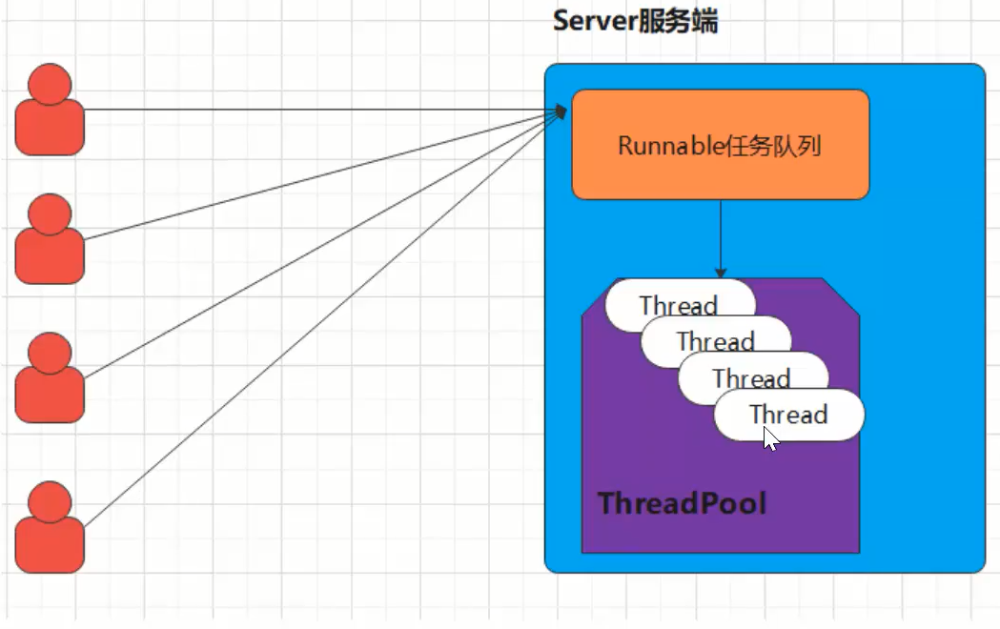
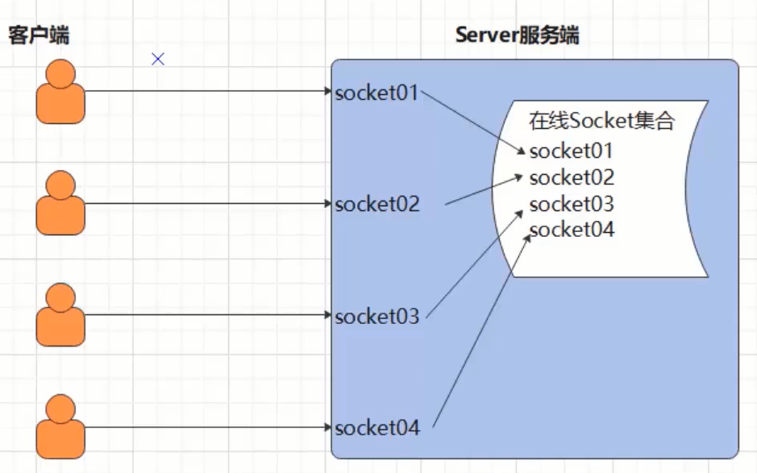

视频：https://www.bilibili.com/video/BV1gz4y1C7RK

参考：https://blog.csdn.net/unique_perfect/article/details/115108640

# BIO简介

**同步并阻塞**(传统阻塞型)，服务器实现模式为一个连接 一个线程，即客户端有连接请求时服务器端就需要启动 一个线程进行处理，如果这个连接不做任何事情会造成不必要的线程开销



Java BIO 就是传统的 java io  编程，其相关的类和接口在 java.io

同步阻塞，服务器实现模式为一个连接一个线程，即客户端有连接请求时服务器端就需要启动一个线程进行处理，如果这个连接不做任何事情会造成不必要的线程开销，可以通过线程池机制改善(实现多个客户连接服务器).

## BIO编程流程

1) 服务器端启动一个 ServerSocket，注册端口，调用accpet方法监听客户端的Socket连接。
2) 客户端启动 Socket对服务器进行通信，默认情况下服务器端需要对每个客户端建立一个线程与之通讯

# 传统的BIO编程演进实例

## 同步阻塞演示

```java
import java.io.BufferedReader;
import java.io.InputStream;
import java.io.InputStreamReader;
import java.net.ServerSocket;
import java.net.Socket;

public class Server {
    public static void main(String[] args) {
        try {
            //1.定义一个ServerSocket对象进行服务端的端口注册
            ServerSocket ss = new ServerSocket(9999);
            //2.监听客户端的Socket连接请求
            Socket socket = ss.accept();
            //3.从socket管道中得到输入流
            InputStream is = socket.getInputStream();
            //事先约定好发的是字符串，所以采用缓存字符输入流
            BufferedReader br = new BufferedReader(new InputStreamReader(is));
            String msg;
            //逐行读取文本字符串，这里是阻塞的，如果不是一行字符串，就一组阻塞
            while ((msg = br.readLine()) != null) {
                System.out.println("服务端收到：" + msg);
            }
        } catch (Exception e) {
            e.printStackTrace();
        }
    }
}

```

```java
import java.io.OutputStream;
import java.io.PrintStream;
import java.net.Socket;

public class Client {
    public static void main(String[] args) {
        try {
            //1.创建Socket对象请求服务端的连接
            Socket socket = new Socket("127.0.0.1", 9999);
            //2.从Socket对象中获取一个字节输出流
            OutputStream os = socket.getOutputStream();
            //包装成打印流
            PrintStream ps = new PrintStream(os);
            ps.print("hello world");
            ps.flush();
        } catch (Exception e) {
            e.printStackTrace();
        }
    }
}
```

执行结果，服务端抛异常：java.net.SocketException: Connection reset

因为客户端是print("hello world")，没有输出换行，服务端的br.readLine()就一组阻塞，然后，由于客户端关闭了，导致连接重置了。

改为ps.println("hello world"); 结果如下：

```
服务端收到：hello world
java.net.SocketException: Connection reset
```

服务端收到了，但是由于while ((msg = br.readLine()) != null)还在等，而客户端已经退出了，服务端就抛异常了。

如果只是发一行，收一行，服务端的while代码可以改为if就行：

```java
if ((msg = br.readLine()) != null) {
    System.out.println("服务端收到：" + msg);
}
```

**小结**

- 在以上通信中，服务端会一致等待客户端的消息，如果客户端没有进行消息的发送，服务端将一直进入阻塞状态。

- 同时服务端是按照行获取消息的，这意味着客户端也必须按照行进行消息的发送，否则服务端将进入等待消息的阻塞状态！

## 多发和多收消息

服务端：

```java
ServerSocket ss = new ServerSocket(9999);
Socket socket = ss.accept();
InputStream is = socket.getInputStream();
BufferedReader br = new BufferedReader(new InputStreamReader(is));
String msg;
while ((msg = br.readLine()) != null) {
    System.out.println("服务端收到：" + msg);
}
```

客户端：

```java
Socket socket = new Socket("127.0.0.1", 9999);
OutputStream os = socket.getOutputStream();
PrintStream ps = new PrintStream(os);
Scanner sc = new Scanner(System.in);
while (true) {
    System.out.println("请输入:");
    String msg = sc.nextLine();
    ps.println(msg);
    ps.flush();
}
```

## 接收多个客户端

在上述的案例中，一个服务端只能接收一个客户端的通信请求。那么如果服务端需要处理很多个客户端的消息通信请求应该如何处理呢，此时我们就需要在服务端引入线程了，也就是说客户端毎发起一个请求,服务端就创建一个新的线程来处理这个客户端的请求，这样就实现了一个客户端一个线程的模型，图解模式如下：


服务端：

```java
ServerSocket ss = new ServerSocket(9999);
while (true) {
    Socket socket = ss.accept();
    new ServerThreadReader(socket).start();
}
```

```java
public class ServerThreadReader extends Thread{
    private Socket socket;

    public ServerThreadReader(Socket socket) {
        this.socket = socket;
    }

    @Override
    public void run() {
        try {
            InputStream is = socket.getInputStream();
            BufferedReader br = new BufferedReader(new InputStreamReader(is));
            String msg;
            while ((msg = br.readLine()) != null) {
                System.out.println(msg);
            }
        } catch (IOException e) {
            e.printStackTrace();
        }
    }
}
```

客户端：

```java
Socket socket = new Socket("127.0.0.1", 9999);
PrintStream ps = new PrintStream(socket.getOutputStream());
Scanner sc = new Scanner(System.in);
while (true) {
    System.out.println("请输入:");
    String msg = sc.nextLine();
    ps.println(msg);
    ps.flush();
}
```

小结

- 每个 Socket接收到，都会创建一个线程，线程的竞争、切换上下文影响性能;
- 每个线程都会占用栈空间和CPU资源
- 并不是每个 socket都迸行IO操作，无意义的线程处理
- 客户端的并发访问増加时。服务端将呈现1:1的线程开销，访问量越大，系统将发生线程栈溢岀，线程创建失败，最终导致进程宕机或者僵死，从而不能对外提供服务

## 伪异步IO

在上述案例中：客户端的并发访问増加时。服务端将呈现1:1的线程开销，访问量越大,系统将发生线程栈溢出,线程创建失败,最终导致进程宕机或者僵死，从而不能对外提供服务。

接下来我们采用一个伪异步IO的通信框架，采用线程池和任务队列实现，当客户端接入时，将客户端的Socket封装成一个Task该任务实现 java.lang.Runnable线程任务接口)交给后端的线程池中进行处理。JDK的线程池维护一个消息队列和N个活跃的线程，对消息队列中 Socket任务进行处理，由于线程池可以设置消息队列的大小和最大线程数，因此，它的资源占用是可控的，无论多少个客户端并发访问，都不会导致资源的耗尽和宕机。



服务端：

```java
ServerSocket ss = new ServerSocket(9999);
HandlerSocketServerPool pool = new HandlerSocketServerPool(6, 10);
while (true) {
    Socket socket = ss.accept();
    Runnable target = new ServerRunnableTarget(socket);
    pool.execute(target);
}

public class ServerRunnableTarget implements Runnable {
    private Socket socket;

    public ServerRunnableTarget(Socket socket) {
        this.socket = socket;
    }

    @Override
    public void run() {
        try {
            InputStream is = socket.getInputStream();
            BufferedReader br = new BufferedReader(new InputStreamReader(is));
            String msg;
            while ((msg = br.readLine()) != null) {
                System.out.println("服务端收到:"+msg);
            }
        } catch (Exception e) {
            e.printStackTrace();
        }
    }
}

public class HandlerSocketServerPool {
    private ExecutorService executorService;

    public HandlerSocketServerPool(int max, int queueSize) {
        executorService = new ThreadPoolExecutor(3, max,
                120, TimeUnit.SECONDS, new ArrayBlockingQueue<>(queueSize));
    }

    public void execute(Runnable target) {
        executorService.execute(target);
    }
}
```

客户端：同上一小节

**小结**

- 伪异步IO采用了线程池实现，因此避免了为每个请求创建一个独立线程造成线程资源耗尽的问题，但由于底层依然是采用的同步阻塞模型，因此无法从根本上解决问题。

- 如果单个消息处理的缓慢，或者服务器线程池中的全部线程都被阻塞，那么后续 socket的IO消息都将在队列中排队。新的 Socket请求将被拒绝，客户端会发生大量连接超时。

# BIO文件上传案例

服务端：

```java
ServerSocket ss = new ServerSocket(8888);
ExecutorService pool = Executors.newCachedThreadPool();
while (true) {
    Socket socket = ss.accept();
    pool.execute(() -> {
        try {
            DataInputStream dis = new DataInputStream(socket.getInputStream());
            String suffix = dis.readUTF();
            OutputStream os = new FileOutputStream("./"+ UUID.randomUUID()+suffix);
            byte[] buffer = new byte[1024];
            int len;
            while ((len = dis.read(buffer)) > 0) {
                os.write(buffer,0,len);
            }
            os.close();
        } catch (Exception e) {
            e.printStackTrace();
        }
    });
}
```

客户端：

```java
Socket socket = new Socket("127.0.0.1",8888);
//包装成一个数据输出流
DataOutputStream dos = new DataOutputStream(socket.getOutputStream());
//先发送文件后缀名
dos.writeUTF(".png");
InputStream is = new FileInputStream("java.png");
byte[] buf = new byte[1024];
int len;
while ((len = is.read(buf)) > 0) {
    dos.write(buf, 0, len);
}
dos.flush();
socket.shutdownOutput();//通知服务端，这边的数据发送完毕了，这句话必须有
is.close();
```

# BIO下的端口转发思想--即时通信案例

需求：实现一个客户端的消息可以发送给所有的客户端去接收。（群聊实现）

功能：

- 登录：客户端输入用户名和服务端ip即可
- 在线人数实时更新
- 离线人数更新
- 群聊
- 私聊
- @消息
- 消息用户和消息时间点



略....

 
