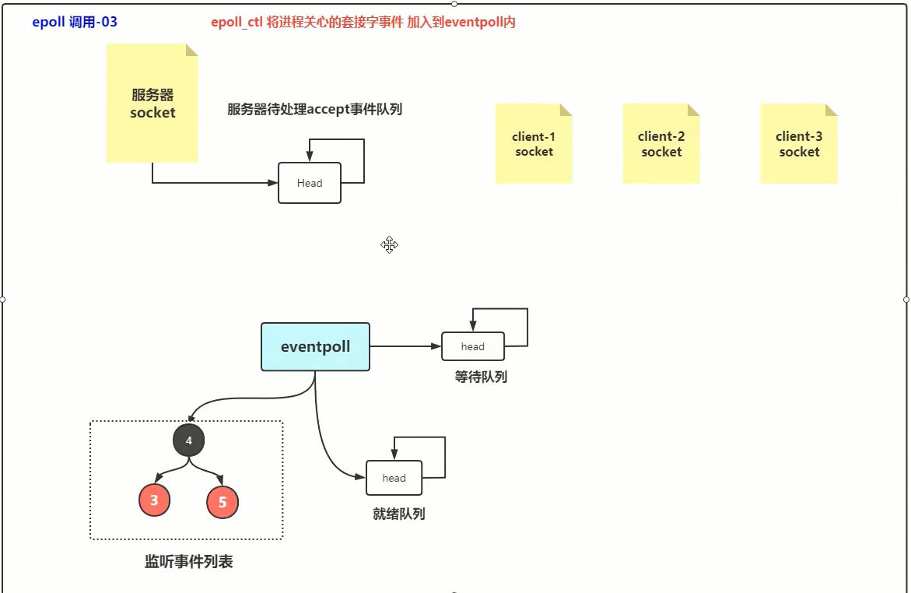

视频：https://www.bilibili.com/video/BV19D4y1o797


推荐阅读：

- https://cloud.tencent.com/developer/article/1857255
- https://blog.csdn.net/lingfengtengfei/article/details/12398299

# 系统中断

硬中断：硬件发起的，可以在任何时候，异步中断。

比如网卡接收到报文，被DMA转移到内存的网卡缓冲区，网卡向CPU发起中断信号，CPU收到后，处理对应的中断处理程序

软中断，系统调用就是借助软中断来完成的，80中断


可编程中断控制器


# socket基础

## demo

```java
import java.io.DataInputStream;
import java.io.DataOutputStream;
import java.io.IOException;
import java.net.ServerSocket;
import java.net.Socket;

public class TCPServer {
    public static void main(String[] args) throws IOException {
        ServerSocket ss = new ServerSocket(6666);
        while (true) {
            Socket s = ss.accept();
            System.out.println("A client connected!");
            DataInputStream dis = new DataInputStream(s.getInputStream());
            DataOutputStream dos = new DataOutputStream(s.getOutputStream());
            String str;
            if ((str = dis.readUTF()) != null) {
                System.out.println(str);
                System.out.println("from "+s.getInetAddress()+",port #"+s.getPort());
            }
            dis.close();
            dos.close();
        }
    }
}
```


```java
import java.io.DataInputStream;
import java.io.DataOutputStream;
import java.io.IOException;
import java.io.OutputStream;
import java.net.Socket;

public class TCPClient {
    public static void main(String[] args) throws IOException {
        try (Socket s = new Socket("127.0.0.1", 6666)) {
            OutputStream os = s.getOutputStream();
            DataOutputStream dos = new DataOutputStream(os);
            dos.writeUTF("Hello,server!");
            DataInputStream dis = new DataInputStream(s.getInputStream());
            System.out.println(dis.readUTF());
            dos.flush();
            dos.close();
            dis.close();
        }
    }
}
```

## socket读写缓冲区


位于内核空间的缓冲区。

对于上面业务代码，执行了OutputStream对象的close方法，若输出缓冲区里还有数据，则不会丢失，还是会发完的，发完后，才会把socket释放。如果InputStream调用了close，输入缓冲区里的数据还没读完，则数据就会丢失。

输出缓冲区小于需要发的数据大小，这次调用会被阻塞，阻塞到缓冲区腾出来空间之后，然后再写。如果TCP正在读取输出缓冲区，会加锁，上层应用写数据时会被阻塞。

写的数据很大时，也会阻塞。

NIO是怎么回事呢

- 缓冲区空间不够写时，上层应用会立马返回

- 读，缓冲区是否有数据，有就返回

TCP协议，保证不丢、保证顺序


# 用户态内核态切换


什么情况下会切换？

- 系统调用
- 外部设备数据就绪，发起中断，CPU响应中断
- 用户代码运行发生了错误，比如除以０

## 系统调用过程


# BIO通信过程

1：


2：


3：


4：


5：


6：


7：


# linux select

## select函数

在linux中，可以使用select函数实现IO端口的复用，传递给select函数的参数会告诉内核：

1、我们所关心的文件描述符

2、对每个描述符，我们所关心的状态

3、我们需要等待多长时间。

从select函数返回后，内核告诉我们一下信息：

1、对我们的要求已经做好准备的描述符的个数

2、对于三种条件哪些描述符已经做好准备(读、写、异常)

有了这些返回信息，我们可以调用合适的IO函数(通常是read或write)，并且这些函数不会再阻塞

Linux select函数接口

```c
#include <sys/select.h>
int select(int maxdfp1,fd_set * readset,fd_set *writeset,fd_set *exceptset,struct timeval * timeout);
```

返回：做好准备的文件描述符的个数，超时为0，错误为-1

先看看最后一个参数，它指明我们需要等待的时间：

```c
struct timeval {
    long tv_sec;//秒
    long tv_usec;//微秒
}
```

有三种情况：

- timeout == NULL 等待无限长的时间
- timeout->tv_sec \==0  && timeout->tv_usec \== 0 不等待，直接返回。（非阻塞）
- timeout->tv_sec \!=0  || timeout->tv_usec \!= 0 等待指定的时间

中间的三个参数 readset，writeset,exceptset，指向描述符集。这些参数指明了我们关心哪些描述符，和需要满足什么条件（可读、可写、异常）。一个文件描述符集保存在fd_set类型中，fd_set其实就是位图。

相应的，linux提供了一组宏。来为fd_set进行赋值等操作。

```c
#include <sys/select.h>

//FD_ZERO 宏将一个fd_set类型变量的所有位都设为0
int FD_ZERO(int df, fd_set *fdset);

//清除某个位时可以使用 FD_CLR
int FD_CLR(int fd, fd_set *fd_set);

//使用 FD_SET 将指定位置的bit值设置为1
int FD_SET(int fd, fd_set *fd_set);

//FD_ISSET 来测试某个位是否被置位
int FD_ISSET(int fd, fd_set *fd_set);
```

int maxfdp是一个整数值，是指集合中所有文件描述符的范围，即所有文件描述符的最大值加1，不能错。

C++使用linux select函数的demo:

```c++
//创建server socket，绑定端口2000，TCP协议
sockfd = socket(AF_INET,SOCK_STREAM,0);
memset(&addr,0,sizeof(addr));
addr.sin_family = AF_INET;
addr.sin_port = htons(2000);
addr.sin_addr.s_addr = INADDR_ANY;
bind(sockfd, (struct sockaddr*)&addr,sizeof(addr));
listen(sockfd,5);//客户端请求队列是5，模拟5个客户端


//处理客户端连接
for(i=0;i<5;i++) {
    memset(&client, 0, sizeof(client));
    addrlen = sizeof(client);
    fds[i] = accept(sockfd, (struct sockaddr*)&client,&addrlen);
    if(fds[i] > max)
        max = fds[i];
}


while(1) {
    FD_ZERO(&rset);
    for(i=0;i<5;i++) {
        FD_SET(fds[i],&rset);
    }
    print("round again");
    select(max + 1, &rset, NULL, NULL, NULL);//触发80中断，进入内核态
    
    for(i=0;i<5;i++) {
        if(FD_ISSET(fds[i], &rset)){
            memset(buffer, 0, MAXBUF);
            read(fds[i], buffer, MAXBUF);
            print(buffer);
        }
    }
}
```

## select原理图


# linux epoll

## epoll函数

epoll是在2.6内核中提出的,是之前的 select和poll的増强版本、相对于  select和poll来说,epoll更加灵活,没有描述符限制。epoll使用一个文件描述符管理多个描述符,将用户关心的文件符的事件存放到内核的一个事件表中,这样在用户空间和内核空间的copy只需一次。

epoll操作作过程需要三个接口,分别如下:

```c
#include <sys/epoll.h>
int epoll_create(int size);

int epoll_ctl(int epfd, int op,int fd, struct epoll_event *event);

int epoll_wait(int epfd, struct epoll_event * events, int maxevents, int timeout);
```

1、**epoll_create**函数是一个系统函数，在内核空间开辟一块新的空间，可以理解位epoll结构空间，返回值位epoll的文件描述符编号，方便后续操作使用。

2、**epoll_ctl** 是epoll的事件注册函数，epoll与select不同，select函数是调用时指定需要监听的描述符和事件，epoll先将用户感兴趣的描述符事件注册到epoll空间内，此函数是非阻塞函数，作用仅仅是增删改epoll空间内的描述符信息。

- 参数一：epfd ，表示epoll结构的进程fd编号，函数将依靠该编号找到对应的epoll结构。

- 参数二：op，表示当前请求类型，由三个宏定义

  - EPOLL_CTL_ADD：注册新的fd到epfd中；
  - EPOLL_CTL_MOD：修改已经注册的fd的监听事件；

  - EPOLL_CTL_DEL：从epfd中删除一个fd；

- 参数三：fd，需要监听的文件描述符，一般指socket_fd。
- 参数四：event，告诉内核对该df资源感兴趣的事件

struct epoll_event结构如下：

```c
struct epoll_event {
    _uint32_t events;//Epoll events
    epoll_data_t data;//User data variable
};
```

events可以是一下几个宏的集合：

- EPOLLIN ：表示对应的文件描述符可以读（包括对端SOCKET正常关闭）；
- EPOLLOUT：表示对应的文件描述符可以写；
- EPOLLPRI：表示对应的文件描述符有紧急的数据可读（这里应该表示有带外数据到来）；
- EPOLLERR：表示对应的文件描述符发生错误；
- EPOLLHUP：表示对应的文件描述符被挂断；
- EPOLLET： 将EPOLL设为边缘触发(Edge Triggered)模式，这是相对于水平触发(LevelTriggered)来说的。
- EPOLLONESHOT：只监听一次事件，当监听完这次事件之后，如果还需要继续监听这个socket的话，需要再次把这个socket加入到EPOLL队列里

3、**epoll_wait** 等待事件的产生，类似于select()调用，根据参数timeout，来决定是否阻塞

- 参数一：epfd，指定感兴趣的epoll事件列表
- 参数二：*events，是一个指针，必须指向一个epoll_even结构数组，当函数返回时，内核会吧就绪状态的数据拷贝到该数组中。
- 参数三：maxevents，表明参数二epoll_event数组最多能接受的数据量，即本次操作最多能获取多少就绪数据。
- 参数四：timeout，单位为毫秒
  - 0表示立即返回，非阻塞调用
  - -1：阻塞调用，直到有用户感兴趣的事件就绪为止。
  - \>0：阻塞调用，阻塞指定时间内如果有事件就绪则提前返回，否则等待指定时间后返回。
- 返回值：本次就绪的fd个数。

**工作模式**

epoll对文件描述符的操作有两种模式：LTτ(水平触发)和ET(边缘触发)。LT模式是默认模式，LT模式与ET模式的区别如下：

- LT(水平触发)：事件就绪后，用户可以选择处理或者不处理，如果用户本次未处理，那么下次调用epol_wait时仍然会将末处理的事件打包绐你。
- ET(边缘触发)：事件就绪后，用户必须处理，因为内核不给你兜底了，内核把就绪的事件打包给你后，就把对应的就绪事件清理掉了。ET模式在很大程度上减少了epoll事件被重复触发的次数，因此效率要比LT模式高。

```c
int epfd = epoll_create(10);
//...省略绑定监听端口
//...
struct epoll_event events[5];
for(i=0; i<5; i++) {
    static struct epoll_event ev;
    memset(&client,0,sizeof(client));
    addrlen = sizeof(client);
    ev.data.fd = accept(sockfd,(struct sockaddr*)&client,&addrlen);
    ev.events = EPOLLIN;
    //将需要监听的socket添加到epfd中
    epoll_ctl(epdf,EPOLL_CTL_ADD,ev.data.fd,&ev);
}

while(1){
    prints("round again");
    nfds = epoll_wait(epfd,events,5,10000);//返回就绪的
    for(i=0; i<5; i++) {
        memset(buffer,0,MAXBUF);
        read(events[i].data,buffer,MAXBUF);
        prints(buffer);
    }
}
```

## epoll原理图





