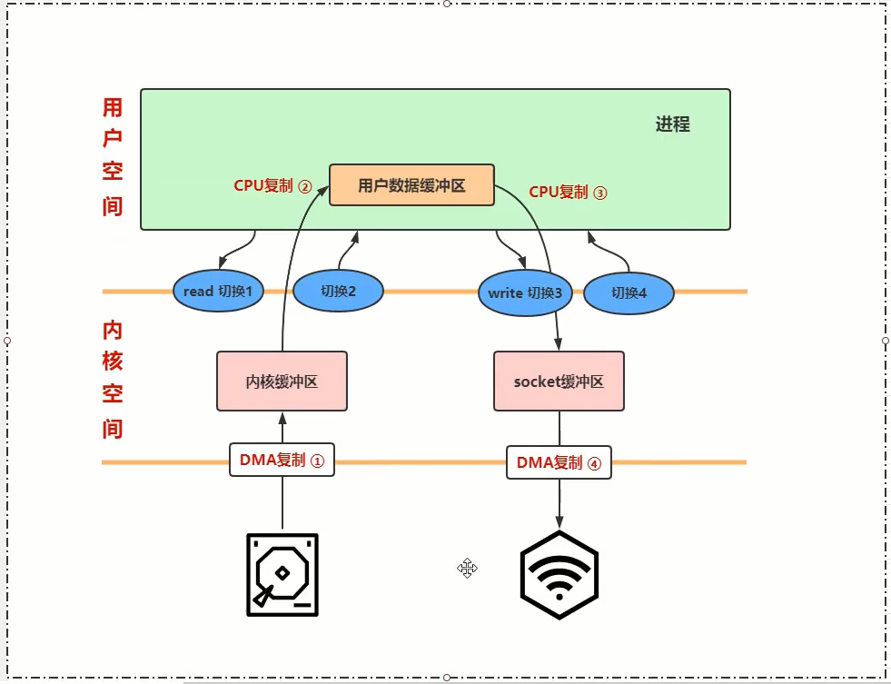
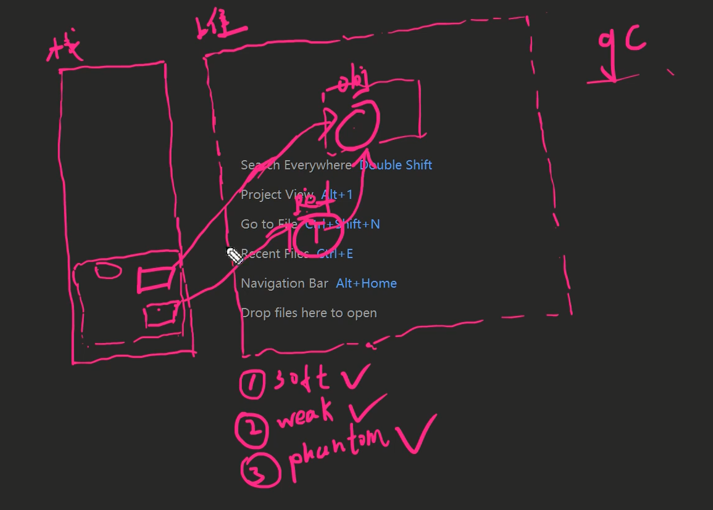

视频：https://www.bilibili.com/video/BV1Bp4y1B7zc

推荐阅读

https://www.cnblogs.com/xiaolincoding/p/13719610.html

https://blog.csdn.net/slslslyxz/article/details/114006711

# DMA


# 用户态内核态切换


# 缓冲区读写


# 虚拟内存


用户空间、内核空间映射到同一块物理内存中，这样文件就不用从内核空间拷贝到用户空间了

# 传统IO

传统IO进行本地磁盘文件发送到网络



数据复制了4次，4次用户态和内核态切换

- 从磁盘拷贝到内核缓冲区（DMA复制）

- 从内核缓冲区拷贝到用户空间缓冲区（CPU复制），用户态切到内核态，再切回来

- 从用户空间缓冲区拷贝到socket缓冲区（CPU复制），用户态切到内核态，再切回来

- 从socket缓冲区拷贝到网卡（DMA复制）

# mmap+write实现零拷贝


把磁盘上的文件映射到内存里，对该文件的读写就操作内存就行

只有一次CPU复制了

4次用户态和内核态切换

# sendfile实现零拷贝


减少了两次用户态内核态切换

# BIO面向流的网络分析

堆、内核空间、外设(网卡)

内核里面有socket读缓socket冲区和写缓冲区

堆：socket outputStream write，**一次write一个字节**

outputStream 中有个小的缓冲区，这个缓冲区满了之后会flush，write系统调用，写到内核的socket写缓冲区里去。

socket写缓冲区满了的话，write系统调用就会把这个线程阻塞住。

DMA进行从缓冲区写到网卡，写完了通知，线程就从阻塞状态到运行状态


# NIO非阻塞面向块的网络分析

NIO中Channel，底层还是socket

Channel写的是buffer块，是byte数组，有起点position、长度等信息

块传输的问题：jvm有GC，GC时整理内存，buffer在内存中的位置就变了。

所以NIO使用了堆外内存，所以JVM先把buffer拷贝到堆外内存中（CPU拷贝），而且这个拷贝是在GC的安全点以外拷贝的（JVM会在安全点进行GC）。再发起write系统调用操作写到内核的socket缓存区里，这样GC就不影响buffer了。然后DMA再把内核socket缓存区的数据写到网卡。


在JDK的SocketChannelImpl类的源码中的write方法：


使用了IOUtil.write()


会一上来判断这个buffer是不是堆外内存，是的话，就调用wirteFromNativeBuffer进行写，写入socket缓冲区。

如果是堆内的话，先获取临时的堆外空间，大小和当前的buffer一样大，把buffer里数据拷贝到这个堆外空间，然后调用调用wirteFromNativeBuffer进行写。

# 堆外内存如何释放--Cleaner

DirectByteBuffer的构造函数如下:


cleaner对象是负责回收堆外内存的，传入了Deallocator对象：


里面的run方法中调用了UNSAFE.freeMemory()进行释放内存，这是个native方法，底层进行了系统调用。

再来看Clear类:

```java
public class Cleaner extends PhantomReference<Object>
{
    //...
}
```

PhantomReference是**虚引用**，Reference**对象**是存放在堆中

## 强软弱虚引用

栈里有个对象的引用，指向堆中的Reference**对象**，而Reference**对象**又指向了堆中被引用的对象



**虚引用**拿到的对象永远是null，即便这个对象没有被回收，即便还是可达的。


当对象不可达，当被软、弱、虚引用时：

软引用：软引用指向的对象，内存足够时，垃圾回收不会回收掉它，但是当内部不足时，垃圾回收会回收掉。

弱引用：当垃圾回收时，不管内存够不够，弱引用指向的对象会被回收掉。

虚引用：获取虚引用指向的对象时，始终是null，为啥是null，我理解为确保对象不会被拿出来导致强引用。当垃圾回收时，虚引用指向的对象会被回收掉，同时**虚引用对象本身会被放进引用队列中**，因此可以用虚引用来记录哪些对象被垃圾回收。所以虚引用专门用来标记对象是否被回收。

还有，软引用和弱引用也可以搭配引用队列使用，而虚引用则是必须搭配引用队列。

软引用、弱引用、虚引用的父类是Reference。Reference指向的对象(没有其他强引用的话)，GC可达性算法不会认为是该可达的。

```java
public abstract class Reference<T> {
    //保存真实对象的引用
    private T referent;  
    //引用队列,方便后续判断指定对象是否被gc回收掉
    volatile ReferenceQueue<? super T> queue;
    //链表的下一个指向，组装成ReferenceQueue使用,ReferenceQueue是单向链表队列
    volatile Reference next;
    //JVM要用的.Vm线程在判定当前ref中的真实对象是垃圾后,会将当前ref加入到 pending队列, pending队列是一个单向链表,使用discovered字段连按起来
    private transient Reference<?> discovered;
    //pending链表的头字段。pending链表元素追加操作,是由jvm垃圾收集器线程追加
    //消费线程会从头开始消费，pending队列是一个先进后出的队列
    private static Reference<Object> pending = null;
}
```

Reference中有个ReferenceHandler对象，此对象继承了Thread，而且是个守护线程，run方法里是while true，里面在调用processPendingReferences()。而且ReferenceHandler在static代码块中，只有一份。


## Reference对象的四种状态

Active、Pending、Enqueded、Inactive

Reference对象被创建出来时，是Active状态，也就是说referent对象还是关联了强引用的。

referent对象成为垃圾，在GC时，referent对象被放入pengding队列，此时referent对象是Pending状态

ReferenceHandler这个守护线程会消费pengding队列中的对象，如果指定了引用队列的话，就把referent对象放入引用队列中，此时状态变成Enqueded状态。

没有指定引用队列的话，就变成了Inactive状态

调用引用队列的出队，此时对象又会变成Inactive状态


## 过程

