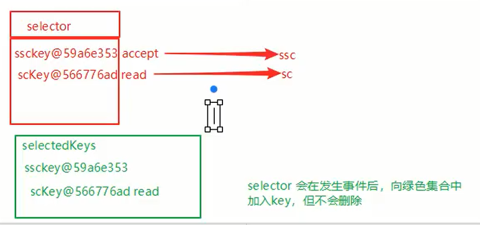

视频：

- https://www.bilibili.com/video/BV1gz4y1C7RK
- https://www.bilibili.com/video/BV1py4y1E7oA

参考：

- https://zhuanlan.zhihu.com/p/256355788
- https://blog.csdn.net/unique_perfect/article/details/115108640

# 1.NIO简介

- Java NIO（New IO）是从Java 1.4版本开始引入的一个新的IO API，可以替代标准的Java IO API。NIO与原来的IO有同样的作用和目的，但是使用的方式完全不同，NIO支持面向缓冲区的、基于通道的IO操作。NIO将以更加高效的方式进行文件的读写操作。
- 同步非阻塞，服务器实现模式为一个线程处理 多个请求(连接)，即客户端发送的连接请求都会注册到多路 复用器上，**多路复用器**轮询到连接有 I/O 请求就进行处理 




NIO 方式适用于**连接数目多且连接比较短**（轻操作）的架构，比如聊天服务器，弹幕系统，服务器间通讯等。

**Java NIO 与 IO 的主要区别**

|           IO            |             NIO             |
| :---------------------: | :-------------------------: |
| 面向流(Stream Oriented) | 面向缓冲区(Buffer Oriented) |
|   阻塞IO(Blocking IO)   |  非阻塞IO(Non Blocking IO)  |
|          (无)           |      选择器(Selectors)      |


### 三大核心组件

- **Buffer缓冲区**

缓冲区本质上是一块可以写入数据，然后可以从中读取数据的内存。这块内存被包装成NIO Buffer对象，并提供了一组方法，用来方便的访问该块内存。相比较直接对数组的操作，Buffer API更加容易操作和管理。

- **Channel（通道）**

Java NIO的通道类似流，但又有些不同：既可以从通道中读取数据，又可以写数据到通道。但流的（input或output)读写通常是单向的。 通道可以非阻塞读取和写入通道，通道可以支持读取或写入缓冲区，也支持异步地读写。

- **Selector选择器**

Selector是 一个Java NIO组件，可以能够检查一个或多个 NIO 通道，并确定哪些通道已经准备好进行读取或写入。这样，一个单独的线程可以管理多个channel，从而管理多个网络连接，提高效率


- 每个 channel 都会对应一个 Buffer
- 一个线程对应Selector ， 一个Selector对应多个 channel(连接)
- 程序切换到哪个 channel 是由事件决定的
- Selector 会根据不同的事件，在各个通道上切换
- Buffer 就是一个内存块 ， 底层是一个数组
- 数据的读取写入是通过 Buffer完成的 , BIO 中要么是输入流，或
  者是输出流, 不能双向，但是 NIO 的 Buffer 是可以读也可以写。
- Java NIO系统的核心在于：通道(Channel)和缓冲区 (Buffer)。**通道表示打开到 IO 设备(**例如：文件、 套接字)的连接。若需要使用 NIO 系统，需要获取 用于连接 IO 设备的通道以及用于容纳数据的缓冲 区。然后操作缓冲区，对数据进行处理。简而言之，**Channel 负责传输， Buffer 负责存取数据**

# 2.缓冲区（Buffer）


## Buffer类介绍

**缓冲区（Buffer）**：一个用于特定基本数据类型的容器。由 java.nio 包定义的，所有缓冲区都是 Buffer 抽象类的子类。

Java NIO 中的 **Buffer** 主要用于与 NIO 通道进行交互，数据是从通道读入缓冲区，从缓冲区写
入通道中的。

Buffer 就像一个数组，可以保存多个相同类型的数据。根据数据类型不同(boolean 除外) ，有以下 Buffer 常用子类：

- ByteBuffer
  - MappedByteBuffer
  - DirectByteBuffer
  - HeapByteBuffer

- CharBuffer
- ShortBuffer
- IntBuffer
- LongBuffer
- FloatBuffer
- DoubleBuffer

上述 Buffer 类 他们都采用相似的方法进行管理数据，只是各自管理的数据类型不同而已。都是通过如下方法获取一个 Buffer 对象：

```java
static XxxBuffer allocate(int capacity);
```

## 缓冲区的基本属性

**容量** **(capacity)** **：**表示 Buffer 最大数据容量，缓冲区容量不能为负，并且创建后**不能更改**。

**限制 (limit)**：第一个不应该读取或写入的数据的索引，表示**缓冲区中可以操作数据的大小**，即**位于 limit 后的数据不可读写**。缓冲区的限制不能为负，并且**不能大于其容量**。写入模式，limit等于buffer的容量。读取模式，limit等于写入的数据量（因为读到最后时，buffer可能没满，所以小于capacity）。

**位置 (position)**：下一个要读取或写入的数据的索引。缓冲区的位置不能为负，并且不能大于其限制

**标记 (mark)**与**重置 (reset)**：标记是一个索引，通过 Buffer 中的 mark() 方法指定 Buffer 中一个特定的 position，之后可以通过调用 reset() 方法恢复到这个 position。可以将当前的position临时存入mark中；需要的时候，可以再从mark标记恢复到position位置。

标记、位置、限制、容量遵守以下不变式：  **mark <= position <= limit <= capacity**


```java
@Test
    public void test1(){
        String str= "abcde";
        //1.分配一个指定大小的缓冲区
        ByteBuffer buffer = ByteBuffer.allocate(1024);
        System.out.println("--------allocate()-------");
        System.out.println(buffer.position());//0
        System.out.println(buffer.limit());//1024
        System.out.println(buffer.capacity());//1024
        //2.利用put()存入数据到缓冲区中
        buffer.put(str.getBytes());
        System.out.println("--------put()-------");
        System.out.println(buffer.position());//5
        System.out.println(buffer.limit());//1024
        System.out.println(buffer.capacity());//1024
        //3.切换成读取数据模式
        buffer.flip();
        System.out.println("--------flip()-------");
        System.out.println(buffer.position());//0
        System.out.println(buffer.limit());//5
        System.out.println(buffer.capacity());//1024
        //4.利用get()读取缓冲区的数据
        byte[] dst = new byte[buffer.limit()];
        buffer.get(dst);
        System.out.println(new String(dst));
        System.out.println("--------get()-------");
        System.out.println(buffer.position());//5
        System.out.println(buffer.limit());//5
        System.out.println(buffer.capacity());//1024
        //5.rewind()可重复度数据
        buffer.rewind();
        System.out.println("--------rewind()-------");
        System.out.println(buffer.position());//0
        System.out.println(buffer.limit());//5
        System.out.println(buffer.capacity());//1024
        //6.clear()清空缓冲区，但是，缓冲区中的数据依然存在，但是处于“被遗忘状态”
        buffer.clear();
        System.out.println("--------clear()-------");
        System.out.println(buffer.position());//0
        System.out.println(buffer.limit());//1024
        System.out.println(buffer.capacity());//1024
        System.out.println((char)buffer.get());//a

    }
```

mark()与reset()

```java
@Test
public void test2(){
    String str= "abcde";
    ByteBuffer buffer = ByteBuffer.allocate(1024);
    buffer.put(str.getBytes());
    buffer.flip();
    byte[] dst = new byte[buffer.limit()];
    buffer.get(dst,0,2);
    System.out.println(new String(dst,0,2));//ab
    System.out.println(buffer.position());//2
    //mark()标记一下
    buffer.mark();
    buffer.get(dst,2,2);
    System.out.println(new String(dst,2,2));//cd
    System.out.println(buffer.position());//4
    //rest()：恢复到mark的位置
    buffer.reset();
    System.out.println(buffer.position());//2

    //判断缓冲区中是否还有剩余数据
    if (buffer.hasRemaining()){
        //获取缓冲区中可以操作的数量
        System.out.println(buffer.remaining());//3
    }
}
```

## Buffer的常用方法总结

```java
Buffer clear() 	//清空缓冲区并返回对缓冲区的引用，只是将位置重置，并没有清除里面的数据
Buffer flip() //将缓冲区的界限设置为当前位置，并将当前位置充值为 0。即将写入模式翻转成读取模式
int capacity() //返回 Buffer 的 capacity 大小
boolean hasRemaining() //判断缓冲区中是否还有元素
int limit() //返回 Buffer 的界限(limit) 的位置
Buffer limit(int n) //将设置缓冲区界限为 n, 并返回一个具有新 limit 的缓冲区对象
Buffer mark() //对缓冲区设置标记，将当前position的值保存起来，放在mark属性中，让mark属性记住这个临时位置；之后，可以调用Buffer.reset()方法将mark的值恢复到position中
int position() //返回缓冲区的当前位置 position
Buffer position(int n) //将设置缓冲区的当前位置为 n , 并返回修改后的 Buffer 对象
int remaining() //返回 position 和 limit 之间的元素个数
Buffer reset() //将位置 position 转到以前设置的 mark 所在的位置
Buffer rewind() //将位置设为为 0， 取消设置的 mark。已经读完的数据，如果需要再读一遍，可以调用rewind()方法。rewind()也叫倒带，就像播放磁带一样倒回去，再重新播放。
```

Buffer的模式转换，大致如下图所示:


```java
ByteBuffer buf = ByteBuffer.allocate(10);
buf.put("potato!".getBytes());
buf.flip();
byte[] b = new byte[2];
buf.get(b);
String s = new String(b);
System.out.println(s);
System.out.println("position:"+buf.position());//2
System.out.println("limit:"+buf.limit());//7
System.out.println("capacity:"+buf.capacity());//10
System.out.println("--------");
buf.mark();//标记这个位置
byte[] b2 = new byte[3];
buf.get(b2);
System.out.println(new String(b2));
System.out.println("position:"+buf.position());//5
System.out.println("limit:"+buf.limit());//7
System.out.println("capacity:"+buf.capacity());//10
System.out.println("--------");
buf.reset();
if (buf.hasRemaining()) {
    System.out.println(buf.remaining());//5
}
```

## 缓冲区的数据读写

- 获取 Buffer 中的数据
  - get() ：读取单个字节，每次从position的位置读取一个数据，并且进行相应的缓冲区属性的调整。
  - get(byte[] dst)：批量读取多个字节到 dst 中
  - get(int index)：读取指定索引位置的字节(不会移动 position)

- 放入数据到 Buffer 中
  - put(byte b)：将给定单个字节写入缓冲区的当前位置
  - put(byte[] src)：将 src 中的字节写入缓冲区的当前位置
  - put(int index, byte b)：将指定字节写入缓冲区的索引位置(不会移动 position)

使用Buffer读写数据一般是这么个步骤：

1. 写入数据到 Buffer
2. 调用flip()方法,转换为读取模式
3. 从 Buffer中读取数据
4. 调用 buffer.clear()方法或者 buffer.compact()方法清除缓冲区

## 直接与非直接缓冲区

- 字节缓冲区要么是直接的，要么是非直接的。如果为直接字节缓冲区，则 Java 虚拟机会尽最大努力直接在此缓冲区上执行本机 I/O 操作。也就是说，在每次调用基础操作系统的一个本机 I/O 操作之前（或之后），虚拟机都会尽量避免将缓冲区的内容复制到中间缓冲区中（或从中间缓冲区中复制内容）。

- 直接字节缓冲区可以通过调用此类的 **allocateDirect**() 工厂方法来创建。此方法返回的缓冲区进行**分配和取消分配所需成本通常高于非直接缓冲区**。直接缓冲区的内容可以驻留在常规的垃圾回收堆之外，因此，它们对应用程序的内存需求量造成的影响可能并不明显。所以，建议将直接缓冲区主要分配给那些易受基础系统的本机 I/O 操作影响的大型、持久的缓冲区。一般情况下，最好仅在直接缓冲区能在程序性能方面带来明显好处时分配它们。
- 直接字节缓冲区还可以通过 FileChannel 的 map() 方法 将文件区域直接映射到内存中来创建。该方法返回MappedByteBuffer 。Java 平台的实现有助于通过 JNI 从本机代码创建直接字节缓冲区。如果以上这些缓冲区中的某个缓冲区实例指的是不可访问的内存区域，则试图访问该区域不会更改该缓冲区的内容，并且将会在访问期间或稍后的某个时间导致抛出不确定的异常。
- 字节缓冲区是直接缓冲区还是非直接缓冲区可通过调用其 isDirect() 方法来确定。提供此方法是为了能够在性能关键型代码中执行显式缓冲区管理。

从数据流角度，非直接内存是这样的作用链：

```
本地IO-->直接内存(内核)-->非直接内存-->直接内存(内核)-->本地IO
```

而直接内存是：

```
本地IO-->直接内存(内核)-->本地IO
```

使用场景：

- 有很大的数据需要存储，它的生命周期又很长
- 适合频繁IO操作，比如网络并发场景。

**非直接缓冲区**

​												OS                                               JVM


**直接缓冲区**


```java
    @Test
    public void test3(){
        //分配直接缓冲区
        ByteBuffer buffer = ByteBuffer.allocateDirect(1024);
        System.out.println(buffer.isDirect());//true
    }
```

- HeapByteBuffer Java堆内存，读写效率低，分配内存效率高，受到GC的影响(对象在内存中发生移动搬迁)
- DirectByteBuffer 直接内存，**读写效率高**(少一次拷贝)，**分配内存效率低**，不受GC影响

## Bytebuffer粘包拆包分析

网上有多条数据发送给服务端，数据之间使用\n进行分隔但由于某种原因这些数据在接收时，被进行了重新组合，例如原始数据有3条为：

```
Hello, world\n
I'm zhangsan \n
How are you?\n
```

变成了下面的两个 bytebuffer

```
Hello, world\nI'm zhangsan \nHo
W are you?\n
```

现在要求你编写程序,将错乱的数据恢复成原始的按\n分隔的数据

粘包：因为为了效率高，把好几个数据一次性发了

拆包：缓冲区塞满了，被拆开

```java
@Test
void test() {
    ByteBuffer source = ByteBuffer.allocate(32);
    source.put("Hello, world\nI'm zhangsan\nHo".getBytes());
    split(source);
    source.put("w are you?\n".getBytes());
    split(source);
}
private void split(ByteBuffer source) {
    source.flip();
    for (int i = 0; i < source.limit(); i++) {
        if (source.get(i)=='\n') {//get(i)不会导致指针移动
            //把这条消息存入新的bytebuffer
            int length = i + 1 - source.position();
            ByteBuffer target = ByteBuffer.allocate(length);
            //从source向target写
            for (int j = 0; j < length; j++) {
                target.put(source.get());
            }
        }
    }
    //将未读完的数据，移到数据前面，便于下次读
    source.compact();
}
```

这写法，不是很高效，后续再将

# 3.通道（Channel）

Channel是读写数据的双向通道，类似Stream，可以从Channel将数据读入buffer，也可以将buffer的数据写入channel，而之前的stream要么是输入，要么是输出，Channel比Stream更为底层

通道（Channel）：由 java.nio.channels 包定义的。Channel 表示 IO 源与目标打开的连接。Channel 类似于传统的“流”。只不过 Channel 本身不能直接访问数据，Channel 只能与Buffer 进行交互。


## **Channel 接口实现类**

Java 为 **Channel 接口**提供的最主要**实现类**如下：

- **FileChannel**：用于读取、写入、映射和操作文件的通道。
- **DatagramChannel**：通过 UDP 读写网络中的数据通道。
- **SocketChannel**：通过 TCP 读写网络中的数据。
- **ServerSocketChannel**：可以监听新进来的 TCP 连接，对每一个新进来的连接都会创建一个 SocketChannel。

## **获取通道**

获取通道的一种方式是对支持通道的对象调用getChannel() 方法。支持通道的类如下：

- FileInputStream
- FileOutputStream
- RandomAccessFile
- DatagramSocket
- Socket
- ServerSocket

获取通道的其他方式是使用 Files 类的静态方法 newByteChannel() 获取字节通道。或者通过通道的静态方法 open() 打开并返回指定通道。

## FileChannel文件通道

不能直接获取FileChannel，需要通过FileInputStream、FileOutputStream、RamdomAccessFile来获取FileChannel。

- FileInputStream获取的channel只能读
- FileOutputStream获取的channel只能写
- RamdomAccessFile获取的channel是否能读写根据构造RamdomAccessFile时的读写模式决定

```java
int read(ByteBuffer dst);//从Channel中读取到数据到ByteBuffer
long read(ByteBuffer[] dsts);//将Channel中的数据"分散"到ByteBuffer[]
int write(ByteBuffer src);//将ByteBuffer中的数据写入到Channel
long write(ByteBuffer[] srcs);//将ByteBuffer[]的数据聚集到Channel
long position();//返回此通道的文件位置
FileChannel posiotn(long p);//设置此通道的文件位置
long size();//返回此通道的文件的当前大小
FileChannel truncate(long s);//将此通道的文件截取为给定大小
void force(boolean metaData);//强制将所有对此通道的文件更新写入导到存储设备中。因为操作系统处于性能的考虑，会将数据缓存，而不是立即写入磁盘
```

### 案例1-本地文件写数据

使用ByteBuffer和FileChannel，将"hello,Potato程序员!"写入到data.txt中

```java
//字节输出流通向文件
FileOutputStream fos = new FileOutputStream("src/main/java/nio/channel/data01.txt");
//都得到输出流对应的Channel
FileChannel channel = fos.getChannel();
//分配缓冲区
ByteBuffer buffer = ByteBuffer.allocate(1024);
buffer.put("hello,Potato程序员!".getBytes());
//缓冲区切换成写出模式
buffer.flip();
channel.write(buffer);
fos.close();
```

### 案例2-本地文件读数据

使用ByteBuffer和FileChannel，将data01.txt中的数据读入程序，并显示

```java
FileInputStream fis = new FileInputStream("src/main/java/nio/channel/data01.txt");
FileChannel channel = fis.getChannel();
ByteBuffer buffer = ByteBuffer.allocate(1024);
//数据读取到缓冲区
channel.read(buffer);
buffer.flip();
System.out.println(new String(buffer.array(),0,buffer.remaining()));
fis.close();
```

### 案例3-使用buffer完成文件复制

```java
@Test
void testCopy() throws Exception {
    long start = System.currentTimeMillis();
    String srcFile = "D:\\迅雷下载\\龙之家族.House.of.the.Dragon.S01E07.1080p.H265-NEW字幕组.mp4";
    String destFile = "D:\\迅雷下载\\龙之家族.House.of.the.Dragon.S01E07.1080p.H265-NEW字幕组-copy.mp4";
    FileInputStream fis = new FileInputStream(srcFile);
    FileOutputStream fos = new FileOutputStream(destFile);
    FileChannel is = fis.getChannel();
    FileChannel os = fos.getChannel();
    ByteBuffer buffer = ByteBuffer.allocate(1204);
    while (is.read(buffer) > -1) {
        //切换到读取模式
        buffer.flip();
        os.write(buffer);
        //先清空缓冲区，再写入
        buffer.clear();
    }
    fis.close();
    fos.close();
    long end = System.currentTimeMillis();
    System.out.println("复制完成，耗时:"+(end-start)+" ms");//16163
}
```


```java
//使用直接缓冲区完成文件的复制（内存映射文件）
@Test
void testCopy2() throws Exception {
    long start = System.currentTimeMillis();
    String srcFile = "D:\\迅雷下载\\龙之家族.House.of.the.Dragon.S01E07.1080p.H265-NEW字幕组.mp4";
    String destFile = "D:\\迅雷下载\\龙之家族.House.of.the.Dragon.S01E07.1080p.H265-NEW字幕组-copy.mp4";
    FileChannel inChannel = FileChannel.open(Paths.get(srcFile), READ);
    FileChannel outChannel = FileChannel.open(Paths.get(destFile), WRITE, READ, CREATE);
    //内存映射文件
    MappedByteBuffer inMapBuffer = inChannel.map(FileChannel.MapMode.READ_ONLY, 0, inChannel.size());
    MappedByteBuffer outMapBuffer = outChannel.map(FileChannel.MapMode.READ_WRITE, 0, inChannel.size());

    //直接对缓冲区进行数据的读写操作
    byte[] dst = new byte[inMapBuffer.limit()];
    inMapBuffer.get(dst);
    outMapBuffer.put(dst);

    inChannel.close();
    outChannel.close();
    long end = System.currentTimeMillis();
    System.out.println("复制完成，耗时:："+(end-start)+" ms");//1027 ms
}
```


### 案例4-分散(Scatter)和聚集(Gather)

- 分散读取（Scattering Reads）是指从 Channel 中读取的数据“分散”到多个 Buffer 中。


注意：按照缓冲区的顺序，从 Channel 中读取的数据依次将 Buffer 填满。

- 聚集写入（Gathering Writes）是指将多个 Buffer 中的数据“聚集”到 Channel


注意：按照缓冲区的顺序，写入 position 和 limit 之间的数据到 Channel 。

```java
FileInputStream fis = new FileInputStream("src/main/java/nio/channel/data01.txt");
FileOutputStream fos = new FileOutputStream("src/main/java/nio/channel/data02.txt");
FileChannel isChannel = fis.getChannel();
FileChannel osChannel = fos.getChannel();
ByteBuffer buffer1 = ByteBuffer.allocate(4);
ByteBuffer buffer2 = ByteBuffer.allocate(1024);
ByteBuffer[] buffers = {buffer1, buffer2};

isChannel.read(buffers);
for (ByteBuffer buffer : buffers) {
    buffer.flip();//切换到读
    System.out.println(new String(buffer.array(),0,buffer.remaining()));
}

//聚集写入到通道
osChannel.write(buffers);
fis.close();
fos.close();
```

### 案例5-transferFrom和transferTo

底层使用了操作系统的零拷贝进行优化

**transferFrom()**

将数据从源通道传输到其他 Channel 中：

transferFrom(来自哪个通道fromChannel），最多传输的字节数(fromChannel.size()),传输位置（0）)

**transferTo()**

将数据从源通道传输到其他 Channel 中：

transferTo(传输位置（0），最多传输的字节数(toChannel.size()),传输位置（0）,去哪个通道(toChannel))


```java
@Test
void testTransfer()  throws IOException{
    FileInputStream fis = new FileInputStream("src/main/java/nio/channel/data01.txt");
    FileOutputStream fos = new FileOutputStream("src/main/java/nio/channel/data03.txt");
    FileChannel isChannel = fis.getChannel();
    FileChannel osChannel = fos.getChannel();
    //内部使用 MappedByteBuffer 进行传输
    //osChannel.transferFrom(isChannel, isChannel.position(), isChannel.size());
    isChannel.transferTo(isChannel.position(), isChannel.size(), osChannel);
    fis.close();
    fos.close();
}
```


```java
    //通道之间的数据传输(直接缓冲区)
    @Test
    public void  test3() throws IOException{
        FileChannel inChannel = FileChannel.open(Paths.get("1.jpg"), StandardOpenOption.READ);
        FileChannel outChannel = FileChannel.open(Paths.get("4.jpg"), StandardOpenOption.WRITE,StandardOpenOption.READ,StandardOpenOption.CREATE);

//        inChannel.transferTo(0,inChannel.size(),outChannel);
        outChannel.transferFrom(inChannel,0,inChannel.size());
        inChannel.close();
        outChannel.close();
    }
```


```java
@Test
    public void test4() throws IOException {
        RandomAccessFile raf1 = new RandomAccessFile("1.txt","rw");

        //1.获取通道
        FileChannel channel1 = raf1.getChannel();

        //2.分配指定大小的缓冲区
        ByteBuffer buf1 = ByteBuffer.allocate(100);
        ByteBuffer buf2 = ByteBuffer.allocate(1024);

        //3.分散读取
        ByteBuffer[] bufs = {buf1,buf2};
        channel1.read(bufs);
        for (ByteBuffer byteBuffer : bufs) {
            byteBuffer.flip();
        }
        System.out.println(new String(bufs[0].array(),0,bufs[0].limit()));
        System.out.println("-----------------");
        System.out.println(new String(bufs[1].array(),0,bufs[1].limit()));

        //4.聚集写入
        RandomAccessFile raf2 = new RandomAccessFile("2.txt","rw");
        FileChannel channel2= raf2.getChannel();

        channel2.write(bufs);
    }
```


```java
 //字符集
    @Test
    public void test6() throws CharacterCodingException {
        Charset cs1 = Charset.forName("GBK");

        //获取编码器
        CharsetEncoder ce = cs1.newEncoder();

        //获取解码器
        CharsetDecoder cd = cs1.newDecoder();

        CharBuffer cBuffer = CharBuffer.allocate(1024);
        cBuffer.put("获取解码器");
        cBuffer.flip();

        //编码
        ByteBuffer bBuffer = ce.encode(cBuffer);

        for (int i = 0; i < 12; i++) {
            System.out.println(bBuffer.get());

        }

        //解码
        bBuffer.flip();
        CharBuffer decode = cd.decode(bBuffer);
        System.out.println(decode.toString());

        System.out.println("----------");
        Charset cs2 = Charset.forName("UTF-8");
        bBuffer.flip();
        CharBuffer cBuffer3 = cs2.decode(bBuffer);
        System.out.println(cBuffer3.toString());


    }

    @Test
    public void test5(){
        Map<String, Charset> map = Charset.availableCharsets();
        Set<Map.Entry<String, Charset>> set = map.entrySet();
        for (Map.Entry<String, Charset> entry : set) {
            System.out.println(entry.getKey()+"="+entry.getValue());
        }
    }

    @Test
    public void test4() throws IOException {
        RandomAccessFile raf1 = new RandomAccessFile("1.txt","rw");

        //1.获取通道
        FileChannel channel1 = raf1.getChannel();

        //2.分配指定大小的缓冲区
        ByteBuffer buf1 = ByteBuffer.allocate(100);
        ByteBuffer buf2 = ByteBuffer.allocate(1024);

        //3.分散读取
        ByteBuffer[] bufs = {buf1,buf2};
        channel1.read(bufs);
        for (ByteBuffer byteBuffer : bufs) {
            byteBuffer.flip();
        }
        System.out.println(new String(bufs[0].array(),0,bufs[0].limit()));
        System.out.println("-----------------");
        System.out.println(new String(bufs[1].array(),0,bufs[1].limit()));

        //4.聚集写入
        RandomAccessFile raf2 = new RandomAccessFile("2.txt","rw");
        FileChannel channel2= raf2.getChannel();

        channel2.write(bufs);
    }
```

#### transfer传输2G以上的文件

transferFrom和transferTo一次只能传输2G的文件，怎么改进呢，多次传输

```java
try (FileChannel from = new FileInputStream("data.txt").getChannel();
     FileChannel to = new FileOutputStream("to.txt").getChannel();) {
    long size = from.size();
    //left变量代表还剩余多少字节
    for (long left = size; left > 0;) {
        left -= from.transferTo((size-left), left, to);
    }
}
```


# 4.**NIO** **的非阻塞式网络通信**

```java
/**
 * 一、使用NIO完成网络通信的三个核心：
 * 1.通道（Channel）：负责连接
 *     java.nio.channels.Channel 接口：
 *         --SelectableChannel
 *             --SocketChannel
 *             --ServerSocketChannel
 *             --DatagramChannel
 *
 *             --Pipe.SinkChannel
 *             --Pipe.SourceChannel
 *
 * 2.缓冲区（Buffer)： 负责数据的存取
 *
 * 3.选择器（Selector）;是SelectableChannel 的多路复用器。用于监控SelectableChannel的IO状况
 */
```

## 阻塞与非阻塞

传统的 IO 流都是阻塞式的。也就是说，当一个线程调用 read() 或 write() 时，该线程被阻塞，直到有一些数据被读取或写入，该线程在此期间不能执行其他任务。因此，在完成网络通信进行 IO 操作时，由于线程会阻塞，所以服务器端必须为每个客户端都提供一个独立的线程进行处理，当服务器端需要处理大量客户端时，性能急剧下降。

Java NIO 是非阻塞模式的。当线程从某通道进行读写数据时，若没有数据可用时，该线程可以进行其他任务。线程通常将非阻塞 IO 的空闲时间用于在其他通道上执行 IO 操作，所以单独的线程可以管理多个输入和输出通道。因此，NIO 可以让服务器端使用一个或有限几个线程来同时处理连接到服务器端的所有客户端。

**阻塞**

* 阻塞模式下，相关方法都会导致线程暂停
  * ServerSocketChannel.accept 会在没有连接建立时让线程暂停
  * SocketChannel.read 会在没有数据可读时让线程暂停
  * 阻塞的表现其实就是线程暂停了，暂停期间不会占用 cpu，但线程相当于闲置
* 单线程下，阻塞方法之间相互影响，几乎不能正常工作，需要多线程支持
* 但多线程下，有新的问题，体现在以下方面
  * 32 位 jvm 一个线程 320k，64 位 jvm 一个线程 1024k，如果连接数过多，必然导致 OOM，并且线程太多，反而会因为频繁上下文切换导致性能降低
  * 可以采用线程池技术来减少线程数和线程上下文切换，但治标不治本，如果有很多连接建立，但长时间 inactive，会阻塞线程池中所有线程，因此不适合长连接，只适合短连接

**非阻塞**

* 非阻塞模式下，相关方法都会不会让线程暂停
  * 在 ServerSocketChannel.accept 在没有连接建立时，会返回 null，继续运行
  * SocketChannel.read 在没有数据可读时，会返回 0，但线程不必阻塞，可以去执行其它 SocketChannel 的 read 或是去执行 ServerSocketChannel.accept 
  * 写数据时，线程只是等待数据写入 Channel 即可，无需等 Channel 通过网络把数据发送出去
* 但非阻塞模式下，即使没有连接建立，和可读数据，线程仍然在不断运行，白白浪费了 cpu
* 数据复制过程中，线程实际还是阻塞的（AIO 改进的地方）

**多路复用**

单线程可以配合 Selector 完成对多个 Channel 可读写事件的监控，这称之为多路复用

* 多路复用仅针对网络 IO、普通文件 IO 没法利用多路复用
* 如果不用 Selector 的非阻塞模式，线程大部分时间都在做无用功，而 Selector 能够保证
  * 有可连接事件时才去连接
  * 有可读事件才去读取
  * 有可写事件才去写入
    * 限于网络传输能力，Channel 未必时时可写，一旦 Channel 可写，会触发 Selector 的可写事件


### 案例1-NIO阻塞

#### 代码

工具类

```java
package nio;

import java.nio.ByteBuffer;

public class Util {
    public static void print(ByteBuffer buffer) {
        System.out.println(buffer);
        byte[] bytes = new byte[buffer.limit()];
        buffer.get(bytes);
        System.out.println(new String(bytes));
    }
}

```


服务端

```java
import lombok.extern.slf4j.Slf4j;
import nio.Util;

import java.io.IOException;
import java.net.InetSocketAddress;
import java.nio.ByteBuffer;
import java.nio.channels.ServerSocketChannel;
import java.nio.channels.SocketChannel;
import java.util.ArrayList;
import java.util.List;

//使用nio来理解阻塞模式，单线程
@Slf4j
public class Server {
    public static void main(String[] args) throws IOException {
        ByteBuffer buffer = ByteBuffer.allocate(16);
        ServerSocketChannel ssc = ServerSocketChannel.open();
        ssc.bind(new InetSocketAddress(8080));
        List<SocketChannel> channels = new ArrayList<>();//连接集合
        while (true) {
            log.debug("connecting...");
            //与客户端建立连接，SocketChannel用来与客户端通信
            SocketChannel sc = ssc.accept();//accept 默认阻塞
            log.debug("connected...{}",sc);
            channels.add(sc);
            for (SocketChannel channel : channels) {
                //接受客户端发送的数据
                log.debug("before read...{}",channel);
                channel.read(buffer);//read也是阻塞方法
                //切换到读模式
                buffer.flip();
                Util.print(buffer);
                buffer.clear();
                log.debug("after read...{}",channel);
            }
        }
    }
}

```

客户端：

```java
import java.io.IOException;
import java.net.InetSocketAddress;
import java.nio.channels.SocketChannel;

public class Client {
    public static void main(String[] args) throws IOException {
        SocketChannel sc = SocketChannel.open();
        sc.connect(new InetSocketAddress("localhost", 8080));
        System.out.println("waiting...");//断点打在这里
    }
}
```


客户端 debug 运行。

```java
//在客户端，使用IDEA的评估表达式功能来发送数据
sc.write(Charset.defaultCharset().encode("hello!"))
```

这时服务端能收到。

然后再发送一次数据，这时服务端并没有显示信息。因为被阻塞了，直到新的连接进来才行。

accept()和read()都是阻塞的，阻塞当前的线程，就不能处理其他连接了

#### 旧版教程代码

```java
//客户端
@Test
public void client() throws IOException {
    //1.获取通道
    SocketChannel socketChannel = SocketChannel.open(new InetSocketAddress("127.0.0.1", 9898));
    FileChannel inChannel = FileChannel.open(Paths.get("1.jpg"), StandardOpenOption.READ);
    //2.分配指定大小的缓冲区
    ByteBuffer buffer = ByteBuffer.allocate(1024);

    //3.读取本地文件并发送到服务器
    while (inChannel.read(buffer)!=-1){
        buffer.flip();
        socketChannel.write(buffer);
        buffer.clear();
    }

    //4.关闭通道
    inChannel.close();
    socketChannel.close();

}

//服务端
@Test
public void server() throws IOException {
    //1.获取通道
    ServerSocketChannel serverSocketChannel = ServerSocketChannel.open();

    FileChannel outChannel = FileChannel.open(Paths.get("22.jpg"), StandardOpenOption.WRITE, StandardOpenOption.CREATE);

    //2.绑定连接端口号
    serverSocketChannel.bind(new InetSocketAddress(9898));

    //3.获取客户端连接的通道
    SocketChannel socketChannel = serverSocketChannel.accept();

    //4.分配一个指定大小的缓冲区
    ByteBuffer buffer = ByteBuffer.allocate(1024);

    //5.接收客户端的数据，并保存到本地
    while (socketChannel.read(buffer)!=-1){
        buffer.flip();
        outChannel.write(buffer);
        buffer.clear();
    }
    //6.关闭通道
    socketChannel.close();
    outChannel.close();
    serverSocketChannel.close();
}
```

### 案例2-NIO非阻塞

#### 代码

上面的例子，服务端代码改为：

```java
public static void main(String[] args) throws IOException {
    ByteBuffer buffer = ByteBuffer.allocate(16);
    ServerSocketChannel ssc = ServerSocketChannel.open();
    ssc.configureBlocking(false);//设置非阻塞，默认是阻塞
    ssc.bind(new InetSocketAddress(8080));
    List<SocketChannel> channels = new ArrayList<>();//连接集合
    while (true) {
        //与客户端建立连接，SocketChannel用来与客户端通信
        //accept 默认阻塞。非阻塞时，线程还会继续运行，如果没有连接建立，但返回值是null
        SocketChannel sc = ssc.accept();
        if (sc != null) {
            log.debug("connected...{}",sc);
            sc.configureBlocking(false);//设置非阻塞，默认是阻塞
            channels.add(sc);
            for (SocketChannel channel : channels) {
                //接受客户端发送的数据
                // read也是默认阻塞方法。
                // 非阻塞时，线程继续运行，如果没有读到数据，read返回0
                int read = channel.read(buffer);
                if (read > 0) {
                    //切换到读模式
                    buffer.flip();
                    Util.print(buffer);
                    buffer.clear();
                    log.debug("after read...{}",channel);
                }
            }
        }
    }
}
```

效果：建立连接和读数据都是非阻塞了

由于是非阻塞，而且是死循环，因此占用**系统资源较高**，电脑风扇呼呼的响。

怎么改进呢，下面会提到。

#### 旧教程代码

```java
public class TestNonBlockingNIO2 {
    //客户端
    @Test
    public void send() throws IOException {
        //获取通道
        DatagramChannel dc = DatagramChannel.open();
        dc.configureBlocking(false);
        ByteBuffer buf = ByteBuffer.allocate(1024);
        Scanner scanner = new Scanner(System.in);
        while (scanner.hasNext()){
            String str = scanner.next();
            buf.put((new Date().toString()+"\n"+str).getBytes());
            buf.flip();
            dc.send(buf,new InetSocketAddress("127.0.0.1",9898));
            buf.clear();
        }
        dc.close();

    }

    //服务端
    @Test
    public void receive() throws IOException {
        //1.获取通道
        DatagramChannel dc = DatagramChannel.open();
        dc.configureBlocking(false);
        dc.bind(new InetSocketAddress(9898));
        Selector selector = Selector.open();
        dc.register(selector,SelectionKey.OP_READ);
        while (selector.select()>0){
            Iterator<SelectionKey> it = selector.selectedKeys().iterator();
            while (it.hasNext()){
                SelectionKey sk = it.next();
                if (sk.isReadable()){
                    ByteBuffer buf = ByteBuffer.allocate(1024);

                    dc.receive(buf);
                    buf.flip();
                    System.out.println(new String(buf.array(),0,buf.limit()));
                    buf.clear();
                }
            }
            it.remove();
        }

    }
}
```

## 选择器（Selector）

选择器（Selector） 是 SelectableChannle 对象的多路复用器，**Selector 可以同时监控多个 SelectableChannel 的 IO 状况**，也就是说，利用 **Selector 可使一个单独的线程管理多个 Channel。Selector 是非阻塞 IO 的核心。**

多路复用仅针对网络IO、普通文件IO没法利用多路复用。

SelectableChannle 的结构如下图：


**使用步骤**

- 创建 Selector ：通过调用 Selector.open() 方法创建一个 Selector。

- 向选择器注册通道：SelectableChannel.register(Selector sel, int ops)

- 当调用 register(Selector sel, int ops) 将通道注册选择器时，选择器对通道的监听事件，需要通过第二个参数 ops 指定。

- 可以监听的事件类型（可使用 SelectionKey 的四个常量表示）
  - 读 : SelectionKey.OP_READ （1）
  - 写 : SelectionKey.OP_WRITE （4）
  - 连接 : SelectionKey.OP_CONNECT （8）
  - 接收 : SelectionKey.OP_ACCEPT （16）

- 若注册时不止监听一个事件，则可以使用“位或”操作符连接。


### SelectionKey

- SelectionKey：表示 SelectableChannel 和 Selector 之间的注册关系。每次向选择器注册通道时就会选择一个事件(选择键)。选择键包含两个表示为整数值的操作集。操作集的每一位都表示该键的通道所支持的一类可选择操作。

  方 法                                                                    描 述

  int interestOps() 								 获取感兴趣事件集合

  int readyOps() 								获取通道已经准备就绪的操作的集合

  SelectableChannel channel()                 获取注册通道

  Selector selector()                                       返回选择器

  boolean isReadable()                 检测 Channal 中读事件是否就绪

  boolean isWritable()                         检测 Channal 中写事件是否就绪

  boolean isConnectable( )                检测 Channel 中连接是否就绪

  boolean isAcceptable()                   检测 Channel 中接收是否就绪

### Selector 的常用方法

方 法                                                                                             描 述

Set\<SelectionKey> keys()             所有的 SelectionKey 集合。代表注册在该Selector上的Channel

selectedKeys()                             被选择的 SelectionKey 集合。返回此Selector的已选择键集

int select()                                监控所有注册的Channel，当它们中间有需要处理的 IO 操作时，该方法返回，并将对应得的 SelectionKey 加入被选择的SelectionKey 集合中，该方法返回这些 Channel 的数量。

int select(long timeout)                                可以设置超时时长的 select() 操作

int selectNow()                                        执行一个立即返回的 select() 操作，该方法不会阻塞线程

Selector wakeup()                                          使一个还未返回的 select() 方法立即返回

void close()                                                                              关闭该选择器

### accept事件

```java
//1.创建 Selector，管理多个 channel
Selector selector = Selector.open();
ServerSocketChannel ssc = ServerSocketChannel.open();
ssc.configureBlocking(false);

//2.建立 Selector 和 channel 之间的联系（注册）
//SelectionKey 就是将来事件发生之后，通过它可以知道事件和哪个channel的事件
//事件有：accept(会有连接请求时触发)、connect(是客户端，建立连接后触发)、read(可读事件)、write(可写事件)
SelectionKey sscKey = ssc.register(selector, 0, null);//0表示不关注任何事件
log.debug("register key:{}",sscKey);
//对哪个事件感兴趣呢:只关注ACCEPT
sscKey.interestOps(SelectionKey.OP_ACCEPT);
ssc.bind(new InetSocketAddress(8080));

while (true) {
    //3.select方法，没有事件发生，线程阻塞，有事件，线程才会运行
    selector.select();
    //4.处理事件,selectedKeys 内部包含了所有发生的事件
    //想要在遍历的时候删除元素，就要用迭代器遍历，不要用增强for
    Iterator<SelectionKey> iter = selector.selectedKeys().iterator();
    while (iter.hasNext()) {
        SelectionKey key = iter.next();
        log.debug("key:{}",key);//这个key就是上面注册的那个sscKey
        ServerSocketChannel channel = (ServerSocketChannel)key.channel();
        SocketChannel sc = channel.accept();//建立连接
        log.debug("{}",sc);
        //key.cancel();//取消事件
    }
}
```

启动服务端，启动一个客户端

结果：

```
23:13:35.867 [main] DEBUG nio.example.SelectorServer - register key:sun.nio.ch.SelectionKeyImpl@4b85612c
23:15:01.190 [main] DEBUG nio.example.SelectorServer - key:sun.nio.ch.SelectionKeyImpl@4b85612c
23:15:01.190 [main] DEBUG nio.example.SelectorServer - java.nio.channels.SocketChannel[connected local=/127.0.0.1:8080 remote=/127.0.0.1:27622]
```

再启动一个客户端来连接，发现还是刚才的key

### 处理read事件

SocketChannel上的read事件也要注册到selector上

注意要区分accept事件和read事件

```java
//1.创建 Selector，管理多个 channel
Selector selector = Selector.open();
ServerSocketChannel ssc = ServerSocketChannel.open();
ssc.configureBlocking(false);

//2.建立 Selector 和 channel 之间的联系（注册）
SelectionKey sscKey = ssc.register(selector, 0, null);//0表示不关注任何事件
log.debug("register key:{}",sscKey);
sscKey.interestOps(SelectionKey.OP_ACCEPT);
ssc.bind(new InetSocketAddress(8080));

while (true) {
    //3.select方法，没有事件发生，线程阻塞，有事件，线程才会运行
    selector.select();
    //4.处理事件,selectedKeys 内部包含了所有发生的事件
    Iterator<SelectionKey> iter = selector.selectedKeys().iterator();//accept,read
    while (iter.hasNext()) {
        SelectionKey key = iter.next();
        log.debug("key:{}",key);//这个key就是上面注册的那个sscKey
        //5.区分事件类型
        if (key.isAcceptable()) {
            ServerSocketChannel channel = (ServerSocketChannel)key.channel();
            SocketChannel sc = channel.accept();//建立连接，处理了，
            sc.configureBlocking(false);
            //SocketChannel注册到selector上
            SelectionKey socketKey = sc.register(selector, 0, null);
            //关注读数据事件
            socketKey.interestOps(SelectionKey.OP_READ);
            log.debug("{}",sc);
        }else if (key.isReadable()) {
            SocketChannel channel = (SocketChannel)key.channel();//拿到触发事件的channel
            ByteBuffer buffer = ByteBuffer.allocate(16);
            channel.read(buffer);
            buffer.flip();
            Util.print(buffer);
        }

        //key.cancel();
    }
}
```

启动服务端，启动客户端进行发送数据

```java
SocketChannel sc = SocketChannel.open();
sc.connect(new InetSocketAddress("localhost", 8080));
sc.write(Charset.defaultCharset.encode("hi"))
```

此时服务器，接受到消息：“hi”，而且抛出空指针异常：

```
14:52:53.850 [main] DEBUG nio.example.SelectorServer - register key:sun.nio.ch.SelectionKeyImpl@4b85612c
14:53:14.120 [main] DEBUG nio.example.SelectorServer - key:sun.nio.ch.SelectionKeyImpl@4b85612c
14:53:14.120 [main] DEBUG nio.example.SelectorServer - java.nio.channels.SocketChannel[connected local=/127.0.0.1:8080 remote=/127.0.0.1:32949]
14:54:23.173 [main] DEBUG nio.example.SelectorServer - key:sun.nio.ch.SelectionKeyImpl@14514713
java.nio.HeapByteBuffer[pos=0 lim=2 cap=16]
hi
14:54:23.177 [main] DEBUG nio.example.SelectorServer - key:sun.nio.ch.SelectionKeyImpl@4b85612c
Exception in thread "main" java.lang.NullPointerException
	at nio.example.SelectorServer.main(SelectorServer.java:45)

进程已结束,退出代码1

```

为什么出现空指针？

### Selector用完key要remove

创建了Selector对象，其内部有一个SelectionKey集合

selectedKeys集合：Selector会在发生事件后，向这个集合添加key，但不会主动的去删除


建立连接了，就会把ssckey对象上的accept事件处理掉，ssckey对象还在selectedKeys里面

read事件注册到selector上：


客户端发送数据了，此时selectedKeys集合是这样的：



由于之前没有把sscKey删除，所以sscKey上的chnnel进行accpet时，返回的是null，null执行下面的代码旧空指针了。

正确的写法这样：

```java
//1.创建 Selector，管理多个 channel
Selector selector = Selector.open();
ServerSocketChannel ssc = ServerSocketChannel.open();
ssc.configureBlocking(false);
//2.建立 Selector 和 channel 之间的联系（注册）
SelectionKey sscKey = ssc.register(selector, 0, null);//0表示不关注任何事件
log.debug("register key:{}",sscKey);
sscKey.interestOps(SelectionKey.OP_ACCEPT);
ssc.bind(new InetSocketAddress(8080));
while (true) {
    //3.select方法，没有事件发生，线程阻塞，有事件，线程才会运行
    selector.select();
    //4.处理事件,selectedKeys 内部包含了所有发生的事件
    Iterator<SelectionKey> iter = selector.selectedKeys().iterator();//accept,read
    while (iter.hasNext()) {
        SelectionKey key = iter.next();
        //拿到一个key，就从selectedKeys集合里移除，否则下次处理就报空指针
        iter.remove();
        log.debug("key:{}",key);
        //5.区分事件类型
        if (key.isAcceptable()) {
            ServerSocketChannel channel = (ServerSocketChannel)key.channel();
            SocketChannel sc = channel.accept();//建立连接，处理了，
            sc.configureBlocking(false);
            SelectionKey socketKey = sc.register(selector, 0, null);
            socketKey.interestOps(SelectionKey.OP_READ);
            log.debug("{}",sc);
        }else if (key.isReadable()) {
            SocketChannel channel = (SocketChannel)key.channel();//拿到触发事件的channel
            ByteBuffer buffer = ByteBuffer.allocate(16);
            channel.read(buffer);
            buffer.flip();
            Util.print(buffer);
        }
    }
}
```

### Selector处理客户端断开

当客户端断开时，服务端抛出异常：

```java
Exception in thread "main" java.io.IOException: 远程主机强迫关闭了一个现有的连接。
	at sun.nio.ch.SocketDispatcher.read0(Native Method)
	at sun.nio.ch.SocketDispatcher.read(SocketDispatcher.java:43)
	at sun.nio.ch.IOUtil.readIntoNativeBuffer(IOUtil.java:223)
	at sun.nio.ch.IOUtil.read(IOUtil.java:197)
	at sun.nio.ch.SocketChannelImpl.read(SocketChannelImpl.java:378)
	at nio.example.SelectorServer.main(SelectorServer.java:55)
```

因为此时服务端还想着去调用read，所以就报错了。

解决：给read部分的代码加个try catch:

```java
else if (key.isReadable()) {
    try {
        SocketChannel channel = (SocketChannel) key.channel();//拿到触发事件的channel
        ByteBuffer buffer = ByteBuffer.allocate(16);
        channel.read(buffer);
        buffer.flip();
        Util.print(buffer);
    } catch (IOException e) {
        e.printStackTrace();
    }
}
```

再来运行看看，发现服务端，不断循环打印异常信息，停不下来。catch了异常，下次循环还会进到这里进行read。因为客户端关闭后会发出一个read事件，应该  调用 key.cancel();

```java
else if (key.isReadable()) {
    try {
        SocketChannel channel = (SocketChannel) key.channel();//拿到触发事件的channel
        ByteBuffer buffer = ByteBuffer.allocate(16);
        channel.read(buffer);
        buffer.flip();
        Util.print(buffer);
    } catch (IOException e) {
        e.printStackTrace();
        key.cancel();//因为客户端断开了，需要将key从selector的key集合中删除
    }
}
```

为啥一开始的时候已经调用了iter.remove()，这里还需要调用cancel呢。因为把key只是从selectedKeys集合里移除了，并没有处理调，所以还会再次从selector.select()这里进入集合。是的，selector对象里有两个key集合，这一点要注意。


如果客户端那边不是强制断开，而是正常断开呢？

```java
SocketChannel sc = SocketChannel.open();
sc.connect(new InetSocketAddress("localhost", 8080));
System.out.println("waiting...");
sc.close();
```

可以看到服务端一直循环的读取数据，停不下来，一直进入else if (key.isReadable())的分支里面。

因为不管客户端是正常断开还是异常断开，都会产生一个读事件。

上面的catch代码里进行cancel，对异常断开进行处理了，没有考虑到正常断开的情况。

所以需要看channel.read(buffer)的返回结果，如果返回值是-1，则是正常断开了，此时调用key.cancel();。

```java
else if (key.isReadable()) {
    try {
        SocketChannel channel = (SocketChannel) key.channel();//拿到触发事件的channel
        ByteBuffer buffer = ByteBuffer.allocate(16);
        //如果是正常断开，read的返回值是 -1
        int read = channel.read(buffer);
        if (read == -1) {
            key.cancel();
        } else {
            buffer.flip();
            Util.print(buffer);
        }
    } catch (IOException e) {
        e.printStackTrace();
        key.cancel();
    }
}
```

## Selector消息边界问题

为了能明显复现问题，将缓冲区设置小一些：

```java
else if (key.isReadable()) {
    try {
        SocketChannel channel = (SocketChannel) key.channel();//拿到触发事件的channel
        ByteBuffer buffer = ByteBuffer.allocate(4);
        //如果是正常断开，read的返回值是 -1
        int read = channel.read(buffer);
        if (read == -1) {
            key.cancel();
        } else {
            buffer.flip();
            Util.print(buffer);
        }
    } catch (IOException e) {
        e.printStackTrace();
        key.cancel();
    }
}
```

客户端：

```java

SocketChannel sc = SocketChannel.open();
sc.connect(new InetSocketAddress("localhost", 8080));
sc.write(Charset.defaultCharset().encode("中国"))
```

服务端这边，“中”能显示，其余的乱码了，这时没有正确处理消息边界而产生的问题。

### 处理消息的边界


* 一种思路是**固定消息长度**，数据包大小一样，服务器按预定长度读取，缺点是浪费带宽
* 另一种思路是按分隔符拆分，缺点是效率低
* TLV 格式，即 Type 类型、Length 长度、Value 数据，类型和长度已知的情况下，就可以方便获取消息大小，分配合适的 buffer，缺点是 buffer 需要提前分配，如果内容过大，则影响 server 吞吐量
  * Http 1.1 是 TLV 格式
  * Http 2.0 是 LTV 格式


下面就以按分隔符拆分的思路来讲解，思路三后续学习netty时再提

### 容量超出

一次发送的消息长度超过了ByteBuffer的长度(假设是16)。

```java
SocketChannel sc = SocketChannel.open();
sc.connect(new InetSocketAddress("localhost", 8080));
SocketAddress address = sc.getLocalAddress();
// sc.write(Charset.defaultCharset().encode("hello\nworld\n"));
sc.write(Charset.defaultCharset().encode("0123\n456789abcdef"));
sc.write(Charset.defaultCharset().encode("0123456789abcdef3333\n"));
System.in.read();
```


### 附件与扩容

如果要在两次读取之间共享数据，那么ByteBuffer就不能写出局部变量了，因为局部变量每次都是new一个新的。ByteBuffer也不能轻易放在外层，因为会造成多个channel同时使用一个ByteBuffer来读取数据。所以每个SocketChannel应该拥有自己独有的ByteBuffer，互不干扰。这里就用到了register中的attachment参数，注册时把ByteBuffer作为attachment进行注册。

```java
Selector selector = Selector.open();
ServerSocketChannel ssc = ServerSocketChannel.open();
ssc.configureBlocking(false);
SelectionKey sscKey = ssc.register(selector, 0, null);
log.debug("register key:{}",sscKey);
sscKey.interestOps(SelectionKey.OP_ACCEPT);
ssc.bind(new InetSocketAddress(8080));

while (true) {
    selector.select();
    Iterator<SelectionKey> iter = selector.selectedKeys().iterator();
    while (iter.hasNext()) {
        SelectionKey key = iter.next();
        iter.remove();
        log.debug("key:{}",key);
        if (key.isAcceptable()) {
            ServerSocketChannel channel = (ServerSocketChannel)key.channel();
            SocketChannel sc = channel.accept();
            sc.configureBlocking(false);
            ByteBuffer buffer = ByteBuffer.allocate(16);
            SelectionKey socketKey = sc.register(selector, 0, buffer);
            socketKey.interestOps(SelectionKey.OP_READ);
            log.debug("{}",sc);
        }else if (key.isReadable()) {
            try {
                SocketChannel channel = (SocketChannel) key.channel();
                ByteBuffer buffer = (ByteBuffer)key.attachment();
                int read = channel.read(buffer);
                if (read == -1) {
                    key.cancel();
                } else {
                    split(buffer);
                    //说明buffer满了，需要扩容
                    if (buffer.position() == buffer.limit()) {
                        ByteBuffer newBuffer = ByteBuffer.allocate(buffer.capacity() * 2);
                        buffer.flip();
                        newBuffer.put(buffer);
                        key.attach(newBuffer);
                    }
                }
            } catch (IOException e) {
                e.printStackTrace();
                key.cancel();
            }
        }
    }
}
```

split如下：

```java
private static void split(ByteBuffer source) {
    source.flip();
    for (int i = 0; i < source.limit(); i++) {
        if (source.get(i)=='\n') {//get(i)不会导致指针移动
            //把这条消息存入新的bytebuffer
            int length = i + 1 - source.position();
            ByteBuffer target = ByteBuffer.allocate(length);
            //从source向target写
            for (int j = 0; j < length; j++) {
                target.put(source.get());
            }
        }
    }
    //将未读完的数据，移到数据前面，便于下次读
    source.compact();
}
```

客户端：

```java
SocketChannel sc = SocketChannel.open();
sc.connect(new InetSocketAddress("localhost", 8080));
sc.write(Charset.defaultCharset().encode("0123456789abcdef3333\n"));
```

ByteBuffer大小分配

* 每个 channel 都需要记录可能被切分的消息，因为 ByteBuffer 不能被多个 channel 共同使用，因此需要为每个 channel 维护一个独立的 ByteBuffer
* ByteBuffer 不能太大，比如一个 ByteBuffer 1Mb 的话，要支持百万连接就要 1Tb 内存，因此需要设计大小可变的 ByteBuffer
  * 一种思路是首先分配一个较小的 buffer，例如 4k，如果发现数据不够，再分配 8k 的 buffer，将 4k buffer 内容拷贝至 8k buffer，优点是消息连续容易处理，缺点是数据拷贝耗费性能，参考实现 [http://tutorials.jenkov.com/java-performance/resizable-array.html](http://tutorials.jenkov.com/java-performance/resizable-array.html)
  * 另一种思路是用多个数组组成 buffer，一个数组不够，把多出来的内容写入新的数组，与前面的区别是消息存储不连续解析复杂，优点是避免了拷贝引起的性能损耗

### Selector写入内容过多问题

* 非阻塞模式下，无法保证把 buffer 中所有数据都写入 channel，因此需要追踪 write 方法的返回值（代表实际写入字节数）
* 用 selector 监听所有 channel 的可写事件，每个 channel 都需要一个 key 来跟踪 buffer，但这样又会导致占用内存过多，就有两阶段策略
  * 当消息处理器第一次写入消息时，才将 channel 注册到 selector 上
  * selector 检查 channel 上的可写事件，如果所有的数据写完了，就取消 channel 的注册
  * 如果不取消，会每次可写均会触发 write 事件

#### 代码

服务端代码

```java
ServerSocketChannel ssc = ServerSocketChannel.open();
ssc.configureBlocking(false);

Selector selector = Selector.open();
ssc.register(selector, SelectionKey.OP_ACCEPT);

ssc.bind(new InetSocketAddress(8080));

while (true) {
    selector.select();
    Iterator<SelectionKey> iter = selector.selectedKeys().iterator();
    while (iter.hasNext()) {
        SelectionKey key = iter.next();
        iter.remove();
        if (key.isAcceptable()) {
            //因为这里只有一个 ServerSocketChannel，可以这么写
            SocketChannel sc = ssc.accept();
            sc.configureBlocking(false);
            //1.向客户端发送大量数据
            StringBuilder sb = new StringBuilder();
            for (int i = 0; i < 30000000; i++) {
                sb.append('a');
            }
            ByteBuffer buffer = Charset.defaultCharset().encode(sb.toString());
            while (buffer.hasRemaining()) {
                //2.返回值代表实际写入的字节数
                int write = sc.write(buffer);//并不能保证一次把所有内容都写到客户端
                System.out.println(write);
            }
        }
    }
}
```

客户端代码：

```java
SocketChannel sc = SocketChannel.open();
sc.connect(new InetSocketAddress("localhost", 8080));
//接收数据
int count = 0;
while (true) {
    ByteBuffer buffer = ByteBuffer.allocate(1024 * 1024);
    count += sc.read(buffer);
    System.out.println(count);
    buffer.clear();
}
```

#### 改进--处理write事件

```java
ServerSocketChannel ssc = ServerSocketChannel.open();
ssc.configureBlocking(false);

Selector selector = Selector.open();
ssc.register(selector, SelectionKey.OP_ACCEPT);

ssc.bind(new InetSocketAddress(8080));

while (true) {
    selector.select();
    Iterator<SelectionKey> iter = selector.selectedKeys().iterator();
    while (iter.hasNext()) {
        SelectionKey key = iter.next();
        iter.remove();
        if (key.isAcceptable()) {
            SocketChannel sc = ssc.accept();//因为这里只有一个 ServerSocketChannel，可以这么写
            sc.configureBlocking(false);
            SelectionKey sckey = sc.register(selector, 0, null);
            //1.向客户端发送大量数据
            StringBuilder sb = new StringBuilder();
            for (int i = 0; i < 30000000; i++) {
                sb.append('a');
            }
            ByteBuffer buffer = Charset.defaultCharset().encode(sb.toString());
            //2.返回值代表实际写入的字节数
            int write = sc.write(buffer);//并不能保证一次把所有内容都写到客户端
            System.out.println(write);
            //3.判断是否有剩余内存
            if (buffer.hasRemaining()) {
                //4.关注可写事件 (+ 或者 | 运算，保留原来的 interestOps)
                sckey.interestOps(sckey.interestOps() + SelectionKey.OP_WRITE);
                //5.把未写完的数据挂到sckey上
                sckey.attach(buffer);
            }
        } else if (key.isWritable()) {
            ByteBuffer buffer = (ByteBuffer) key.attachment();
            SocketChannel sc = (SocketChannel) key.channel();
            int write = sc.write(buffer);
            System.out.println(write);
            //6.写完了，buffer清理
            if (!buffer.hasRemaining()) {
                key.attach(null);
                //写完了，就不需要关注可写事件了
                key.interestOps(key.interestOps() - SelectionKey.OP_WRITE);
            }
        }
    }
}
```

## 多线程优化

> 现在都是多核 cpu，设计时要充分考虑别让 cpu 的力量被白白浪费

前面的代码只有一个选择器，没有充分利用多核 cpu，如何改进呢？

分两组选择器

* 单线程配一个选择器，专门处理 accept 事件
* 创建 cpu 核心数的线程，每个线程配一个选择器，轮流处理 read 事件


## SocketChannel

- Java NIO中的SocketChannel是一个连接到TCP网络套接字的通道。
  
- 操作步骤：
  - 打开 SocketChannel
  - 读写数据
  - 关闭 SocketChannel
- Java NIO中的 ServerSocketChannel 是一个可以监听新进来的TCP连接的通道，就像标准IO中的ServerSocket一样。

```java
public class TestNonBlockingNIO {
    //客户端
    @Test
    public void client() throws IOException {
        //1.获取通道
        SocketChannel socketChannel = SocketChannel.open(new InetSocketAddress("127.0.0.1", 9898));
        //2.切换成非阻塞模式
        socketChannel.configureBlocking(false);
        //3.分配指定大小的缓冲区
        ByteBuffer buffer = ByteBuffer.allocate(1024);

        //4.发送数据给服务器
        Scanner scanner = new Scanner(System.in);//IDEA无法在单元测试时在控制台输入数据
        while (scanner.hasNext()){
            String s = scanner.next();
            buffer.put((new Date().toString()+"\n"+s).getBytes());
            buffer.flip();
            socketChannel.write(buffer);
            buffer.clear();
        }


        //5.关闭通道
        socketChannel.close();

    }

    //服务端
    @Test
    public void server() throws IOException {
        //1.获取通道
        ServerSocketChannel serverSocketChannel = ServerSocketChannel.open();
        //2.切换非阻塞模式
        serverSocketChannel.configureBlocking(false);
        FileChannel outChannel = FileChannel.open(Paths.get("22.jpg"), StandardOpenOption.WRITE, StandardOpenOption.CREATE);

        //3.绑定连接端口号
        serverSocketChannel.bind(new InetSocketAddress(9898));

        //4.获取选择器
        Selector selector = Selector.open();

        //5.将通道注册到选择器上,并且指定“监听接收事件”
        serverSocketChannel.register(selector, SelectionKey.OP_ACCEPT);

        //6.轮询式的获取选择器上已经“准备就绪”的事件
        while (selector.select()>0){
            //7.获取当前选择器中所有注册的“选择键（已就绪的监听事件）”
            Iterator<SelectionKey> it = selector.selectedKeys().iterator();

            while (it.hasNext()){
                //8.获取准备就绪的事件
                SelectionKey selectionKey = it.next();
                //9.判断具体是什么事件准备就绪
                if(selectionKey.isAcceptable()){
                    //10.若接受就绪，就获取客户端连接
                    SocketChannel socketChannel = serverSocketChannel.accept();
                    
                    //11.切换非阻塞模式
                    socketChannel.configureBlocking(false);
                    
                    //12.将该通道注册到选择器上
                    socketChannel.register(selector,SelectionKey.OP_READ);
                }else if (selectionKey.isReadable()){
                    //13.获取当前选择器上“读就绪”状态的通道
                    SocketChannel sChannel = (SocketChannel) selectionKey.channel();
                    //14.读取数据
                    ByteBuffer buf = ByteBuffer.allocate(1024);
                    int len = 0;
                    while ((len=sChannel.read(buf))>0){
                        buf.flip();
                        System.out.println(new String(buf.array(),0,len));
                        buf.clear();
                    }
                }
                //15.取消选择键SelectionKey
                it.remove();
            }
        }
    }
}
```


## DatagramChannel

- Java NIO中的DatagramChannel是一个能收发UDP包的通道。

- 操作步骤：

  - 打开 DatagramChannel
  - 接收/发送数据

  ```java
  public class TestNonBlockingNIO2 {
      //发送端
      @Test
      public void send() throws IOException {
          //获取通道
          DatagramChannel dc = DatagramChannel.open();
          dc.configureBlocking(false);
          ByteBuffer buf = ByteBuffer.allocate(1024);
          Scanner scanner = new Scanner(System.in);
          while (scanner.hasNext()){
              String str = scanner.next();
              buf.put((new Date().toString()+"\n"+str).getBytes());
              buf.flip();
              dc.send(buf,new InetSocketAddress("127.0.0.1",9898));
              buf.clear();
          }
          dc.close();
  
      }
  
  //接收端
  @Test
  public void receive() throws IOException {
      //1.获取通道
      DatagramChannel dc = DatagramChannel.open();
      dc.configureBlocking(false);
      dc.bind(new InetSocketAddress(9898));
      Selector selector = Selector.open();
      dc.register(selector,SelectionKey.OP_READ);
      while (selector.select()>0){
          Iterator<SelectionKey> it = selector.selectedKeys().iterator();
          while (it.hasNext()){
              SelectionKey sk = it.next();
              if (sk.isReadable()){
                  ByteBuffer buf = ByteBuffer.allocate(1024);
                  dc.receive(buf);
                  buf.flip();
                  System.out.println(new String(buf.array(),0,buf.limit()));
                   buf.clear();
               }
          }
          it.remove();
     }
  
  }
  ```


# 5.管道 (Pipe)

Java NIO 管道是2个线程之间的单向数据连接。Pipe有一个source通道和一个sink通道。数据会被写到sink通道，从source通道读取。


**向管道写数据**

```java
//1.获取管道
Pipe pipe = Pipe.open();

//2.将缓冲区中的数据写入管道
ByteBuffer buffer = ByteBuffer.allocate(1024);
Pipe.SinkChannel sinkChannel = pipe.sink();
buffer.put("通过单向管道发送数据".getBytes());
buffer.flip();
sinkChannel.write(buffer);
```

**从管道读取数据**

```java
//3.读取缓冲区中的数据
Pipe.SourceChannel sourceChannel = pipe.source();
buffer.flip();
int len = sourceChannel.read(buffer);
System.out.println(new String(buffer.array(),0,len));
sourceChannel.close();
sinkChannel.close();
```

# 6.NIO.2 – Path、Paths、Files

- 随着 JDK 7 的发布，Java对NIO进行了极大的扩展，增强了对文件处理和文件系统特性的支持，以至于我们称他们为 NIO.2。因为 NIO 提供的一些功能，NIO已经成为文件处理中越来越重要的部分。

## Path 与 Paths

- java.nio.file.Path 接口代表一个平台无关的平台路径，描述了目录结构中文件的位置。

- Paths 提供的 get() 方法用来获取 Path 对象：
  - Path get(String first, String … more) : 用于将多个字符串串连成路径。

- Path 常用方法：

  boolean endsWith(String path) : 判断是否以 path 路径结束
  boolean startsWith(String path) : 判断是否以 path 路径开始
  boolean isAbsolute() : 判断是否是绝对路径
  Path getFileName() : 返回与调用 Path 对象关联的文件名
  Path getName(int idx) : 返回的指定索引位置 idx 的路径名称
  int getNameCount() : 返回Path 根目录后面元素的数量
  Path getParent() ：返回Path对象包含整个路径，不包含 Path 对象指定的文件路径
  Path getRoot() ：返回调用 Path 对象的根路径
   Path resolve(Path p) :将相对路径解析为绝对路径
  Path toAbsolutePath() : 作为绝对路径返回调用 Path 对象
  String toString() ： 返回调用 Path 对象的字符串表示形式

## Files 类

- java.nio.file.Files 用于操作文件或目录的工具类。

- Files常用方法：

  Path copy(Path src, Path dest, CopyOption … how) : 文件的复制
  Path createDirectory(Path path, FileAttribute<?> … attr) : 创建一个目录
  Path createFile(Path path, FileAttribute<?> … arr) : 创建一个文件
  void delete(Path path) : 删除一个文件
  Path move(Path src, Path dest, CopyOption…how) : 将 src 移动到 dest 位置
  long size(Path path) : 返回 path 指定文件的大小

- Files常用方法：用于判断

 boolean exists(Path path, LinkOption … opts) : 判断文件是否存在
 boolean isDirectory(Path path, LinkOption … opts) : 判断是否是目录
 boolean isExecutable(Path path) : 判断是否是可执行文件
 boolean isHidden(Path path) : 判断是否是隐藏文件
 boolean isReadable(Path path) : 判断文件是否可读
 boolean isWritable(Path path) : 判断文件是否可写
 boolean notExists(Path path, LinkOption … opts) : 判断文件是否不存在
 public static\<A extends BasicFileAttributes> A readAttributes(Path path,Class<A> type,LinkOption... options) : 获取与 path 指定的文件相关联的属性

- Files常用方法：用于操作内容

 SeekableByteChannel newByteChannel(Path path, OpenOption…how) : 获取与指定文件的连接，how 指定打开方式。
 DirectoryStream newDirectoryStream(Path path) : 打开 path 指定的目录
 InputStream newInputStream(Path path, OpenOption…how):获取 InputStream 对象
 OutputStream newOutputStream(Path path, OpenOption…how) : 获取 OutputStream 对象

## 自动资源管理

Java 7 增加了一个新特性，该特性提供了另外一种管理资源的方式，这种方式能自动关闭文件。这个特性有时被称为自动资源管理(Automatic Resource Management, ARM)， 该特性以 try 语句的扩展版为基础。自动资源管理主要用于，当不再需要文件（或其他资源）时，可以防止无意中忘记释放它们。

- 自动资源管理基于 try 语句的扩展形式：

  ```java
  try(需要关闭的资源声明){
  //可能发生异常的语句
  }catch(异常类型 变量名){
  //异常的处理语句
  }
  ……
  finally{
  //一定执行的语句
  }
  ```

  当 try 代码块结束时，自动释放资源。因此不需要显示的调用 close() 方法。该形式也称为“带资源的 try 语句”。
  注意：
  ①try 语句中声明的资源被隐式声明为 final ，资源的作用局限于带资源的 try 语句
  ②可以在一条 try 语句中管理多个资源，每个资源以“;” 隔开即可。
  ③需要关闭的资源，必须实现了 AutoCloseable 接口或其自接口 Closeable