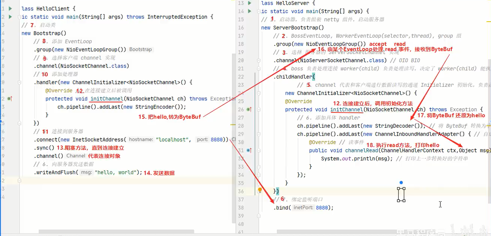
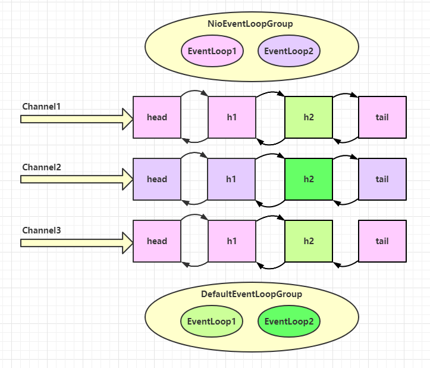

# Netty入门

Netty 是一个异步的（使用多线程，这里不是异步IO）、基于事件驱动（多路复用）的网络应用框架，用于快速开发可维护、高性能的网络服务器和客户端

## Netty 的优势

* Netty vs NIO，工作量大，bug 多
  * 需要自己构建协议
  * 解决 TCP 传输问题，如粘包、半包
  * epoll 空轮询导致 CPU 100%
  * 对 API 进行增强，使之更易用，如 FastThreadLocal => ThreadLocal，ByteBuf => ByteBuffer
* Netty vs 其它网络应用框架
  * Mina 由 apache 维护，将来 3.x 版本可能会有较大重构，破坏 API 向下兼容性，Netty 的开发迭代更迅速，API 更简洁、文档更优秀
  * 久经考验，16年，Netty 版本
    * 2.x 2004
    * 3.x 2008
    * 4.x 2013
    * 5.x 已废弃（没有明显的性能提升，维护成本高）

## HelloServer

```java
package netty.c1;

import io.netty.bootstrap.ServerBootstrap;
import io.netty.channel.ChannelHandlerContext;
import io.netty.channel.ChannelInboundHandlerAdapter;
import io.netty.channel.ChannelInitializer;
import io.netty.channel.nio.NioEventLoopGroup;
import io.netty.channel.socket.nio.NioServerSocketChannel;
import io.netty.channel.socket.nio.NioSocketChannel;
import io.netty.handler.codec.string.StringEncoder;

public class HelloServer {
    public static void main(String[] args) {
        //1.启动器，负责组装netty组件，启动服务器
        new ServerBootstrap()
                //2.BossEventLoop WorkerEventLoop(selector,thread),group组
                .group(new NioEventLoopGroup())
                //3.选择服务器的 ServerSocketChannel 实现
                .channel(NioServerSocketChannel.class)
                //4.boss负责处理连接，worker(child)负责处理读写，决定了 worker(child)能执行哪些操作(handler)
                .childHandler(
                        //5.Channel代表和客户端进行读写的通道，Initializer初始化，负责添加别的 handler
                        new ChannelInitializer<NioSocketChannel>() {
                            @Override
                            protected void initChannel(NioSocketChannel ch) throws Exception {
                                //6.添加具体的handler
                                ch.pipeline().addLast(new StringEncoder());//将ByteBuf转换为字符串
                                ch.pipeline().addLast(new ChannelInboundHandlerAdapter() {//自定义 handler
                                    @Override //读事件
                                    public void channelRead(ChannelHandlerContext ctx, Object msg) throws Exception {
                                        //打印上一步转换好的字符串
                                        System.out.println(msg);
                                    }
                                });
                            }
                        })
                //7.绑定监听端口
                .bind(8080);
    }
}
```

## HelloClient

```java
package netty.c1;

import io.netty.bootstrap.Bootstrap;
import io.netty.channel.ChannelInitializer;
import io.netty.channel.nio.NioEventLoopGroup;
import io.netty.channel.socket.nio.NioSocketChannel;
import io.netty.handler.codec.string.StringEncoder;

import java.net.InetSocketAddress;

/**
 * 客户端使用之前写的BIO、NIO客户端去连Netty服务端也是可以的，这里为了学习netty用
 */
public class HelloClient {
    public static void main(String[] args) throws InterruptedException {
        //1.启动类
        new Bootstrap()
                //2.添加 EventLoop
                .group(new NioEventLoopGroup())
                //3.选择客户端 channel 实现
                .channel(NioSocketChannel.class)
                //4.添加处理器
                .handler(new ChannelInitializer<NioSocketChannel>() {
                    @Override //连接建立后被调用
                    protected void initChannel(NioSocketChannel channel) throws Exception {
                        //字符串编码,和服务端对应
                        channel.pipeline().addLast(new StringEncoder());
                    }
                })
                //5.连接到服务器
                .connect(new InetSocketAddress("localhost", 8080))
                .sync()  // 阻塞方法，直到连接建立
                .channel()
                //6.向服务器发送数据
                .writeAndFlush("hello world")
        ;
    }
}
```

## Hello流程分析



一开始需要树立正确的观念

* 把 channel 理解为数据的通道
* 把 msg 理解为流动的数据，最开始输入是 ByteBuf，但经过 pipeline 的加工，会变成其它类型对象，最后输出又变成 ByteBuf
* 把 handler 理解为数据的处理工序
  * 工序有多道，合在一起就是 pipeline，pipeline 负责发布事件（读、读取完成...）传播给每个 handler， handler 对自己感兴趣的事件进行处理（重写了相应事件处理方法）
  * handler 分 Inbound 和 Outbound 两类
* 把 eventLoop 理解为处理数据的工人
  * 工人可以管理多个 channel 的 io 操作，并且一旦工人负责了某个 channel，就要负责到底（绑定）。这是为了线程安全。
  * 工人既可以执行 io 操作，也可以进行任务处理，每位工人有任务队列，队列里可以堆放多个 channel 的待处理任务，任务分为普通任务、定时任务
  * 工人按照 pipeline 顺序，依次按照 handler 的规划（代码）处理数据，可以为每道工序指定不同的工人

# 组件

## EventLoop

事件循环对象

EventLoop 本质是一个单线程执行器（同时维护了一个 Selector），里面有 run 方法处理 Channel 上源源不断的 io 事件。

它的继承关系比较复杂

* 一条线是继承自 j.u.c.ScheduledExecutorService 因此包含了线程池中所有的方法
* 另一条线是继承自 netty 自己的 OrderedEventExecutor，
  * 提供了 boolean inEventLoop(Thread thread) 方法判断一个线程是否属于此 EventLoop
  * 提供了 parent 方法来看看自己属于哪个 EventLoopGroup


事件循环组

EventLoopGroup 是一组 EventLoop，Channel 一般会调用 EventLoopGroup 的 register 方法来绑定其中一个 EventLoop，后续这个 Channel 上的 io 事件都由此 EventLoop 来处理（保证了 io 事件处理时的线程安全）

* 继承自 netty 自己的 EventExecutorGroup
  * 实现了 Iterable 接口提供遍历 EventLoop 的能力
  * 另有 next 方法获取集合中下一个 EventLoop


默认的线程数：

```java
private static final int DEFAULT_EVENT_LOOP_THREADS = Math.max(1, SystemPropertyUtil.getInt("io.netty.eventLoopThreads", NettyRuntime.availableProcessors() * 2));
```


### 处理普通和定时任务

```java
//1.创建事件循环组
EventLoopGroup group = new NioEventLoopGroup(2);//IO事件、普通任务、定时任务
//DefaultEventLoopGroup //普通任务、定时任务
//2.获取下一个事件循环对象
System.out.println(group.next());

//3.普通任务执行，类似线程池。submit 或 execute
group.next().submit(() -> log.info("ok"));
log.info("main");

//4.定时任务
group.next().scheduleAtFixedRate(() -> log.info("aaa"), 0, 1, TimeUnit.SECONDS);
```

### 处理IO任务

Server:

```java
new ServerBootstrap().group(new NioEventLoopGroup()).channel(NioServerSocketChannel.class)
        .childHandler(new ChannelInitializer<NioSocketChannel>() {
            @Override
            protected void initChannel(NioSocketChannel ch) throws Exception {
                ch.pipeline().addLast(new ChannelInboundHandlerAdapter(){
                    @Override //Object msg就是ByteBuf
                    public void channelRead(ChannelHandlerContext ctx, Object msg) throws Exception {
                        ByteBuf buf = (ByteBuf) msg;
                        log.debug(buf.toString(Charset.defaultCharset()));
                        super.channelRead(ctx, msg);
                    }
                });
            }
        })
        .bind(8080);
```

客户端debug模式启动，断点在最后一行，注意IDEA要切换到线程断点

```java
Channel channel = new Bootstrap()
        .group(new NioEventLoopGroup())
        .channel(NioSocketChannel.class)
        .handler(new ChannelInitializer<NioSocketChannel>() {
            @Override
            protected void initChannel(NioSocketChannel channel) throws Exception {
                channel.pipeline().addLast(new StringEncoder());
            }
        })
        .connect(new InetSocketAddress("localhost", 8080))
        .sync() 
        .channel();
System.out.println(channel);
System.out.println("");
```

使用评估表达式，进行发送消息：

```java
channel.writeAndFlush("1");
```

服务端：

```
16:18:39.348 [nioEventLoopGroup-2-3] DEBUG netty.eventloop.EventLoopServer - 1
16:18:39.348 [nioEventLoopGroup-2-3] DEBUG io.netty.channel.DefaultChannelPipeline - Discarded inbound message PooledUnsafeDirectByteBuf(ridx: 0, widx: 1, cap: 2048) that reached at the tail of the pipeline. Please check your pipeline configuration.
16:18:39.348 [nioEventLoopGroup-2-3] DEBUG io.netty.channel.DefaultChannelPipeline - Discarded message pipeline : [EventLoopServer$1$1#0, DefaultChannelPipeline$TailContext#0]. Channel : [id: 0x45156e79, L:/127.0.0.1:8080 - R:/127.0.0.1:35155].
```

再发一条：

```java
channel.writeAndFlush("hello");
```

```
16:18:49.897 [nioEventLoopGroup-2-3] DEBUG netty.eventloop.EventLoopServer - hello
16:18:49.897 [nioEventLoopGroup-2-3] DEBUG io.netty.channel.DefaultChannelPipeline - Discarded inbound message PooledUnsafeDirectByteBuf(ridx: 0, widx: 5, cap: 1024) that reached at the tail of the pipeline. Please check your pipeline configuration.
16:18:49.897 [nioEventLoopGroup-2-3] DEBUG io.netty.channel.DefaultChannelPipeline - Discarded message pipeline : [EventLoopServer$1$1#0, DefaultChannelPipeline$TailContext#0]. Channel : [id: 0x45156e79, L:/127.0.0.1:8080 - R:/127.0.0.1:35155].
```

发现还是2-3这个线程在处理。

再同时开一个客户端发消息，就是别的线程处理了

可以看到两个工人轮流处理 channel，但工人与 channel 之间进行了绑定


### eventloop分工细化

```java
//细分2：创建一个独立的 EventLoopGroup，与具体的handler进行绑定，可用于处理耗时较长的任务
EventLoopGroup group = new DefaultEventLoop();
new ServerBootstrap()
        //细分1：boss:负责accept，worker:负责socketChannel上的读写
        .group(new NioEventLoopGroup(),new NioEventLoopGroup(2))
        .channel(NioServerSocketChannel.class)
        .childHandler(new ChannelInitializer<NioSocketChannel>() {
            @Override
            protected void initChannel(NioSocketChannel ch) throws Exception {
                //没有指定group，默认就是用worker里的NioEventLoopGroup线程
                ch.pipeline().addLast("handler1",new ChannelInboundHandlerAdapter(){
                    @Override //Object msg就是ByteBuf
                    public void channelRead(ChannelHandlerContext ctx, Object msg) throws Exception {
                        ByteBuf buf = (ByteBuf) msg;
                        log.debug(buf.toString(Charset.defaultCharset()));
                        ctx.fireChannelRead(msg);//将消息传递给下一个handler
                    }
                }).addLast(group,"handler2",new ChannelInboundHandlerAdapter() {
                    @Override //Object msg就是ByteBuf
                    public void channelRead(ChannelHandlerContext ctx, Object msg) throws Exception {
                        ByteBuf buf = (ByteBuf) msg;
                        log.debug(buf.toString(Charset.defaultCharset()));
                        super.channelRead(ctx, msg);
                    }
                });
            }
        }).bind(8080);
```



### 💡 handler 执行中如何换人？

关键代码 `io.netty.channel.AbstractChannelHandlerContext#invokeChannelRead()`

```java
static void invokeChannelRead(final AbstractChannelHandlerContext next, Object msg) {
    final Object m = next.pipeline.touch(ObjectUtil.checkNotNull(msg, "msg"), next);
    // 下一个 handler 的事件循环是否与当前的事件循环是同一个线程
    EventExecutor executor = next.executor();
    
    // 是，直接调用
    if (executor.inEventLoop()) {
        next.invokeChannelRead(m);
    } 
    // 不是，将要执行的代码作为任务提交给下一个事件循环处理（换人）
    else {
        executor.execute(new Runnable() {
            @Override
            public void run() {
                next.invokeChannelRead(m);
            }
        });
    }
}
```

* 如果两个 handler 绑定的是同一个线程，那么就直接调用
* 否则，把要调用的代码封装为一个任务对象，由下一个 handler 的线程来调用

视频进度：p64开头
