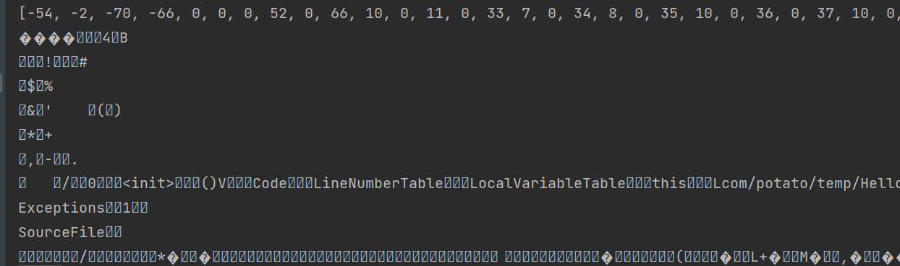
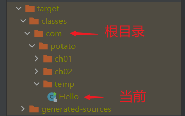

## 基本用法

首先，Java中的getResourceAsStream有以下几种： 

- Class.getResourceAsStream(String path) ： path 不以’/'开头时默认是从此类所在的包下取资源，以’/'开头则是从ClassPath根下获取。其只是通过path构造一个绝对路径，**最终还是由ClassLoader获取资源**。 
- Class.getClassLoader.getResourceAsStream(String path) ：默认则是从ClassPath根下获取，path不能以’/'开头，最终是由ClassLoader获取资源。 

，getResourceAsStream 用法大致有以下几种： 

第一： 要加载的文件和.class文件在同一目录下，例如：com.x.y 下有类me.class ,同时有资源文件myfile.xml 

那么，应该有如下代码： 

me.class.getResourceAsStream("myfile.xml"); 

第二：在me.class目录的子目录下，例如：com.x.y 下有类me.class ,同时在 com.x.y.file 目录下有资源文件myfile.xml 

那么，应该有如下代码： 

me.class.getResourceAsStream("file/myfile.xml"); 

第三：不在me.class目录下，也不在子目录下，例如：com.x.y 下有类me.class ,同时在 com.x.file 目录下有资源文件myfile.xml 

那么，应该有如下代码： 

me.class.getResourceAsStream("/com/x/file/myfile.xml"); 

总结一下，可能只是两种写法 

第一：前面有 “  / ” 

“ / ”代表了工程的根目录，例如工程名叫做myproject，“ / ”代表了myproject 

me.class.getResourceAsStream("/com/x/file/myfile.xml"); 

第二：前面没有 “  / ” 

代表当前类的目录 

me.class.getResourceAsStream("myfile.xml"); 

me.class.getResourceAsStream("file/myfile.xml"); 

## 获取类的字节码数组

1、获取当前类的字节码数组

```java
package com.potato.temp;

import org.apache.commons.io.IOUtils;
import java.io.IOException;
import java.io.InputStream;
import java.util.Arrays;

public class Hello {
    public static void main(String[] args) throws IOException {
        InputStream inputStream = Hello.class.getResourceAsStream("Hello.class");
        byte[] bytes = IOUtils.toByteArray(inputStream);
        System.out.println(Arrays.toString(bytes));
        String s = new String(bytes);
        System.out.println(s);
    }
}

```




2、根目录（包名开头）

这样呢：

```java
package com.potato.temp;

import org.apache.commons.io.IOUtils;
import java.io.IOException;
import java.io.InputStream;
import java.util.Arrays;

public class Hello {
    public static void main(String[] args) throws IOException {
        InputStream inputStream = Hello.class.getResourceAsStream("/");
        byte[] bytes = IOUtils.toByteArray(inputStream);
        System.out.println(Arrays.toString(bytes));
        String s = new String(bytes);
        System.out.println(s);
    }
}
```

结果：

```java
[99, 111, 109, 10]
com
```


3、当前文件名

如果是：

```java
 InputStream inputStream = Hello.class.getResourceAsStream(".");//或者""、"./"
```

结果:

```java
[72, 101, 108, 108, 111, 46, 99, 108, 97, 115, 115, 10]
Hello.class
```


4、上级目录

```java
InputStream inputStream = Hello.class.getResourceAsStream("..");
```

结果:

```
[99, 104, 48, 49, 10, 99, 104, 48, 50, 10, 116, 101, 109, 112, 10]
ch01
ch02
temp
```



