# 1.匿名内部类

## 1.1引入

有时候看到

​      new  类A/接口B{

​				写了一堆东西；

​		};

在{}里面的就是匿名内部类

```java
public class HelloWorldAnonymousClasses {

    /**
     * 包含两个方法的HelloWorld接口
     */
    interface HelloWorld {
        public void greet();
        public void greetSomeone(String someone);
    }

    public void sayHello() {

        // 1、局部类EnglishGreeting实现了HelloWorld接口
        class EnglishGreeting implements HelloWorld {
            String name = "world";
            public void greet() {
                greetSomeone("world");
            }
            public void greetSomeone(String someone) {
                name = someone;
                System.out.println("Hello " + name);
            }
        }

        HelloWorld englishGreeting = new EnglishGreeting();

        // 2、匿名类实现HelloWorld接口
        HelloWorld frenchGreeting = new HelloWorld() {
            String name = "tout le monde";
            public void greet() {
                greetSomeone("tout le monde");
            }
            public void greetSomeone(String someone) {
                name = someone;
                System.out.println("Salut " + name);
            }
        };

        // 3、匿名类实现HelloWorld接口
        HelloWorld spanishGreeting = new HelloWorld() {
            String name = "mundo";
            public void greet() {
                greetSomeone("mundo");
            }
            public void greetSomeone(String someone) {
                name = someone;
                System.out.println("Hola, " + name);
            }
        };

        englishGreeting.greet();
        frenchGreeting.greetSomeone("Fred");
        spanishGreeting.greet();
    }

    public static void main(String... args) {
        HelloWorldAnonymousClasses myApp = new HelloWorldAnonymousClasses();
        myApp.sayHello();
    }
}
```

该例中用局部类来初始化变量englishGreeting，用匿类来初始化变量frenchGreeting和spanishGreeting，两种实现之间有明显的区别：

1）局部类EnglishGreetin继承HelloWorld接口，有自己的类名，定义完成之后需要再用new关键字实例化才可以使用；

2）frenchGreeting、spanishGreeting在定义的时候就实例化了，定义完了就可以直接使用；

3）匿名类是一个表达式，因此在定义的最后用分号";"结束。

接口是不能实例化的，匿名内部类是实现了接口，相当于普通的类implements接口，只不过这个类是没有名字的。

## 2.匿名内部类的语法

1.匿名类实现接口

```java
HelloWorld frenchGreeting = new HelloWorld() {
   String name = "tout le monde";
   public void greet() {
         greetSomeone("tout le monde");
   }
   public void greetSomeone(String someone) {
        name = someone;
        System.out.println("Salut " + name);
   }
 };
```

2.匿名子类（继承父类）

```java
public class AnimalTest {

    private final String ANIMAL = "动物";

    public void accessTest() {
        System.out.println("匿名内部类访问其外部类方法");
    }

    class Animal {
        private String name;

        public Animal(String name) {
            this.name = name;
        }

        public void printAnimalName() {
            System.out.println(bird.name);
        }
    }

    // 鸟类，匿名子类，继承自Animal类，可以覆写父类方法
    Animal bird = new Animal("布谷鸟") {

        @Override
        public void printAnimalName() {
            accessTest();   　　　　　　　　// 访问外部类成员
            System.out.println(ANIMAL);  // 访问外部类final修饰的变量
            super.printAnimalName();
        }
    };

    public void print() {
        bird.printAnimalName();
    }

    public static void main(String[] args) {

        AnimalTest animalTest = new AnimalTest();
        animalTest.print();
    }
}
```

从以上两个实例中可知，匿名类表达式包含以下内部分：

1. 操作符：new；
2. 一个要实现的接口或要继承的类，案例一中的匿名类实现了HellowWorld接口，案例二中的匿名内部类继承了Animal父类；
3. 一对括号，如果是匿名子类，与实例化普通类的语法类似，如果有构造参数，要带上构造参数；如果是实现一个接口，只需要一对空括号即可；
4. 一段被"{}"括起来类声明主体；
5. 末尾的";"号（因为匿名类的声明是一个表达式，是语句的一部分，因此要以分号结尾）。

## 3.访问作用域内的局部变量、定义和访问匿名内部类成员

**案例一，内嵌类的属性屏蔽：**


```java
public class ShadowTest {

    public int x = 0;

    class FirstLevel {

        public int x = 1;

        void methodInFirstLevel(int x) {
            System.out.println("x = " + x);
            System.out.println("this.x = " + this.x);
            System.out.println("ShadowTest.this.x = " + ShadowTest.this.x);
        }
    }

    public static void main(String... args) {
        ShadowTest st = new ShadowTest();
        ShadowTest.FirstLevel fl = st.new FirstLevel();
        fl.methodInFirstLevel(23);
    }
}
```
输出结果为：

```
x = 23
this.x = 1
ShadowTest.this.x = 0
```

这个实例中有三个变量x：1、ShadowTest类的成员变量；2、内部类FirstLevel的成员变量；3、内部类方法methodInFirstLevel的参数。

methodInFirstLevel的参数x屏蔽了内部类FirstLevel的成员变量，因此，在该方法内部使用x时实际上是使用的是参数x，可以使用this关键字来指定引用是成员变量x：

```
 System.out.println("this.x = " + this.x); 
```

利用类名来引用其成员变量拥有最高的优先级，不会被其他同名变量屏蔽，如：

```
System.out.println("ShadowTest.this.x = " + ShadowTest.this.x); 
```

**案例二，匿名内部类的属性屏蔽**

```java
public class ShadowTest {
    public int x = 0;

    interface FirstLevel {
     void methodInFirstLevel(int x);
    }

    FirstLevel firstLevel =  new FirstLevel() {

        public int x = 1;

        @Override
        public void methodInFirstLevel(int x) {
            System.out.println("x = " + x);
            System.out.println("this.x = " + this.x);
            System.out.println("ShadowTest.this.x = " + ShadowTest.this.x);
        }
    };

    public static void main(String... args) {
        ShadowTest st = new ShadowTest();
        ShadowTest.FirstLevel fl = st.firstLevel;
        fl.methodInFirstLevel(23);
    }
}
```

输出结果为：

```
x = 23
this.x = 1
ShadowTest.this.x = 0
```

## 4.匿名内部类中不能定义静态属性、方法　

```java
public class ShadowTest {
    public int x = 0;

    interface FirstLevel {
     void methodInFirstLevel(int x);
    }

    FirstLevel firstLevel =  new FirstLevel() {

        public int x = 1;

        public static String str = "Hello World";   // 编译报错

        public static void aa() {        // 编译报错
        }

        public static final String finalStr = "Hello World";  // 正常

        public void extraMethod() {  // 正常
            // do something
        }
    };
}
```

- 匿名内部类可以有常量属性（final修饰的属性）；
- 匿名内部内中可以定义属性，如上面代码中的代码:private int x = 1;
- 匿名内部内中可以可以有额外的方法（父接口、类中没有的方法）;
- 匿名内部内中可以定义内部类；
- 匿名内部内中可以对其他类进行实例化。

## 5.匿名内部类实例

````java
import javafx.event.ActionEvent;
import javafx.event.EventHandler;
import javafx.scene.Scene;
import javafx.scene.control.Button;
import javafx.scene.layout.StackPane;
import javafx.stage.Stage;

public class HelloWorld extends Application {
    public static void main(String[] args) {
        launch(args);
    }

    @Override
    public void start(Stage primaryStage) {
        primaryStage.setTitle("Hello World!");
        Button btn = new Button();
        btn.setText("Say 'Hello World'");
        btn.setOnAction(new EventHandler<ActionEvent>() {

            @Override
            public void handle(ActionEvent event) {
                System.out.println("Hello World!");
            }
        });

        StackPane root = new StackPane();
        root.getChildren().add(btn);
        primaryStage.setScene(new Scene(root, 300, 250));
        primaryStage.show();
    }
}
````


````java
import javafx.application.Application;
import javafx.event.ActionEvent;
import javafx.event.EventHandler;
import javafx.geometry.Insets;
import javafx.scene.Group;
import javafx.scene.Scene;
import javafx.scene.control.*;
import javafx.scene.layout.GridPane;
import javafx.scene.layout.HBox;
import javafx.stage.Stage;

public class CustomTextFieldSample extends Application {

    final static Label label = new Label();

    @Override
    public void start(Stage stage) {
        Group root = new Group();
        Scene scene = new Scene(root, 300, 150);
        stage.setScene(scene);
        stage.setTitle("Text Field Sample");

        GridPane grid = new GridPane();
        grid.setPadding(new Insets(10, 10, 10, 10));
        grid.setVgap(5);
        grid.setHgap(5);

        scene.setRoot(grid);
        final Label dollar = new Label("$");
        GridPane.setConstraints(dollar, 0, 0);
        grid.getChildren().add(dollar);

        final TextField sum = new TextField() {
            @Override
            public void replaceText(int start, int end, String text) {
                if (!text.matches("[a-z, A-Z]")) {
                    super.replaceText(start, end, text);
                }
                label.setText("Enter a numeric value");
            }

            @Override
            public void replaceSelection(String text) {
                if (!text.matches("[a-z, A-Z]")) {
                    super.replaceSelection(text);
                }
            }
        };

        sum.setPromptText("Enter the total");
        sum.setPrefColumnCount(10);
        GridPane.setConstraints(sum, 1, 0);
        grid.getChildren().add(sum);

        Button submit = new Button("Submit");
        GridPane.setConstraints(submit, 2, 0);
        grid.getChildren().add(submit);

        submit.setOnAction(new EventHandler<ActionEvent>() {
            @Override
            public void handle(ActionEvent e) {
                label.setText(null);
            }
        });

        GridPane.setConstraints(label, 0, 1);
        GridPane.setColumnSpan(label, 3);
        grid.getChildren().add(label);

        scene.setRoot(grid);
        stage.show();
    }

    public static void main(String[] args) {
        launch(args);
    }
}
````

# 2.Map.Entry

Map.Entry是Map的一个内部接口。

- keySet()方法返回值是Map中key值的集合；

- entrySet()的返回值也是返回一个Set集合，此集合的类型为Map.Entry。

Map.Entry是Map声明的一个内部接口，此接口为泛型，定义为Entry<K,V>。它表示Map中的一个实体（一个key-value对）。接口中有getKey(),getValue方法。

````java
public class Test{
     public static void main(String[] args) {
      Map<String, String> map = new HashMap<String, String>();
      map.put("1", "value1");
      map.put("2", "value2");
      map.put("3", "value3");
       
      //第一种：普遍使用，二次取值
      System.out.println("通过Map.keySet遍历key和value：");
      for (String key : map.keySet()) {
       System.out.println("key= "+ key + " and value= " + map.get(key));
      }
       
      //第二种
      System.out.println("通过Map.entrySet使用iterator遍历key和value：");
      Iterator<Map.Entry<String, String>> it = map.entrySet().iterator();
      while (it.hasNext()) {
       Map.Entry<String, String> entry = it.next();
       System.out.println("key= " + entry.getKey() + " and value= " + entry.getValue());
      }
       
      //第三种：推荐，尤其是容量大时
      System.out.println("通过Map.entrySet遍历key和value");
      for (Map.Entry<String, String> entry : map.entrySet()) {
       System.out.println("key= " + entry.getKey() + " and value= " + entry.getValue());
      }
     
      //第四种
      System.out.println("通过Map.values()遍历所有的value，但不能遍历key");
      for (String v : map.values()) {
       System.out.println("value= " + v);
      }
     }
}
````

因为Map不能直接通过map.iterator来遍历(list，set就是实现了这个接口，所以可以直接这样遍历),所以就只能先转化为set类型，用entrySet()方法，

其中set中的每一个元素值就是map中的一个键值对，也就是Map.Entry<K,V>了，然后就可以遍历了。

# 3.HashMap底层原理

**DEFAULT_INITIAL_CAPACITY :** HashMap的默认容量，16

**MAXIMUM_CAPACITY** **：** HashMap的最大支持容量，2^30

**DEFAULT_LOAD_FACTOR**：HashMap的默认加载因子

**TREEIFY_THRESHOLD**：Bucket中链表长度大于该默认值，转化为红黑树

**UNTREEIFY_THRESHOLD**：Bucket中红黑树存储的Node小于该默认值，转化为链

**MIN_TREEIFY_CAPACITY**：桶中的Node被树化时最小的hash表容量。（当桶中Node的

数量大到需要变红黑树时，若hash表容量小于MIN_TREEIFY_CAPACITY时，此时应执行resize扩容操作这个MIN_TREEIFY_CAPACITY的值至少是TREEIFY_THRESHOLD的4倍。）

**table**：存储元素的数组，总是2的n次幂，如果初始化时，不是2的整数次幂，会被扩容成2的整数次幂

**entrySet**：存储具体元素的集

**size**：HashMap中存储的键值对的数量

**modCount**：HashMap扩容和结构改变的次数。

**threshold**：扩容的临界值=容量x填充因子

**loadFactor**：填充因子

http://yikun.github.io/2015/04/01/Java-HashMap%E5%B7%A5%E4%BD%9C%E5%8E%9F%E7%90%86%E5%8F%8A%E5%AE%9E%E7%8E%B0/

https://www.cnblogs.com/kangkaii/p/8473793.html

.png)


## 3.1put(key,value)方法流程

通过hash函数计算key的hash值，调用putVal方法

````java
public V put(K key, V value) {
    return putVal(hash(key), key, value, false, true);
}
````

1. 计算key的hash值


````java
  static final int hash(Object key) {//hash函数，用于索引定位
      int h;
      return (key == null) ? 0 : (h = key.hashCode()) ^ (h >>> 16);//高16bit不变，低16bit和高16bit做了一个异或
  }
````
hash值再与数组长度取模运算，得到数组索引，取模运算是hash值与长度-1做与运算

(n - 1) & hash

位运算示意图


- ```java
  //hashCode方法是Object类中的native方法
  public native int hashCode();
  ```

2. 如果hash表为空，调用resize()方法创建一个hash表
   
   - hash表，即存放键值对的数组，默认初始长度为16，但在首次put（）之前是没有的创建的，所以为空；执行put()时，才有这个数组
   - resize()方法实现
     - 数组元素新的下标=原来下标+扩容前数组长度。
   
   ````java
   final Node<K,V>[] resize() {
       Node<K,V>[] oldTab = table;
       int oldCap = (oldTab == null) ? 0 : oldTab.length;
       int oldThr = threshold;
       int newCap, newThr = 0;
       if (oldCap > 0) {
           // 超过最大值就不再扩充了，就只好随你碰撞去吧
           if (oldCap >= MAXIMUM_CAPACITY) {
               threshold = Integer.MAX_VALUE;
               return oldTab;
           }
           // 没超过最大值，就扩充为原来的2倍
           else if ((newCap = oldCap << 1) < MAXIMUM_CAPACITY &&
                    oldCap >= DEFAULT_INITIAL_CAPACITY)
               newThr = oldThr << 1; // double threshold
       }
       else if (oldThr > 0) // initial capacity was placed in threshold
           newCap = oldThr;
       else {               // zero initial threshold signifies using defaults
           newCap = DEFAULT_INITIAL_CAPACITY;
           newThr = (int)(DEFAULT_LOAD_FACTOR * DEFAULT_INITIAL_CAPACITY);
       }
       // 计算新的resize上限
       if (newThr == 0) {
   
           float ft = (float)newCap * loadFactor;
           newThr = (newCap < MAXIMUM_CAPACITY && ft < (float)MAXIMUM_CAPACITY ?
                     (int)ft : Integer.MAX_VALUE);
       }
       threshold = newThr;
       @SuppressWarnings({"rawtypes","unchecked"})
           Node<K,V>[] newTab = (Node<K,V>[])new Node[newCap];
       table = newTab;
       if (oldTab != null) {
           // 把每个bucket都移动到新的buckets中
           for (int j = 0; j < oldCap; ++j) {
               Node<K,V> e;
               if ((e = oldTab[j]) != null) {
                   oldTab[j] = null;
                   if (e.next == null)
                       newTab[e.hash & (newCap - 1)] = e;
                   else if (e instanceof TreeNode)
                       ((TreeNode<K,V>)e).split(this, newTab, j, oldCap);
                   else { // preserve order
                       Node<K,V> loHead = null, loTail = null;
                       Node<K,V> hiHead = null, hiTail = null;
                       Node<K,V> next;
                       do {
                           next = e.next;
                           // 原索引
                           if ((e.hash & oldCap) == 0) {
                               if (loTail == null)
                                   loHead = e;
                               else
                                   loTail.next = e;
                               loTail = e;
                           }
                           // 原索引+oldCap
                           else {
                               if (hiTail == null)
                                   hiHead = e;
                               else
                                   hiTail.next = e;
                               hiTail = e;
                           }
                       } while ((e = next) != null);
                       // 原索引放到bucket里
                       if (loTail != null) {
                           loTail.next = null;
                           newTab[j] = loHead;
                       }
                       // 原索引+oldCap放到bucket里
                       if (hiTail != null) {
                           hiTail.next = null;
                           newTab[j + oldCap] = hiHead;
                       }
                   }
               }
           }
       }
       return newTab;
   }
   ````
   
   
   
3. hash表不为空，根据hash值索引找到hash表对应桶位置，判断该位置是否有hash碰撞(哈希桶碰撞)

   这里的碰撞是指hashCode与数组长度-1做与运算得出的值相同，所以hashCode可能是不同的

　　3.1 没有碰撞，直接插入映射入hash表

　　3.2 有碰撞，遍历桶中节点

​				采用equals方法判断插入的key与这个位置的key是否相同，相同就替换掉原有的value

　　　　3.2.1 第一个节点匹配，记录该节点

　　　　3.2.2 第一个节点没有匹配，桶中结构为红黑树结构，按照红黑树结构添加数据，记录返回值

　　　　3.2.3 第一个节点没有匹配，桶中结构是链表结构。遍历链表，找到key映射节点，记录，退出循环。
　　　　　　没有则在链表尾部添加节点。插入后判断链表长度是否大于转换为红黑树要求，符合则转为红黑树结构

　　　　3.2.4 用于记录的值判断是否为null，不为则是需要插入的映射key在hash表中原来有，替换值，返回旧值putValue方法结束

````java
final V putVal(int hash, K key, V value, boolean onlyIfAbsent,boolean evict) {
    Node<K,V>[] tab; Node<K,V> p; int n, i;
    if ((tab = table) == null || (n = tab.length) == 0)
        n = (tab = resize()).length;//存储数据Node没有初始化，此时初始化
    if ((p = tab[i = (n - 1) & hash]) == null)//(n-1)&hash用于定位，若为null，表明Node数组该位置没有Node对象，即没有碰撞
        tab[i] = newNode(hash, key, value, null);//对应位置添加Node对象
    else {//表明对应位置是有Node对象的，hash碰撞了
        Node<K,V> e; K k;
        if (p.hash == hash &&
            ((k = p.key) == key || (key != null && key.equals(k))))//碰撞了，且桶中第一个节点就匹配
            e = p;//记录第一个节点
        else if (p instanceof TreeNode)//碰撞了，第一个节点没有匹配上，且桶为红黑树结构，调用红黑树结构方法添加映射
            e = ((TreeNode<K,V>)p).putTreeVal(this, tab, hash, key, value);
        else {//碰撞了 不为红黑树结构，那么是链表结构
            for (int binCount = 0; ; ++binCount) {
                if ((e = p.next) == null) {//如果到了链表尾端
                    p.next = newNode(hash, key, value, null);//链尾添加映射
                    if (binCount >= TREEIFY_THRESHOLD - 1) // -1 for 1st//链表长度大于TREEIFY_THRESHOLD值，转换为红黑树结构
                        treeifyBin(tab, hash);
                    break;
                }
                if (e.hash == hash &&
                    ((k = e.key) == key || (key != null && key.equals(k))))//如果找到重复的key，判断该节点和要插入的元素key是否相等，如果相等，出循环
                    break;
                p = e;//为了遍历，和e = p.next结合来遍历
            }
        }
        if (e != null) { // existing mapping for key//key映射的节点不为空
            V oldValue = e.value;//取出节点值记录为老的节点值
            if (!onlyIfAbsent || oldValue == null)//如果onlyIfAbsent为false，或者老的节点值为null，赋予新的值
                e.value = value;
            afterNodeAccess(e);//访问后回调
            return oldValue;
        }
    }
    ++modCount;//结构性修改记录
    if (++size > threshold)//判断是否需要扩容
        resize();
    afterNodeInsertion(evict);//插入后回调
    return null;
}
````

## 3.2get(key)方法流程

传入key，得到对应的value

````java
public V get(Object key) {
    Node<K,V> e;
    return (e = getNode(hash(key), key)) == null ? null : e.value;
}
````

先根据key获取hash值，其他没什么可说的，有值value，没有值返回null，直接进入getNode()

````java
final Node<K,V> getNode(int hash, Object key) {
    Node<K,V>[] tab; Node<K,V> first, e; int n; K k;
    if ((tab = table) != null && (n = tab.length) > 0 &&
        (first = tab[(n - 1) & hash]) != null) {
        if (first.hash == hash && // always check first node
            ((k = first.key) == key || (key != null && key.equals(k))))
            return first;
        if ((e = first.next) != null) {
            if (first instanceof TreeNode)
                return ((TreeNode<K,V>)first).getTreeNode(hash, key);
            do {
                if (e.hash == hash &&
                    ((k = e.key) == key || (key != null && key.equals(k))))
                    return e;
            } while ((e = e.next) != null);
        }
    }
    return null;
}
````

- 不难发现，此方法明显没有putVal复杂，并且参数比较简单：一个int型的hash值，一个Object的key；
- 先定义几个变量：
  - 1个Node的数组 tab，两个Node对象，first，e，一个int n，一个K k；

- 进入方法的if判断，如果不走此if，直接返回null；
  - 判断了如下内容，并且用 && 连接（同时满足，并且有短路）
  - `(tab = table) != null`， 只要进行过 put 操作，即满足；
  - `(n = tab.length) > 0`，要求map集合中有元素（与上一个条件不同：先put再remove，此判断不成立）；
  - `(first = tab[(n - 1) & hash]) != null`，还是与put时同样的计算索引方法，！=null 代表tab数组对应索引有元素；
- 满足最外层的if后，再次需要分2种情况讨论；
  - 别找了 hash值也是first的hash值，传入的key也是那个key（==直接返回true，重写了 equal后 返回true也可以）
    此时，直接返回first即可；
  - 树中还是链表中？做出不同处理
    1.红黑树：直接调用getTreeNode()，不做深究
    2.链表：通过.next() 循环获取，知道找到满足条件的key为止
- 最后，可以返回之前定义的 Node对象 e啦。

## 3.3HashMap什么时候进行扩容和树形化

当HashMap中的**元素个数**超过数组大小(数组总大小length,不是数组中个数 size)xloadFactor 时 ， 就会进行数组扩容 ， loadFactor 的默认值(DEFAULT_LOAD_FACTOR)为0.75，这是一个折中的取值。也就是说，默认情况下，数组大小(DEFAULT_INITIAL_CAPACITY)为16，那么当HashMap中元素个数超过16*0.75=12（这个值就是代码中的threshold值，也叫做临界值）的时候，就把数组的大小扩展为 2*16=32，即扩大一倍，然后**重新计算每个元素在数组中的位置**，而这是一个非常消耗性能的操作，所以如果我们已经预知HashMap中元素的个数，那么预设元素的个数能够有效的提高HashMap的性能。

当HashMap中的其中一个链的对象个数如果达到了8个，此时如果**capacity没有达到64**，那么**HashMap会先扩容解决**，如果已经达到了64，那么这个链会变成树，结点类型由Node变成TreeNode类型。当然，如果当映射关系被移除后，下次resize方法时判断树的结点个数低于6个，也会把树再转为链表。

## 3.4JDK1.8相较于之前的变化

1.HashMap map = new HashMap();//默认情况下，先不创建长度为16的数组

2.当首次调用map.put()时，再创建长度为16的数组

3.数组为Node类型，在jdk7中称为Entry类型

4.形成链表结构时，新添加的key-value对在链表的尾部（七上八下）

5.当数组指定索引位置的链表长度>8时，且map中的数组的长度> 64时，此索引位置上的所有key-value对使用红黑树进行存储。

## 3.5存储

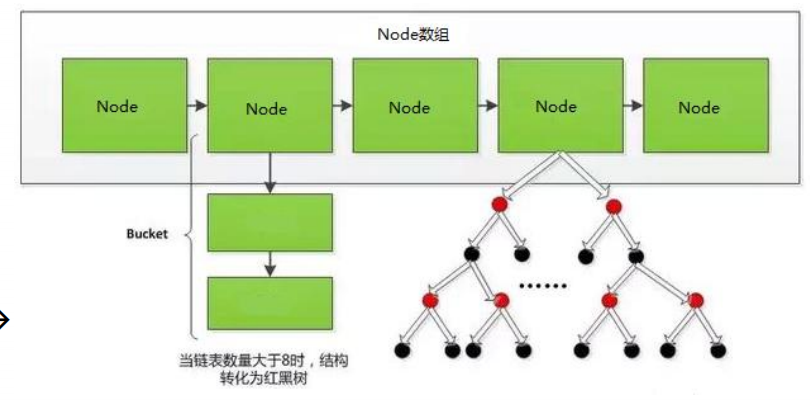

数组的每个位置都是Node<K,V>，这个叫哈希桶

这个位置存放了：

key的哈希值hash(key)，即由hashCode(key)的高16bit不变，低16bit和高16bit做了一个异或得到hash(key)

key

value

next（指向链表或红黑树节点或null）

所以这个Node和它的链表，其中hash可能一样，可能不一样，key肯定不一样

# 4.字符串常量池

## 4.1概念

**字符串常量池则存在于方法区**


**堆**

- 存储的是对象，每个对象都包含一个与之对应的class

- JVM只有一个堆区(heap)**被所有线程共享**，堆中不存放基本类型和对象引用，只存放对象本身

- 对象的由垃圾回收器负责回收，因此大小和生命周期不需要确定

**栈**

**每个线程包含一个栈区**，栈中只保存**基础数据类型的对象**和自定义**对象的引用**(不是对象)

每个栈中的数据(原始类型和对象引用)都是**私有的**

栈分为3个部分：基本类型变量区、执行环境上下文、操作指令区(存放操作指令)

数据大小和生命周期是可以确定的，当没有引用指向数据时，这个数据就会自动消失

**方法区**

静态区，跟堆一样，**被所有的线程共享**

方法区中包含的都是在整个程序中永远唯一的元素，如class，**static变量**

1. 字符串的分配，和其他的对象分配一样，耗费高昂的时间与空间代价，作为最基础的数据类型，大量频繁的创建字符串，极大程度地影响程序的性能
2. JVM为了提高性能和减少内存开销，在实例化字符串常量的时候进行了一些优化

- - 为字符串开辟一个字符串常量池，类似于缓存区
  - 创建字符串常量时，首先坚持字符串常量池是否存在该字符串
  - 存在该字符串，返回引用实例，不存在，实例化该字符串并放入池中

1. 实现的基础

- - 实现该优化的基础是因为字符串是不可变的，可以不用担心数据冲突进行共享
  - 运行时实例创建的全局字符串常量池中有一个表，总是为池中每个唯一的字符串对象维护一个引用,这就意味着它们一直引用着字符串常量池中的对象，所以，在常量池中的这些字符串不会被垃圾收集器回收

- ````java
  String str1 = “hello”;
  String str2 = “hello”;
  
  System.out.printl（"str1 == str2" : str1 == str2 ) //true  
  ````

- ````java
  String str1 = “abc”;
  String str2 = “abc”;
  String str3 = “abc”;
  String str4 = new String(“abc”);
  String str5 = new String(“abc”);
  String str6 = new String(“abc”);
  //下图，位于常量池中的“abc”也是对象
  ````

- 

## 4.2**字符串对象的创建**

面试题：String str4 = new String(“abc”) 创建多少个对象？

1. 在常量池中查找是否有“abc”对象

2. - 有则返回对应的引用实例
   - 没有则创建对应的实例对象

3. 在堆中 new 一个 String("abc") 对象

4. 将对象地址赋值给str4,创建一个引用

所以，常量池中没有“abc”字面量则创建两个对象，否则创建一个对象，以及创建一个引用

根据字面量，往往会提出这样的变式题：

**String str1 = new String("A"+"B") ; 会创建多少个对象?** 
字符串常量池："A","B","AB" : 3个
堆：new String("AB") ：1个
总共 ： 4个

但是在JDK1.6之后,常量字符串的+操作，在编译阶段会直接优化成一个字符串

所以是两个，一个是字符串常量池的“AB“,一个是堆空间的String对象

**String str2 = new String("ABC") + "ABC" ; 会创建多少个对象?**

字符串常量池："ABC" : 1个
堆：new String("ABC") ：1个
总共 ： 2个

## 4.3intern()方法

使用intern()方法可以有效加快JVM进行比较的速度.
因为，在字符串比较来说==比较的是两个引用变量的地址
而equals方法(在String类中被复写)比较的是两个变量的实际值
==直接比较两个引用变量的值就可以了
而equals方法需要根据两个引用变量的地址去堆内存中判断两个引用变量的值是否相等
所以==的速度比equals 方法的速度快很多

然而 intern()方法的出现 使这种现象更加明显
intern()方法在被调用的时候 会在常量池里判断引用变量指向的内容在常量池中是否存在
如果存在就让引用变量直接指向常量池中的内容而不会再在堆内存中开盘空间存储该引用
变量指向的内容
s4=(s1+s2).intern();//(s1+s2)的实际值为"abcabc"调用intern()方法 该方法在常量池中
寻找是否已有"abcabc"存在，因为前面 String s3="abcabc";常量池中已经存在该内容
所以就将s4直接指向该内容 故s3==s4为true

也就是说 intern()方法使得字符串引用变量的指向更加明确 用常量池来管理这些内容
这样就大大提高了==比较的速度。
所以在大批的字符串变量比较中 要用到intern()方法 它可以更高效快捷的进行字符串变量比较

通过new操作符创建的字符串对象不指向字符串池中的任何对象，但是可以通过使用字符串的intern()方法来指向其中的某一个。java.lang.String.intern()返回一个保留池字符串，就是一个在全局字符串池中有了一个入口。如果以前没有在全局字符串池中，那么它就会被添加到里面

```java
// Create three strings in three different ways.
String s1 = "Hello";
String s2 = new StringBuffer("He").append("llo").toString();
String s3 = s2.intern();

// Determine which strings are equivalent using the ==
// operator
//栈中的s2指向堆中的对象，而堆中的对象才指向字符串常量池的“hello”，而栈中的s1指向字符串常量池的“hello”
System.out.println("s1 == s2? " + (s1 == s2)); // false
System.out.println("s1 == s3? " + (s1 == s3)); // true
```

## 4.4补充：字面量和常量池初探

字符串对象内部是用字符数组存储的，那么看下面的例子:

```java
String m = "hello,world";
String n = "hello,world";
String u = new String(m);
String v = new String("hello,world");
```

1. 会分配一个11长度的char数组，并在常量池分配一个由这个char数组组成的字符串，然后由m去引用这个字符串
2. 用n去引用常量池里边的字符串，所以和n引用的是同一个对象
3. 生成一个新的字符串，但内部的字符数组引用着m内部的字符数组
4. 同样会生成一个新的字符串，但内部的字符数组引用常量池里边的字符串内部的字符数组，意思是和u是同样的字符数组

使用图来表示的话，情况就大概是这样的(使用虚线只是表示两者其实没什么特别的关系):


```java
String m = "hello,world";
String n = "hello,world";
String u = new String(m);
String v = new String("hello,world");

System.out.println(m == n); //true 
System.out.println(m == u); //false
System.out.println(m == v); //false
System.out.println(u == v); //false 
```

# 5.注解

## 什么是注解

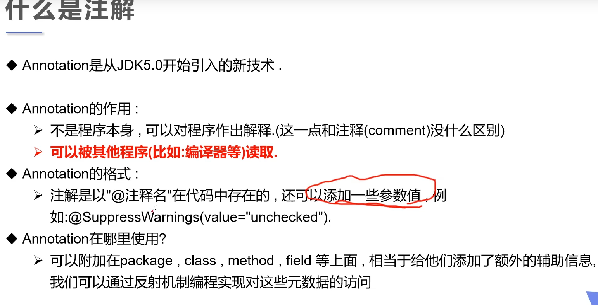

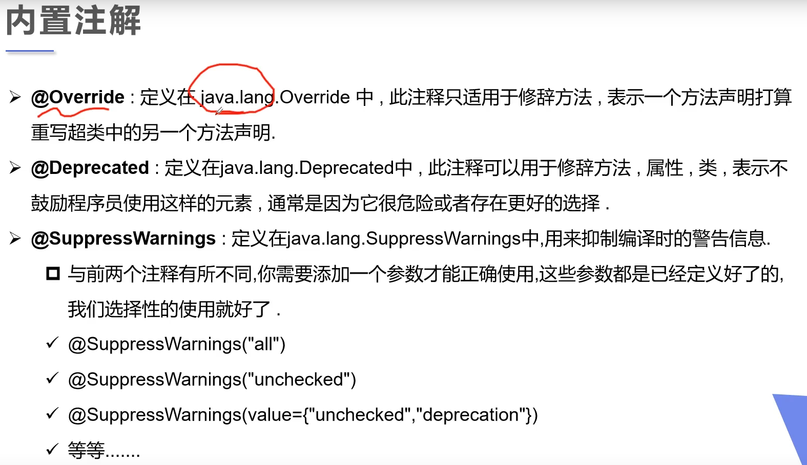

## 元注解

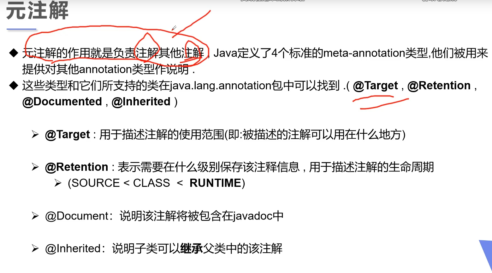

框架的注解好多都是在Runtime的@Retention,表示在运行时还在用

### @Target

表示我们定义的注解可以用在哪些地方

```java
package com.kuang.annotation;

import java.lang.annotation.ElementType;
import java.lang.annotation.Target;

//测试元注解
//@MyAnnotation定义在类上就报错
public class Test02 {
    @MyAnnotation
    public void rest(){

    }

    //定义一个注解
    @Target(value = ElementType.METHOD)//表明注解定义在方法上
    //@Target(value = {ElementType.METHOD,ElementType.TYPE})//注解定义在方法和类上都行
    @interface MyAnnotation{

    }
}
```

@Target注解源码

```java
package java.lang.annotation;

@Documented
@Retention(RetentionPolicy.RUNTIME)
@Target(ElementType.ANNOTATION_TYPE)
public @interface Target {
    ElementType[] value();
}


```

ElementType类的源码，是个枚举类

```java
package java.lang.annotation;

public enum ElementType {
    /** Class, interface (including annotation type), or enum declaration */
    TYPE,

    /** Field declaration (includes enum constants) */
    FIELD,

    /** Method declaration */
    METHOD,

    /** Formal parameter declaration */
    PARAMETER,

    /** Constructor declaration */
    CONSTRUCTOR,

    /** Local variable declaration */
    LOCAL_VARIABLE,

    /** Annotation type declaration */
    ANNOTATION_TYPE,

    /** Package declaration */
    PACKAGE,

    /**
     * Type parameter declaration
     *
     * @since 1.8
     */
    TYPE_PARAMETER,

    /**
     * Use of a type
     *
     * @since 1.8
     */
    TYPE_USE
}
```

### @Retention

```java
    //@Retention表示注解在什么地方还有效
    //runtime>class>sources
    @Retention(value= RetentionPolicy.RUNTIME)
    @interface MyAnnotation{

    }
```

@Retention的源码

```java
package java.lang.annotation;
@Documented
@Retention(RetentionPolicy.RUNTIME)
@Target(ElementType.ANNOTATION_TYPE)
public @interface Retention {
    RetentionPolicy value();
}

//RetentionPolicy类的源码，也是枚举类
package java.lang.annotation;

public enum RetentionPolicy {

    SOURCE,

    CLASS,

    RUNTIME
}
```

### @Documented

```
@Documented//表示是否将我们的注解生成在Javadoc中
```

```java
package java.lang.annotation;

@Documented
@Retention(RetentionPolicy.RUNTIME)
@Target(ElementType.ANNOTATION_TYPE)
public @interface Documented {
}
```


### @Inherited

```
@Inherited//子类可以继承父类的注解
```

```java
package java.lang.annotation;

@Documented
@Retention(RetentionPolicy.RUNTIME)
@Target(ElementType.ANNOTATION_TYPE)
public @interface Inherited {
}

```

## 自定义注解@interface

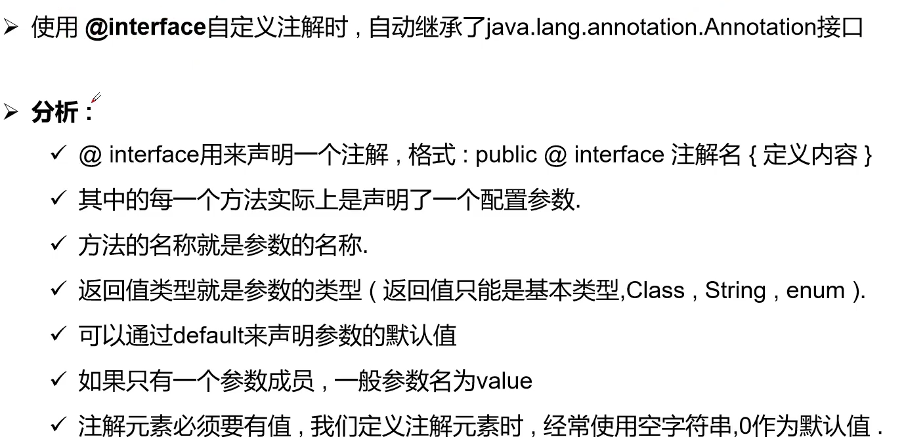

java.lang.annotation.Annotation接口

```java
package java.lang.annotation;


public interface Annotation {
   
    boolean equals(Object obj);

    int hashCode();

    String toString();

    Class<? extends Annotation> annotationType();
}

```

自定义注解示例：

```java
package com.kuang.annotation;

import org.omg.CORBA.INTERNAL;

import java.lang.annotation.ElementType;
import java.lang.annotation.Retention;
import java.lang.annotation.RetentionPolicy;
import java.lang.annotation.Target;

//自定义注解
public class Test03 {
    //注解可以显示赋值，如果没有默认值就必须给注解赋值
    @MyAnnotation2(age = 18,schools = "123")
    public void test(){

    }
    @MyAnnotation3("qin")
    public void test3(){

    }
}


@Target({ElementType.METHOD,ElementType.TYPE})
@Retention(RetentionPolicy.RUNTIME)
@interface MyAnnotation2{
    //注解的参数：参数类型+参数名();
    String name() default "";
    int age();
    int id() default -1;//如果默认值为-1，表示不存在
    String[] schools();

}

@Target({ElementType.METHOD,ElementType.TYPE})
@Retention(RetentionPolicy.RUNTIME)
@interface MyAnnotation3{
    //如果只有一个属性，推荐用value,这样用注解时，就不用写属性名了
    String value();

}
```

# 6.反射

## 反射机制概述

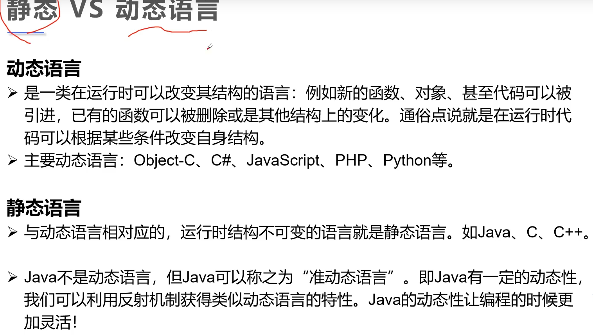

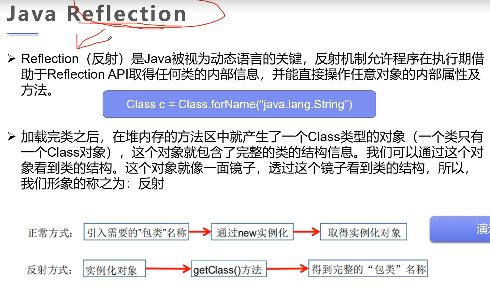

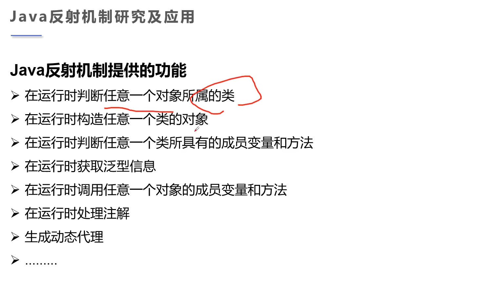

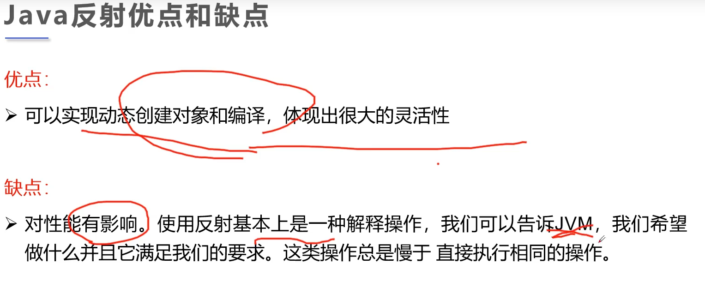

## Class类

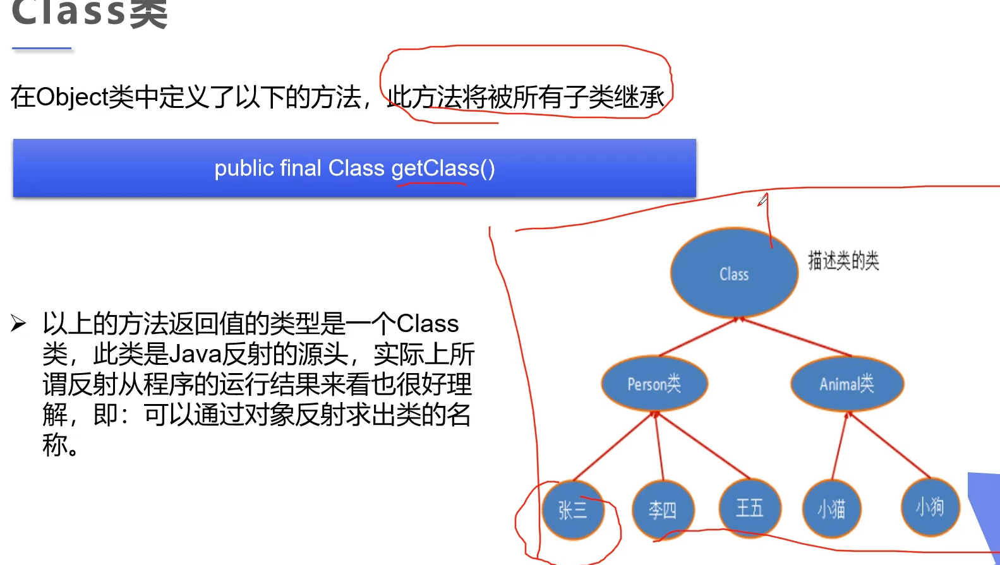

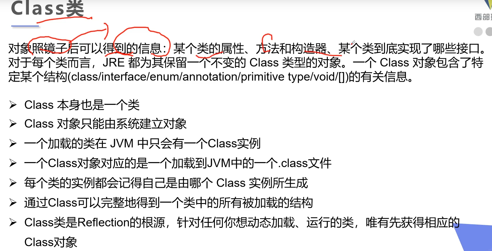

Class类常用方法

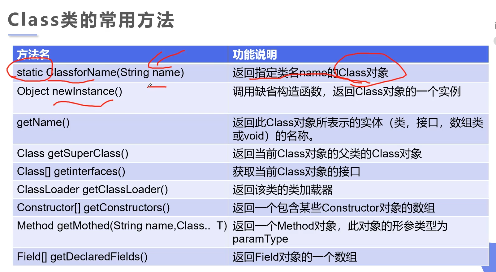


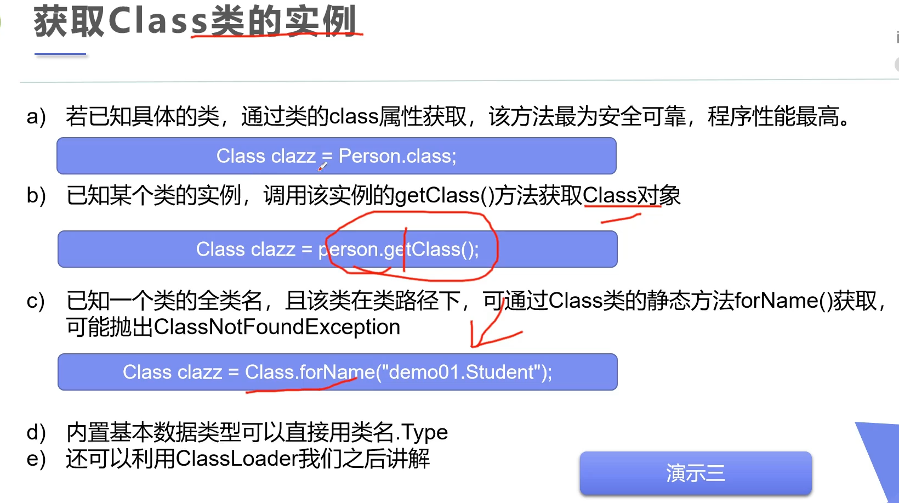


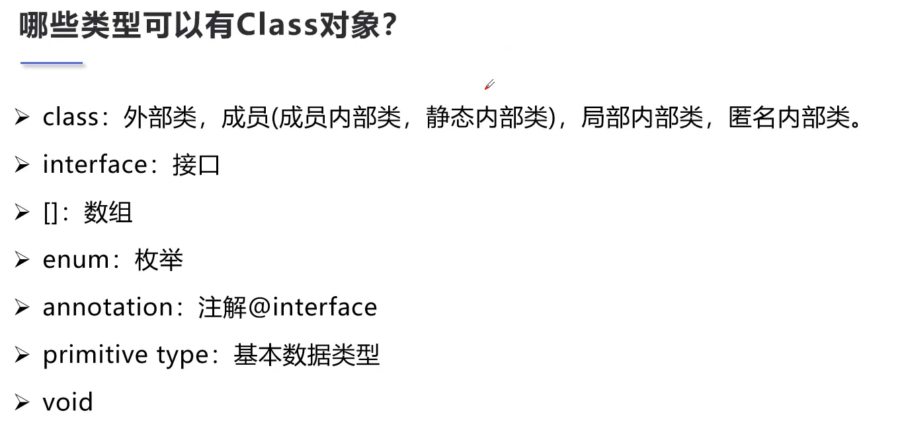

```java
package com.kuang.reflection;

import java.lang.annotation.ElementType;

//所有类型的class
public class Test03 {
    public static void main(String[] args) {
        Class c1 = Object.class; //类
        Class c2 = Comparable.class;//接口
        Class c3 = String[].class;//一维数组
        Class c4 = int[][].class;//二维数组
        Class c5 = Override.class;//注解
        Class c6 = ElementType.class;//枚举类
        Class c7 = void.class;//void
        Class c8 =Class.class;//Class

        System.out.println(c1);
        System.out.println(c2);
        System.out.println(c3);
        System.out.println(c4);
        System.out.println(c5);
        System.out.println(c6);
        System.out.println(c7);
        System.out.println(c8);
        //只要元素类型与维度一样，就是同一个Class
        int[] a = new int[10];
        int[] b = new int[100];
        System.out.println(a.getClass().hashCode());
        System.out.println(b.getClass().hashCode());
    }

}

```

结果：

```text
class java.lang.Object
interface java.lang.Comparable
class [Ljava.lang.String;
class [[I
interface java.lang.Override
class java.lang.annotation.ElementType
void
class java.lang.Class
1163157884
1163157884
```

## 类加载内存分析

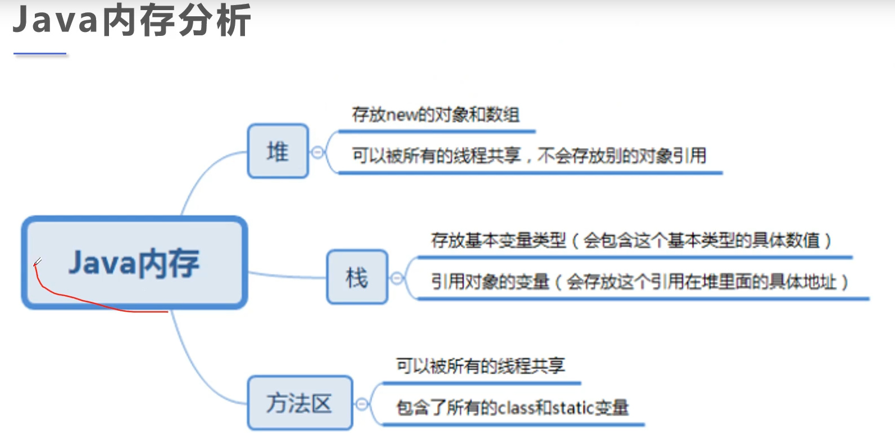

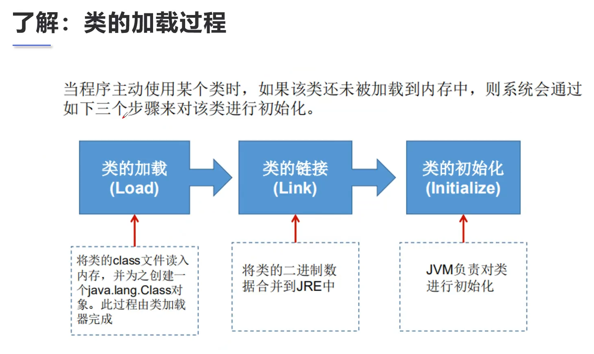

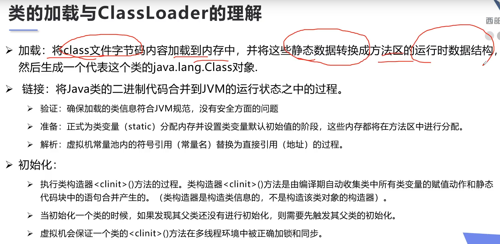


```java

```

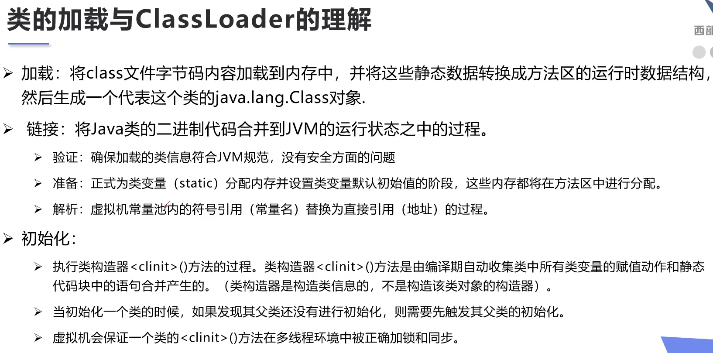

## 类加载器的作用


## 获取类的运行时结构

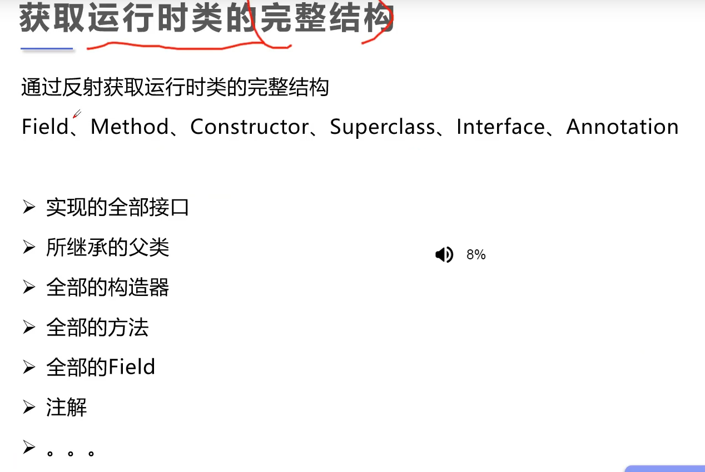

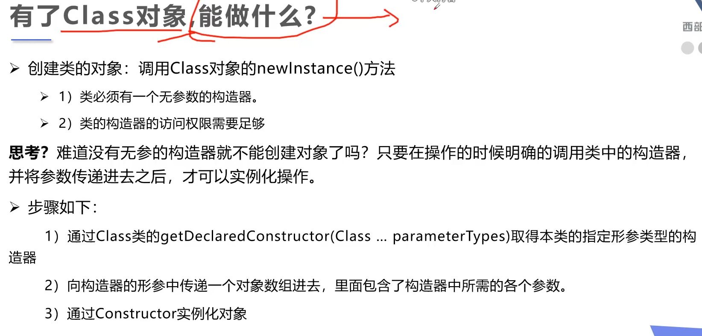

## 反射操作注解

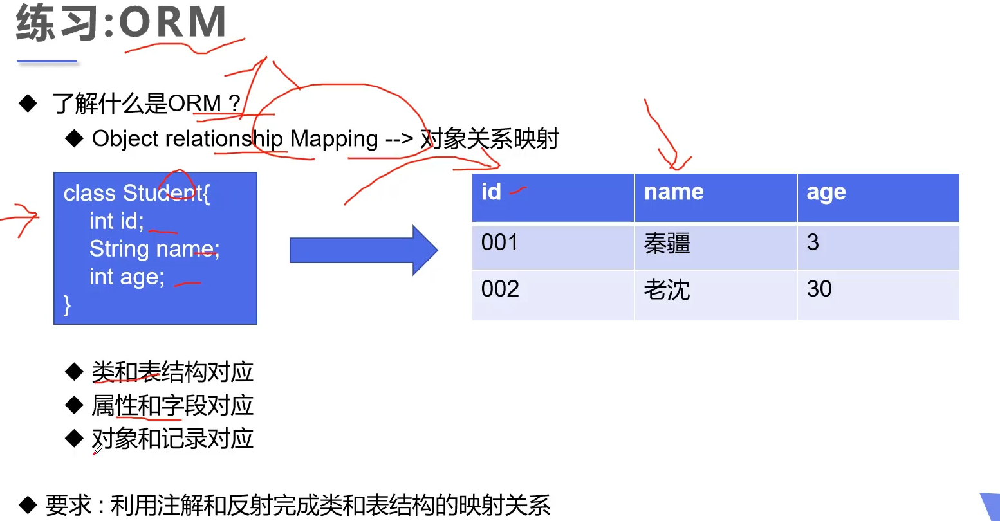

# 继承

在一个子类被创建的时候，首先会在内存中创建一个父类对象，然后在父类对象外部放上子类独有的属性，两者合起来形成一个子类的对象。所以所谓的继承使子类拥有父类所有的属性和方法其实可以这样理解，子类对象确实拥有父类对象中所有的属性和方法，但是父类对象中的私有属性和方法，子类是无法访问到的，只是拥有，但不能使用。就像有些东西你可能拥有，但是你并不能使用。所以子类对象是绝对大于父类对象的，所谓的子类对象只能继承父类非私有的属性及方法的说法是错误的。可以继承，只是无法访问到而已。

即子类继承了父类所有的，只是不能调用私有的，能够调用父类非私有方法和属性，final和静态也能调用

通过反射也不能调用父类私有的

# HashMap和Hashtable区别

**不同：**

|                | HashMap                                                      | Hashtable                          |
| -------------- | ------------------------------------------------------------ | ---------------------------------- |
| 父类           | AbstractMap                                                  | Dictionary                         |
| null           | 只能有一个null键，null值可以有多个，要用containsKey()判断是否存在某个键 | 不支持null键，不支持null值         |
| 线程安全性     | 不安全                                                       | 安全                               |
| 初始容量与扩容 | 16，扩容为2n                                                 | 11,扩容为2n+1                      |
| 计算哈希值     | 位运行获得位置                                               | 直接用hashCode，除法取余数获得位置 |

# 内部类总结

https://blog.csdn.net/zhao_miao/article/details/83245816

https://www.cnblogs.com/dolphin0520/p/3811445.html

做题目时经常遇到，始终没能完全搞清楚，这里总结一下

静态方法不能访问非静态变量

内部分类：

- 成员内部类
- 静态内部类
- 局部内部类
- 匿名内部类

## 成员内部类

1. 相当于外部类的一个成员变量，可以用任意访问修饰符
2. 定义的方法可以直接访问外部类的数据，不受访问控制符的影响，比如private
3. 成员内部类的成员不能声明为static的
4. 在外部类的静态成员使用内部类时，内部类要该为静态内部类
5. 编译上述语句后产生两个.class文件：Outer.class,Outer$Inner.class{}
6. 在内部类里默认访问自己的成员变量或方法，要访问外部类的，用外部类对象.this.name

```java
public class Outer{
    private int age = 18;
    String name = "wang";
    public class Inner{
        String name = "wan";
        //static String name = "wan";//不能使用static修饰成员变量和方法
        public void method(){
            System.out.println(Outer.this.name);//使用外部类成员:外部类名.this.成员
            System.out.println(name);//默认使用内部类的成员
            System.out.println(age);//内部类没有的话就用外部类的
        }
    }
    public Inner getInnerClass(){
        return new Inner();//外部类要先创建内部类对象才能访问内部类
    }
    public static void main(String[] args){
        Outer outer = new Outer();
        Inner in = outer.new Inner();//内部类 对象名 = 外部类对象.new 内部类()
        in.method();
    }
}
```

## 静态内部类

- 只能访问外部静态成员
- 属于外部类本身，不属于外部类某个对象

静态内部类是不需要依赖于外部类的，这点和类的静态成员属性有点类似，并且它不能使用外部类的非static成员变量或者方法。

```java
class Outter {
    public static void main(String[] args)  {
        Outter.Inner inner = new Outter.Inner();
    }
    static class Inner {
        public Inner() {}
    }
}
```

**静态内部类实现延迟加载单例模式**

静态内部类和成员内部类一样，都不会因为外部类的加载而加载，在使用时才加载。在加载静态内部类时也会加载外部类。

```java
public class SingletonIniti {
    private SingletonIniti() {}
    private static class SingletonHolder {
        private static final SingletonIniti INSTANCE = neSingletonIniti();
    }
    public static SingletonIniti getInstance() {
        return SingletonHolder.INSTANCE;
    }
}
```


## 局部内部类

- 其作用域仅限于方法内，方法外部无法访问该内部类
- 不能有public、protected、private 以及 static 修饰符

- 只能访问方法中的final的局部变量，因为方法调用完了后就没了，而局部内部类还可以存在

  在内部类中的属性和外部方法的参数两者从外表上看是同一个东西，但实际上却不是，所以他们两者是可以任意变化的， 也就是说在内部类中我对属性的改变并不会影响到外部的形参，而然这从程序员的角度来看这是不可行的，毕竟站在程序的角度来看这两个根本就是同一个，如果内部类该变了，而外部方法的形参却没有改变这是难以理解和不可接受的，所以为了保持参数的一致性，就规定使用 final 来避免形参的不改变

  注意:在JDK8版本之中,方法内部类中调用方法中的局部变量,可以不需要修饰为 final,匿名内部类也是一样的，主要是JDK8之后增加了 Effectively final 功能

  反编译jdk8编译之后的class文件,发现内部类引用外部的局部变量都是 final 修饰的

  ```java
  public class Outer{
      public void Show(){
          final int a = 25;
          int b = 13;
          class Inner{
              int c = 2;
              public void print(){
                  System.out.println("访问外部类:" + a);
                  System.out.println("访问内部类:" + c);
              }
          }
          Inner i = new Inner();
          i.print();
      }
      public static void main(String[] args){
          Outer o = new Outer();
          o.show();
      }
  }  
  ```

  


## 匿名内部类

```java
new 类/接口{
    //写了一堆东西;
};
```

- 只能访问局部final变量(JDK8开始可以不用final，系统默认加了)
- 不能有构造方法
- 不能定义任何静态的成员、方法
- 只能创建一个实例
- 必须且只能继承一个类或者实现一个接口

```java
public class OuterClass {
    public InnerClass getInnerClass(final int   num,String str2){
        return new InnerClass(){
            int number = num + 3;
            public int getNumber(){
                return number;
            }
        }; //注意：分号不能省 
    }
    public static void main(String[] args) {
        OuterClass out = new OuterClass();
        InnerClass inner = out.getInnerClass(2, "chenssy");
        System.out.println(inner.getNumber());
    }
}
interface InnerClass {
    int getNumber();
}         
```

