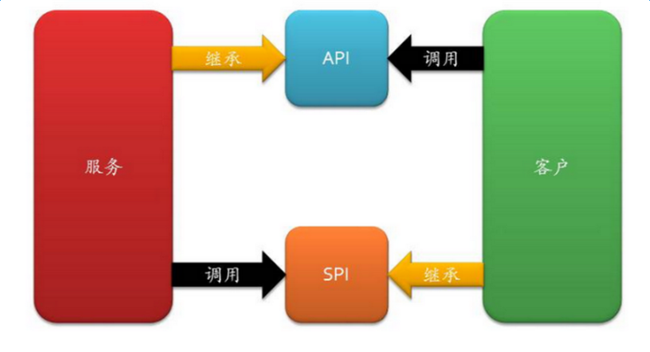

# 学习资源

[Java SPI详解 - jy的blog - 博客园 (cnblogs.com)](https://www.cnblogs.com/jy107600/p/11464985.html)

[Java SPI思想梳理 - 知乎 (zhihu.com)](https://zhuanlan.zhihu.com/p/28909673)

[设计原则：小议 SPI 和 API - 幸福框架 - 博客园 (cnblogs.com)](https://www.cnblogs.com/happyframework/archive/2013/09/17/3325560.html)

[Java 9 模块3: SPI模式 - 知乎 (zhihu.com)](https://zhuanlan.zhihu.com/p/31767780)

# 什么是SPI

## 服务提供接口

SPI全称Service Provider Interface，是Java提供的一套用来被第三方实现或者扩展的接口，它可以用来启用框架**扩展和替换**组件。 **SPI的作用就是为这些被扩展的API寻找服务实现**。

面向的对象的设计里，我们一般推荐模块之间基于接口编程，模块之间不对实现类进行硬编码。一旦代码里涉及具体的实现类，就违反了可拔插的原则，如果需要替换一种实现，就需要修改代码。为了实现在模块装配的时候不用在程序里动态指明，这就需要一种服务发现机制。java spi就是提供这样的一个机制：为某个接口寻找服务实现的机制。这有点类似IOC的思想，将装配的控制权移到了程序之外。

## 从面向接口编程说起


首先放个图：我们在“调用方”和“实现方”之间需要引入“接口”，可以思考一下什么情况应该把接口放入调用方，什么时候可以把接口归为实现方。

从纯粹的可能性上考虑，我们有三种选择：

1. “接口”位于“调用方”所在的“包”中。
2. “接口”位于“实现方”所在的“包”中。
3. “接口”位于独立的“包”中。

### “接口”位于“调用方”所在的“包”中

我们先想象一个场景，以仓储的接口为例：


我们将“仓储接口”放置于“领域层”这个“包”中，实现放在一个独立的“包”中，我们看DDD大师的实现都是这样子，现在来思考一下为什么这么做。

“领域层”的“领域服务”会依赖“仓储接口”，“仓储接口”也会依赖“聚合根”，这两者都是除了“实现依赖”之外的依赖关系，如果将“接口”放到“仓储实现”中就丧失了面向接口编程的意义（编译也不会通过），如果放到“独立层”中呢？会编译不通过，出现双向依赖了。

对于类似这种情况下接口，我们将其称为“SPI”，全程为：service provider interface，“SPI”的规则如下：

1. 概念上更依赖调用方。
2. 组织上位于调用方所在的包中。
3. 实现位于独立的包中（也可认为在提供方中）。
4. 常见的例子是：插件模式的插件。

### “接口”位于“实现方”所在的“包”中

先想象一个场景，以Unity提供的IUnityContainer接口为例，除了维护这个框架的团队之外，我们没有发现谁实现了这个接口，虽然理论上是可以实现这个接口的（如果能实现的话，我们何不自己弄额Ioc容器呢？）。

来看看**接口属于实现方**的情况，这个很容易理解，实现方提供了接口和实现，我们可以引用接口来达到调用某实现类的功能，这就**是我们经常说的api**，它具有以下特征：

1. **概念上更接近实现方**
2. **组织上位于实现方所在的包中**
3. **实现和接口在一个包中**


### “接口”位于独立的“包”中

这里就不说场景了，如果一个“接口”在一个上下文是“API”，在另一个上下文是“SPI”，那么你就可以这么组织。

### 小结

不管是SPI或API，接口都是可以组织到独立的“包”中，这么做是否有意义，自己来做出决定了。

**SPI和API也不一定是接口**，我这里都是指狭义的具体的接口。

 API （`Application Programming Interface）在`大多数情况下，都是`实现方`制定接口并完成对接口的实现，`调用方`仅仅依赖接口调用，且无权选择不同实现。 从使用人员上来说，API 直接被应用开发人员使用。

  SPI （`Service Provider Interface）`是`调用方`来制定接口规范，提供给外部来实现，`调用方在调用时则`选择自己需要的外部实现。 从使用人员上来说，SPI 被框架扩展人员使用。

有张概括的图：



# SPI的简单实现

下面我们来简单实现一个jdk的SPI的简单实现。

首先第一步，定义一组接口：

```java
public interface UploadCDN {
    void upload(String url);
}
```

这个接口分别有两个实现：

```java
public class QiyiCDN implements UploadCDN {  //上传爱奇艺cdn
    @Override
    public void upload(String url) {
        System.out.println("upload to qiyi cdn");
    }
}

public class ChinaNetCDN implements UploadCDN {//上传网宿cdn
    @Override
    public void upload(String url) {
        System.out.println("upload to chinaNet cdn");
    }
}
```

后需要在resources目录下新建META-INF/services目录，并且在这个目录下新建一个与上述接口的全限定名一致的文件，在这个文件中写入接口的实现类的全限定名：

com.gitee.potato20522.spi.UploadCDN

```
com.gitee.potato20522.spi.ChinaNetCDN
com.gitee.potato20522.spi.QiyiCDN
```

这时，通过serviceLoader加载实现类并调用：

```java
public static void main(String[] args) {
    ServiceLoader<UploadCDN> uploadCDN = ServiceLoader.load(UploadCDN.class);
    for (UploadCDN u : uploadCDN) {
        u.upload("filePath");
    }
}
```

  输出如下：

```
upload to chinaNet cdn
upload to qiyi cdn
```

这样一个简单的spi的demo就完成了。可以看到其中最为核心的就是通过ServiceLoader这个类来加载具体的实现类的。

再来理一下：

调用方：UploadCDN接口、mian方法。位于一个jar包中，依赖实现方

实现方：两个实现类和META-INF/services下的文件。位于另一个jar包中。

# SPI原理解析--ServiceLoader类

通过上面简单的demo，可以看到最关键的实现就是ServiceLoader这个类，可以看下这个类的源码，如下：

```java
public final class ServiceLoader<S> implements Iterable<S> {


    //扫描目录前缀
    private static final String PREFIX = "META-INF/services/";

    // 被加载的类或接口
    private final Class<S> service;

    // 用于定位、加载和实例化实现方实现的类的类加载器
    private final ClassLoader loader;

    // 上下文对象
    private final AccessControlContext acc;

    // 按照实例化的顺序缓存已经实例化的类
    private LinkedHashMap<String, S> providers = new LinkedHashMap<>();

    // 懒查找迭代器
    private java.util.ServiceLoader.LazyIterator lookupIterator;

    // 私有内部类，提供对所有的service的类的加载与实例化
    private class LazyIterator implements Iterator<S> {
        Class<S> service;
        ClassLoader loader;
        Enumeration<URL> configs = null;
        String nextName = null;

        //...
        private boolean hasNextService() {
            if (configs == null) {
                try {
                    //获取目录下所有的类
                    String fullName = PREFIX + service.getName();
                    if (loader == null)
                        configs = ClassLoader.getSystemResources(fullName);
                    else
                        configs = loader.getResources(fullName);
                } catch (IOException x) {
                    //...
                }
                //....
            }
        }

        private S nextService() {
            String cn = nextName;
            nextName = null;
            Class<?> c = null;
            try {
                //反射加载类
                c = Class.forName(cn, false, loader);
            } catch (ClassNotFoundException x) {
            }
            try {
                //实例化
                S p = service.cast(c.newInstance());
                //放进缓存
                providers.put(cn, p);
                return p;
            } catch (Throwable x) {
                //..
            }
            //..
        }
    }
}
```

上面的代码只贴出了部分关键的实现，有兴趣的读者可以自己去研究，下面贴出比较直观的spi加载的主要流程供参考：


# 优缺点

从上面的java spi的原理中可以了解到，java的spi机制有着如下的弊端：

- 只能遍历所有的实现，并全部实例化。
- 配置文件中只是简单的列出了所有的扩展实现，而没有给他们命名。导致在程序中很难去准确的引用它们。
- 扩展如果依赖其他的扩展，做不到自动注入和装配。
- 扩展很难和其他的框架集成，比如扩展里面依赖了一个Spring bean，原生的Java SPI不支持。

spi能带来的好处：

- 不需要改动源码就可以实现扩展，解耦。
- 实现扩展对原来的代码几乎没有侵入性。
- 只需要添加配置就可以实现扩展，符合开闭原则。

# 应用举例

## dubbo SPI

[Java SPI详解 - jy的blog - 博客园 (cnblogs.com)](https://www.cnblogs.com/jy107600/p/11464985.html)

dubbo作为一个高度可扩展的rpc框架，也依赖于java的spi，并且dubbo对java原生的spi机制作出了一定的扩展，使得其功能更加强大。

