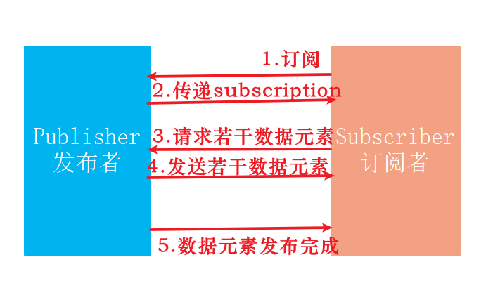
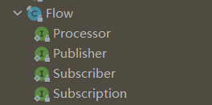

参考：

https://zhuanlan.zhihu.com/p/266351684

https://zhuanlan.zhihu.com/p/366328702

https://zhuanlan.zhihu.com/p/53510418

# Java9响应式编程Reactive Stream

## 设计思想
响应式编程范式通常在面向对象语言中作为观察者模式的扩展出现。可以将其与大家熟知的迭代器模式作对比，主要区别在于：

|          | 迭代器（Iterator） | 响应式流（Reactive Stream） |
| -------- | ------------------ | --------------------------- |
| 设计模式 | 迭代器模式         | 观察者模式                  |
| 数据方向 | 拉模式（PULL）     | 推模式（PUSH）              |
| 获取数据 | T next()           | onNext(T)                   |
| 处理完成 | hasNext()          | onCompleted()               |
| 异常处理 | throws Exception   | onError(Exception)          |

Java 8 引入了 Stream 用于流的操作，Java 9 引入的 Flow 也是数据流的操作。相比之下：

Stream 更侧重于流的过滤、映射、整合、收集，使用的是 PULL 模式。
而 Flow/RxJava/Reactor 更侧重于流的产生与消费，使用的是 PUSH 模式 。

Java 9的 Reactive Streams是对异步流式编程的一种实现。它基于异步发布和订阅模型，具有非阻塞“背压”数据处理的特点。

Non-blocking Back Pressure(非阻塞背压)：它是一种机制，让发布订阅模型中的订阅者避免接收大量数据(超出其处理能力)，订阅者可以异步通知发布者降低或提升数据生产发布的速率。它是响应式编程实现效果的核心特点！

## 四大核心概念



下面是Java 响应式编程中的一些重要角色和概念，先简单理解一下

- **发布者（Publisher）**是潜在的无限数量的有序数据元素的生产者。 它根据收到的需求(subscription)向当前订阅者发布一定数量的数据元素。
- **订阅者（Subscriber）**从发布者那里订阅并接收数据元素。与发布者建立订阅关系后，发布者向订阅者发送订阅令牌（subscription），订阅者可以根据自己的处理能力请求发布者发布数据元素的数量。
- **订阅令牌（subscription）**表示订阅者与发布者之间**建立的订阅关系**。 当建立订阅关系后，发布者将其传递给订阅者。 **订阅者使用订阅令牌与发布者进行交互，例如请求数据元素的数量或取消订阅**。
- **处理器（Processor）** 一个承上启下的作用，是流在执行过程中**数据处理的中间流程**;


## 响应式编程四大接口



Java 9提供了一组定义响应式流编程的接口。所有这些接口都作为静态内部接口定义在**java.util.concurrent.Flow**类里面。

### Subscriber Interface（订阅者订阅接口）

```java
public static interface Subscriber<T> {
    public void onSubscribe(Subscription subscription);
    public void onNext(T item);
    public void onError(Throwable throwable);
    public void onComplete();
}
```

- onSubscribe：在发布者接受订阅者的订阅动作之后，发布任何的订阅消息之前被调用。新创建的`Subscription`订阅令牌对象通过此方法传递给订阅者。
- onNext：下一个待处理的数据项的处理函数
- onError：在发布者或订阅遇到不可恢复的错误时调用
- onComplete：当没有订阅者调用（包括onNext()方法）发生时调用。

### Subscription Interface （订阅令牌接口）

订阅令牌对象通过Subscriber.onSubscribe()方法传递

```java
public static interface Subscription {
    public void request(long n);
    public void cancel();
}
```

- request(long n)是无阻塞背压概念背后的关键方法。订阅者使用它来请求n个以上的消费项目。这样，订阅者控制了它当前能够接收多少个数据。

- cancel()由订阅者主动来取消其订阅，取消后将不会在接收到任何数据消息。

### Publisher Interface(发布者接口)

```java
@FunctionalInterface
public static interface Publisher<T> {
    public void subscribe(Subscriber<? super T> subscriber);
}
```

调用该方法，建立订阅者Subscriber与发布者Publisher之间的消息订阅关系。

### Processor Interface（处理器接口）

处理者Processor 可以同时充当订阅者和发布者，起到转换发布者——订阅者管道中的元素的作用。用于将发布者T类型的数据元素，接收并转换为类型R的数据并发布。

```java
public static interface Processor<T,R> extends Subscriber<T>, Publisher<R> {
}
```

## 实战案例

现在我们要去实现上面的四个接口来完成响应式编程

- Subscription Interface订阅令牌接口通常不需要我们自己编程去实现，我们只需要在知道request()方法和cancle()方法含义即可。
- Publisher Interface发布者接口，Java 9 已经默认为我们提供了实现SubmissionPublisher，该实现类除了实现Publisher接口的方法外，提供了一个方法叫做`submit()`来完成消息数据的发送。
- Subscriber Interface订阅者接口，通常需要我们自己去实现。因为在数据订阅接收之后，不同的业务有不同的处理逻辑。
- Processor实际上是 Publisher Interface和Subscriber Interface的集合体，有需要数据类型转换及数据处理的需求才去实现这个接口

下面的例子实现的**流式字符串的数据消息订阅处理**

### 实现订阅者Subscriber

```java
package org.example;

import java.util.concurrent.Flow;

/**
 * 订阅者
 */
public class MySubscriber implements Flow.Subscriber<String>{
    private Flow.Subscription subscription;  //订阅令牌
    @Override
    public void onSubscribe(Flow.Subscription subscription) {
        System.out.println("订阅关系建立onSubscribe: " + subscription);
        this.subscription = subscription;
        subscription.request(2);
    }

    @Override
    public void onNext(String item) {
        System.out.println("item: " + item);
        // 一个消息处理完成之后，可以继续调用subscription.request(n);向发布者要求数据发送
        //subscription.request(n);
    }

    @Override
    public void onError(Throwable throwable) {
        System.out.println("onError: " + throwable);
    }

    @Override
    public void onComplete() {
        System.out.println("onComplete");
    }
}
```

### SubmissionPublisher消息发布者

SubmissionPublisher是JDK自动的默认Publisher实现

```java
package org.example;

import java.util.concurrent.Executors;
import java.util.concurrent.Flow;
import java.util.concurrent.SubmissionPublisher;

public class SubmissionPublisherExample {
    public static void main(String[] args) {
        var executor = Executors.newFixedThreadPool(1);
        //消息发布者
        var publisher = new SubmissionPublisher<String>(executor, Flow.defaultBufferSize());
        publisher.subscribe(new MySubscriber());   //建立订阅关系，可以有多个订阅者
        publisher.submit("数据 1");  //发送消息1
        publisher.submit("数据 2"); //发送消息2
        publisher.submit("数据 3"); //发送消息3
    }
}

```

控制台打印输出结果

```
订阅关系建立onSubscribe: java.util.concurrent.SubmissionPublisher$BufferedSubscription@4ad57554
item: 数据 1
item: 数据 2
```

请注意：即使发布者submit了3条数据，MySubscriber也仅收到了2条数据进行了处理。是因为我们在`MySubscriber#onSubscribe()`方法中使用了`subscription.request(2);`。这就是“**背压**”的响应式编程效果，我有能力处理多少数据，就会通知消息发布者给多少数据。

