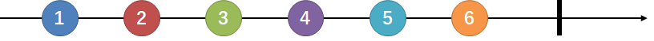
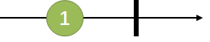

# Reactor3快速入门

转载来源：

[（3）lambda与函数式——响应式Spring的道法术器_享学IT的博客-CSDN博客](https://blog.csdn.net/get_set/article/details/79480121)

[（4）Reactor 3快速上手——响应式Spring的道法术器_享学IT的博客-CSDN博客_reactor3](https://blog.csdn.net/get_set/article/details/79480172)

Reactor与Spring是兄弟项目，侧重于Server端的响应式编程，主要 artifact 是 reactor-core，这是一个基于 Java 8 的实现了响应式流规范 （Reactive Streams specification）的响应式库。

本文对Reactor的介绍以基本的概念和简单的使用为主，深度以能够满足基本的Spring WebFlux使用为准。

maven依赖：

```xml
<dependency>
    <groupId>io.projectreactor</groupId>
    <artifactId>reactor-core</artifactId>
    <version>3.4.22</version>
</dependency>
<dependency>
    <groupId>io.projectreactor</groupId>
    <artifactId>reactor-test</artifactId>
    <version>3.4.22</version>
    <scope>test</scope>
</dependency>
<dependency>
    <groupId>junit</groupId>
    <artifactId>junit</artifactId>
    <version>4.13.2</version>
    <scope>test</scope>
</dependency>

```

## Flux与Mono

Reactor中的发布者（Publisher）由`Flux`和`Mono`两个类定义，它们都提供了丰富的操作符（operator）。一个Flux对象代表一个包含0…N个元素的响应式序列，而一个Mono对象代表一个包含零/一个（0…1）元素的结果。

既然是“数据流”的发布者，Flux和Mono都可以发出**三种“数据信号”**：**元素值、错误信号、完成信号**，错误信号和完成信号都是终止信号，完成信号用于告知下游订阅者该数据流正常结束，错误信号终止数据流的同时将错误传递给下游订阅者。

下图所示就是一个Flux类型的数据流，黑色箭头是时间轴。它连续发出“1” - “6”共6个元素值，以及一个完成信号（图中⑥后边的加粗竖线来表示），完成信号告知订阅者数据流已经结束。


下图所示是一个Mono类型的数据流，它发出一个元素值后，又发出一个完成信号。




> 既然Flux具有发布一个数据元素的能力，为什么还要专门定义一个Mono类呢？举个例子，一个HTTP请求产生一个响应，所以对其进行“count”操作是没有多大意义的。表示这样一个结果的话，应该用`Mono<HttpResponse>`而不是 `Flux<HttpResponse>`，对于的操作通常只用于处理 0/1 个元素。它们从语义上就原生包含着元素个数的信息，从而避免了对Mono对象进行多元素场景下的处理。

> 有些操作可以改变基数，从而需要切换类型。比如，count操作用于Flux，但是操作返回的结果是`Mono<Long>`。

我们可以用如下代码声明上边两幅图所示的Flux和Mono：

```java
Flux.just(1, 2, 3, 4, 5, 6);
Mono.just(1);
```

Flux和Mono提供了多种创建数据流的方法，`just`就是一种比较直接的声明数据流的方式，其参数就是数据元素。

对于图中的Flux，还可以通过如下方式声明（分别基于数组、集合和Stream生成）：

```java
//Flux的声明方式
Integer[] array = new Integer[]{1,2,3,4,5,6};
List<Integer> list = Arrays.asList(array);
Stream<Integer> stream = list.stream();

Flux.fromArray(array);
Flux.fromIterable(list);
Flux.fromStream(stream);
```

不过，这三种信号都不是一定要具备的：

- 首先，错误信号和完成信号都是终止信号，二者不可能同时共存；
- 如果没有发出任何一个元素值，而是直接发出完成/错误信号，表示这是一个空数据流；
- 如果没有错误信号和完成信号，那么就是一个无限数据流。

比如，对于只有完成/错误信号的数据流：

```java
// 只有完成信号的空数据流
Flux.just();
Flux.empty();
Mono.empty();
Mono.justOrEmpty(Optional.empty());
// 只有错误信号的数据流
Flux.error(new Exception("some error"));
Mono.error(new Exception("some error"));
```

你可能会纳闷，空的数据流有什么用？举个例子，当我们从响应式的DB中获取结果的时候（假设DAO层是`ReactiveRepository<User>`），就有可能为空：

```java
Mono<User> findById(long id);
Flux<User> findAll();
```

无论是空还是发生异常，都需要通过完成/错误信号告知订阅者，已经查询完毕，但是抱歉没有得到值，礼貌问题嘛~

## 订阅前什么都不会发生

数据流有了，假设我们想把每个数据元素原封不动地打印出来：

```java
Flux.just(1, 2, 3, 4, 5, 6).subscribe(System.out::print);
System.out.println();
Mono.just(1).subscribe(System.out::println);
```

输出如下：

```
123456
1
```

不调用subscribe进行订阅的话，啥事也不会发生。

可见，subscribe方法中的lambda表达式作用在了每一个数据元素上。此外，Flux和Mono还提供了多个subscribe方法的变体：

```java
// 订阅并触发数据流
subscribe(); 
// 订阅并指定对正常数据元素如何处理
subscribe(Consumer<? super T> consumer); 
// 订阅并定义对正常数据元素和错误信号的处理
subscribe(Consumer<? super T> consumer,
          Consumer<? super Throwable> errorConsumer); 
// 订阅并定义对正常数据元素、错误信号和完成信号的处理
subscribe(Consumer<? super T> consumer,
          Consumer<? super Throwable> errorConsumer,
          Runnable completeConsumer); 
// 订阅并定义对正常数据元素、错误信号和完成信号的处理，以及订阅发生时的处理逻辑
subscribe(Consumer<? super T> consumer,
          Consumer<? super Throwable> errorConsumer,
          Runnable completeConsumer,
          Consumer<? super Subscription> subscriptionConsumer); 

```

1）如果是订阅上边声明的Flux：

```java
Flux.just(1, 2, 3, 4, 5, 6).subscribe(
    System.out::println,
    System.err::println,
    () -> System.out.println("Completed!"));
```

输出如下：

```
java.lang.Exception: some error
```

打印出了错误信号，没有输出`Completed!`表明没有发出完成信号。

这里需要注意的一点是，`Flux.just(1, 2, 3, 4, 5, 6)`仅仅声明了这个数据流，此时数据元素并未发出，只有`subscribe()`方法调用的时候才会触发数据流。所以，**订阅前什么都不会发生**。

## 测试与调试

从命令式和同步式编程切换到响应式和异步式编程有时候是令人生畏的。学习曲线中最陡峭的地方就是出错时如何分析和调试。

在命令式世界，调试通常都是非常直观的：直接看 stack trace 就可以找到问题出现的位置， 以及其他信息：是否问题责任全部出在你自己的代码？问题是不是发生在某些库代码？如果是， 那你的哪部分代码调用了库，是不是传参不合适导致的问题？等等。

当你切换到响应式的异步代码，事情就变得复杂的多了。不过我们先不接触过于复杂的内容，先了解一个基本的单元测试工具——`StepVerifier`。

最常见的测试 Reactor 序列的场景就是定义一个 Flux 或 Mono，然后在订阅它的时候测试它的行为。

当你的测试关注于每一个数据元素的时候，就非常贴近使用 StepVerifier 的测试场景： 下一个期望的数据或信号是什么？你是否期望使用 Flux 来发出某一个特别的值？或者是否接下来 300ms 什么都不做？——所有这些都可以使用 StepVerifier API 来表示。

还是以那个1-6的Flux以及会发出错误信号的Mono为例：

```java
private Flux<Integer> generateFluxFrom1To6() {
    return Flux.just(1, 2, 3, 4, 5, 6);
}
private Mono<Integer> generateMonoWithError() {
    return Mono.error(new Exception("some error"));
}
@Test
public void testViaStepVerifier() {
    StepVerifier.create(generateFluxFrom1To6())
            .expectNext(1, 2, 3, 4, 5, 6)
            .expectComplete()
            .verify();
    StepVerifier.create(generateMonoWithError())
            .expectErrorMessage("some error")
            .verify();
}
```

其中，`expectNext`用于测试下一个期望的数据元素，`expectErrorMessage`用于校验下一个元素是否为错误信号，`expectComplete`用于测试下一个元素是否为完成信号。

`StepVerifier`还提供了其他丰富的测试方法，我们会在后续的介绍中陆续接触到。

## 操作符（Operator）

通常情况下，我们需要对源发布者发出的原始数据流进行多个阶段的处理，并最终得到我们需要的数据。这种感觉就像是一条**流水线**，从流水线的源头进入传送带的是原料，经过流水线上各个工位的处理，逐渐由原料变成半成品、零件、组件、成品，最终成为消费者需要的包装品。这其中，流水线源头的下料机就相当于源发布者，消费者就相当于订阅者，**流水线上的一道道工序就相当于一个一个的操作符（Operator）**。

下面介绍一些我们常用的操作符。

操作符理解为 对数据的如何进行处理，类比Java8的Stream API中的那些操作。熟悉Java8的Stream API的话，下面看起来就很轻松，看起来基本都是一样的。

### map - 元素映射为新元素


### flatMap - 元素映射为流


### filter - 过滤


### zip - 一对一合并


## 调度器与线程模型