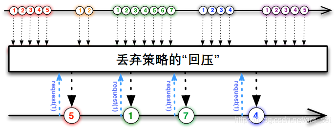

参考：

reactive-streams官网：https://www.reactive-streams.org/

[响应式Spring的道法术器（Spring WebFlux 教程）_享学IT的博客-CSDN博客](https://blog.csdn.net/get_set/article/details/79466657)

[（1）什么是响应式编程——响应式Spring的道法术器_享学IT的博客-CSDN博客_响应式编程](https://blog.csdn.net/get_set/article/details/79455258)

[（2）响应式流——响应式Spring的道法术器_享学IT的博客-CSDN博客_响应式spring的道法术器](https://blog.csdn.net/get_set/article/details/79466402)


前置知识：java lambda、函数式接口

# 响应式编程

> **响应式编程（reactive programming）是一种基于数据流（data stream）和变化传递（propagation of change）的声明式（declarative）的编程范式。**

非阻塞的异步编程，映射在代码中本质就是**回调函数**，与响应式编程模型对应的是传统的 `指令式编程` ;

- 指令编程模型：同步阻塞，告诉计算机 该怎么做，控制的是状态
- 响应式编程模型：异步非阻塞， 告诉计算机 要做什么，控制的是目标

响应式编程关注的数据流而不是控制流。

## 响应式的核心特点

- **变化传递（propagation of change）**  比如Excel单元格中使用公式，一个单元格变化之后，会像多米诺骨牌一样，导致直接和间接引用它的其他单元格均发生相应变化。
- **基于数据流（data stream）**  比如小明在选购商品，时不时往购物车里添加或移除商品，这一次一次的操作事件连起来就是一串数据流（data stream）。
- **声明式（declarative）** 命令式和声明式本身并无高低之分，只是声明式比较适合基于流的处理方式。

声明式举例：

```java
a = 1;
b = a + 1;
a = 2;
```

这个时候，b是多少呢？在Java以及多数语言中，b的结果是2，第二次对a的赋值并不会影响b的值。

假设Java引入了一种新的赋值方式`:=`，表示一种对a的绑定关系，如

```java
a = 1;
b := a + 1;
a = 2;
```

由于b保存的不是某次计算的值，而是针对a的一种绑定关系，所以b能够随时根据a的值的变化而变化，这时		候`b==3`，我们就可以说`:=`是一种声明式赋值方式。而普通的`=`是一种命令式赋值方式。事实上，我们绝大多		数的开发都是命令式的，如果需要用命令式编程表达类似上边的这种绑定关系，在每次a发生变化并需要拿到		b的时候都得执行`b = a + 1`来更新b的值。

java8中的Stream API也是声明式的

**命令式是面向过程的，声明式是面向结构的。**

## java中的响应式编程库

java中的响应式编程库，从开始到现在已经历经多代，第0代就是java包Observable 接口，也就是观察者模式。具体的发展见下：

- **第0代** java.util.Observable和Observer类

- **第1代** rx.NET， Reactive4Java，早期的RxJava
- **第2代** RxJava2
- **第3代** RxJava2，Project Reactor，Akka-Streams
- **第4代** RxJava2，Project Reactor 2.5+

其中java.util.Observable和Observer类 从java9开始已被标记为废弃。


目前有几个实现了响应式流规范的Java库，这里简单介绍两个：**RxJava**和**Reactor**。

要介绍RxJava，就不得不提ReactiveX（Reactive Extensions,Rx），它最初是LINQ的一个扩展，由微软的架构师Erik Meijer领导的团队开发，在2012年11月开源，Rx是一个编程模型，目标是提供一致的编程接口，帮助开发者更方便的处理异步数据流，Rx库支持.NET、JavaScript和C++，Rx近几年越来越流行了，现在已经支持几乎全部的流行编程语言了，包括RxJS、RxJava等。

后来，Java社区的一些大牛凑到一起制定了一个[响应式流规范](https://github.com/reactive-streams/reactive-streams-jvm/blob/v1.0.2/README.md)。RxJava团队随后对1版本进行了重构，形成了兼容该响应流规范的RxJava 2。

Reactor是Pivotal旗下的项目，与大名鼎鼎的Spring是兄弟关系，因此是Spring近期推出的响应式模块WebFlux的“御用”响应式流。Reactor支持响应式流规范，与RxJava相比，它没有任何历史包袱，专注于Server端的响应式开发，而RxJava更多倾向于Android端的响应式开发。

在Java 9版本中，响应式流的规范被[纳入到了JDK中](http://www.reactive-streams.org/)，相应的API接口是[java.util.concurrent.Flow](https://docs.oracle.com/javase/9/docs/api/java/util/concurrent/Flow.html)。

Spring WebFlux也是本系列文章后边的重点内容。由于WebFlux首选Reactor作为其响应式技术栈的一部分，我们下边也主要以Reactor为主，目前的版本是Reactor3。


# 响应式流

> **具备“异步非阻塞”特性和“流量控制”能力的数据流，我们称之为响应式流（Reactive Stream）。**

## 异步非阻塞

Http服务本质上是对资源的操作，尤其是RESTful兴起之后，更是如此。所谓的资源，对应在服务器端就是文件和数据。I/O很慢。

对于阻塞造成的性能损失，我们通常有两种思路来解决：

并行化：使用更多的线程和硬件资源；
异步化：基于现有的资源来提高执行效率。

### 解决方案之一：多线程

多线程方案的不足之处：

- 高并发环境下，多线程的切换会消耗CPU资源
- 应对高并发环境的多线程开发相对比较难（需要掌握线程同步的原理与工具、ExecutorService、Fork/Join框架、并发集合和原子类等的使用），并且有些问题难以发现或重现（比如指令重排）；
- 高并发环境下，更多的线程意味着更多的内存占用（JVM默认为每个线程分配1M的线程栈空间）。

多线程在高并发方面发挥了重要作用，仍然是目前主流的高并发方案。


### 解决方案之二：非阻塞


## 流量控制——背压(回压)

 Back Pressure

>Back pressure (or backpressure) is a resistance or force opposing the desired flow of fluid through pipes, leading to friction loss and pressure drop.
>The term back pressure is a misnomer, as pressure is a scalar quantity, so it has a magnitude but no direction.
>后向压力（背压）是一种阻力或力，它与通过管道的期望流体流量相反，从而导致摩擦损失和压降。
>这个术语是一个误称，因为压力是一个标量，所以它只有大小没有方向。
>——**[Wikipedia](https://en.wikipedia.org/wiki/Back_pressure)**


在软件中，背压的含义略有关联，但仍有不同：假设有一个**快的数据生产者和一个慢的数据消费者**，**背压就是一种 "倒逼 "生产者而使自己不被数据淹没的机制**。

在响应式流中，数据流的发出者叫做`Publisher`，监听者叫做`Subscriber`。我们后续就统一直译叫做“发布者”和“订阅者”吧。


问题来了，假如发布者发出数据的速度和订阅者处理数据的速度不同的时候，怎么办呢？订阅者处理速度快的话，那还好说，但是如果处理速度跟不上数据发出的速度，就像这样：


如果没有流量控制，那么订阅者会被发布者快速产生的数据流淹没。就像在一个流水线上，如果某个工位处理比较慢，而上游下料比较快的话，这个工位的工人师傅就吃不消了，这个时候他需要一种途径来告诉上游下料慢一些。

同样的，订阅者也需要有一种能够向上游反馈流量需求的机制：


这种能够向上游反馈流量请求的机制就叫做回压（backpressure，也有翻译为“背压”的）。

在具体的使用过程中，回压的处理会涉及不同的策略。举两个例子以便于理解：

**举例：缓存的策略**


如图，订阅者处理完一个元素的时候通过`request(1)`跟发布者再请求一个元素。由于发布者的数据不能很快被订阅者处理掉，那么发布者会将未处理的数据元素缓存起来。

这种处理方式与消息队列有些相似之处，发布者需要维护一个队列用来缓存还没有被处理的元素。通常用于对数据准确性要求比较高的场景，比如发布者这儿是突然到来的数据高峰，都是要保存到数据库的，作为订阅者的数据持久层没有那么快的处理速度，那么发布者就需要将数据暂时缓存起来。

**举例：丢弃的策略**



如图，发布者不需要缓存来不及处理的数据，而是直接丢弃，当订阅者请求数据的时候，会拿到发布者那里最近的一个数据元素。比如我们在做一个监控系统，后台的监控数据以每秒10个的速度产生，而前端界面只需要每秒钟更新一下监控数据即可，那作为发布者的后台就不用缓存数据了，因为这种时效性强的场景，用不到的数据直接丢掉即可。

> 在后续的实战阶段，我们还会再深入了解回压的作用原理。

## 总结

以上就是响应式流的两个核心特点：异步非阻塞，以及基于“回压”机制的流量控制。

这样我们有了基于响应式流的“升级版”的响应式编程：


Reactor3和RxJava2都是具有以上特点的响应式流的具体实现库。

响应式编程通常作为面向对象编程中的“观察者模式”（Observer design pattern）的一种扩展。 响应式流（reactive streams）与“迭代子模式”（Iterator design pattern）也有相通之处， 因为其中也有 Iterable-Iterator 这样的对应关系。主要的区别在于，Iterator 是基于 “拉取”（pull）方式的，而响应式流是基于“推送”（push）方式的。

使用 iterator 是一种“命令式”（imperative）编程范式，因为什么时候获取下一个元素取决于开发者。在响应式流中，相对应的角色是“发布者 - 订阅者”（Publisher-Subscriber），当有新的值到来的时候，反过来由发布者（Publisher） 通知订阅者（Subscriber），这种“推送”模式是响应式的关键。此外，对推送来的数据的操作 是通过一种声明式（declaratively）而不是命令式（imperatively）的方式表达的：开发者通过 描述“处理流程”来定义对数据流的处理逻辑。

