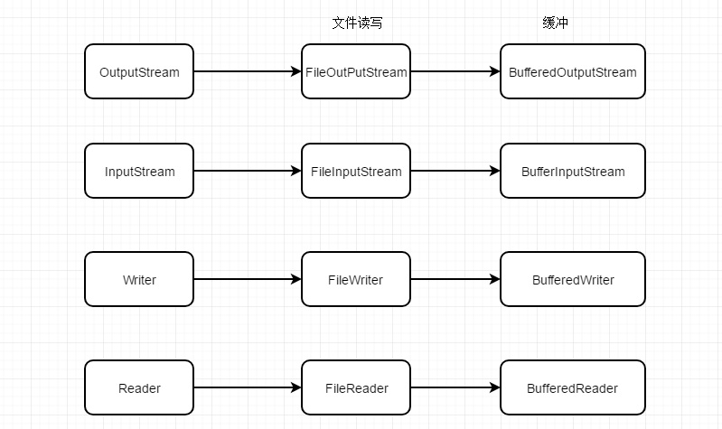

来源：https://developer.aliyun.com/article/669698

## 1、慎用异常

在Java软件开发中，经常使用 try-catch 进行错误捕获，但是，try-catch 语句对系统性能而言是非常糟糕的。虽然在一次 try-catch中，无法察觉到它对性能带来的损失，但是，一旦try-catch被应用于循环之中，就会给系统性能带来极大的伤害。

以下是一段将try-catch应用于for循环内的示例

```
    public void test() {
        int a = 0;
        try {
            for (int i = 0; i < 1000000; i++) {
                a = a + 1;
                System.out.println(i);
            }
        } catch (Exception e) {
            e.printStackTrace();
        }
    }
```

这段代码我运行时间是 27211 ms。如果将try-catch移到循环体外，那么就能提升系统性能，如下代码

```
   public void test() {
        int a = 0;
        for (int i = 0; i < 1000000; i++) {
            try {
                a = a + 1;
                System.out.println(i);
            } catch (Exception e) {
                e.printStackTrace();
            }
        }
    }
```

运行耗时 15647 ms。可见tyr-catch对系统性能的影响。

## 2、使用局部环境

调用方法时传递的参数以及在调用中创建的临时变量都保存在栈（Stack）中，速度较快。其他变量，如静态变量、实例变量等，都在堆（Heap）中创建，速度较慢。

下面是一段测试用例

```
//   private static int a = 0;

    public static void main(String[] args) {
        int a = 0;
        long start = System.currentTimeMillis();
        for (int i = 0; i < 1000000; i++) {
            a = a + 1;
            System.out.println(i);
        }
        System.out.println(System.currentTimeMillis() - start);
    }
```

运行结果很明显，使用静态变量耗时15677ms，使用局部变量耗时13509ms。由此可见，**局部变量的访问速度高于类的成员变量**。

## 3、位运算代替乘除法

在所有的运算中，**位运算是最为高效的**。因此，可以尝试使用位运算代替部分算术运算，来提高系统的运行速度。

比如在HashMap的源码中使用了位运算

```
    static final int DEFAULT_INITIAL_CAPACITY = 1 << 4; // aka 16

    static final int MAXIMUM_CAPACITY = 1 << 30;
```

对于整数的乘除运算优化

```
a*=2
a/=2
```

用位运算可以写为

```
a<<=1
a>>=1
```

## 4、替换switch

关键字 switch 语句用于多条件判断， switch 语句的功能类似于 if-else 语句，两者性能也差不多。因此，不能说 switch 语句会降低系统的性能。但是，在绝大部分情况下，switch 语句还是有性能提升空间的。

来看下面的例子：

```
    public static void main(String[] args) {
        long start = System.currentTimeMillis();
        int re = 0;
        for (int i = 0;i<1000000;i++){
            re = switchInt(i);
            System.out.println(re);
        }
        System.out.println(System.currentTimeMillis() - start+"毫秒");//17860
    }

    public static int switchInt(int z){
        int i = z%10+1;
        switch (i){
            case 1:return 3;
            case 2:return 6;
            case 3:return 7;
            case 4:return 8;
            case 5:return 10;
            case 6:return 16;
            case 7:return 18;
            case 8:return 44;
            default:return -1;
        }
    }
```

就分支逻辑而言，这种 switch 模式的性能并不差。但是如果换一种新的思路替代switch，实现相同的程序功能，name性能就能有很大的提升空间。

```
    public static void main(String[] args) {
        long start = System.currentTimeMillis();
        int re = 0;
        int[] sw = new int[]{0,3,6,7,8,10,16,18,44};
        for (int i = 0;i<1000000;i++){
            re = arrayInt(sw,i);
            System.out.println(re);
        }
        System.out.println(System.currentTimeMillis() - start+"毫秒");//12590
    }
    
    public static int arrayInt(int[] sw,int z){
        int i = z%10+1;
        if (i>7 || i<1){
            return -1;
        }else {
            return sw[i];
        }
    }
```

以上代码使用全新的思路，使用一个连续的数组代替了 switch 语句。因为对数据的随机访问是非常快的，至少好于 switch 的分支判断。通过实验，使用switch的语句耗时17860ms，使用数组的实现只耗时12590ms，提升了5s多。在软件开发中，换一种思路可能会取得更好的效果，比如使用数组替代switch语句就是就是一个很好的例子。

## 5、一维数组代替二维数组

由于数组的随机访问的性能非常好，许多JDK类库，如ArrayList、Vector等都是使用了数组作为其数组实现。但是，作为软件开发人员也必须知道，一位数组和二维数组的访问速度是不一样的。**一位数组的访问速度要优于二维数组**。因此，在性能敏感的系统中要使用二维数组的，可以尝试通过可靠地算法，将二维数组转为一维数组再进行处理，以提高系统的响应速度。

## 6、提取表达式

在软件开发过程中，程序员很容易有意无意让代码做一些“重复劳动”，在大部分情况下，由于计算机的告诉运行，这些“重复劳动”并不会对性能构成太大的威胁，但若将系统性能发挥到极致，提取这些“重复劳动”相当有意义。

来看下面的测试用例：

```
    @Test
    public void test(){
        long start = System.currentTimeMillis();
        ArrayList list = new ArrayList();
        for (int i = 0;i<100000;i++){
            System.out.println(list.add(i));
        }
        //以上是为了做准备
        for (int i = 0;i<list.size();i++){
            System.out.println(list.get(i));
        }
        System.out.println(System.currentTimeMillis() - start);//5444
    }
```

如果我们把list.size()方法提取出来，优化后的代码如下：

```
    @Test
    public void test(){
        long start = System.currentTimeMillis();
        ArrayList list = new ArrayList();
        for (int i = 0;i<100000;i++){
            System.out.println(list.add(i));
        }
        //以上是为了做准备
        int n = list.size();
        for (int i = 0;i<n;i++){
            System.out.println(list.get(i));
        }
        System.out.println(System.currentTimeMillis() - start);//3514
    }
```

在我的机器上，前者耗时5444ms，后者耗时3514ms，相差2s左右，可见，提取重复的操作是相当有意义的。

## 7、展开循环

与前面所介绍的优化技巧略有不同，笔者认为展开循环是一种在极端情况下使用的优化手段，因为展开循环很可能会影响代码的可读性和可维护性，而这两者对软件系统来说也是极为重要的。但是，当性能问题成为系统主要矛盾时，展开循环绝对是一种值得尝试的技术。

## 8、布尔运算代替位运算

虽然位运算的速度远远高于算术运算，但是在条件判断时，使用位运算替代布尔运算却是非常错误的选择。

在条件判断时，Java会对布尔运算做相当充分的优化。假设有表达式 a,b,c 进行布尔运算“a&&b&&c” ，根据逻辑与的特点，只要在整个布尔表达式中有一项返回false，整个表达式就返回false，因此，当表达式a为false时，该表达式将立即返回 false ，而不会再去计算表达式b 和c。同理，当计算表达式为“a||b||c”时，也是一样。

若使用位运算（按位与”&“、按位或”|“）代替逻辑与和逻辑或，虽然位运算本身没有性能问题，但是位运算总是要将所有的子表达式全部计算完成后，再给出最终结果。因此，从这个角度来说，使用位运算替代布尔运算会使系统进行很多无效计算。

## 9、使用arrayCopy()

数组复制是一项使用频率很高的功能，JDK中提供了一个高效的API来实现它：

如果在应用程序需要进行数组复制，应该使用这个函数，而不是自己实现。

方法代码：

```
  public static native void arraycopy(Object src,  int  srcPos,
                                        Object dest, int destPos,
                                        int length);
```

它的用法是将源数组 src 从索引 srcPos 处复制到目标数组 dest 的 索引destPos处，复制的长度为 length。

> System.arraycopy() 方法是 native 方法，通常 native 方法的性能要优于普通的方法。仅出于性能考虑，在软件开发中，尽可能调用 native 方法。

## 10、使用Buffer进行I/O流操作

除NIO外，使用 Java 进行 I/O操作有两种基本方法：

1. 使用基于InputStream 和 OutputStream 的方式；（字节流）
2. 使用 Writer 和 Reader。（字符流）

无论使用哪种方式进行文件 I/O，如果能合理地使用缓冲，就能有效的提高I/O的性能。



## 11、使用clone()代替new

在Java中新建对象实例最常用的方法是使用 new 关键字。JDK对 new 的支持非常好，使用 new 关键字创建轻量级对象时，速度非常快。但是，对于重量级对象，由于对象在构造函数中可能会进行一些复杂且耗时的操作，因此，构造函数的执行时间可能会比较长。导致系统短期内无法获得大量的实例。为了解决这个问题，可以使用Object.clone() 方法。

Object.clone() 方法可以绕过构造函数，快速复制一个对象实例。但是，在默认情况下，clone()方法生成的实例只是原对象的浅拷贝。

这里不得不提Java只有值传递了，关于这点，我的理解是基本数据类型引用的是值，普通对象引用的也是值，不过这个普通对象引用的值其实是一个对象的地址。代码示例：

```
  int i = 0;
  int j = i;    //i的值是0
  User user1 = new User();
  User user2 = user1;   //user1值是new User()的内存地址
```

如果需要深拷贝，则需要重新实现 clone() 方法。下面看一下ArrayList实现的clone()方法：

```
    public Object clone() {
        try {
            ArrayList<?> v = (ArrayList<?>) super.clone();
            v.elementData = Arrays.copyOf(elementData, size);
            v.modCount = 0;
            return v;
        } catch (CloneNotSupportedException e) {
            // this shouldn't happen, since we are Cloneable
            throw new InternalError(e);
        }
    }
```

在ArrayList的clone()方法中，首先使用 super.clone() 方法生成一份浅拷贝对象。然后拷贝一份新的elementData数组让新的ArrayList去引用。使克隆后的ArrayList对象与原对象持有不同的引用，实现了深拷贝。

## 12、静态方法替代实例方法

使用 static 关键字描述的方法为静态方法。在Java中，由于实例方法需要维护一张类似虚函数表的结构，以实现对多态的支持。与静态方法相比，实例方法的调用需要更多的资源。因此，对于一些常用的工具类方法，没有对其进行重载的必要，那么将它们声明为 static，便可以加速方法的调用。同时，调用 static 方法不需要生成类的实例。比调用实例方法更为方便、易用。