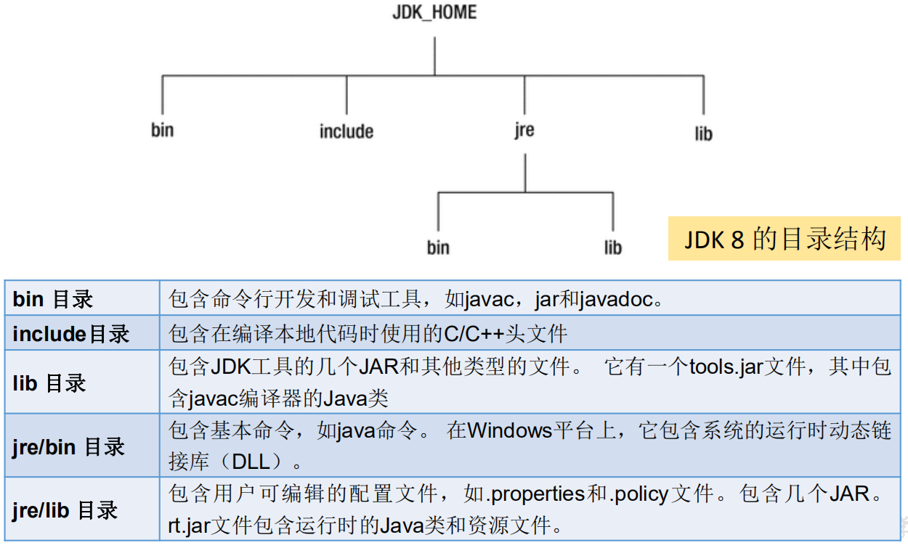
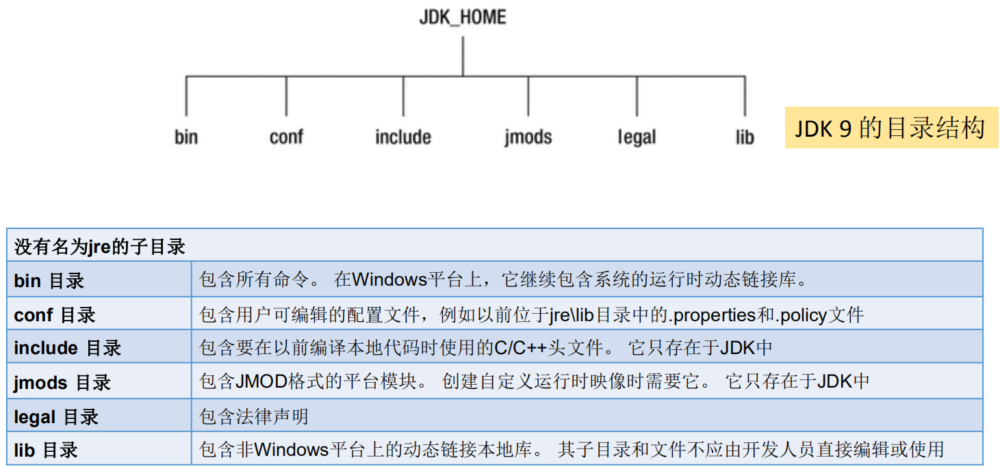
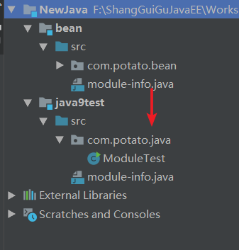
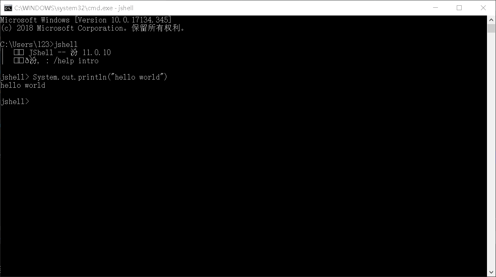
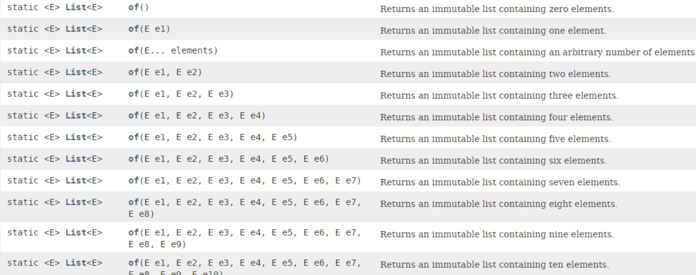

# JDK9

安装多个版本JDK的环境变量配置：

https://blog.csdn.net/u013066244/article/details/108311123

https://blog.csdn.net/Yeoh1999/article/details/108248254


## 总览

2017年9月21日发布

Java 9 提供了**超过150项新功能特性**，包括备受期待的**模块化系统**、可交互
的 REPL 工具：jshell，JDK 编译工具，Java 公共 API 和私有代码，以及安
全增强、扩展提升、性能管理改善等。可以说Java 9是一个庞大的系统工程，
完全做了一个整体改变

-  **模块化系统**
- **jShell命令**
-  多版本兼容jar包 
- <u>接口的私有方法</u>
- <u>钻石操作符的使用升级</u>
- <u>语法改进：try语句</u>
- **String存储结构变更**
- **便利的集合特性：of()**
- **增强的Stream API**
- **全新的HTTP客户端API**
- **Deprecated的相关API**
- javadoc的HTML 5支持
- Javascript引擎升级：Nashorn  （JDK11中又废弃了）
- java的动态编译器






## 模块化系统 **Jigsaw**->Modularity

谈到 Java 9 大家往往第一个想到的就是 Jigsaw 项目。众所周知，Java 已经
发展超过 20 年（95 年最初发布），Java 和相关生态在不断丰富的同时也越
来越暴露出一些问题：

-  **Java 运行环境的膨胀和臃肿**。每次JVM启动的时候，至少会有30～60MB的内存
  加载，主要原因是JVM需要加载rt.jar，不管其中的类是否被classloader加载，第
  一步整个jar都会被JVM加载到内存当中去（而模块化可以根据模块的需要加载程
  序运行需要的class）
- **当代码库越来越大，创建复杂，盘根错节的“意大利面条式代码”的几率呈指数级的**
  **增长**。不同版本的类库交叉依赖导致让人头疼的问题，这些都阻碍了 Java 开发和
  运行效率的提升。
- 很难真正地对代码进行封装, 而系统并没有对不同部分（也就是 JAR 文件）之间
  的依赖关系有个明确的概念。**每一个公共类都可以被类路径之下任何其它的公共**
  **类所访问到，这样就会导致无意中使用了并不想被公开访问的 API**。

- 本质上讲也就是说，**用模块来管理各个package**，通过声明某个package
  暴露，，模块(module)的概念，**其实就是package外再裹一层**，不声明默
  认就是隐藏。因此，模块化使得代码组织上更安全，因为它**可以指定哪**
  **些部分可以暴露，哪些部分隐藏**。

实现目标

-  模块化的主要目的在于减少内存的开销
- 只须必要模块，而非全部jdk模块，可简化各种类库和大型应用的开
  发和维护
- 改进 Java SE 平台，使其可以适应不同大小的计算设备
- 改进其安全性，可维护性，提高性能



**bean模块**

```java
public class Person {
    private String name;
    private int age;
    //...
}
```

module-info.java 这个文件就是负责模块的导入导出

到出：exports  包名

```java
module bean {
    exports com.potato.bean;
}
```

**java9test模块**

```java
package com.potato.java;

import com.potato.bean.Person;

/**
 * Java9新特性：模块
 */
public class ModuleTest {
    public static void main(String[] args) {
        Person p = new Person();
        System.out.println(p);
    }
}
```

module-info.java 导入模块  requires 模块名

```java
/**
 * 导入需要的模块,就像maven一样
 */
module java9test {
     requires bean;
}
```

## REPL工具：jshell命令

像Python 和 Scala 之类的语言早就有**交互式编程环境** REPL (read - evaluate - print -
loop)了，以交互式的方式对语句和表达式进行求值。开发者只需要输入一些代码，
就可以在编译前获得对程序的反馈。而之前的Java版本要想执行代码，必须创建文
件、声明类、提供测试方法方可实现。



感觉没啥用，Java的代码比较繁琐，在这里面写不方便，在别的地方写，复制粘贴到这里运行是可以的

- 在 JShell 环境下，语句末尾的“;” 是可
  选的。但推荐还是最好加上。提高代码可读
  性。

- 只需按下 Tab 键，就能自动补全代码

- 列出当前 session 里所有有效的代码片段 **/list**

- 查看当前 session 下所有创建过的变量  **/vars**

- 查看当前 session 下所有创建过的方法  **/methods**

- Tips：我们还可以重新定义相同方法名和参
  数列表的方法，即为对现有方法的修改（或
  覆盖）。

- 使用外部代码编辑器来编写 Java 代码  **/edit add**  会出现一个类似于记事本一样的界面

- 使用/open命令调用：  **/open 文件名**
- 没有受检异常（编译时异常），即本该要出现异常时，jshell给隐藏了不显示
- 退出jshell  **/exit**

## 语法改进：接口的私有方法

**Java 8**中规定接口中的方法除了**抽象方法**之外，还可以定义**静态方法**
**和默认的方法**。一定程度上，扩展了接口的功能，此时的接口更像是
一个抽象类

在**Java 9**中，接口更加的灵活和强大，连**方法的访问权限修饰符都可以声明为private**的了，此时方法将不会成为你对外暴露的API的一部分。

接口越来越像类了

```java
public interface MyInterface {
    //如下三个方法省略的权限修饰符都是public
    void methodAbstract();
    static void methodStatic(){
        System.out.println("我是接口中的静态方法");
    }
    default void methodDefault(){
        System.out.println("我是接口中的默认方法");
    }

    private void methodPrivate(){
        System.out.println("我是接口中的私有方法");
    }
}
```

实现类：

```java
public class MyInterfaceImpl implements MyInterface {
    @Override
    public void methodAbstract() {

    }
    //默认方法也可以重写
    //接口实现类不能调用接口的静态方法
}
```

## 语法改进:钻石操作符使用升级

之前，钻石操作符一般用在泛型中

我们将能够**与匿名实现类共同使用钻石操作符**（diamond operator）在Java 8
中如下的操作是会报错的：

```java
Comparator<Object> com = new Comparator<>(){
    @Override
    public int compare(Object o1, Object o2) {
        return 0;
    }
};
//编译报错信息：Cannot use “<>” with anonymous inner classes.
```

Java 9中如下操作可以正常执行通过：

```java
// anonymous classes can now use type inference
Comparator<Object> com = new Comparator<>(){
    @Override
    public int compare(Object o1, Object o2) {
        return 0; }
};
```

## 语法改进：try语句

```java
//Java8 之前的资源关闭操作
void test2(){
    InputStreamReader reader = null;
    try{
        reader = new InputStreamReader(System.in);
        char[] cbuf = new char[20];
        int len;
        if ((len = reader.read(cbuf))!=-1){
            String str = new String(cbuf,0,len);
            System.out.println(str);
        }
    }catch (IOException e){
        e.printStackTrace();
    }finally {
        if (reader!=null){
            try {
                reader.close();
            } catch (IOException e) {
                e.printStackTrace();
            }
        }
    }
}
```

Java 8 中，可以实现**资源的自动关闭**，但是要**求执行后必须关闭的所有资源必**
**须在try子句中初始化**，否则编译不通过。如下例所示：

```java
//Java8中资源的关闭
void test3(){
    try(InputStreamReader reader= new InputStreamReader(System.in)) {
        char[] cbuf = new char[20];
        int len;
        if ((len = reader.read(cbuf))!=-1){
            String str = new String(cbuf,0,len);
            System.out.println(str);
        }
    } catch (IOException e) {
        e.printStackTrace();
    }
}
```

Java 9 中，用资源语句编写try将更容易，我们**可以在try子句中使用已经初始**
**化过的资源，此时的资源是final的**

```java
//Java9中的资源关闭
void test4(){
    InputStreamReader reader= new InputStreamReader(System.in);
    try(reader){
         //此时的reader是final的，只能用，不能改
        char[] cbuf = new char[20];
        int len;
        if ((len = reader.read(cbuf))!=-1){
            String str = new String(cbuf,0,len);
            System.out.println(str);
        }
    } catch (IOException e) {
        e.printStackTrace();
    }
}
```

## String存储结构变更

Motivation

The current implementation of the String class stores characters in a char 
array, using two bytes (sixteen bits) for each character. Data gathered from 
many different applications indicates that strings are a major component of 
heap usage and, moreover, that most String objects contain only Latin-1 
characters. Such characters require only one byte of storage, hence half of the 
space in the internal char arrays of such String objects is going unused.

Description

We propose to change the internal representation of the String class from a 
UTF-16 char array to a byte array plus an encoding-flag field. The new String 
class will store characters encoded either as ISO-8859-1/Latin-1 (one byte per 
character), or as UTF-16 (two bytes per character), based upon the contents 
of the string. The encoding flag will indicate which encoding is used


**String 再也不用 char[] 来存储啦，改成了 byte[] 加上编码标记**，节约
了一些空间

以前的char[]数组中，一个char元素使用2个字节。现在的byte[]数组，一个byte元素使用一个字节，对于英文，一个字节存就行了，对于汉字，还是两个字节，会自动的动态调整。

在JDK9的String类中，维护了这样的一个属性coder，它是一个编码格式的标识，使用LATIN1还是UTF-16，这个是在String生成的时候自动的，如果字符串中都是能用LATIN1就能表示的就是0，否则就是UTF-16.https://blog.csdn.net/qq_41376740/article/details/80143215

```java
public final class String
    implements java.io.Serializable, Comparable<String>, CharSequence {
    @Stable
    private final byte[] value; 
    private final byte coder;
}
```

那StringBuffer 和 StringBuilder 是否仍无动于衷呢？

是的，**也变成了byte[]数组**

String-related classes such as AbstractStringBuilder, StringBuilder, 
and StringBuffer will be updated to use the same representation, as will the 
HotSpot VM‘s intrinsic(固有的、内置的) string operations.

## 集合工厂方法：快速创建只读集合

要创建一个**只读、不可改变**的集合，必须构造和分配它，然后添加元素，最后
包装成一个不可修改的集合。

Java8和以前的写法：

```java
List<String> namesList = new ArrayList <>();
namesList.add("Joe");
namesList.add("Bob");
namesList.add("Bill");
namesList = Collections.unmodifiableList(namesList);
System.out.println(namesList);
```

缺点：我们一下写了五行。即：它不能表达为单个表达式

```java
List<String> list = Collections.unmodifiableList(Arrays.asList("a", "b", "c"));
Set<String> set = Collections.unmodifiableSet(new HashSet<>(Arrays.asList("a", "b", "c")));
// 如下操作不适用于jdk 8 及之前版本,适用于jdk 9
Map<String, Integer> map = Collections.unmodifiableMap(new HashMap<>() {
{
put("a", 1);
put("b", 2);
put("c", 3);
}
});
map.forEach((k, v) -> System.out.println(k + ":" + v));
```

Java 9因此引入了方便的方法，这使得类似的事情更容易表达。



```java
//Java9:快速创建只读集合,集合工厂方法
void test3() {
    List<String> list = List.of("a", "b", "c");
    Set<String> set = Set.of("a", "b", "c");
    Map<String, Integer> map = Map.of("a", 1, "b", 2, "c", 3);
    map.forEach((k, v) -> System.out.println(k + ":" + v));

    Map<String, Integer> map2 = Map.ofEntries(Map.entry("Tom", 34), Map.entry("Jerry", 21));
    System.out.println(map2);
}
```

调用集合中静态方法of()，可以将不同数量的参数传输到此工厂方法中。此功能
可用于Set和List，也可用于Map的类似形式。此时得到的集合，是不可变的：在
创建后，继续添加元素到这些集合会导致 “UnsupportedOperationException” 。
由于Java 8中接口方法的实现，可以直接在List，Set和Map的接口内定义这些方法，
便于调用。

## InputStream 加强

InputStream 终于有了一个非常有用的方法：**transferTo**，可以用来将数据直接
传输到 OutputStream，这是在处理原始数据流时非常常见的一种用法，如下示例

```java
ClassLoader cl = this.getClass().getClassLoader();
try (InputStream is = cl.getResourceAsStream("hello.txt");
     OutputStream os = new FileOutputStream("src\\hello1.txt")) {
    is.transferTo(os); // 把输入流中的所有数据直接自动地复制到输出流中
} catch (IOException e) {
    e.printStackTrace();
}
```

## 增强的 Stream API

- Java 的 Steam API 是java标准库最好的改进之一，让开发者能够快速运算，
  从而能够有效的利用数据并行计算。Java 8 提供的 Steam 能够利用多核架构
  实现声明式的数据处理。
-  在 Java 9 中，Stream API 变得更好，Stream 接口中添加了 4 个新的方法：
  takeWhile, dropWhile, ofNullable，还有个 iterate 方法的新重载方法，可以
  让你提供一个 Predicate (判断条件)来指定什么时候结束迭代。 
-  除了对 Stream 本身的扩展，Optional 和 Stream 之间的结合也得到了改进。
  现在可以通过 Optional 的新方法 stream() 将一个 Optional 对象转换为一个
  (可能是空的) Stream 对象。

**takeWhile()的使用**

用于从 Stream 中获取一部分数据，接收一个 Predicate 来进行选择。在有序的
Stream 中，**takeWhile 返回从开头开始的尽量多的元素**。

```java
List<Integer> list = Arrays.asList(45, 43, 76, 87, 42, 77, 90, 73, 67, 88);
list.stream().takeWhile(x -> x < 50).forEach(System.out::println);
System.out.println();
list = Arrays.asList(1, 2, 3, 4, 5, 6, 7, 8);
list.stream().takeWhile(x -> x < 5).forEach(System.out::println);
```

**dropWhile()的使用**

dropWhile 的行为与 takeWhile 相反，返回剩余的元素。

```java
List<Integer> list = Arrays.asList(45, 43, 76, 87, 42, 77, 90, 73, 67, 88);
list.stream().dropWhile(x -> x < 50).forEach(System.out::println);
System.out.println();
list = Arrays.asList(1, 2, 3, 4, 5, 6, 7, 8);
list.stream().dropWhile(x -> x < 5).forEach(System.out::println);
```

**ofNullable()的使用**

Java 8 中 **Stream 不能完全为null**，否则会报空指针异常。而 Java 9 中的 ofNullable 方
法允许我们**创建一个单元素 Stream**，可以包含一个非空元素，也可以创建一个空
Stream。

```java
// 报NullPointerException
// Stream<Object> stream1 = Stream.of(null);
// System.out.println(stream1.count());
// 不报异常，允许通过
Stream<String> stringStream = Stream.of("AA", "BB", null);
System.out.println(stringStream.count());// 3
// 不报异常，允许通过
List<String> list = new ArrayList<>();
list.add("AA");
list.add(null);
System.out.println(list.stream().count());// 2
// ofNullable()：允许值为null
Stream<Object> stream1 = Stream.ofNullable(null);
System.out.println(stream1.count());// 0
Stream<String> stream = Stream.ofNullable("hello world");
System.out.println(stream.count());// 1
```

