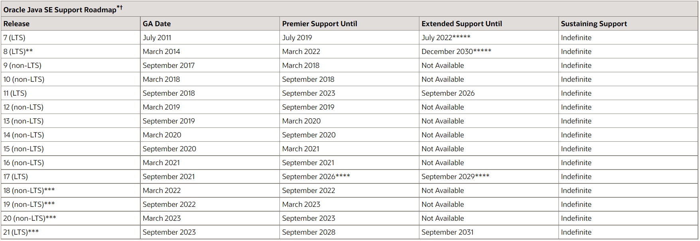

# 前言

文章内容来源：Java技术栈（微信公众号）[重磅！JDK 17 发布，Oracle 宣布从 JDK 17 开始正式免费。。 (qq.com)](https://mp.weixin.qq.com/s/O8eHiLctnMB2UfokcoPrZQ)

oracle官网下载java:[Java Downloads | Oracle](https://www.oracle.com/java/technologies/downloads/)

oracle发布java17的帖子：[Oracle Releases Java 17](https://www.oracle.com/news/announcement/oracle-releases-java-17-2021-09-14/)

Java各个版本的支持年限：[Oracle Java SE Support Roadmap](https://www.oracle.com/java/technologies/java-se-support-roadmap.html)



Premier Support（最高优先级的支持）,Extended Support（中等优先级的支持）,Sustaining Support（最低优先级的支持）

可以看到，JDK 17 是自 2018 年 JDK 11 后的第二个长期支持版本，支持到 2029 年 9 月，好家伙，支持时间长达 8 年，这下可以不用死守 JDK 8 了，JDK 17+ 也可以是一种新的选择了。。

下一个第三个长期支持版本是 JDK 21，时间为 2023 年 9 月，这次长期支持版本发布计划改了，不再是原来的 3 年一次，而是改成了 2 年一次！

另外，非长期支持版本还是半年发一次不变，下一个非长期支持版本计划在 2022/03 发布，但注意不要用在生产。

Java 17+ 可以免费使用了，包括商用，更详细的条款可以阅读：

https://www.oracle.com/downloads/licenses/no-fee-license.html

# JDK 17 新特性一览

| ID   | 特性                                               | 说明                           |
| :--- | :------------------------------------------------- | :----------------------------- |
| 1    | 306:Restore Always-Strict Floating-Point Semantics | 恢复始终执行严格模式的浮点定义 |
| 2    | 356:Enhanced Pseudo-Random Number Generators       | 增强型伪随机数生成器           |
| 3    | 382:New macOS Rendering Pipeline                   | 新的 macOS 渲染管道            |
| 4    | 391:macOS/AArch64 Port                             | macOS AArch64 端口             |
| 5    | 398:Deprecate the Applet API for Removal           | 弃用 Applet API                |
| 6    | 403:Strongly Encapsulate JDK Internals             | JDK 内部强封装                 |
| 7    | 406:Pattern Matching for switch (Preview)          | 为 switch 支持模式匹配         |
| 8    | 407:Remove RMI Activation                          | 移除 RMI 激活                  |
| 9    | 409:Sealed Classes                                 | 密封类                         |
| 10   | 410:Remove the Experimental AOT and JIT Compiler   | 移除实验性的 AOT 和 JIT 编译器 |
| 11   | 411:Deprecate the Security Manager for Removal     | 弃用安全管理器                 |
| 12   | 412:Foreign Function & Memory API (Incubator)      | 外部函数和内存 API（孵化中）   |
| 13   | 414:Vector API (Second Incubator)                  | 矢量 API（二次孵化中）         |
| 14   | 415:Context-Specific Deserialization Filters       | 上下文特定反序列化过滤器       |

JDK 17 这个版本提供了 14 个增强功能，另外在性能、稳定性和安全性上面也得到了大量的提升，以及还有一些孵化和预览特性，有了这些新变化，Java 会进一步提高开发人员的生产力。

下面是 JDK 17 中的 14 个新特性详细介绍，分为 5 大类进行介绍！

# 语言增强

## 409:Sealed Classes

[Java15后的sealed阻止继承滥用 - 枫叶像思念 - 博客园 (cnblogs.com)](https://www.cnblogs.com/cckong/p/13738324.html)

密封类，这个特性在 [JDK 15](https://mp.weixin.qq.com/s?__biz=MzI3ODcxMzQzMw==&mid=2247507309&idx=1&sn=e78cfee56a2b5cd617c0370f64f4c83d&scene=21#wechat_redirect) 中首次成为预览特性，在 JDK 16 中进行二次预览，在 JDK 17 这个版本中终于正式转正了。密封类可以用来增强 Java 编程语言，**防止其他类或接口扩展或实现它们**。sealed可用于类、抽象类和接口。sealed不能与final组合，因为fianl是让类不能被继承，sealed是可以让指定的类来继承。

- sealed修饰的类或接口必须用permits来指明子类或子接口、实现类

- 子类或实现类可以用final、sealed、non-sealed修饰
- 子接口可以使用sealed、non-sealed修饰，接口不能用final修饰

### 修饰类

```java
public sealed class Shape permits Rect, Circle, Triangle {
    //...
}
```

上述`Shape`类就是一个`sealed`类，它只允许指定的3个类继承它，而且**必须继承且加final**。如果写：

```java
public final class Rect extends Shape {...}
```

是没问题的，因为`Rect`出现在`Shape`的`permits`列表中。但是，如果定义一个`Ellipse`就会报错：

```java
public final class Ellipse extends Shape {...}
// Compile error: class is not allowed to extend sealed class: Shape
```

子类除了可以用final修饰还可以用sealed、non-sealed修饰

```java
sealed class Circle extends Shape permits Oval{

}
final class Oval extends Circle{

}
```


```java
non-sealed class Triangle extends Shape{
    
}
```


这种`sealed`类主要用于一些框架，防止继承被滥用。

### 修饰接口

与修饰类相似，除了子接口不能用final就行

```java
sealed interface Hello permits Haha,Hoho{

}

non-sealed interface Haha extends Hello{}

final class Hoho implements Hello{}

//报错class HelloImpl implements Hello{ }
```

# 预览和孵化特性

## 406:Pattern Matching for switch (Preview)

需要在IDEA开启Java17(Preview)

为 switch 支持模式匹配（预览中）

instanceof 模式匹配的概念大家都清楚吧？不清楚的可以看下这篇文章：[Java 14 之模式匹配，非常赞的一个新特性！](https://mp.weixin.qq.com/s?__biz=MzI3ODcxMzQzMw==&mid=2247493274&idx=1&sn=9aa8abcd70ce58d7ee6c0a44d73c8cf1&scene=21#wechat_redirect)

这次在 JDK 17 中为 switch 语句支持模式匹配，是个什么鬼？来看下面的示例！

**老代码写法：**

```java
static String formatter(Object o) {
    String formatted = "unknown";
    if (o instanceof Integer i) {
        formatted = String.format("int %d", i);
    } else if (o instanceof Long l) {
        formatted = String.format("long %d", l);
    } else if (o instanceof Double d) {
        formatted = String.format("double %f", d);
    } else if (o instanceof String s) {
        formatted = String.format("String %s", s);
    }
    return formatted;
}
```

**模式匹配新写法：**

```java
static String formatterPatternSwitch(Object o) {
    return switch (o) {
        case Integer i -> String.format("int %d", i);
        case Long l    -> String.format("long %d", l);
        case Double d  -> String.format("double %f", d);
        case String s  -> String.format("String %s", s);
        default        -> o.toString();
    };
}
```

直接在 switch 上支持 Object 类型，这就等于同时支持多种类型，使用模式匹配得到具体类型，大大简化了语法量，这个功能还是挺实用的，期待转正。

## 412:Foreign Function & Memory API (Incubator)

外部函数和内存 API（孵化中）

改进了 [JDK 14](https://mp.weixin.qq.com/s?__biz=MzI3ODcxMzQzMw==&mid=2247493274&idx=1&sn=9aa8abcd70ce58d7ee6c0a44d73c8cf1&scene=21#wechat_redirect) 和 [JDK 15](https://mp.weixin.qq.com/s?__biz=MzI3ODcxMzQzMw==&mid=2247507309&idx=1&sn=e78cfee56a2b5cd617c0370f64f4c83d&scene=21#wechat_redirect) 引入的 API，通过有效调用外部函数（即 JVM 之外的代码），以及安全地访问外部内存（JVM 之外的内存），这些 API 可以调用本地库和处理本地数据，与 Java 运行环境之外的代码和数据进行交互。

## 414: Vector API (Second Incubator)

矢量 API（二次孵化中）

Vector API 这是一个新的初始迭代孵化器模块，模块包：jdk.incubator.vector，用于表示在运行时可靠地编译到支持的 CPU 架构上的最佳矢量硬件指令的矢量计算，矢量运算可以提供优于等效标量计算的性能，并且在机器学习、人工智能和密码学等领域非常普遍。

本次增强的 API 允许以一种在运行时，可靠地编译为支持的 CPU 架构上的最佳向量指令的方式表达向量计算。

# 核心增强

## 306:Restore Always-Strict Floating-Point Semantics

恢复始终执行严格模式的浮点定义。

Java 最初只有严格的浮点语义，但从 JDK 1.2 开始，为了适应当时硬件架构的限制，默认情况下允许这些严格语义中的细微变化，而现在这些都没有必要了，已被 JEP 306 删除。

## 356:Enhanced Pseudo-Random Number Generators

增强型伪随机数生成器，java.util.random 包更新了，提高了不同 PRNGs（伪随机数生成器）的互操作性，并使基于需求而不是硬编码特定实现的算法变得容易。

这次更改包括伪随机数生成器（PRNG）的新的接口类型和实现，包括可跳 PRNGs 和一个可拆分的 PRNG 算法（LXM），以及全新的 RandomGeneratorFactory 类。

## 382:New macOS Rendering Pipeline

新的 macOS 渲染管道。

这个新管道通过使用新的 Apple Metal API 为 macOS 实现 Java 2D 渲染管道，减少了 JDK 对已弃用的 Apple OpenGL API 的依赖。

## 415: Context-Specific Deserialization Filters

上下文特定反序列化过滤器。

允许应用配置 context-specific 和 dynamically-selected 过滤器，通过一个 JVM 范围的过滤器工厂，用来为每个单独的反序列化操作选择一个过滤器。

## 403:Strongly Encapsulate JDK Internals

JDK 内部强封装，它是 JDK 16 中 JEP 396 的延续，JDK 16 开始对 JDK 内部大部分元素默认进行强封装，sun.misc.Unsafe 之类的关键内部 API 除外，从而限制对它们的访问。

此外，用户仍然可以选择自 JDK 9 以来的默认的宽松的强封装，这样可以帮助用户毫不费力地升级到未来的 Java 版本。

# 新平台支持

## macOS/AArch64 Port

macOS AArch64 端口，即提供可适用于 macOS 的 JDK 版本，该版本可在基于 Arm 64 的较新的 macOS 系统上本地化运行。

# 弃用和移除项

## 411:Deprecate the Security Manager for Removal

弃用安全管理器。

安全管理器从 Java 1.0 开始，这些年来它一直都不是保护 Java 应用程序代码的主要手段，也很少用于保护 Java 服务器端代码，所以这个版本标识为弃用状态了，未来的版本会进行移除。

## 398:Deprecate the Applet API for Removal

弃用 Applet API。

Applet 是一种运行在 Web 浏览器内的 Java 程序，但 Applet 早就没什么鸟用了，现在还有哪款浏览器支持 Java Applet 的吗？在坐的各位估计都没听过吧？

## 407:Remove RMI Activation

移除 RMI 激活。

RMI 激活机制已于 2020 年 9 月在 [JDK 15](https://mp.weixin.qq.com/s?__biz=MzI3ODcxMzQzMw==&mid=2247507309&idx=1&sn=e78cfee56a2b5cd617c0370f64f4c83d&scene=21#wechat_redirect) 中移除了，远程方法调用 (RMI) 激活机制现也已被移除，需要说明的是，RMI 激活是 RMI 中一个过时的组件，自 Java 8 以来一直是可选的。

## 410:Remove the Experimental AOT and JIT Compiler

移除实验性的 AOT 和 JIT 编译器。

AOT 和 JIT 这两个实验性的编译器，自从在 JDK 9 中引入以来几乎没有怎么使用，市面上也出现了更为广泛使用的替代方案，并且维护它们所需的工作量很大，所以在 JDK 16 中就已经删除了，本次从 OpenJDK 项目中删除了源代码。

