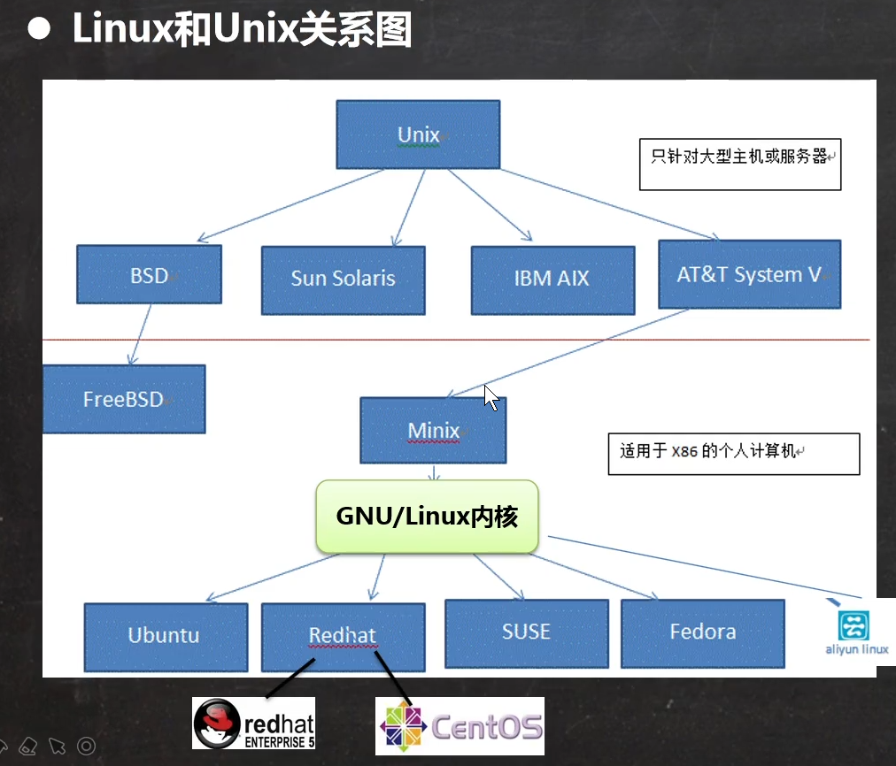
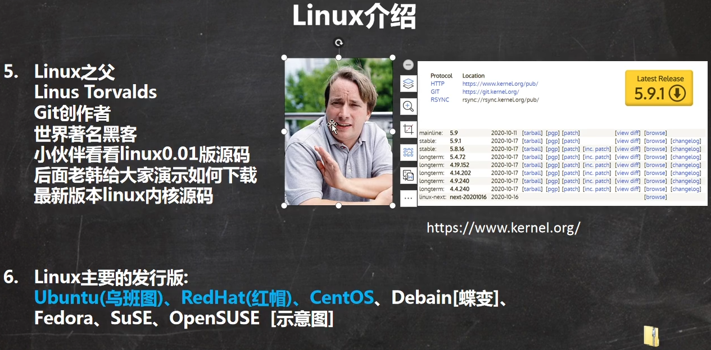
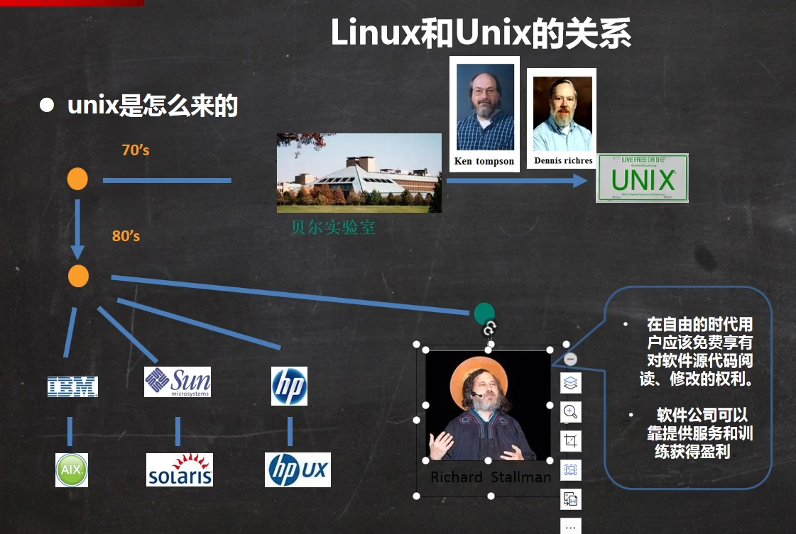
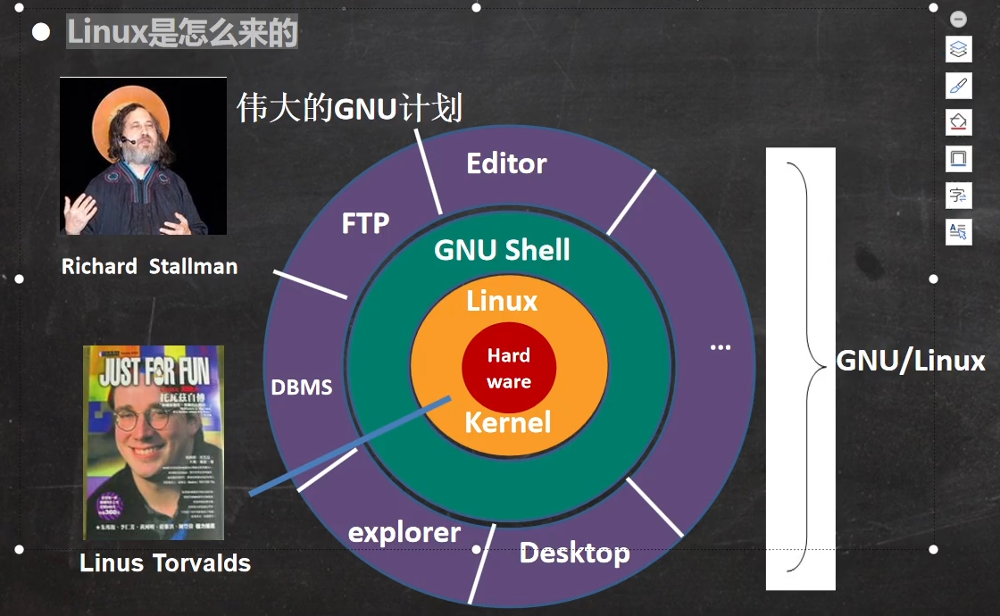

# 第1章 概述

## Linux和Unix的关系

Linux创始人

Unix

Linux是怎么来的

## VM安装Centos

http://mirrors.163.com/centos/

VM15.5

网络NAT模式

自己手动分区：

分配20G硬盘空间，一般分成3个分区

- **boot** 
  - 期望容量：1024MB
  - 挂载点：/boot
  - 文件系统：ext4
  - 设备类型：标准分区

- **交换swap**  一般设置和内存大小差不多就行，比如2G  
  - 作用：当内存不够用时，临时充当内存，速度肯定比不上内存的
- 期望容量：2048MB
  - 文件系统：swap
  - 设备类型：标准分区

- **根分区**   余下的所有空间，比如17G
  - 挂载点：/
  - 期望容量：17GB
  - 文件系统：ext4
  - 设备类型：标准分区

KDUMP

KDUMP是一个内核崩溃转储机制，会占用一部分内存，在生成环境要开启，学习过程中不用开启

安全策略：学习中关闭

root密码：最好要复杂点

除了root再创建一个普通用户

## VM的三种网络连接模式

> **桥接模式**

比如Windows主机的ip是192.168.0.20

桥接模式时，VM中Linux的ip就可以是192.268.0.80之类的，和外界系统互相通讯

存在的问题：网段的ip可能导致不够用，ip冲突

> **NAT模式**

Network Address Translation   网络地址转换  ，虚拟系统可以和外界通讯而且不造成ip冲突，但是外界不能访问这个虚拟系统

比如Windows主机的ip是192.168.0.50

NAT模式时，

主机还会生成一个虚拟网卡，比如ip为192.168.100.99

VM中Linux的ip为192.168.100.88

192.168.100.99和192.168.100.88可以互通

> **主机模式**

独立的系统，不和外界通讯

它将创建完全包含在主机中的专用网络。仅主机模式的虚拟网络适配器仅对主机可见，并在虚拟机和主机系统之间提供网络连接