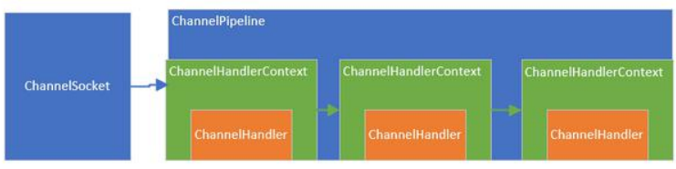

# Netty概述

## Netty是什么

1)Nety是由 JBOSS:提供的一个Java开源框架,现为 Github上的独立项目。

2)Ney是一个异步的、基于事件驱动的网络应用框架,用以快速开高性靠性的网络10程序。

3)Nety主要针对在TCP协议下,面向 Clients:端的高并发应用,或者 Peer to-Peer 场的大量数据持续传输的应用

4)Nety本质是ー个**NIO框架**,适用于服务器通讯相关的多种应用场景5)要透彻理解Nett,需要先学习NIO,这样我们才能阅读Nety的源码。

## Netty的应用场景

互联网行业

1)互联网行业:在**分布式系统**中,各个节点之间需要远程服务调用,高性能的**RPC框架**必不可少,Nety作为异步高性能的通信框架,往往作为基础通信组件被这些RPC框架使用。

2)典型的应用有:阿里分布式服务框架**Dubbo的RPC框架**使用Dubo协议进行节点间通信, Dubbo协议默认使用Nety作为基础通信组件,用于实现各进程节点之间的内部通信

游戏行业

1)无论是手游服务端还是大型的网络游戏,Java语言得到了越来越广泛的应用

2) Netty作为高性能的基础通信组件,提供了TCP/UDP和HTP协议栈,方便定制和开发私有协议栈,账号登录服务器

3)地图服务器之间可以方便的通过 Netty进行高性能的通信

大数据领域

1)经典的 Hadoop的高性能通信和序列化组件(AVRO实现数据文件共享)的RPC框架,默认采用Netty进行跨界点通信2)它的 Netty Service基于 Netty框架二次封装实现。

推荐书目《Netty In Action》

《Netty权威指南》基于Netty5，但是Netty5基本被废弃了

## Java I/O模型

)I/O模型简单的理解:就是用什么样的通道进行数据的发送和接收,很大程度上决定了程序通信的性能

2)Jaa共支持3种网络编程模型川O模式:**BIO、NIO、AIO**

3) Java BIO:Blocking IO同步阻塞(**传统阻塞型**),服务器实现模式为一个连接一个线程,即客户端有连接请求时服务器端就需要启动一个线程进行处理,如果这个连接不做任何事情会造成不必要的线程开销，可以通过**线程池机制**改善

4) Java NIO:**同步非阻塞**,服务器实现模式为一个线程处理多个请求(连接),即客户端发送的连接请求都会注册到多路复用器上,多路复用器轮询到连接有MO请求就进行处理

5) Java AIO(NIO2):**异步非阻塞**,AIO引入异步通道的概念,采用了 Proactor模式,简化了程序编写,有效的请求才启动线程,它的特点是先由操作系统完成后才通知服务端程序启动线程去处理,一般适用于连接数较多且连接时间较长的应用

BIO、NIO、AIO适用场景分析

1)BIO方式适用于**连接数目比较小且固定的架构**,这种方式对服务器资源要求比较高,并发局限于应用中,JDK1.4以前的唯一选择,但程序简单易理解。

2)NIO方式适用于**连接数目多且连接比较短(轻操作)的架构**,比如聊天服务器,弹幕系统,服务器间通讯等。编程比较复杂,JK1.4开始支持。

3)AIO方式使用于**连接数目多且连接比较长(重操作)的架构**,比如相册服务器,充分调用oS参与并发操作,编程比较复杂,」DK7开始支持。

# Java BIO

## BIO编程简单流程

1)服务器端启动一个 Server Socket

2)客户端启动 Socke对服务器进行通信,默认情况下服务器端需要对每个客户建立一个线程与之通讯3)客户端发出请求后,先咨询服务器是否有线程响应,如果没有则会等待,或者被拒绝

4)如果有响应,客户端线程会等待请求结束后,在继续执行

## Java BIO应用实例实例

说明1)使用BIO模型编写一个服务器端,监听6666端口,当有客户端连接时,就启动一个线程与之通讯。

2)要求使用线程池机制改善,可以连接多个客户端

3)服务器端可以接收客户端发送的数据(  telnet方式即可)。

```java
package com.atguigu.bio;

import java.io.IOException;
import java.io.InputStream;
import java.net.ServerSocket;
import java.net.Socket;
import java.util.concurrent.ExecutorService;
import java.util.concurrent.Executors;

public class BIOServer {
    public static void main(String[] args) throws IOException {
        //线程池机制
        //1.创建一个线程池
        ExecutorService executorService = Executors.newCachedThreadPool();
        ServerSocket serverSocket = new ServerSocket(6666);
        System.out.println("服务器启动了");
        //2.如果有客户端连接，就创建一个线程，与之通讯
        while (true){
            //监听，等待客户端连接
            System.out.println("等待连接...");
            final Socket socket = serverSocket.accept();
            System.out.println("连接到一个客户端");
            //创建一个线程，与之通讯
            executorService.execute(() -> {
                //可以和客户端通讯
                handler(socket);
            });
        }
    }
    //handler方法，和客户端通讯
    public static void handler(Socket socket){
        try {
            System.out.println("线程信息 id="+Thread.currentThread().getId()+" 名字= "+Thread.currentThread().getName());
            System.out.println("read...");
            byte[] bytes = new byte[1024];
            //通过socket获取输入流
            InputStream inputStream = socket.getInputStream();
            //循环读取客户端发送的数据
            while (true){
                int read = inputStream.read(bytes);
                if (read!=-1){
                    System.out.println(new String(bytes,0,read));//客户端发送的数据
                }else {
                    break;
                }
            }
        }catch (Exception e){
            e.printStackTrace();
        }finally {
            System.out.println("关闭个client的来连接");
            try {
                socket.close();
            } catch (IOException e) {
                e.printStackTrace();
            }
        }

    }
}

```

windows系统启用Telnet功能：

控制面板--打开或关闭windows功能--勾选  Telnet客户端

在命令行里输入：

```bash
telnet 127.0.0.1 6666  # telnet ip 端口号
CTRL+] 快捷键 ，进行文字输入
send +"字符串"  # 给给服务器发送信息
```

## BIO问题分析

1)每个请求都需要创建独立的线程,与对应的客户端进行数据Read,业务处理,数据write

2)当并发数较大时,需要**创建大量线程来处理连接**,系统资源占用较大。

3)连接建立后,如果当前线程暂时没有数据可读,则线程就**阻塞**在Read操作上,造成**线程资源浪费**

# Java NIO

## Java NIO 基本介绍

1) Java NIO 全称 java non-blocking IO，是指 JDK 提供的新 API。从 JDK1.4 开始，Java 提供了一系列改进的输入/输出的新特性，被统称为 NIO(即 New IO)，**是同步非阻塞**的

2) NIO 相关类都被放在 java.nio 包及子包下，并且对原 java.io 包中的很多类进行改写。【基本案例】

3) NIO 有三大核心部分：**Channel(通道)，Buffer(缓冲区), Selector(选择器)**

channel是铁路，buffer是火车，selector是铁路网调度系统

4) NIO 是**面向缓冲区 ，或者面向块**编程的。数据读取到一个它稍后处理的缓冲区，需要时可在缓冲区中前后移动，这就增加了处理过程中的灵活性，使用它可以提供非阻塞式的高伸缩性网络

5) Java NIO 的非阻塞模式，使一个线程从某通道发送请求或者读取数据，但是它仅能得到目前可用的数据，如果目前没有数据可用时，就什么都不会获取，而不是保持线程阻塞，所以直至数据变的可以读取之前，该线程可以继续做其他的事情。 非阻塞写也是如此，一个线程请求写入一些数据到某通道，但不需要等待它完全写入，这个线程同时可以去做别的事情。【后面有案例说明】

6) 通俗理解：NIO 是可以做到用一个线程来处理多个操作的。假设有 10000 个请求过来,根据实际情况，可以分配50 或者 100 个线程来处理。不像之前的阻塞 IO 那样，非得分配 10000 个。

7) HTTP2.0 使用了多路复用的技术，做到同一个连接并发处理多个请求，而且并发请求的数量比 HTTP1.1 大了好几个数量级

```java
import java.nio.IntBuffer;

public class BasicBuffer {
    public static void main(String[] args) {
        //创建一个buffer,大小为5,即存放5个int
        IntBuffer intBuffer = IntBuffer.allocate(5);
        for (int i = 0; i < intBuffer.capacity(); i++) {
            intBuffer.put(i*2);
        }
        //buffer读写切换flip(),如果不切换get()方法可以执行，但读不出数据
        intBuffer.flip();
        while (intBuffer.hasRemaining()){
            System.out.println(intBuffer.get());
        }
    }
}
```

## NIO 和 BIO 的比较

1) BIO 以流的方式处理数据,而 NIO 以块的方式处理数据,块 I/O 的效率比流 I/O 高很多
2) BIO 是阻塞的，NIO 则是非阻塞的
3) BIO 基于字节流和字符流进行操作，而 NIO 基于 Channel(通道)和 Buffer(缓冲区)进行操作，数据总是从通道读取到缓冲区中，或者从缓冲区写入到通道中。Selector(选择器)用于监听多个通道的事件（比如：连接请求，数据到达等），因此使用**单个线程就可以监听多个客户端**通道

## NIO 三大核心原理


1) 每个channel 都会对应一个Buffer
2) **Selector 对应一个线程**， **一个线程对应多个channel(连接)**
3) 该图反应了有三个channel 注册到 该selector //程序
4) 程序切换到哪个channel 是由事件决定的, **Event** 就是一个重要的概念
5) Selector 会根据不同的事件，在**各个通道上切换**
6) Buffer 就是一个**内存块** ， **底层是有一个数组**
7) 数据的读取写入是通过Buffer, 这个和BIO不同 , BIO 中要么是输入流，或者是输出流, 不能双向，但是NIO的Buffer 是可以读也可以写, 需要 **flip 方法切换**
8) **channel 是双向的**, 可以返回底层操作系统的情况, 比如Linux ， 底层的操作系统通道就是双向的.

## 缓冲区(Buffer)

### 基本介绍

缓冲区（Buffer）：缓冲区本质上是一个可以读写数据的内存块，可以理解成是一个**容器对象(含数组)**，该对象提供了一组方法，可以更轻松地使用内存块，，缓冲区对象内置了一些机制，能够跟踪和记录缓冲区的状态变化情况。Channel 提供从文件、网络读取数据的渠道，但是读取或写入的数据都必须经由 Buffer


### Buffer 类及其子类

在 NIO 中，Buffer 是一个顶层父类，它是一个抽象类

1) **Byte Buffer,存储字节教据到缓冲区**

2) Short Buffer,,存储字符串数据到缓冲区3)Char Buffer,存储字符数据到缓冲区

4) nt Buffer,存储整数数据到缓冲区

5) Long Buffer,存储长整型数据到缓冲区

6) Double Buffer,存储小数到缓冲区

7) Float.,存储小数到缓冲区

### Buffer四大属性

Buffer 类定义了所有的缓冲区都具有的四个属性来提供关于其所包含的数据元素的信息:

**容量** **(capacity)** **：**表示 Buffer 最大数据容量，缓冲区容量不能为负，并且创建后**不能更改**。

**限制 (limit)**：第一个不应该读取或写入的数据的索引，即位于 limit 后的数据不可读写。缓冲区的限制不能为负，并且**不能大于其容量**。

**位置 (position)**：下一个要读取或写入的数据的索引。缓冲区的位置不能为负，并且不能大于其限制

**标记 (mark)**与**重置 (reset)**：标记是一个索引，通过 Buffer 中的 mark() 方法

```java
private int mark = -1;
private int position = 0;
private int limit;
private int capacity;
//mark <= position <= limit <= capacity
```

| 属性     | 描述                                                         |
| -------- | ------------------------------------------------------------ |
| capacity | 容量，即可以容纳的最大数据量；在缓冲区创建时被设定并且**不能改变** |
| limit    | 表示缓冲区的当前终点，不能对缓冲区超过极限的位置进行读写操作。且极限是可以修改的 |
| position | 位置，下一个要被读或写的元素的索引，每次读写缓冲区数据时都会改变改值，为下次读写作准备 |
| mark     | 标记                                                         |

filp方法

```java
public final Buffer flip(){
    limit = position;//读数据不能超过position
    position = 0;
    mark = -1;
    return this;
}
```


### Buffer类相关方法

```java
public abstract class Buffer {
    //JDK1.4时，引入的api
    public final int capacity( )//返回此缓冲区的容量
        public final int position( )//返回此缓冲区的位置
        public final Buffer position (int newPositio)//设置此缓冲区的位置
        public final int limit( )//返回此缓冲区的限制
        public final Buffer limit (int newLimit)//设置此缓冲区的限制
        public final Buffer mark( )//在此缓冲区的位置设置标记
        public final Buffer reset( )//将此缓冲区的位置重置为以前标记的位置
        public final Buffer clear( )//清除此缓冲区, 即将各个标记恢复到初始状态，但是数据并没有真正擦除, 后面操作会覆盖
        public final Buffer flip( )//反转此缓冲区
        public final Buffer rewind( )//重绕此缓冲区
        public final int remaining( )//返回当前位置与限制之间的元素数
        public final boolean hasRemaining( )//告知在当前位置和限制之间是否有元素
        public abstract boolean isReadOnly( );//告知此缓冲区是否为只读缓冲区
    //JDK1.6时引入的api
    public abstract boolean hasArray();//告知此缓冲区是否具有可访问的底层实现数组
    public abstract Object array();//返回此缓冲区的底层实现数组
    public abstract int arrayOffset();//返回此缓冲区的底层实现数组中第一个缓冲区元素的偏移量
    public abstract boolean isDirect();//告知此缓冲区是否为直接缓冲区
}
```

### ByteBuffer

从前面可以看出对于 Java 中的基本数据类型(boolean除外)，都有一个 Buffer 类型与之相对应，最常用的自然是ByteBuffer 类（二进制数据），该类的主要方法如下：

```java
public abstract class ByteBuffer {
    //缓冲区创建相关api
    public static ByteBuffer allocateDirect(int capacity)//创建直接缓冲区
    public static ByteBuffer allocate(int capacity)//设置缓冲区的初始容量
    public static ByteBuffer wrap(byte[] array)//把一个数组放到缓冲区中使用
    //构造初始化位置offset和上界length的缓冲区
    public static ByteBuffer wrap(byte[] array,int offset, int length)
    //缓存区存取相关API
    public abstract byte get( );//从当前位置position上get，get之后，position会自动+1
    public abstract byte get (int index);//从绝对位置get
    public abstract ByteBuffer put (byte b);//从当前位置上添加，put之后，position会自动+1
    public abstract ByteBuffer put (int index, byte b);//从绝对位置上put
}
```

## 通道(Channel)

### 基本介绍

1) NIO的通道类似于流，但有些区别如下：

- 通道可以同时进行读写，而流只能读或者只能写
- 通道可以实现异步读写数据
- 通道可以从缓冲读数据，也可以写数据到缓冲:


2) BIO 中的 stream 是单向的，例如 FileInputStream 对象只能进行读取数据的操作，而 NIO 中的通道(Channel)是双向的，可以读操作，也可以写操作。

3) **Channel在NIO中是一个接口**public interface Channel extends Closeable{}

4) 常用的 Channel 类有：FileChannel、DatagramChannel、ServerSocketChannel 和
SocketChannel。【ServerSocketChanne 类似ServerSocket , SocketChannel 类似 Socket】

5) FileChannel 用于文件的数据读写，DatagramChannel 用于 UDP 的数据读写，ServerSocketChannel 和 SocketChannel 用于 TCP的数据读写。

### FileChannel 类

FileChannel主要用来对本地文件进行 IO 操作，常见的方法有

1) public int read(ByteBuffer dst) ，**从通道读取数据并放到缓冲区中**

2) public int write(ByteBuffer src) ，**把缓冲区的数据写到通道中**

3) public long transferFrom(ReadableByteChannel src, long position, long count)，**从目标通道**
**中复制数据到当前通道**

4) public long transferTo(long position, long count, WritableByteChannel target)，把**数据从当**
**前通道复制给目标通道**

#### 应用实例1-本地文件写数据


实例要求:
1) 使用前面学习后的ByteBuffer(缓冲) 和 FileChannel(通道)， 将 "hello,尚硅谷" 写入到file01.txt 中
2) 文件不存在就创建
3) 代码演示

```java
package com.atguigu.nio;

import java.io.FileOutputStream;
import java.io.IOException;
import java.nio.ByteBuffer;
import java.nio.channels.FileChannel;

public class NIOFileChannel01 {
    public static void main(String[] args) throws IOException {
        String str = "hello,尚硅谷";
        //输出流--->channel
        FileOutputStream fileOutputStream = new FileOutputStream("F:\\ShangGuiGuJavaEE\\WorkspaceIDEA\\NettyLearn\\src\\main\\java\\com\\atguigu\\nio\\file01.txt");
        //通过输出流获取文件channel
        //这个fileChannel真实类型是FileChannelImpl
        FileChannel fileChannel = fileOutputStream.getChannel();
        //创建一个缓冲区
        ByteBuffer byteBuffer = ByteBuffer.allocate(1024);
        //将String放入到byteBuffer
        byteBuffer.put(str.getBytes());
        //读写切换
        byteBuffer.flip();
        //将byteBuffer里数据写入到fileChannel
        fileChannel.write(byteBuffer);
        fileChannel.close();
    }
}

```

#### 应用实例2-本地文件读数据


实例要求:
1) 使用前面学习后的ByteBuffer(缓冲) 和 FileChannel(通道)， 将 file01.txt 中的数据读
入到程序，并显示在控制台屏幕
2) 假定文件已经存在

```java
package com.atguigu.nio;

import java.io.File;
import java.io.FileInputStream;
import java.io.IOException;
import java.nio.ByteBuffer;
import java.nio.channels.FileChannel;

public class NIOFileChannel02 {
    public static void main(String[] args) throws IOException {
        //文件输入流
        File file = new File("F:\\ShangGuiGuJavaEE\\WorkspaceIDEA\\NettyLearn\\src\\main\\java\\com\\atguigu\\nio\\file01.txt");
        FileInputStream fileInputStream = new FileInputStream(file);
        //通过fileInputStream获取对应的FileChannel
        FileChannel channel = fileInputStream.getChannel();
        //创建缓冲区
        ByteBuffer byteBuffer = ByteBuffer.allocate((int) file.length());
        //将通道的数据读入buffer中
        channel.read(byteBuffer);
        //将byteBuffer字节转化为字符串
        System.out.println(new String(byteBuffer.array()));
        fileInputStream.close();
    }
}

```

#### 应用实例3-使用一个Buffer完成文件读取写入

实例要求:
1) 使用 FileChannel(通道) 和 方法 read , write，完成文件的拷贝
2) 拷贝一个文本文件 1.txt , 放在项目下即可

```
hello,world
尚硅谷
你好
hello,ok
```


3) 代码演示


```java
public static void main(String[] args) throws Exception {
        FileInputStream fileInputStream = new FileInputStream("1.txt");
        FileChannel channel = fileInputStream.getChannel();

        FileOutputStream fileOutputStream = new FileOutputStream("2.txt");
        FileChannel channel2 = fileOutputStream.getChannel();

        ByteBuffer byteBuffer = ByteBuffer.allocate(512);

        while (true){//缓冲区大小只有512字节，一次读不完，所以要循环
            //这里有一个重要操作
            byteBuffer.clear();//重置标志位，也就是清空buffer position = 0;limit = capacity;mark = -1;
            int read = channel.read(byteBuffer);
            if (read==-1){//表示读完
                break;
            }
            //将buffer中数据写入到 channel2 --->2.txt
            byteBuffer.flip();//切换读写
            channel2.write(byteBuffer);
        }
        //关闭相关的流
        fileInputStream.close();
        fileOutputStream.close();
    }
```


```
read=40
read=-1
```

#### 应用实例 4-拷贝文件 transferFrom

 使用 FileChannel(通道) 和 方法 transferFrom ，完成文件的拷贝

```java
public static void main(String[] args) throws Exception {
        FileInputStream fileInputStream = new FileInputStream("dog.png");//文件在当前工程目录下
        FileOutputStream fileOutputStream = new FileOutputStream("dog2.png");

        //获取通道
        FileChannel sourceChanne = fileInputStream.getChannel();
        FileChannel destChanne = fileOutputStream.getChannel();

        //transferForm完成拷贝
        destChanne.transferFrom(sourceChanne,0,sourceChanne.size());//sourceChanne,从位置0开始，大小为sourceChanne的大小

        //关闭流
        fileInputStream.close();
        fileOutputStream.close();
    }
```

#### 注意的细节

- ByteBuffer 支持类型化的 put 和 get, put 放入的是什么数据类型，get 就应该使用相应的数据类型来取出，否则可能有 
  BufferUnderflowException 异常

  - 放入小类型，取出大类型就报异常
  - 放入大类型，取出小类型会乱码,但不报异常

  ```java
  public class NIOByteBufferPutGet {
      public static void main(String[] args) {
          //创建一个 Buffer
          ByteBuffer buffer = ByteBuffer.allocate(64);
          //类型化方式放入数据
          buffer.putInt(100);
          buffer.putLong(9);
          buffer.putChar('尚');
          buffer.putShort((short) 4);
          //取出
          buffer.flip();
          System.out.println();
          System.out.println(buffer.getInt());
          System.out.println(buffer.getLong());
          System.out.println(buffer.getChar());
          System.out.println(buffer.getShort());
      }
  }
  ```

- 可以将一个普通 Buffer 转成只读 Buffer

  ```java
  public class ReadOnlyBuffer {
      public static void main(String[] args) {
          //创建一个 buffer
          ByteBuffer buffer = ByteBuffer.allocate(64);
          for(int i = 0; i < 64; i++) {
              buffer.put((byte)i);
          }
          //读取
          buffer.flip();
          //得到一个只读的 Buffer
          ByteBuffer readOnlyBuffer = buffer.asReadOnlyBuffer();
          System.out.println(readOnlyBuffer.getClass());
          //读取
          while (readOnlyBuffer.hasRemaining()) {
              System.out.println(readOnlyBuffer.get());//0,1,2,...,63
          }
          readOnlyBuffer.put((byte)100); //ReadOnlyBufferException
      }
  }
  ```

- NIO 还提供了 MappedByteBuffer， 可以让文件直接在内存（**堆外的内存**）中进行修改， 而如何同步到文件由 NIO 来完成.

  ```java
  public static void main(String[] args) throws Exception {
          RandomAccessFile randomAccessFile = new RandomAccessFile("1.txt", "rw");
          //获取对应的文件通道
          FileChannel channel = randomAccessFile.getChannel();
          //map 的参数
          //参数1：使用的是读写模式
          //参数2：0代表可以直接修改的起始位置
          //参数3：5表示映射到内存的大小，即将文件最多可以修改5个字节
          //实际类型是 DirectByteBuffer
          MappedByteBuffer mappedByteBuffer = channel.map(FileChannel.MapMode.READ_WRITE, 0, 5);
          mappedByteBuffer.put(0,(byte)'H');
          mappedByteBuffer.put(3,(byte)'9');
          mappedByteBuffer.put(5,(byte)'Y');//IndexOutOfBoundsException
  
          randomAccessFile.close();
  
      }
  ```

- 前面我们讲的读写操作，都是通过一个 Buffer 完成的，NIO 还支持 通过多个 Buffer (即 Buffer 数组) 完成读写操作，即 Scattering 和 Gathering

  ```java
  
  //Scattering 将数据写入buffer时，可以采用buffer数组，依次写入【分散】
  //Gathering:从buffer读取数据时，可以采用buffer数据，依次读
  public class ScatteringAndGatheringTest {
      public static void main(String[] args) throws IOException {
          ////使用 ServerSocketChannel 和 SocketChannel 网络
          ServerSocketChannel serverSocketChannel = ServerSocketChannel.open();
          InetSocketAddress inetSocketAddress = new InetSocketAddress(7000);
  
          //绑定端口到Socket，并启动
          serverSocketChannel.socket().bind(inetSocketAddress);
  
          //创建一个buffer数组
          ByteBuffer[] byteBuffers = new ByteBuffer[2];
          byteBuffers[0] = ByteBuffer.allocate(5);
          byteBuffers[1] = ByteBuffer.allocate(3);
  
          //等待客户端连接(telnet)
          SocketChannel socketChannel = serverSocketChannel.accept();
          int messageLength = 8;//假定从客户端接收8个字节
          //循环的读取
          while (true) {
              int byteRead = 0;
              while (byteRead < messageLength) {
                  long l = socketChannel.read(byteBuffers);
                  byteRead += 1;//累计读取的字节数
                  System.out.println("byteRead=" + byteRead);
                  //使用流打印, 看看当前的这个 buffer 的 position 和 limit
                  Arrays.stream(byteBuffers).map(buffer -> "postion=" + buffer.position() + ", limit=" +
                          buffer.limit()).forEach(System.out::println);
              }
              //将所有的 buffer 进行 flip
              Arrays.asList(byteBuffers).forEach(Buffer::flip);
              //将数据读出显示到客户端
              long byteWirte = 0;
              while (byteWirte < messageLength) {
                  long l = socketChannel.write(byteBuffers); //
                  byteWirte += l;
              }
              //将所有的 buffer 进行 clear
              Arrays.asList(byteBuffers).forEach(Buffer::clear);
              System.out.println("byteRead:=" + byteRead + " byteWrite=" + byteWirte + ", messagelength" +
                      messageLength);
          }
      }
  }
  
  ```

  管理员打开cmd  `telnet 127.0.0.1 7000`

  ```
   send helloa
  ```

  buffer的本质就是字节数组，在java的堆内存中开辟一块完整的内存空间供数组使用，是需要花费很大的代价的。因为内存一般都是碎片化，如果要开辟两块很大且连续的内存空间基本上是不可能的

## Selector(选择器)

### 基本介绍

1) Java 的 NIO，用非阻塞的 IO 方式。可以用一个线程，处理多个的客户端连接，就会使用到 Selector(选择器)

2) Selector 能够检测多个注册的通道上是否有事件发生(注意:多个 Channel 以事件的方式可以注册到同一个Selector)，如果有事件发生，便获取事件然后针对每个事件进行相应的处理。这样就可以只用一个单线程去管理多个通道，也就是管理多个连接和请求。【示意图】

3) 只有在 连接/通道 真正有读写事件发生时，才会进行读写，就大大地减少了系统开销，并且不必为每个连接都创建一个线程，不用去维护多个线程

4) **避免了多线程之间的上下文切换导致的开销**

### Selector 示意图和特点说明


1) Netty 的 IO 线程 NioEventLoop 聚合了 Selector(选择器，也叫多路复用器)，可以同时并发处理成百上千个客户端连接。

2) 当线程从某客户端 Socket 通道进行读写数据时，若没有数据可用时，该线程可以进行其他任务。

3) 线程通常将非阻塞 IO 的空闲时间用于在其他通道上执行 IO 操作，所以单独的线程可以管理多个输入和输出通道。

4) 由于读写操作都是非阻塞的，这就可以充分提升 IO 线程的运行效率，避免由于频繁 I/O 阻塞导致的线程挂起。

5) 一个 I/O 线程可以并发处理 N 个客户端连接和读写操作，这从根本上解决了传统同步阻塞 I/O 一连接一线程模型，架构的性能、弹性伸缩能力和可靠性都得到了极大的提升

### Selector 类相关方法

Selector 类是一个抽象类, 常用方法和说明如下:


### 注意事项

1) NIO 中的 ServerSocketChannel 功能类似 ServerSocket，SocketChannel 功能类似 Socket

2) selector 相关方法说明

- selector.select()//阻塞
- selector.select(1000);//阻塞 1000 毫秒，在 1000 毫秒后返回
- selector.wakeup();//唤醒 selector
- selector.selectNow();//不阻塞，立马返还

##  NIO 非阻塞 网络编程（⭐）

#### 原理分析

NIO 非阻塞 网络编程相关的(Selector、SelectionKey、ServerScoketChannel 和 SocketChannel) 关系梳理图


对上图的说明:

1) 当客户端连接时，会通过 ServerSocketChannel 得到 SocketChannel

2) Selector 进行监听 select 方法, 返回有事件发生的通道的个数.

3) 将 socketChannel 注册到 Selector 上, register(Selector sel, int ops), 一个 selector 上可以注册多个 SocketChannel

4) 注册后返回一个 SelectionKey, 会和该 Selector 关联(集合)

5) 进一步得到各个 SelectionKey (有事件发生)

6) 在通过 SelectionKey 反向获取 SocketChannel , 方法 channel()

7) 可以通过 得到的 channel , 完成业务处理

8) 代码撑腰。。。

#### 案例

案例要求:
1) 编写一个 NIO 入门案例，实现服务器端和客户端之间的数据简单通讯（非阻塞）
2) 目的：理解 NIO 非阻塞网络编程机制

```java
package com.atguigu.nio;

import java.net.InetSocketAddress;
import java.nio.ByteBuffer;
import java.nio.channels.SelectionKey;
import java.nio.channels.Selector;
import java.nio.channels.ServerSocketChannel;
import java.nio.channels.SocketChannel;
import java.util.Iterator;
import java.util.Set;

/**
 * 服务器端
 * SocketChannel是一个连接到TCP网络套接字的通道   客户端
 * ServerSocketChannel 是一个可以监听新进来的TCP连接的通道, 就像标准IO中的ServerSocket一样  服务器
 * ServerSocketChannel
 */
public class NIOServer {
    public static void main(String[] args) throws Exception {
        //创建ServerSocketChannel -->ServerSocket
        ServerSocketChannel serverSocketChannel = ServerSocketChannel.open();
        //得到一个 Selecor 对象
        Selector selector = Selector.open();
        //绑定一个端口 6666, 在服务器端监听
        serverSocketChannel.socket().bind(new InetSocketAddress(6666));
        //设置为非阻塞
        serverSocketChannel.configureBlocking(false);
        //把serverSocketChannel注册到 selector 关心事件为 OP_ACCEPT
        serverSocketChannel.register(selector, SelectionKey.OP_ACCEPT);

        //循环等待客户端连接
        while (true) {
            //等待1秒，如果没有连接事件发生，就继续
            //没有事件发生
            if (selector.select(1000) == 0) {
                System.out.println("服务器等待了1秒，无连接");
                continue;
            }
            //如果返回的大于0，就获取到相关的 SelectionKey 集合
            //1.如果返回的>0， 表示已经获取到关注的事件
            //2. selector.selectedKeys() 返回关注事件的集合
            // 通过 selectionKeys 反向获取通道
            Set<SelectionKey> selectionKeys = selector.selectedKeys();

            //遍历 Set<SelectionKey>, 使用迭代器遍历
            Iterator<SelectionKey> keyIterator = selectionKeys.iterator();
            while (keyIterator.hasNext()) {
                //获取到 SelectionKey
                SelectionKey key = keyIterator.next();
                //根据 key 对应的通道发生的事件做相应处理
                //如果是 OP_ACCEPT, 有新的客户端连接
                if (key.isAcceptable()) {
                    //该该客户端生成一个 SocketChannel
                    SocketChannel socketChannel = serverSocketChannel.accept();
                    System.out.println(" 客 户 端 连 接 成 功 生 成 了 一 个 socketChannel " +socketChannel.hashCode());
                    //将 SocketChannel 设置为非阻塞
                    socketChannel.configureBlocking(false);
                    //将 socketChannel 注册到 selector, 关注事件为 OP_READ， 同时给 socketChannel
                    //关联一个 Buffer
                    socketChannel.register(selector, SelectionKey.OP_READ, ByteBuffer.allocate(1024));
                }
                //发生 OP_READ
                if (key.isReadable()) {
                    //通过 key 反向获取到对应 channel
                    SocketChannel channel = (SocketChannel) key.channel();
                    //获取到该 channel 关联的 buffer
                    ByteBuffer buffer = (ByteBuffer) key.attachment();
                    channel.read(buffer);
                    System.out.println("form 客户端 " + new String(buffer.array()));
                }
                //手动从集合中移动当前的 selectionKey, 防止重复操作
                keyIterator.remove();
            }
        }
    }
}

```

客户端

```java
package com.atguigu.nio;

import java.net.InetSocketAddress;
import java.nio.ByteBuffer;
import java.nio.channels.SocketChannel;

/**
 * 客户端
 */
public class NIOClient {
    public static void main(String[] args) throws Exception{
        //得到一个网络通道
        SocketChannel socketChannel = SocketChannel.open();
        //设置非阻塞
        socketChannel.configureBlocking(false);
        //提供服务端的ip和端口
        InetSocketAddress inetSocketAddress = new InetSocketAddress("127.0.0.1", 6666);
        //连接服务器
        //如果没有连接到
        if(!socketChannel.connect(inetSocketAddress)){
            while (!socketChannel.finishConnect()){
                System.out.println("因为连接需要时间，客户端不会阻塞，可以做其他工作");
            }
        }
        //如果连接成功就发送数据
        String str = "hello,尚硅谷";
        //warp产生一个字节数组到buffer中去，buffer大小和字节数组大小一致
        ByteBuffer buffer = ByteBuffer.wrap(str.getBytes());
        //发送数据，将buffer 数据写入 channel
        socketChannel.write(buffer);
        //让客户端停在这
        System.in.read();

    }
}

```

## SelectionKey

上述代码中，客户端和服务端都注册到了SelectionKey

1) SelectionKey，表示 Selector 和网络通道的注册关系, 共四种:
int OP_ACCEPT：有新的网络连接可以 accept，值为 16
int OP_CONNECT：代表连接已经建立，值为 8
int OP_READ：代表读操作，值为 1
int OP_WRITE：代表写操作，值为 4
源码中：

```java
public static final int OP_READ = 1 << 0;
public static final int OP_WRITE = 1 << 2;
public static final int OP_CONNECT = 1 << 3;
public static final int OP_ACCEPT = 1 << 4;
```

2) SelectionKey 相关方法


## ServerSocketChannel

1) ServerSocketChannel **在服务器端监听新的客户端 Socket 连接**
2) 相关方法如下


## SocketChannel

1) SocketChannel，网络 IO 通道，具体负责进行读写操作。NIO 把缓冲区的数据写入通道，或者把通道里的数据读到缓冲区。

2) 相关方法如下


## NIO 网络编程应用实例-群聊系统

实例要求:
1) 编写一个 NIO 群聊系统，实现服务器端和客户端之间的数据简单通讯（非阻塞）
2) 实现多人群聊
3) 服务器端：可以监测用户上线，离线，并实现消息转发功能
4) 客户端：通过 channel 可以无阻塞发送消息给其它所有用户，同时可以接受其它用户发送的消息(有服务器转发得到)
5) 目的：进一步理解 NIO 非阻塞网络编程机制
6) 示意图分析和代码

服务端

```java
package com.atguigu.nio.groupchat;


import java.io.IOException;
import java.net.InetSocketAddress;
import java.nio.ByteBuffer;
import java.nio.channels.*;
import java.util.Iterator;

public class GroupChatServer {
    //定义属性
    private Selector selector;
    private ServerSocketChannel listenChanner;
    private static final int PORT = 6667;

    //构造器  初始化工作
    public GroupChatServer() {
        try {
            //得到选择器
            selector = Selector.open();
            //初始化 ServerSocketChannel
            listenChanner = ServerSocketChannel.open();
            //绑定端口
            listenChanner.socket().bind(new InetSocketAddress(PORT));
            //设置非阻塞模式
            listenChanner.configureBlocking(false);
            //将该listenChanner 注册到Selector上，关注 连接事件
            listenChanner.register(selector, SelectionKey.OP_ACCEPT);
        } catch (Exception e) {
            e.printStackTrace();
        }
    }

    //监听
    public void listen() {
        try {
            //循环监听
            while (true) {
                int count = selector.select();
                if (count > 0) {
                    //有事件要处理
                    //遍历得到的SelectionKey
                    Iterator<SelectionKey> iterator = selector.selectedKeys().iterator();
                    while (iterator.hasNext()) {
                        //取出SelectionKey
                        SelectionKey key = iterator.next();
                        //监听到accept
                        if (key.isAcceptable()){
                            SocketChannel sc = listenChanner.accept();
                            //设置为非阻塞
                            sc.configureBlocking(false);
                            //将该sc注册到selector上，关注 读事件
                            sc.register(selector,SelectionKey.OP_READ);
                            //提示
                            System.out.println(sc.getRemoteAddress()+"上线");
                        }
                        if (key.isReadable()){
                            //通道发生 read事件，即通道是可读的状态 ,接下来处理读
                            readData(key);
                        }
                        //当前的key 删除，复制重复操作
                        iterator.remove();
                    }
                } else {
                    System.out.println("等待中...");
                }
            }
        } catch (Exception e) {
            e.printStackTrace();
        } finally {

        }
    }

    //读取客户端消息
    private void readData(SelectionKey key){
        //取到关联的 channel
        SocketChannel channel = null;
        try {
            channel = (SocketChannel)key.channel();
            //创建Buffer
            ByteBuffer buffer = ByteBuffer.allocate(1024);
            int count = channel.read(buffer);
            //根据count的值做处理
            if (count>0){
                //把缓存区的数据转成字符串
                String msg = new String(buffer.array());
                //输出该消息
                System.out.println("from客户端："+msg);
                //向其它的客户端转发消息
                sendInforToOtherClients(msg,channel);

            }
        }catch (IOException e){
            try {
                System.out.println(channel.getRemoteAddress()+"离线了");
                //取消注册
                key.cancel();
                //关闭通道
                channel.close();
            } catch (IOException ex) {
                ex.printStackTrace();
            }
        }
    }

    //转发消息给其他客户端（通道）
    private void sendInforToOtherClients(String msg,SocketChannel self) throws IOException {
        System.out.println("服务器转发消息中...");
        //遍历 所有注册到selector上的 SocketChannel，并排除self
        for (SelectionKey key : selector.keys()) {
            //通过key取出对应的 SocketChannel
            Channel targetChannel = key.channel();
            //排除自己
            if(targetChannel instanceof SocketChannel &&targetChannel !=self){
                //转型
                SocketChannel dest = (SocketChannel) targetChannel;
                //将msg存储到buffer
                ByteBuffer buffer = ByteBuffer.wrap(msg.getBytes());
                //将buffer的数据写入通道
                dest.write(buffer);
            }
        }
    }
    public static void main(String[] args) {
        new GroupChatServer().listen();
    }
}

```

客户端

```java
package com.atguigu.nio.groupchat;

import java.io.BufferedReader;
import java.io.IOException;
import java.net.InetSocketAddress;
import java.nio.ByteBuffer;
import java.nio.channels.SelectableChannel;
import java.nio.channels.SelectionKey;
import java.nio.channels.Selector;
import java.nio.channels.SocketChannel;
import java.util.Iterator;
import java.util.Scanner;

public class GroupChatClient {
    //属性
    private final String HOST = "127.0.0.1";//服务器ip
    private static final int PORT = 6667;//服务器端口
    private Selector selector;
    private SocketChannel socketChannel;
    private String username;

    public GroupChatClient() throws IOException {
        selector = Selector.open();
        //连接服务器
        socketChannel = socketChannel.open(new InetSocketAddress(HOST, PORT));
        //设置非阻塞
        socketChannel.configureBlocking(false);
        //将channel注册到selector中
        socketChannel.register(selector, SelectionKey.OP_READ);
        //得到username
        username= socketChannel.getLocalAddress().toString().substring(1);
        System.out.println(username+"is ok...");

    }

    //向服务器发送消息
    public void sendInfo(String info){
        info = username+"说："+info;
        try {
            socketChannel.write(ByteBuffer.wrap(info.getBytes()));
        } catch (IOException e) {
            e.printStackTrace();
        }
    }

    //从服务器端回复的消息
    public void readInfo(){
        try {
            int readChannels = selector.select();
            if (readChannels>0){
                //有可用的通道
                Iterator<SelectionKey> iterator = selector.selectedKeys().iterator();
                while (iterator.hasNext()){
                    SelectionKey key = iterator.next();
                    if (key.isReadable()){
                        //得到相关的通道
                        SocketChannel sc = (SocketChannel) key.channel();
                        //得到一个Buffer
                        ByteBuffer buffer = ByteBuffer.allocate(1024);
                        sc.read(buffer);
                        //把读到的缓冲区的数据转成字符串
                        String msg = new String(buffer.array());
                        System.out.println(msg.trim());//去掉头尾空格
                    }
                    iterator.remove();//删除 ，防止重复操作
                }

            }
        }catch (Exception e){
            e.printStackTrace();
        }
    }


    public static void main(String[] args) throws IOException {
        //启动客户端
        GroupChatClient chatClient = new GroupChatClient();
        //启动一个线程 每隔3秒，读取从服务器发送数据
        new Thread(() -> {
            while (true) {
                chatClient.readInfo();
                try {
                    Thread.sleep(3000);
                } catch (InterruptedException e) {
                    e.printStackTrace();
                }
            }
        }).start();
        //发送数据给服务器端
        Scanner scanner = new Scanner(System.in);
        while (scanner.hasNextLine()) {
            String s = scanner.nextLine();
            chatClient.sendInfo(s);
        }
    }
}

```

## NIO 与零拷贝

### 零拷贝基本介绍

1) 零拷贝是网络编程的关键，很多性能优化都离不开。

2) 在 Java 程序中，常用的零拷贝有 mmap(内存映射) 和 sendFile。那么，他们在 OS 里，到底是怎么样的一个的设计？我们分析 mmap 和 sendFile 这两个零拷贝

3) 另外我们看下 NIO 中如何使用零拷贝


### 传统 IO 数据读写

Java 传统 IO 和 网络编程的一段代码


### 传统 IO 模型

4次拷贝，3次切换（内核态与用户态）


DMA: direct memory access 直接内存拷贝(不使用 CPU)

### mmap 优化

1) mmap 通过内存映射，将文件映射到内核缓冲区，同时，用户空间可以共享内核空间的数据。这样，在进行网络传输时，就可以减少内核空间到用户空间的拷贝次数。如下图
2) mmap 示意图

3次拷贝，3次切换


3) 提示：**零拷贝从操作系统角度，是没有 cpu 拷贝**
4) Linux 在 2.4 版本中，做了一些修改，避免了从**内核缓冲区**拷贝到 **Socket buffer** 的操作，直接拷贝到**协议栈**，从而再一次减少了数据拷贝。具体如下图和小结：


5) 这里其实有 一次 cpu 拷贝
kernel buffer -> socket buffer
但是，拷贝的信息很少，比如 lenght , offset , 消耗低，可以忽略

### 零拷贝的再次理解

1) 我们说零拷贝，是从操作系统的角度来说的。因为内核缓冲区之间，没有数据是重复的（只有 kernel buffer 有一份数据）。
2) 零拷贝不仅仅带来更少的数据复制，还能带来其他的性能优势，例如更少的上下文切换，更少的 CPU 缓存伪
共享以及无 CPU 校验和计算。

### mmap 和 sendFile 的区别

1) mmap 适合小数据量读写，sendFile 适合大文件传输。
2) mmap 需要 4 次上下文切换，3 次数据拷贝；sendFile 需要 3 次上下文切换，最少 2 次数据拷贝。
3) sendFile 可以利用 DMA 方式，减少 CPU 拷贝，mmap 则不能（必须从内核拷贝到 Socket 缓冲区）。

### NIO 零拷贝案例

案例要求：
1) 使用传统的 IO 方法传递一个大文件
2) 使用 NIO 零拷贝方式传递(transferTo)一个大文件
3) 看看两种传递方式耗时时间分别是多少

```java
package com.atguigu.nio.zerocopy;

import java.net.InetSocketAddress;
import java.net.ServerSocket;
import java.nio.ByteBuffer;
import java.nio.channels.ServerSocketChannel;
import java.nio.channels.SocketChannel;

public class NewIOServer {
    public static void main(String[] args) throws Exception {
        InetSocketAddress address = new InetSocketAddress(7001);
        ServerSocketChannel serverSocketChannel = ServerSocketChannel.open();
        ServerSocket serverSocket = serverSocketChannel.socket();
        serverSocket.bind(address);
        //创建 buffer
        ByteBuffer byteBuffer = ByteBuffer.allocate(4096);
        while (true) {
            SocketChannel socketChannel = serverSocketChannel.accept();
            int readcount = 0;
            while (-1 != readcount) {
                try {
                    readcount = socketChannel.read(byteBuffer);
                } catch (Exception ex) {
                    // ex.printStackTrace();
                    break;
                }
                byteBuffer.rewind(); //倒带 position = 0 mark 作废
            }
        }
    }
}
```


```java
package com.atguigu.nio.zerocopy;

import java.io.FileInputStream;
import java.net.InetSocketAddress;
import java.nio.channels.FileChannel;
import java.nio.channels.SocketChannel;

public class NewIOClient {
    public static void main(String[] args) throws Exception {
        SocketChannel socketChannel = SocketChannel.open();
        socketChannel.connect(new InetSocketAddress("localhost", 7001));
        String filename = "protoc-3.6.1-win32.zip";
        //得到一个文件 channel
        FileChannel fileChannel = new FileInputStream(filename).getChannel();
        //准备发送
        long startTime = System.currentTimeMillis();
        //在 linux 下一个 transferTo 方法就可以完成传输
        //在 windows 下 一次调用 transferTo 只能发送 8m , 就需要分段传输文件, 而且要主要
        //传输时的位置 =》 课后思考... //transferTo 底层使用到零拷贝
        long transferCount = fileChannel.transferTo(0, fileChannel.size(), socketChannel);
        System.out.println(" 发 送 的 总 的 字 节 数 =" + transferCount + " 耗 时 :" + (System.currentTimeMillis() - startTime));
        //关闭
        fileChannel.close();
    }
}
```

## Java AIO 基本介绍

1) JDK 7 引入了 Asynchronous I/O，即 AIO。在进行 I/O 编程中，常用到两种模式：Reactor 和 Proactor。Java 的NIO 就是 Reactor，当有事件触发时，服务器端得到通知，进行相应的处理
2) AIO 即 NIO2.0，叫做异步不阻塞的 IO。AIO 引入异步通道的概念，采用了 Proactor 模式，简化了程序编写，有效的请求才启动线程，它的特点是先由操作系统完成后才通知服务端程序启动线程去处理，一般适用于连接数较多且连接时间较长的应用

3) 目前 AIO 还没有广泛应用，Netty 也是基于 NIO, 而不是 AIO， 因此我们就不详解 AIO 了，有兴趣的同学可以 参 考 <<Java 新 一 代 网 络 编 程 模 型 AIO 原 理 及 Linux 系 统 AIO 介 绍 >>http://www.52im.net/thread-306-1-1.html


# Netty 概述

## 原生 NIO 存在的问题

1) NIO 的类库和 API 繁杂，使用麻烦：需要熟练掌握 Selector、ServerSocketChannel、SocketChannel、ByteBuffer等。
2) 需要具备其他的额外技能：要熟悉 Java 多线程编程，因为 NIO 编程涉及到 Reactor 模式，你必须对多线程和网络编程非常熟悉，才能编写出高质量的 NIO 程序。
3) 开发工作量和难度都非常大：例如客户端面临断连重连、网络闪断、半包读写、失败缓存、网络拥塞和异常流的处理等等。
4) JDK NIO 的 Bug：例如臭名昭著的 Epoll Bug，它会导致 Selector 空轮询，最终导致 CPU 100%。直到 JDK 1.7版本该问题仍旧存在，没有被根本解决。

## Netty 官网说明

官网：https://netty.io/
Netty is an asynchronous event-driven network application framework
for rapid development of maintainable high performance protocol servers & clients


## Netty 的优点

Netty 对 JDK 自带的 NIO 的 API 进行了封装，解决了上述问题。

1) 设计优雅：适用于各种传输类型的统一 API 阻塞和非阻塞 Socket；基于灵活且可扩展的事件模型，可以清晰地分离关注点；高度可定制的线程模型 - 单线程，一个或多个线程池. 2) 使用方便：详细记录的 Javadoc，用户指南和示例；没有其他依赖项，JDK 5（Netty 3.x）或 6（Netty 4.x）就足够了。

3) 高性能、吞吐量更高：延迟更低；减少资源消耗；最小化不必要的内存复制。

4) 安全：完整的 SSL/TLS 和 StartTLS 支持。

5) 社区活跃、不断更新：社区活跃，版本迭代周期短，发现的 Bug 可以被及时修复，同时，更多的新功能会被加入

## Netty 版本说明

1) netty 版本分为 netty3.x 和 netty4.x、netty5.x
2) 因为 Netty5 出现重大 bug，已经被官网废弃了，目前推荐使用的是 Netty4.x 的稳定版本
3) 目前在官网可下载的版本 netty3.x netty4.0.x 和 netty4.1.x
4) 在本套课程中，我们讲解 Netty4.1.x 版本
5) netty 下载地址： https://bintray.com/netty/downloads/netty/

# Netty 高性能架构设计

## 线程模型基本介绍

1) 不同的线程模式，对程序的性能有很大影响，为了搞清 Netty 线程模式，我们来系统的讲解下 各个线程模式，
最后看看 Netty 线程模型有什么优越性. 

2) 目前存在的线程模型有：传统阻塞 I/O 服务模型   Reactor 模式
3) 根据 Reactor 的数量和处理资源池线程的数量不同，有 3 种典型的实现

- 单 Reactor 单线程；
- 单 Reactor 多线程；
- 主从 Reactor 多线程

4) Netty 线程模式(Netty 主要基于主从 Reactor 多线程模型做了一定的改进，其中主从 Reactor 多线程模型有多
个 Reactor)

## 传统阻塞 I/O 服务模型

工作原理图
1) 黄色的框表示对象， 蓝色的框表示线程
2) 白色的框表示方法(API)

模型特点
1) 采用阻塞 IO 模式获取输入的数据
2) 每个连接都需要独立的线程完成数据的输入，业务处理, 数据返回

问题分析
1) 当并发数很大，就会创建大量的线程，占用很大系统资源
2) 连接创建后，如果当前线程暂时没有数据可读，该线程会阻塞在 read 操作，造成线程资源浪费


## Reactor 模式

针对传统阻塞 I/O 服务模型的 2 个缺点，解决方案：

1) 基于 I/O 复用模型：多个连接共用一个阻塞对象，应用程序**只需要在一个阻塞对象等待**，无需阻塞等待所有连接。当某个连接有新的数据可以处理时，操作系统通知应用程序，线程从阻塞状态返回，开始进行业务处理Reactor 对应的叫法: 1. 反应器模式 2. 分发者模式(Dispatcher) 3. 通知者模式(notifier)

2) 基于**线程池复用**线程资源：不必再为每个连接创建线程，将连接完成后的业务处理任务分配给线程进行处理，**一个线程可以处理多个连接的业务**。


### I/O 复用结合线程池

I/O 复用结合线程池，就是 Reactor 模式基本设计思想


1) Reactor 模式，通过一个或多个输入同时传递给服务处理器的模式(基于事件驱动)

2) 服务器端程序处理传入的多个请求,并将它们同步分派到相应的处理线程， 因此 Reactor 模式也叫 Dispatcher模式

3) Reactor 模式使用 IO 复用监听事件, 收到事件后，分发给某个线程(进程), 这点就是网络服务器高并发处理关键

### Reactor 模式中 核心组成

1) Reactor：Reactor 在一个单独的线程中运行，负责监听和分发事件，分发给适当的处理程序来对 IO 事件做出反应。 它就像公司的电话接线员，它接听来自客户的电话并将线路转移到适当的联系人；

2) Handlers：处理程序执行 I/O 事件要完成的实际事件，类似于客户想要与之交谈的公司中的实际官员。Reactor通过调度适当的处理程序来响应 I/O 事件，处理程序执行非阻塞操作。

### Reactor 模式分类

根据 Reactor 的数量和处理资源池线程的数量不同，有 3 种典型的实现

-  单 Reactor 单线程
-  单 Reactor 多线程
- 主从 Reactor 多线程

## 单 Reactor 单线程

原理图，并使用 NIO 群聊系统验证


1) Select 是前面 I/O 复用模型介绍的标准网络编程 API，可以实现应用程序通过一个阻塞对象监听多路连接请求
2) Reactor 对象通过 Select 监控客户端请求事件，收到事件后通过 Dispatch 进行分发
3) 如果是建立连接请求事件，则由 Acceptor 通过 Accept 处理连接请求，然后创建一个 Handler 对象处理连接完成后的后续业务处理
4) 如果不是建立连接事件，则 Reactor 会分发调用连接对应的 Handler 来响应
5) Handler 会完成 Read→业务处理→Send 的完整业务流程

结合实例：服务器端用一个线程通过多路复用搞定所有的 IO 操作（包括连接，读、写等），编码简单，清晰明了，但是如果客户端连接数量较多，将无法支撑，前面的 NIO 案例就属于这种模型。


方案优缺点分析

1) 优点：模型简单，没有多线程、进程通信、竞争的问题，全部都在一个线程中完成
2) 缺点：性能问题，只有一个线程，无法完全发挥多核 CPU 的性能。Handler 在处理某个连接上的业务时，整
个进程无法处理其他连接事件，很容易导致性能瓶颈
3) 缺点：可靠性问题，线程意外终止，或者进入死循环，会导致整个系统通信模块不可用，不能接收和处理外部消息，造成节点故障
4) 使用场景：客户端的数量有限，业务处理非常快速，比如 Redis 在业务处理的时间复杂度 O(1) 的情况

## 单 Reactor 多线程


1) Reactor 对象通过 select 监控客户端请求事件, 收到事件后，通过 dispatch 进行分发

2) 如果建立连接请求, 则右 Acceptor 通过accept 处理连接请求, 然后创建一个 Handler 对象处理完成连接后的各种事件

3) 如果不是连接请求，则由 reactor 分发调用连接对应的 handler 来处理

4) handler 只负责响应事件，不做具体的业务处理, 通过 read 读取数据后，会分发给后面的 worker 线程池的某个线程处理业务

5) worker 线程池会分配独立线程完成真正的业务，并将结果返回给 handler

6) handler 收到响应后，通过 send 将结果返回给 client

方案优缺点

1) 优点：可以充分的利用多核 cpu 的处理能力

2) 缺点：多线程数据共享和访问比较复杂， reactor 处理所有的事件的监听和响应，在单线程运行， 在高并发场景容易出现性能瓶颈.

## 主从 Reactor 多线程

针对单 Reactor 多线程模型中，Reactor 在单线程中运行，高并发场景下容易成为性能瓶颈，可以让 Reactor 在多线程中运行


1) Reactor 主线程 MainReactor 对象通过 select 监听连接事件, 收到事件后，通过 Acceptor 处理连接事件

2) 当 Acceptor 处理连接事件后，MainReactor 将连接分配给 SubReactor(可以有多个)

3) subreactor 将连接加入到连接队列进行监听,并创建 handler 进行各种事件处理

4) 当有新事件发生时， subreactor 就会调用对应的 handler 处理

5) handler 通过 read 读取数据，分发给后面的 worker 线程处理

6) worker 线程池分配独立的 worker 线程进行业务处理，并返回结果

7) handler 收到响应的结果后，再通过 send 将结果返回给 client

8) Reactor 主线程可以对应多个 Reactor 子线程, 即 MainRecator 可以关联多个 SubReactor


Scalable IO in Java 对 Multiple Reactors 的原理


1) 优点：父线程与子线程的数据交互简单职责明确，父线程只需要接收新连接，子线程完成后续的业务处理。
2) 优点：父线程与子线程的数据交互简单，Reactor 主线程只需要把新连接传给子线程，子线程无需返回数据。
3) 缺点：编程复杂度较高
4) 结合实例：这种模型在许多项目中广泛使用，包括 Nginx 主从 Reactor 多进程模型，Memcached 主从多线程，Netty 主从多线程模型的支持


Reactor 模式小结

1) 单 Reactor 单线程，前台接待员和服务员是同一个人，全程为顾客服
2) 单 Reactor 多线程，1 个前台接待员，多个服务员，接待员只负责接待
3) 主从 Reactor 多线程，多个前台接待员，多个服务生

Reactor 模式具有如下的优点

1) 响应快，不必为单个同步时间所阻塞，虽然 Reactor 本身依然是同步的
2) 可以最大程度的避免复杂的多线程及同步问题，并且避免了多线程/进程的切换开销
3) 扩展性好，可以方便的通过增加 Reactor 实例个数来充分利用 CPU 资源
4) 复用性好，Reactor 模型本身与具体事件处理逻辑无关，具有很高的复用性

## Netty 模型

### 工作原理示意图 1-简单版

Netty 主要基于主从 Reactors 多线程模型（如图）做了一定的改进，其中主从 Reactor 多线程模型有多个 Reactor


1) BossGroup 线程维护 Selector , 只关注 Accecpt

2) 当接收到 Accept 事件，获取到对应的 SocketChannel, 封装成 NIOScoketChannel 并注册到 Worker 线程(事件循环), 并进行维护

3) 当 Worker 线程监听到 selector 中通道发生自己感兴趣的事件后，就进行处理(就由 handler)， 注意 handler 已经加入到通道

### 工作原理示意图 2-进阶版


### 工作原理示意图-详细版


1) Netty 抽象出两组线程池 BossGroup 专门负责接收客户端的连接, WorkerGroup 专门负责网络的读写

2) BossGroup 和 WorkerGroup 类型都是 NioEventLoopGroup

3) NioEventLoopGroup 相当于一个事件循环组, 这个组中含有多个事件循环 ，每一个事件循环是 NioEventLoop

4) NioEventLoop 表示一个不断循环的执行处理任务的线程， 每个 NioEventLoop 都有一个 selector , 用于监听绑定在其上的 socket 的网络通讯

5) NioEventLoopGroup 可以有多个线程, 即可以含有多个 NioEventLoop

6) 每个 Boss NioEventLoop 循环执行的步骤有 3 步

- 轮询 accept 事件
-  处理 accept 事件 , 与 client 建立连接 , 生成 NioScocketChannel , 并将其注册到某个 worker NIOEventLoop 上
  的 selector
- 处理任务队列的任务 ， 即 runAllTasks

7) 每个 Worker NIOEventLoop 循环执行的步骤

- 轮询 read, write 事件
- 处理 i/o 事件， 即 read , write 事件，在对应 NioScocketChannel 处理
- 处理任务队列的任务 ， 即 runAllTasks

8) 每个Worker NIOEventLoop 处理业务时，会使用pipeline(管道), pipeline 中包含了 channel , 即通过pipeline可以获取到对应通道, 管道中维护了很多的 处理器

### Netty 快速入门实例-TCP 服务

实例要求：使用 IDEA 创建 Netty 项目

1) Netty 服务器在 6668 端口监听，客户端能发送消息给服务器 "hello, 服务器~" 

2) 服务器可以回复消息给客户端 "hello, 客户端~" 

3) 目的：对 Netty 线程模型 有一个初步认识, 便于理解 Netty 模型理论
4) 看老师代码演示

- 编写服务端
-  编写客户端
- 对 netty 程序进行分析，看看 netty 模型特点

说明: 创建 Maven 项目，并引入 Netty 包

服务端

```java
package com.atguigu.netty.simple;


import io.netty.bootstrap.ServerBootstrap;
import io.netty.channel.ChannelFuture;
import io.netty.channel.ChannelInitializer;
import io.netty.channel.ChannelOption;
import io.netty.channel.EventLoopGroup;
import io.netty.channel.nio.NioEventLoopGroup;
import io.netty.channel.socket.SocketChannel;
import io.netty.channel.socket.nio.NioServerSocketChannel;

public class NettyServer {
    public static void main(String[] args) throws InterruptedException {
        //创建 bossGroup 和 workerGroup
        //创建了两个线程组 bossGroup 和 workerGroup
        //bossGroup 只是处理连接请求，业务处理交给 workerGroup
        //两个都是无限循环
        EventLoopGroup bossGroup = new NioEventLoopGroup();
        EventLoopGroup workerGroup = new NioEventLoopGroup();

        try {
            //创建服务器端的启动对象，去配置启动参数
            ServerBootstrap bootstrap = new ServerBootstrap();
            //使用链式编程进行设置
            bootstrap.group(bossGroup, workerGroup)  //设置两个线程组
                    .channel(NioServerSocketChannel.class) //使用 NioServerSocketChannel 作物服务器的通道实现
                    .option(ChannelOption.SO_BACKLOG, 128) //设置线程队列等待连接的个数
                    .childOption(ChannelOption.SO_KEEPALIVE, true) //设置保持活动连接状态
                    .childHandler(new ChannelInitializer<SocketChannel>() {//创建一个通道初始化对象
                        //向 pipeline 设置处理器
                        @Override
                        protected void initChannel(SocketChannel ch) throws Exception {
                            ch.pipeline().addLast(new NettyServerHandler());
                        }
                    }); //给 workerGroup 的 EventLoop 对应管道设置处理器
            System.out.println("服务器准备好了...");
            //绑定一个端口并且同步，生成了一个 ChannelFuture 对象
            //启动服务器，并绑定端口
            ChannelFuture cf = bootstrap.bind(6668).sync();
            //对关闭通道进行监听
            cf.channel().closeFuture().sync();
        } finally {
            //关闭
            bossGroup.shutdownGracefully();
            workerGroup.shutdownGracefully();
        }

    }
}

```

服务端处理事件

```java
package com.atguigu.netty.simple;

import io.netty.buffer.ByteBuf;
import io.netty.buffer.Unpooled;
import io.netty.channel.ChannelHandlerContext;
import io.netty.channel.ChannelInboundHandlerAdapter;
import io.netty.util.CharsetUtil;

/**
 * 自定义一个 handler 需要继承 netty 规定好的某个 HandlerAdapter（规范）
 * 这是自定义的 handler 才能算 handler
 */
public class NettyServerHandler extends ChannelInboundHandlerAdapter {
    //读取数据 可以读取客户端发来的消息
    //1.ChannelHandlerContext 上下文对象 ，含有管道 pipeline 通道 channel ，地址
    //2.Object msg 客户端发的数据


    @Override
    public void channelRead(ChannelHandlerContext ctx, Object msg) throws Exception {
        System.out.println("服务器读取线程 "+Thread.currentThread().getName());
        System.out.println("server ctx = "+ctx);
        //将msg转成 ByteBuf ,netty提供的
        ByteBuf buf = (ByteBuf)msg;
        System.out.println("客户端发送消息是："+buf.toString(CharsetUtil.UTF_8));
        System.out.println("客户端地址："+ctx.channel().remoteAddress());
    }

    //数据读取完毕
    @Override
    public void channelReadComplete(ChannelHandlerContext ctx) throws Exception {
        //数据写入缓冲并刷新
        //对数据进行编码
        ctx.writeAndFlush(Unpooled.copiedBuffer("hello 客户端，喵",CharsetUtil.UTF_8));
    }

    //处理异常 ,关闭通道
    @Override
    public void exceptionCaught(ChannelHandlerContext ctx, Throwable cause) throws Exception {
        ctx.close();
    }
}

```

客户端

```java
package com.atguigu.netty.simple;

import io.netty.bootstrap.Bootstrap;
import io.netty.channel.ChannelFuture;
import io.netty.channel.ChannelInitializer;
import io.netty.channel.nio.NioEventLoopGroup;
import io.netty.channel.socket.SocketChannel;
import io.netty.channel.socket.nio.NioSocketChannel;

public class NettyClient {
    public static void main(String[] args) throws InterruptedException {
        //客户端需要一个事件循环组
        NioEventLoopGroup group = new NioEventLoopGroup();
        try {


        //创建客户端启动对象
        //注意客户端使用的不是 ServerBootstrap 而是，Bootstrap
        Bootstrap bootstrap = new Bootstrap();
        //设置相关参数
        bootstrap.group(group) //设置线程组
                .channel(NioSocketChannel.class) //设置客户端通道的实现类
                .handler(new ChannelInitializer<SocketChannel>() {
                    @Override
                    protected void initChannel(SocketChannel ch) throws Exception {
                        ch.pipeline().addLast(new NettyClientHandler());//加入自己的处理器
                    }
                });
        System.out.println("客户端 ok...");

        //启动客户端去连接服务端
        //关于ChannelFuture分析，涉及到Netty的异步模型
        ChannelFuture channelFuture = bootstrap.connect("127.0.0.1", 6668).sync();
        //给关闭通道进行监听
            channelFuture.channel().closeFuture().sync();
        }finally {
            group.shutdownGracefully();
        }
    }
}

```

客户端处理事件

```java
package com.atguigu.netty.simple;

import io.netty.buffer.ByteBuf;
import io.netty.buffer.Unpooled;
import io.netty.channel.ChannelHandlerContext;
import io.netty.channel.ChannelInboundHandlerAdapter;
import io.netty.util.CharsetUtil;

public class NettyClientHandler extends ChannelInboundHandlerAdapter {
    //当通道就绪时就会触发该方法
    @Override
    public void channelActive(ChannelHandlerContext ctx) throws Exception {
        System.out.println("client "+ctx);
        ctx.writeAndFlush(Unpooled.copiedBuffer("hello,server:喵", CharsetUtil.UTF_8));
    }

    //但通道有读取事件时，会触发
    @Override
    public void channelRead(ChannelHandlerContext ctx, Object msg) throws Exception {
        ByteBuf buf = (ByteBuf) msg;
        System.out.println("服务器回复的消息：+"+buf.toString(CharsetUtil.UTF_8));
        System.out.println("服务器的地址:"+ctx.channel().remoteAddress());
    }

    @Override
    public void exceptionCaught(ChannelHandlerContext ctx, Throwable cause) throws Exception {
        cause.printStackTrace();
        ctx.close();
    }
}

```


结果

服务端

```
服务器准备好了...
server ctx = ChannelHandlerContext(NettyServerHandler#0, [id: 0x677480cb, L:/127.0.0.1:6668 - R:/127.0.0.1:3206])
客户端发送消息是：hello,server:喵
客户端地址：/127.0.0.1:3206
```

客户端

```
客户端 ok...
client ChannelHandlerContext(NettyClientHandler#0, [id: 0xd6ede3a4, L:/127.0.0.1:3206 - R:/127.0.0.1:6668])
服务器回复的消息：+hello 客户端，喵
服务器的地址:/127.0.0.1:6668
```

bossGroup 和 workerGroup 含有的子线程（EventLoop）的个数，默认都是cpu核数x2

```java
static {
    DEFAULT_EVENT_LOOP_THREADS = Math.max(1, SystemPropertyUtil.getInt(
        "io.netty.eventLoopThreads", NettyRuntime.availableProcessors() * 2));

    if (logger.isDebugEnabled()) {
        logger.debug("-Dio.netty.eventLoopThreads: {}", DEFAULT_EVENT_LOOP_THREADS);
    }
}
```

```java
NettyRuntime.availableProcessors() //电脑4核就输出4
```

服务端默认线程最多是8个，可以连接8个客户端，当第9个客户端进来时，分配的又是第1个线程，轮询！

### 任务队列中的 Task 有 3 种典型使用场景

1) 用户程序自定义的普通任务 [举例说明]

2) 用户自定义定时任务

3) 非当前 Reactor 线程调用 Channel 的各种方法

例如在**推送系统**的业务线程里面，根据**用户的标识**，找到对应的 **Channel 引用**，然后调用 Write 类方法向该用户推送消息，就会进入到这种场景。最终的 Write 会提交到任务队列中后被**异步消费**


#### 用户自定义普通任务

```java
package com.atguigu.netty.simple;

import io.netty.buffer.ByteBuf;
import io.netty.buffer.Unpooled;
import io.netty.channel.Channel;
import io.netty.channel.ChannelHandlerContext;
import io.netty.channel.ChannelInboundHandlerAdapter;
import io.netty.channel.ChannelPipeline;
import io.netty.util.CharsetUtil;

/**
 * 自定义一个 handler 需要继承 netty 规定好的某个 HandlerAdapter（规范）
 * 这是自定义的 handler 才能算 handler
 */
public class NettyServerHandler extends ChannelInboundHandlerAdapter {
    //读取数据 可以读取客户端发来的消息
    //1.ChannelHandlerContext 上下文对象 ，含有管道 pipeline 通道 channel ，地址
    //2.Object msg 客户端发的数据


    @Override
    public void channelRead(ChannelHandlerContext ctx, Object msg) throws Exception {
        //比如这里有一个非常耗费时间的业务-->异步执行-->提交该channel对应的
        //NioEventLoop 的 taskQueue中

        //解决方案1 用户自定义的普通任务
        ctx.channel().eventLoop().execute(() -> {
            try {
                Thread.sleep(10*1000);
            } catch (InterruptedException e) {
                System.out.println("发生异常"+e.getMessage());
            }
            ctx.writeAndFlush(Unpooled.copiedBuffer("hello 客户端，喵2",CharsetUtil.UTF_8));
        });

        ctx.channel().eventLoop().execute(() -> {
            try {
                Thread.sleep(20*1000);
            } catch (InterruptedException e) {
                System.out.println("发生异常"+e.getMessage());
            }
            //30秒后返回，因为是在同一个线程
            ctx.writeAndFlush(Unpooled.copiedBuffer("hello 客户端，喵3",CharsetUtil.UTF_8));
        });

        System.out.println("go on...");
//        System.out.println("服务器读取线程 "+Thread.currentThread().getName());
//        System.out.println("server ctx = "+ctx);
//        System.out.println("看看channel和pipeline的关系");
//
//
//        //将msg转成 ByteBuf ,netty提供的
//        ByteBuf buf = (ByteBuf)msg;
//        System.out.println("客户端发送消息是："+buf.toString(CharsetUtil.UTF_8));
//        System.out.println("客户端地址："+ctx.channel().remoteAddress());
    }

    //数据读取完毕
    @Override
    public void channelReadComplete(ChannelHandlerContext ctx) throws Exception {
        //数据写入缓冲并刷新
        //对数据进行编码
        ctx.writeAndFlush(Unpooled.copiedBuffer("hello 客户端，喵",CharsetUtil.UTF_8));
    }

    //处理异常 ,关闭通道
    @Override
    public void exceptionCaught(ChannelHandlerContext ctx, Throwable cause) throws Exception {
        ctx.close();
    }
}

```

#### 用户自定义定时任务


```java
//用户自定义定时任务,该任务提交到 scheduleTaskQueue 中
    ctx.channel().eventLoop().schedule(() -> {
    try {
        Thread.sleep(5 * 1000);
        ctx.writeAndFlush(Unpooled.copiedBuffer("hello, 客户端~(>^ω^<)喵 4", CharsetUtil.UTF_8));
        System.out.println("channel code=" + ctx.channel().hashCode());
    } catch (Exception ex) {
        System.out.println("发生异常" + ex.getMessage());
    }
}, 5, TimeUnit.SECONDS);
```


**方案再说明**

1) Netty 抽象出两组线程池，BossGroup 专门负责接收客户端连接，WorkerGroup 专门负责网络读写操作。

2) NioEventLoop 表示一个不断循环执行处理任务的线程，每个 NioEventLoop 都有一个 selector，用于监听绑定
在其上的 socket 网络通道。

3) NioEventLoop 内部采用串行化设计，从消息的读取->解码->处理->编码->发送，始终由 IO 线程 NioEventLoop
负责

- NioEventLoopGroup 下包含多个 NioEventLoop
- 每个 NioEventLoop 中包含有一个 Selector，一个 taskQueue
- 每个 NioEventLoop 的 Selector 上可以注册监听多个 NioChannel
-  每个 NioChannel 只会绑定在唯一的 NioEventLoop 上
-  每个 NioChannel 都绑定有一个自己的 ChannelPipeline

## 异步模型

### 基本介绍

1) 异步的概念和同步相对。当一个异步过程调用发出后，调用者不能立刻得到结果。实际处理这个调用的组件在
完成后，通过状态、通知和回调来通知调用者。

2) Netty 中的 I/O 操作是异步的，包括 Bind、Write、Connect 等操作会简单的返回一个 ChannelFuture。

3) 调用者并不能立刻获得结果，而是通过 Future-Listener 机制，用户可以方便的主动获取或者通过通知机制获得
IO 操作结果

4) Netty 的异步模型是建立在 future 和 callback 的之上的。callback 就是回调。重点说 Future，它的核心思想
是：假设一个方法 fun，计算过程可能非常耗时，等待 fun 返回显然不合适。那么可以在调用 fun 的时候，立
马返回一个 Future，后续可以通过 Future 去监控方法 fun 的处理过程(即 ： Future-Listener 机制)

### Future 说明

1) 表示异步的执行结果, 可以通过它提供的方法来**检测执行是否完成**，比如检索计算等等. 

2) ChannelFuture 是一个接口 ： public interface ChannelFuture extends Future\<Void>

我们可以添加监听器，当监听的事件发生时，就会通知到监听器. 案例说明


### 工作原理


1) 在使用 Netty 进行编程时，拦截操作和转换出入站数据只需要您提供 callback 或利用 future 即可。这使得链式操作简单、高效, 并有利于编写可重用的、通用的代码。

2) Netty 框架的目标就是让你的业务逻辑从网络基础应用编码中分离出来、解脱出来

### Future-Listener 机制

1) 当 Future 对象刚刚创建时，处于非完成状态，调用者可以通过返回的 ChannelFuture 来获取操作执行的状态，注册监听函数来执行完成后的操作。

2) 常见有如下操作

- 通过 isDone 方法来判断当前操作是否完成；
-  通过 isSuccess 方法来判断已完成的当前操作是否成功；
- 通过 getCause 方法来获取已完成的当前操作失败的原因；
- 通过 isCancelled 方法来判断已完成的当前操作是否被取消；
- 通过 addListener 方法来注册监听器，当操作已完成(isDone 方法返回完成)，将会通知指定的监听器；如果Future 对象已完成，则通知指定的监听器

1) 举例说明

演示：绑定端口是异步操作，当绑定操作处理完，将会调用相应的监听器处理逻辑

```java
//绑定一个端口并且同步，生成了一个 ChannelFuture 对象
//启动服务器，并绑定端口
ChannelFuture cf = bootstrap.bind(6668).sync();
//给cf注册监听器，监控我们关心的时间
cf.addListener(new ChannelFutureListener() {
    @Override
    public void operationComplete(ChannelFuture future) throws Exception {
        if (cf.isSuccess()){
            System.out.println("监听端口 6668 成功");
        }else {
            System.out.println("监听端口失败");
        }
    }
});
```

小结:相比传统阻塞IO,执行IO操作后线程会被阻塞住:直到操作完成:异步处理的好处是不会造成线程阻塞,线程在IO操作期间可以执行别的程序,在高并发情形下会更稳定和更高的吞吐量

## 快速入门实例-HTTP 服务

1) 实例要求：使用 IDEA 创建 Netty 项目

2) Netty 服务器在 6668 端口监听，浏览器发出请求 "http://localhost:6668/ "

3) 服务器可以回复消息给客户端 "Hello! 我是服务器 5 " , 并对特定请求资源进行过滤. 

4) 目的：Netty 可以做 Http 服务开发，并且理解 Handler 实例和客户端及其请求的关系.


服务器

```java
import io.netty.bootstrap.ServerBootstrap;
import io.netty.channel.ChannelFuture;
import io.netty.channel.EventLoopGroup;
import io.netty.channel.nio.NioEventLoopGroup;
import io.netty.channel.socket.nio.NioServerSocketChannel;

public class TestServer {
    public static void main(String[] args) throws Exception {
        EventLoopGroup bossGroup = new NioEventLoopGroup();
        EventLoopGroup workerGroup = new NioEventLoopGroup();
        try{
            ServerBootstrap serverBootstrap = new ServerBootstrap();
            serverBootstrap.group(bossGroup,workerGroup).channel(NioServerSocketChannel.class).childHandler(new TestServerInitializaer());
            ChannelFuture channelFuture = serverBootstrap.bind(8668).sync();
            channelFuture.channel().closeFuture().sync();
        }finally {
            //关闭
            bossGroup.shutdownGracefully();
            workerGroup.shutdownGracefully();
        }
    }

}
```


```java
import io.netty.channel.ChannelInitializer;
import io.netty.channel.ChannelPipeline;
import io.netty.channel.socket.SocketChannel;
import io.netty.handler.codec.http.HttpServerCodec;

public class TestServerInitializaer extends ChannelInitializer<SocketChannel> {
    @Override
    protected void initChannel(SocketChannel ch) throws Exception {
        //向管道加入处理器

        //得到管道
        ChannelPipeline pipeline = ch.pipeline();

        //加入一个netty提供的 httpServerCodec codec=>[coder-decoder]
        //HttpServerCodec 是 netty 提供的处理http的编码解码器
        pipeline.addLast("MyHttpServerCodec", new HttpServerCodec());
        //增加一个自定义的handler
        pipeline.addLast("MyTestHttpServerHandler",new TestHttpServerHandler());
    }

}
```


```java
import io.netty.buffer.ByteBuf;
import io.netty.buffer.Unpooled;
import io.netty.channel.ChannelHandlerContext;
import io.netty.channel.SimpleChannelInboundHandler;
import io.netty.handler.codec.http.*;
import io.netty.util.CharsetUtil;

/**
 * SimpleChannelInboundHandler 是 ChannelInboundHandlerAdapter 的子类
 * HttpObject 表示客户端和服务器端相互通讯的数据被封装成 HttpObject
 */
public class TestHttpServerHandler extends SimpleChannelInboundHandler<HttpObject> {

    //读取客户端数据
    @Override
    protected void channelRead0(ChannelHandlerContext ctx, HttpObject msg) throws Exception {
        //判断msg是不是 httprequest请求
        if(msg instanceof HttpRequest){
            System.out.println("msg类型="+msg.getClass());
            System.out.println("客户端地址:"+ctx.channel().remoteAddress());
            //回复信息给浏览器 http协议
            ByteBuf content = Unpooled.copiedBuffer("hello，我是服务器", CharsetUtil.UTF_8);
            //构造一个http的响应， 即 http response
            DefaultFullHttpResponse response = new DefaultFullHttpResponse(HttpVersion.HTTP_1_1, HttpResponseStatus.OK,content);
            response.headers().set(HttpHeaderNames.CONTENT_TYPE, "text/plain;charset=utf-8");
            response.headers().set(HttpHeaderNames.CONTENT_LENGTH, content.readableBytes());

            //将构建好的response返回
            ctx.writeAndFlush(response);
        }
    }
}
```


浏览器访问http://localhost:8668/

坑：无法访问的，把端口号改到大于8080

发现每次浏览器发请求时，控制台都会打印两次相同的语句，如下

```
msg类型=class io.netty.handler.codec.http.DefaultHttpRequest
客户端地址:/0:0:0:0:0:0:0:1:23074
msg类型=class io.netty.handler.codec.http.DefaultHttpRequest
客户端地址:/0:0:0:0:0:0:0:1:23074
```

为啥呢，F12-NetWork查看发的请求，就知道了。原来发了2个请求，分别是：

localhost 和 favicon.ico

如果不想响应这个图标文件的请求，按照如下处理

过滤指定资源

```java

/**
 * SimpleChannelInboundHandler 是 ChannelInboundHandlerAdapter 的子类
 * HttpObject 表示客户端和服务器端相互通讯的数据被封装成 HttpObject
 */
public class TestHttpServerHandler extends SimpleChannelInboundHandler<HttpObject> {

    //读取客户端数据
    @Override
    protected void channelRead0(ChannelHandlerContext ctx, HttpObject msg) throws Exception {
        //判断msg是不是 httprequest请求
        if(msg instanceof HttpRequest){
            System.out.println("pipeline hashcode" + ctx.pipeline().hashCode() + " TestHttpServerHandler hash=" +this.hashCode()); //
            System.out.println("msg类型="+msg.getClass());
            System.out.println("客户端地址:"+ctx.channel().remoteAddress());
            //获取到
            HttpRequest httpRequest = (HttpRequest) msg;
            //获取uri，过滤指定资源
            URI uri = new URI(httpRequest.uri());
            if("/favicon.ico".equals(uri.getPath())){
                System.out.println("请求了 favicon.ico，不作响应");
                return;
            }
            //回复信息给浏览器 http协议
            ByteBuf content = Unpooled.copiedBuffer("hello，我是服务器",CharsetUtil.UTF_8);
            //构造一个http的响应， 即 http response
            DefaultFullHttpResponse response = new DefaultFullHttpResponse(HttpVersion.HTTP_1_1, HttpResponseStatus.OK,content);
            response.headers().set(HttpHeaderNames.CONTENT_TYPE, "text/plain;charset=utf-8");
            response.headers().set(HttpHeaderNames.CONTENT_LENGTH, content.readableBytes());

            //将构建好的response返回
            ctx.writeAndFlush(response);
        }
    }
}
```


````
msg类型=class io.netty.handler.codec.http.DefaultHttpRequest
客户端地址:/0:0:0:0:0:0:0:1:23173
msg类型=class io.netty.handler.codec.http.DefaultHttpRequest
客户端地址:/0:0:0:0:0:0:0:1:23173
请求了 favicon.ico，不作响应
````

# Netty 核心模块组件

## Bootstrap、ServerBootstrap

1) Bootstrap 意思是引导，**一个 Netty 应用通常由一个 Bootstrap 开始**，主要作用是**配置整个 Netty 程序，串联各个组件**，Netty 中 Bootstrap 类是客户端程序的启动引导类，ServerBootstrap 是服务端启动引导类

2) 常见的方法有

```java
public ServerBootstrap group(EventLoopGroup parentGroup, EventLoopGroup childGroup)//该方法用于服务器端，用来设置两个 EventLoop
    
public B group(EventLoopGroup group) //该方法用于客户端，用来设置一个 EventLoop
    
public B channel(Class<? extends C> channelClass)//用来设置一个服务器端的通道实现,对应bossGroup
    
public <T> B option(ChannelOption<T> option, T value)//用来给 ServerChannel 添加配置
    
public <T> ServerBootstrap childOption(ChannelOption<T> childOption, T value)//用来给接收到的通道添加配置
    
public ServerBootstrap childHandler(ChannelHandler childHandler)//用来设置业务处理类（自定义的handler）对应workGroup
    
public ChannelFuture bind(int inetPort)//用于服务器端，用来设置占用的端口号
    
public ChannelFuture connect(String inetHost, int inetPort)//用于客户端，用来连接服务器端
```

## Future、ChannelFuture

Netty 中所有的 IO 操作都是异步的，不能立刻得知消息是否被正确处理。但是可以过一会等它执行完成或者直接注册一个监听，具体的实现就是通过 Future 和 ChannelFutures，他们可以注册一个监听，当操作执行成功或失败时监听会自动触发注册的监听事件

常见的方法有

```java
Channel channel()//返回当前正在进行 IO 操作的通道
    
ChannelFuture sync()//等待异步操作执行完毕
```

## Channel

1) Netty 网络通信的组件，能够用于执行网络 I/O 操作。

2) 通过 Channel 可获得当前网络连接的通道的状态

3) 通过 Channel 可获得 网络连接的配置参数 （例如接收缓冲区大小）

4) Channel 提供异步的网络 I/O 操作(如建立连接，读写，绑定端口)，异步调用意味着任何 I/O 调用都将立即返回，并且不保证在调用结束时所请求的 I/O 操作已完成

5) 调用立即返回一个 ChannelFuture 实例，通过注册监听器到 ChannelFuture 上，可以 I/O 操作成功、失败或取消时回调通知调用方

6) 支持关联 I/O 操作与对应的处理程序

7) 不同协议、不同的阻塞类型的连接都有不同的 Channel 类型与之对应，常用的 Channel 类型:

- NioSocketChannel，异步的客户端 TCP Socket 连接。
- NioServerSocketChannel，异步的服务器端 TCP Socket 连接。
- NioDatagramChannel，异步的 UDP 连接。
- NioSctpChannel，异步的客户端 Sctp 连接。
- NioSctpServerChannel，异步的 Sctp 服务器端连接，这些通道涵盖了 UDP 和 TCP 网络 IO 以及文件 IO。

## Selector

1) Netty 基于 Selector 对象实现 I/O 多路复用，通过 Selector 一个线程可以监听多个连接的 Channel 事件。

2) 当向一个 Selector 中注册 Channel 后，Selector 内部的机制就可以自动不断地查询(Select) 这些注册的Channel 是否有已就绪的 I/O 事件（例如可读，可写，网络连接完成等），这样程序就可以很简单地使用一个线程高效地管理多个 Channel

## ChannelHandler 及其实现类

1) ChannelHandler 是一个接口，处理 I/O 事件或拦截 I/O 操作，并将其转发到其 ChannelPipeline(业务处理链)中的下一个处理程序。

2) ChannelHandler 本身并没有提供很多方法，因为这个接口有许多的方法需要实现，方便使用期间，可以继承它的子类

3) ChannelHandler 及其实现类一览图(后)


4) 我们经常需要自定义一个 Handler 类去继承 ChannelInboundHandlerAdapter，然后通过重写相应方法实现业务逻辑，我们接下来看看一般都需要重写哪些方法


## Pipeline 和 ChannelPipeline

ChannelPipeline 是一个重点：
1) ChannelPipeline 是一个 Handler 的集合，它负责处理和拦截 inbound 或者 outbound 的事件和操作，相当于一个贯穿 Netty 的链。(也可以这样理解：ChannelPipeline 是 保存 ChannelHandler 的 List，用于处理或拦截Channel 的入站事件和出站操作)

2) ChannelPipeline 实现了一种高级形式的拦截过滤器模式，使用户可以完全控制事件的处理方式，以及 Channel中各个的 ChannelHandler 如何相互交互

3) 在 Netty 中每个 Channel 都有且仅有一个 ChannelPipeline 与之对应，它们的组成关系如下


4) 常用方法

```java
ChannelPipeline addFirst(ChannelHandler... handlers)//把一个业务处理类（handler）添加到链中的第一个位置
ChannelPipeline addLast(ChannelHandler... handlers)//把一个业务处理类（handler）添加到链中的最后一个位置
```

## ChannelHandlerContext

1) 保存 Channel 相关的所有上下文信息，同时关联一个 ChannelHandler 对象

2) 即 ChannelHandlerContext 中 包 含 一 个 具 体 的 事 件 处 理 器 ChannelHandler ， 同 时ChannelHandlerContext 中也绑定了对应的 pipeline 和 Channel 的信息，方便对 ChannelHandler 进行调用. 

3) 常用方法

```java
Channelfuture close();//关闭通道
Channeloutboundlnvoker flush();//刷新
Channelfuture writeand Flush( Object msg)//将数据写到 Channelpipeline中当前Channelhandler的下ー个 Channelhandler开始处理(出站)
```


## ChannelOption

1) Netty 在创建 Channel 实例后,一般都需要设置 ChannelOption 参数。

2) ChannelOption 参数如下:


## EventLoopGroup 和其实现类 NioEventLoopGroup

1) EventLoopGroup 是一组 EventLoop 的抽象，Netty 为了更好的利用多核 CPU 资源，一般会有多个 EventLoop同时工作，每个 EventLoop 维护着一个 Selector 实例。

2) EventLoopGroup 提供 next 接口，可以从组里面按照一定规则获取其中一个 EventLoop 来处理任务。在 Netty服 务 器 端 编 程 中 ， 我 们 一 般 都 需 要 提 供 两 个 EventLoopGroup ， 例 如 ： BossEventLoopGroup 和WorkerEventLoopGroup。

3) 通常一个服务端口即一个 ServerSocketChannel 对应一个 Selector 和一个 EventLoop 线程。BossEventLoop 负责接收客户端的连接并将 SocketChannel 交给 WorkerEventLoopGroup 来进行 IO 处理，如下图所示


4) 常用方法
public NioEventLoopGroup()，构造方法
public Future<?> shutdownGracefully()，断开连接，关闭线程

## Unpooled 类

1) Netty 提供一个专门用来**操作缓冲区**(即 Netty 的数据容器)的工具类

2) 常用方法如下所示

```java
public static ByteBuf copiedBuffer(CharSequence string,Charset charset);
//通过给定的数据和字符编码返回一个ByteBuf对象（类似于NIO中的ByteBuffer但有区别
```

3) 举例说明 Unpooled 获取 Netty 的数据容器 ByteBuf 的基本使用 【案例演示】


案例 1

## Netty 应用实例-群聊系统

实例要求:
1) 编写一个 Netty 群聊系统，实现服务器端和客户端之间的数据简单通讯（非阻塞）
2) 实现多人群聊
3) 服务器端：可以监测用户上线，离线，并实现消息转发功能
4) 客户端：通过 channel 可以无阻塞发送消息给其它所有用户，同时可以接受其它用户发送的消息(有服务器转发得到)
5) 目的：进一步理解 Netty 非阻塞网络编程机制

**服务端**

```java
package com.atguigu.groupchar;

import io.netty.bootstrap.ServerBootstrap;
import io.netty.channel.*;
import io.netty.channel.nio.NioEventLoopGroup;
import io.netty.channel.socket.SocketChannel;
import io.netty.channel.socket.nio.NioServerSocketChannel;
import io.netty.handler.codec.string.StringDecoder;
import io.netty.handler.codec.string.StringEncoder;

public class GroupChatServer {
    private int port;//监听端口

    public GroupChatServer(int port) {
        this.port = port;
    }

    //处理客户端的请求
    public void run() throws InterruptedException {
        //创建两个线程组
        EventLoopGroup bossGroup = new NioEventLoopGroup(1);
        EventLoopGroup workGroup = new NioEventLoopGroup(8);
        try {


            ServerBootstrap b = new ServerBootstrap();
            b.group(bossGroup, workGroup)
                    .channel(NioServerSocketChannel.class)
                    .option(ChannelOption.SO_BACKLOG, 128)
                    .childOption(ChannelOption.SO_KEEPALIVE, true)
                    .childHandler(new ChannelInitializer<SocketChannel>() {
                        @Override
                        protected void initChannel(SocketChannel ch) throws Exception {
                            //获取到pipeline
                            ChannelPipeline pipeline = ch.pipeline();
                            //向pipeline加入解码器
                            pipeline.addLast("decoder", new StringDecoder());
                            //向pipeline加入编码器
                            pipeline.addLast("encoder", new StringEncoder());
                            //加入自己的业务处理器handler
                            pipeline.addLast(new GroupChatServerHandler());
                        }
                    });
            System.out.println("netty服务器启动");
            ChannelFuture channelFuture = b.bind(port).sync();
            //监听关闭事件
            channelFuture.channel().closeFuture().sync();
        } finally {
            bossGroup.shutdownGracefully();
            workGroup.shutdownGracefully();
        }
    }

    public static void main(String[] args) throws InterruptedException {
        new GroupChatServer(7000).run();
    }
}
```


**服务端handler**

```java
package com.atguigu.groupchar;

import io.netty.channel.Channel;
import io.netty.channel.ChannelHandlerContext;
import io.netty.channel.SimpleChannelInboundHandler;
import io.netty.channel.group.ChannelGroup;
import io.netty.channel.group.DefaultChannelGroup;
import io.netty.util.concurrent.GlobalEventExecutor;

import java.text.SimpleDateFormat;

public class GroupChatServerHandler extends SimpleChannelInboundHandler<String> {
    //定义一个channel组，管理所有的channel
    // GlobalEventExecutor.INSTANCE 是全局的事件执行器，单例的
    private static ChannelGroup channelGroup = new DefaultChannelGroup(GlobalEventExecutor.INSTANCE);
    SimpleDateFormat sdf = new SimpleDateFormat("yyyy-MM-dd HH:mm:ss");

    //handlerAdded 当连接建立后，第一个被执行
    //将当前channel加入到 channelGroup
    @Override
    public void handlerAdded(ChannelHandlerContext ctx) throws Exception{
        Channel channel = ctx.channel();
        //将加入聊天的信息推送给其他在线的客户端
        //writeAndFlush 会将 channelGroup 中所有的 channel 遍历，并发送消息
        channelGroup.writeAndFlush("[客户端]"+channel.remoteAddress()+"加入聊天\n");
        channelGroup.add(channel);
    }

    //断开连接时会被触发，将xx客户离开推送给在线的用户
    @Override
    public void handlerRemoved(ChannelHandlerContext ctx) throws Exception {
        Channel channel = ctx.channel();
        channelGroup.writeAndFlush("[客户端]" + channel.remoteAddress() + "离开了\n");
        System.out.println("channelGroup size"+channelGroup.size());
    }

    //channelActive 表示channel处于活动状态
    @Override
    public void channelActive(ChannelHandlerContext ctx) throws Exception {
        System.out.println(ctx.channel().remoteAddress()+"上线了\n");
    }

    //channelInactive 表示channel处于非活动状态
    @Override
    public void channelInactive(ChannelHandlerContext ctx) throws Exception {
        System.out.println(ctx.channel().remoteAddress()+"离线了\n");
    }

    @Override
    protected void channelRead0(ChannelHandlerContext ctx, String msg) throws Exception {
        //获取到channel
        Channel channel = ctx.channel();
        //遍历channelGroup，排除自己
        channelGroup.forEach(ch->{
            if (channel!=ch){
                //不是当前的 channel,转发消息
                ch.writeAndFlush("[客户]" + channel.remoteAddress()+ "发送消息\n");
            }else {//回显
                ch.writeAndFlush("[自己]发送了消息" + msg + "\n");
            }
        });
    }

    @Override
    public void exceptionCaught(ChannelHandlerContext ctx, Throwable cause) throws Exception {
        //一旦发生异常就关闭通道
        ctx.close();
    }
}

```


**客户端**

```java
package com.atguigu.groupchar;

import io.netty.bootstrap.Bootstrap;
import io.netty.channel.*;
import io.netty.channel.nio.NioEventLoopGroup;
import io.netty.channel.socket.SocketChannel;
import io.netty.channel.socket.nio.NioSocketChannel;
import io.netty.handler.codec.string.StringDecoder;
import io.netty.handler.codec.string.StringEncoder;

import java.util.Scanner;

public class GroupChatClient {
    //
    private final String host;
    private final int port;
    public GroupChatClient(String host,int port){
        this.host = host;
        this.port = port;
    }
    public void run() throws InterruptedException {
        EventLoopGroup group = new NioEventLoopGroup();
        try {
            Bootstrap bootstrap = new Bootstrap()
                    .group(group)
                    .channel(NioSocketChannel.class)
                    .handler(new ChannelInitializer<SocketChannel>() {
                        @Override
                        protected void initChannel(SocketChannel ch) throws Exception {
                            //得到pipeline
                            ChannelPipeline pipeline = ch.pipeline();
                            //加入handler
                            pipeline.addLast("decoder", new StringDecoder());
                            pipeline.addLast("encoder", new StringEncoder());
                            //加入自定义handler
                            pipeline.addLast(new GroupChatClientHandler());
                        }
                    });
            ChannelFuture channelFuture = bootstrap.connect(host, port).sync();
            Channel channel = channelFuture.channel();
            //提示信息：得到channel
            System.out.println("------"+channel.localAddress()+"------");
            //客户端需要输入信息，创建一个扫描器
            Scanner scanner = new Scanner(System.in);
            while (scanner.hasNextLine()){
                String msg = scanner.nextLine();
                //通过channel发送到客户端
                channel.writeAndFlush(msg + "\r\n");
            }
        }finally {
            group.shutdownGracefully();
        }
    }

    public static void main(String[] args) throws InterruptedException {
        new GroupChatClient("127.0.0.1", 7000).run();
    }
}

```


**客户端handler**

```java
package com.atguigu.groupchar;

import io.netty.channel.ChannelHandlerContext;
import io.netty.channel.SimpleChannelInboundHandler;

public class GroupChatClientHandler extends SimpleChannelInboundHandler<String> {
    @Override
    protected void channelRead0(ChannelHandlerContext ctx, String msg) throws Exception {
        System.out.println(msg.trim());
    }
}
```

**私聊**


## Netty 心跳检测机制案例

1) 编写一个 Netty 心跳检测机制案例, 当服务器超过 3 秒没有读时，就提示读空闲
2) 当服务器超过 5 秒没有写操作时，就提示写空闲
3) 实现当服务器超过 7 秒没有读或者写操作时，就提示读写空闲

开源项目：mall，entfrm，pear，都很不错

```java
public class MyServer {
    public static void main(String[] args) throws Exception {
        EventLoopGroup bossGroup = new NioEventLoopGroup();
        EventLoopGroup workerGroup = new NioEventLoopGroup();
        try{
            ServerBootstrap serverBootstrap = new ServerBootstrap();
            serverBootstrap.group(bossGroup, workerGroup)
                    .channel(NioServerSocketChannel.class)
                    .handler(new LoggingHandler(LogLevel.INFO))//在bossGroup 增加一个日志处理器
                    .childHandler(new ChannelInitializer<SocketChannel>() {
                        @Override
                        protected void initChannel(SocketChannel ch) throws Exception {
                            ChannelPipeline pipeline = ch.pipeline();
                            //加入一个 netty 提供的 IdleStateHandler,处理空闲状态的处理器
                            //long readerIdleTime 表示多长时间没有读，就会发送一个心跳检测包，检测是否还是连接的状态,
                            // long writerIdleTime 表示多长时间没有写，就会发送一个心跳检测包，检测是否还是连接的状态,
                            // long allIdleTime 表示多长时间既没有读也没有写，就会发送一个心跳检测包，检测是否还是连接的状态,
                            //当 IdleStateHandler 触发后，就会传递给pipeline的下一个handler去处理
                            //通过调用下一个handler的 userEventTriggered,去处理 空闲状态
                            pipeline.addLast(new IdleStateHandler(3, 5, 7, TimeUnit.SECONDS));
                            //加入一个对空闲检测的进一步处理的handler（自定义）
                            pipeline.addLast(new MyServerHandler());
                        }
                    });
            ChannelFuture channelFuture = serverBootstrap.bind(7000).sync();
            channelFuture.channel().closeFuture().sync();

        }finally {
            bossGroup.shutdownGracefully();
            workerGroup.shutdownGracefully();
        }
    }
}
```


```java
public class MyServerHandler extends ChannelInboundHandlerAdapter {
    /**
     *
     * @param ctx 上下文
     * @param evt 事件
     * @throws Exception
     */
    @Override
    public void userEventTriggered(ChannelHandlerContext ctx, Object evt) throws Exception {
        if (evt instanceof IdleStateEvent){
            IdleStateEvent event =(IdleStateEvent) evt;
            String evenType  =null;
            switch (event.state()){
                case READER_IDLE:
                    evenType = "读空闲";
                    break;
                case WRITER_IDLE:
                    evenType = "写空闲";
                    break;
                case ALL_IDLE:
                    evenType = "读写空闲";
                    break;
            }
            System.out.println(ctx.channel().remoteAddress()+"--超时时间--"+evenType);
            System.out.println("服务器做相应处理。。");
            //发生空闲，关闭通道
            ctx.channel().close();
        }
    }
}
```

## WebSocket长连接

1) Http 协议是无状态的, 浏览器和服务器间的请求响应一次，下一次会重新创建连接. 

2) 要求：实现基于 webSocket 的长连接的全双工的交互
3) 改变 Http 协议多次请求的约束，实现长连接了， 服务器可以发送消息给浏览器
4) 客户端浏览器和服务器端会相互感知，比如服务器关闭了，浏览器会感知，同样浏览器关闭了，服务器会感知

服务端

```java
public class MyServer {
    public static void main(String[] args) throws Exception {
        EventLoopGroup bossGroup = new NioEventLoopGroup();
        EventLoopGroup workerGroup = new NioEventLoopGroup();
        try{
            ServerBootstrap serverBootstrap = new ServerBootstrap();
            serverBootstrap.group(bossGroup, workerGroup)
                .channel(NioServerSocketChannel.class)
                .handler(new LoggingHandler(LogLevel.INFO))//在bossGroup 增加一个日志处理器
                .childHandler(new ChannelInitializer<SocketChannel>() {
                    @Override
                    protected void initChannel(SocketChannel ch) throws Exception {
                        ChannelPipeline pipeline = ch.pipeline();
                        //基于http协议，使用http的编码和解码器
                        pipeline.addLast(new HttpServerCodec());
                        //是以块方式写，添加 ChunkedWriteHandler 处理器
                        pipeline.addLast(new ChunkedWriteHandler());

                        //1.http数据在传输过程中是分段，HttpObjectAggregator 可以将多个段聚合
                        //这就是为什么浏览器发送大量数据时，会发送多次http请求
                        pipeline.addLast(new HttpObjectAggregator(8192));
                        //WebSocket ,数据是以帧（frame)形式传递
                        //WebSocketFrame下面有6个子类
                        //浏览器发送请求时：ws://localhost:7000/xxx 表示请求的url
                        //WebSocketServerProtocolHandler 将http协议升级为ws协议，保持长连接
                        //通过状态码101
                        pipeline.addLast(new WebSocketServerProtocolHandler("/hello"));
                        //自定义handler，处理业务逻辑
                        pipeline.addLast(new MyTextWebSocketFrameHandler());

                    }
                });
            ChannelFuture channelFuture = serverBootstrap.bind(7000).sync();
            channelFuture.channel().closeFuture().sync();

        }finally {
            bossGroup.shutdownGracefully();
            workerGroup.shutdownGracefully();
        }
    }
}

```

handler

```java
public class MyTextWebSocketFrameHandler extends SimpleChannelInboundHandler<TextWebSocketFrame> {


    @Override
    protected void channelRead0(ChannelHandlerContext ctx, TextWebSocketFrame msg) throws Exception {
        System.out.println("服务器收到的消息"+msg.text());
        //回复消息
        ctx.channel().writeAndFlush(new TextWebSocketFrame("服务器时间" + LocalDateTime.now() + " " + msg.text()));
    }

    //当web客户端连接后，就会触发
    @Override
    public void handlerAdded(ChannelHandlerContext ctx) throws Exception {
        //id 表示唯一的值，LongText是唯一的，ShortText不是唯一的
        System.out.println("handlerAdded被调用"+ctx.channel().id().asLongText());
        System.out.println("handlerAdded被调用"+ctx.channel().id().asShortText());
    }

    //
    @Override
    public void handlerRemoved(ChannelHandlerContext ctx) throws Exception {
        System.out.println("handlerRemoved被调用"+ctx.channel().id().asLongText());
    }

    @Override
    public void exceptionCaught(ChannelHandlerContext ctx, Throwable cause) throws Exception {
        System.out.println("异常发生"+cause.getMessage());
        ctx.close();
    }
}

```


页面

```html
<form onsubmit="return false">
    <label>
        <textarea name="message" style="height: 300px;width: 300px"></textarea>
    </label>
    <input type="button" value="发送消息" onclick="send(this.form.message.value)">
    <label for="responseText"></label><textarea id="responseText" style="height: 300px;width:300px"></textarea>
    <input type="button" value="清空内容" onclick="document.getElementById('responseText').value=''">
</form>
<script>
    var socket;
    //判断当前浏览器是否支持websocket
    if (window.WebSocket){
        //
        socket = new WebSocket("ws://localhost:7000/hello");
        //相当于 channelRead0, ev 收到服务器端回送的消息
        socket.onmessage = function (ev) {
            var rt = document.getElementById("responseText");
            rt.value = rt.value +"\n"+ev.data;
        };
        //感知到连接开启
        socket.onopen = function (ev) {
            var rt = document.getElementById("responseText");
            rt.value = "连接开启了..";
        };
        //感知到连接关闭
        socket.onclose = function (ev) {
            var rt = document.getElementById("responseText");
            rt.value += "\n" + "连接关闭了...";
        }
    } else {
        alert("当前浏览器不支持websocket");
    }
    //发送消息到服务器
    function send(message) {
        if (!window.socket){//先判断socket是否创建好
            return;
        }
        if (socket.readyState===WebSocket.OPEN){
            //通过socket发送消息
            socket.send(message);
        } else {
            alert("连接未开启");
        }
    }
</script>
```

运行结果


# Google Protobuf

1) 编写网络应用程序时，因为数据在网络中传输的都是二进制字节码数据，在发送数据时就需要编码，接收数据时就需要解码 

2) codec(编解码器) 的组成部分有两个：decoder(解码器)和 encoder(编码器)。encoder 负责把业务数据转换成字节码数据，decoder 负责把字节码数据转换成业务数据


## Netty 本身的编码解码的机制和问题分析

1) Netty 自身提供了一些 codec(编解码器)

2) Netty 提供的编码器
StringEncoder，对字符串数据进行编码
ObjectEncoder，对 Java 对象进行编码

...

 3) Netty 提供的解码器
StringDecoder, 对字符串数据进行解码
ObjectDecoder，对 Java 对象进行解码
... 

4) Netty 本身自带的 ObjectDecoder 和 ObjectEncoder 可以用来实现 POJO 对象或各种业务对象的编码和解码，

底层使用的仍是 Java 序列化技术 , 而 Java 序列化技术本身效率就不高，存在如下问题

- 无法跨语言
- 序列化后的体积太大，是二进制编码的 5 倍多。序列化性能太低

5) => 引出 新的解决方案 [Google 的 Protobuf]

## Protobuf

1) Protobuf 基本介绍和使用示意图
2) Protobuf 是 Google 发布的开源项目，全称 Google Protocol Buffers，是一种轻便高效的结构化数据存储格式，可以用于结构化数据串行化，或者说序列化。它很适合做数据存储或 **RPC**[远程过程调用 remote procedure call ] 数据交换格式 。
目前很多公司 http+json-->tcp+protobuf
3) 参考文档 : https://developers.google.com/protocol-buffers/docs/proto 语言指南
4) Protobuf 是以 message 的方式来管理数据的. 5) 支持跨平台、跨语言，即[客户端和服务器端可以是不同的语言编写的] （支持目前绝大多数语言，例如 C++、C#、Java、python 等）
6) 高性能，高可靠性
7) 使用 protobuf 编译器能自动生成代码，Protobuf 是将**类的定义**使用**.proto 文件**进行描述。说明，在 idea 中编写 .proto 文件时，会自动提示是否下载 .proto 编写**插件**. 可以让语法高亮。
8) 然后通过 protoc.exe 编译器根据.proto 自动生成.java 文件
9) protobuf 使用示意图


## Protobuf 快速入门实例

1) 客户端可以发送一个 Student PoJo 对象到服务器 (通过 Protobuf 编码)
2) 服务端能接收 Student PoJo 对象，并显示信息(通过 Protobuf 解码)

依赖

```xml
<dependency>
    <groupId>com.google.protobuf</groupId>
    <artifactId>protobuf-java</artifactId>
    <version>3.14.0</version>
</dependency>
```


> 排错 插件搜不到protobuf

https://github.com/ksprojects/protobuf-jetbrains-plugin

下载最新版0.13.0的压缩包,支持IDEA版本是2019.1，进行手动安装这个插件就行


编写Student.proto文件

```protobuf
syntax = "proto3";//协议的版本
option java_outer_classname = "StudentPOJO";//生成的外部类名，同时也是文件名
//protobuf 使用message管理数据
message Student{
    //会在 StudentPOJO 这里类里生成一个内部类 Student ，他是真正的POJO对象
    int32 id = 1;//Student类中有一个属性，类型是int,1表示属性序号，不是值
    string name = 2;
}
```

运行protoc.exe文件

```
protoc.exe --java_out=. Student.proto
```

生成StudentPOJO.java文件,内容有700行

NettyClientHandler 发送 student 对象

```java
//当通道就绪时就会触发该方法
@Override
public void channelActive(ChannelHandlerContext ctx) throws Exception {
    //发送一个student 对象到服务器
    StudentPOJO.Student student = StudentPOJO.Student.newBuilder().setId(4).setName("豹子头林冲").build();
    ctx.writeAndFlush(student);
}
```

NettyClient 加入编码器

```java
pipeline.addLast("encoder", new ProtobufEncoder());
```

NettyServer 加入解码器

```java
// pipeline 加入 ProtoBufDecoder 指定对哪种对象进行解码
pipeline.addLast("decoder",new ProtobufDecoder(StudentPOJO.Student.getDefaultInstance()));
```

NettyServerHandler 接收 student  对象

```java
@Override
public void channelRead(ChannelHandlerContext ctx, Object msg) throws Exception {
    //读取从客户端发送的 StudentPOJO.student
    StudentPOJO.Student student = (StudentPOJO.Student)msg;
    System.out.println("客户端发送的数据：id="+student.getId()+" 名字="+student.getName());
}
```

运行：先启动服务端，再启动客户端。

服务端：

```
服务器准备好了...
监听端口 6668 成功
客户端发送的数据：id=4 名字=豹子头林冲
```

客户端：

```
客户端 ok...
服务器回复的消息：+hello 客户端，喵
服务器的地址:/127.0.0.1:6668
```


在NettyServerHandler这个类中，接收Student对象需要进行类型转换，按照下面的做法就不需要转换，运行效果是一样的

```java
public class NettyServerHandler extends SimpleChannelInboundHandler<StudentPOJO.Student> {
    @Override
    public void channelRead0(ChannelHandlerContext ctx, StudentPOJO.Student msg) throws Exception {
        //读取从客户端发送的 StudentPOJO.student
        System.out.println("客户端发送的数据：id="+msg.getId()+" 名字="+msg.getName());
    }
}
```

## Protobuf 传输多种类型

1) 编写程序，使用 Protobuf 完成如下功能
2) 客户端可以随机发送 Student PoJo/ Worker PoJo 对象到服务器 (通过 Protobuf 编码)
3) 服务端能接收 Student PoJo/ Worker PoJo 对象(需要判断是哪种类型)，并显示信息(通过 Protobuf 解码)

编写 Student.proto

```protobuf
syntax = "proto3";//协议的版本
option optimize_for = SPEED; //加快解析
option java_package = "com.atguigu.netty.codec2";//指定生成在哪个包下
option java_outer_classname = "MyDataInfo";//生成的外部类名，同时也是文件名

//protobuf 可以使用 message 管理其他的 message
message MyMessage{
    //定义一个枚举
    enum DataType{
        StudentType = 0;// 在proto3中 要求 enum 的编号从0开始
        WorkerType = 1;
    }
    //用 data_type 来表示传递的哪个枚举类型
    DataType data_type = 1;
    //表示每次枚举类型最多只能出现其中一个，节省空间
    oneof dataBody{
        Student student = 2;
        Worker worker = 3;
    }
}

message Student{
    int32 id = 1;
    string name = 2;
}

message Worker{
    string name = 1;
    int32 age = 2;
}
```

运行protoc.exe文件

```
protoc.exe --java_out=. Student.proto
```

生成MyDataInfo.java文件,内容有2400多行 82KB大小


修改NettyClientHandler 

```java
@Override
public void channelActive(ChannelHandlerContext ctx) throws Exception {
    //随机的发送 student或者worker对象
    int random = new Random().nextInt(3);
    MyDataInfo.MyMessage myMessage;
    if (0 == random) {//发送student对象
        myMessage = MyDataInfo.MyMessage.newBuilder()
            .setDataType(MyDataInfo.MyMessage.DataType.StudentType)
            .setStudent(MyDataInfo.Student.newBuilder().setId(5).setName("玉麒麟 卢俊义").build()).build();

    } else {//发送worker对象
        myMessage = MyDataInfo.MyMessage.newBuilder()
            .setDataType(MyDataInfo.MyMessage.DataType.WorkerType)
            .setWorker(MyDataInfo.Worker.newBuilder().setAge(20).setName("老李").build()).build();
    }
    ctx.writeAndFlush(myMessage);
}
```

修改 NettyServerHandler

```java
public class NettyServerHandler extends SimpleChannelInboundHandler<MyDataInfo.MyMessage> {

    @Override
    public void channelRead0(ChannelHandlerContext ctx, MyDataInfo.MyMessage msg) throws Exception {
        //根据 dataType来显示不同的信息
        MyDataInfo.MyMessage.DataType dataType = msg.getDataType();
        if (dataType == MyDataInfo.MyMessage.DataType.StudentType){
            MyDataInfo.Student student = msg.getStudent();
            System.out.println("学生id="+student.getId()+"学生名字="+student.getName());
        }else if (dataType == MyDataInfo.MyMessage.DataType.WorkerType){
            MyDataInfo.Worker worker = msg.getWorker();
            System.out.println("工人名字="+worker.getName()+" 年龄="+worker.getAge());
        }else {
            System.out.println("传输的类型不正确");
        }

    }
    //...
}
```

NettyServer

```java
pipeline.addLast("decoder",new ProtobufDecoder(MyDataInfo.MyMessage.getDefaultInstance()));
```

## 基本说明

1) netty 的组件设计：Netty 的主要组件有 Channel、EventLoop、ChannelFuture、ChannelHandler、ChannelPipe 等

2) ChannelHandler 充当了处理入站和出站数据的应用程序逻辑的容器。例如，实现 ChannelInboundHandler 接口（或ChannelInboundHandlerAdapter），你就可以接收入站事件和数据，这些数据会被业务逻辑处理。当要给客户端发 送 响 应 时 ， 也 可 以 从 ChannelInboundHandler 冲 刷 数 据 。 业 务 逻 辑 通 常 写 在 一 个 或 者 多 个ChannelInboundHandler 中。ChannelOutboundHandler 原理一样，只不过它是用来处理出站数据的

3) ChannelPipeline 提供了 ChannelHandler 链的容器。以客户端应用程序为例，如果事件的运动方向是从客户端到服务端的，那么我们称这些事件为出站的，即客户端发送给服务端的数据会通过 pipeline 中的一系列ChannelOutboundHandler，并被这些 Handler 处理，反之则称为入站的

## 编码解码器

码：理解成可以进行传输的二进制数据，通用的

- **编码** Encode: 序列化  ，数据编码之后从服务端发送出去  ChannelOutboundHandler **出站**
- **解码** Decode：反序列化，收到数据后，服务端进行解码 ChannelInboundHadnler  **入站**

1) 当 Netty 发送或者接受一个消息的时候，就将会发生一次数据转换。入站消息会被解码：从字节转换为另一种格式（比如 java 对象）；如果是出站消息，它会被编码成字节。

2) Netty 提供一系列实用的编解码器，他们都实现了 ChannelInboundHadnler 或者 ChannelOutboundHandler 接口。在这些类中，channelRead 方法已经被重写了。以入站为例，对于每个从入站 Channel 读取的消息，这个方法会被调用。随后，它将调用由解码器所提供的 decode()方法进行解码，并将已经解码的字节转发给 ChannelPipeline中的下一个 ChannelInboundHandler。

## 解码器-ByteToMessageDecoder


2) 由于不可能知道远程节点是否会一次性发送一个完整的信息，tcp 有可能出现粘包拆包的问题，这个类会对入站数据进行缓冲，直到它准备好被处理. 

3) 一个关于 ByteToMessageDecoder 实例分析

```java
public class ToIntegerDecoder extends ByteToMessageDecoder {
    @Override
    protected void decode(ChannelHandlerContext ctx, ByteBuf in, List<Object> out) throws Exception
    {
        if (in.readableBytes() >= 4) {
            out.add(in.readInt());
        }
    }
}
```

说明：
		这个例子，每次入站从ByteBuf中读取4字节，将其解码为一个int，然后将它添加到下一个List中。当没有更多元素可以被添加到该List中时，它的内容将会被发送给下一个ChannelInboundHandler。int在被添加到List中时，会被自动装箱为Integer。在调用readInt()方法前必须验证所输入的ByteBuf是否具有足够的数据

decode 执行分析图


## Netty 的 handler 链的调用机制

实例要求:
1) 使用自定义的编码器和解码器来说明 Netty 的 handler 调用机制
客户端发送 long -> 服务器
服务端发送 long -> 客户端


不论解码器 handler 还是 编码器 handler 即接收的消息类型必须与待处理的消息类型一致，否则该 handler 不会被执行

在解码器 进行数据解码时，需要判断 缓存区(ByteBuf)的数据是否足够 ，否则接收到的结果会期望结果可能不一致

## 解码器-ReplayingDecoder

1) public abstract class ReplayingDecoder\<S> extends ByteToMessageDecoder

2) ReplayingDecoder 扩展了 ByteToMessageDecoder 类，使用这个类，我们不必调用readableBytes()方法。参数 S指定了用户状态管理的类型，其中 Void 代表不需要状态管理

3) 应用实例：使用 ReplayingDecoder 编写解码器，对前面的案例进行简化 [案例演示]

```java
public class MyByteToLongDecoder2 extends ReplayingDecoder<Void> {
    @Override
    protected void decode(ChannelHandlerContext ctx, ByteBuf in, List<Object> out) throws Exception {
        System.out.println("MyByteToLongDecoder2 被调用");
        //在 ReplayingDecoder 不需要判断数据是否足够读取，内部会进行处理判断
        out.add(in.readLong());
    }
}
```

4) ReplayingDecoder 使用方便，但它也有一些局限性：

1. 并 不 是 所 有 的 ByteBuf 操 作 都 被 支 持 ， 如 果 调 用 了 一 个 不 被 支 持 的 方 法 ， 将 会 抛 出 一 个UnsupportedOperationException。
2. ReplayingDecoder 在某些情况下可能稍慢于 ByteToMessageDecoder，例如网络缓慢并且消息格式复杂时，消息会被拆成了多个碎片，速度变慢

## 其它编解码器

其它解码器

1) LineBasedFrameDecoder：这个类在 Netty 内部也有使用，它使用行尾控制字符（\n 或者\r\n）作为分隔符来解析数据。
2) DelimiterBasedFrameDecoder：使用自定义的特殊字符作为消息的分隔符。
3) HttpObjectDecoder：一个 HTTP 数据的解码器
4) LengthFieldBasedFrameDecoder：通过指定长度来标识整包消息，这样就可以自动的处理黏包和半包消息。

其它编码器


## Log4j 整合到 Netty

1)POM

```xml
<dependency>
    <groupId>log4j</groupId>
    <artifactId>log4j</artifactId>
    <version>1.2.17</version>
</dependency>
<dependency>
    <groupId>org.slf4j</groupId>
    <artifactId>slf4j-api</artifactId>
    <version>1.7.25</version>
</dependency>
<dependency>
    <groupId>org.slf4j</groupId>
    <artifactId>slf4j-log4j12</artifactId>
    <version>1.7.25</version>
    <scope>test</scope>
</dependency>
<dependency>
    <groupId>org.slf4j</groupId>
    <artifactId>slf4j-simple</artifactId>
    <version>1.7.25</version>
    <scope>test</scope>
</dependency>
```

2) 配置 Log4j , 在 resources/log4j.properties

```properties
log4j.rootLogger=DEBUG, stdout
log4j.appender.stdout=org.apache.log4j.ConsoleAppender
log4j.appender.stdout.layout=org.apache.log4j.PatternLayout
log4j.appender.stdout.layout.ConversionPattern=[%p] %C{1} - %m%n
```

# TCP 粘包和拆包

## TCP 粘包和拆包基本介绍

​		1) TCP 是面向连接的，面向流的，提供高可靠性服务。收发两端（客户端和服务器端）都要有一一成对的 socket，因此，发送端为了将多个发给接收端的包，更有效的发给对方，使用了优化方法（Nagle 算法），将多次间隔较小且数据量小的数据，合并成一个大的数据块，然后进行封包。这样做虽然提高了效率，但是接收端就难于分辨出完整的数据包了，因为面向流的通信是无消息保护边界的

2) 由于 TCP 无消息保护边界, 需要在接收端处理消息边界问题，也就是我们所说的粘包、拆包问题, 
3) 示意图 TCP 粘包、拆包图解


假设客户端分别发送了两个数据包 D1 和 D2 给服务端，由于服务端一次读取到字节数是不确定的，故可能存在以下四种情况：
1) 服务端分两次读取到了两个独立的数据包，分别是 D1 和 D2，没有粘包和拆包

2) 服务端一次接受到了两个数据包，D1 和 D2 粘合在一起，称之为 TCP 粘包

3) 服务端分两次读取到了数据包，第一次读取到了完整的 D1 包和 D2 包的部分内容，第二次读取到了 D2 包的剩余内容，这称之为 TCP 拆包

4) 服务端分两次读取到了数据包，第一次读取到了 D1 包的部分内容 D1_1，第二次读取到了 D1 包的剩余部分内容 D1_2 和完整的 D2 包。

## TCP 粘包和拆包现象实例

在编写 Netty 程序时，如果没有做处理，就会发生粘包和拆包的问题

**服务端**

```java
public class MyServer {
    public static void main(String[] args) throws Exception{
        EventLoopGroup bossGroup = new NioEventLoopGroup(1);
        EventLoopGroup workerGroup = new NioEventLoopGroup();
        try {
            ServerBootstrap serverBootstrap = new ServerBootstrap();
 serverBootstrap.group(bossGroup,workerGroup).channel(NioServerSocketChannel.class).childHandler(new MyServerInitializer()); //自定义一个初始化类
            ChannelFuture channelFuture = serverBootstrap.bind(7000).sync();
            channelFuture.channel().closeFuture().sync();
        }finally {
            bossGroup.shutdownGracefully();
            workerGroup.shutdownGracefully();
        }
    }
}
```


```java
public class MyServerInitializer extends ChannelInitializer<SocketChannel> {
    @Override
    protected void initChannel(SocketChannel ch) throws Exception {
        ChannelPipeline pipeline = ch.pipeline();
        //自定义的handler 处理业务逻辑
        pipeline.addLast(new MyServerHandler());
    }
}
```


```java
public class MyServerHandler extends SimpleChannelInboundHandler<ByteBuf> {
    private int count;
    @Override
    protected void channelRead0(ChannelHandlerContext ctx, ByteBuf msg) throws Exception {
        byte[] buffer = new byte[msg.readableBytes()];
        msg.readBytes(buffer);
        //buffer转成字符串
        String message = new String(buffer, CharsetUtil.UTF_8);
        System.out.println("服务端接收到数据"+message);
        System.out.println("服务端接收到消息量"+(++this.count));
        //服务器回送数据给客户端，随机id
        ByteBuf responseByteBuf = Unpooled.copiedBuffer(UUID.randomUUID().toString(), CharsetUtil.UTF_8);
        ctx.writeAndFlush(responseByteBuf);
    }
    @Override
    public void exceptionCaught(ChannelHandlerContext ctx, Throwable cause) throws Exception {
        cause.printStackTrace();
        ctx.close();
    }
}
```


**客户端**

```java
public class MyClient {
    public static void main(String[] args)  throws  Exception{
        EventLoopGroup group = new NioEventLoopGroup();
        try {
            Bootstrap bootstrap = new Bootstrap();
            bootstrap.group(group).channel(NioSocketChannel.class)
                    .handler(new MyClientInitializer()); //自定义一个初始化类
            ChannelFuture channelFuture = bootstrap.connect("localhost", 7000).sync();
            channelFuture.channel().closeFuture().sync();
        }finally {
            group.shutdownGracefully();
        }
    }
}
```


```java
public class MyClientInitializer extends ChannelInitializer<SocketChannel> {
    @Override
    protected void initChannel(SocketChannel ch) throws Exception {
        ChannelPipeline pipeline = ch.pipeline();
        //加入一个自定义的handler ， 处理业务
        pipeline.addLast(new MyClientHandler());
    }
}
```


```java
public class MyClientHandler extends SimpleChannelInboundHandler<ByteBuf> {
    private int count;
    @Override
    public void channelActive(ChannelHandlerContext ctx) throws Exception {
        //发送10条数据
        for (int i = 0; i < 10; i++) {
            ByteBuf buffer = Unpooled.copiedBuffer("hello,server" + i, CharsetUtil.UTF_8);
            ctx.writeAndFlush(buffer);
        }
    }
    @Override
    protected void channelRead0(ChannelHandlerContext ctx, ByteBuf msg) throws Exception {
        byte[] buffer = new byte[msg.readableBytes()];
        msg.readBytes(buffer);
        String message = new String(buffer, CharsetUtil.UTF_8);
        System.out.println("客户端接收到数据"+message);
        System.out.println("客户端接收到消息量"+(++this.count));
    }

    @Override
    public void exceptionCaught(ChannelHandlerContext ctx, Throwable cause) throws Exception {
        cause.printStackTrace();
        ctx.close();
    }
}
```

**启动服务器和客户端**

```
服务端接收到数据hello,server0hello,server1hello,server2hello,server3hello,server4hello,server5hello,server6hello,server7hello,server8hello,server9
服务端接收到消息量1
```


```
客户端接收到数据83c9dd5d-e9eb-4c01-9a60-54f98b15eafe
客户端接收到消息量1
```

现象：粘包了，10条消息粘成1条了


再重启客户端，重新发送消息看看,又粘包了，和上一次粘的不一样

```
服务端接收到数据hello,server0
服务端接收到消息量1
服务端接收到数据hello,server1
服务端接收到消息量2
服务端接收到数据hello,server2hello,server3hello,server4
服务端接收到消息量3
服务端接收到数据hello,server5hello,server6hello,server7
服务端接收到消息量4
服务端接收到数据hello,server8hello,server9
服务端接收到消息量5
```


```
客户端接收到数据933d57a6-974c-4a7f-9d60-50f68dd957da0fc6cbbc-cd21-4383-bf5e-68b692e78df7e0844550-6d9d-4835-bd73-59022f8cd09a9beb35c1-86d0-463a-99c1-981cc37656b19de45dd8-931f-4259-b168-79ee76ac674a
客户端接收到消息量1
```

## TCP 粘包和拆包解决方案

1) 使用自定义协议 + 编解码器 来解决

2) 关键就是要解决 服务器端每次读取数据长度的问题, 这个问题解决，就不会出现服务器多读或少读数据的问题，从而避免的 TCP 粘包、拆包 。

案例

1) 要求客户端发送 5 个 Message 对象, 客户端每次发送一个 Message 对象

2) 服务器端每次接收一个 Message, 分 5 次进行解码， 每读取到 一个 Message , 会回复一个 Message 对象 给客户端.


```java
public class MessageProtocol {
    private int len; //关键
    private byte[] content;
	//getter setter
}
```

自定义的解码器

```java
public class MyMessageDecoder extends ReplayingDecoder<Void> {
    @Override
    protected void decode(ChannelHandlerContext ctx, ByteBuf in, List<Object> out) throws Exception {
        System.out.println("MyMessageDecoder decode 被调用");
        //需要将得到的二进制字节码--》MessageProtocol 数据包（对象）
        int length = in.readInt();
        byte[] content = new byte[length];
        in.readBytes(content);
        //封装成 MessageProtocol ，放入 out ,传递给下一个handler 业务处理
        MessageProtocol messageProtocol = new MessageProtocol();
        messageProtocol.setLen(length);
        messageProtocol.setContent(content);
        out.add(messageProtocol);
    }
}
```

自定义的编码器

```java
public class MyMessageEncoder extends MessageToByteEncoder<MessageProtocol> {
    @Override
    protected void encode(ChannelHandlerContext ctx, MessageProtocol msg, ByteBuf out) throws Exception {
        System.out.println("MyMessageEncoder encode 方法被调用");
        out.writeInt(msg.getLen());
        out.writeBytes(msg.getContent());
    }
}
```


**服务端**

```java
public class MyServerInitializer extends ChannelInitializer<SocketChannel> {

    @Override
    protected void initChannel(SocketChannel ch) throws Exception {
        ChannelPipeline pipeline = ch.pipeline();
        pipeline.addLast(new MyMessageDecoder());//解码器
        pipeline.addLast(new MyMessageEncoder());//编码器
        pipeline.addLast(new MyServerHandler());
    }
}
```


```java
public class MyServerHandler extends SimpleChannelInboundHandler<MessageProtocol> {
    private int count;
    @Override
    protected void channelRead0(ChannelHandlerContext ctx, MessageProtocol msg) throws Exception {
        //接收到数据并处理
        int length = msg.getLen();
        byte[] content = msg.getContent();
        System.out.println("服务端收到信息如下");
        System.out.println("长度="+length);
        System.out.println("内容="+new String(content,CharsetUtil.UTF_8));
        System.out.println("服务端接收到消息包数量="+(this.count++));
        //回复消息
        byte[] responseContent = UUID.randomUUID().toString().getBytes(StandardCharsets.UTF_8);
        int responseLen = responseContent.length;
        //构建一个协议包
        MessageProtocol messageProtocol = new MessageProtocol();
        messageProtocol.setLen(responseLen);
        messageProtocol.setContent(responseContent);
        ctx.writeAndFlush(messageProtocol);
    }

    @Override
    public void exceptionCaught(ChannelHandlerContext ctx, Throwable cause) throws Exception {
        cause.printStackTrace();
        ctx.close();
    }
}
```


**客户端**

```java
public class MyClientInitializer extends ChannelInitializer<SocketChannel> {
    @Override
    protected void initChannel(SocketChannel ch) throws Exception {

        ChannelPipeline pipeline = ch.pipeline();
        pipeline.addLast(new MyMessageEncoder());//加入编码器
        pipeline.addLast(new MyMessageDecoder());//加入解码器
        pipeline.addLast(new MyClientHandler());
    }
}
```


```java
public class MyClientHandler extends SimpleChannelInboundHandler<MessageProtocol> {
    private int count;
    @Override
    public void channelActive(ChannelHandlerContext ctx) throws Exception {
        //发送10条数据
        String msg = "今天天气冷，吃火锅";
        byte[] content = msg.getBytes(CharsetUtil.UTF_8);
        int length = content.length;
        //创建协议包
        MessageProtocol messageProtocol = new MessageProtocol();
        messageProtocol.setLen(length);
        messageProtocol.setContent(content);
        for (int i = 0; i < 5; i++) {
            ctx.writeAndFlush(messageProtocol);
        }
    }

    @Override
    protected void channelRead0(ChannelHandlerContext ctx, MessageProtocol msg) throws Exception {
        int len = msg.getLen();
        byte[] content = msg.getContent();
        System.out.println("客户端接收的消息如下");
        System.out.println("长度="+len);
        System.out.println("内容="+new String(content,CharsetUtil.UTF_8));
        System.out.println("客户端端接收消息数量" + (++this.count));
    }

    @Override
    public void exceptionCaught(ChannelHandlerContext ctx, Throwable cause) throws Exception {
        System.out.println("异常消息="+cause.getMessage());
        ctx.close();
    }
}j
```


运行结果，客户端和服务端都没有粘包拆包

# Netty 核心源码剖析

在 io.netty.example 包下，有很多 Netty 源码案例，可以用来分析 ,将这个包复制到当前的项目里

## 启动过程

o.netty.example.echo 这个包下的4个类

1) 源码需要剖析到 Netty 调用 doBind 方法， 追踪到 NioServerSocketChannel 的 doBind
2) 并且要 Debug 程序到 NioEventLoop 类 的 run 代码 ，无限循环，在服务器端运行。


EchoServer.java 服务器启动类源码

```java
EventLoopGroup bossGroup = new NioEventLoopGroup(1);
EventLoopGroup workerGroup = new NioEventLoopGroup();
```

说明:
1) 先看启动类：main 方法中，首先创建了关于 SSL 的配置类。

2) 重点分析下 创建了两个 EventLoopGroup 对象：
EventLoopGroup bossGroup = new NioEventLoopGroup(1);
EventLoopGroup workerGroup = new NioEventLoopGroup();

(1) 这两个对象是整个 Netty 的核心对象，可以说，整个 Netty 的运作都依赖于他们。bossGroup 用于接受Tcp 请求，他会将请求交给 workerGroup ，workerGroup 会获取到真正的连接，然后和连接进行通信，比如读写解码编码等操作。

(2) EventLoopGroup 是 事件循环组（线程组） 含有多个 EventLoop， 可以注册 channel ,用于在事件循
环中去进行选择（和选择器相关）.。[debug 看]
(3) new NioEventLoopGroup(1); 这个 1 表示 bossGroup 事件组有 1 个线程你可以指定，如果 new NioEventLoopGroup() 会含有默认个线程 cpu 核数*2, 即可以充分的利用多核的优势，【可以 dubug 一把】DEFAULT_EVENT_LOOP_THREADS = Math.max(1, SystemPropertyUtil.getInt("io.netty.eventLoopThreads", NettyRuntime.availableProcessors() * 2));
会创建 EventExecutor 数组 children = new EventExecutor[nThreads]; //debug 一下
每个元素的类型就是 NIOEventLoop, NIOEventLoop 实现了 EventLoop 接口 和 Executor 接口
try 块中创建了一个 ServerBootstrap 对象，他是一个引导类，用于启动服务器和引导整个程序的初始化（看下源
码 allows easy bootstrap of {@link ServerChannel} ）。它和 ServerChannel 关联， 而 ServerChannel 继承
了 Channel，有一些方法 remoteAddress 等 [可以 Debug 下]
随后，变量 b 调用了 group 方法将两个 group 放入了自己的字段中，用于后期引导使用【debug 下 group 方
法 /**

* Set the {@link EventLoopGroup} for the parent (acceptor) and the child (client). These
* {@link EventLoopGroup}'s are used to handle all the events and IO for {@link ServerChannel} and
* {@link Channel}'s. */】。
(4) 然后添加了一个 channel，其中参数一个 Class 对象，引导类将通过这个 Class 对象反射创建
ChannelFactory。然后添加了一些 TCP 的参数。[说明：Channel 的创建在 bind 方法，可以 Debug 下 bind ,会找
到 channel = channelFactory.newChannel(); ]
(5) 再添加了一个服务器专属的日志处理器 handler。
(6) 再添加一个 SocketChannel（不是 ServerSocketChannel）的 handler。
(7) 然后绑定端口并阻塞至连接成功。
(8) 最后 main 线程阻塞等待关闭。
(9) finally 块中的代码将在服务器关闭时优雅关闭所有资源

### **分析** **MultithreadEventExecutorGroup**

```java
protected MultithreadEventExecutorGroup(int nThreads, Executor executor, EventExecutorChooserFactory chooserFactory, Object... args) ;
```

@param nThreads 使用的**线程数**，默认为 core *2 
@param executor **执行器**:如果传入 null,则采用 Netty 默认的线程工厂和默认的执行器 ThreadPerTaskExecutor
@param chooserFactory 单例 new DefaultEventExecutorChooserFactory()
@param args args 在创建执行器的时候传入固定参数

说明：
1) 如果 executor 是 null，创建一个默认的 ThreadPerTaskExecutor，使用 Netty 默认的线程工厂。
2) 根据传入的线程数（CPU*2）创建一个线程池（单例线程池）数组。
3) 循环填充数组中的元素。如果异常，则关闭所有的单例线程池。
4) 根据线程选择工厂创建一个 线程选择器。
5) 为每一个单例线程池添加一个关闭监听器。
6) 将所有的单例线程池添加到一个 HashSet 中。

### **ServerBootstrap** **创建和构造过程**

 ServerBootstrap 是个空构造，但是有默认的成员变量

说明:
1) 链式调用：group 方法，将 boss 和 worker 传入，boss 赋值给 parentGroup 属性,worker 赋值给 childGroup属性
2) channel 方法传入 NioServerSocketChannel class 对象。会根据这个 class 创建 channel 对象。
3) option 方法传入 TCP 参数，放在一个 LinkedHashMap 中。
4) handler 方法传入一个 handler 中，这个 hanlder 只专属于 ServerSocketChannel 而不是 SocketChannel
5) childHandler 传入一个 hanlder ，这个 handler 将会在每个客户端连接的时候调用。供 SocketChannel 使用


### **绑定端口的分析**

服务器就是在这个 bind 方法里启动完成的

bind 方法代码, 追踪到 创建了一个端口对象，并做了一些空判断， 核心代码 doBind

```java
public ChannelFuture bind(SocketAddress localAddress) {
    validate();
    if (localAddress == null) {
        throw new NullPointerException("localAddress");
    }
    return doBind(localAddress);
}
```

doBind 源码剖析, 核心是两个方法 initAndRegister 和 doBind0

```java
private ChannelFuture doBind(final SocketAddress localAddress) {
    final ChannelFuture regFuture = initAndRegister();
    final Channel channel = regFuture.channel();
    if (regFuture.cause() != null) {
        return regFuture;
    }
    if (regFuture.isDone()) {
        // At this point we know that the registration was complete and successful. ChannelPromise promise = channel.newPromise();
        //============================================
        //说明:执行 doBind0 方法，完成对端口的绑定
        //============================================
        doBind0(regFuture, channel, localAddress, promise);
        return promise;
    } else {
        // Registration future is almost always fulfilled already, but just in case it's not. final PendingRegistrationPromise promise = new PendingRegistrationPromise(channel);
        regFuture.addListener(new ChannelFutureListener() {
            @Override
            public void operationComplete(ChannelFuture future) throws Exception {
                Throwable cause = future.cause();
                if (cause != null) {
                    // Registration on the EventLoop failed so fail the ChannelPromise directly to not
                    cause an
                        // IllegalStateException once we try to access the EventLoop of the Channel. promise.setFailure(cause);
                } else {
                    // Registration was successful, so set the correct executor to use. // See https://github.com/netty/netty/issues/2586
                    promise.registered();
                    doBind0(regFuture, channel, localAddress, promise);
                }
            }
        });
        return promise;
    }
}
```

###  

#### **分析说明 initAndRegister**


### 启动过程总结

1) 创建 2 个 EventLoopGroup 线程池数组。数组默认大小 CPU*2，方便 chooser 选择线程池时提高性能

2) BootStrap 将 boss 设置为 group 属性，将 worker 设置为 childer 属性

3) 通过 bind 方法启动，内部重要方法为 initAndRegister 和 dobind 方法

4) initAndRegister 方法会反射创建 NioServerSocketChannel 及其相关的 NIO 的对象， pipeline ， unsafe，同时也为 pipeline 初始了 head 节点和 tail 节点。

5) 在 register0 方法成功以后调用在 dobind 方法中调用 doBind0 方法，该方法会 调用 NioServerSocketChannel的 doBind 方法对 JDK 的 channel 和端口进行绑定，完成 Netty 服务器的所有启动，并开始监听连接事件


## 接受请求过程

- 说明：
  - 1) 从之前服务器启动的源码中，我们得知，服务器最终注册了一个 **Accept 事件等待客户端的连接**。我们也知道，
    NioServerSocketChannel 将自己注册到了 boss 单例线程池（reactor 线程）上，也就是 EventLoop 。
  - 2) 先简单说下 EventLoop 的逻辑(后面我们详细讲解 EventLoop)


-  EventLoop 的作用是一个死循环，而这个循环中做 3 件事情：
  - 1) 有条件的等待 Nio 事件。
  - 2) 处理 Nio 事件。
  - 3) 处理消息队列中的任务。
  - 4) 仍用前面的项目来分析：进入到 NioEventLoop 源码中后，在 private void processSelectedKey(SelectionKey k, 5) AbstractNioChannel ch) 方法开始调试最终我们要分析到 AbstractNioChannel 的 doBeginRead 方法， 当到这个方法时，针对于这个客户端的连接就完成了，接下来就可以监听读事件了

**接受请求过程**

总体流程：接受连接----->创建一个新的 NioSocketChannel----------->注册到一个 worker EventLoop 上-------->注册 selecot Read 事件。

1) 服务器轮询 Accept 事件，获取事件后调用 unsafe 的 read 方法，这个 unsafe 是 ServerSocket 的内部类，该方法内部由 2 部分组成

2) doReadMessages 用于创建 NioSocketChannel 对象，该对象包装 JDK 的 Nio Channel 客户端。该方法会像创建 ServerSocketChanel 类似创建相关的 pipeline ， unsafe，config

3) 随后执行 执行 pipeline.fireChannelRead 方法，并将自己绑定到一个 chooser 选择器选择的 workerGroup 中的一个 EventLoop。并且注册一个 0，表示注册成功，但并没有注册读（1）事件

## Pipeline Handler HandlerContext 创建

### 三者关系

1) 每当 ServerSocket 创建一个新的连接，就会创建一个 Socket，对应的就是目标客户端。

2) 每一个新创建的 Socket 都将会分配一个全新的 ChannelPipeline（以下简称 pipeline）

3) 每一个 ChannelPipeline 内部都含有多个 ChannelHandlerContext（以下简称 Context）

4) 他们一起组成了双向链表，这些 Context 用于包装我们调用 addLast 方法时添加的 ChannelHandler（以下简称handler）



1) 上图中：ChannelSocket 和 ChannelPipeline 是一对一的关联关系，而 pipeline 内部的多个 Context 形成了链表，Context 只是对 Handler 的封装。
2) 当一个请求进来的时候，会进入 Socket 对应的 pipeline，并经过 pipeline 所有的 handler，对，就是设计模式中的**过滤器模式**。

### ChannelPipeline 作用及设计

pipeline 的接口设计


看到该接口继承了 inBound，outBound，Iterable 接口，表示他可以调用数据出站的方法和入站的方法，同时也能遍历内部的链表， 看看他的几个代表性的方法，基本上都是针对 handler 链表的插入，追加，删除，替换操作，类似是一个 LinkedList。同时，也能返回 channel（也就是 socket）

1) 在 pipeline 的接口文档上，提供了一幅图


* 这是一个 handler 的 list，handler 用于处理或拦截入站事件和出站事件，pipeline 实现了过滤器的高级形式，以便用户控制事件如何处理以及 handler 在 pipeline 中如何交互。
* 上图描述了一个典型的 handler 在 pipeline 中处理 I/O 事件的方式，IO 事件由 inboundHandler 或者outBoundHandler 处理，并通过调用ChannelHandlerContext.fireChannelRead 方法转发给其最近的处理程序 。

* 入站事件由入站处理程序以自下而上的方向处理，如图所示。入站处理程序通常处理由图底部的 I / O 线程生成入站数据。入站数据通常从如 SocketChannel.read(ByteBuffer) 获取。
* 通常一个 pipeline 有多个 handler，例如，一个典型的服务器在每个通道的管道中都会有以下处理程序
  * 协议解码器 - 将二进制数据转换为 Java 对象。
  * 协议编码器 - 将 Java 对象转换为二进制数据。
  * 业务逻辑处理程序 - 执行实际业务逻辑（例如数据库访问）
* 你的业务程序不能将线程阻塞，会影响 IO 的速度，进而影响整个 Netty 程序的性能。如果你的业务程序很快，就可以放在 IO 线程中，反之，你需要异步执行。或者在添加 handler 的时候添加一个线程池，例如：
// 下面这个任务执行的时候，将不会阻塞 IO 线程，执行的线程来自 group 线程池
pipeline.addLast（group，“handler”，new MyBusinessLogicHandler（））;

### ChannelHandler 作用及设计

1) 源码

```java
public interface ChannelHandler {
    //当把 ChannelHandler 添加到 pipeline 时被调用
    void handlerAdded(ChannelHandlerContext ctx) throws Exception;
    //当从 pipeline 中移除时调用
    void handlerRemoved(ChannelHandlerContext ctx) throws Exception;
    // 当处理过程中在 pipeline 发生异常时调用
    @Deprecated
    void exceptionCaught(ChannelHandlerContext ctx, Throwable cause) throws Exception;
}
```


2) ChannelHandler 的作用就是处理 IO 事件或拦截 IO 事件，并将其转发给下一个处理程序 ChannelHandler。
Handler 处理事件时分入站和出站的，两个方向的操作都是不同的，因此，Netty 定义了两个子接口继承ChannelHandler

ChannelInboundHandler 入站事件接口

* channelActive 用于当 Channel 处于活动状态时被调用；
* channelRead 当从 Channel 读取数据时被调用等等方法。
* 程序员需要重写一些方法，当发生关注的事件，需要在方法中实现我们的业务逻辑，因为当事件发生时，Netty 会回调对应的方法。

ChannelOutboundHandler 出站事件接口

* bind 方法，当请求将 Channel 绑定到本地地址时调用
* close 方法，当请求关闭 Channel 时调用等等
* 出站操作都是一些连接和写出数据类似的方法。

ChannelDuplexHandler 处理出站和入站事件

* ChannelDuplexHandler 间接实现了入站接口并直接实现了出站接口。
* 是一个通用的能够同时处理入站事件和出站事件的类。

### ChannelHandlerContext 作用及设计


ChannelHandlerContext 继承了出站方法调用接口和入站方法调用接口

1) ChannelOutboundInvoker 和 ChannelInboundInvoker 部分源码

* 这两个 invoker 就是针对入站或出站方法来的，就是在 入站或出站 handler 的外层再包装一层，达到在方法前后拦截并做一些特定操作的目的

2) ChannelHandlerContext 部分源码

* ChannelHandlerContext 不仅仅时继承了他们两个的方法，同时也定义了一些自己的方法
* 这些方法能够获取 Context 上下文环境中对应的比如 channel，executor，handler ，pipeline，内存分配器，关联的 handler 是否被删除。
* Context 就是包装了 handler 相关的一切，以方便 Context 可以在 pipeline 方便的操作handler

### ChannelPipeline | ChannelHandler | ChannelHandlerContext 创建过程

分为 3 个步骤来看创建的过程：
* 任何一个 ChannelSocket 创建的同时都会创建 一个 pipeline。
* 当用户或系统内部调用 pipeline 的 add*** 方法添加 handler 时，都会创建一个包装这 handler 的 Context。
* 这些 Context 在 pipeline 中组成了双向链表。

Socket 创建的时候创建 pipeline

* 1）将 channel 赋值给 channel 字段，用于 pipeline 操作 channel。
* 2）创建一个 future 和 promise，用于异步回调使用。
* 3）创建一个 inbound 的 tailContext，创建一个既是 inbound 类型又是 outbound 类型的headContext.
* 4）最后，将两个 Context 互相连接，形成双向链表。
* 5）tailContext 和 HeadContext 非常的重要，所有 pipeline 中的事件都会流经他们

在 add** 添加处理器的时候创建 Context**

1) pipeline 添加 handler，参数是线程池，name 是 null， handler 是我们或者系统传入的 handler。Netty 为了防止多个线程导致安全问题，同步了这段代码，步骤如下：

2) 检查这个 handler 实例是否是共享的，如果不是，并且已经被别的 pipeline 使用了，则抛出异常。

3) 调用 newContext(group, filterName(name, handler), handler) 方法，创建一个 Context。从这里可以看出来了，每次添加一个 handler 都会创建一个关联 Context。

4) 调用 addLast 方法，将 Context 追加到链表中。

5) 如果这个通道还没有注册到 selecor 上，就将这个 Context 添加到这个 pipeline 的待办任务中。当注册好了以后，就会调用 callHandlerAdded0 方法（默认是什么都不做，用户可以实现这个方法）。

6) 到这里，针对三对象创建过程，了解的差不多了，和最初说的一样，每当创建 ChannelSocket 的时候都会创建一个绑定的 pipeline，一对一的关系，创建 pipeline 的时候也会创建 tail 节点和 head 节点，形成最初的链表。tail是入站 inbound 类型的 handler， head 既是 inbound 也是 outbound 类型的 handler。在调用 pipeline 的 addLast方法的时候，会根据给定的 handler 创建一个 Context，然后，将这个 Context 插入到链表的尾端（tail 前面）。到此就 OK 了

### Pipeline Handler HandlerContext 创建过程梳理

1) 每当创建 ChannelSocket 的时候都会创建一个绑定的 pipeline，一对一的关系，创建 pipeline 的时候也会创建tail 节点和 head 节点，形成最初的链表。

2) 在调用 pipeline 的 addLast 方法的时候，会根据给定的 handler 创建一个 Context，然后，将这个 Context 插入到链表的尾端（tail 前面）。

3) Context 包装 handler，多个 Context 在 pipeline 中形成了双向链表

4) 入站方向叫 inbound，由 head 节点开始，出站方法叫 outbound ，由 tail 节点开始

## ChannelPipeline 调度 handler

1) 当一个请求进来的时候，ChannelPipeline 是如何调用内部的这些 handler 的呢？我们一起来分析下。

2) 首先，当一个请求进来的时候，会第一个调用 pipeline 的 相关方法，如果是入站事件，这些方法由 fire 开头，表示开始管道的流动。让后面的 handler 继续处理

**过程**

1) Context 包装 handler，多个 Context 在 pipeline 中形成了双向链表，入站方向叫 inbound，由 head 节点开始，出站方法叫 outbound ，由 tail 节点开始。

2) 而节点中间的传递通过 AbstractChannelHandlerContext 类内部的 fire 系列方法，找到当前节点的下一个节点不断的循环传播。是一个过滤器形式完成对 handler 的调度

## Netty 心跳(heartbeat)服务

Netty 提供了 IdleStateHandler ，ReadTimeoutHandler，WriteTimeoutHandler 三个 Handler 检测连接的有效性，重点分析 IdleStateHandler .

1) IdleStateHandler 可以实现心跳功能，当服务器和客户端没有任何读写交互时，并**超过了给定的时间**，则会触发用户 handler 的 userEventTriggered 方法。用户可以在这个方法中尝试向对方发送信息，如果**发送失败，则关闭连接**。

2) IdleStateHandler 的实现基于 EventLoop 的**定时任务**，每次读写都会记录一个值，在定时任务运行的时候，通过计算当前时间和设置时间和上次事件发生时间的结果，来**判断是否空闲**。

3) 内部有 3 个定时任务，分别对应**读事件，写事件，读写事件**。通常用户监听读写事件就足够了。

4) 同时，IdleStateHandler 内部也考虑了一些极端情况：**客户端接收缓慢**，一次接收数据的速度超过了设置的空闲时间。Netty 通过构造方法中的 observeOutput 属性来决定是否对出站缓冲区的情况进行判断。

5) 如果**出站缓慢**，Netty 不认为这是空闲，也就不触发空闲事件。但第一次无论如何也是要触发的。因为第一次无法判断是出站缓慢还是空闲。当然，出站缓慢的话，可能造成 **OOM** , OOM 比空闲的问题更大。

6) 所以，当你的应用出现了内存溢出，OOM 之类，并且写空闲极少发生（使用了 observeOutput 为 true），那么就需要注意是不是数据出站速度过慢。

7) 还有一个注意的地方：就是 ReadTimeoutHandler ，它继承自 IdleStateHandler，当触发读空闲事件的时候，就触发 ctx.fireExceptionCaught 方法，并传入一个 ReadTimeoutException，然后关闭 Socket。

8) 而 WriteTimeoutHandler 的实现不是基于 IdleStateHandler 的，他的原理是，当调用 write 方法的时候，会创建一个定时任务，任务内容是根据传入的 promise 的完成情况来判断是否超出了写的时间。当定时任务根据指定时间开始运行，发现 promise 的 isDone 方法返回 false，表明还没有写完，说明超时了，则抛出异常。当 write方法完成后，会打断定时任务。

## Netty 核心组件 EventLoop

EventLoopGroup bossGroup = new NioEventLoopGroup(1)

**NioEventLoop** **的继承图**


1) ScheduledExecutorService 接口表示是一个定时任务接口，EventLoop 可以接受定时任务

2) EventLoop 接口：Netty 接口文档说明该接口作用：一旦 Channel 注册了，就处理该 Channel 对应的所有I/O 操作。

3) SingleThreadEventExecutor 表示这是一个单个线程的线程池

4) EventLoop 是一个单例的线程池，里面含有一个死循环的线程不断的做着 3 件事情：监听端口，处理端口事件，处理队列事件。每个 EventLoop 都可以绑定多个 Channel，而每个 Channel 始终只能由一个 EventLoop 来处理

**EventLoop** **作为** **Netty** **的核心的运行机制**

 		每次执行 ececute 方法都是向队列中添加任务。当第一次添加时就启动线程，执行 run 方法，而 run 方法是整个 EventLoop 的核心，就像 EventLoop 的名字一样，Loop Loop ，不停的 Loop ，Loop 做什么呢？做 3 件
事情。

-  调用 selector 的 select 方法，默认阻塞一秒钟，如果有定时任务，则在定时任务剩余时间的基础上在加上 0.5秒进行阻塞。当执行 execute 方法的时候，也就是添加任务的时候，唤醒 selecor，防止 selecotr 阻塞时间过长。
- 当 selector 返回的时候，回调用 processSelectedKeys 方法对 selectKey 进行处理。
-  当 processSelectedKeys 方法执行结束后，则按照 ioRatio 的比例执行 runAllTasks 方法，默认是 IO 任务时间和非 IO 任务时间是相同的，你也可以根据你的应用特点进行调优 。比如 非 IO 任务比较多，那么你就将ioRatio 调小一点，这样非 IO 任务就能执行的长一点。防止队列积攒过多的任务。

## handler 中加入线程池和 Context 中添加线程池

1) 在 Netty 中做耗时的，不可预料的操作，比如数据库，网络请求，会严重影响 Netty 对 Socket 的处理速度。

2) 而解决方法就是将耗时任务添加到异步线程池中。但就添加线程池这步操作来讲，可以有 2 种方式，而且这 2种方式实现的区别也蛮大的。

3) 处理耗时业务的第一种方式---handler 中加入线程池

4) 处理耗时业务的第二种方式---Context 中添加线程池

两种方式的比较
1) 第一种方式在 handler 中添加异步，可能更加的自由，比如如果需要访问数据库，那我就异步，如果不需要，就不异步，异步会拖长接口响应时间。因为需要将任务放进 mpscTask 中。如果 IO 时间很短，task 很多，可能一个循环下来，都没时间执行整个 task，导致响应时间达不到指标。

2) 第二种方式是 Netty 标准方式(即加入到队列)，但是，这么做会将整个 handler 都交给业务线程池。不论耗时不耗时，都加入到队列里，不够灵活。

3) 各有优劣，从灵活性考虑，第一种较好

## 用Netty 实现 dubbo RPC

## RPC 基本介绍

1) RPC（Remote Procedure Call）— 远程过程调用，是一个计算机通信协议。该协议允许运行于一台计算机的程序调用另一台计算机的子程序，而程序员无需额外地为这个交互作用编程
2) 两个或多个应用程序都分布在不同的服务器上，它们之间的调用都像是本地方法调用一样(如图)


3） 常见的 RPC 框架有: 比较知名的如阿里的Dubbo、google的gRPC、Go语言的rpcx、Apache的thrift，Spring旗下的 Spring Cloud。


## RPC 调用流程


1) 服务消费方(client)以本地调用方式调用服务
2) client stub 接收到调用后负责将方法、参数等封装成能够进行网络传输的消息体
3) client stub 将消息进行编码并发送到服务端
4) server stub 收到消息后进行解码
5) server stub 根据解码结果调用本地的服务
6) 本地服务执行并将结果返回给 server stub
7) server stub 将返回导入结果进行编码并发送至消费方
8) client stub 接收到消息并进行解码
9) 服务消费方(client)得到结果

小结：RPC 的目标就是将 2-8 这些步骤都封装起来，用户无需关心这些细节，可以像调用本地方法一样即可完成远程服务调用

# 自己实现 dubbo RPC(基于 Netty)

**需求说明**

1) dubbo 底层使用了 Netty 作为网络通讯框架，要求用 Netty 实现一个简单的 RPC 框架

2) 模仿 dubbo，消费者和提供者约定接口和协议，消费者远程调用提供者的服务，提供者返回一个字符串，消费者打印提供者返回的数据。底层网络通信使用 Netty

**设计说明**

1) 创建一个接口，定义抽象方法。用于消费者和提供者之间的约定。
2) 创建一个提供者，该类需要监听消费者的请求，并按照约定返回数据。
3) 创建一个消费者，该类需要透明的调用自己不存在的方法，内部需要使用 Netty 请求提供者返回数据
4) 开发的分析图


```java
//服务提供方和消费方的公共接口
public interface HelloService {
    String hello(String msg);
}
```


```java
public class HelloServiceImpl implements HelloService {
    private static int count = 0;
    //当有消费方调用该方法时，就返回字符串
    @Override
    public String hello(String msg) {
        System.out.println("收到客户端消息="+msg);
        if (msg!=null){
            return "你好客户端，我已经收到你的消息[" + msg + "] 第"+(++count)+"次";
        }else {
            return "你好客户端，我已经收到你的消息";
        }
    }
}
```


```java
//启动服务提供者
public class ServerBootstrap {
    public static void main(String[] args) {
        NettyServer.startServer("127.0.0.1", 7000);
    }
}
```


```java
public class NettyServer {
    public static void startServer(String hostName,int port){
        startServer0(hostName, port);
    }
    //初始化和启动
    private static void startServer0(String hostName,int port){
        EventLoopGroup bossGroup = new NioEventLoopGroup(1);
        EventLoopGroup workerGroup = new NioEventLoopGroup();
        try {
            ServerBootstrap serverBootstrap = new ServerBootstrap();
            serverBootstrap.group(bossGroup, workerGroup)
                .channel(NioServerSocketChannel.class)
                .childHandler(new ChannelInitializer<SocketChannel>() {
                    @Override
                    protected void initChannel(SocketChannel ch) throws Exception {
                        ChannelPipeline pipeline = ch.pipeline();
                        pipeline.addLast(new StringDecoder());
                        pipeline.addLast(new StringEncoder());
                        pipeline.addLast(new NettyServerHandler());//加入我们自己的业务处理器
                    }
                });
            ChannelFuture channelFuture = serverBootstrap.bind(hostName, port).sync();
            System.out.println("服务提供方开始提供服务");
            channelFuture.channel().closeFuture().sync();
        }catch (Exception e){
            e.printStackTrace();
        }finally {
            bossGroup.shutdownGracefully();
            workerGroup.shutdownGracefully();
        }
    }
}
```


```java
public class NettyServerHandler extends ChannelInboundHandlerAdapter {
    @Override
    public void channelRead(ChannelHandlerContext ctx, Object msg) throws Exception {
        //获取客户端发送的消息，并调用服务
        System.out.println("msg="+msg);
        //客户端在调用服务端的api时，需要定义一个协议，
        // 比如要求每次发消息时都必须以每个字符串开头 "HelloService#Hello#"
        if (msg.toString().startsWith("HelloService#Hello#")){
            String result = new HelloServiceImpl().hello(msg.toString().substring(msg.toString().lastIndexOf("#") + 1));
            ctx.writeAndFlush(result);
        }
    }

    @Override
    public void exceptionCaught(ChannelHandlerContext ctx, Throwable cause) throws Exception {
        ctx.close();
    }
}
```


```java
public class NettyClientHandler extends ChannelInboundHandlerAdapter implements Callable {
    private ChannelHandlerContext context;//上下文
    private String result;//返回的结果
    private String para;//客户端调用方法时，传入的参数

    //与服务器的连接创建后，就会被调用，这个方法是第一个被调用的 （1）
    @Override
    public void channelActive(ChannelHandlerContext ctx) throws Exception {
        System.out.println("channelActive 被调用");
        context = ctx;//因为我们在其他方法会使用到ctx
    }

    //收到服务器的数据后，调用  （4）
    @Override
    public synchronized void channelRead(ChannelHandlerContext ctx, Object msg) throws Exception {
        System.out.println("channelRead 被调用");
        result = msg.toString();
        notify();//唤醒等待的线程
    }

    @Override
    public void exceptionCaught(ChannelHandlerContext ctx, Throwable cause) throws Exception {
        ctx.close();
    }

    //被代理对象调用，发送数据给服务器，-> wait -> 等待被唤醒(channelRead) -> 返回结果（3） （5）
    @Override
    public synchronized Object call() throws Exception {
        System.out.println("call1 被调用");
        context.writeAndFlush(para);
        //等待 channelRead 方法获取到服务器的结果后，唤醒
        wait();
        System.out.println("call2 被调用");
        return result;//服务方返回的结果
    }

    //（2）
    void setPara(String para){
        System.out.println("setPara 被调用");
        this.para = para;
    }
}
```


```java
public class NettyClient {
    //线程池
    private static ExecutorService executor = new ThreadPoolExecutor(Runtime.getRuntime().availableProcessors(),
            Runtime.getRuntime().availableProcessors(),
            0L, TimeUnit.MILLISECONDS,
            new SynchronousQueue<Runnable>(),
            Executors.defaultThreadFactory(), new ThreadPoolExecutor.AbortPolicy());

    private static NettyClientHandler client;
    private int count = 0;

    //使用代理模式，获取一个代理对象
    public Object getBean(final Class<?> serivceClass,final String providerName){
        return Proxy.newProxyInstance(Thread.currentThread().getContextClassLoader(),
                new Class<?>[]{serivceClass}, (proxy, method, args) -> {
                    System.out.println("(proxy, method, args) 进入...." + (++count) + " 次");
                    //{}  部分的代码，客户端每调用一次 hello, 就会进入到该代码
                    if (client == null) {
                        initClient();
                    }
                    //设置要发给服务器端的信息
                    //providerName 协议头 args[0] 就是客户端调用api hello(???), 参数
                    client.setPara(providerName + args[0]);
                    return executor.submit(client).get();
                });
    }

    //初始化客户端
    private static void initClient() {
        client = new NettyClientHandler();
        //创建 EventLoopGroup
        NioEventLoopGroup group = new NioEventLoopGroup();
        Bootstrap bootstrap = new Bootstrap();
        bootstrap.group(group)
                .channel(NioSocketChannel.class)
                .option(ChannelOption.TCP_NODELAY, true)
                .handler(new ChannelInitializer<SocketChannel>() {
                    @Override
                    protected void initChannel(SocketChannel ch) throws Exception {
                        ChannelPipeline pipeline = ch.pipeline();
                        pipeline.addLast(new StringDecoder());
                        pipeline.addLast(new StringEncoder());
                        pipeline.addLast(client);
                    }
                });
        try {
            bootstrap.connect("127.0.0.1",7000).sync();
        } catch (InterruptedException e) {
            e.printStackTrace();
        }
    }
}
```


```java
public class ClientBootstrap {
    //协议头
    public static final String prividerName = "HelloService#Hello#";
    public static void main(String[] args) {
        //消费者
        NettyClient customer = new NettyClient();
        //创建代理对象
        HelloService service = (HelloService) customer.getBean(HelloService.class, prividerName);
        for (int i = 0; i < 5; i++) {
            try {
                //通过代理对象调用服务提供者的方法
                String res = service.hello("你好，dubbo");
                System.out.println("调用的结果res= "+res);
                Thread.sleep(2*1000);
            } catch (InterruptedException e) {
                e.printStackTrace();
            }
        }

    }
}
```


启动

```
服务提供方开始提供服务
msg=HelloService#Hello#你好，dubbo
收到客户端消息=你好，dubbo
msg=HelloService#Hello#你好，dubbo
收到客户端消息=你好，dubbo
msg=HelloService#Hello#你好，dubbo
收到客户端消息=你好，dubbo
msg=HelloService#Hello#你好，dubbo
收到客户端消息=你好，dubbo
msg=HelloService#Hello#你好，dubbo
收到客户端消息=你好，dubbo
```


```
(proxy, method, args) 进入....1 次
channelActive 被调用
setPara 被调用
call1 被调用
channelRead 被调用
call2 被调用
调用的结果res= 你好客户端，我已经收到你的消息[你好，dubbo] 第1次

(proxy, method, args) 进入....2 次
etPara 被调用
call1 被调用
channelRead 被调用
call2 被调用
调用的结果res= 你好客户端，我已经收到你的消息[你好，dubbo] 第2次
......
```

