# Netty与NIO

## NIO三件套

### 缓冲区Buffer

ByteBuffer的重要属性：mark <= position <= limit <= capacity

- position：当前的下标位置，表示进行下一个读写操作时的起始位置；
- limit：结束标记下标，表示进行下一个读写操作时的（最大）结束位置；
- capacity：该ByteBuffer容量；
- mark: 自定义的标记位置；

参考博客：https://blog.csdn.net/mrliuzhao/article/details/89453082

​		缓冲区实际上是一个容器对象，更直接地说，其实就是一个**数组**，在NIO库中，所有数据都是用缓冲区处理的。在读取数据时，它是直接读到缓冲区中的；在写入数据时，它也是写入缓冲区的；任何时候访问NIO中的数据，都是将它放到缓冲区中。而在面向流I/O系统中，所有数据都是直接写入或者直接将数据读取到Stream对象中。

#### 初始化

```java
ByteBuffer buffer = ByteBuffer.allocate(16);
```

​		无论读写，均需要初始化一个ByteBuffer容器。如上所述，ByteBuffer其实就是对byte数组的一种封装，所以可以使用静态方法`wrap(byte[] data)`手动封装数组，也可以通过另一个静态的`allocate(int size)`方法初始化指定长度的ByteBuffer。初始化后，ByteBuffer的position就是0；其中的数据就是初始化为0的字节数组；limit = capacity = 字节数组的长度；用户还未自定义标记位置，所以mark = -1，即undefined状态。下图就表示初始化了一个容量为16个字节的ByteBuffer，其中每个字节用两位16进制数表示：

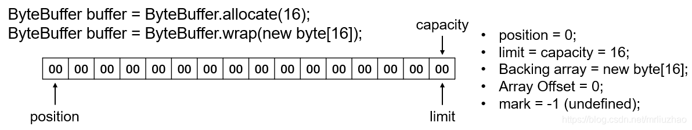

#### 从ByteBuffer中读数据

##### 手动写入数据(不常用)

```java
buffer.put((byte) 1);
buffer.putInt(33);
```

​		可以手动通过`put(byte b)`或`put(byte[] b)`方法向ByteBuffer中添加一个字节或一个字节数组。ByteBuffer也方便地提供了几种写入基本类型的put方法：

```java
put(byte b);
put(byte[] b);
//在指定位置写入数据：
put(int index,byte b);
put(int[] src,int offset,int length);
putChar(char val);
putShort(short val);
putInt(int val);
putFloat(float val);
putLong(long val);
putDouble(double val);
```

​		执行这些写入方法之后，就会以当前的position位置作为起始位置，写入对应长度的数据，并在写入完毕之后将position向后移动对应的长度。下图就表示了分别向ByteBuffer中写入1个字节的byte数据和4个字节的Integer数据的结果：

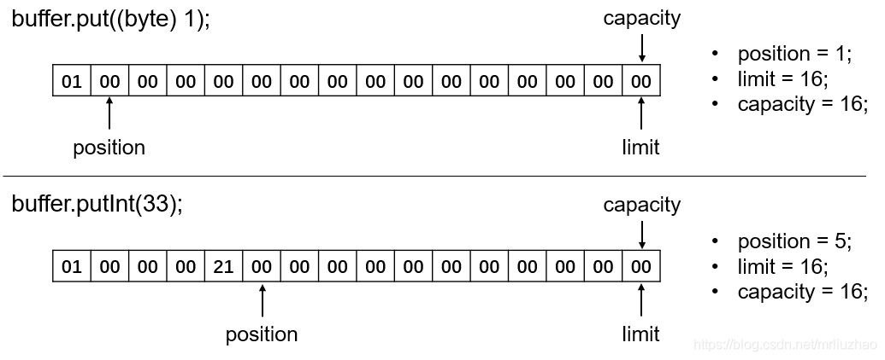

​		但是当想要写入的数据长度大于ByteBuffer当前剩余的长度时，则会抛出BufferOverflowException异常，剩余长度的定义即为limit与position之间的差值（即 limit - position）。如上述例子中，若再执行`buffer.put(new byte[12]);`就会抛出BufferOverflowException异常，因为剩余长度为11。可以通过调用`ByteBuffer.remaining();`查看该ByteBuffer当前的剩余可用长度。

##### 从SocketChannel中读入数据至ByteBuffer

​		在实际应用中，往往是调用`SocketChannel.read(ByteBuffer dst)`，从SocketChannel中读入数据至指定的ByteBuffer中。由于ByteBuffer常常是非阻塞的，所以该方法的返回值即为实际读取到的字节长度。假设实际读取到的字节长度为 n，ByteBuffer剩余可用长度为 r，则二者的关系一定满足：0 <= n <= r。继续接上述的例子，假设调用read方法，从SocketChannel中读入了4个字节的数据，则buffer的情况如下：


#### 从ByteBuffer中读数据

```java
buffer.flip();
```


##### 复位position

现在ByteBuffer容器中已经存有数据，那么现在就要从ByteBuffer中将这些数据取出来解析。由于position就是下一个读写操作的起始位置，故在读取数据后直接写出数据肯定是不正确的，要先把position复位到想要读取的位置。

首先看一个`rewind()`方法，该方法仅仅是简单粗暴地将position直接复原到0，limit不变。这样进行读取操作的话，就是从第一个字节开始读取了。如下图：

该方法虽然复位了position，可以从头开始读取数据，但是并未标记处有效数据的结束位置。如本例所述，ByteBuffer总容量为16字节，但实际上只读取了9个字节的数据，因此最后的7个字节是无效的数据。故`rewind()`方法常常用于字节数组的**完整拷贝**。

实际应用中更常用的是`flip()`方法，该方法不仅将position复位为0，同时也将limit的位置放置在了position之前所在的位置上，这样position和limit之间即为新读取到的有效数据。如下图：


##### 读取数据

```java
get();//读取1个字节
get(int index);
get(byte[] dst);
get(byte[] dst,int offset,int length);

getChar();		getChar(int index);
getShort();		getShort(int index);
getInt();		getInt(int index);
getFloat();		getFloat(int index);
getLong();		getLong(int index);
getDouble();	getDouble(int index);
```


在将position复位之后，我们便可以从ByteBuffer中读取有效数据了。类似`put()`方法，ByteBuffer同样提供了一系列get方法，从position开始读取数据。`get()`方法读取1个字节，`getChar()`、`getShort()`、`getInt()`、`getFloat()`、`getLong()`、`getDouble()`则读取相应字节数的数据，并转换成对应的数据类型。如`getInt()`即为读取4个字节，返回一个Int。在调用这些方法读取数据之后，ByteBuffer还会将position向后移动读取的长度，以便继续调用get类方法读取之后的数据。

这一系列get方法也都有对应的接收一个int参数的重载方法，参数值表示从指定的位置读取对应长度的数据。如`getDouble(2)`则表示从下标为2的位置开始读取8个字节的数据，转换为double返回。不过实际应用中往往对指定位置的数据并不那么确定，所以带int参数的方法也不是很常用。`get()`方法则有两个重载方法：

- `get(byte[] dst, int offset, int length)`：表示尝试从 position 开始读取 length 长度的数据拷贝到 dst 目标数组 offset 到 offset + length 位置，相当于执行了

```java
for (int i = off; i < off + len; i++)
    dst[i] = buffer.get();
```

- `get(byte[] dst)`：尝试读取 dst 目标数组长度的数据，拷贝至目标数组，相当于执行了

```java
 buffer.get(dst, 0, dst.length);
```

此处应注意读取数据后，已读取的数据也不会被清零。下图即为从例子中连续读取1个字节的byte和4个字节的int数据：

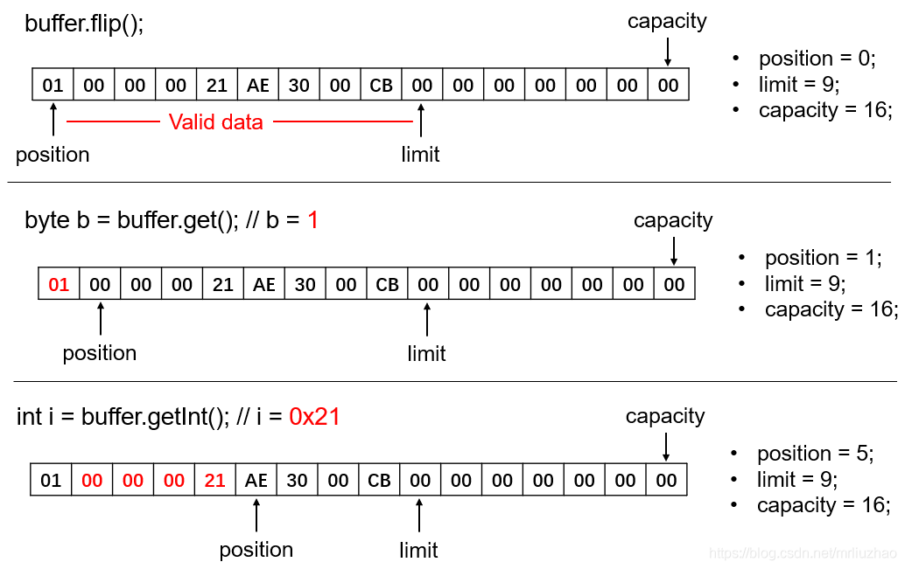

此处同样要注意，当想要读取的数据长度大于ByteBuffer剩余的长度时，则会抛出 BufferUnderflowException 异常。如上例中，若再调用`buffer.getLong()`就会抛出 BufferUnderflowException 异常，因为 remaining 仅为4。

#### 确保数据长度

为了防止出现上述的 BufferUnderflowException 异常，最好要在读取数据之前确保 ByteBuffer 中的有效数据长度足够。在此记录一下我的做法：

```java
private void checkReadLen(
    long reqLen,
    ByteBuffer buffer,
    SocketChannel dataSrc
) throws IOException {
    int readLen;
    if (buffer.remaining() < reqLen) { // 剩余长度不够，重新读取
        buffer.compact(); // 准备继续读取
        System.out.println("Buffer remaining is less than" + reqLen + ". Read Again...");
        while (true) {
            readLen = dataSrc.read(buffer);
            System.out.println("Read Again Length: " + readLen + "; Buffer Position: " + buffer.position());
            if (buffer.position() >= reqLen) { // 可读的字节数超过要求字节数
                break;
            }
        }
        buffer.flip();
        System.out.println("Read Enough Data. Remaining bytes in buffer: " + buffer.remaining());
    }
}
```

#### 继续写入数据

由于ByteBuffer往往是非阻塞式的，故不能确定新的数据是否已经读完，但这时候依然可以调用ByteBuffer的`compact()`方法切换到读取模式。该方法就是将 position 到 limit 之间还未读取的数据拷贝到 ByteBuffer 中数组的最前面，然后再将 position 移动至这些数据之后的一位，将 limit 移动至 capacity。这样 position 和 limit 之间就是已经读取过的老的数据或初始化的数据，就可以放心大胆地继续写入覆盖了。仍然使用之前的例子，调用 `compact()` 方法后状态如下：


#### 总结

总之ByteBuffer的基本用法就是：
初始化（`allocate`）–> 写入数据（`read / put`）–> 转换为写出模式（`flip`）–> 写出数据（`get`）–> 转换为写入模式（`compact`）–> 写入数据（`read / put`）

#### 例1

```java
public static void main(String[] args) {
    ByteBuffer buffer = ByteBuffer.allocate(8);
    //ByteBuffer buffer = ByteBuffer.wrap(new byte[16]);//也可以手动封装数组
    for (int i = 0; i < buffer.capacity(); i++) {
        buffer.put((byte) (2 * i));
    }
    buffer.flip();//读写切换，将position置零，limit置为已经存入的数据的大小
    while (buffer.hasRemaining()){
        System.out.println(buffer.get());
    }

}
```

#### 例2：文本写入到文件

```java
public static void main(String[] args) throws IOException {
    String str = "hello,土豆";
    //输出流--->channel
    FileOutputStream fileOutputStream = new FileOutputStream("file01.txt");
    //通过输出流获取文件channel
    //这个fileChannel真实类型是FileChannelImpl
    FileChannel fileChannel = fileOutputStream.getChannel();
    //创建一个缓冲区
    ByteBuffer byteBuffer = ByteBuffer.allocate(1024);
    //将String放入到byteBuffer
    byteBuffer.put(str.getBytes());
    //读写切换
    byteBuffer.flip();
    //将byteBuffer里数据写入到fileChannel
    fileChannel.write(byteBuffer);
    fileChannel.close();
}
```

#### 例3：从文件读取

```java
public static void main(String[] args) throws IOException {
    //文件输入流
    File file = new File("file01.txt");
    FileInputStream fileInputStream = new FileInputStream(file);
    //通过fileInputStream获取对应的FileChannel
    FileChannel channel = fileInputStream.getChannel();
    //创建缓冲区
    ByteBuffer byteBuffer = ByteBuffer.allocate((int) file.length());
    //将通道的数据读入buffer中
    channel.read(byteBuffer);
    //将byteBuffer字节转化为字符串
    System.out.println(new String(byteBuffer.array()));
    fileInputStream.close();
}
//hello,土豆
```


### 选择器

​		传统的CS模式，为每个请求建立一个线程，增大开销。即便采用线程池后，还是有缺陷，如下图：

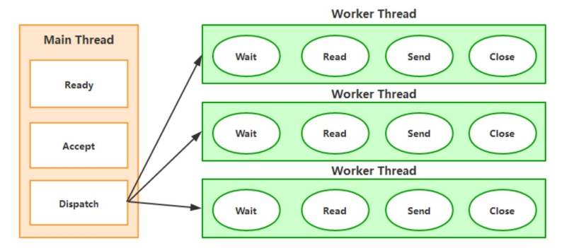

​		NIO中非阻塞I/O采用了基于Reactor模式的工作方式，I/O调用不会被阻塞，而是注册感兴趣的特定I/O事件，如可读数据到达、新的套接字连接等，在发生特定事件时，系统再通知我们。NIO中实现非阻塞I/O的核心对象是Selector，Selector是注册各种I/O事件的地方，而且当那些事件发生时，就是Seleetor告诉我们所发生的事件，如下图所示  

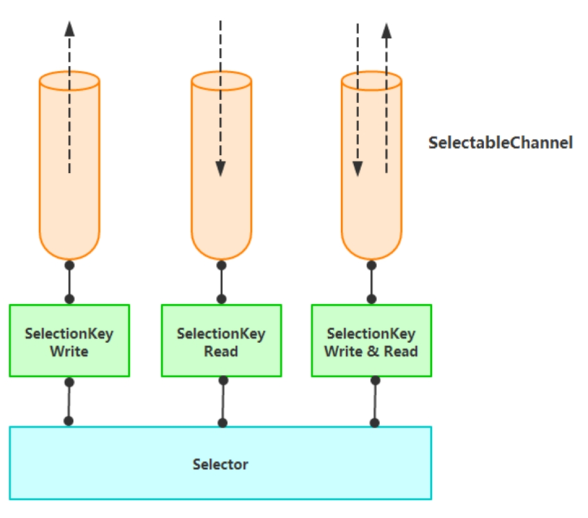

​		当有读或写等任何注册的事件发生时，可以从Selector中获得相应的SelectionKey，同时从SelectionKey中可以找到
发生的事件和该事件所发生的具体的SelectableChannel，以获得客户端发送过来的数据。  

（1）向Selector对象注册感兴趣的事件。
（2）从Selector中获取感兴趣的事件。
（3）根据不同的事件进行相应的处理。  


```java
//注册事件
public Selector getSelector() throws IOException {
    Selector selector = Selector.open();//创建Selector
    ServerSocketChannel server = ServerSocketChannel.open();
    server.configureBlocking(false);//设置非阻塞模式
    ServerSocket socket = server.socket();
    InetSocketAddress address = new InetSocketAddress(8888);//端口号
    socket.bind(address);//绑定端口号到指定端口
    server.register(selector, SelectionKey.OP_READ);//注册事件
    return selector;
}
```


开始监听

```java
//开始监听
public void listen(Selector selector) throws IOException {
    while (true){
        //该调用会阻塞，直到至少有一个事件发生
        selector.select();
        Set<SelectionKey> keys = selector.selectedKeys();
        Iterator<SelectionKey> iterator = keys.iterator();
        while (iterator.hasNext()){
            SelectionKey key = iterator.next();
            iterator.remove();
            process(key);
        }
    }
}
```

#### NIO服务器

```java
import java.io.IOException;
import java.net.InetSocketAddress;
import java.nio.ByteBuffer;
import java.nio.channels.SelectionKey;
import java.nio.channels.Selector;
import java.nio.channels.ServerSocketChannel;
import java.nio.channels.SocketChannel;
import java.util.Iterator;
import java.util.Set;

public class NIOServerDemo {
    private int port = 8080;
    //准备两个东西
    //轮询器 Selector 大堂经理
    private Selector selector;
    //缓冲区 Buffer 等候区
    private ByteBuffer buffer = ByteBuffer.allocate(1024);

    //初始化完毕
    public NIOServerDemo(int port){
        //初始化大堂经理，开门营业
        try {
            this.port = port;
            ServerSocketChannel server = ServerSocketChannel.open();
            //大堂经理准备就绪，接客
            selector = Selector.open();
            //在门口翻牌子，正在营业
            server.register(selector, SelectionKey.OP_ACCEPT);
            //BIO 升级版本 NIO，为了兼容BIO，NIO模型默认是采用阻塞式
            server.configureBlocking(false);
            //我得告诉地址
            //IP/Port
            server.bind(new InetSocketAddress(this.port));
        } catch (Exception e) {
            e.printStackTrace();
        }
    }

    public void listen(){
        System.out.println("listen on " + this.port + ".");
        try {
            //轮询主线程
            while (true){
                //大堂经理再叫号
                selector.select();
                //每次都拿到所有的号子
                Set<SelectionKey> keys = selector.selectedKeys();
                Iterator<SelectionKey> iter = keys.iterator();
                //不断地迭代，就叫轮询
                //同步体现在这里，因为每次只能拿一个key，每次只能处理一种状态
                while (iter.hasNext()){
                    SelectionKey key = iter.next();
                    iter.remove();
                    //每一个key代表一种状态
                    //没一个号对应一个业务
                    //数据就绪、数据可读、数据可写 等等等等
                    process(key);
                }

            }
        } catch (IOException e) {
            e.printStackTrace();
        }
    }

    //具体办业务的方法，坐班柜员
    //每一次轮询就是调用一次process方法，而每一次调用，只能干一件事
    //在同一时间点，只能干一件事
    private void process(SelectionKey key) throws IOException {
        //针对于每一种状态给一个反应
        if(key.isAcceptable()){
            ServerSocketChannel server = (ServerSocketChannel)key.channel();
            //这个方法体现非阻塞，不管你数据有没有准备好
            //你给我一个状态和反馈
            SocketChannel channel = server.accept();
            //一定一定要记得设置为非阻塞
            channel.configureBlocking(false);
            //当数据准备就绪的时候，将状态改为可读
            key = channel.register(selector,SelectionKey.OP_READ);
        }
        else if(key.isReadable()){
            //key.channel 从多路复用器中拿到客户端的引用
            SocketChannel channel = (SocketChannel)key.channel();
            int len = channel.read(buffer);
            if(len > 0){
                buffer.flip();
                String content = new String(buffer.array(),0,len);
                key = channel.register(selector,SelectionKey.OP_WRITE);
                //在key上携带一个附件，一会再写出去
                key.attach(content);
                System.out.println("读取内容：" + content);
            }
        }
        else if(key.isWritable()){
            SocketChannel channel = (SocketChannel)key.channel();

            String content = (String)key.attachment();
            channel.write(ByteBuffer.wrap(("输出：" + content).getBytes()));

            channel.close();
        }
    }

    public static void main(String[] args) {
        new NIOServerDemo(8080).listen();
    }
}
```

### 通道

​		通道是一个对象，通过它可以读取和写入数据，当然所有数据都通过Buffer对象来处理。我们永远不会将字节直接写入通道，而是将数据写入包含一个或者多个字节的缓冲区。同样也不会直接从通道中读取字节，而是将数据从通道读入缓冲区，再从缓冲区获取这个字节  

​		NIO提供了多种通道对象，所有的通道对象都实现了Channel接口。它们之间的继承关系如下图所示  

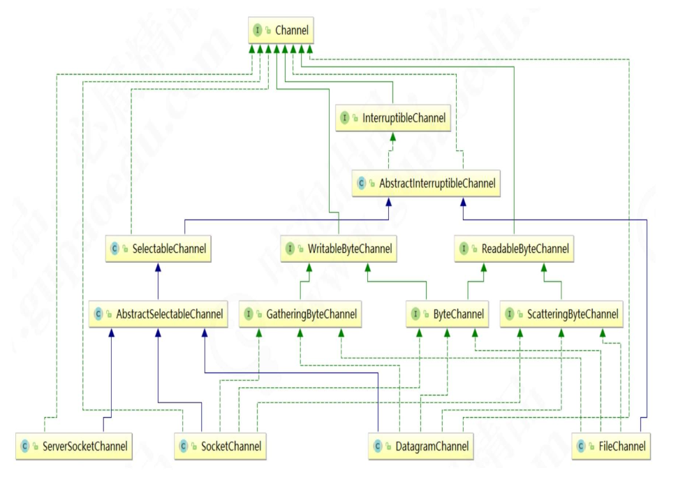

#### NIO读取数据

​		任何时候读取数据，都不是直接从通道读取的，而是从通道读取到缓冲区的。所以使用NIO读取数据可以分为下面三个步骤  

（1）从FileInputStream获取Channel。

（2）创建Buffer。

（3）将数据从Channel读取到Buffer中。

```java
static private final byte message[] ={88,111,109,101,32,98};

public static void main(String[] args) throws IOException {
    FileOutputStream fout = new FileOutputStream("FileOutputDemo.txt");
    FileChannel channel = fout.getChannel();
    ByteBuffer buffer = ByteBuffer.allocate(1024);
    for (int i = 0; i < message.length; i++) {
        buffer.put(message[i]);
    }
    buffer.flip();//读写切换
    channel.write(buffer);//buffer写入通道
    fout.close();
}
```

#### 使用NIO写入数据

（1）从FileInputStream获取Channel。

（2）创建Buffer。

（3）将数据从Channel写入Buffer。

```java
@Test
public void test() throws IOException{
    FileInputStream fin = new FileInputStream("FileOutputDemo.txt");
    FileChannel channel = fin.getChannel();
    ByteBuffer buffer = ByteBuffer.allocate(1024);
    channel.read(buffer);
    buffer.flip();
    while (buffer.hasRemaining()){
        System.out.println((char)buffer.get());
    }
    fin.close();
}
```

## 反应堆  Reactor

​		阻 塞 I/O 在 调 用InputStream.read()方法时是阻塞的，它会一直等到数据到来（或超时）时才会返回；同样，在调用ServerSocket.accept()方法时，也会一直阻塞到有客户端连接才会返回，每个客户端连接成功后，服务端都会启动一个线程去处理该客户端的请求。**阻塞I/O的通信模型**示意如下图所示。  

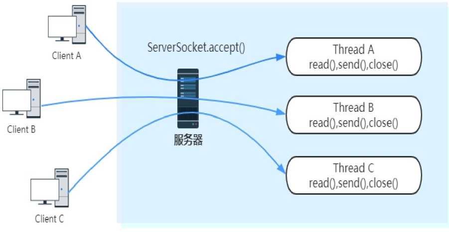

**非阻塞I/O**  

（1）由一个专门的线程来处理所有的I/O事件，并负责分发。
（2）事件驱动机制：事件到的时候触发，而不是同步地去监视事件。
（3）线程通信：线程之间通过wait、notify等方式通信。保证每次上下文切换都是有意义的，减少无谓的线程切换。

NIO反应堆 的工作原理图  

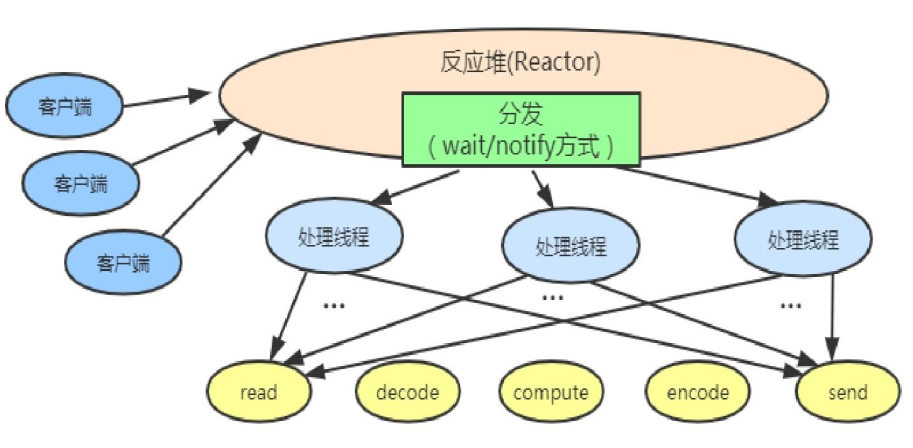

注：每个线程的处理流程大概都是**读取数据、解码、计算处理、编码和发送响应**  

## Netty与NIO  

Netty支持的功能与特性如下图所示  

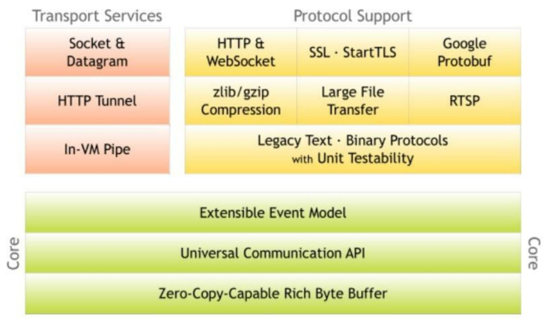

（1）底层核心有：Zero-Copy-Capable Buffer，非常易用的零拷贝Buffer（这个内容很有意思，稍后专门来讲）；统一的API；标准可
扩展的事件模型。

（2）传输方面的支持有：管道通信；HTTP隧道；TCP与UDP。

（3）协议方面的支持有：基于原始文本和二进制的协议；解压缩；大文件传输；流媒体传输；ProtoBuf编解码；安全认证；HTTP和WebSocket。  

### Netty采用NIO而非AIO的理由  

（1）Netty不看重Windows上的使用，在Linux系统上，AIO的底层实现仍使用epoll，没有很好地实现AIO，因此在性能上没有明显的优
势，而且被JDK封装了一层，不容易深度优化。

（2）Netty整体架构采用Reactor模型，而AIO采用Proactor模型，混在一起会非常混乱，把AIO也改造成Reactor模型，看起来是把Epoll
绕个弯又绕回来。  

（3）AIO还有个缺点是接收数据需要预先分配缓存，而NIO是需要接收时才分配缓存，所以对连接数量非常大但流量小的情况，AIO浪费
很多内存。
（4）Linux上AIO不够成熟，处理回调结果的速度跟不上处理需求，比如外卖员太少，顾客太多，供不应求，造成处理速度有瓶颈。 

# 基于Netty手写Tomcat

## 准备Servlet类

http请求的格式：

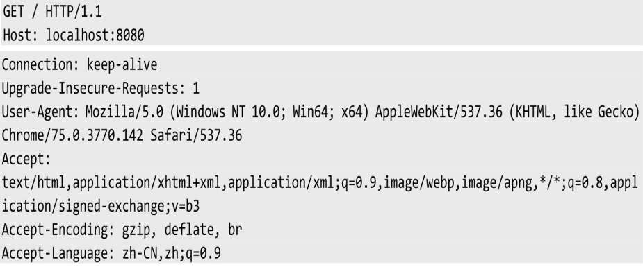

Servlet抽象类

```java
public abstract class TDServlet {
    public void service(TDRequest request,TDResponse response) throws Exception{
        //决定调用是doGet()还是doPost()
        if ("GET".equalsIgnoreCase(request.getMethod())){
            doGet(request,response);
        }else {
            doPost(request,response);
        }
    }
    public abstract void doGet(TDRequest request,TDResponse response) throws Exception;
    public abstract void doPost(TDRequest request,TDResponse response) throws Exception;
}
```


```java
public class FirstServlet extends TDServlet{
    @Override
    public void doGet(TDRequest request, TDResponse response) throws Exception {
        this.doPost(request,response);
    }

    @Override
    public void doPost(TDRequest request, TDResponse response) throws Exception {
        response.write("This is First Servlet");
    }
}
```


```java
public class SecondServlet extends TDServlet {
    @Override
    public void doGet(TDRequest request, TDResponse response) throws Exception {
        this.doPost(request,response);
    }

    @Override
    public void doPost(TDRequest request, TDResponse response) throws Exception {
        response.write("This is Second Servlet");
    }
}
```


## 基于传统IO

**Request**

```java
import java.io.InputStream;

/**
 * 请求例如：
 * GET / HTTP/1.1
 * Host: localhost:8080
 * @author Potato20522
 * @date 2020/12/2
 */
public class TDRequest {
    private String method;
    private String url;

    //取请求方法和url
    public TDRequest(InputStream in){
        try {
            //获取http内容
            String content = "";
            byte[] buff = new byte[1024];
            int len = 0;
            if ((len=in.read(buff))>0){
                content = new String(buff, 0, len);
            }
            String line = content.split("\\n")[0];
            String[] arr = line.split("\\s");//获取请求方法
            this.method=arr[0];
            this.url = arr[1].split("\\?")[0];
        }catch (Exception e){
            e.printStackTrace();
        }
    }

    public String getUrl(){
        return url;
    }

    public String getMethod(){
        return method;
    }
}
```

**Response**

```java
import java.io.OutputStream;

/**
 * @author Potato20522
 * @date 2020/12/2
 */
public class TDResponse {
    private OutputStream out;
    public TDResponse(OutputStream out){
        this.out = out;
    }

    //按照http规范输出字符串
    public void write(String s) throws Exception{
        //输出要遵循http  状态码为200
        String sb = "HTTP/1.1 200 ok\n" +
            "Content-Type: text/html;\n" +
            "\r\n" +
            s;
        out.write(sb.getBytes());
    }
}

```

**启动类**，包含init初始化方法和start启动方法

```java
public class Tomcat {
    private int port = 8080;
    private ServerSocket server;
    private Map<String,TDServlet> servletMapping = new HashMap<>();
    private Properties webxml = new Properties();

    private void init(){
        //加载web.xml（其实是.properties）文件，同时初始化ServletMapping对象
        try {
            String WEB_INF = this.getClass().getResource("/").getPath();
            FileInputStream fis = new FileInputStream(WEB_INF + "WEB_INF/web.properties");
            webxml.load(fis);
            for (Object o : webxml.keySet()) {
                String key = o.toString();
                if (key.endsWith(".url")) {
                    String servletName = key.replaceAll("\\.url$", "");
                    String url = webxml.getProperty(key);
                    String className = webxml.getProperty(servletName + ".className");
                    //单实例，多线程
                    TDServlet obj = (TDServlet)Class.forName(className).newInstance();
                    servletMapping.put(url, obj);
                }

            }
        }catch (Exception e){
            e.printStackTrace();
        }
    }

    public void start(){
        //1.加载配置文件，初始化ServletMapping
        init();
        try {
            server = new ServerSocket(this.port);
            System.out.println("Tomcat已启动，监听的端口是："+this.port);

            //2.等到用户请求
            while (true){
                Socket client = server.accept();
                //3.收到HTTP请求，进行处理
                process(client);
            }
        }catch (Exception e ){
            e.printStackTrace();
        }
    }

    private void process(Socket client) throws Exception{
        InputStream is = client.getInputStream();
        OutputStream os = client.getOutputStream();
        //4.请求和响应
        TDRequest request = new TDRequest(is);
        TDResponse response = new TDResponse(os);

        //5.从协议中获取URL，把相应的Servlet用反射进行实例化
        String url = request.getUrl();
        if (servletMapping.containsKey(url)){
            //6.调用实例化对象的service()方法，执行doGet()/doPost()方法
            servletMapping.get(url).service(request,response);
        }else {
            response.write("404 not found");
        }
        os.flush();
        os.close();

        is.close();
        client.close();
    }

    public static void main(String[] args) {
        new Tomcat().start();
    }
}

```

## 基于Netty

主启动类

```java
package com.tudou.tomcat.servlet;

import io.netty.bootstrap.ServerBootstrap;
import io.netty.channel.*;
import io.netty.channel.nio.NioEventLoopGroup;
import io.netty.channel.socket.SocketChannel;
import io.netty.channel.socket.nio.NioServerSocketChannel;
import io.netty.channel.socket.nio.NioSocketChannel;
import io.netty.handler.codec.http.HttpRequest;
import io.netty.handler.codec.http.HttpResponseDecoder;
import io.netty.handler.codec.http.HttpResponseEncoder;

import java.io.FileInputStream;
import java.io.InputStream;
import java.io.OutputStream;
import java.net.ServerSocket;
import java.net.Socket;
import java.util.HashMap;
import java.util.Map;
import java.util.Properties;

/**
 * @author Potato20522
 * @date 2020/12/2
 */
public class Tomcat {
    private int port = 8080;
    private ServerSocket server;
    private Map<String, TDServlet> servletMapping = new HashMap<>();
    private Properties webxml = new Properties();

    private void init() {
        //加载web.xml（其实是.properties）文件，同时初始化ServletMapping对象
        try {
            String WEB_INF = this.getClass().getResource("/").getPath();
            FileInputStream fis = new FileInputStream(WEB_INF + "WEB_INF/web.properties");
            webxml.load(fis);
            for (Object o : webxml.keySet()) {
                String key = o.toString();
                if (key.endsWith(".url")) {
                    String servletName = key.replaceAll("\\.url$", "");
                    String url = webxml.getProperty(key);
                    String className = webxml.getProperty(servletName + ".className");
                    //单实例，多线程
                    TDServlet obj = (TDServlet) Class.forName(className).newInstance();
                    servletMapping.put(url, obj);
                }

            }
        } catch (Exception e) {
            e.printStackTrace();
        }
    }

    public void start() {
        init();
        //Netty封装了NIO的Reactor模型，Boss,Worker
        EventLoopGroup bossGroup = new NioEventLoopGroup();
        EventLoopGroup workerGroup = new NioEventLoopGroup();
        try {
            //1.Bootstrap
            ServerBootstrap server = new ServerBootstrap();

            //2.配置参数
            server.group(bossGroup, workerGroup)
                    //主线程处理类
                    .channel(NioServerSocketChannel.class)
                    //子线程处理类
                    .childHandler(new ChannelInitializer<SocketChannel>() {
                        //客户端初始化处理
                        @Override
                        protected void initChannel(SocketChannel client) throws Exception {
                            //Netty对HTTP封装，对顺序有要求
                            //HttpResponseEncoder 编码器
                            //责任链模式，双向链表
                            client.pipeline().addLast(new HttpResponseEncoder());

                            //HttpResponseDecoder 解码器
                            client.pipeline().addLast(new HttpResponseDecoder());

                            //业务处理
                            client.pipeline().addLast(new TomcatHandler());
                        }
                    })
                    .option(ChannelOption.SO_BACKLOG, 128)//主线程 分配最大线程128个
                    .childOption(ChannelOption.SO_KEEPALIVE, true);//子线程 保持长连接

            //3.启动服务器
            ChannelFuture future = server.bind(port).sync();
            System.out.println("tomcat服务器已启动，监听的端口是："+port);
            future.channel().closeFuture().sync();
        } catch (Exception e) {
            e.printStackTrace();
        }finally {
            //关闭
            bossGroup.shutdownGracefully();
            workerGroup.shutdownGracefully();
        }
    }

    public static void main(String[] args) {
        new Tomcat().start();
    }
    public class TomcatHandler extends ChannelInboundHandlerAdapter {
        @Override
        public void channelRead(ChannelHandlerContext ctx, Object msg) throws Exception {
            if (msg instanceof HttpRequest) {
                System.out.println("hello");
                HttpRequest req = (HttpRequest) msg;

                TDRequest request = new TDRequest(ctx, req);
                TDResponse response = new TDResponse(ctx, req);
                String url = request.getUrl();
                if (servletMapping.containsKey(url)) {
                    servletMapping.get(url).service(request, response);
                } else {
                    response.write("404 not found");
                }
            }
        }

        @Override
        public void exceptionCaught(ChannelHandlerContext ctx, Throwable cause) throws Exception {
            super.exceptionCaught(ctx, cause);
        }
    }
}

```


**Request**

```java
package com.tudou.tomcat.servlet;

import io.netty.channel.ChannelHandlerContext;
import io.netty.handler.codec.http.HttpRequest;
import io.netty.handler.codec.http.QueryStringDecoder;

import java.io.InputStream;
import java.util.List;
import java.util.Map;

/**
 * 请求例如：
 * GET / HTTP/1.1
 * Host: localhost:8080
 * @author Potato20522
 * @date 2020/12/2
 */
public class TDRequest {
    private ChannelHandlerContext ctx;
    private HttpRequest req;

    //取请求方法和url
    public TDRequest(ChannelHandlerContext ctx, HttpRequest req){
        this.ctx = ctx;
        this.req = req;
    }

    public String getUrl(){
        return req.uri();
    }

    public String getMethod(){
        return req.method().name();
    }

    public Map<String, List<String>> getParameters(){
        QueryStringDecoder decoder = new QueryStringDecoder(req.uri());
        return decoder.parameters();
    }

    public String getParameter(String name){
        Map<String, List<String>> params = getParameters();
        List<String> param = params.get(name);
        if (param==null){
            return null;
        }else {
            return param.get(0);
        }
    }
}

```

**Response**

```java
package com.tudou.tomcat.servlet;

import io.netty.buffer.Unpooled;
import io.netty.channel.ChannelHandlerContext;
import io.netty.handler.codec.http.*;

import java.io.OutputStream;

/**
 * @author Potato20522
 * @date 2020/12/2
 */
public class TDResponse {
    //SocketChannel封装
    private ChannelHandlerContext ctx;
    private HttpRequest req;
    public TDResponse(ChannelHandlerContext ctx,HttpRequest req){
        this.ctx = ctx;
        this.req = req;
    }

    //按照http规范输出字符串
    public void write(String out) throws Exception{
        try {
            if (out == null ||out.length()==0){
                return;
            }
            //设置HTTP以及请求头信息
            FullHttpResponse response = new DefaultFullHttpResponse(
                    HttpVersion.HTTP_1_1,//设置版本为HTTP1.1
                    HttpResponseStatus.OK,//设置响应状态码
                    Unpooled.wrappedBuffer(out.getBytes("UTF-8")));
            response.headers().set("Content-Type", "text/html");
            ctx.writeAndFlush(response);
        }finally {
            ctx.close();
        }
    }
}

```


# Netty高性能

## 传统RPC调用的不足

三点原因

- 网络传输方式存在弊端

BIO

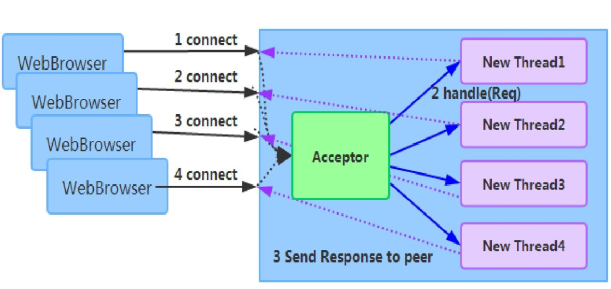

- 序列化方式存在弊端  
  - Java对象的序列化无法开语言使用
  - 序列化后占用空间大
  - 编码解码时占用CPU高
- 线程模型存在弊端。由于传统的RPC框架均采用BIO模型，这使得每个TCP连接都需要分配1个线程，而线程资源是JVM非常宝
  贵的资源，当I/O读写阻塞导致线程无法及时释放时，会导致系统性能急剧下降，甚至会导致虚拟机无法创建新的线程

## Netty高性能原因

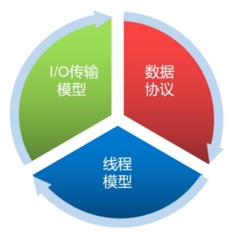

### 异步非阻塞通信

Netty底层是采用Reactor线程模型  

Netty服务端通信步骤

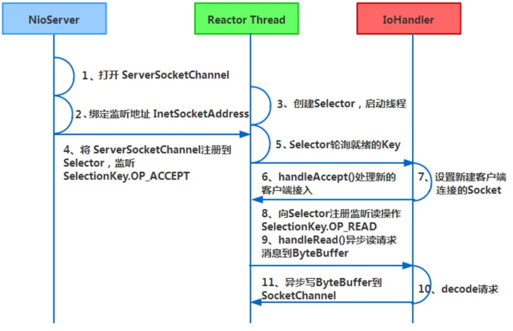

Netty客户端通信

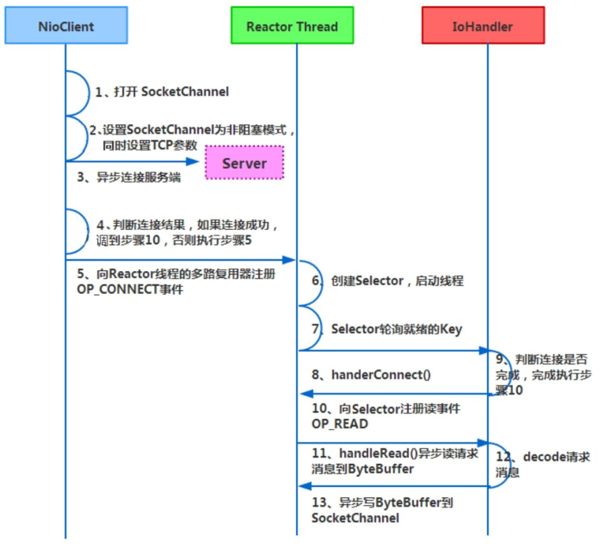

### 零拷贝

主要体现在三个方面

1）Netty接收和发送ByteBuffer采用**DirectBuffer**，使用**堆外直接内存进行Socket读写**，不需要进行字节缓冲区的二次拷贝。如果使用
传统的堆存（Heap Buffer）进行Socket读写，那么JVM会将堆存拷贝一份到直接内存中，然后才写入Socket。相比于堆外直接内存，消息在发送过程中多了一次缓冲区的内存拷贝。

（2）Netty提供了**组合Buffer对象**，可以**聚合多个ByteBuffer对象**，用户可以像操作一个Buffer那样方便地对组合Buffer进行操作，避
免了传统的通过内存拷贝的方式将几个小Buffer合并成一个大Buffer的烦琐操作。

（3）Netty中文件传输采用了**transferTo()方法**，它可以**直接将文件缓冲区的数据发送到目标Channel**，避免了传统通过循环write()方式导致的内存拷贝问题

### 内存池

随着JVM和JIT（Just-In-Time）即时编译技术的发展，对象的分配和回收已然是一个非常轻量级的工作。但是对于缓冲区来说还有些特
殊，尤其是对于堆外直接内存的分配和回收，是一种耗时的操作。为了尽量重复利用缓冲区内存，Netty设计了一套基于内存池的缓冲区重用机制。

Netty ByteBuf的实现

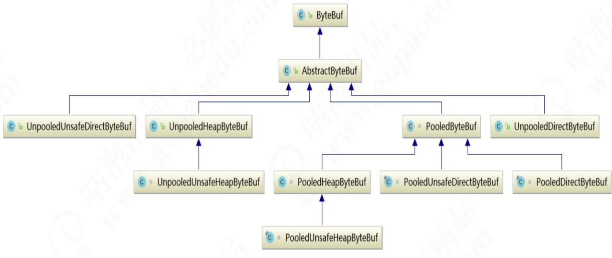

### 高效的Reactor线程模型

常用的Reactor线程模型有三种，分别如下。
（1）Reactor单线程模型。

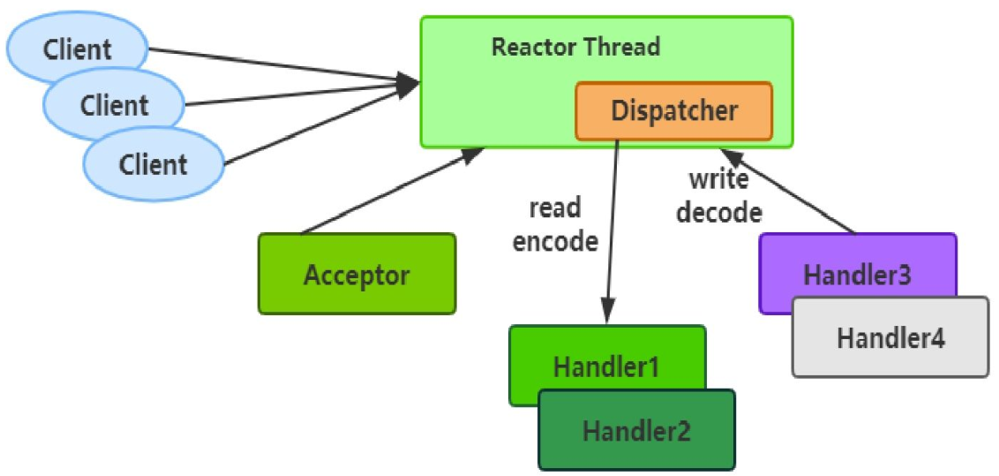

（2）Reactor多线程模型。

​	设计了一个NIO线程池处理I/O操作  

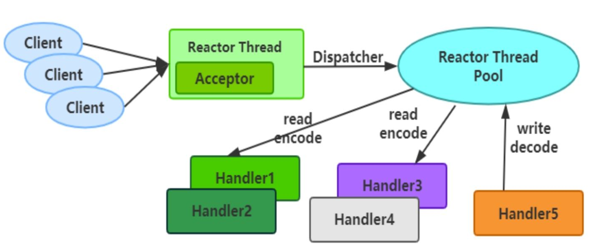

（3）主从Reactor多线程模型。

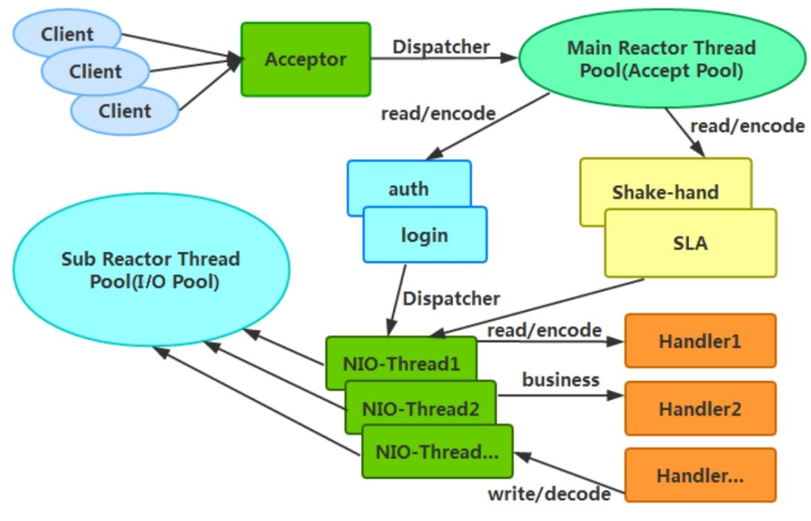

Netty可以自由选择上述三种模型，根据实际业务来定

### 无锁化的串行设计

表面上看，似乎串行设计的CPU利用率不高，并发程度不够。但是，通过调整NIO线程池的线程参数，可以同时启动多个串行的线程并行运行，这种局部无锁化的串行线程设计相比一个队列-多个工作线程的模型性能更优。

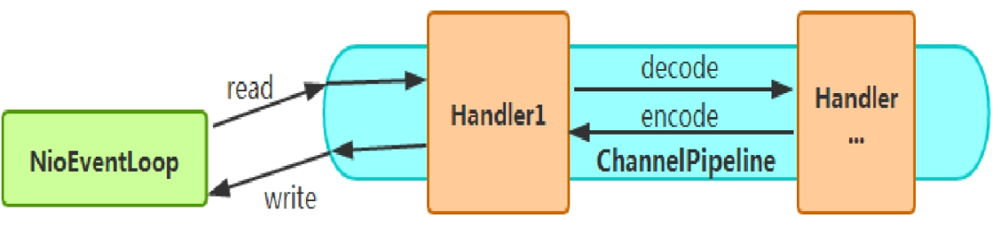

​		Netty的NioEventLoop读取消息之后，直接调用ChannelPipeline的fireChannelRead （ Object msg ） ， 只 要 用 户 不 主 动 切 换 线 程 ，NioEventLoop就会调用用户的Handler，期间不进行线程切换，这种串行处理方式避免了多线程操作导致的锁竞争，从性能角度看是最优的。

### 高效的并发编程

（1）volatile关键字的大量且正确的使用。
（2）CAS和原子类的广泛使用。
（3）线程安全容器的使用。
（4）通过读写锁提升并发性能

### 对高性能的序列化框架的支持

影响序列化性能的关键因素总结如下。
（1）序列化后的码流大小（网络带宽的占用）。
（2）序列化/反序列化的性能（CPU资源占用）。
（3）是否支持跨语言（异构系统的对接和开发语言切换）。

Netty默认提供了对Google **Protobuf**的支持，用户也可以通过扩展Netty的编解码接口接入其他高性能的序列化框架进行编解码，例如
Thrift的压缩二进制编解码框架。

### 灵活的TCP参数配置能力

总结一下对性能影响比较大的几个配置项

（1）SO_RCVBUF和SO_SNDBUF：通常建议值为128KB或者256KB。

（2）SO_TCPNODELAY：Nagle算法通过将缓冲区内的小封包自动相连，组成较大的封包，阻止大量小封包的发送阻塞网络，从而提高网络应用效率。但是对于延时敏感的应用场景需要关闭该优化算法。netty默认禁用

（3）软中断：如果Linux内核版本支持RPS（2.6.35版本以上），开启RPS后可以实现软中断，提升网络吞吐量。RPS会根据数据包的源地
址、目的地址，以及源端口和目的端口进行计算得出一个Hash值，然后根据这个Hash值来选择软中断CPU的运行。从上层来看，也就是说将每个连接和CPU绑定，并通过这个Hash值在多个CPU上均衡软中断，提升网络并行处理性能。

# Bootstrap

## 客户端Bootstrap

Channel

​		在Netty中，Channel相当于一个Socket的抽象，它为用户提供了关于Socket状态（是连接还是断开）及对Socket的读、写等操作。每当Netty建立了一个连接，都创建一个与其对应的Channel实例。

​		除了TCP，Netty还支持很多其他的连接协议，并且每种协议还有NIO（非阻塞I/O）和OIO（Old-I/O，即传统的阻塞I/O）版本的区别。不同协议不同阻塞类型的连接都有不同的Channel类型与之对应。

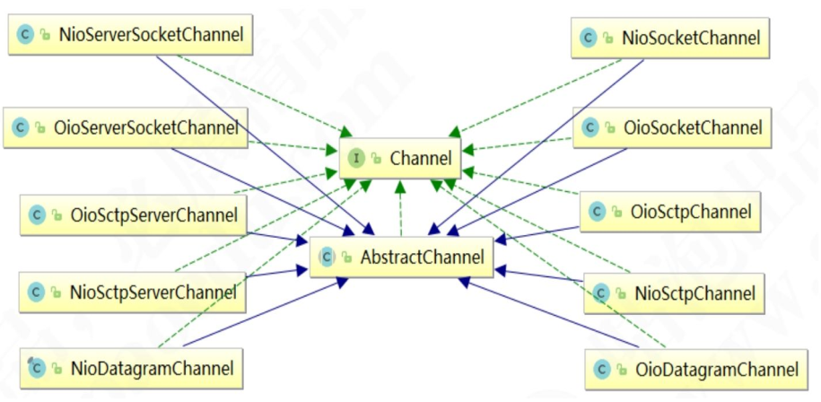

| 类名                      | 作用                                   |
| ------------------------- | -------------------------------------- |
| NioSocketChannel          | 异步非阻塞的客户端TCP Socket连接       |
| NioServerSocketChannel    | 异步非阻塞的服务端TCP Socket连接       |
| NioDatagramChannel        | 异步非阻塞的UDP连接                    |
| NioSctpChannel            | 异步的客户端SCTP（流控制传输协议）连接 |
| NioSctpServerChannel      | 异步非阻塞的SCTP服务端连接             |
| OioSocketChannel          | 同步非阻塞的客户端TCP Socket连接       |
| OioNioServerSocketChannel | 同步非阻塞的服务端TCP Socket连接       |
| OioNioDatagramChannel     | 同步非阻塞的UDP连接                    |
| OioNioSctpChannel         | 同步的客户端SCTP（流控制传输协议）连接 |
| OioNioSctpServerChannel   | 同步非阻塞的SCTP服务端连接             |

**NioSocketChannel的创建**

Bootstrap是Netty提供的一个便利的工厂类，可以通过它来完成客户端或服务端的Netty初始化。

**客户端Channel的初始化**

**Unsafe属性的初始化**

**ChannelPipeline的初始化**  

**EventLoop的初始化**  

**将Channel注册到Selector**

**Handler的添加过程**  

**客户端发起连接请求**  

## 服务端ServerBootstrap

**NioServerSocketChannel的创建**

**服务端Channel的初始化**  

**服务端ChannelPipeline的初始化**  

**将服务端Channel注册到Selector**  

**bossGroup（处理连接）与workerGroup（处理业务）**

**服务端Selector事件轮询**


Netty解决JDK空轮询Bug

Netty对Selector中KeySet的优化  

Handler的添加过程  


# EventLoop

## EventLoopGroup与Reactor

### Reactor线程模型

单Reactor单线程： acceptor和handler都在同一个线程里

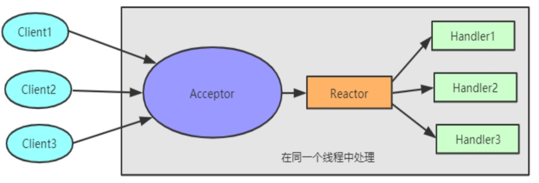

单Reactor多线程：设计一个专门的线程Acceptor  ，handler放在线程池里

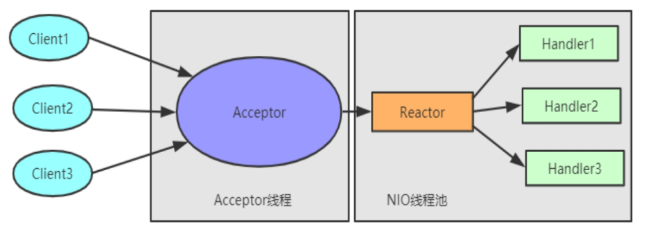

主从Reactor多线程:

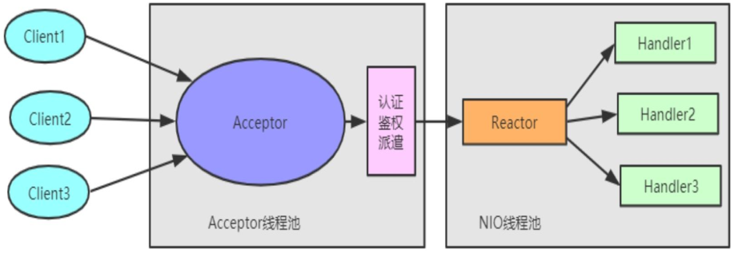

###  EventLoopGroup与Reactor关联

（1）单Reactor单线程模型在Netty中的应用代码如下  

```java
EventLoopGroup bossGroup = new NioEventGroup(1);
ServerBootStrap server = new ServerBootStrap();
server.group(bossGroup);
```

bossGroup同是也充当了workerGroup的功能，见ServerBootStrap的group方法底层源码就知道了

（2）单Reactor多线程模型

```java
EventLoopGroup bossGroup = new NioEventGroup(128);//只要大于1就是多线程
ServerBootStrap server = new ServerBootStrap();
server.group(bossGroup);
```

（3）主从Reactor多线程

```java
EventLoopGroup bossGroup = new NioEventGroup();
EventLoopGroup workerGroup = new NioEventGroup();
ServerBootStrap server = new ServerBootStrap();
server.group(bossGroup,workerGroup);
```

bossGroup为主线程，而workerGroup中的线程数是CPU核数×2


### EventLoopGroup的实例化

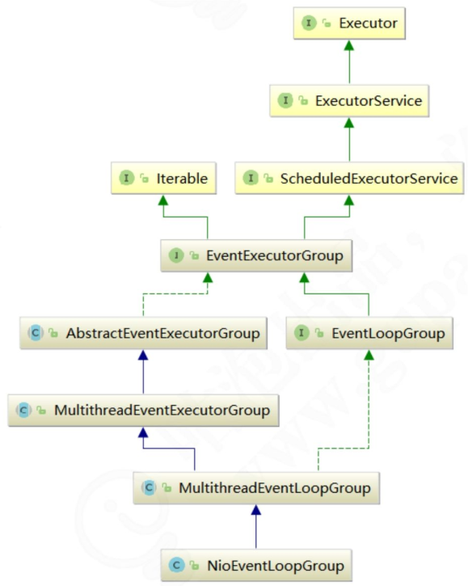

## 任务执行者EventLoop

​		NioEventLoop 继 承 自 SingleThreadEventLoop ， 而SingleThreadEventLoop 又 继 承 自 SingleThreadEventExecutor 。 而
SingleThreadEventExecutor是Netty对本地线程的抽象，它内部有一个Thread属性，实际上就是存储了一个本地Java线程。因此我们可以简单地认为，一个NioEventLoop对象其实就是和一个特定的线程进行绑定，并 且 在 NioEventLoop 生 命 周 期 内 ， 其 绑 定 的 线 程 都 不 会 再 改 变 。NioEventLoop的类层次结构图如下图所示。

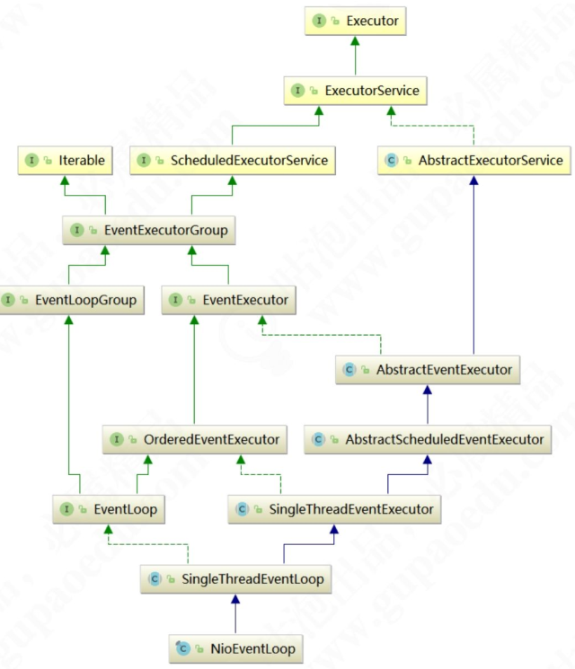

### NioEventLoop的实例化过程  

### EventLoop与Channel的关联

在Netty中，每个Channel都有且仅有一个EventLoop与之关联

### EventLoop的启动

NioEventLoop 的 启 动 ， 其 实 就 是NioEventLoop所绑定的本地Java线程的启动。

# Netty大动脉Pipeline

## Pipeline设计原理

### Channel与ChannelPipeline  

在 Netty 中 每 个 Channel 都 有 且 仅 有 一 个ChannelPipeline与之对应  ,双向链表

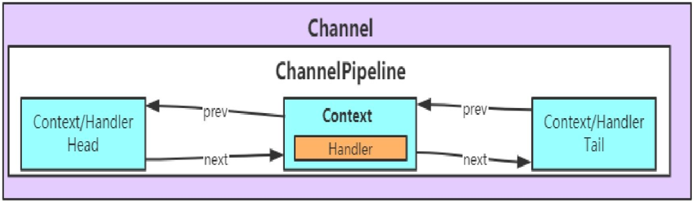

​		一个Channel包含了一个ChannelPipeline，而ChannelPipeline中又维护了一个由ChannelHandlerContext组成的双向
链表。这个链表的头是HeadContext，链表的尾是TailContext，并且每个ChannelHandlerContext中又关联着一个ChannelHandler。

### ChannelPipeline的初始化

 在 实 例 化 一 个 Channel 时 ， 会 伴 随 着 一 个ChannelPipeline的实例化，并且此Channel会与这个ChannelPipeline相互关联

### ChannelInitializer的添加

​		最开始的时候 ChannelPipeline 中 含 有 两 个 ChannelHandlerContext （ 同 时 也 是ChannelHandler），但是此时的Pipeline并不能实现特定的功能，因为还没有添加自定义的ChannelHandler。通常来说，在初始化Bootstrap时，会添加自定义的ChannelHandler