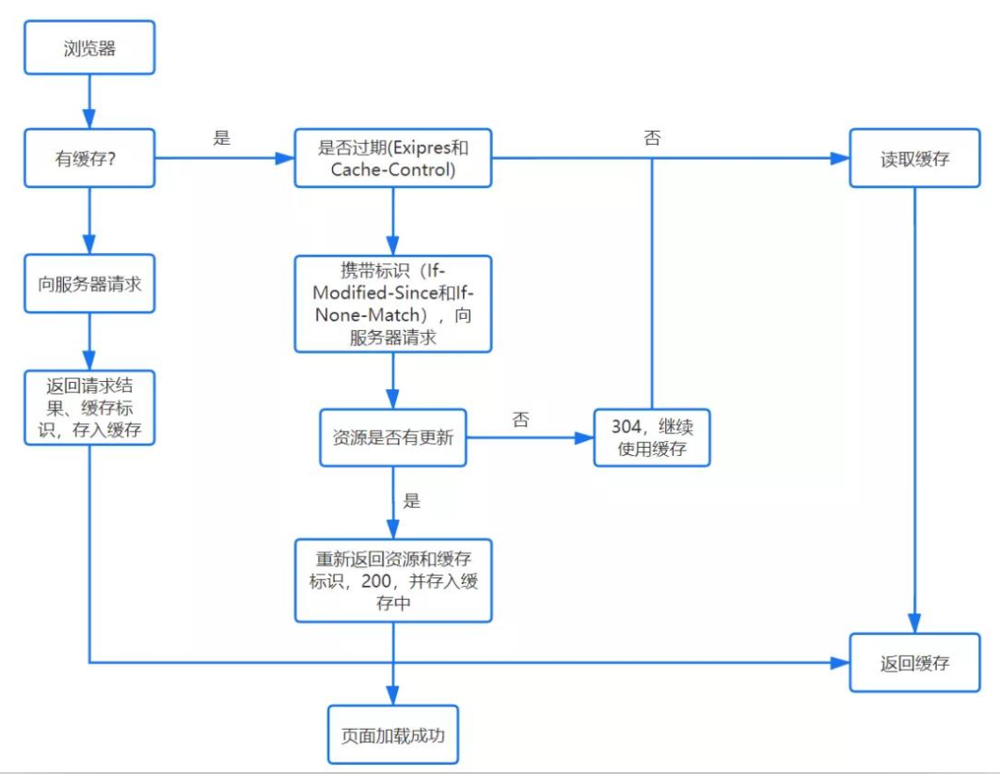
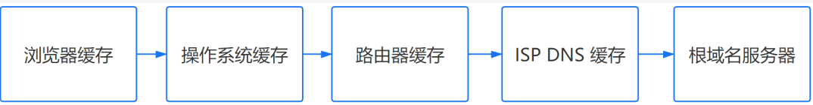
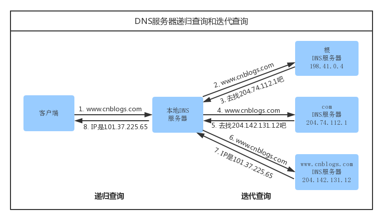
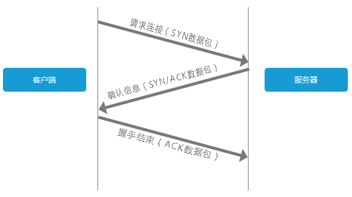
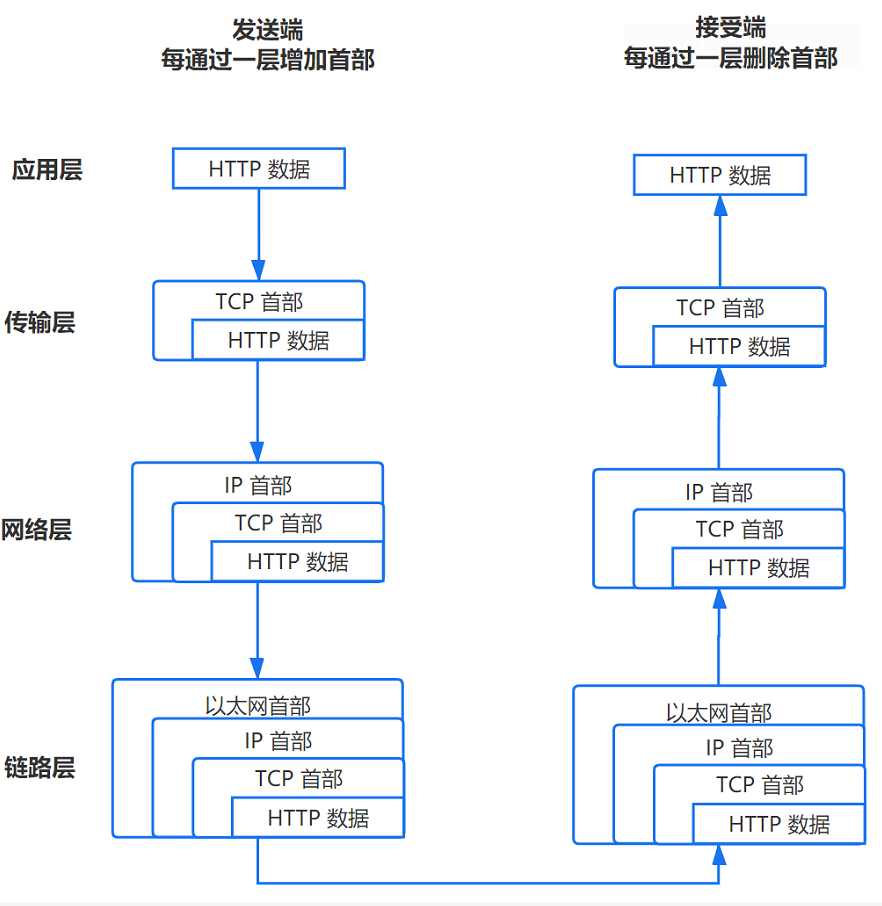

# 网络通信原理

## 向浏览器输入URL后发生了什么

https://www.zhihu.com/question/372902597

https://www.cnblogs.com/jin-zhe/p/11586327.html

https://zhuanlan.zhihu.com/p/43369093

https://segmentfault.com/a/1190000016239579

​		本文的步骤是建立在，请求的是一个简单的 HTTP 请求，没有 HTTPS、HTTP2、最简单的 DNS、没有代理、并且服务器没有任何问题的基础上，尽管这是不切实际的。

### URL解析

- **地址解析**

  首先判断你输入的是一个合法的 URL 还是一个待搜索的关键词，并且根据你输入的内容进行自动完成、字符编码等操作。

- **HSTS**

  由于安全隐患，会使用 HSTS 强制客户端使用 HTTPS 访问页面。

- **其他操作**

  浏览器还会进行一些额外的操作，比如安全检查、访问限制（之前国产浏览器限制 996.icu）。

- **检查缓存**

  

### DNS查询

**基本步骤**

**1. 浏览器缓存**

浏览器会先检查是否在缓存中，没有则调用系统库函数进行查询。

**2. 操作系统缓存**

操作系统也有自己的 DNS缓存，但在这之前，会向检查域名是否存在本地的 **Hosts 文件**里，没有则向 DNS 服务器发送查询请求。

**3. 路由器缓存**

路由器也有自己的缓存。

**4. ISP DNS 缓存**

ISP DNS 就是在客户端电脑上设置的首选 DNS 服务器，它们在大多数情况下都会有缓存。

**5.根域名服务器查询**

多数常见网站，解析的时候根本不会找根。

访问少数冷门网站才可能用到根服务器，找到了根，根也没有直接给结果，直接转给下级服务器

在前面所有步骤没有缓存的情况下，本地 DNS 服务器会将请求转发到互联网上的根域，下面这个图很好的诠释了整个流程：

​		浏览器客户端向本地DNS服务器发送一个含有域名www.cnblogs.com的DNS查询报文。本地DNS服务器把查询报文转发到根DNS服务器，根DNS服务器注意到其com后缀，于是向本地DNS服务器返回comDNS服务器的IP地址。本地DNS服务器再次向comDNS服务器发送查询请求，comDNS服务器注意到其www.cnblogs.com后缀并用负责该域名的权威DNS服务器的IP地址作为回应。最后，本地DNS服务器将含有www.cnblogs.com的IP地址的响应报文发送给客户端。

**需要注意的点**

1. 递归方式：一路查下去中间不返回，得到最终结果才返回信息（浏览器到本地DNS服务器的过程）
2. 迭代方式，就是本地DNS服务器到根域名服务器查询的方式。
3. 什么是 DNS 劫持
4. 前端 dns-prefetch 优化

### TCP连接

**三次握手**

客户端发送一个带有SYN标志的数据包给服务端，服务端收到后，回传一个带有SYN/ACK标志的数据包以示传达确认信息，最后客户端再回传一个带ACK标志的数据包，代表握手结束，连接成功。

上图也可以这么理解：

客户端：“你好，在家不，有你快递。”

服务端：“在的，送来就行。”

客户端：“好嘞。”

### 发送数据

TCP/IP 分为四层，在发送数据时，每层都要对数据进行封装：

#### 1. 应用层：发送 HTTP 请求

　　在前面的步骤我们已经得到服务器的 IP 地址，浏览器会开始构造一个 HTTP 报文，其中包括：

- - 请求报头（Request Header）：请求方法、目标地址、遵循的协议等等
  - 请求主体（其他参数）

　　其中需要注意的点：

- - 浏览器只能发送 GET、POST 方法，而打开网页使用的是 GET 方法

#### 2. 传输层：TCP 传输报文

　　传输层会发起一条到达服务器的 TCP 连接，为了方便传输，会对数据进行分割（以报文段为单位），并标记编号，方便服务器接受时能够准确地还原报文信息。

　　在建立连接前，会先进行 TCP 三次握手。

#### 3. 网络层：IP协议查询Mac地址

　　将数据段打包，并加入源及目标的IP地址，并且负责寻找传输路线。

　　判断目标地址是否与当前地址处于同一网络中，是的话直接根据 Mac 地址发送，否则使用路由表查找下一跳地址，以及使用 ARP 协议查询它的 Mac 地址。

注意：在 OSI 参考模型中 ARP 协议位于链路层，但在 TCP/IP 中，它位于网络层。

#### 4. 链路层：以太网协议

　　**以太网协议**

　　　　根据以太网协议将数据分为以“帧”为单位的数据包，每一帧分为两个部分：

- - - 标头：数据包的发送者、接受者、数据类型
    - 数据：数据包具体内容

**Mac 地址**

以太网规定了连入网络的所有设备都必须具备“网卡”接口，数据包都是从一块网卡传递到另一块网卡，网卡的地址就是 Mac 地址。每一个 Mac 地址都是独一无二的，具备了一对一的能力。

**广播**

发送数据的方法很原始，直接把数据通过 ARP 协议，向本网络的所有机器发送，接收方根据标头信息与自身 Mac 地址比较，一致就接受，否则丢弃。

**注意**：接收方回应是单播。

#### 服务器接受请求

接受过程就是把以上步骤逆转过来，参见上图。

### 处理请求

### 接受响应

### 渲染页面