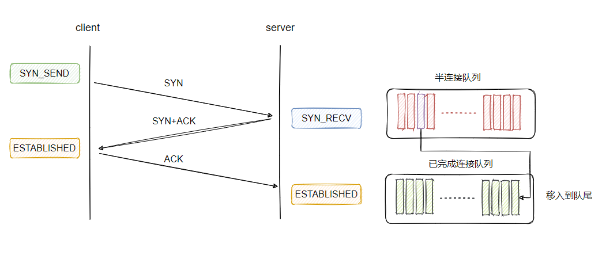
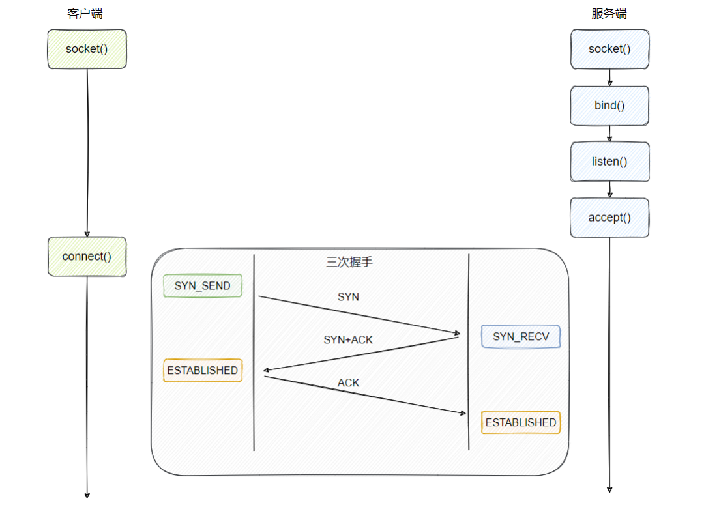
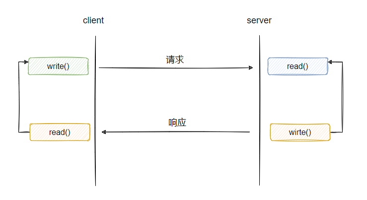

来源：[微信公众号：yes的练级攻略](https://mp.weixin.qq.com/s?__biz=MzkxNTE3NjQ3MA==&mid=2247493163&idx=1&sn=6e579a0433157c31beaa87e7defb26ac&chksm=c1618b52f61602449eb8212a4a6b54a025918fea2824c8235e2924a836c0759eea777cce7ce7&scene=178&cur_album_id=2126839054972354563#rd)

你好，我是yes。

最近打算输出 Netty 相关的文章，但要深入学习 Netty 这个底层通信框架，网络相关知识点不可或缺。所以我打算先写一些前置知识点，对齐一下认识，便于之后对 Netty 的理解。

我们应该都知道 socket（套接字），你可以认为我们的通信都要基于这个玩意，而常说的网络通信又分为 TCP 与 UDP 两种，下面我会以 TCP 通信为例来阐述下 socket 的通信流程。

不过在此之前，我先来说说什么叫 I/O。

# I/O到底是什么?

I/O 其实就是 input 和 output 的缩写，即输入/输出。

那输入输出啥呢？

比如我们用键盘来敲代码其实就是输入，那显示器显示图案就是输出，这其实就是 I/O。

而我们时常关心的磁盘 I/O 指的是硬盘和内存之间的输入输出。

读取本地文件的时候，要将磁盘的数据拷贝到内存中，修改本地文件的时候，需要把修改后的数据拷贝到磁盘中。

网络 I/O 指的是网卡与内存之间的输入输出。

当网络上的数据到来时，网卡需要将数据拷贝到内存中。当要发送数据给网络上的其他人时，需要将数据从内存拷贝到网卡里。

那为什么都要跟内存交互呢?

我们的指令最终是由 CPU 执行的，究其原因是 CPU 与内存交互的速度远高于 CPU 和这些外部设备直接交互的速度。

因此都是和内存交互，当然假设没有内存，让 CPU 直接和外部设备交互，那也算 I/O。

总结下：I/O 就是指内存与外部设备之间的交互（数据拷贝）。

好了，明确什么是 I/O 之后，让我们来揭一揭 socket 通信内幕~

# 过程

## 创建 socket

首先服务端需要先创建一个 socket。在 Linux 中一切都是文件，那么创建的 socket 也是文件，每个文件都有一个整型的文件描述符（fd）来指代这个文件。

```c
int socket(int domain, int type, int protocol);
```

- domain：这个参数用于选择通信的协议族，比如选择 IPv4 通信，还是 IPv6 通信等等
- type：选择套接字类型，可选字节流套接字、数据报套接字等等。
- protocol：指定使用的协议。

这个 protocol 通常可以设为 0 ，因为由前面两个参数可以推断出所要使用的协议。

比如`socket(AF_INET, SOCK_STREAM, 0);`，表明使用 IPv4 ，且使用字节流套接字，可以判断使用的协议为 TCP 协议。

这个方法的返回值为 int ，其实就是创建的 socket 的 fd。

## bind

现在我们已经创建了一个 socket，但现在还没有地址指向这个 socket。

众所周知，服务器应用需要指明 IP 和端口，这样客户端才好找上门来要服务，所以此时我们需要指定一个地址和端口来与这个 socket 绑定一下。

```c
int bind(int sockfd, const struct sockaddr *addr, socklen_t addrlen);
```

参数里的 sockfd 就是我们创建的 socket 的文件描述符，执行了 bind 参数之后我们的 socket 距离可以被访问又更近了一步。

## listen

执行了 socket、bind 之后，此时的 socket 还处于 closed 的状态，也就是不对外监听的，然后我们需要调用 listen 方法，让 socket 进入**被动监听状态**，这样的 socket 才能够监听到客户端的连接请求。

```c
int listen(int sockfd, int backlog);
```

传入创建的 socket 的 fd，并且指明一下 backlog 的大小。

这个 backlog 我查阅资料的时候，看到了三种解释：

1. socket 有一个队列，同时存放已完成的连接和半连接，backlog为这个队列的大小。
2. socket 有两个队列，分别为已完成的连接队列和半连接队列，backlog为这个两个队列的大小之和。
3. socket 有两个队列，分别为已完成的连接队列和半连接队列，backlog仅为已完成的连接队列大小。

> 解释下什么叫半连接

我们都知道 TCP 建立连接需要三次握手，当接收方收到请求方的建连请求后会返回 ack，此时这个连接在接收方就处于半连接状态，当接收方再收到请求方的 ack 时，这个连接就处于已完成状态：


所以上面讨论的就是这两种状态的连接的存放问题。

我查阅资料看到，基于 BSD 派生的系统的实现是使用的一个队列来同时存放这两种状态的连接， backlog 参数即为这个队列的大小。

而 Linux 则使用两个队列分别存储已完成连接和半连接，**且 backlog 仅为已完成连接的队列大小**

## accept

现在我们已经初始化好监听套接字了，此时会有客户端连上来，然后我们需要处理这些已经完成建连的连接。

从上面的分析我们可以得知，三次握手完成后的连接会被加入到已完成连接队列中去。



这时候，我们就需要从已完成连接队列中拿到连接进行处理，这个拿取动作就由 accpet 来完成。

```c
int accept(int sockfd, struct sockaddr *addr, socklen_t *addrlen);
```

这个方法返回的 int 值就是拿到的已完成连接的 socket 的文件描述符，之后操作这个 socket 就可以进行通信了。

如果已完成连接队列没有连接可以取，那么调用 accept 的线程会阻塞等待。

> 至此服务端的通信流程暂告一段落，我们再看看客户端的操作。


## connect

客户端也需要创建一个 socket，也就是调用 `socket()`，这里就不赘述了，我们直接开始建连操作。

客户端需要与服务端建立连接，在 TCP 协议下开始经典的三次握手操作，再看一下上面画的图：


客户端创建完 socket 并调用 `connect` 之后，连接就处于 `SYN_SEND` 状态，当收到服务端的 `SYN+ACK` 之后，连接就变为 `ESTABLISHED` 状态，此时就代表三次握手完毕。

```c
int connect(int sockfd, const struct sockaddr *addr, socklen_t addrlen);
```

调用`connect`需要指定远程的地址和端口进行建连，三次握手完毕之后就可以开始通信了。

客户端这边不需要调用 bind 操作，默认会选择源 IP 和随机端口。

用一幅图来小结一下建连的操作：



可以看到这里的两个阻塞点：

- connect：需要阻塞等待三次握手的完成。
- accept：需要等待可用的已完成的连接，如果已完成连接队列为空，则被阻塞。

## read、write

连接建立成功之后，就能开始发送和接收消息了，我们来看一下

read 为读数据，从服务端来看就是等待客户端的请求，如果客户端不发请求，那么调用 read 会处于阻塞等待状态，没有数据可以读，这个应该很好理解。

write 为写数据，一般而言服务端接受客户端的请求之后，会进行一些逻辑处理，然后再把结果返回给客户端，这个写入也可能会被阻塞。

这里可能有人就会问 read 读不到数据阻塞等待可以理解，write 为什么还要阻塞，有数据不就直接发了吗？

因为我们用的是 TCP 协议，TCP 协议需要保证数据可靠地、有序地传输，并且给予端与端之间的流量控制。

所以说发送不是直接发出去，它有个发送缓冲区，我们需要把数据先拷贝到 TCP 的发送缓冲区，由 TCP 自行控制发送的时间和逻辑，有可能还有重传什么的。

如果我们发的过快，导致接收方处理不过来，那么接收方就会通过 TCP 协议告知：别发了！忙不过来了。发送缓存区是有大小限制的，由于无法发送，还不断调用 write 那么缓存区就满了，满了就不然你 write 了，所以 write 也会发生阻塞。

综上，read 和 write 都会发生阻塞。

# 最后

> 为什么网络 I/O 会被阻塞？

因为建连和通信涉及到的 accept、connect、read、write 这几个方法都可能会发生阻塞。

阻塞会占用当前执行的线程，使之不能进行其他操作，并且频繁阻塞唤醒切换上下文也会导致性能的下降。

由于阻塞的缘故，起初的解决的方案就是建立多个线程，但是随着互联网的发展，用户激增，连接数也随着激增，需要建立的线程数也随着一起增加，到后来就产生了 C10K 问题。

服务端顶不住了呀，咋办？

优化呗！

所以后来就弄了个非阻塞套接字，然后 I/O多路复用、信号驱动I/O、异步I/O。

下篇我们就来好好盘盘，这几种 I/O 模型！

参考：

*https://blog.csdn.net/yangbodong22011/article/details/60399728*