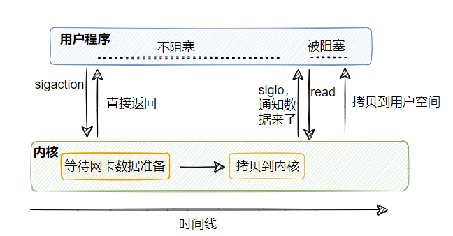
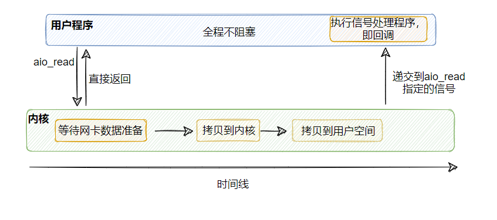

上篇我们已经搞懂了 socket 的通信内幕，也明白了网络 I/O 确实会有很多阻塞点，阻塞 I/O 随着用户数的增长只能利用增加线程的方式来处理更多的请求，而线程不仅会占用内存资源且太多的线程竞争会导致频繁地上下文切换产生巨大的开销。

因此，阻塞 I/O 已经不能满足需求，所以后面大佬们不断地优化和演进，提出了多种 I/O 模型。

在 UNIX 系统下，一共有五种 I/O 模型，今天我们就来盘一盘它！

不过在介绍 I/O 模型之前，我们需要先了解一下前置知识。

# 内核态和用户态

我们的电脑可能同时运行着非常多的程序，这些程序分别来自不同公司。

谁也不知道在电脑上跑着的某个程序会不会发疯似得做一些奇怪的操作，比如定时把内存清空了。

因此 CPU 划分了非特权指令和特权指令，做了权限控制，一些危险的指令不会开放给普通程序，只会开放给操作系统等特权程序。

你可以理解为我们的代码调用不了那些可能会产生“危险”操作，而操作系统的内核代码可以调用。

这些“危险”的操作指：内存的分配回收，磁盘文件读写，网络数据读写等等。

如果我们想要执行这些操作，只能调用操作系统开放出来的 API ，也称为系统调用。

这就好比我们去行政大厅办事，那些敏感的操作都由官方人员帮我们处理（系统调用），所以道理都是一样的，目的都是为了防止我们(普通程序)乱来。

这里又有两个名词：

- 用户空间
- 内核空间。

我们普通程序的代码是跑在用户空间上的，而操作系统的代码跑在内核空间上，**用户空间无法直接访问内核空间**的。当一个进程运行在用户空间时就处于用户态，运行在内核空间时就处于内核态。

当处于用户空间的程序进行系统调用，也就是调用操作系统内核提供的 API 时，就会进行上下文的切换，切换到内核态中，也时常称之为陷入内核态。

那为什么开头要先介绍这个知识点呢？

因为当程序请求获取网络数据的时候，需要经历两次拷贝：

- 程序需要等待数据从网卡拷贝到内核空间。
- 因为用户程序无法访问内核空间，所以内核又得把数据拷贝到用户空间，这样处于用户空间的程序才能访问这个数据。

介绍这么多就是让你理解为什么会有两次拷贝，且系统调用是有开销的，因此最好不要频繁调用。

然后我们今天说的 I/O 模型之间的差距就是这拷贝的实现有所不同！

今天我们就以 read 调用，即读取网络数据为例子来展开 I/O 模型。

发车！

# 同步阻塞 I/O

当用户程序的线程调用 read 获取网络数据的时候，首先这个数据得有，也就是网卡得先收到客户端的数据，然后这个数据有了之后需要拷贝到内核中，然后再被拷贝到用户空间内，这整一个过程用户线程都是被阻塞的。

假设没有客户端发数据过来，那么这个用户线程就会一直阻塞等着，直到有数据。即使有数据，那么两次拷贝的过程也得阻塞等着。

所以这称为同步阻塞 I/O 模型。

它的优点很明显，简单。调用 read 之后就不管了，直到数据来了且准备好了进行处理即可。

缺点也很明显，**一个线程对应一个连接**，一直被霸占着，即使网卡没有数据到来，也同步阻塞等着。

我们都知道线程是属于比较重资源，这就有点浪费了。

所以我们不想让它这样傻等着。

于是就有了同步非阻塞 I/O。

# 同步非阻塞 I/O

从图中我们可以很清晰的看到，同步非阻塞I/O 基于同步阻塞I/O 进行了优化：

在没数据的时候可以不再傻傻地阻塞等着，而是直接返回错误，告知暂无准备就绪的数据！

这里要注意，**从内核拷贝到用户空间这一步，用户线程还是会被阻塞的**。

这个模型相比于同步阻塞 I/O 而言比较灵活，比如调用 read 如果暂无数据，则线程可以先去干干别的事情，然后再来继续调用 read 看看有没有数据。

但是如果你的线程就是取数据然后处理数据，不干别的逻辑，那这个模型又有点问题了。

等于你不断地进行系统调用，如果你的服务器需要处理海量的连接，那么就需要有海量的线程不断调用，上下文切换频繁，CPU 也会忙死，做无用功而忙死。

那怎么办？

于是就有了I/O 多路复用。

# I/O 多路复用

从图上来看，好像和上面的同步非阻塞 I/O 差不多啊，其实不太一样，**线程模型不一样**。

既然同步非阻塞 I/O 在太多的连接下频繁调用太浪费了， 那就招个专员吧。

这个专员工作就是管理多个连接，帮忙查看连接上是否有数据已准备就绪。

也就是说，**可以只用一个线程查看多个连接是否有数据已准备就绪**。

具体到代码上，这个专员就是  select ，我们可以往 select 注册需要被监听的连接，由 select 来监控它所管理的连接是否有数据已就绪，如果有则**可以**通知别的线程来 read 读取数据，**这个 read 和之前的一样，还是会阻塞用户线**程。

这样一来就可以**用少量的线程去监控多条连接**，减少了线程的数量，降低了内存的消耗且减少了上下文切换的次数，很舒服。

想必到此你已经理解了什么叫 I/O 多路复用。

所谓的多路指的是多条连接，复用指的是用一个线程就可以监控这么多条连接。

看到这，你再想想，还有什么地方可以优化的？

# 信号驱动式I/O

上面的 select 虽然不阻塞了，但是他得时刻去查询看看是否有数据已经准备就绪，那是不是可以让内核告诉我们数据到了而不是我们去轮询呢？

信号驱动 I/O 就能实现这个功能，由内核告知数据已准备就绪，然后用户线程再去 read（还是会阻塞）。

听起来是不是比 I/O 多路复用好呀？那为什么好像很少听到信号驱动 I/O？

> 为什么市面上用的都是 I/O 多路复用而不是信号驱动?

因为我们的应用通常用的都是 TCP 协议，而 TCP 协议的 socket 可以产生信号事件有七种。

也就是说不仅仅只有数据准备就绪才会发信号，其他事件也会发信号，而这个信号又是同一个信号，所以我们的应用程序无从区分到底是什么事件产生的这个信号。

那就麻了呀！

所以我们的应用基本上用不了信号驱动 I/O，但如果你的应用程序用的是 UDP 协议，那是可以的，因为 UDP 没这么多事件。

因此，这么一看对我们而言信号驱动 I/O 也不太行。

# 异步 I/O

信号驱动 I/O 虽然对 TCP 不太友好，但是这个思路对的：**往异步发展**，但是它并没有完全异步，因为其后面那段 read 还是会阻塞用户线程，所以它算是半异步。

因此，我们得想下如何弄成全异步的，也就是把 read 那步阻塞也省了。

其实思路很清晰：让内核直接把数据拷贝到用户空间之后再告知用户线程，来实现真正的非阻塞I/O！

所以异步 I/O 其实就是用户线程调用 `aio_read` ，然后包括将数据从内核拷贝到用户空间那步，所有操作都由内核完成，当内核操作完毕之后，再调用之前设置的回调，此时用户线程就拿着已经拷贝到用户控件的数据可以继续执行后续操作。

在整个过程中，用户线程没有任何阻塞点，**这才是真正的非阻塞I/O**。

那么问题又来了:

> 为什么常用的还是I/O多路复用，而不是异步I/O？

因为 Linux 对异步 I/O 的支持不足，你可以认为还未完全实现，所以用不了异步 I/O。

这里可能有人会说不对呀，像 Tomcat 都实现了 AIO的实现类，其实像这些组件或者你使用的一些类库看起来支持了 AIO(异步I/O)，**实际上底层实现是用 epoll 模拟实现的**。

而 Windows 是实现了真正的 AIO，不过我们的服务器一般都是部署在 Linux 上的，所以主流还是 I/O 多路复用。

# 最后

至此，想必你已经清晰五种 I/O 模型是如何演进的了。

下篇，我将讲讲谈到网络 I/O 经常会伴随的几个容易令人混淆的概念：同步、异步、阻塞、非阻塞。

参考：

- *https://time.geekbang.org/column/article/100307*
- *https://zhuanlan.zhihu.com/p/266950886*