上篇，我们从自身出发，思考如何实现一款网络通信框架，大致讲解了必要的功能和需实现的组件，以及介绍了 Netty 的一些优点。

这篇我们深入一下 Netty 的整体架构，做到从高处俯瞰 Netty。

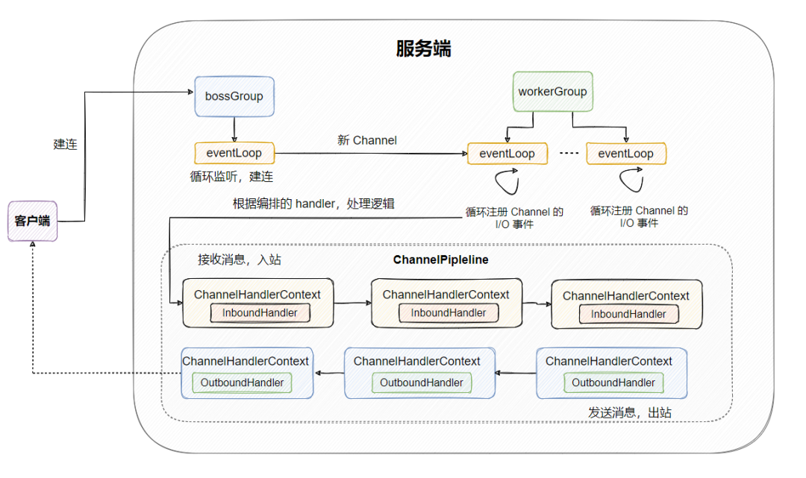

上图现在看不懂没事，我们慢慢盘，这篇稍稍长了点，不过看完应该对 Netty 整体架构会有个清晰的认识~

话不多说，发车！

# 从官网的一张图入手

但也只有一张图，官网没有对这张图做任何说明，但咱们来盘一盘这张图。

显而易见，这张图把 Netty 切割成了三部分：core、transport services、protocol support。

- core：核心，**实际上就是提供了一些底层通用实现来供上层使用**，从图中可以看出包含的核心有可扩展事件模型、通用通信 API、可零拷贝的 buffer。

- transport services：传输服务，表明 Netty 支持多种传输方式，例如 TCP 和 UDP 、HTTP隧道、虚拟机管道。我们可以很方便的切换各种传输方式，因为 Netty 都支持了。
- protocol support：协议的支持，从图中可以看到 Netty 支持了非常多常见的协议，例如 HTTP、WebSocket、SSL、Google Protobuf(它其实是个编解码协议...放在这怎么说呢，个人觉得不太合适) 等等。可以说开箱即用，不必自行实现，当然，如果你想实现自定义协议，也是很方便的。

总体而言，这幅图想要表现的只是大致的分层，或者可以认为是代码分层，我们来看下大致的包结构，大家先有个大体印象就行：

### core：

core 层大致包含以下这几个包：

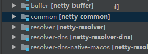

- buffer：这个包主要就是实现了 Netty 自定义的 ByteBuf，因为 Java  ByteBuffer 的 API 太难用了， 并且还有很多优化的余地，所以 Nettty 就实现了个 ByteBuf 替换之。
- common：就是一些通用的工具类，像我以前分析过的 Netty 时间轮，FastThreadLocal 就在 core 里面。
- resolver：从名字就可以得出，解析用的， 解析主机名、IP地址、DNS 等。

### transport services：

这层大致包含以下这几个包：

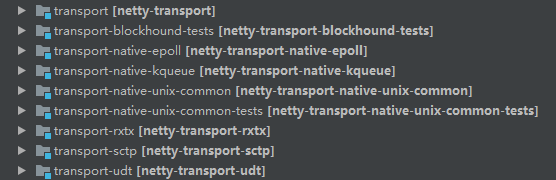主要的功能就是处理和传输数据了，如果对 Netty 稍稍有了解的同学应该很熟悉，Bootstrap、Channel、ChannelHandler、ChannelPipeline 、EvenLoop 等都在这里面，这都是一些很核心的类，下面会分析。

### protocol support：

这其实没啥好说的，就是 Netty 针对各种协议实现了对应的支持，尽量做到开箱即用。

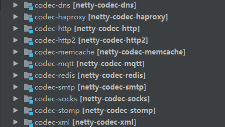从图中我们可以看到，连 memcache、redis 这类都支持了，啧啧，可以的。

至此，我们对 Netty 已经有了大体上的了解，我们来继续深入。

# 从主线入手看清整体架构

我们从**服务端的角度来**看整体架构。

主线无非就是先启动服务，监听某个端口，接收到客户端的建连，然后持续监听连接上的请求，但凡有请求过来，则解码、解析，并根据请求数据的不同进行不同的逻辑或业务处理，然后将响应返回给客户端，当然到最后还有个关闭。

我们沿着主线，详细的看一下。

在服务端这边是一个叫 ServerBootstrap 的引导类来启动 Netty，初始化一些组件。

先简单的来看下代码，我们来一个一个分析下：

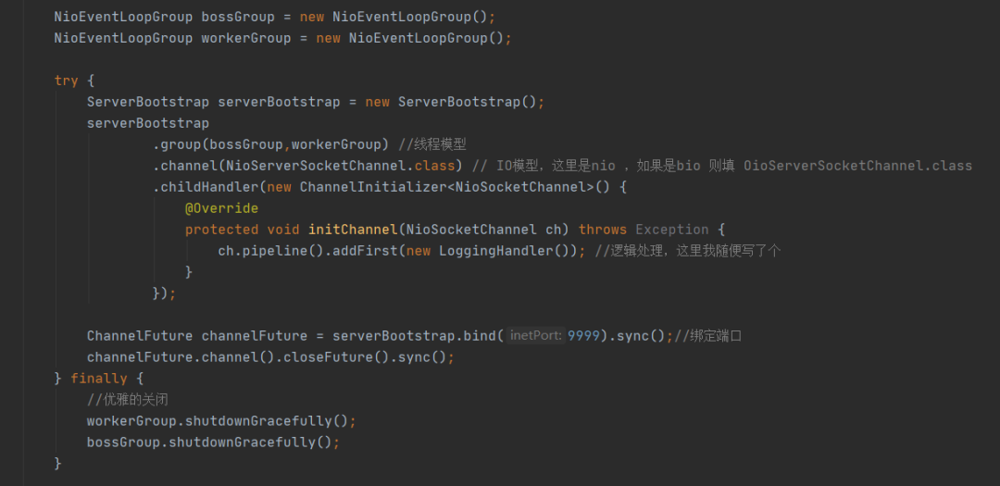启动时，一般有四个核心地方需要配置，分别为：**线程模型、I/O 模型、读写逻辑(handler)、绑定端口**。

线程模型可以配置两个线程组，分为：bossGroup 和 workerGroup。

bossGroup 用来接入新的连接，然后将接待完的新连接分配给 workerGroup，之后这个连接上的交互都由 workerGroup 接待。

从 boss 和 worker 这两个单词来看，形象的理解就是老板在外面接活，接到活之后分配给下属去干，后面就不管了。

当然这里也可以只配置一个线程组，让老板即接活又干活，这都是可配置的。还能配置线程组的线程数，就是规定几个人来干活啦。

接着，还需要给设置 NIO 模型，这也是 Netty 灵活的地方，如果你想要替换 I/O 模型，只需要在 ServerBootstrap 修改下配置即可，比如上面我们配置的 channel 就是 `NioServerSocketChannel.class`，就是非阻塞 I/O，如果你想配置 BIO，则改为 `OioServerSocketChannel.class` 即可（关于 I/O 模型我之前文章写得很详细了，这里不再赘述）。

> 小贴士：这个 channel 是 Netty 自己实现的，屏蔽了底层 socket 接口的复杂性，提供更高维度的抽象，像网络 I/O 的操作直接操控 channel 即可。

现在看看，老板有了，员工也有了，和客户连接的通道(Channel)也有了，现在就是要干活了呀！跟客户的对接会有事件发生，比如客户读数据、客户写数据等等，这时候得就员工根据事件去招待客户，那具体如何招待？哪些事件对应哪些操作？

这就是调用 childHandler() 方法做的，创建一个 ChannelInitializer，然后在其中可以加入各种 ChannelHandler，这些个 Handler 就是招待客户事件的逻辑实现，Netty 可以让你灵活的组装各种 ChannelHandler 来满足不同的需求。

在我们具体看 Netty 是如何处理这些事件编排之前，我们先来看下 Channel、EventLoop、EventLoopGroup 的关系。

首先 EventLoopGroup 其实就是一个线程池。从上面我们看到，我们会创建一个 bossGroup ，一般而言我们只会给 bossGroup 配置一个线程用来处理新连接的建连，此时线程池里面只有一个 EventLoop，对应的就是一个线程，而 workerGroup 往往是多个线程，用来处理已经建立完的连接。

> 小贴士：bossGroup 你设置多个线程也没用，一般就只暴露出一个端口给客户端连接，所以也只会有一个线程监听那个端口等待 accpet 。

EventLoop 从名字来看，就是 loop event，中文就是循环事件，字面来看就是不断的看看 Channel 上有没有什么事件发生，有的话就处理。

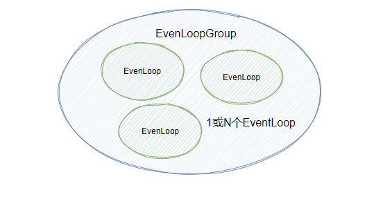

也就是说 bossGroup 会处理建连的请求，为新连接生成一个子 Channel，将其注册到 workerGroup 中的其中一个 EventLoop，于是这个 Channel 的整个生命周期都由这个 EventLoop 来处理，这个 EventLoop 会不断地循环此 Channel 是否有事件发生，有则处理之。

而一个 EventLoop 只会与一个线程绑定，所以是线程安全的。不过，一个 EventLoop 可以与多个 Channel 绑定（咱们员工可都是得一个人对接多客户的）

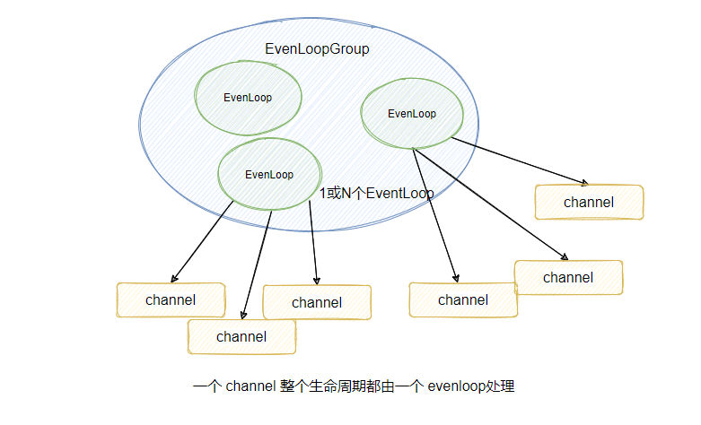

小结下关系：

- 一个 Channel 对应一个连接
- 一个 Channel 只会分配给一个 EvenLoop
- 一个 EvenLoop 只会绑定一个线程
- 一个 EvenLoopGroup 包含一个或多个 EvenLoop

现在把客户和干活的员工搞清楚了，接下来再来员工是怎么干活的。

也就是来看看 ChannelHandler 、ChannelPipeline、ChannelHandlerContext 的关系。

由于不同公司处理的客户业务不同，所以我们需要把业务剥离出来，让公司可以自行组装来让员工干活，与之对应的是将业务抽象成一个个 ChannelHandler ，由使用者自行编排，由一个叫 ChannelPipeline 的玩意将编排的 ChannelHandler 串联起来。

届时，只要事件一来，直接遍历 ChannelPipeline ，逐个调用对应的 ChannelHandler 来进行事件的处理，这样不动的就是框架的行为：“逐个执行对应的 ChannelHandler ”，变的就是由用户自行实现和编排顺序的 ChannelHandler，这就是**框架与业务隔离**，十分灵活，也就是责任链模式。

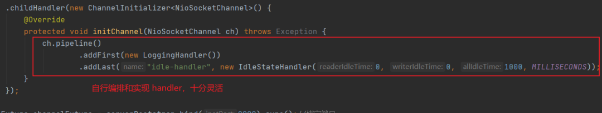不过实际上 ChannelPipeline 是一个双向链表，并且链的也不是 ChannelHandler ，而是 ChannelHandlerContext ，而 ChannelHandlerContext 里面包了个 ChannelHandler 。

看到这有人不禁发问，怎么多了个 ChannelHandlerContext ？

其实从名字来看就知道它是保存了 ChannelHandler 的上下文，并且把很多通用的逻辑抽象出来放在 ChannelHandlerContext ，这样就不用在每个 ChannelHandler 都实现那些同样的代码。

至于 ChannelPipeline 双向链表是因为 ChannelHandler 分为入站和出站两种类型，称为ChannelInboundHandler 和 ChannelOutboundHandler 。

入站是指接收到远程消息，出站指发送给远程消息，分两种类型分别实现不同的处理逻辑，比如入站需要解码，出站则需要编码等等，当然一个 hander 也可以同时是出站和入站的类型。

来看下图：

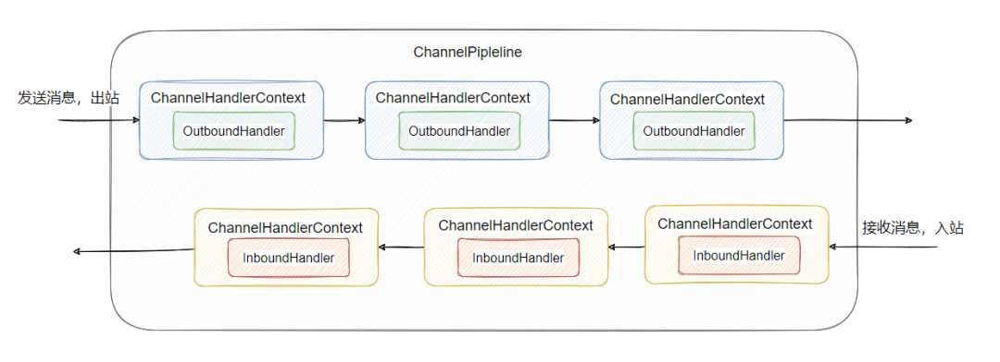

至此，对 ChannelHandler 、ChannelPipeline、ChannelHandlerContext 三者的关系应该清晰了。还有一点得提一下，**每新建一个 Channel，对应的都会 new 一个 ChannelPipeline 和它绑定**。

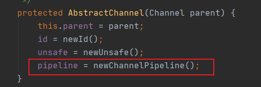

但是 ChannelPipeline 内的 ChannelHandler 有可能被多个 channel 共享使用的，也能是每个 channel 独享的。

像下面这个配置，就是每个 channel 独享，因为每次都会重新 new 新的 ChannelHandler 。

像下面这个配置，就是每个 channel 独享，因为每次都会重新 new 新的 ChannelHandler 。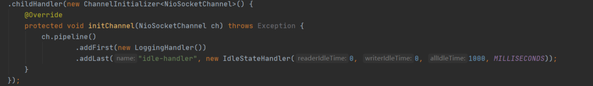但是如果我把 LoggingHandler 提到上面先实例化，然后传入的是实例，这里等于每个 channel 都共用这一个实例。

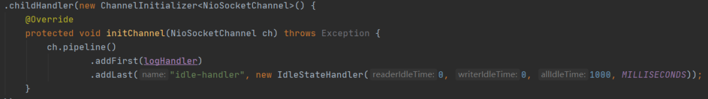其实对于 LoggingHandler 应该是这样做的，因为类上有个注解 `@Sharable`

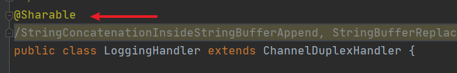

说明它是允许多个 channel 共享的，没有线程安全问题，可以放心使用，因此如果自定义的 handler 是线程安全的，则可以标记这个注解来表明。如果 Netty 提供的 handler 没标注这个注解，则需要加入 pipline 的时候 new 一波，比如 `IdleStateHandler` 就没有被标注。

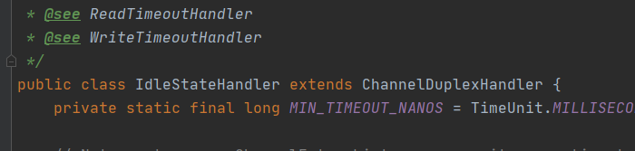

### 小结一下：

- 每个 channel 对应会有一个 ChannelPipeline
- ChannelPipeline 内部会有多个 ChannelHandler ，且分为入站和出站两大类
- channel 产生事件后，会根据事件类型在 ChannelPipeline 链接的 ChannelHandler 间传递处理，出站的消息在 outboundHandler 间处理传递，入站的消息在 inboundHandler 间处理传递
- ChannelHandler 可被 channel  独享，也可被共享，具体可以看 `@Sharable` 注解，如果自定义实现的 handler多线程间线程安全，则记得标注 `@Sharable` 注解
- 一个 channel 对应一个 eventLoop，一个 eventLoop 绑定一个线程，而一个 channel 又对应一个 ChannelPipeline ，所以 ChannelPipeline 线程安全，而 ChannelHandler 可能会被多线程共享

### 所以服务端的主线就是：

配置 bossGroup 和 workerGroup 两个线程组(也可以一个线程组)，分别处理建连和 channel 的 I/O 事件，建连生成的 channel 会分配给 workerGroup 中的某个 eventLoop，由这个 eventLoop 来处理此 channel 的发生的所有事件。

具体的处理逻辑被封装成一个个 ChannelHandler ，又划分了入站 ChannelHandler  和出站 ChannelHandler 两个类型，它们会串成链表形成一个 ChannelPipeline 。

每个 Channel 独享一个 ChannelPipeline ，待有 I/O 事件发生，则会顺着 ChannelPipeline 里面的 ChannelHandler 一步步的执行业务逻辑处理请求，执行者就是与之绑定的 eventLoop，一个 eventLoop 对应一个线程。

再来回顾下一开始的图，咱们总结来看一遍：

# 最后

上面只是说了一些相对而言核心的点，其实 ServerBootstrap  还有很多配置，比如 option、childOption 等等，这些后面的文章再详谈。

至于绑定端口、关闭这类就不提了，上面的核心逻辑吃完，后面再写。