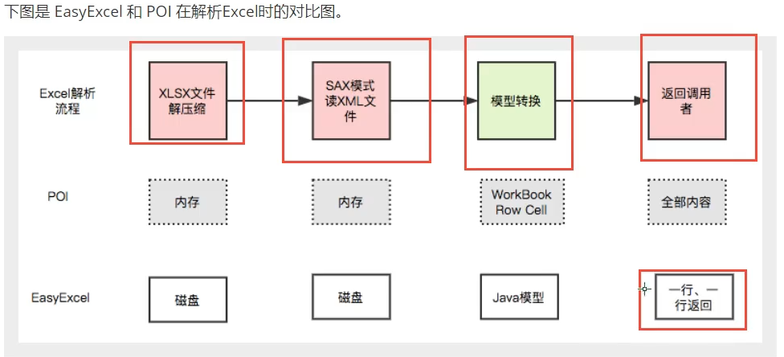
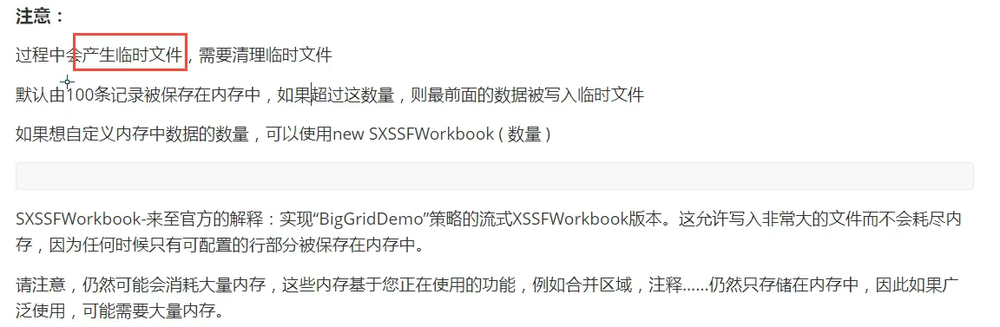

# 概述

excel读写,和IO一样

第三方组件和工具

应用场景

1.将用户信息导出为excel表格

2.将excel表中信息录入网站数据库

Apache POI和阿里巴巴的easyExcel

http://poi.apache.org/

## POI

功能  会比较麻烦  OOM

HSSF － 提供读写Microsoft Excel格式档案的功能。
XSSF － 提供读写Microsoft Excel OOXML格式档案的功能。
HWPF － 提供读写Microsoft Word格式档案的功能。
HSLF － 提供读写Microsoft PowerPoint格式档案的功能。
HDGF － 提供读写Microsoft Visio格式档案的功能。

耗内存 ,先将数据加载到内存

## easyExcel

https://www.yuque.com/easyexcel/doc/easyexcel

https://www.yuque.com/easyexcel/doc/quickstart



# POI-Excel写

excel分为03版和07版

**03版**

- 后缀名xls   

- 会多有65536行
- HSSF

**07版**

- 后缀名xlsx  

- 没有限制
- XSSF

**对象**

1.工作簿

2.工作表

3.行

4.列

```java
package com.hang;

import org.apache.poi.hssf.usermodel.HSSFWorkbook;
import org.apache.poi.ss.usermodel.Cell;
import org.apache.poi.ss.usermodel.Row;
import org.apache.poi.ss.usermodel.Sheet;
import org.apache.poi.ss.usermodel.Workbook;
import org.apache.poi.xssf.usermodel.XSSFWorkbook;
import org.joda.time.DateTime;
import org.junit.Test;

import java.io.FileNotFoundException;
import java.io.FileOutputStream;
import java.io.IOException;

public class ExcelWriteTest {
    String PATH = "F:\\ShangGuiGuJavaEE\\WorkspaceIDEA\\excel\\poi";
    @Test
    public void test1() throws IOException {
        //1.创建一个工作簿
        Workbook workbook = new HSSFWorkbook();//03版本
        //2.工作表
        Sheet sheet =workbook.createSheet("观众统计表");
        //3.创建行
        Row row1 = sheet.createRow(0);
        //4.创建一个单元格
        Cell cell11 = row1.createCell(0);//(A1单元格)
        cell11.setCellValue("今日新增");

        Cell cell2 = row1.createCell(1);//(A2单元格)
        cell2.setCellValue(666);

        //第二行
        Row row2 = sheet.createRow(1);
        Cell cell21 = row2.createCell(0);//(B1单元格)
        cell21.setCellValue("统计时间");

        Cell cell22 = row2.createCell(1);//(B2单元格)
        cell22.setCellValue(new DateTime().toString("yyyy-MM-dd HH:mm:ss"));

        //生成一张表 IO流
        FileOutputStream fileOutputStream = new FileOutputStream(PATH + "观众统计表03.xls");
        //输出
        workbook.write(fileOutputStream);
        //关闭流
        fileOutputStream.close();
        System.out.println("03生成完毕");

    }

    @Test
    public void test2() throws IOException {
        //1.创建一个工作簿
        Workbook workbook = new XSSFWorkbook();//07版本
        //2.工作表
        Sheet sheet =workbook.createSheet("观众统计表");
        //3.创建行
        Row row1 = sheet.createRow(0);
        //4.创建一个单元格
        Cell cell11 = row1.createCell(0);//(A1单元格)
        cell11.setCellValue("今日新增");

        Cell cell2 = row1.createCell(1);//(A2单元格)
        cell2.setCellValue(666);

        //第二行
        Row row2 = sheet.createRow(1);
        Cell cell21 = row2.createCell(0);//(B1单元格)
        cell21.setCellValue("统计时间");

        Cell cell22 = row2.createCell(1);//(B2单元格)
        cell22.setCellValue(new DateTime().toString("yyyy-MM-dd HH:mm:ss"));

        //生成一张表 IO流
        FileOutputStream fileOutputStream = new FileOutputStream(PATH + "观众统计表07.xlsx");
        //输出
        workbook.write(fileOutputStream);
        //关闭流
        fileOutputStream.close();
        System.out.println("07生成完毕");

    }
}

```

## 数据批量写

### HSSF

最多65536行 速度快

产生的xls文件较大 12.7MB 65536条数据

```java
@Test
    public void test03BigData() throws IOException{
        //时间
        long begin = System.currentTimeMillis();
        //工作簿
        Workbook workbook = new HSSFWorkbook();
        //表
        Sheet sheet =workbook.createSheet();
        //写入数据
        for (int rowNum = 0; rowNum <65536 ; rowNum++) {
            Row row = sheet.createRow(rowNum);
            for (int cellNum = 0; cellNum <10 ; cellNum++){
                Cell cell = row.createCell(cellNum);
                cell.setCellValue(cellNum);
            }
        }
        System.out.println("over");
        FileOutputStream fileOutputStream = new FileOutputStream(PATH + "test03BigData.xls");
        workbook.write(fileOutputStream);
        fileOutputStream.close();
        long end = System.currentTimeMillis();
        System.out.println((double) (end-begin)/1000);//1.43
    }
```


### XSSF

速度慢,占用内存大

xlsx文件较小2.57MB 10万条数据

```java
@Test
    public void test07BigData() throws IOException{
        //时间
        long begin = System.currentTimeMillis();
        //工作簿
        Workbook workbook = new XSSFWorkbook();
        //表
        Sheet sheet =workbook.createSheet();
        //写入数据
        for (int rowNum = 0; rowNum <100000; rowNum++) {
            Row row = sheet.createRow(rowNum);
            for (int cellNum = 0; cellNum <10 ; cellNum++){
                Cell cell = row.createCell(cellNum);
                cell.setCellValue(cellNum);
            }
        }
        System.out.println("over");
        FileOutputStream fileOutputStream = new FileOutputStream(PATH + "test07BigData.xlsx");
        workbook.write(fileOutputStream);
        fileOutputStream.close();
        long end = System.currentTimeMillis();
        System.out.println((double) (end-begin)/1000);//11.329
    }
```

### SXSSF

优点:可以写非常大的数据量,如100万条或更多,写数据速度更快,占用更少内存

注意



# POI-Excel读

## 03

```java
    @Test
    public void testRead03() throws IOException {
        //获取文件流
        FileInputStream fileInputStream = new FileInputStream(PATH+"poi观众统计表03.xls");
        //1.创建一个工作簿.使用excel能操作的这边他都可以操作
        Workbook workbook = new HSSFWorkbook(fileInputStream);
        Sheet sheet = workbook.getSheetAt(0);//拿第0个表
        Row row = sheet.getRow(0);
        Cell cell = row.getCell(1);
//        System.out.println(cell.getStringCellValue());//获取字符串类型
        System.out.println(cell.getNumericCellValue());//获取数字类型
        fileInputStream.close();

    }
```

## 07

```java
@Test
    public void testRead07() throws IOException {
        //获取文件流
        FileInputStream fileInputStream = new FileInputStream(PATH+"poi观众统计表07.xlsx");
        //1.创建一个工作簿.使用excel能操作的这边他都可以操作
        Workbook workbook = new XSSFWorkbook(fileInputStream);
        Sheet sheet = workbook.getSheetAt(0);//拿第0个表
        Row row = sheet.getRow(0);
        Cell cell = row.getCell(1);
//        System.out.println(cell.getStringCellValue());//获取字符串类型
        System.out.println(cell.getNumericCellValue());//获取数字类型
        fileInputStream.close();

    }
```

## 读取不同的数据类型