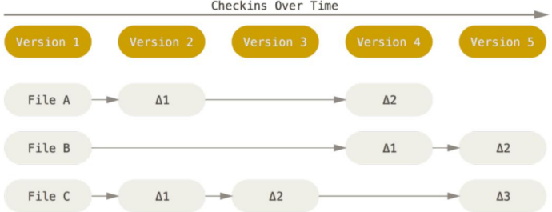

# 1.版本控制

安装Git到windows,下一步--下一步...

**托管中心**`维护远程库`

- **内网：可以自己搭建一个GitLab服务器**
- **外网：可以使用码云、Github**

**版本控制工具**

- **集中式**：CSV ,**SVN**,VSS
- **分布式**：**Git**，Darcs,...

团队内协作：


跨团队协作：


# 2.Git命令行操作

兼容Linux命令

## 2.1 本地库初始化

- 命令：git init
- 效果：


注意：.git目录中存放的是本地库相关的子目录和文件，不要删除，也不要胡乱修改

## 2.2 设置签名

- 形式
  - 用户名：tom
  - Email地址：goodMorning@qq.com（可以随便写）
- 作用
  - 区分不用开发人员的身份
- 辨析：
  - 这里设置的签名和登陆远程库（代码托管中心）的账号、密码没有任何关系
- 命令
  - 项目级别/仓库级别：仅在当前本地库范围内有效
    - git config user.name tom_pro
    - git config user.email goodMorning_pro@qq.com
    - 信息保存位置：./.git/config文件
    - 
  - 系统用户级别：登录当前操作系统的用户范围，范围更大，默认的
    - git config --global user.name tom_pro
    - git config --global user.email goodMorning_pro@qq.com
    - 信息保存位置：
    - 
  - 优先级
    - 就近原则：项目级别优先于系统用户级别，二者都有时是采用项目级别的签名
    - 如果只有系统用户级别的前面，就以系统用户级别的签名为准
    - 二者都没有不允许

## 2.3 基本操作

### 2.3.1**状态查看**

- git status
- 查看工作区、暂存区状态

### 2.3.2**添加操作** 

- git add[file name]
- 将工作区的“新建/修改”添加到暂存区

### 2.3.3提交

- git commit -m "commit message" [file name]
- 将暂存区的内容提交到本地库

### 2.3.4查看历史记录

- git log
- 

- 多屏显示控制方式：
  - 空格向下翻页
  - b 向上翻页
  - q 退出
- git log --pretty=oneline
  - 
- git log --oneline
  - 
- git reflog 
  - HEAD@{移动到当前版本需要多少步}
  - 

### 2.3.5前进后退

- 本质 HEAD指针指向当前的版本

-  基于索引值操作[推荐]

  - git reset --hard [局部索引值]
  - git reset --hard 0aa7856 

- 使用^符号：只能后退

  - git reset --hard HEAD^ 
  -  注：一个^表示后退一步，n 个表示后退 n 步

- 使用~符号：只能后退
  - git reset --hard HEAD~n

  -  注：表示后退 n 步

### 2.3.6 reset 命令的三个参数对比

- --soft 参数  git reset --soft[指针位置]

  - 仅仅在本地库移动 HEAD 指针

- --mixed 参数

  - 在本地库移动 HEAD 指针
  - 重置暂存区

- --hard 参数

  -  在本地库移动 HEAD 指针

  -  重置暂存区

  - 重置工作区

### 2.3.7 删除文件并找回

- 删除： rm [文件名]

- 前提：删除前，文件存在时的状态提交到了本地库。
- 操作：git reset --hard [指针位置]
  - 删除操作已经提交到本地库：指针位置指向历史记录
  - 删除操作尚未提交到本地库：指针位置使用 HEAD

### 2.3.8 比较文件差异

- git diff [文件名]
  - 将**工作区**中的文件和**暂存区**进行比较
- git diff [本地库中历史版本] [文件名]
  - 将**工作区**中的文件和**本地库**历史记录比较
- 不带文件名比较多个文件

## 2.4 分支管理

### 2.4.1 **什么是分支？**

在版本控制过程中，使用多条线同时推进多个任务。


### 2.4.2分支的好处

- 同时并行推进多个功能开发，提高开发效率
- 各个分支在开发过程中，如果某一个分支开发失败，不会对其他分支有任何影响。失败的分支删除重新开始即可。

### 2.4.3分支操作

- 创建分支
  
- git branch [分支名]
  
- 查看分支
  
- git branch -v
  
- 切换分支
  
- git checkout [分支名]
  
- 合并分支

  - 第一步：切换到接受修改的分支（被合并，增加新内容）上

    git checkout [被合并分支名]

  - 第二步：执行 merge 命令

    git merge [有新内容分支名]

- 解决冲突

  - 冲突的表现

    - 

    - 冲突的解决

       第一步：编辑文件，删除特殊符号
       第二步：把文件修改到满意的程度，保存退出
       第三步：git add [文件名]
       第四步：git commit -m "日志信息"

       注意：此时 commit 一定不能带具体文件名

# 3.Git基本原理

## 3.1哈希

明文--->加密算法--->密文

哈希是一个系列的加密算法(签名算法)，各个不同的哈希算法虽然加密强度不同，但是有以下
几个共同点：
①不管输入数据的数据量有多大，输入同一个哈希算法，得到的**加密结果长度固定**。
②哈希算法确定，输入数据确定，输出数据能够保证不变
③哈希算法确定，输入数据有变化，输出数据一定有变化，而且通常变化很大
④哈希算法**不可逆**
Git 底层采用的是 **SHA-1** 算法。
哈希算法可以被用来验证文件。原理如下图所示：


Git 就是靠这种机制来从根本上保证数据完整性的。

## 3.2 **Git** **保存版本的机制**

### 3.2.1 **集中式版本控制工具的文件管理机制**

以文件变更列表的方式存储信息。这类系统将它们保存的信息看作是一组基本文件和每个文件随时间逐步累积的差异。



### 3.2.2  **Git** **的文件管理机制**

Git 把数据看作是小型文件系统的一组快照。每次提交更新时 Git 都会对当前
的全部文件制作一个快照并保存这个快照的索引。为了高效，如果文件没有修改，
Git 不再重新存储该文件，而是只保留一个链接指向之前存储的文件。所以 Git 的
工作方式可以称之为快照流。


### 3.2.3  **Git** **文件管理机制细节**
Git 的“提交对象”


提交对象及其父对象形成的链条


## 3.3  **Git** **分支管理机制**

### 3.3.1  **分支的创建**


### 3.3.2分支的切换


# 4.GitHub

## 4.1注册账号

GitHub 首页就是注册页面：https://github.com/

## 4.2github上创建远程库

## 4.3**创建远程库地址别名**

git remote -v 查看当前所有远程地址别名

git remote add [别名] [远程地址]


## 4.3推送

git push [别名] [分支名]


## 4.5克隆

- 命令

  - git clone[远程地址]

  - 

  - 效果

    - 完整的把远程库下载到本地

    -  创建 origin 远程地址别名

    - 初始化本地库

## 4.6**团队成员邀请**

github--Settings--Collaborators--输入用户名--Copy invite link

## 4.7**拉取**

 pull=fetch+merge

 git fetch [远程库地址别名] [远程分支名]

 git merge [远程库地址别名/远程分支名]

 git pull [远程库地址别名] [远程分支名]

## 4.8**解决冲突**

- 要点
  - 如果不是基于 GitHub 远程库的最新版所做的修改，不能推送，必须先拉取。
  - 拉取下来后如果进入冲突状态，则按照“分支冲突解决”操作解决即可。
- 类比
  - 债权人：老王
  - 债务人：小刘
  - 老王说：10 天后归还。小刘接受，双方达成一致。
  - 老王媳妇说：5 天后归还。小刘不能接受。老王媳妇需要找老王确认后再执行。

## 4.9 **跨团队协作**

- Fork
- 本地修改，然后推送到远程
- Pull Request
- 审核代码
- 合并代码 Merge pull request  
- Confirm merge
- 将远程库修改拉取到本地

## 4.10 SSH登录

- 进入当前用户的家目录
  - $ cd ~ 
- 删除.ssh 目录
  - $ rm -rvf .ssh
- 运行命令生成.ssh 密钥目录
  - $ ssh-keygen -t rsa -C atguigu2018ybuq@aliyun.com
  -  ssh-keygen -t rsa -C 2052298927@qq.com
  - [**注意：这里****-C** **这个参数是大写的** **C**]
- 进入.ssh 目录查看文件列表
  - $ cd .ssh
  - $ ls -lF
- 查看 id_rsa.pub 文件内容
  - $ cat id_rsa.pub

# 5. IDEA操作

## 5.1工程初始化为本地仓库


# 6.github和gitee仓库互相同步

github知名度很高但是访问速度很慢，

现状：已有gitee仓库，需要将其同步到github上，且后续提交代码需要同时往两个仓库里提交

操作如下。


前期步骤：github导入仓库，地址填上gitee仓库地址，gitee和github仓库名称建议相同

注意，可能会导入失败，但github仓库仍然会创建成功，这时可以在github仓库页面，找到如下按钮：


然后输入gitee仓库地址，再次进行导入

**先备份.git/config文件**

## 方式一：一个remote添加多个url

.git目录中的config文件

添加：url = https://github.com/Potato20522/java-study.git

其他的不要动

```
[core]
	repositoryformatversion = 0
	filemode = false
	bare = false
	logallrefupdates = true
	symlinks = false
	ignorecase = true
[remote "origin"]
	url = https://gitee.com/potato20522/java-study.git
	url = https://github.com/Potato20522/java-study.git
	fetch = +refs/heads/*:refs/remotes/origin/*
[branch "master"]
	remote = origin
	merge = refs/heads/master

```

结果：

只需要commit一次、push一次就行


注意：这种方式，在一般的git工具里，只会显示最后一条url：


但是用命令行就可以看到完整的：

```
E:\Gitee\java-study>git remote -v
origin  https://gitee.com/potato20522/java-study.git (fetch)
origin  https://gitee.com/potato20522/java-study.git (push)
origin  https://github.com/Potato20522/java-study.git (push)
```

### 排错

push到github时报错：  OpenSSL SSL_read: Connection was reset, errno 10054

只是网络原因造成的，推送失败了没关系，gitee会推送成功的，这里面没有事务回滚这一说

等网络好时，再push就行


### 方式一的命令行

```
git remote set-url --add 仓库B(名称) http://仓库A地址
```

查看远程仓库情况。可以看到 github 远程仓库有两个 push 地址。这种方法的好处是每次只需要 push 一次就行了。
git remote -v

## 方式二：多个remote

git仓库添加多个远程地址

可以通过命令行或者改./git/config配置文件的方式进行添加。这里IDEA中自带的git工具来改。

菜单栏选择Git，选择远程管理,刚打开是这样：


然后，写成这样


这样的话.git/config文件就变成这样：

```
[core]
	repositoryformatversion = 0
	filemode = false
	bare = false
	logallrefupdates = true
	symlinks = false
	ignorecase = true
[remote "gitee"]
	url = https://gitee.com/potato20522/java-study.git
	fetch = +refs/heads/*:refs/remotes/gitee/*
[branch "master"]
	remote = gitee
	merge = refs/heads/master
[remote "github"]
	url = https://github.com/Potato20522/java-study.git
	fetch = +refs/heads/*:refs/remotes/github/*
```

可以看到，branch一次只能指向一个remote，需要手动切换remote，比较繁琐

### 方式二的命令行

```
git remote add 仓库 A https:///项目A仓库的地址`
`git remote add 仓库 B https:///项目B仓库的地址
```

(仓库 A,B 的名字可以自己起,用来区分哪个远程仓库)，比如

```
git remote add gitee https://gitee.com/potato20522/java-study.git
git remote add github B https:///项目B仓库的地址
```


查看远程仓库的情况
`git remote -v`
可以看到已经有两个远程仓库了
`git push 仓库A master:master`
`git push 仓库B master:master`
pull 的时候也是两次
`git pull 仓库A master`
`git pull 仓库B master`
如果是多个代码仓库,每次都要push 和pull 多次, 比较繁琐，推荐使用方式一
