# 概述

文档：https://mermaid-js.github.io/mermaid/#/

> 除了文本框和注释里可以出现中文字符，其他地方都不能写中文字符，否则整个图都无法显示

```mermaid
erDiagram
%%{`这是注释`}%%
          CUSTOMER }|..|{ DELIVERY-ADDRESS : has
          CUSTOMER ||--o{ ORDER : places
          CUSTOMER ||--o{ INVOICE : "liable for"
          DELIVERY-ADDRESS ||--o{ ORDER : receives
          INVOICE ||--|{ ORDER : covers
          ORDER ||--|{ ORDER-ITEM : includes
          PRODUCT-CATEGORY ||--|{ PRODUCT : contains
          PRODUCT ||--o{ ORDER-ITEM : "ordered in"
```

# 流程图flowchart

流程图由**节点**、**几何形状**和**边缘**组成，下面将逐一介绍其语法。

在开头用 flowchart 来声明一个流程图

## 节点

注意：请勿将单词"end"（不区分大小写）键入为"流程图"节点，否则会导致流程图中断或结束

### 基本节点

**默认节点**

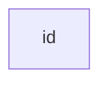

**节点包含文本**

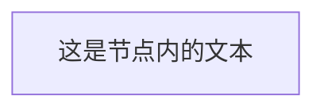

### 节点的形状

可以由不同的标点符号进行组成不同的形状

| 形状           | 形状                         |
| -------------- | ---------------------------- |
| [方形]         | >坐标凹进去的尖角，右边方形] |
| (圆角边缘)     | [/向右边倾斜的平行四边形/]   |
| ([体育场形状]) | [\向左边倾斜的平行四边形\\]  |
| [[子程序形状]] | [/梯形\\]                    |
| [(圆柱形状)]   | [\倒过来的梯形/]             |
| ((圆形))       | {{六边形}}                   |
| {菱形}         |                              |
|                |                              |

中括号[]：方形


小括号()：圆角边缘


小括号里嵌套中括号([])：体育场形状


中括号嵌套[[]]：子程序形状

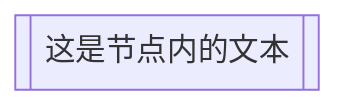

中括号里嵌套小括号[()] ：圆柱形状

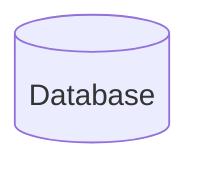

小括号嵌套小括号(())：圆形

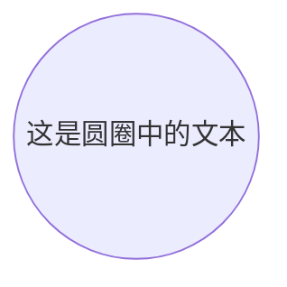


## 流程图的方向

**TB或TD  从上到下** top to down，top to bottom


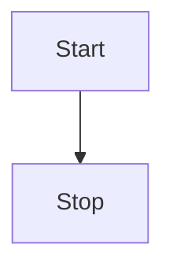
**BT 从下到上**  bottom to top

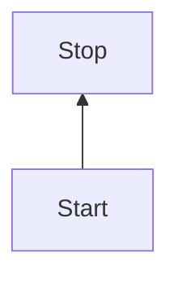

**LR 从左到右** left to right

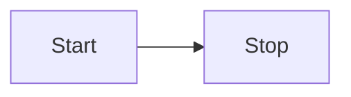

**RL 从右到左** right to left

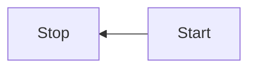

## 节点之间的连接

### 箭头和线的类型

对于虚线或粗链接，要添加的字符是等号或点，如下表所示：

| 长度           | 1      | 2       | 3        |
| -------------- | ------ | ------- | -------- |
| 虚线线无箭头   | `---`  | `----`  | `-----`  |
| 带箭头的虚线线 | `-->`  | `--->`  | `---->`  |
| 双层线         | `===`  | `====`  | `=====`  |
| 带箭头的双层线 | `==>`  | `===>`  | `====>`  |
| 点划线         | `-.-`  | `-..-`  | `-...-`  |
| 带箭头的点划线 | `-.->` | `-..->` | `-...->` |

**带箭头的连接**


**无箭头连接**

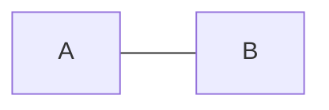

**连接上的文本**


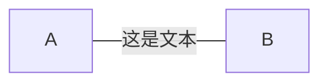


**文本加箭头**

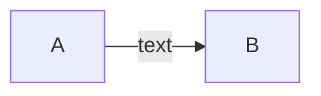


**点线**

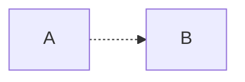

```mermaid
flowchart LR
   A-. text .-> B
```
**等于号作为线**

```mermaid
flowchart LR
   A ==> B
```

```mermaid
flowchart LR
   A == text ==> B
```

### 连续的连接

```mermaid
flowchart LR
   A -- text --> B -- text2 --> C
```

```mermaid
flowchart LR
   a --> b & c--> d
```

```mermaid
flowchart TB
    A & B--> C & D
```

```mermaid
flowchart TB
    A --> C
    A --> D
    B --> C
    B --> D
```

### 新的箭头类型

```mermaid
flowchart LR
    A --o B
    B --x C
```

```mermaid
flowchart LR
    A o--o B
    B <--> C
    C x--x D
```

### 连接多跨几个层级

默认是两个划线-，来连接相邻的层级，每多一个划线-，就多深入一个层级

下图中从B到E，多写了两个个-，就形成了多跨两个个层级的效果。

```mermaid
flowchart TD
    A[Start] --> B{Is it?}
    B -->|Yes| C[OK]
    C --> D[Rethink]
    D --> B
    B ---->|No| E[End]
```

当连接线上需要写文本时，必须在文本的右侧添加短划线，左侧固定两个划线，下图和上图的效果一样

```mermaid
flowchart TD
    A[Start] --> B{Is it?}
    B -- Yes --> C[OK]
    C --> D[Rethink]
    D --> B
    B -- No ----> E[End]
```


## 转义字符

被文本包围的符号不需要转义：

```mermaid
flowchart LR
    id1["This is the (text) in the box"]
```

转义的写法：

```mermaid
    flowchart LR
        A["A double quote:#quot;"] -->B["A dec char:#9829;"]
```


## 子图

### 基本

```
subgraph title
    graph definition
end
```

例子：

```mermaid
flowchart TB
    c1-->a2
    subgraph one
    a1-->a2
    end
    subgraph two
    b1-->b2
    end
    subgraph three
    c1-->c2
    end
```

### 给子图设置ID

```mermaid
flowchart TB
    c1-->a2
    subgraph ide1 [one]
    a1-->a2
    end
```


### 子图的整体之间的连接

可以在end之后，设置子图的整体之间的连接

```mermaid
flowchart TB
    c1-->a2
    subgraph one
    a1-->a2
    end
    subgraph two
    b1-->b2
    end
    subgraph three
    c1-->c2
    end
    one --> two
    three --> two
    two --> c2
```

### 子图中的方向

direction+方向 (typroa不支持)

```mermaid
flowchart LR
  subgraph TOP
    direction TB
    subgraph B1
        direction RL
        i1 -->f1
    end
    subgraph B2
        direction BT
        i2 -->f2
    end
  end
  A --> TOP --> B
  B1 --> B2
```


## 节点的样式

### 基本

给节点局样式：

边框、填充、颜色等

```mermaid
flowchart LR
    id1(Start)-->id2(Stop)
    style id1 fill:#f9f,stroke:#333,stroke-width:4px
    style id2 fill:#bbf,stroke:#f66,stroke-width:2px,color:#fff,stroke-dasharray: 5 5
```


### 给节点类名、并赋予样式

```mermaid
flowchart LR
    A:::someclass --> B
    classDef someclass fill:#f96;
```


定义类似于下面的示例：

```
    classDef className fill:#f9f,stroke:#333,stroke-width:4px;
```

将类附加到节点如下所述：

```
    class nodeId1 className;
```

还可以在一个语句中将类附加到节点列表：

```
    class nodeId1,nodeId2 className;
```


如果某个类被命名为 default，则该类将分配给没有特定类定义的所有类。

```
    classDef default fill:#f9f,stroke:#333,stroke-width:4px;
```


# 时序图sequenceDiagram

```mermaid
sequenceDiagram
    Alice->>John: Hello John, how are you?
    John-->>Alice: Great!
    Alice-->>John: See you later!
```

## 提前声明节点

可以使用participant 提前声明节点，这样更加整洁

```mermaid
sequenceDiagram
    participant Alice
    participant Bob
    Alice->>Bob: Hi Bob
    Bob->>Alice: Hi Alice
```


## 节点别名

```mermaid
sequenceDiagram
    participant A as Alice
    participant J as John
    A->>J: Hello John, how are you?
    J->>A: Great!
```


## 声明角色

小人符号(typroa不支持)

```mermaid
sequenceDiagram
    actor Alice
    actor Bob
    Alice->>Bob: Hi Bob
    Bob->>Alice: Hi Alice
```


1


# 类图

```mermaid
 classDiagram
      Animal <|-- Duck
      Animal <|-- Fish
      Animal <|-- Zebra
      Animal : +int age
      Animal : +String gender
      Animal: +isMammal()
      Animal: +mate()
      class Duck{
          +String beakColor
          +swim()
          +quack()
      }
      class Fish{
          -int sizeInFeet
          -canEat()
      }
      class Zebra{
          +bool is_wild
          +run()
      }

```

# 状态图

```mermaid
stateDiagram-v2
    [*] --> Still
    Still --> [*]

    Still --> Moving
    Moving --> Still
    Moving --> Crash
    Crash --> [*]
```

# 实体关系图

```mermaid
erDiagram
    CUSTOMER ||--o{ ORDER : places
    ORDER ||--|{ LINE-ITEM : contains
    CUSTOMER }|..|{ DELIVERY-ADDRESS : uses
```

# 用户旅程图

```mermaid
journey
    title My working day
    section Go to work
      Make tea: 5: Me
      Go upstairs: 3: Me
      Do work: 1: Me, Cat
    section Go home
      Go downstairs: 5: Me
      Sit down: 5: Me
```

# 甘特图

```mermaid
gantt
    title A Gantt Diagram
    dateFormat  YYYY-MM-DD
    section Section
    A task           :a1, 2014-01-01, 30d
    Another task     :after a1  , 20d
    section Another
    Task in sec      :2014-01-12  , 12d
    another task      : 24d
```

# 饼图

```mermaid
pie title 志愿者收养的宠物
    "Dogs" : 386
    "Cats" : 85
    "Rats" : 15
```

# 需求图(typroa不支持)

```mermaid
requirementDiagram

    requirement test_req {
    id: 1
    text: the test text.
    risk: high
    verifymethod: test
    }

    element test_entity {
    type: simulation
    }

    test_entity - satisfies -> test_req
```

# 案例

graph是基本图，理解为流程图

```mermaid
graph TB
    sq[Square shape] --> ci((Circle shape))

    subgraph A
        od>Odd shape]-- Two line<br/>edge comment --> ro
        di{Diamond with <br/> line break} -.-> ro(Rounded<br>square<br>shape)
        di==>ro2(Rounded square shape)
    end

    %% Notice that no text in shape are added here instead that is appended further down
    e --> od3>Really long text with linebreak<br>in an Odd shape]

    %% Comments after double percent signs
    e((Inner / circle<br>and some odd <br>special characters)) --> f(,.?!+-*ز)

    cyr[Cyrillic]-->cyr2((Circle shape Начало));

     classDef green fill:#9f6,stroke:#333,stroke-width:2px;
     classDef orange fill:#f96,stroke:#333,stroke-width:4px;
     class sq,e green
     class di orange
```

