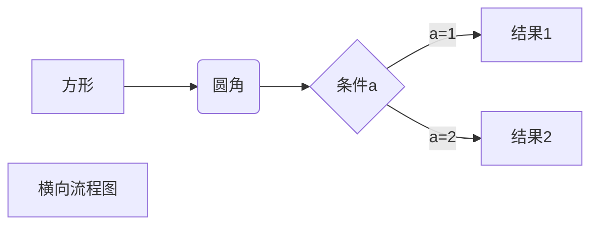
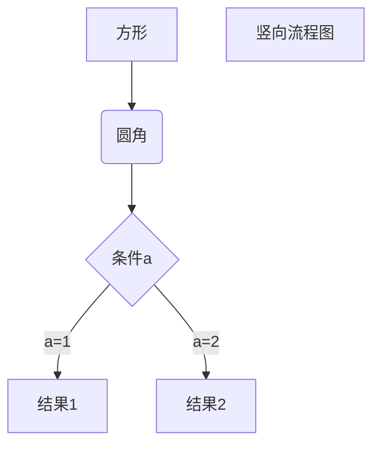
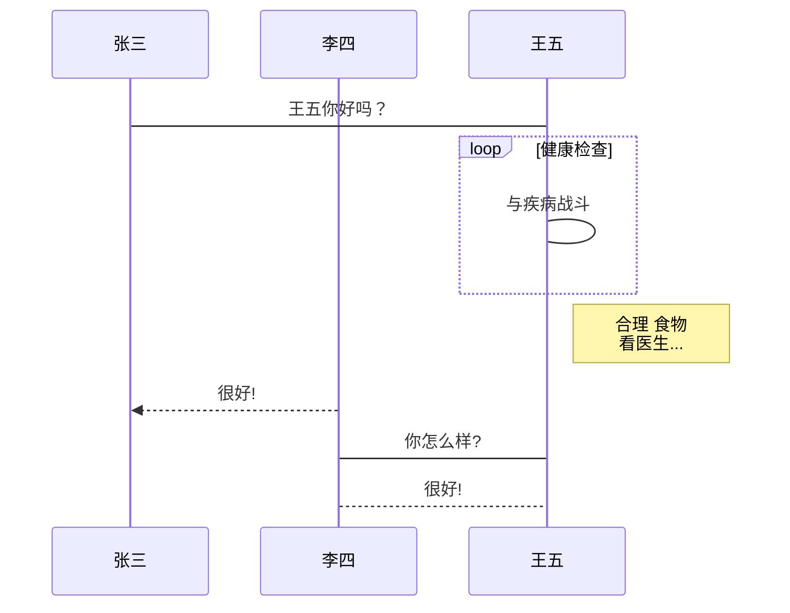
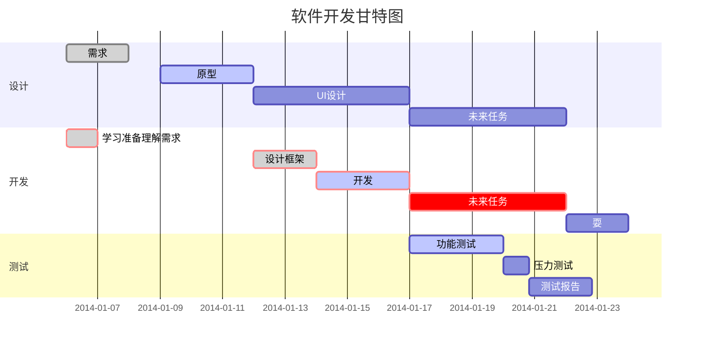
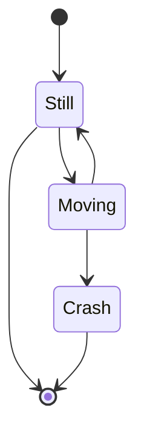
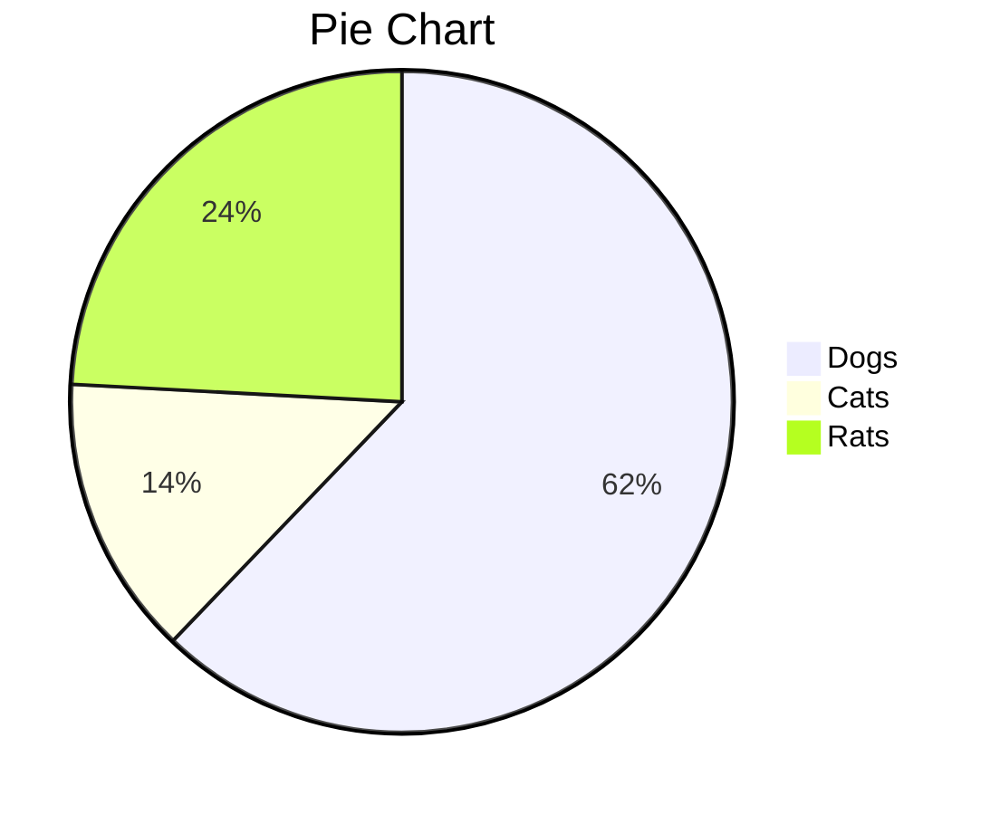

# Markdown语法

分级标题

## 1. 标题

使用几个\# 号就表示几级标题，\#号后面要有空格

<iframe src="//player.bilibili.com/player.html?aid=61966013&bvid=BV1Yt411u7AY&cid=107736162&page=1" scrolling="yes" border="0" frameborder="no" framespacing="0" allowfullscreen="true"> </iframe>

二级标题（使用一排\-号）

-----------------------------------

一级标题使用一排=号

=========================

## 2. 段落格式

### 2.1 段落

段落的换行是使用两个以上空格加上回车

这是段落  

当然也可以在段落后面使用一个空行来表示重新开始一个段落。
这也是段落

### 2.2 字体
*斜体文本*
_斜体文本_
**粗体文本**
__粗体文本__
***粗斜体文本***
___粗斜体文本___

### 2.3 分隔线
 你可以在一行中用三个以上的星号、减号、底线来建立一个分隔线，行内不能有其他东西。你也可以在星号或是减号中间插入空格。下面每种写法都可以建立分隔线：

***

* * *

*****

- - -

----------

### 2.4 删除线

只需要在文字的两端加上两个波浪线 **~~** 即可  

~~这是删除线~~


### 2.5. 下划线

下划线可以通过 HTML 的\<u\>标签来实现：

<u>带下划线文本<u>


### 2.6 脚注

脚注是对文本的补充说明。

Markdown 脚注的格式如下:

```中文
[^要注明的文本]
```

```
创建脚注格式类似这样 [^RUNOOB]。

[^RUNOOB]: 菜鸟教程 -- 学的不仅是技术，更是梦想！！！
```


## 3. 列表

### 3.1 无序列表

无序列表使用星号(*****)、加号(**+**)或是减号(**-**)作为列表标记，这些标记后面要添加一个空格，然后再填写内容：

连续按2次回车取消一次项目

* 第一项
* 第二项
* 第三项

+ 第一项

- 第二项
  -  二级项
    - 三级项
      - 四级项

### 3.2 有序列表

有序列表使用数字并加上 **.** 号来表示，如：

1. 第一项

2. 第二项


### 3.3列表嵌套

列表嵌套只需在子列表中的选项前面添加四个空格或Tab键即可：

1. 第一项
   - 第一项嵌套的第一个元素
   - 第一项嵌套的第二个元素
2. 第二项
   - 第二项嵌套的第一个元素
   - 第二项嵌套的第二个元素

## 4.区块

### 4.1开头使用\>号，后跟空格

Markdown 区块引用是在段落开头使用 **>**符号 ，然后后面紧跟一个**空格**符号：

```
>区块引用
```

### 4.2 区块嵌套

另外区块是可以嵌套的，一个 **>** 符号是最外层，两个 **>** 符号是第一层嵌套，以此类推：

```
> 最外层
> > 第一层嵌套
> > > 第二层嵌套
```

### 4.3区块中使用列表

```
> 区块中使用列表
1. 第一项
2. 第二项
+ 第一项
+ 第二项
+ 第三项
```

### 4.4列表中使用区块

如果要在列表项目内放进区块，那么就需要在 **>** 前添加四个空格的缩进。

区块中使用列表实例如下：

* 第一项

  > 列表区块
  >
  > 列表区块

* 第二项

  > 列表区块


## 5.代码

### 5.1\`包起来\`

如果是段落上的一个函数或片段的代码可以用反引号把它包起来（**`**），例如：

```
`printf()` 函数
```

### 5.2 用\```包裹一段代码

并指定一种语言，可以不指定

```java
class HelloWorld{
	public static void main(String[] args){
		system.out.println("Helloworld");
	}
}

```

## 6.链接

### 6.1中括号内名称小括号内地址或直接尖括号内地址

链接使用方法如下：

```
[链接名称](链接地址)

或者

<链接地址>
```

例如：这是一个链接 [菜鸟教程](https://www.runoob.com)

直接使用链接地址：<https://www.runoob.com>

### 6.2高级链接

我们可以通过变量来设置一个链接，变量赋值在文档末尾进行：

这个链接用 1 作为网址变量 [Google][1]
这个链接用 runoob 作为网址变量 [Runoob][runoob]
然后在文档的结尾为变量赋值（网址）

[1]: http://www.google.com/
[runoob]: http://www.runoob.com/

## 7.图片

```


```

- 开头一个感叹号 !
- 接着一个方括号，里面放上图片的替代文字
- 接着一个普通括号，里面放上图片的网址或本地文件路径，最后还可以用引号包住并加上选择性的 'title' 属性的文字。


当然，你也可以像网址那样对图片网址使用变量:

```
这个链接用 1 作为网址变量 [RUNOOB][1].
然后在文档的结尾为变量赋值（网址）

[1]: http://static.runoob.com/images/runoob-logo.png
```

这个链接用 1 作为网址变量 [RUNOOB][1].
然后在文档的结尾为变量赋值（网址）

[1]: http://static.runoob.com/images/runoob-logo.png


Markdown 还没有办法指定图片的高度与宽度，如果你需要的话，你可以使用普通的  标签。

```

```


## 8.表格

### 8.1使用\|和\-

Markdown 制作表格使用 **|** 来分隔不同的单元格，使用 **-** 来分隔表头和其他行。

语法格式如下：

```
|  表头   | 表头  |
|  ----  | ----  |
| 单元格  | 单元格 |
| 单元格  | 单元格 |
```


|  表头   | 表头  |
|  ----  | ----  |
| 单元格  | 单元格 |
| 单元格  | 单元格 |

### 8.2对齐方式

**我们可以设置表格的对齐方式：**

- **-:** 设置内容和标题栏居右对齐。
- **:-** 设置内容和标题栏居左对齐。
- **:-:** 设置内容和标题栏居中对齐。

实例如下：

```
| 左对齐 | 右对齐 | 居中对齐 |
| :-----| ----: | :----: |
| 单元格 | 单元格 | 单元格 |
| 单元格 | 单元格 | 单元格 |
```


| 左对齐 | 右对齐 | 居中对齐 |
| :-----| ----: | :----: |
| 单元格 | 单元格 | 单元格 |
| 单元格 | 单元格 | 单元格 |

## 9.高级技巧

### 9.1可使用HTML标签

不在 Markdown 涵盖范围之内的标签，都可以直接在文档里面用 HTML 撰写。

目前支持的 HTML 元素有：`<kbd> <b> <i> <em> <sup> <sub> <br>`等 ，如：

```
使用 <kbd>Ctrl</kbd>+<kbd>Alt</kbd>+<kbd>Del</kbd> 重启电脑
```


使用 <kbd>Ctrl</kbd>+<kbd>Alt</kbd>+<kbd>Del</kbd> 重启电脑

### 9.2转义

使用了很多特殊符号来表示特定的意义，如果需要显示特定的符号则需要使用转义字符，Markdown 使用反斜杠转义特殊字符：

**文本加粗** 
\*\* 正常显示星号 \*\*

Markdown 支持以下这些符号前面加上反斜杠来帮助插入普通的符号：

```
\   反斜线
`   反引号
*   星号
_   下划线
{}  花括号
[]  方括号
()  小括号
#   井字号
+   加号
-   减号
.   英文句点
!   感叹号
```

### 9.3公式

当你需要在编辑器中插入数学公式时，可以使用两个美元符 $$ 包裹 TeX 或 LaTeX 格式的数学公式来实现。提交后，问答和文章页会根据需要加载 Mathjax 对数学公式进行渲染。如：

```
$$
\mathbf{V}_1 \times \mathbf{V}_2 =  \begin{vmatrix} 
\mathbf{i} & \mathbf{j} & \mathbf{k} \\
\frac{\partial X}{\partial u} &  \frac{\partial Y}{\partial u} & 0 \\
\frac{\partial X}{\partial v} &  \frac{\partial Y}{\partial v} & 0 \\
\end{vmatrix}
${$tep1}{\style{visibility:hidden}{(x+1)(x+1)}}
$$
```


$$
\mathbf{V}_1 \times \mathbf{V}_2 =  \begin{vmatrix} 
\mathbf{i} & \mathbf{j} & \mathbf{k} \\
\frac{\partial X}{\partial u} &  \frac{\partial Y}{\partial u} & 0 \\
\frac{\partial X}{\partial v} &  \frac{\partial Y}{\partial v} & 0 \\
\end{vmatrix}
${$tep1}{\style{visibility:hidden}{(x+1)(x+1)}}
$$

# 10.画流程图、时序图、甘特图

### 10.1横向流程图源码格式：



### 10.2竖向流程图源码格式


### 10.3标准流程图源码格式：
```flow
st=>start: 开始框
op=>operation: 处理框
cond=>condition: 判断框(是或否?)
sub1=>subroutine: 子流程
io=>inputoutput: 输入输出框
e=>end: 结束框
st->op->cond
cond(yes)->io->e
cond(no)->sub1(right)->op
```

### 10.4标准流程图源码格式（横向）：
```flow
st=>start: 开始框
op=>operation: 处理框
cond=>condition: 判断框(是或否?)
sub1=>subroutine: 子流程
io=>inputoutput: 输入输出框
e=>end: 结束框
st(right)->op(right)->cond
cond(yes)->io(bottom)->e
cond(no)->sub1(right)->op
```

### 10.5UML时序图源码样例：
```sequence
对象A->对象B: 对象B你好吗?（请求）
Note right of 对象B: 对象B的描述
Note left of 对象A: 对象A的描述(提示)
对象B-->对象A: 我很好(响应)
对象A->对象B: 你真的好吗？
```

### 10.6 UML时序图源码复杂样例：
```sequence
Title: 标题：复杂使用
对象A->对象B: 对象B你好吗?（请求）
Note right of 对象B: 对象B的描述
Note left of 对象A: 对象A的描述(提示)
对象B-->对象A: 我很好(响应)
对象B->小三: 你好吗
小三-->>对象A: 对象B找我了
对象A->对象B: 你真的好吗？
Note over 小三,对象B: 我们是朋友
participant C
Note right of C: 没人陪我玩
```
### 10.7UML标准时序图样例：


### 10.8甘特图样例


### 10.9UML类图

https://mermaid-js.github.io/mermaid/#/classDiagram

查看详细教程

````mermaid
classDiagram
      Animal <|-- Duck
      Animal <|-- Fish
      Animal <|-- Zebra
      Animal : +int age
      Animal : +String gender
      Animal: +isMammal()
      Animal: +mate()
      class Duck{
          +String beakColor
          +swim()
          +quack()
      }
      class Fish{
          -int sizeInFeet
          -canEat()
      }
      class Zebra{
          +bool is_wild
          +run()
      }
````

1.定义类

前两个是变量，后两个是类方法，加号表示public，减号表示private

````mermaid
classDiagram
    class BankAccount
    BankAccount : +String owner
    BankAccount : +Bigdecimal balance
    BankAccount : +deposit(amount)
    BankAccount : +withdrawl(amount)
````

或者用大括号

````mermaid
classDiagram
    class BankAccount{
      +String owner
      +BigDecimal balance
      +deposit(amount) bool
      +withdrawl(amount)
    }
````


2.类的继承

````mermaid
classDiagram
    class Animal
    Vehicle <|-- Car
````


### 10.10状态图



### 10.11饼状图

