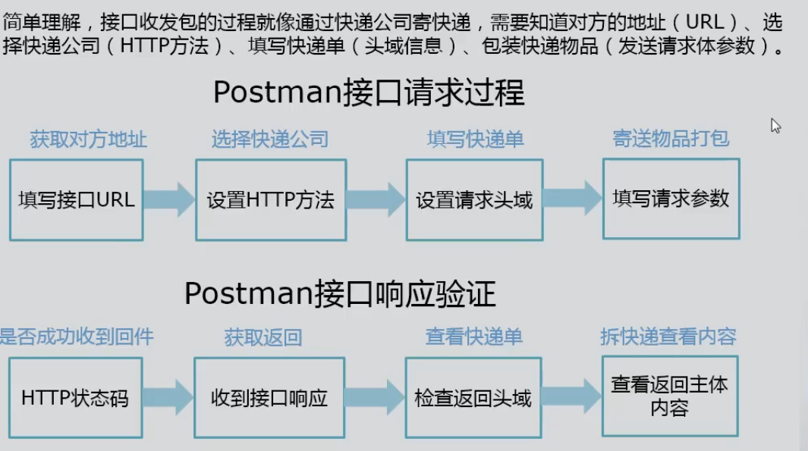

# 安装和基本使用

## 下载

Postman下载Postman分为 **Postman native app**和 Postman Chrome appp两个版本。目前 Chrome app已经停止维护,官方也不推荐使用该版本。因此建议大家直接选择 native appi进行下载。

下载地址:htttps://www.getpostman.com/postman根据自己的操作系统选择对应版本。

## 接口测试

**流程**

- 获取接口信息

  通过接口文档和抓包来获取接口的基本调用方式和返回

- 接口测试用例设计

  根据获取到的接口信息，按照接口测试用例设计方法，设计参数和预期返回结果

- 接口发包

  使用工具或者编程向接口传递参数

- 返回信息验证

  获取接口返回的结果，进行解析和验证

**Postman发起接口请求**

- chrome浏览器F12-network，进行抓包

- 请求部分关注
  - 接口URL地址 Request  URL
  - 请求方法 Request  Method
  - 请求头 Request Headers
  - 请求参数 Query String Parameters
- 响应信息关注Response
  - 状态吗
  - 响应头
  - 响应正文

接口收发包

### 头域操作

需要设置头域的请求

腾讯课堂的评论接口，获取信息时需要添加头域，才能获取正确的评论信息

接口地址:https://ke.qq.com/cgi-bin/comment_new/coursecomment_list

访问地址:https://ke.qq.com/course/315793?tuin=227706b0Post

POST接口实战

使用用友云提供的新发债券查询接口进行测试

接口地址:https://api.yonyoucloud.com/apis/pte/newIssueBondInformation/newIssueBondInformation

接口申请描述地址https://api.yonyoucloud.com/apilink/tempservicepages/b1277b7e-b1e3-445c-818a-cdcd457f298c_true.htmlJson

JSON格式请求发包实战

接口地址:http://api.testzhulogic.com/designer_api/account/login_quick

网站访问地址:http://test.zhulogic.com/login/

## Post接口请求实战

### 请求体与Content-Type头域

之前案例中使用的GET方法接口都是通过在URL中添加请求参数的方式完成参数传递在对使用POST方法的接口进行测试时,需要特别注意请求参数在body中的格式以及请求头中的 Content-type头域,该头域规定了接口接受的请求参数传值格式。

在 Postman请求体中传递参数时,在body菜单中设置请求体的格式。

**x-www-form- urlencode**对应于 Content-type头域为xWWw-form- urlencode的类型,是以键值对形式发送的表单参数,同时参数会携带在ur|中。

**form-data**对应于 Content-type的 multipart/ Form-data类型,既可以发送键值对也可以进行文件参数传递。

**raw**选项中可以使用请求体原始格式编辑各Content-Tγpe类型对应的参数格式,直接按请求体的格式来进行内容发送。

**binary**选项用于发送文件内容请求。