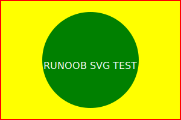

参考资料

[SVG 教程 | 菜鸟教程 (runoob.com)](https://www.runoob.com/svg/svg-tutorial.html)

[十分钟教你用svg做出精美的动画！ - 知乎 (zhihu.com)](https://zhuanlan.zhihu.com/p/351659629)

本来是属于前端的内容，由于svg还可以在markdown中使用(作为图片引用或者svg代码直接渲染)，所以专门来学习下。

# 简介

vscode、typroa等markdown编辑器可以直接渲染svg代码，而一些在线渲染（gitee、github）则不支持

svg作为图片引用，vscode、typroa、github支持，gitee不支持。

概念不讲了，直接看怎么写svg

## svg在markdown中

svg源码：


```html
<svg version="1.1"
  baseProfile="full"
  width="300" height="200"
  xmlns="http://www.w3.org/2000/svg">

  <rect width="100%" height="100%" stroke="red" stroke-width="4" fill="yellow" />

  <circle cx="150" cy="100" r="80" fill="green" />

  <text x="150" y="115" font-size="16" text-anchor="middle" fill="white">RUNOOB SVG TEST</text>

</svg>
```

**svg代码直接渲染(typroa和vscode支持，github和gitee不支持)：**

<svg version="1.1"  baseProfile="full"  width="300" height="200"  xmlns="http://www.w3.org/2000/svg">  <rect width="100%" height="100%" stroke="red" stroke-width="4" fill="yellow" />  <circle cx="150" cy="100" r="80" fill="green" />  <text x="150" y="115" font-size="16" text-anchor="middle" fill="white">RUNOOB SVG TEST</text></svg>

**svg文件作为图片引用(typroa、vscode、github支持，gitee不支持)：**



作为图片引用时，在typroa中显示位置是居中的。

~~**为了便于能够至少在github上显示svg图，以下笔记中，尽量同时采用svg代码块+svg图片引用的方式。**~~

## svg在HTML中

SVG 文件可通过以下标签嵌入 HTML 文档：\<embed>、\<object> 或者 \<iframe>。或者直接在HTML嵌入SVG代码。

```html
<embed src="circle1.svg" type="image/svg+xml" />
<object data="circle1.svg" type="image/svg+xml"></object>
<iframe src="circle1.svg"></iframe>
```
直接在HTML嵌入SVG代码：
```html
<svg xmlns="http://www.w3.org/2000/svg" version="1.1">
   <circle cx="100" cy="50" r="40" stroke="black" stroke-width="2" fill="red" />
</svg>
```

a标签链接到 SVG 文件：

```html
<a href="circle1.svg">查看 SVG 文件</a>
```

# 多边形

```
矩形 <rect>
圆形 <circle>
椭圆 <ellipse>
线 <line>
折线 <polyline>
多边形 <polygon>·
路径 <path>
```

## 矩形

```html
<svg xmlns="http://www.w3.org/2000/svg" version="1.1">  <rect width="300" height="100"  style="fill:rgb(0,0,255);stroke-width:1;stroke:rgb(0,0,0)"/></svg>
```


- rect 元素的 width 和 height 属性可定义矩形的高度和宽度
- style 属性用来定义 CSS 属性
- CSS 的 fill 属性定义矩形的填充颜色（rgb 值、颜色名或者十六进制值）
- CSS 的 stroke-width 属性定义矩形边框的宽度
- CSS 的 stroke 属性定义矩形边框的颜色

```html
<svg xmlns="http://www.w3.org/2000/svg" version="1.1">  <rect x="50" y="20" width="150" height="150"  style="fill:blue;stroke:pink;stroke-width:5;fill-opacity:0.1;  stroke-opacity:0.9"/></svg>
```


- x 属性定义矩形的左侧位置（例如，x="0" 定义矩形到浏览器窗口左侧的距离是 0px）
- y 属性定义矩形的顶端位置（例如，y="0" 定义矩形到浏览器窗口顶端的距离是 0px）
- CSS 的 fill-opacity 属性定义填充颜色透明度（合法的范围是：0 - 1）
- CSS 的 stroke-opacity 属性定义轮廓颜色的透明度（合法的范围是：0 - 1）


## 圆形

## 椭圆

## 线


1
