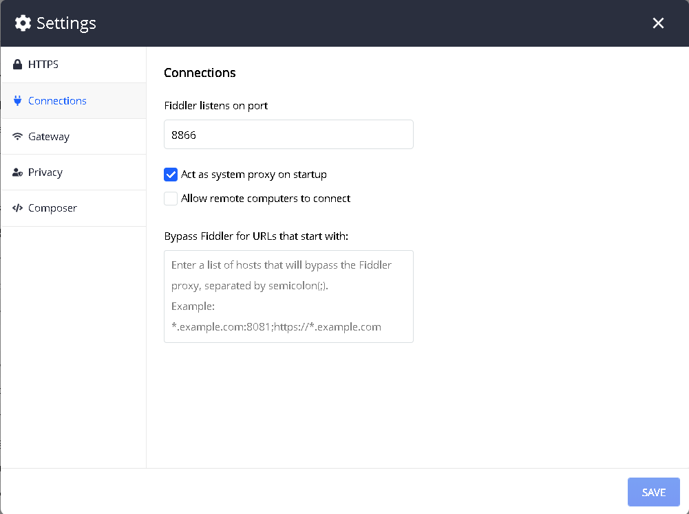
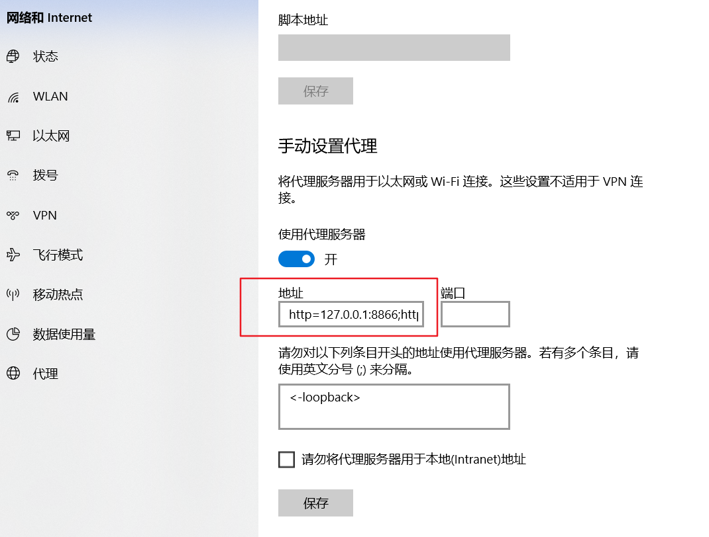
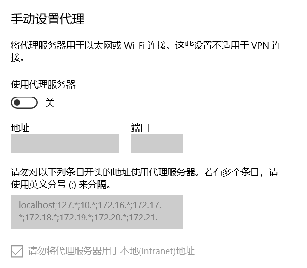
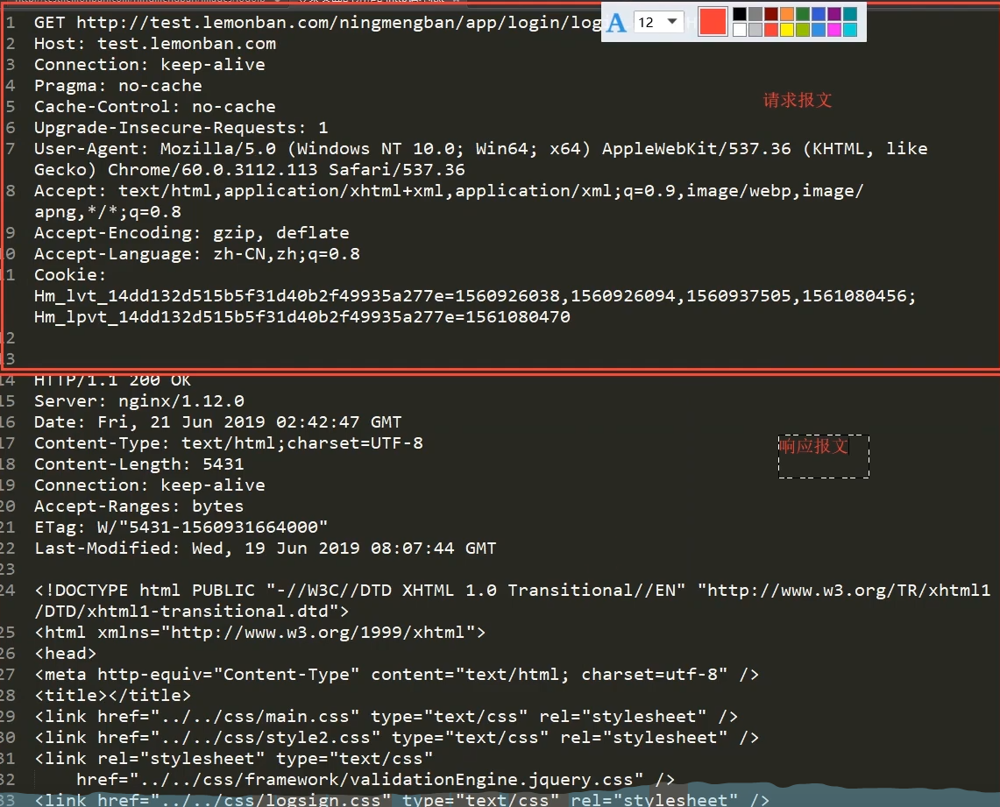
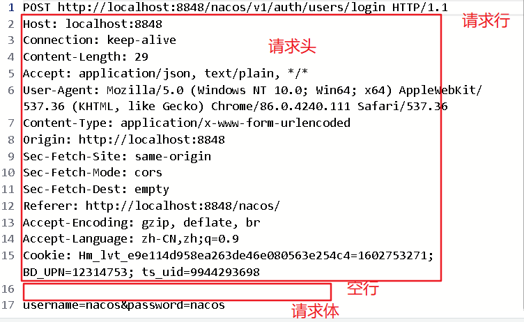
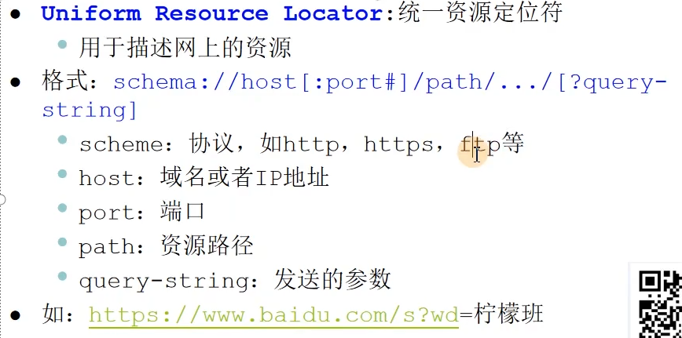
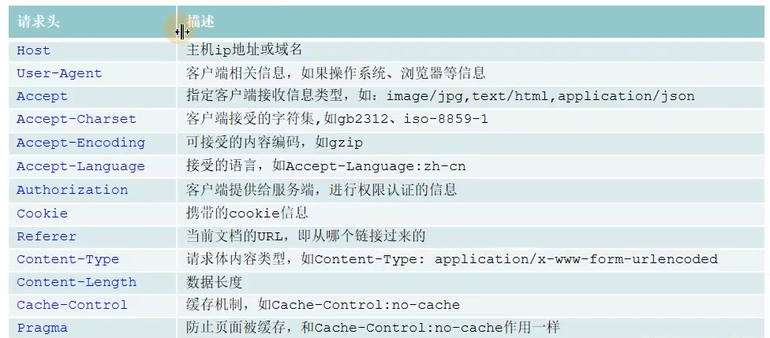
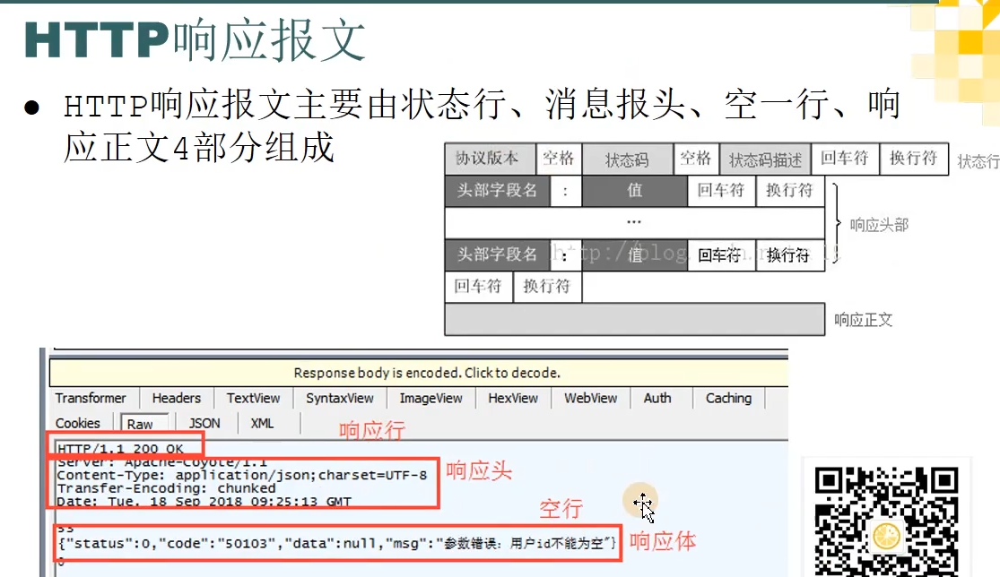
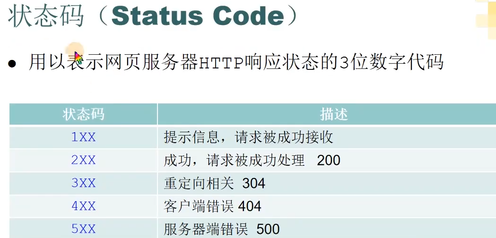
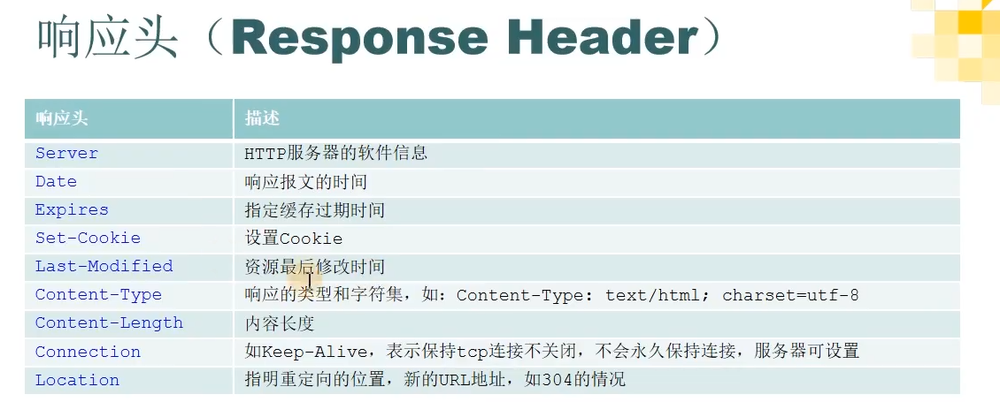

# Fiddler

## 简介

本意：拉小提琴的人，骗子

Fiddler是位于客户端和服务器端的HTTP代理

目前最常用的http抓包工具之功能非常强大,是web调试的利器。

- 监控浏览器所有的HTTP/HTTPS流量
- 査看、分析请求内容细节
- 伪造客户端请求和服务器响应
- 测试网站的性能
- 解密HTTPS的web会话
- 全局、局部断点功能
- 第三方插件

场景使用场景:

- 接口调试、接口泇试、线上环境测试、web性能分析
- 判断前后端bug，开发环境hosts配置、mock、弱网断网测试

## Fiddler原理

**客户端---Fiddler---服务器**

打开软件后，就自动设置了代理

这是软件默认的设置：

这是查看windows代理设置界面：

将Fiddler关闭后就自动关闭了代理：

完整的http报文包含请求和响应两块内容

## HTTP请求报文

### 请求方法（Request Method）

| 请求方法 | 备注                                 |
| -------- | ------------------------------------ |
| GET      | 请求资源                             |
| POST     | 提交资源                             |
| Head     | 获取响应头                           |
| PUT      | 替换资源                             |
| DELETE   | 删除资源                             |
| OPTIONS  | 允许客户端查看服务器的性能           |
| TRACE    | 回显服务器收到的请求，用于测试或诊断 |

请求方法不是严格要求用哪种的，比如，登录时一般用POST发送用户名和密码，用GET请求也可以

### URL统一资源定位符

### 请求头（Request Header）

常见的请求头：

不一定是这些，可以是任意内容

Referer作用之一是防止盗链

## 响应报文

响应体可以没有

